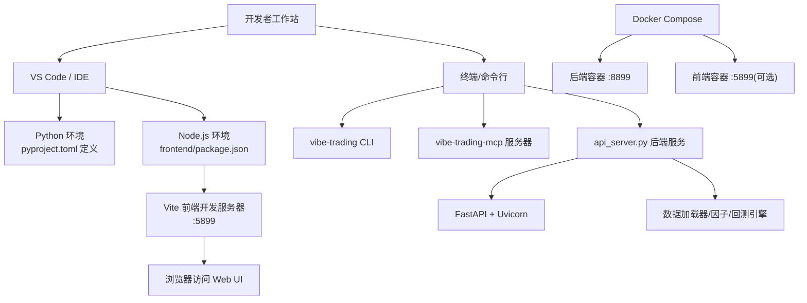
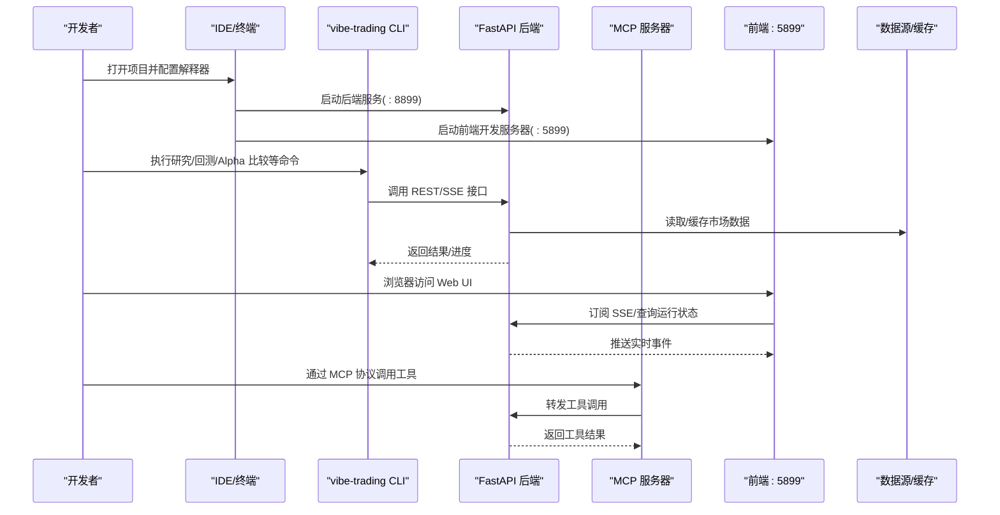
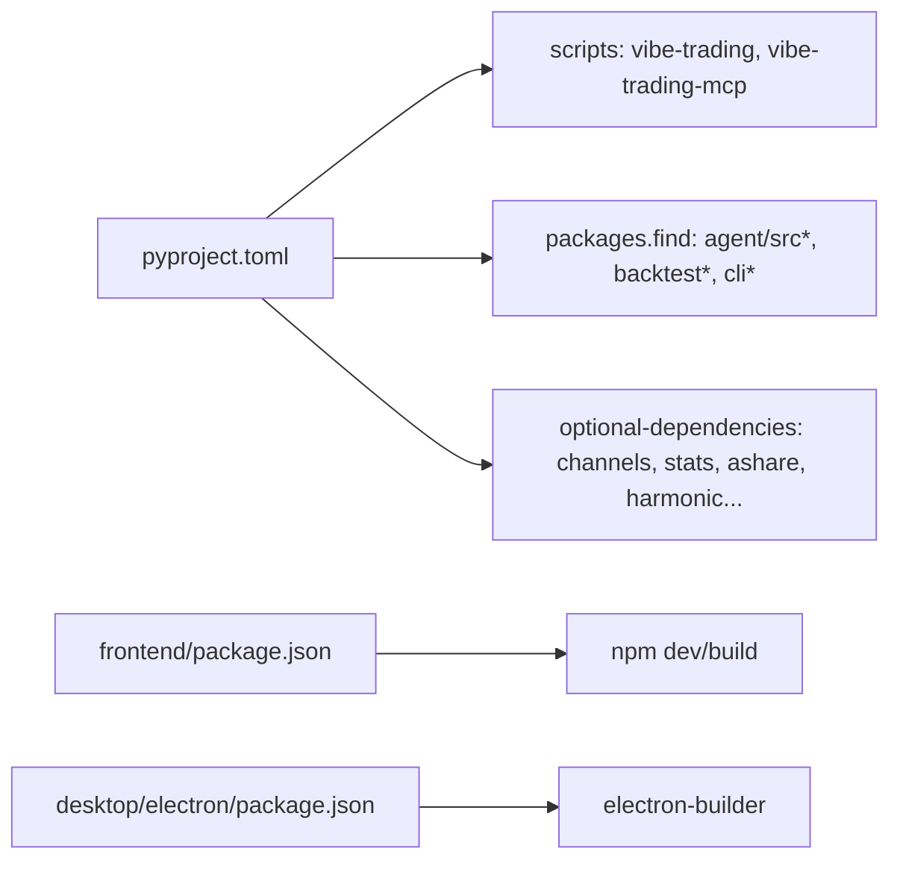

# 源码开发环境搭建

<cite>
**本文引用的文件**
- [README.md](file://README.md)
- [README_zh.md](file://README_zh.md)
- [pyproject.toml](file://pyproject.toml)
- [agent/requirements.txt](file://agent/requirements.txt)
- [.devcontainer/devcontainer.json](file://.devcontainer/devcontainer.json)
- [Dockerfile](file://Dockerfile)
- [docker-compose.yml](file://docker-compose.yml)
- [CONTRIBUTING.md](file://CONTRIBUTING.md)
- [start.bat](file://start.bat)
- [sync.bat](file://sync.bat)
- [tools/ci_grep_gates.sh](file://tools/ci_grep_gates.sh)
</cite>

## 目录
1. [简介](#简介)
2. [项目结构](#项目结构)
3. [核心组件](#核心组件)
4. [架构总览](#架构总览)
5. [详细组件分析](#详细组件分析)
6. [依赖关系分析](#依赖关系分析)
7. [性能与可维护性建议](#性能与可维护性建议)
8. [故障排查指南](#故障排查指南)
9. [结论](#结论)
10. [附录：常用命令速查](#附录：常用命令速查)

## 简介
本指南面向希望在本地快速搭建 Vibe-Trading 源码开发环境的开发者，覆盖从克隆仓库、安装依赖、IDE 调试配置到日常开发工作流（格式化、类型检查、测试）的完整流程。同时解释后端 Python 服务、前端 Web UI、MCP 服务器、Electron 桌面端以及容器化部署之间的关系，帮助你在最短时间进入编码与调试状态。

## 项目结构
Vibe-Trading 采用前后端分离的多模块工程：
- 后端 Python 服务与 CLI/MCP 入口位于 agent 目录，通过 pyproject.toml 打包为可安装包，提供 REST API、SSE 事件流、CLI 工具与 MCP 服务器。
- 前端 React + Vite 位于 frontend 目录，默认开发端口 5899，生产构建产物由后端静态托管。
- Electron 桌面壳位于 desktop/electron，负责在 Windows 等平台上启动后端并安全地管理凭据。
- 容器化支持通过 Dockerfile 与 docker-compose.yml 提供一键运行与开发联调。
- 根目录脚本 start.bat/sync.bat 提供 Windows 下的一键启动与同步更新。

**图表来源**
- [pyproject.toml:77-87](file://pyproject.toml#L77-L87)
- [Dockerfile:1-119](file://Dockerfile#L1-L119)
- [docker-compose.yml:1-90](file://docker-compose.yml#L1-L90)

**章节来源**
- [pyproject.toml:1-104](file://pyproject.toml#L1-L104)
- [Dockerfile:1-119](file://Dockerfile#L1-L119)
- [docker-compose.yml:1-90](file://docker-compose.yml#L1-L90)

## 核心组件
- Python 包与入口
  - 包名 vibe-trading-ai，版本 0.1.13，要求 Python 3.11–3.13。
  - 暴露两个命令行入口：vibe-trading（CLI）、vibe-trading-mcp（MCP 服务器）。
  - 包内容组织在 agent 目录，包含 src、backtest、cli 等子包。
- 前端
  - 基于 Vite + React，开发端口 5899，生产构建后由后端静态托管。
- 容器化
  - 多阶段构建：先构建前端，再构建 Python venv，最后生成最小运行时镜像。
  - 默认暴露 8899 端口，健康检查指向 /live。
- 桌面端
  - Electron 应用封装后端进程，提供安全的凭据管理与跨平台分发。

**章节来源**
- [pyproject.toml:1-87](file://pyproject.toml#L1-L87)
- [Dockerfile:1-119](file://Dockerfile#L1-L119)
- [desktop/electron/package.json:21-85](file://desktop/electron/package.json#L21-L85)

## 架构总览
下图展示了开发环境与运行时的关键交互：
- 开发者通过 VS Code 或 IDE 直接运行后端与前端；或通过 Docker Compose 启动容器化服务。
- CLI 与 MCP 服务器作为后端能力对外暴露，供 Agent、Web UI、外部系统调用。
- 数据层通过多种数据源加载器获取行情与基本面数据，支撑回测与因子计算。

**图表来源**
- [pyproject.toml:77-87](file://pyproject.toml#L77-L87)
- [docker-compose.yml:1-90](file://docker-compose.yml#L1-L90)

## 详细组件分析

### 开发环境准备（Python + Node）
- 推荐方式一：使用 Dev Container
  - 基于 mcr.microsoft.com/devcontainers/python:1-3.11-bookworm，自动安装 Node 20。
  - 自动安装 Python 包与前端依赖，并映射端口 8899（API）与 5899（前端）。
  - VS Code 扩展推荐：Python、Pylance、ESLint、Prettier。
- 推荐方式二：本地虚拟环境
  - 使用 Python 3.11+ 创建 venv，安装 editable 模式与开发依赖。
  - 在 frontend 目录安装 Node 依赖并启动开发服务器。
- 容器方式
  - 使用 docker-compose 启动后端与可选的前端开发服务，持久化用户数据与运行记录。

**章节来源**
- [.devcontainer/devcontainer.json:1-40](file://.devcontainer/devcontainer.json#L1-L40)
- [docker-compose.yml:1-90](file://docker-compose.yml#L1-L90)
- [pyproject.toml:105-237](file://pyproject.toml#L105-L237)

### 依赖管理与锁定
- 核心依赖声明于 pyproject.toml 与 agent/requirements.txt，二者保持一致。
- 生产镜像使用哈希锁定的 requirements-lock.txt 与 channels lock 文件，确保可重复构建。
- 可选功能通过 extras 安装，如 ibkr、anthropic、openbb、channels、stats、ashare、harmonic 等。
- 开发工具通过 dev extra 安装 black、ruff、pytest 等。

**章节来源**
- [pyproject.toml:24-69](file://pyproject.toml#L24-L69)
- [pyproject.toml:105-237](file://pyproject.toml#L105-L237)
- [agent/requirements.txt:1-69](file://agent/requirements.txt#L1-L69)
- [Dockerfile:31-54](file://Dockerfile#L31-L54)

### IDE 调试配置
- VS Code 远程容器
  - 使用 .devcontainer/devcontainer.json 提供的 image、features、forwardPorts、postCreateCommand。
  - 设置 python.defaultInterpreterPath 指向容器内 Python。
- 本地调试
  - 将项目根路径加入 Python 搜索路径，确保 import agent.* 正确解析。
  - 启动 api_server.py 并附加调试器；前端通过 npm run dev 启动。
- 断点与日志
  - 建议在数据加载器、回测引擎、API 路由处设置断点。
  - 关注 SSE 事件流与工具调用 trace，便于定位问题。

**章节来源**
- [.devcontainer/devcontainer.json:1-40](file://.devcontainer/devcontainer.json#L1-L40)
- [pyproject.toml:81-87](file://pyproject.toml#L81-L87)

### 代码格式化与类型检查
- 格式化：black（范围已限定，避免整仓格式变更混入 PR）。
- 代码质量：ruff（lint 规则在 pyproject.toml 中配置）。
- 类型注解：公共函数与方法需标注类型签名。
- 文档风格：Google 风格 docstrings（Args/Returns/Raises）。

**章节来源**
- [CONTRIBUTING.md:140-156](file://CONTRIBUTING.md#L140-L156)
- [pyproject.toml:283-314](file://pyproject.toml#L283-L314)

### 单元测试执行
- 测试路径：agent/tests。
- 标记：unit（快速无网络）、integration（可能联网）。
- 覆盖率：coverage 配置排除测试与 __init__.py。
- 建议：新增或修改逻辑后，优先运行相关 unit 测试；涉及网络或外部依赖时使用 integration 标记。

**章节来源**
- [pyproject.toml:275-304](file://pyproject.toml#L275-L304)

### 常用开发与运行命令
- 安装与开发环境
  - pip install -e ".[dev]" 安装可编辑模式与开发工具。
  - cd frontend && npm install 安装前端依赖。
- 启动服务
  - 后端：python api_server.py（或 vibe-trading serve）。
  - 前端：cd frontend && npm run dev。
  - Windows 一键启动：start.bat。
- 测试与质量
  - pytest agent/tests -m unit 运行单元用例。
  - black --check ... 与 ruff check ... 进行格式与 lint 检查。
- 容器化
  - docker compose up 启动后端与可选前端。
  - 健康检查：curl http://localhost:8899/live。

**章节来源**
- [pyproject.toml:77-87](file://pyproject.toml#L77-L87)
- [start.bat:1-30](file://start.bat#L1-L30)
- [docker-compose.yml:1-90](file://docker-compose.yml#L1-L90)
- [Dockerfile:110-119](file://Dockerfile#L110-L119)

### 贡献流程与规范
- DCO 签名：所有社区 PR 的每个提交必须包含 Signed-off-by:。
- Alpha 因子审查清单：纯度门、前视泄漏门、元信息完整性、compute 契约、LaTeX 与代码一致、许可证与归属。
- 代码风格：black + ruff，类型注解，Google 风格 docstrings，文件长度限制。
- 提交流程：分支策略遵循 Git 常规实践，PR 需通过 CI 与 reviewer 检查。

**章节来源**
- [CONTRIBUTING.md:18-42](file://CONTRIBUTING.md#L18-L42)
- [CONTRIBUTING.md:85-138](file://CONTRIBUTING.md#L85-L138)
- [CONTRIBUTING.md:140-156](file://CONTRIBUTING.md#L140-L156)

## 依赖关系分析
- 包入口与发现
  - scripts 定义 vibe-trading 与 vibe-trading-mcp 入口。
  - setuptools.packages.find 指定 agent 目录下的 src*/backtest*/cli* 纳入包。
- 可选依赖
  - 各通道 SDK（dingtalk、discord、feishu、matrix、mochat、msteams、napcat、qq、slack、telegram、wecom、weixin、whatsapp）通过 channels extra 聚合。
  - 其他可选：ibkr、longbridge、mt5、deepseek、copilot、anthropic、openbb、krx、stats、ashare、harmonic。
- 前端与桌面端
  - frontend/package.json 管理 Node 依赖与构建脚本。
  - desktop/electron/package.json 管理 Electron 打包与语言资源。

**图表来源**
- [pyproject.toml:77-87](file://pyproject.toml#L77-L87)
- [pyproject.toml:105-237](file://pyproject.toml#L105-L237)
- [desktop/electron/package.json:21-85](file://desktop/electron/package.json#L21-L85)

**章节来源**
- [pyproject.toml:77-87](file://pyproject.toml#L77-L87)
- [pyproject.toml:105-237](file://pyproject.toml#L105-L237)
- [desktop/electron/package.json:21-85](file://desktop/electron/package.json#L21-L85)

## 性能与可维护性建议
- 数据缓存
  - 启用 VIBE_TRADING_DATA_CACHE 可缓存历史行情，减少网络请求与速率限制影响。
- 并行与向量化
  - 因子计算与信号对齐使用向量化与并行优化，注意内存占用与任务粒度。
- 容器资源限制
  - docker-compose 中设置 mem_limit、cpus、pids_limit，防止单任务耗尽资源。
- 可观测性
  - 利用 SSE 事件与运行卡片跟踪工具调用与中间结果，便于定位瓶颈。

**章节来源**
- [docker-compose.yml:40-66](file://docker-compose.yml#L40-L66)

## 故障排查指南
- 依赖冲突
  - 使用 requirements-lock.txt 与 channels lock 保证可重复构建；必要时重新生成锁文件。
  - 若出现导入失败，确认是否安装了相应 optional extra（如 anthropic、openbb、channels）。
- 路径配置
  - 确保 Python 搜索路径包含 agent 目录；VS Code 解释器指向正确的 venv 或容器内 Python。
  - 前端开发服务器端口 5899，后端 8899；若被占用，调整端口或停止冲突进程。
- IDE 集成
  - 在 Dev Container 中，postCreateCommand 会安装依赖；若失败，检查网络与镜像拉取。
  - ESLint/Prettier 需在 frontend 目录生效；确保 node_modules 已安装。
- 容器与健康检查
  - 使用 curl http://localhost:8899/live 验证后端存活；查看容器日志定位启动错误。
  - 若 Ollama 连接失败，检查 OLLAMA_BASE_URL 与 host.docker.internal 映射。
- 常见脚本
  - Windows 一键启动：start.bat；同步官方最新代码：sync.bat。
  - CI 辅助脚本：tools/ci_grep_gates.sh 用于环境变量门禁检查。

**章节来源**
- [Dockerfile:70-119](file://Dockerfile#L70-L119)
- [docker-compose.yml:1-90](file://docker-compose.yml#L1-L90)
- [start.bat:1-30](file://start.bat#L1-L30)
- [sync.bat:1-33](file://sync.bat#L1-L33)
- [tools/ci_grep_gates.sh:1-200](file://tools/ci_grep_gates.sh#L1-L200)

## 结论
通过上述步骤，你可以在本地或容器中快速搭建 Vibe-Trading 的开发环境，理解前后端与 MCP 的协作关系，掌握格式化、类型检查与测试的工作流，并依据贡献规范参与代码改进。遇到问题时，可参考故障排查指南逐步定位。

## 附录：常用命令速查
- 安装与初始化
  - pip install -e ".[dev]"
  - cd frontend && npm install
- 启动服务
  - python api_server.py 或 vibe-trading serve
  - cd frontend && npm run dev
  - start.bat（Windows 一键启动）
- 测试与质量
  - pytest agent/tests -m unit
  - black --check <files>
  - ruff check <files>
- 容器化
  - docker compose up
  - curl http://localhost:8899/live

**章节来源**
- [pyproject.toml:77-87](file://pyproject.toml#L77-L87)
- [start.bat:1-30](file://start.bat#L1-L30)
- [docker-compose.yml:1-90](file://docker-compose.yml#L1-L90)
- [Dockerfile:110-119](file://Dockerfile#L110-L119)