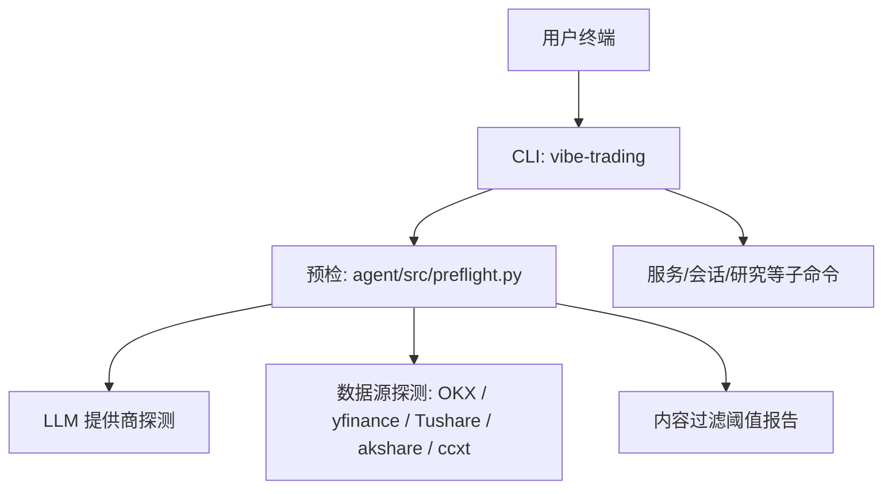
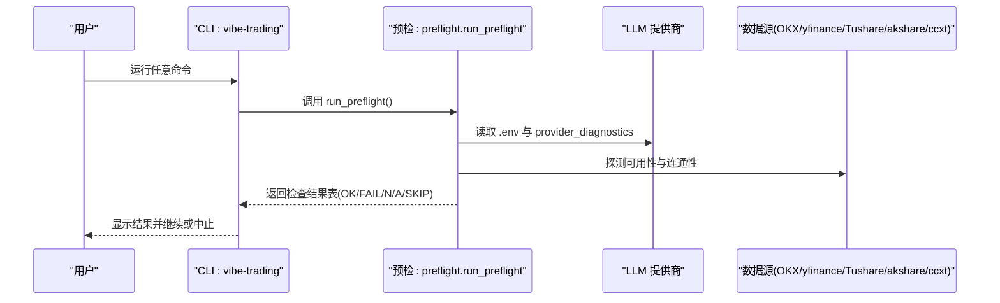
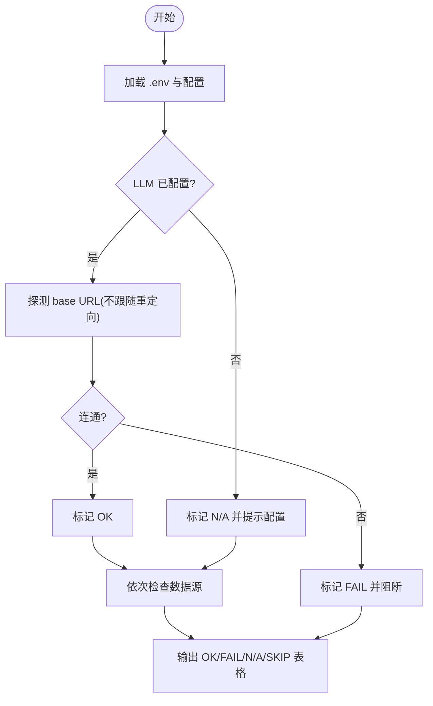
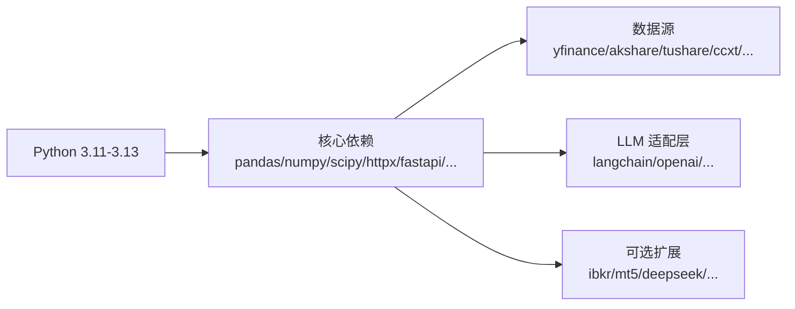

# 安装问题

<cite>
**本文引用的文件**
- [pyproject.toml](file://pyproject.toml)
- [requirements-lock.txt](file://requirements-lock.txt)
- [Dockerfile](file://Dockerfile)
- [agent/src/preflight.py](file://agent/src/preflight.py)
- [agent/tests/test_preflight.py](file://agent/tests/test_preflight.py)
- [agent/cli/main.py](file://agent/cli/main.py)
- [README.md](file://README.md)
</cite>

## 目录
1. [简介](#简介)
2. [项目结构](#项目结构)
3. [核心组件](#核心组件)
4. [架构总览](#架构总览)
5. [详细组件分析](#详细组件分析)
6. [依赖关系分析](#依赖关系分析)
7. [性能与兼容性注意事项](#性能与兼容性注意事项)
8. [故障排除指南](#故障排除指南)
9. [结论](#结论)
10. [附录](#附录)

## 简介
本指南聚焦于 Vibe-Trading 的安装阶段常见问题与排错方法，覆盖 Python 版本与虚拟环境、依赖冲突（pip/conda）、网络代理与离线安装、模块导入失败、C 扩展编译错误、权限不足等。同时提供预检工具使用与结果解读，帮助你快速定位并修复环境问题。

## 项目结构
- Python 包与命令入口由 pyproject.toml 定义，CLI 命令为 vibe-trading、vibe-trading-mcp。
- 运行时依赖通过 requirements-lock.txt 锁定，确保可重复构建。
- Dockerfile 演示了“构建期”和“运行期”分离的镜像策略：构建期安装编译工具链，运行期仅携带必要库与字体。
- 启动前会执行预检（preflight），检查 LLM 提供商、数据源可达性与内容过滤阈值等。

图表来源
- [agent/src/preflight.py:284-336](file://agent/src/preflight.py#L284-L336)
- [agent/cli/main.py:1-20](file://agent/cli/main.py#L1-L20)

章节来源
- [pyproject.toml:84-90](file://pyproject.toml#L84-L90)
- [Dockerfile:14-59](file://Dockerfile#L14-L59)
- [agent/src/preflight.py:284-336](file://agent/src/preflight.py#L284-L336)

## 核心组件
- 预检系统：在启动时检查关键依赖与外部可达性，输出 OK/FAIL/N/A/SKIP 状态，并对关键项（如 LLM 提供商）进行阻断式提示。
- 依赖锁定：requirements-lock.txt 提供带哈希的精确版本，便于离线与可重现安装。
- 容器化：Dockerfile 将编译依赖与运行依赖分离，避免运行镜像过大且缺少编译工具。

章节来源
- [agent/src/preflight.py:21-30](file://agent/src/preflight.py#L21-L30)
- [requirements-lock.txt:1-6](file://requirements-lock.txt#L1-L6)
- [Dockerfile:14-59](file://Dockerfile#L14-L59)

## 架构总览
下图展示从 CLI 到预检再到各数据源/提供商的检查流程。

图表来源
- [agent/src/preflight.py:32-153](file://agent/src/preflight.py#L32-L153)
- [agent/src/preflight.py:156-271](file://agent/src/preflight.py#L156-L271)
- [agent/src/preflight.py:284-336](file://agent/src/preflight.py#L284-L336)

## 详细组件分析

### 预检系统与状态标识
- 状态标识含义
  - OK：就绪，功能正常。
  - FAIL：错误，通常阻塞或影响功能。
  - N/A：未配置，需要设置环境变量或密钥。
  - SKIP：跳过，可选依赖未安装，不影响基础功能。
- 关键检查项
  - LLM 提供商：读取 .env 中的 LANGCHAIN_PROVIDER/LANGCHAIN_MODEL_NAME，必要时校验 OAuth/Copilot 登录状态；对 base URL 进行不跟随重定向的连通性探测。
  - 数据源：OKX 公开 API 可达性、yfinance 可用性、Tushare token 配置、akshare/ccxt 是否安装。
  - 内容过滤阈值：读取并报告当前阈值。
- 结果输出：以表格形式打印，并在存在关键失败时给出阻断提示。

图表来源
- [agent/src/preflight.py:32-153](file://agent/src/preflight.py#L32-L153)
- [agent/src/preflight.py:274-336](file://agent/src/preflight.py#L274-L336)

章节来源
- [agent/src/preflight.py:21-30](file://agent/src/preflight.py#L21-L30)
- [agent/src/preflight.py:32-153](file://agent/src/preflight.py#L32-L153)
- [agent/src/preflight.py:156-271](file://agent/src/preflight.py#L156-L271)
- [agent/src/preflight.py:274-336](file://agent/src/preflight.py#L274-L336)
- [agent/tests/test_preflight.py:12-31](file://agent/tests/test_preflight.py#L12-L31)
- [agent/tests/test_preflight.py:120-156](file://agent/tests/test_preflight.py#L120-L156)

### CLI 入口与环境变量
- 命令入口：pyproject.toml 注册 vibe-trading、vibe-trading-mcp。
- 交互式 CLI 会在无 .env 时引导 onboarding，并支持 serve/dev 等子命令。
- 环境变量优先级：~/.vibe-trading/.env、项目根 .env、当前工作目录 .env。

章节来源
- [pyproject.toml:84-90](file://pyproject.toml#L84-L90)
- [agent/cli/main.py:1-20](file://agent/cli/main.py#L1-L20)
- [agent/cli/main.py:100-103](file://agent/cli/main.py#L100-L103)

### 依赖锁定与离线安装
- 依赖锁定：requirements-lock.txt 由 pip-compile 生成，包含每个包的哈希值，用于可重现安装。
- 离线安装：在有网络的机器上生成 wheel 与缓存，再拷贝到目标机离线安装；或使用 --no-index 配合本地缓存。
- 注意：某些包含 C 扩展，需匹配平台与 Python 版本，否则可能触发源码编译失败。

章节来源
- [requirements-lock.txt:1-6](file://requirements-lock.txt#L1-L6)

### 容器化与编译依赖
- Dockerfile 将编译期依赖（build-essential）放在 builder 阶段，运行期镜像仅包含必要的共享库与字体，避免运行期编译失败。
- 若本地安装遇到 C 扩展编译错误，请确认已安装系统级编译工具链与头文件。

章节来源
- [Dockerfile:14-59](file://Dockerfile#L14-L59)
- [Dockerfile:73-86](file://Dockerfile#L73-L86)

## 依赖关系分析
- Python 版本要求：requires-python 指定 >=3.11,<3.14，建议使用 3.11/3.12/3.13。
- 核心依赖：pandas、numpy、scipy、httpx、fastapi、uvicorn、ccxt、yfinance、akshare、tushare 等。
- 可选依赖：ibkr、mt5、deepseek、anthropic、openbb、krx、stats、ashare、harmonic、channels 等，按需安装以减少冲突。

图表来源
- [pyproject.toml:1-23](file://pyproject.toml#L1-L23)
- [pyproject.toml:24-69](file://pyproject.toml#L24-L69)
- [pyproject.toml:105-237](file://pyproject.toml#L105-L237)

章节来源
- [pyproject.toml:1-23](file://pyproject.toml#L1-L23)
- [pyproject.toml:24-69](file://pyproject.toml#L24-L69)
- [pyproject.toml:105-237](file://pyproject.toml#L105-L237)

## 性能与兼容性注意事项
- 优先使用官方提供的 requirements-lock.txt 进行安装，避免版本漂移导致的兼容性问题。
- 在 Windows 上安装含 C 扩展的包时，确保 Visual Studio Build Tools 或等价编译器可用。
- 使用 venv 隔离环境，避免与系统或其他项目冲突。
- 如需加速下载，可配置 pip 镜像或代理；但预检会按实际代理设置探测连通性。

[本节为通用指导，无需特定文件引用]

## 故障排除指南

### 一、Python 版本兼容性检查
- 现象：安装时报不支持的 Python 版本或无法解析依赖。
- 处理：
  - 确认 Python 版本在 3.11 至 3.13 之间。
  - 使用 venv 创建干净环境后重试。
  - 若升级后出现导入失败（例如 langgraph），重建 venv 或强制重装。

章节来源
- [pyproject.toml:1-23](file://pyproject.toml#L1-L23)
- [README.md:911-935](file://README.md#L911-L935)

### 二、依赖包冲突解决（pip 与 conda）
- 现象：依赖解析失败、版本冲突、导入时报版本不匹配。
- 处理：
  - 优先使用 requirements-lock.txt 进行安装，保证版本一致。
  - 在 pip 中启用哈希校验安装（如使用 --require-hashes）。
  - 在 conda 环境中，先清理旧环境，再用 pip 安装锁定依赖。
  - 对于可选功能（如 A 股、统计、通道等），按需安装对应 extra，减少无关依赖。

章节来源
- [requirements-lock.txt:1-6](file://requirements-lock.txt#L1-L6)
- [pyproject.toml:105-237](file://pyproject.toml#L105-L237)

### 三、虚拟环境配置问题
- 现象：命令找不到、模块导入失败、路径污染。
- 处理：
  - 使用 python -m venv 创建独立环境并激活。
  - 确保激活后的 pip/python 指向该环境。
  - 在项目中重新安装依赖，避免全局污染。

[本节为通用指导，无需特定文件引用]

### 四、模块导入失败
- 现象：启动时报 ImportError 或 ModuleNotFoundError。
- 处理：
  - 检查是否安装了所需包（尤其是可选依赖）。
  - 使用预检命令查看哪些模块被跳过或未安装。
  - 若因升级导致导入失败，重建 venv 或强制重装。

章节来源
- [agent/src/preflight.py:184-246](file://agent/src/preflight.py#L184-L246)
- [agent/src/preflight.py:260-271](file://agent/src/preflight.py#L260-L271)
- [README.md:911-935](file://README.md#L911-L935)

### 五、C 扩展编译错误
- 现象：安装时报 gcc/clang 缺失、头文件缺失或编译失败。
- 处理：
  - 安装系统级编译工具链（Linux/macOS 安装 build-essential 或 Xcode 命令行工具；Windows 安装 VS Build Tools）。
  - 参考 Dockerfile 的构建阶段，了解需要的基础依赖。
  - 使用预编译 wheel 或离线缓存安装，避免源码编译。

章节来源
- [Dockerfile:14-59](file://Dockerfile#L14-L59)
- [Dockerfile:73-86](file://Dockerfile#L73-L86)

### 六、权限不足问题
- 现象：写入 ~/.vibe-trading 或项目目录失败。
- 处理：
  - 确保用户对目标目录有读写权限。
  - 在 Linux/macOS 上使用 sudo 谨慎操作，或调整目录所有者。
  - 在容器中，遵循镜像内非 root 用户约定，挂载卷时注意权限。

[本节为通用指导，无需特定文件引用]

### 七、网络代理配置
- 现象：数据源不可达、LLM base URL 探测失败。
- 处理：
  - 配置 HTTP_PROXY/HTTPS_PROXY/ALL_PROXY 环境变量。
  - 预检会读取并显示代理信息，便于诊断。
  - 若企业网络限制，考虑使用镜像站或离线缓存。

章节来源
- [agent/src/preflight.py:63-72](file://agent/src/preflight.py#L63-L72)
- [agent/src/preflight.py:131-153](file://agent/src/preflight.py#L131-L153)

### 八、离线安装方法
- 步骤：
  - 在有网络机器上生成 wheel 与缓存：pip download -d ./whl_cache -r requirements-lock.txt。
  - 将 whl_cache 与 requirements-lock.txt 拷贝到目标机。
  - 在目标机执行离线安装：pip install --no-index --find-links=./whl_cache -r requirements-lock.txt。
- 注意：确保目标机 Python 版本与平台一致，避免 C 扩展不兼容。

章节来源
- [requirements-lock.txt:1-6](file://requirements-lock.txt#L1-L6)

### 九、预检工具使用与结果解读
- 使用方式：
  - 运行 CLI 的任何命令都会触发预检；也可单独关注预检输出。
  - 预检会检查 LLM 提供商、数据源可达性与内容过滤阈值。
- 结果解读：
  - OK：功能正常。
  - FAIL：错误，通常需要立即修复（如 LLM 不可用）。
  - N/A：未配置，需要设置环境变量或密钥（如 TUSHARE_TOKEN）。
  - SKIP：跳过，可选依赖未安装，不影响基础功能。
- 常见修复：
  - LLM 报错：检查 .env 中的 LANGCHAIN_PROVIDER/LANGCHAIN_MODEL_NAME 与 base URL。
  - 数据源不可用：检查网络、代理、API 密钥或包是否安装。
  - 内容过滤阈值：根据业务需求调整相关环境变量。

章节来源
- [agent/src/preflight.py:32-153](file://agent/src/preflight.py#L32-L153)
- [agent/src/preflight.py:156-271](file://agent/src/preflight.py#L156-L271)
- [agent/src/preflight.py:274-336](file://agent/src/preflight.py#L274-L336)
- [agent/tests/test_preflight.py:120-156](file://agent/tests/test_preflight.py#L120-L156)

## 结论
通过严格的依赖锁定、清晰的预检机制与容器化的构建策略，Vibe-Trading 在安装阶段提供了良好的可诊断性与可重现性。遇到问题时，优先检查 Python 版本、虚拟环境、依赖锁定与网络代理，再利用预检结果快速定位具体模块或数据源的异常。大多数安装问题可通过重建环境、安装系统编译工具、配置代理或离线缓存解决。

[本节为总结，无需特定文件引用]

## 附录
- 常用命令参考：
  - 初始化 .env：vibe-trading init
  - 启动 CLI：vibe-trading
  - 启动 Web UI：vibe-trading serve --port 8899
  - 启动 MCP 服务器：vibe-trading-mcp
- 建议实践：
  - 始终使用 venv 隔离环境。
  - 使用 requirements-lock.txt 进行安装。
  - 首次安装后运行预检，确认所有关键项为 OK 或预期状态。

章节来源
- [README.md:911-935](file://README.md#L911-L935)
- [pyproject.toml:84-90](file://pyproject.toml#L84-L90)