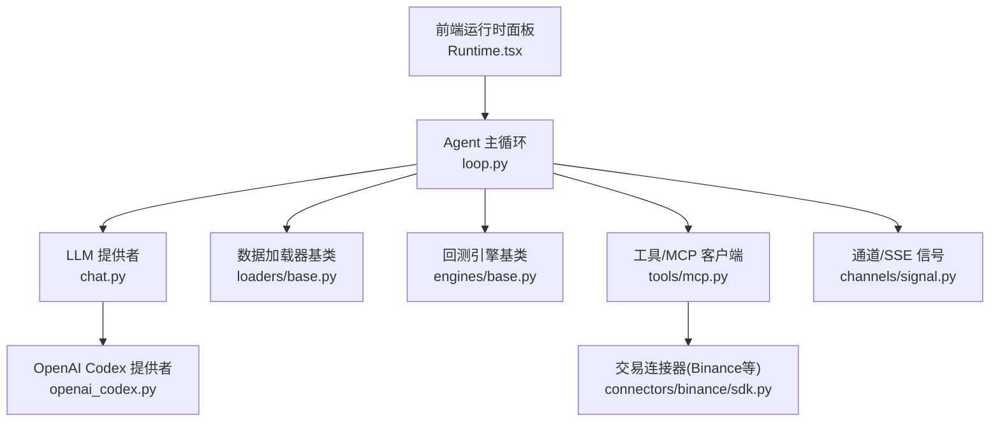
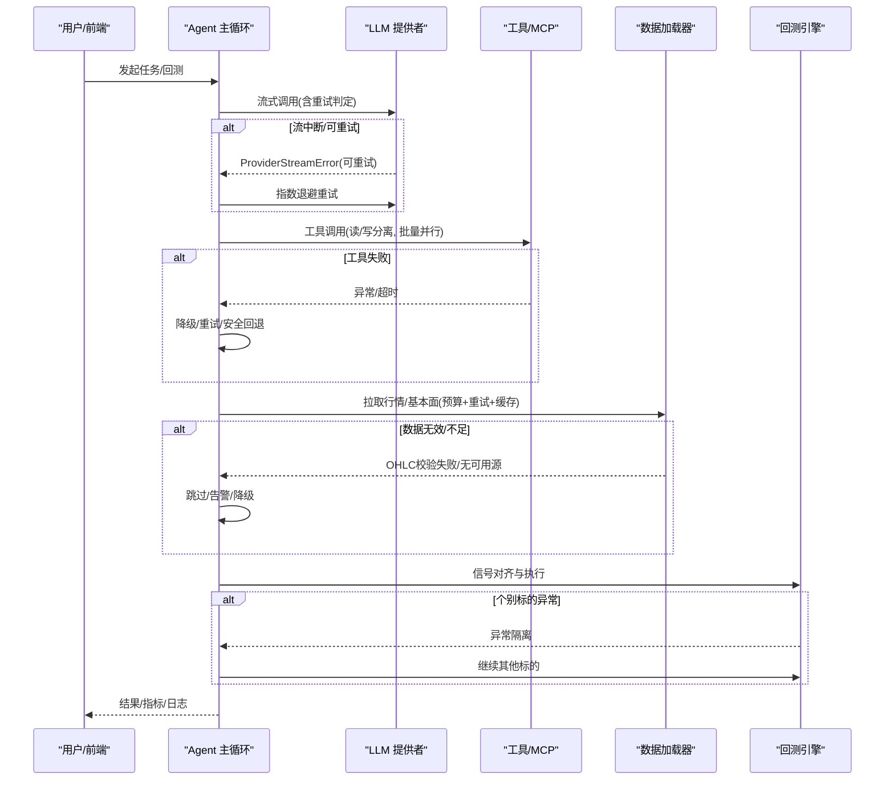
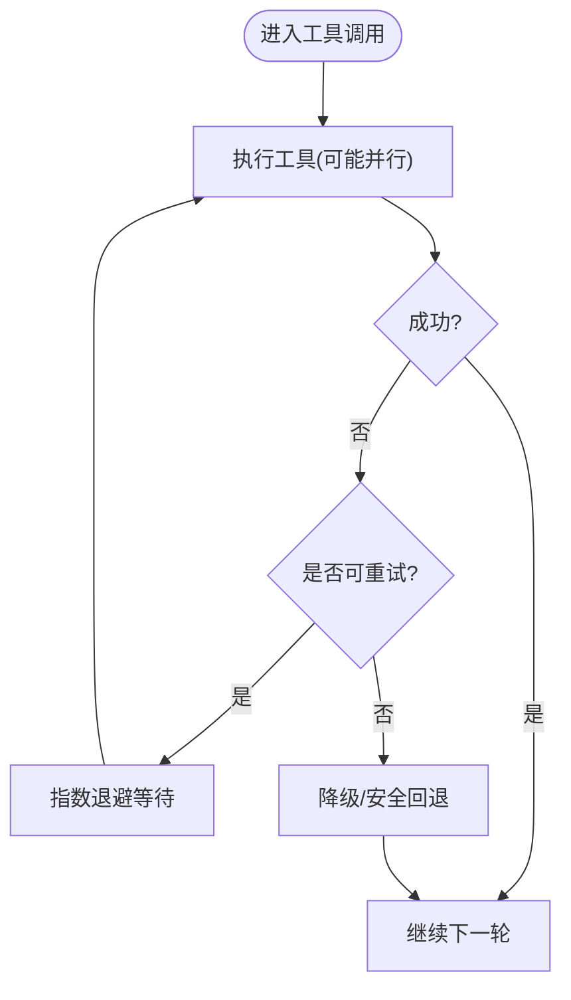
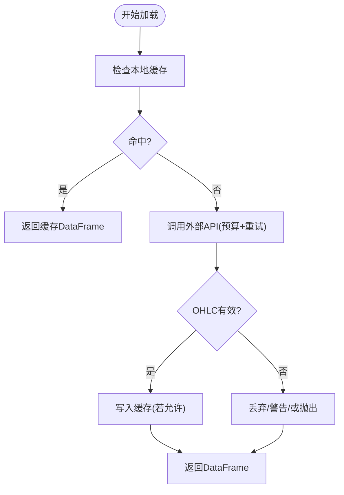
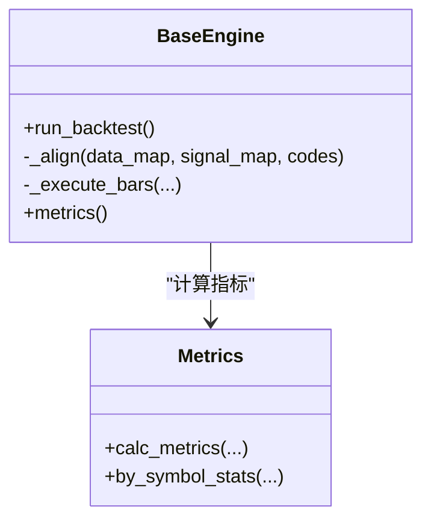
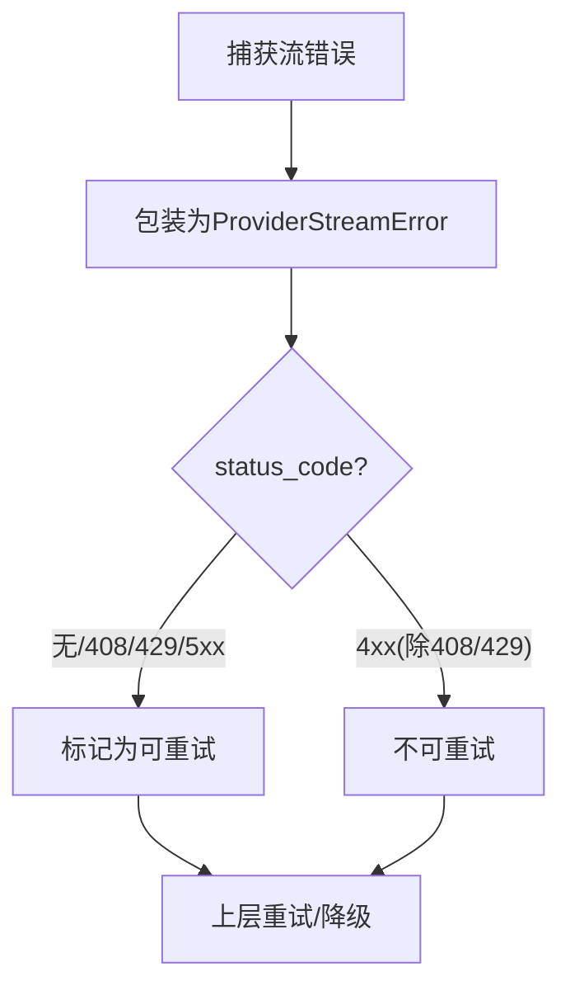
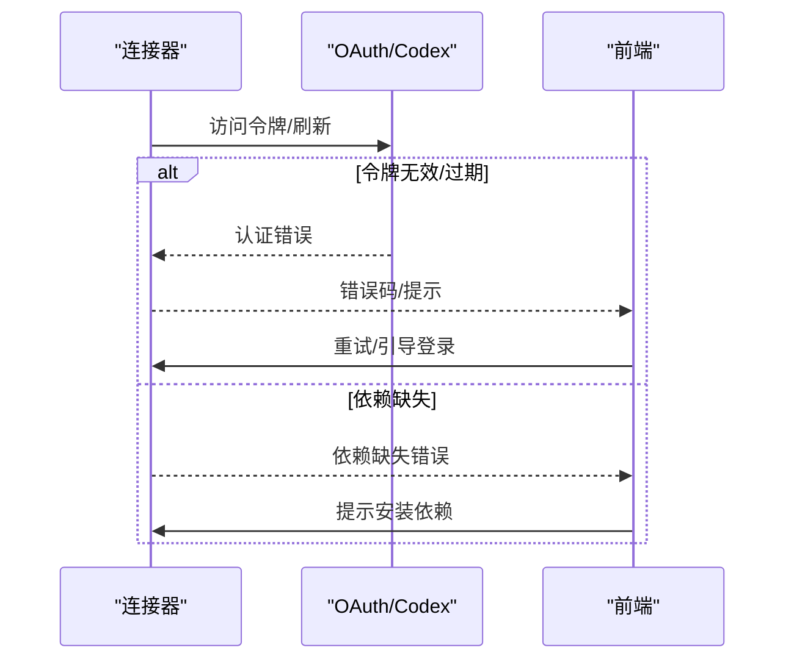
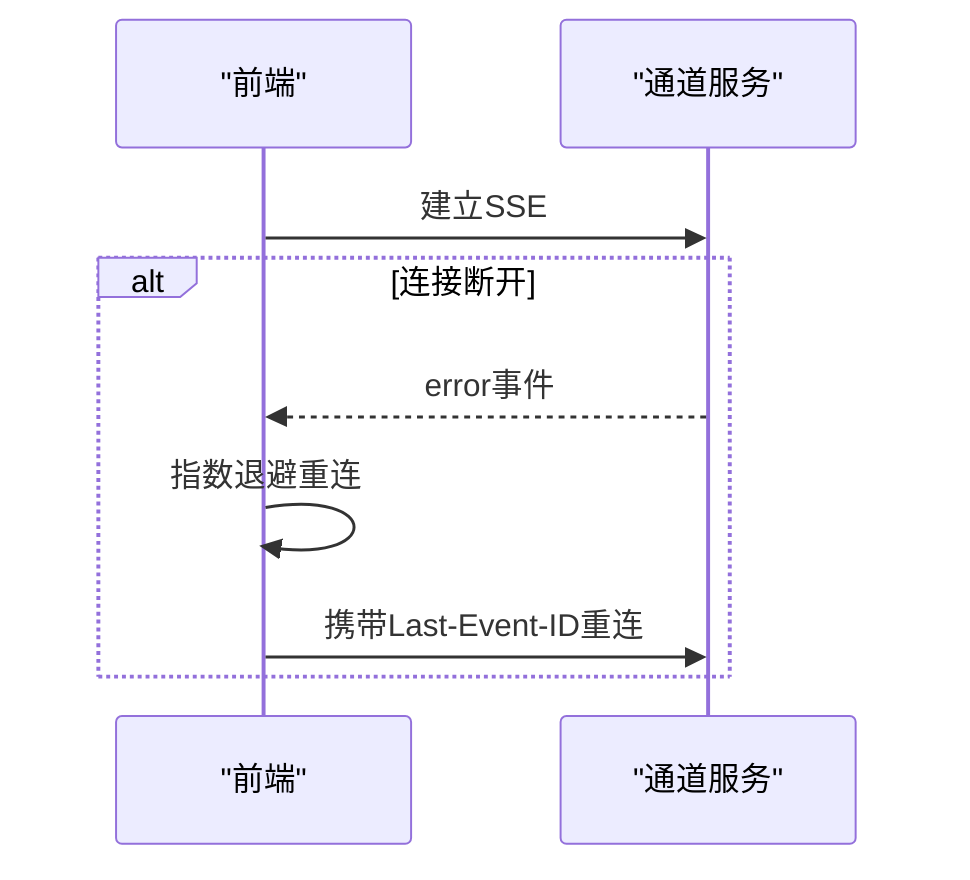
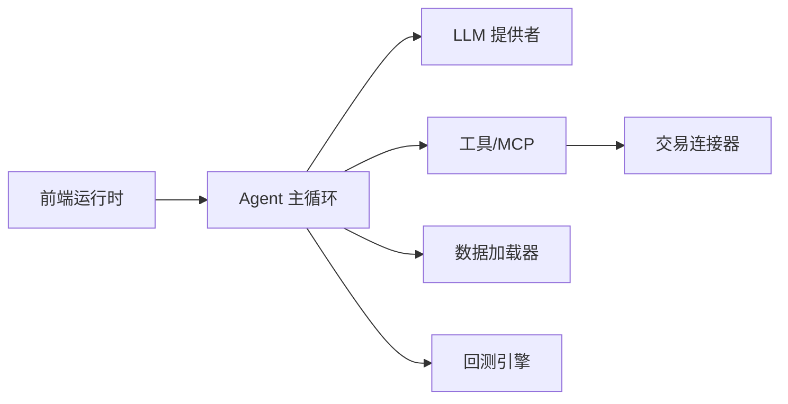

# 常见错误

<cite>
**本文引用的文件**
- [agent/src/agent/loop.py](file://agent/src/agent/loop.py)
- [agent/src/agent/grounding.py](file://agent/src/agent/grounding.py)
- [agent/backtest/loaders/base.py](file://agent/backtest/loaders/base.py)
- [agent/backtest/engines/base.py](file://agent/backtest/engines/base.py)
- [agent/src/providers/chat.py](file://agent/src/providers/chat.py)
- [agent/src/providers/openai_codex.py](file://agent/src/providers/openai_codex.py)
- [agent/src/trading/connectors/binance/sdk.py](file://agent/src/trading/connectors/binance/sdk.py)
- [agent/src/channels/signal.py](file://agent/src/channels/signal.py)
- [agent/src/tools/mcp.py](file://agent/src/tools/mcp.py)
- [agent/src/live/runtime/reconcile.py](file://agent/src/live/runtime/reconcile.py)
- [frontend/src/pages/Runtime.tsx](file://frontend/src/pages/Runtime.tsx)
</cite>

## 目录
1. [简介](#简介)
2. [项目结构](#项目结构)
3. [核心组件](#核心组件)
4. [架构总览](#架构总览)
5. [详细组件分析](#详细组件分析)
6. [依赖关系分析](#依赖关系分析)
7. [性能与资源注意事项](#性能与资源注意事项)
8. [故障排查指南](#故障排查指南)
9. [结论](#结论)
10. [附录：错误报告模板与支持渠道](#附录错误报告模板与支持渠道)

## 简介
本手册面向使用 Vibe-Trading 的开发者与用户，聚焦“快速定位—快速恢复”的错误处理实践。内容覆盖高频错误（模块缺失、连接失败、认证失败）、Agent 循环异常（工具调用失败、会话状态异常、内存溢出）、回测引擎问题（数据加载失败、计算结果异常、资源耗尽），以及自动重试、降级策略与数据完整性检查。文末提供标准化错误报告模板与社区支持渠道指引，帮助你高效获得帮助。

## 项目结构
围绕错误处理的关键位置包括：
- Agent 主循环与记忆/上下文管理：负责工具调用、流式响应、重试与降级
- 数据加载器基类：统一的重试预算、OHLC 校验与本地缓存
- 回测引擎基类：对齐信号、执行交易、指标计算与健壮性保障
- LLM 提供者抽象：流式错误分类与可重试判定
- 交易连接器：依赖缺失与网络异常的封装
- 前端运行时面板：连接状态展示与重试入口

图表来源
- [agent/src/agent/loop.py:1-200](file://agent/src/agent/loop.py#L1-L200)
- [agent/backtest/loaders/base.py:1-200](file://agent/backtest/loaders/base.py#L1-L200)
- [agent/backtest/engines/base.py:1-200](file://agent/backtest/engines/base.py#L1-L200)
- [agent/src/providers/chat.py:1-200](file://agent/src/providers/chat.py#L1-L200)
- [agent/src/tools/mcp.py:799-805](file://agent/src/tools/mcp.py#L799-L805)
- [agent/src/channels/signal.py:494-649](file://agent/src/channels/signal.py#L494-L649)
- [agent/src/providers/openai_codex.py:70-269](file://agent/src/providers/openai_codex.py#L70-L269)
- [agent/src/trading/connectors/binance/sdk.py:608-644](file://agent/src/trading/connectors/binance/sdk.py#L608-L644)
- [frontend/src/pages/Runtime.tsx:359-387](file://frontend/src/pages/Runtime.tsx#L359-L387)

章节来源
- [agent/src/agent/loop.py:1-200](file://agent/src/agent/loop.py#L1-L200)
- [agent/backtest/loaders/base.py:1-200](file://agent/backtest/loaders/base.py#L1-L200)
- [agent/backtest/engines/base.py:1-200](file://agent/backtest/engines/base.py#L1-L200)
- [agent/src/providers/chat.py:1-200](file://agent/src/providers/chat.py#L1-L200)
- [agent/src/tools/mcp.py:799-805](file://agent/src/tools/mcp.py#L799-L805)
- [agent/src/channels/signal.py:494-649](file://agent/src/channels/signal.py#L494-L649)
- [agent/src/providers/openai_codex.py:70-269](file://agent/src/providers/openai_codex.py#L70-L269)
- [agent/src/trading/connectors/binance/sdk.py:608-644](file://agent/src/trading/connectors/binance/sdk.py#L608-L644)
- [frontend/src/pages/Runtime.tsx:359-387](file://frontend/src/pages/Runtime.tsx#L359-L387)

## 核心组件
- Agent 主循环：维护 ReAct 循环、工具并行执行、流式重试、上下文压缩与记忆回收，支撑工具调用失败与流中断的恢复。
- 数据加载器：统一的超时预算、指数退避重试、OHLC 结构校验与本地 Parquet 缓存，避免外部 API 抖动导致失败。
- 回测引擎：信号对齐、目标权重优化、逐条执行与指标计算；对异常进行隔离，保证部分标的失败不影响整体运行。
- LLM 提供者：将底层流错误包装为带状态码的可重试/不可重试判断，屏蔽敏感信息并给出修复提示。
- 交易连接器：对可选依赖缺失进行明确报错，区分“需要标的参数”的降级场景与真正的认证/网络错误。
- 前端运行时：可视化连接状态并提供重试入口，提升交互体验。

章节来源
- [agent/src/agent/loop.py:1-200](file://agent/src/agent/loop.py#L1-L200)
- [agent/backtest/loaders/base.py:1-200](file://agent/backtest/loaders/base.py#L1-L200)
- [agent/backtest/engines/base.py:1-200](file://agent/backtest/engines/base.py#L1-L200)
- [agent/src/providers/chat.py:1-200](file://agent/src/providers/chat.py#L1-L200)
- [agent/src/trading/connectors/binance/sdk.py:608-644](file://agent/src/trading/connectors/binance/sdk.py#L608-L644)
- [frontend/src/pages/Runtime.tsx:359-387](file://frontend/src/pages/Runtime.tsx#L359-L387)

## 架构总览
下图展示了从用户请求到数据获取、模型推理、工具执行与回测执行的端到端流程，以及关键错误点与恢复路径。

图表来源
- [agent/src/agent/loop.py:1-200](file://agent/src/agent/loop.py#L1-L200)
- [agent/src/providers/chat.py:117-163](file://agent/src/providers/chat.py#L117-L163)
- [agent/backtest/loaders/base.py:377-450](file://agent/backtest/loaders/base.py#L377-L450)
- [agent/backtest/engines/base.py:149-200](file://agent/backtest/engines/base.py#L149-L200)

## 详细组件分析

### Agent 循环与工具调用失败恢复
- 流式重试：当 LLM 流中断时，依据状态码与错误类型决定重试（如 408/429/5xx/无状态码）。
- 工具调用失败：通过工具注册表与 MCP 客户端进行重试、超时控制与降级；必要时触发 grounding 恢复流程，引导只读工具补全证据。
- 会话状态异常：在 grounding 阶段识别身份未锁定或缺失价格证据，按预算限制进行有限轮次的恢复尝试。

图表来源
- [agent/src/agent/loop.py:101-115](file://agent/src/agent/loop.py#L101-L115)
- [agent/src/tools/mcp.py:799-805](file://agent/src/tools/mcp.py#L799-L805)
- [agent/src/agent/grounding.py:1206-1248](file://agent/src/agent/grounding.py#L1206-L1248)

章节来源
- [agent/src/agent/loop.py:101-115](file://agent/src/agent/loop.py#L101-L115)
- [agent/src/agent/grounding.py:1206-1248](file://agent/src/agent/grounding.py#L1206-L1248)
- [agent/src/tools/mcp.py:799-805](file://agent/src/tools/mcp.py#L799-L805)

### 数据加载失败与完整性校验
- 重试与预算：所有外部数据源统一使用“截止时间 + 指数退避”的重试机制，避免无限重试拖垮系统。
- OHLC 校验：加载后强制校验 OHLC 结构与非正价格，防止脏数据污染回测。
- 本地缓存：启用后可将已结算区间的行情落盘为 Parquet，加速重复运行并降低网络压力。

图表来源
- [agent/backtest/loaders/base.py:377-450](file://agent/backtest/loaders/base.py#L377-L450)
- [agent/backtest/loaders/base.py:243-400](file://agent/backtest/loaders/base.py#L243-L400)
- [agent/backtest/loaders/base.py:187-256](file://agent/backtest/loaders/base.py#L187-L256)

章节来源
- [agent/backtest/loaders/base.py:187-256](file://agent/backtest/loaders/base.py#L187-L256)
- [agent/backtest/loaders/base.py:377-450](file://agent/backtest/loaders/base.py#L377-L450)
- [agent/backtest/loaders/base.py:243-400](file://agent/backtest/loaders/base.py#L243-L400)

### 回测引擎异常隔离与指标健壮性
- 信号对齐：合并多标的日历，前向填充限制以避免长停牌导致的偏差。
- 执行隔离：单个标的计划/下单异常被捕获，不阻断其他标的执行。
- 指标输出：非有限数值转为 null，确保 JSON 输出稳定。

图表来源
- [agent/backtest/engines/base.py:149-200](file://agent/backtest/engines/base.py#L149-L200)
- [agent/backtest/engines/base.py:56-62](file://agent/backtest/engines/base.py#L56-L62)

章节来源
- [agent/backtest/engines/base.py:56-62](file://agent/backtest/engines/base.py#L56-L62)
- [agent/backtest/engines/base.py:149-200](file://agent/backtest/engines/base.py#L149-L200)

### LLM 提供者错误与可重试判定
- 流错误包装：ProviderStreamError 携带 provider/model/原始异常/状态码，便于上层决策。
- 可重试规则：408/429/5xx/无状态码视为可重试；确定性的 4xx 客户端错误不重试。
- 敏感信息脱敏：错误消息中隐藏密钥/代理等敏感值。

图表来源
- [agent/src/providers/chat.py:117-163](file://agent/src/providers/chat.py#L117-L163)

章节来源
- [agent/src/providers/chat.py:117-163](file://agent/src/providers/chat.py#L117-L163)

### 认证错误与依赖缺失
- 认证失败：Codex 认证错误会提示重新登录，并在刷新失败时标记永久失效。
- 依赖缺失：连接器在缺少可选依赖（如 ccxt）时抛出明确错误，指导安装。
- 前端反馈：运行时面板根据连接状态显示错误代码与重试入口。

图表来源
- [agent/src/providers/openai_codex.py:70-269](file://agent/src/providers/openai_codex.py#L70-L269)
- [agent/src/trading/connectors/binance/sdk.py:608-644](file://agent/src/trading/connectors/binance/sdk.py#L608-L644)
- [frontend/src/pages/Runtime.tsx:359-387](file://frontend/src/pages/Runtime.tsx#L359-L387)

章节来源
- [agent/src/providers/openai_codex.py:70-269](file://agent/src/providers/openai_codex.py#L70-L269)
- [agent/src/trading/connectors/binance/sdk.py:608-644](file://agent/src/trading/connectors/binance/sdk.py#L608-L644)
- [frontend/src/pages/Runtime.tsx:359-387](file://frontend/src/pages/Runtime.tsx#L359-L387)

### SSE/通道连接错误
- 信号通道：SSE 断连时抛出 ConnectionError，上层需实现重连与去抖。
- 前端重连：基于指数退避与 Last-Event-ID 续传，提高稳定性。

图表来源
- [agent/src/channels/signal.py:494-649](file://agent/src/channels/signal.py#L494-L649)
- [frontend/src/pages/Runtime.tsx:359-387](file://frontend/src/pages/Runtime.tsx#L359-L387)

章节来源
- [agent/src/channels/signal.py:494-649](file://agent/src/channels/signal.py#L494-L649)
- [frontend/src/pages/Runtime.tsx:359-387](file://frontend/src/pages/Runtime.tsx#L359-L387)

## 依赖关系分析
- Agent 主循环依赖 LLM 提供者、工具注册表、数据加载器与回测引擎。
- 数据加载器依赖重试预算与 OHLC 校验，向上游提供干净数据。
- 回测引擎依赖信号对齐与指标计算，对异常进行隔离。
- 前端依赖后端运行时状态，提供可视化的连接与重试能力。

图表来源
- [agent/src/agent/loop.py:1-200](file://agent/src/agent/loop.py#L1-L200)
- [agent/backtest/loaders/base.py:1-200](file://agent/backtest/loaders/base.py#L1-L200)
- [agent/backtest/engines/base.py:1-200](file://agent/backtest/engines/base.py#L1-L200)
- [agent/src/providers/chat.py:1-200](file://agent/src/providers/chat.py#L1-L200)
- [agent/src/trading/connectors/binance/sdk.py:608-644](file://agent/src/trading/connectors/binance/sdk.py#L608-L644)
- [frontend/src/pages/Runtime.tsx:359-387](file://frontend/src/pages/Runtime.tsx#L359-L387)

章节来源
- [agent/src/agent/loop.py:1-200](file://agent/src/agent/loop.py#L1-L200)
- [agent/backtest/loaders/base.py:1-200](file://agent/backtest/loaders/base.py#L1-L200)
- [agent/backtest/engines/base.py:1-200](file://agent/backtest/engines/base.py#L1-L200)
- [agent/src/providers/chat.py:1-200](file://agent/src/providers/chat.py#L1-L200)
- [agent/src/trading/connectors/binance/sdk.py:608-644](file://agent/src/trading/connectors/binance/sdk.py#L608-L644)
- [frontend/src/pages/Runtime.tsx:359-387](file://frontend/src/pages/Runtime.tsx#L359-L387)

## 性能与资源注意事项
- 工具并行：连续只读工具并行执行，缩短端到端延迟。
- 上下文压缩：多层压缩策略（微紧凑、折叠、摘要、迭代更新）缓解内存压力。
- 数据缓存：仅对已结算区间缓存，避免临时数据污染。
- 指标健壮：非有限值转 null，防止序列化失败。

章节来源
- [agent/src/agent/loop.py:1-200](file://agent/src/agent/loop.py#L1-L200)
- [agent/backtest/loaders/base.py:243-400](file://agent/backtest/loaders/base.py#L243-L400)
- [agent/backtest/engines/base.py:56-62](file://agent/backtest/engines/base.py#L56-L62)

## 故障排查指南
- ModuleNotFoundError（模块缺失）
  - 现象：导入 ccxt、oauth-cli-kit 等可选依赖失败。
  - 解决：按提示安装依赖；确认虚拟环境与路径正确。
  - 参考：[binance sdk 依赖检测:608-644](file://agent/src/trading/connectors/binance/sdk.py#L608-L644)、[codex 依赖检测:70-269](file://agent/src/providers/openai_codex.py#L70-L269)

- ConnectionError（连接失败/流中断）
  - 现象：SSE 断连、HTTP 连接错误、网络超时。
  - 解决：检查网络与代理；利用指数退避重连；必要时更换端点或关闭代理。
  - 参考：[signal 通道错误:494-649](file://agent/src/channels/signal.py#L494-L649)、[ProviderStreamError 可重试判定:117-163](file://agent/src/providers/chat.py#L117-L163)

- AuthenticationError（认证失败）
  - 现象：Codex 会话失效、令牌刷新失败。
  - 解决：重新登录；清理本地 token 缓存；检查 OAuth 配置。
  - 参考：[Codex 认证错误:70-269](file://agent/src/providers/openai_codex.py#L70-L269)

- Agent 循环错误（工具调用失败/会话状态异常/内存溢出）
  - 工具调用失败：查看工具日志，确认参数与权限；必要时降级为只读工具。
  - 会话状态异常：Grounding 恢复流程会在预算内尝试补全证据；若仍失败，提示用户澄清。
  - 内存溢出：减少并发、启用上下文压缩、限制工具结果长度。
  - 参考：[loop 重试与超时:101-115](file://agent/src/agent/loop.py#L101-L115)、[grounding 恢复:1206-1248](file://agent/src/agent/grounding.py#L1206-L1248)

- 回测引擎错误（数据加载失败/计算结果异常/资源耗尽）
  - 数据加载失败：检查数据源可用性、时间范围与字段；启用本地缓存；关注 OHLC 校验失败。
  - 计算结果异常：检查信号对齐与前向填充限制；关注非有限值与空序列。
  - 资源耗尽：降低批次大小、限制 ffill limit、减少并行度。
  - 参考：[重试与预算:377-450](file://agent/backtest/loaders/base.py#L377-L450)、[OHLC 校验:187-256](file://agent/backtest/loaders/base.py#L187-L256)、[信号对齐:149-200](file://agent/backtest/engines/base.py#L149-L200)

- 错误恢复策略
  - 自动重试：基于预算与指数退避，避免风暴式重试。
  - 降级方案：只读优先、跳过异常标的、使用缓存数据。
  - 数据完整性：OHLC 校验、空/NaN 处理、指标健壮化。
  - 参考：[重试预算:377-450](file://agent/backtest/loaders/base.py#L377-L450)、[指标健壮:56-62](file://agent/backtest/engines/base.py#L56-L62)

章节来源
- [agent/src/trading/connectors/binance/sdk.py:608-644](file://agent/src/trading/connectors/binance/sdk.py#L608-L644)
- [agent/src/providers/openai_codex.py:70-269](file://agent/src/providers/openai_codex.py#L70-L269)
- [agent/src/channels/signal.py:494-649](file://agent/src/channels/signal.py#L494-L649)
- [agent/src/providers/chat.py:117-163](file://agent/src/providers/chat.py#L117-L163)
- [agent/src/agent/loop.py:101-115](file://agent/src/agent/loop.py#L101-L115)
- [agent/src/agent/grounding.py:1206-1248](file://agent/src/agent/grounding.py#L1206-L1248)
- [agent/backtest/loaders/base.py:187-256](file://agent/backtest/loaders/base.py#L187-L256)
- [agent/backtest/loaders/base.py:377-450](file://agent/backtest/loaders/base.py#L377-L450)
- [agent/backtest/engines/base.py:56-62](file://agent/backtest/engines/base.py#L56-L62)
- [agent/backtest/engines/base.py:149-200](file://agent/backtest/engines/base.py#L149-L200)

## 结论
通过统一的重试预算、严格的 OHLC 校验、稳健的信号对齐与指标输出、以及 Agent 层的 grounding 恢复与上下文压缩，Vibe-Trading 在复杂外部依赖与不稳定网络环境下仍能保持较高的可用性与稳定性。建议在生产环境中开启数据缓存、合理设置重试预算与超时，并结合前端运行时面板进行监控与快速恢复。

## 附录：错误报告模板与支持渠道
- 错误报告模板（复制以下模板填写）
  - 标题：[错误类型] 简要描述
  - 环境：操作系统、Python 版本、依赖版本（如 ccxt、oauth-cli-kit）
  - 复现步骤：
    1. ...
    2. ...
  - 期望行为：...
  - 实际行为：...
  - 日志片段：粘贴关键日志（注意脱敏）
  - 相关配置：.env 关键项（脱敏）、回测配置、工具参数
  - 附加信息：截图、最小可复现代码片段、网络拓扑（代理/防火墙）

- 社区支持渠道
  - GitHub Issues：提交问题时请附上上述模板与必要日志
  - 文档与 Wiki：查阅常见问题与最佳实践
  - 讨论区/论坛：参与讨论，分享经验