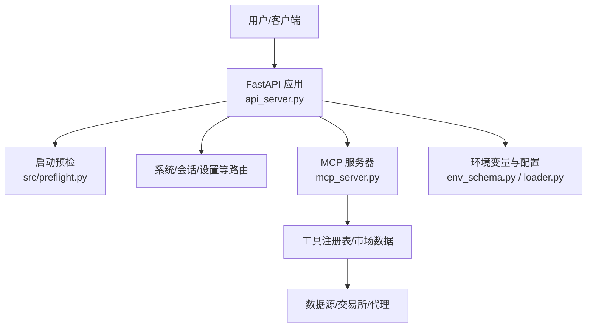
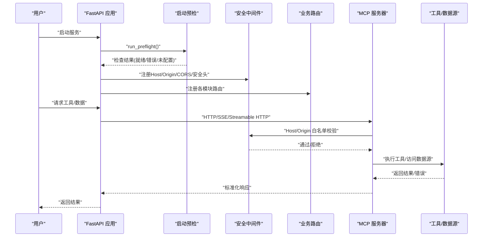
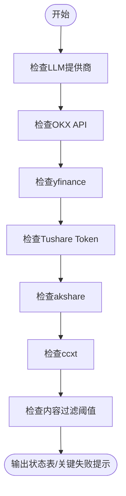
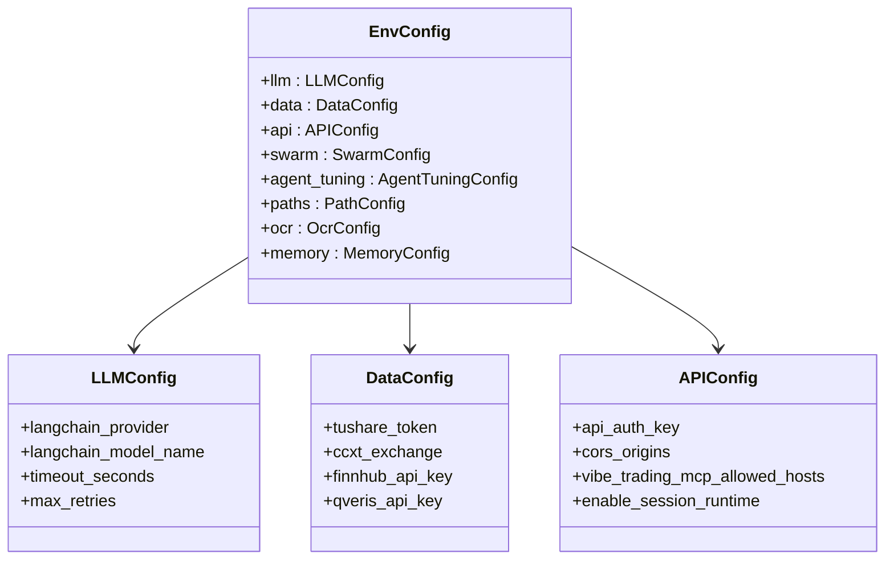
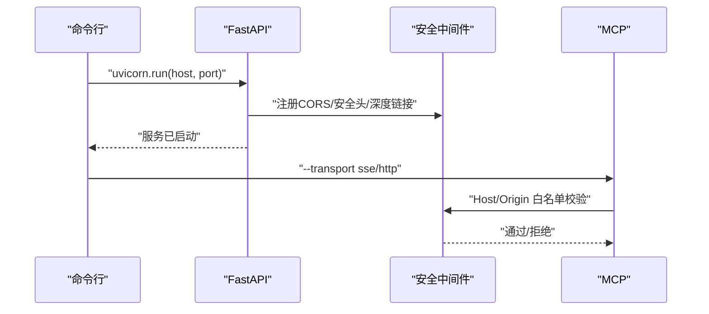
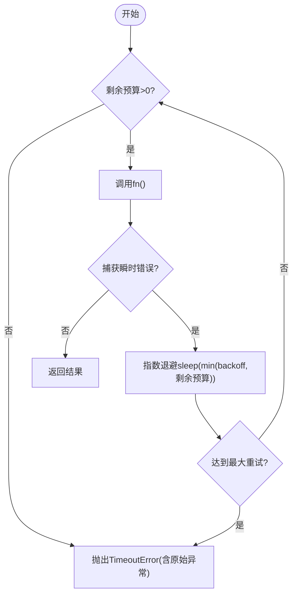
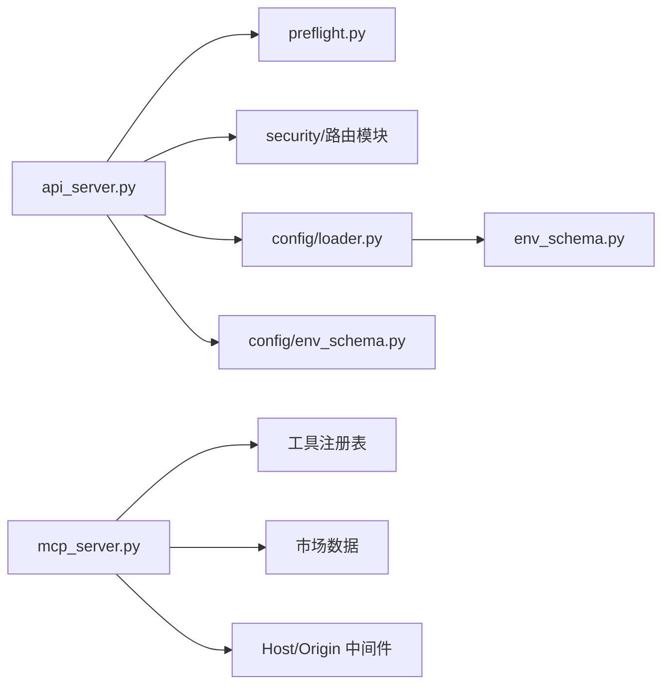

# 故障排除

<cite>
**本文引用的文件**
- [README.md](file://README.md)
- [api_server.py](file://agent/api_server.py)
- [mcp_server.py](file://agent/mcp_server.py)
- [preflight.py](file://agent/src/preflight.py)
- [env_schema.py](file://agent/src/config/env_schema.py)
- [loader.py](file://agent/src/config/loader.py)
- [base.py](file://agent/backtest/loaders/base.py)
</cite>

## 目录
1. [简介](#简介)
2. [项目结构](#项目结构)
3. [核心组件](#核心组件)
4. [架构总览](#架构总览)
5. [详细组件分析](#详细组件分析)
6. [依赖关系分析](#依赖关系分析)
7. [性能注意事项](#性能注意事项)
8. [故障排除指南](#故障排除指南)
9. [结论](#结论)
10. [附录](#附录)

## 简介
本指南面向安装、配置、数据源连接、日志与调试、预检工具使用以及社区支持渠道的常见问题，提供可操作的排查步骤。内容基于代码库中的启动预检、环境变量配置、API/MCP 服务启动流程、网络与限流重试机制等实现进行总结与归纳。

## 项目结构
Vibe-Trading 由后端 API 服务、MCP 工具服务、Agent 运行时、前端 Web UI 及多种数据源/通道组成。关键入口包括：
- API 服务器：负责路由注册、生命周期管理、启动预检与安全中间件
- MCP 服务器：暴露研究工具集，内置网络传输安全限制
- 启动预检：检查 LLM 提供商、数据源可达性与可选依赖
- 配置层：集中式环境变量 schema 与结构化配置加载

**图示来源**
- [api_server.py:127-171](file://agent/api_server.py#L127-L171)
- [mcp_server.py:132-318](file://agent/mcp_server.py#L132-L318)
- [preflight.py:284-337](file://agent/src/preflight.py#L284-L337)
- [env_schema.py:685-716](file://agent/src/config/env_schema.py#L685-L716)
- [loader.py:28-55](file://agent/src/config/loader.py#L28-L55)

**章节来源**
- [api_server.py:127-171](file://agent/api_server.py#L127-L171)
- [mcp_server.py:132-318](file://agent/mcp_server.py#L132-L318)
- [preflight.py:284-337](file://agent/src/preflight.py#L284-L337)
- [env_schema.py:685-716](file://agent/src/config/env_schema.py#L685-L716)
- [loader.py:28-55](file://agent/src/config/loader.py#L28-L55)

## 核心组件
- 启动预检（Preflight）：在 API 启动时执行，校验 LLM 提供商、OKX/yfinance/Tushare/akshare/ccxt 等依赖与可达性，并输出状态表；若关键项失败则提示无法启动。
- 环境变量配置（EnvConfig）：集中定义所有环境变量及其默认值、类型与别名，支持布尔/数值安全转换与兼容旧变量。
- 结构化配置加载（Agent Config Loader）：从磁盘读取 JSON/YAML 配置，合并运行时覆盖，并对无效配置降级为默认。
- API 服务器（FastAPI）：挂载安全中间件、CORS、SPA 静态资源，注册各模块路由，并在生命周期中执行启动预检与调度器/通道初始化。
- MCP 服务器（FastMCP）：暴露研究工具，对网络传输启用 Host/Origin 白名单防护，默认仅允许回环地址，防止 DNS 重绑定攻击。

**章节来源**
- [preflight.py:32-153](file://agent/src/preflight.py#L32-L153)
- [preflight.py:156-271](file://agent/src/preflight.py#L156-L271)
- [preflight.py:284-337](file://agent/src/preflight.py#L284-L337)
- [env_schema.py:132-214](file://agent/src/config/env_schema.py#L132-L214)
- [env_schema.py:326-375](file://agent/src/config/env_schema.py#L326-L375)
- [env_schema.py:339-394](file://agent/src/config/env_schema.py#L339-L394)
- [loader.py:28-55](file://agent/src/config/loader.py#L28-L55)
- [api_server.py:127-171](file://agent/api_server.py#L127-L171)
- [mcp_server.py:132-318](file://agent/mcp_server.py#L132-L318)

## 架构总览
下图展示 API 启动到工具调用的主流程，包含预检、路由注册、MCP 安全中间件与工具调用链路。

**图示来源**
- [api_server.py:127-171](file://agent/api_server.py#L127-L171)
- [mcp_server.py:132-318](file://agent/mcp_server.py#L132-L318)
- [preflight.py:284-337](file://agent/src/preflight.py#L284-L337)

## 详细组件分析

### 启动预检（Preflight）
- 功能：检查 LLM 提供商连通性、OKX/yfinance/Tushare/akshare/ccxt 可用性、内容过滤阈值等，并打印状态表；若关键项失败，提示无法启动。
- 关键点：
  - LLM 提供商需设置 provider 与 model，否则标记为“未配置”且关键失败。
  - 对 OpenAI Codex 与 Copilot 有专门的认证状态检查。
  - OKX 通过公开行情接口探测可达性。
  - yfinance 需要包可用并能获取基础信息。
  - Tushare 需要 token 配置。
  - akshare/ccxt 检测包是否安装。

**图示来源**
- [preflight.py:32-153](file://agent/src/preflight.py#L32-L153)
- [preflight.py:156-271](file://agent/src/preflight.py#L156-L271)
- [preflight.py:284-337](file://agent/src/preflight.py#L284-L337)

**章节来源**
- [preflight.py:32-153](file://agent/src/preflight.py#L32-L153)
- [preflight.py:156-271](file://agent/src/preflight.py#L156-L271)
- [preflight.py:284-337](file://agent/src/preflight.py#L284-L337)

### 环境变量与配置验证
- EnvConfig：集中定义所有环境变量，提供类型校验、默认值、别名与布尔/数值安全转换；支持将旧变量名映射到新字段。
- Agent 配置加载：从 JSON/YAML 读取配置，合并运行时覆盖，对无效配置降级为默认，避免启动崩溃。
- 路径与权限：配置路径解析与运行时根目录确定，确保跨平台一致。

**图示来源**
- [env_schema.py:132-214](file://agent/src/config/env_schema.py#L132-L214)
- [env_schema.py:326-375](file://agent/src/config/env_schema.py#L326-L375)
- [env_schema.py:339-394](file://agent/src/config/env_schema.py#L339-L394)
- [env_schema.py:685-716](file://agent/src/config/env_schema.py#L685-L716)

**章节来源**
- [env_schema.py:132-214](file://agent/src/config/env_schema.py#L132-L214)
- [env_schema.py:326-375](file://agent/src/config/env_schema.py#L326-L375)
- [env_schema.py:339-394](file://agent/src/config/env_schema.py#L339-L394)
- [env_schema.py:685-716](file://agent/src/config/env_schema.py#L685-L716)
- [loader.py:28-55](file://agent/src/config/loader.py#L28-L55)

### API 与 MCP 安全与端口
- API 服务器：
  - 启动时运行预检，注册 CORS、安全头、SPA 静态资源。
  - 支持 --port/--host 参数，默认监听 127.0.0.1:8000。
  - 非回环主机绑定时会警告缺少 API_AUTH_KEY。
- MCP 服务器：
  - 网络传输（SSE/HTTP）默认仅允许回环 Host/Origin，防止 DNS 重绑定。
  - 可通过环境变量扩展允许的 Host/Origin 列表。
  - 工具注册表按需构建，shell 工具默认关闭，需显式启用。

**图示来源**
- [api_server.py:321-395](file://agent/api_server.py#L321-L395)
- [mcp_server.py:132-318](file://agent/mcp_server.py#L132-L318)

**章节来源**
- [api_server.py:321-395](file://agent/api_server.py#L321-L395)
- [mcp_server.py:132-318](file://agent/mcp_server.py#L132-L318)

### 数据源连接与限流重试
- 数据源加载器基类提供预算内重试与超时控制，适用于批量或连接型数据源。
- 关键行为：
  - 在剩余预算不足时提前终止，避免浪费请求。
  - 对声明的瞬时错误进行指数退避重试，最终包装为 TimeoutError 并保留原始异常。
  - 非瞬时错误直接抛出，便于上层快速失败。

**图示来源**
- [base.py:381-414](file://agent/backtest/loaders/base.py#L381-L414)

**章节来源**
- [base.py:381-414](file://agent/backtest/loaders/base.py#L381-L414)

## 依赖关系分析
- API 服务器依赖：
  - 启动预检（preflight）
  - 安全中间件与路由模块（系统、会话、设置、上传、通道、群智、实盘、Alpha、期权、认证、OpenBB 桥接、定时研究）
  - 配置加载器（结构化配置与环境变量）
- MCP 服务器依赖：
  - 工具注册表、市场数据、目标存储、技能加载器
  - 网络传输安全中间件（Host/Origin 白名单）
- 配置层依赖：
  - Pydantic 模型与验证
  - JSON/YAML 解析（YAML 可选）
  - 路径解析与运行时根目录

**图示来源**
- [api_server.py:127-171](file://agent/api_server.py#L127-L171)
- [mcp_server.py:132-318](file://agent/mcp_server.py#L132-L318)
- [loader.py:28-55](file://agent/src/config/loader.py#L28-L55)
- [env_schema.py:685-716](file://agent/src/config/env_schema.py#L685-L716)

**章节来源**
- [api_server.py:127-171](file://agent/api_server.py#L127-L171)
- [mcp_server.py:132-318](file://agent/mcp_server.py#L132-L318)
- [loader.py:28-55](file://agent/src/config/loader.py#L28-L55)
- [env_schema.py:685-716](file://agent/src/config/env_schema.py#L685-L716)

## 性能注意事项
- 数据源批量拉取应使用预算内重试，避免长时间占用资源。
- 合理设置 LLM 超时与重试次数，避免阻塞。
- 使用缓存开关减少重复网络请求（如数据缓存）。
- 监控 SSE/HTTP 心跳与重连延迟，避免频繁重连造成拥塞。

[本节为通用指导，不直接分析具体文件]

## 故障排除指南

### 常见安装问题
- 依赖冲突解决
  - 现象：导入失败或版本不兼容导致启动报错。
  - 处理：
    - 确认 Python 版本与依赖锁文件匹配。
    - 按 README 指引更新或重新安装依赖。
    - 对可选依赖（如通道 SDK）按需安装 extras。
  - 参考：
    - 依赖锁定与兼容性修复记录
    - 可选依赖安装说明

**章节来源**
- [README.md:1-166](file://README.md#L1-L166)

- 端口占用处理
  - 现象：启动时报端口被占用。
  - 处理：
    - 修改 --port 参数或使用其他端口。
    - 检查是否有残留进程占用 8000 或开发模式 5173。
    - 在非回环主机绑定时，建议设置 API_AUTH_KEY 或仅本地访问。
  - 参考：
    - API 服务器端口与主机参数
    - 非回环绑定安全警告

**章节来源**
- [api_server.py:321-395](file://agent/api_server.py#L321-L395)

- 权限不足修复
  - 现象：写入配置或数据目录失败。
  - 处理：
    - 确保 ~/.vibe-trading 或自定义路径可写。
    - 在 Windows 上避免只读目录。
    - 使用管理员权限或调整目录权限后重试。
  - 参考：
    - 配置路径与运行时根目录解析
    - 结构化配置加载失败降级策略

**章节来源**
- [loader.py:28-55](file://agent/src/config/loader.py#L28-L55)

### 配置相关问题
- 环境变量验证
  - 现象：LLM 不可用、数据源无权限或功能受限。
  - 处理：
    - 检查 LLM_PROVIDER、MODEL_NAME、BASE_URL 等必要变量。
    - 检查数据源密钥（如 TUSHARE_TOKEN、FINNHUB_API_KEY 等）。
    - 使用预检工具查看当前环境状态。
  - 参考：
    - 环境变量 schema 定义
    - 启动预检输出

**章节来源**
- [env_schema.py:132-214](file://agent/src/config/env_schema.py#L132-L214)
- [preflight.py:32-153](file://agent/src/preflight.py#L32-L153)

- 配置文件语法检查
  - 现象：JSON/YAML 格式错误或字段类型不合法。
  - 处理：
    - 使用 JSON 校验工具检查语法。
    - 修正字段类型与必填项。
    - 若加载失败，系统将降级为默认配置，但功能可能受限。
  - 参考：
    - 配置加载与降级逻辑

**章节来源**
- [loader.py:28-55](file://agent/src/config/loader.py#L28-L55)

- 数据库连接失败处理
  - 现象：某些数据源或通道依赖外部服务连接失败。
  - 处理：
    - 检查网络连通性与代理设置。
    - 调整超时与重试参数。
    - 查看预检与日志中的错误摘要。
  - 参考：
    - 数据源加载器重试与超时
    - 通道错误日志格式化

**章节来源**
- [base.py:381-414](file://agent/backtest/loaders/base.py#L381-L414)

### 数据源连接问题
- API 限流处理
  - 现象：请求被限流或返回 429。
  - 处理：
    - 降低请求频率，增加重试间隔。
    - 使用预算内重试，避免耗尽配额。
    - 切换备用数据源或启用缓存。
  - 参考：
    - 预算内重试与指数退避

**章节来源**
- [base.py:381-414](file://agent/backtest/loaders/base.py#L381-L414)

- 网络连接超时
  - 现象：请求长时间无响应或超时。
  - 处理：
    - 检查代理与防火墙设置。
    - 调整 TIMEOUT_SECONDS、CCXT_TIMEOUT_MS 等参数。
    - 使用预检工具验证可达性。
  - 参考：
    - 环境变量超时配置
    - 启动预检网络探测

**章节来源**
- [env_schema.py:132-159](file://agent/src/config/env_schema.py#L132-L159)
- [preflight.py:156-181](file://agent/src/preflight.py#L156-L181)

- 认证失败排查
  - 现象：OAuth 登录缺失或令牌无效。
  - 处理：
    - 对 OpenAI Codex：执行 provider login 流程。
    - 对 Copilot：完成 gh auth login 或设置 COPILOT_GITHUB_TOKEN。
    - 检查 base URL 与代理配置。
  - 参考：
    - LLM 提供商认证检查

**章节来源**
- [preflight.py:74-120](file://agent/src/preflight.py#L74-L120)

### 日志查看与调试方法
- 日志级别设置
  - 通过 Uvicorn 的 log_level 控制输出详细程度。
  - 关注安全中间件与路由模块的日志。
- 错误堆栈分析
  - 查看预检输出的错误信息与影响范围。
  - 对网络错误，结合代理与超时参数定位。
- 性能监控工具
  - 使用预算内重试统计耗时与重试次数。
  - 观察 SSE/HTTP 心跳与重连延迟。

**章节来源**
- [api_server.py:404-415](file://agent/api_server.py#L404-L415)
- [preflight.py:284-337](file://agent/src/preflight.py#L284-L337)
- [base.py:381-414](file://agent/backtest/loaders/base.py#L381-L414)

### 预检工具使用方法
- 环境检查
  - 启动 API 服务时自动执行预检，输出各组件状态。
  - 关注关键项（LLM 提供商）是否就绪。
- 配置验证
  - 检查环境变量是否正确设置。
  - 对无效配置，系统会降级并使用默认值。
- 依赖完整性测试
  - 预检会检测可选依赖是否安装。
  - 对缺失依赖，根据影响范围判断是否影响功能。

**章节来源**
- [preflight.py:284-337](file://agent/src/preflight.py#L284-L337)
- [loader.py:28-55](file://agent/src/config/loader.py#L28-L55)

### 社区支持渠道与问题报告模板
- 官方渠道
  - 文档网站与 Wiki
  - 社区群组（飞书、微信、Discord）
- 问题报告建议
  - 描述环境与版本（Python、依赖锁、前端构建）
  - 提供预检输出与关键日志片段
  - 复现步骤与期望行为
  - 如涉及数据源，提供网络与代理信息

**章节来源**
- [README.md:1-166](file://README.md#L1-L166)

## 结论
通过启动预检、集中式环境变量配置、结构化配置加载与安全中间件，Vibe-Trading 提供了稳定的启动与运行保障。针对安装、配置、数据源连接与日志调试的常见问题，可按本指南逐步排查。建议在生产环境中启用缓存、合理设置超时与重试，并严格限制 MCP 网络传输的 Host/Origin 白名单。

## 附录
- 常用环境变量速查
  - LLM：LANGCHAIN_PROVIDER、LANGCHAIN_MODEL_NAME、TIMEOUT_SECONDS、MAX_RETRIES
  - 数据源：TUSHARE_TOKEN、FINNHUB_API_KEY、QVERIS_API_KEY、CCXT_EXCHANGE
  - API：API_AUTH_KEY、CORS_ORIGINS、VIBE_TRADING_MCP_ALLOWED_HOSTS
  - 代理与缓存：VIBE_TRADING_DISABLE_HTTP_PROXY、VIBE_TRADING_DATA_CACHE
- 启动命令示例
  - API：python api_server.py --port 8000 --host 127.0.0.1
  - MCP：python mcp_server.py --transport http

[本节为补充信息，不直接分析具体文件]