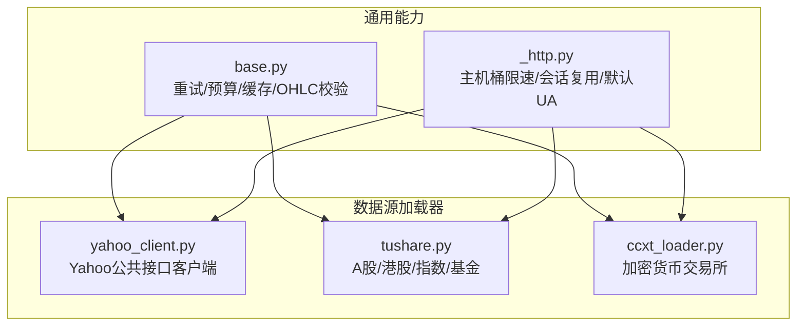
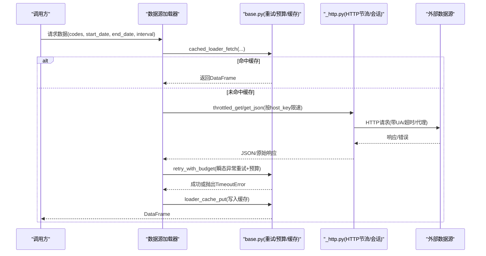
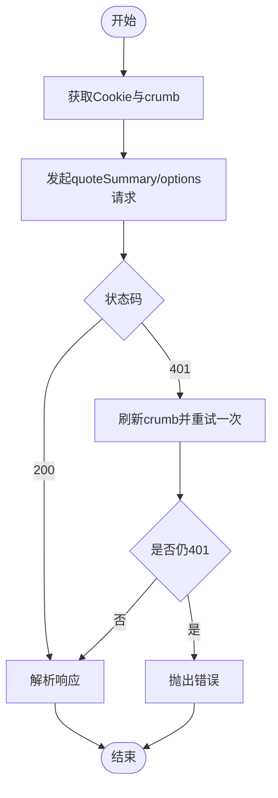
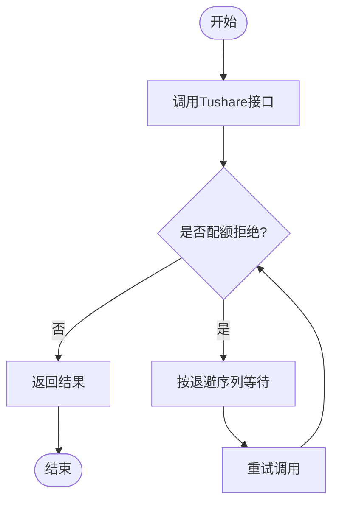
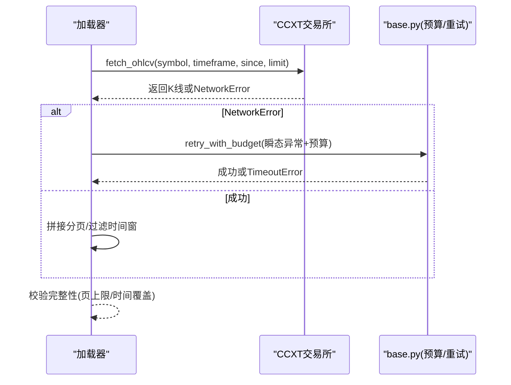
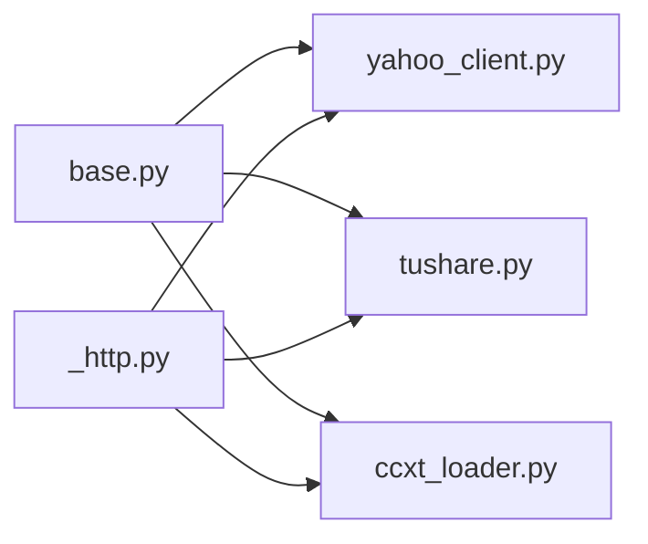

# 数据源问题

<cite>
**本文引用的文件**
- [base.py](file://agent/backtest/loaders/base.py)
- [_http.py](file://agent/backtest/loaders/_http.py)
- [yahoo_client.py](file://agent/backtest/loaders/yahoo_client.py)
- [tushare.py](file://agent/backtest/loaders/tushare.py)
- [ccxt_loader.py](file://agent/backtest/loaders/ccxt_loader.py)
</cite>

## 目录
1. [简介](#简介)
2. [项目结构](#项目结构)
3. [核心组件](#核心组件)
4. [架构总览](#架构总览)
5. [详细组件分析](#详细组件分析)
6. [依赖关系分析](#依赖关系分析)
7. [性能考虑](#性能考虑)
8. [故障排除指南](#故障排除指南)
9. [结论](#结论)
10. [附录](#附录)

## 简介
本指南聚焦于数据源连接问题的系统化排查，覆盖网络层（DNS、SSL、代理）、API限流与重试、认证失败（密钥过期、OAuth刷新、权限不足），以及具体数据源的典型故障：Yahoo Finance、Tushare、CCXT交易所。文档同时提供网络诊断、请求日志分析与性能监控的实践建议，帮助快速定位并恢复服务。

## 项目结构
本项目将各数据源接入统一抽象为“加载器”模块，并通过共享的HTTP节流、重试预算、本地缓存等基础设施保证稳定性与可观测性。关键路径如下：
- 通用能力：重试/预算、OHLC校验、本地Parquet缓存、环境变量解析
- HTTP层：按主机桶限速、会话复用、默认UA、超时控制
- 数据源加载器：Yahoo、Tushare、CCXT等各自实现fetch流程，复用通用能力

**图表来源**
- [base.py:122-236](file://agent/backtest/loaders/base.py#L122-L236)
- [_http.py:46-173](file://agent/backtest/loaders/_http.py#L46-L173)
- [yahoo_client.py:35-68](file://agent/backtest/loaders/yahoo_client.py#L35-L68)
- [tushare.py:14-35](file://agent/backtest/loaders/tushare.py#L14-L35)
- [ccxt_loader.py:20-57](file://agent/backtest/loaders/ccxt_loader.py#L20-L57)

**章节来源**
- [base.py:1-236](file://agent/backtest/loaders/base.py#L1-L236)
- [_http.py:1-201](file://agent/backtest/loaders/_http.py#L1-L201)
- [yahoo_client.py:1-68](file://agent/backtest/loaders/yahoo_client.py#L1-L68)
- [tushare.py:1-35](file://agent/backtest/loaders/tushare.py#L1-L35)
- [ccxt_loader.py:1-57](file://agent/backtest/loaders/ccxt_loader.py#L1-L57)

## 核心组件
- 重试与预算
  - 使用统一的“带预算的重试”机制，针对声明的瞬态异常进行有限次重试，并在墙钟时间耗尽时快速失败，避免长时间挂起。
  - 支持退避间隔与剩余预算保护，确保短预算下不浪费完整退避时间。
- OHLC数据校验
  - 在加载器边界对OHLC做一致性检查，剔除或拒绝非法K线，防止下游指标出现NaN/Inf。
- 本地缓存
  - 可选的本地Parquet缓存，基于内容寻址键生成，仅对已结算日期范围生效；读写失败不影响主流程。
- HTTP节流与会话复用
  - 按主机桶限制最小请求间隔，附带抖动防同步；进程内会话复用降低TCP/TLS开销。
  - 默认浏览器UA，减少被免费接口拒绝的概率。

**章节来源**
- [base.py:122-236](file://agent/backtest/loaders/base.py#L122-L236)
- [base.py:243-441](file://agent/backtest/loaders/base.py#L243-L441)
- [_http.py:46-173](file://agent/backtest/loaders/_http.py#L46-L173)

## 架构总览
下图展示从调用方到数据源的请求链路，包含限速、重试、缓存与认证握手的关键节点。

**图表来源**
- [base.py:398-450](file://agent/backtest/loaders/base.py#L398-L450)
- [base.py:623-661](file://agent/backtest/loaders/base.py#L623-L661)
- [_http.py:141-201](file://agent/backtest/loaders/_http.py#L141-L201)

## 详细组件分析

### Yahoo Finance 连接与限流
- 特点
  - 通过公共JSON端点获取行情、期权、搜索等，需遵守IP级限流。
  - 部分接口需要Cookie与crumb令牌，首次获取后缓存，遇到401自动刷新一次并重试。
  - 所有请求经共享HTTP节流器，按主机桶限速，避免并发打满。
- 常见问题与处理
  - DNS/SSL/代理：由底层requests与系统网络栈处理；可通过代理环境变量注入（见CCXT代理配置思路）。
  - 限流：通过最小间隔与环境变量覆盖调整；必要时增大间隔或降低并发。
  - 认证：401触发crumb刷新，若仍失败则传播上层错误。
- 建议
  - 合理设置最小间隔，避免短时间高频访问。
  - 关注日志中的401与crumb刷新记录，确认握手正常。

**图表来源**
- [yahoo_client.py:98-156](file://agent/backtest/loaders/yahoo_client.py#L98-L156)
- [yahoo_client.py:302-357](file://agent/backtest/loaders/yahoo_client.py#L302-L357)
- [yahoo_client.py:360-406](file://agent/backtest/loaders/yahoo_client.py#L360-L406)

**章节来源**
- [yahoo_client.py:1-68](file://agent/backtest/loaders/yahoo_client.py#L1-L68)
- [yahoo_client.py:98-156](file://agent/backtest/loaders/yahoo_client.py#L98-L156)
- [yahoo_client.py:302-357](file://agent/backtest/loaders/yahoo_client.py#L302-L357)
- [yahoo_client.py:360-406](file://agent/backtest/loaders/yahoo_client.py#L360-L406)

### Tushare 接口调用与配额限制
- 特点
  - 支持A股、港股、指数、基金等日频与分钟频数据。
  - 分钟频需较高积分等级；配额拒绝通过消息关键字识别并退避重试。
  - 日线数据走缓存优化，合并基本面字段。
- 常见问题与处理
  - 配额限制：识别“每分钟/每天/频率/访问该接口”等关键词，按退避序列等待后重试。
  - 空数据/不支持类型：跳过或警告，避免阻塞整体流程。
  - 复权因子缺失：无法获得可用复权因子时直接丢弃该标的，避免回测失真。
- 建议
  - 控制并发与频率，避免触发配额。
  - 关注日志中关于分钟频积分要求与复权因子失败的提示。

**图表来源**
- [tushare.py:18-35](file://agent/backtest/loaders/tushare.py#L18-L35)
- [tushare.py:51-79](file://agent/backtest/loaders/tushare.py#L51-L79)

**章节来源**
- [tushare.py:18-35](file://agent/backtest/loaders/tushare.py#L18-L35)
- [tushare.py:51-79](file://agent/backtest/loaders/tushare.py#L51-L79)
- [tushare.py:148-211](file://agent/backtest/loaders/tushare.py#L148-L211)
- [tushare.py:207-268](file://agent/backtest/loaders/tushare.py#L207-L268)
- [tushare.py:416-476](file://agent/backtest/loaders/tushare.py#L416-L476)

### CCXT 交易所连接与预算控制
- 特点
  - 统一对接100+交易所，默认Binance；支持现货与永续合约。
  - 每个HTTP调用设置超时，分页拉取受“预算”约束，瞬态网络错误自动重试。
  - 代理配置读取标准环境变量，构建proxies字典传入交易所实例。
- 常见问题与处理
  - 连接超时/断开：NetworkError视为瞬态，按预算与退避重试；超过预算抛错快速失败。
  - 历史不完整：当达到页上限且时间未覆盖到目标区间，抛出“历史不完整”错误。
  - 资金费率缺失：对永续合约，资金费率缺失会报错，确保风控数据完整。
- 建议
  - 根据网络质量调整超时与预算；在高延迟环境下适当放宽。
  - 使用代理时确认ALL_PROXY/HTTP_PROXY/HTTPS_PROXY正确设置。

**图表来源**
- [ccxt_loader.py:20-57](file://agent/backtest/loaders/ccxt_loader.py#L20-L57)
- [ccxt_loader.py:426-501](file://agent/backtest/loaders/ccxt_loader.py#L426-L501)
- [base.py:398-450](file://agent/backtest/loaders/base.py#L398-L450)

**章节来源**
- [ccxt_loader.py:20-57](file://agent/backtest/loaders/ccxt_loader.py#L20-L57)
- [ccxt_loader.py:203-224](file://agent/backtest/loaders/ccxt_loader.py#L203-L224)
- [ccxt_loader.py:426-501](file://agent/backtest/loaders/ccxt_loader.py#L426-L501)

## 依赖关系分析
- 加载器均依赖base提供的重试/预算/缓存能力，确保对外部不稳定性的鲁棒性。
- HTTP层为Yahoo等直接HTTP调用的加载器提供限速与会话复用，降低被限流概率。
- 各加载器内部对特定数据源的错误语义进行分类（如Tushare配额、CCXT网络错误），以决定重试策略。

**图表来源**
- [base.py:122-236](file://agent/backtest/loaders/base.py#L122-L236)
- [_http.py:46-173](file://agent/backtest/loaders/_http.py#L46-L173)
- [yahoo_client.py:35-68](file://agent/backtest/loaders/yahoo_client.py#L35-L68)
- [tushare.py:14-35](file://agent/backtest/loaders/tushare.py#L14-L35)
- [ccxt_loader.py:20-57](file://agent/backtest/loaders/ccxt_loader.py#L20-L57)

**章节来源**
- [base.py:122-236](file://agent/backtest/loaders/base.py#L122-L236)
- [_http.py:46-173](file://agent/backtest/loaders/_http.py#L46-L173)
- [yahoo_client.py:35-68](file://agent/backtest/loaders/yahoo_client.py#L35-L68)
- [tushare.py:14-35](file://agent/backtest/loaders/tushare.py#L14-L35)
- [ccxt_loader.py:20-57](file://agent/backtest/loaders/ccxt_loader.py#L20-L57)

## 性能考虑
- 重试与预算
  - 使用统一预算控制单次拉取的总耗时，避免长尾请求拖垮任务。
  - 退避间隔与剩余预算结合，缩短紧急场景下的等待时间。
- 缓存
  - 对已完成交易日的数据进行本地缓存，显著减少重复请求与网络开销。
  - 缓存键包含版本、来源、标的、时间框架、起止日期与字段，确保一致性。
- HTTP节流
  - 按主机桶限速，避免同一提供商被限流；会话复用降低握手成本。
  - 默认浏览器UA提升兼容性。

**章节来源**
- [base.py:398-450](file://agent/backtest/loaders/base.py#L398-L450)
- [base.py:243-441](file://agent/backtest/loaders/base.py#L243-L441)
- [_http.py:46-173](file://agent/backtest/loaders/_http.py#L46-L173)

## 故障排除指南

### 网络连接问题
- DNS解析失败
  - 现象：域名无法解析，请求立即失败。
  - 排查：检查系统DNS配置与网络连通性；尝试更换DNS或使用直连IP测试。
  - 相关：Yahoo/CCXT均依赖系统解析，无特殊配置。
- SSL证书错误
  - 现象：TLS握手失败，证书验证错误。
  - 排查：确认系统时间准确、CA证书链完整；企业环境检查代理MITM证书。
  - 相关：requests库负责TLS，遵循系统信任链。
- 代理服务器配置
  - 现象：通过代理访问受限或失败。
  - 排查：设置ALL_PROXY/HTTP_PROXY/HTTPS_PROXY；CCXT会从这些变量构建proxies字典。
  - 参考：CCXT代理配置逻辑。

**章节来源**
- [ccxt_loader.py:73-92](file://agent/backtest/loaders/ccxt_loader.py#L73-L92)
- [_http.py:141-173](file://agent/backtest/loaders/_http.py#L141-L173)

### API限流处理
- 请求频率限制
  - Yahoo：通过最小间隔与环境变量覆盖；必要时增大间隔或降低并发。
  - Tushare：分钟频需高积分；配额拒绝通过关键字识别并退避重试。
  - CCXT：启用内置速率限制，配合超时与预算控制。
- 重试机制配置
  - 使用统一重试预算，针对瞬态异常（如网络错误）进行有限次重试。
  - 退避间隔可调，注意预算剩余时间对实际等待的影响。
- 缓存策略优化
  - 开启本地缓存以减少重复请求；仅对已结算日期范围生效。
  - 缓存读写失败不影响主流程，自动降级到在线拉取。

**章节来源**
- [yahoo_client.py:60-69](file://agent/backtest/loaders/yahoo_client.py#L60-L69)
- [tushare.py:18-35](file://agent/backtest/loaders/tushare.py#L18-L35)
- [ccxt_loader.py:50-57](file://agent/backtest/loaders/ccxt_loader.py#L50-L57)
- [base.py:398-450](file://agent/backtest/loaders/base.py#L398-L450)
- [base.py:243-441](file://agent/backtest/loaders/base.py#L243-L441)

### 认证失败问题
- API密钥过期
  - Tushare：检查token是否有效；无效时将导致鉴权失败。
  - CCXT：公开行情无需密钥；涉及用户数据的接口需正确配置。
- OAuth令牌刷新
  - Yahoo：quoteSummary/options在401时自动刷新crumb并重试一次；二次失败则上报错误。
- 权限不足处理
  - Tushare分钟频需高积分；不足时返回空或报错，应降级或提示。
  - 其他数据源：根据错误码与日志判断权限范围。

**章节来源**
- [tushare.py:133-146](file://agent/backtest/loaders/tushare.py#L133-L146)
- [yahoo_client.py:302-357](file://agent/backtest/loaders/yahoo_client.py#L302-L357)
- [ccxt_loader.py:203-224](file://agent/backtest/loaders/ccxt_loader.py#L203-L224)

### 具体数据源故障排除
- Yahoo Finance连接超时
  - 现象：请求超时或频繁401。
  - 排查：检查网络与代理；增大最小间隔；观察crumb刷新日志。
  - 参考：Yahoo客户端的节流与握手逻辑。
- Tushare接口调用失败
  - 现象：配额拒绝、空数据、复权因子缺失。
  - 排查：降低并发；确认积分等级；关注复权因子可用性。
  - 参考：Tushare加载器的配额识别与退避逻辑。
- CCXT交易所连接问题
  - 现象：NetworkError、历史不完整、资金费率缺失。
  - 排查：调整超时与预算；检查代理；确认时间窗与页上限。
  - 参考：CCXT加载器的预算控制与完整性校验。

**章节来源**
- [yahoo_client.py:60-69](file://agent/backtest/loaders/yahoo_client.py#L60-L69)
- [yahoo_client.py:302-357](file://agent/backtest/loaders/yahoo_client.py#L302-L357)
- [tushare.py:18-35](file://agent/backtest/loaders/tushare.py#L18-L35)
- [tushare.py:207-268](file://agent/backtest/loaders/tushare.py#L207-L268)
- [ccxt_loader.py:50-57](file://agent/backtest/loaders/ccxt_loader.py#L50-L57)
- [ccxt_loader.py:426-501](file://agent/backtest/loaders/ccxt_loader.py#L426-L501)

### 网络诊断工具使用
- 基础连通性
  - ping/traceroute：检测DNS与路由问题。
  - curl/wget：模拟HTTP请求，查看状态码与响应体。
- TLS与证书
  - openssl s_client：检查证书链与握手过程。
- 代理验证
  - 通过curl --proxy设置代理，验证代理可达性与鉴权。

[本节为通用实践，不直接分析具体文件]

### 请求日志分析
- 关注点
  - 401与crumb刷新：Yahoo客户端会在401时刷新并重试。
  - 配额拒绝：Tushare会记录“每分钟/每天/频率”等关键字并退避。
  - 网络错误：CCXT将NetworkError视为瞬态并重试。
- 方法
  - 启用详细日志级别，捕获重试与预算信息。
  - 统计失败率与重试次数，评估限流与网络质量。

**章节来源**
- [yahoo_client.py:340-344](file://agent/backtest/loaders/yahoo_client.py#L340-L344)
- [tushare.py:75-78](file://agent/backtest/loaders/tushare.py#L75-L78)
- [ccxt_loader.py:446-462](file://agent/backtest/loaders/ccxt_loader.py#L446-L462)

### 性能监控方法
- 指标
  - 请求耗时分布、重试次数、预算耗尽比例。
  - 缓存命中率、失败率与错误类型分布。
- 手段
  - 在加载器入口/出口埋点，记录耗时与状态。
  - 聚合日志至监控系统，设置告警阈值。

[本节为通用实践，不直接分析具体文件]

## 结论
通过统一的预算重试、HTTP节流与本地缓存，项目对各类数据源的不稳定因素具备良好鲁棒性。排查时应优先确认网络与代理、再检查限流与认证，最后定位具体数据源的特定限制。结合日志与监控，可快速缩小问题范围并恢复服务。

## 附录
- 环境变量参考
  - VIBE_TRADING_DATA_CACHE：是否启用本地缓存
  - VIBE_TRADING_DATA_CACHE_ROOT：缓存根目录
  - VIBE_TRADING_YAHOO_MIN_INTERVAL：Yahoo最小请求间隔
  - CCXT_TIMEOUT_MS：CCXT请求超时毫秒
  - CCXT_FETCH_BUDGET_S：CCXT单次拉取预算秒数
  - ALL_PROXY/HTTP_PROXY/HTTPS_PROXY：代理配置

[本节为通用实践，不直接分析具体文件]