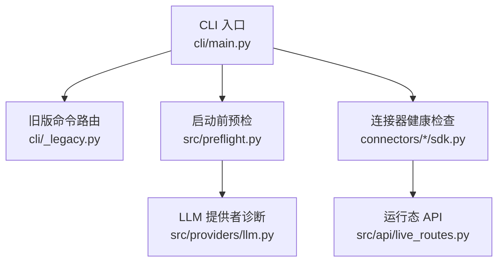
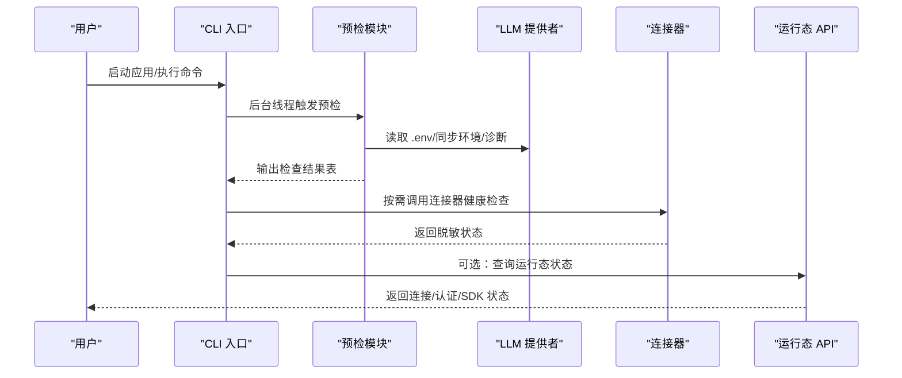
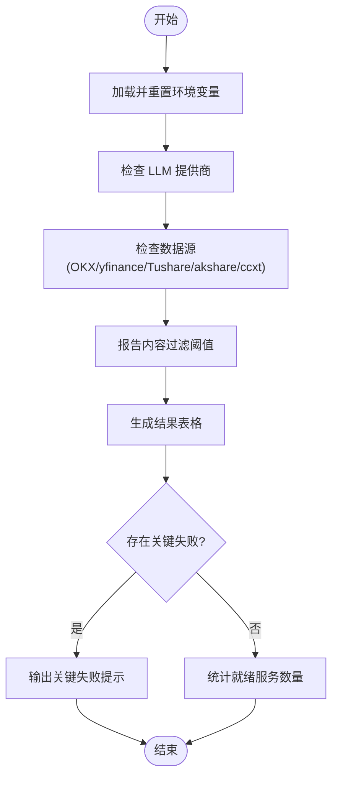
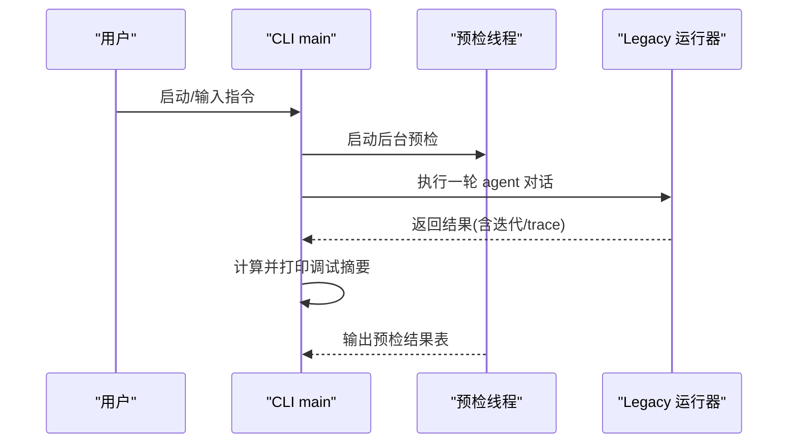
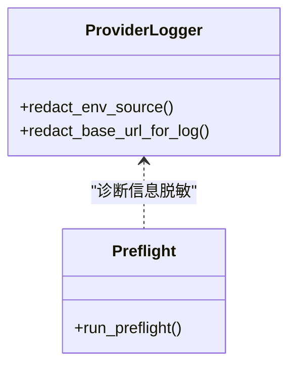
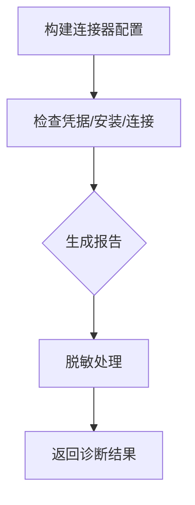
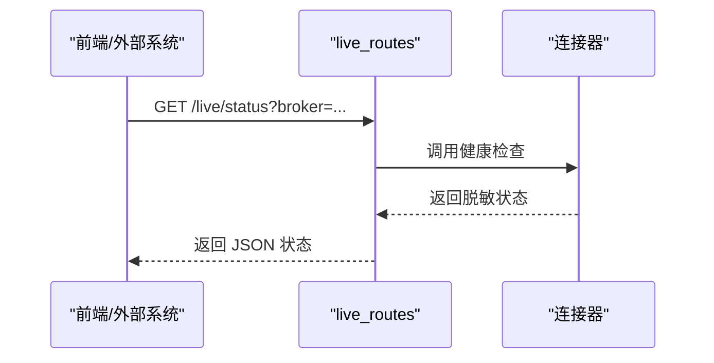
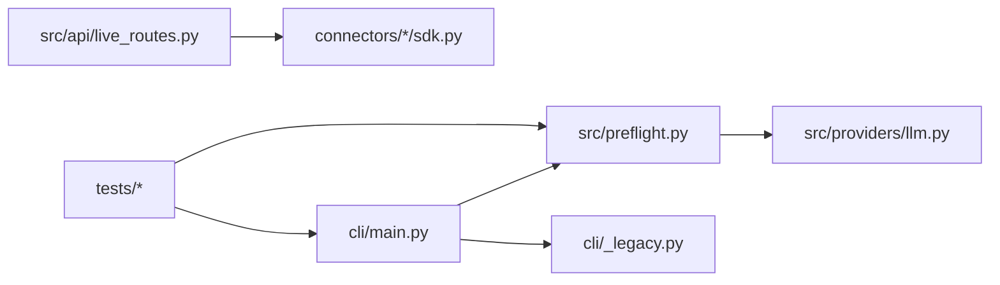

# 调试工具

<cite>
**本文引用的文件**
- [agent/src/preflight.py](file://agent/src/preflight.py)
- [agent/cli/main.py](file://agent/cli/main.py)
- [agent/cli/_legacy.py](file://agent/cli/_legacy.py)
- [agent/src/providers/llm.py](file://agent/src/providers/llm.py)
- [agent/backtest/loaders/qveris_loader.py](file://agent/backtest/loaders/qveris_loader.py)
- [agent/src/trading/connectors/longbridge/sdk.py](file://agent/src/trading/connectors/longbridge/sdk.py)
- [agent/src/api/live_routes.py](file://agent/src/api/live_routes.py)
- [agent/tests/test_preflight.py](file://agent/tests/test_preflight.py)
- [agent/tests/test_cli_interactive.py](file://agent/tests/test_cli_interactive.py)
</cite>

## 目录
1. [简介](#简介)
2. [项目结构](#项目结构)
3. [核心组件](#核心组件)
4. [架构总览](#架构总览)
5. [详细组件分析](#详细组件分析)
6. [依赖关系分析](#依赖关系分析)
7. [性能注意事项](#性能注意事项)
8. [故障排查指南](#故障排查指南)
9. [结论](#结论)
10. [附录](#附录)

## 简介
本指南面向使用 Vibe-Trading 的开发者与运维人员，聚焦“调试工具与日志分析”。内容涵盖：
- 日志级别配置与输出控制（DEBUG、INFO、WARNING、ERROR）
- 预检工具的高级用法（自定义检查项、批量环境验证、自动化测试集成）
- 性能监控方法（内存使用、CPU占用、网络请求追踪）
- 调试模式启用（详细错误堆栈、SQL查询日志、HTTP请求响应记录）
- 常用调试命令（vibe-trading debug、vibe-trading logs、vibe-trading status 等）

## 项目结构
Vibe-Trading 的调试能力由 CLI 入口、启动前预检、LLM 提供者诊断、连接器健康检查与 API 路由共同构成。CLI 负责交互与命令分发；预检模块在启动时探测 LLM 与数据源连通性；各连接器提供脱敏的健康状态报告；API 层暴露运行时状态查询接口。

图表来源
- [agent/cli/main.py:1-120](file://agent/cli/main.py#L1-L120)
- [agent/cli/_legacy.py:1-120](file://agent/cli/_legacy.py#L1-L120)
- [agent/src/preflight.py:284-336](file://agent/src/preflight.py#L284-L336)
- [agent/src/providers/llm.py:855-893](file://agent/src/providers/llm.py#L855-L893)
- [agent/src/trading/connectors/longbridge/sdk.py:220-255](file://agent/src/trading/connectors/longbridge/sdk.py#L220-L255)
- [agent/src/api/live_routes.py:286-310](file://agent/src/api/live_routes.py#L286-L310)

章节来源
- [agent/cli/main.py:1-120](file://agent/cli/main.py#L1-L120)
- [agent/cli/_legacy.py:1-120](file://agent/cli/_legacy.py#L1-L120)

## 核心组件
- 启动前预检（Preflight）：在应用启动阶段对 LLM 提供商、数据源与关键依赖进行连通性与配置检查，并以表格形式输出结果，标记关键失败项。
- CLI 交互与命令路由：统一入口，支持交互式会话、子命令分发、后台异步预检与调试摘要打印。
- LLM 提供者诊断：加载 .env、同步环境变量、输出 base_url/超时/重试/代理等诊断信息，并对敏感信息进行脱敏。
- 连接器健康检查：为不同交易连接器提供只读就绪检查与脱敏的诊断报告。
- 运行态 API：暴露连接器的认证状态、SDK 安装情况、连接状态等，便于外部系统或前端查询。

章节来源
- [agent/src/preflight.py:21-336](file://agent/src/preflight.py#L21-L336)
- [agent/cli/main.py:117-212](file://agent/cli/main.py#L117-L212)
- [agent/src/providers/llm.py:855-893](file://agent/src/providers/llm.py#L855-L893)
- [agent/src/trading/connectors/longbridge/sdk.py:220-255](file://agent/src/trading/connectors/longbridge/sdk.py#L220-L255)
- [agent/src/api/live_routes.py:286-310](file://agent/src/api/live_routes.py#L286-L310)

## 架构总览
下图展示了从 CLI 到预检、再到 LLM 与连接器健康检查的整体流程，以及 API 如何对外暴露运行态信息。

图表来源
- [agent/cli/main.py:518-537](file://agent/cli/main.py#L518-L537)
- [agent/src/preflight.py:284-336](file://agent/src/preflight.py#L284-L336)
- [agent/src/providers/llm.py:855-893](file://agent/src/providers/llm.py#L855-L893)
- [agent/src/trading/connectors/longbridge/sdk.py:220-255](file://agent/src/trading/connectors/longbridge/sdk.py#L220-L255)
- [agent/src/api/live_routes.py:286-310](file://agent/src/api/live_routes.py#L286-L310)

## 详细组件分析

### 启动前预检（Preflight）
- 功能要点
  - 检查 LLM 提供商是否已配置并可访问（包括 OpenAI Codex OAuth、Copilot 等）。
  - 检查数据源可用性（OKX、yfinance、Tushare、akshare、ccxt）。
  - 报告内容过滤阈值配置。
  - 对关键失败项给出明确提示（如无法启动的原因与建议）。
- 扩展点
  - 新增检查项：实现一个返回 CheckResult 的函数，并将其加入 run_preflight 的检查列表。
  - 批量环境验证：通过设置环境变量组合，快速验证多套环境下的连通性与配置。
  - 自动化测试集成：在测试中通过 monkeypatch 模拟网络与依赖，断言检查结果与消息。

图表来源
- [agent/src/preflight.py:32-153](file://agent/src/preflight.py#L32-L153)
- [agent/src/preflight.py:156-271](file://agent/src/preflight.py#L156-L271)
- [agent/src/preflight.py:249-257](file://agent/src/preflight.py#L249-L257)
- [agent/src/preflight.py:284-336](file://agent/src/preflight.py#L284-L336)

章节来源
- [agent/src/preflight.py:21-336](file://agent/src/preflight.py#L21-L336)
- [agent/tests/test_preflight.py:12-156](file://agent/tests/test_preflight.py#L12-L156)

### CLI 交互与调试摘要
- 功能要点
  - 交互式入口检测与引导，必要时运行首次配置向导。
  - 后台异步执行预检，避免阻塞主界面渲染。
  - 单轮对话结束后打印调试摘要（迭代次数、工具调用数、耗时、上下文近似 token 数）。
  - 支持 slash 命令注册与分发，包含连接器相关命令。
- 调试模式
  - 在交互上下文中维护 debug 标志，用于开启/关闭调试摘要输出。
  - 通过 /debug 命令切换调试面板显示。

图表来源
- [agent/cli/main.py:518-537](file://agent/cli/main.py#L518-L537)
- [agent/cli/main.py:664-694](file://agent/cli/main.py#L664-L694)
- [agent/cli/main.py:696-773](file://agent/cli/main.py#L696-L773)
- [agent/tests/test_cli_interactive.py:535-543](file://agent/tests/test_cli_interactive.py#L535-L543)

章节来源
- [agent/cli/main.py:117-212](file://agent/cli/main.py#L117-L212)
- [agent/cli/main.py:518-537](file://agent/cli/main.py#L518-L537)
- [agent/cli/main.py:664-694](file://agent/cli/main.py#L664-L694)
- [agent/cli/main.py:696-773](file://agent/cli/main.py#L696-L773)
- [agent/tests/test_cli_interactive.py:535-543](file://agent/tests/test_cli_interactive.py#L535-L543)

### LLM 提供者诊断与日志脱敏
- 功能要点
  - 加载 .env 候选路径，重置配置缓存，确保最新的环境变量生效。
  - 输出 base_url、超时、重试、代理等诊断信息，并对 base URL 进行安全脱敏。
  - 对 .env 来源进行符号化标注，避免泄露真实路径。
- 日志级别建议
  - DEBUG：仅在本地开发或定位问题时启用，避免在生产环境产生过多噪声。
  - INFO：默认级别，记录关键步骤与诊断摘要。
  - WARNING：配置缺失、可恢复异常、降级行为。
  - ERROR：不可恢复错误、阻断启动的关键失败。

图表来源
- [agent/src/providers/llm.py:855-893](file://agent/src/providers/llm.py#L855-L893)
- [agent/src/preflight.py:32-153](file://agent/src/preflight.py#L32-L153)

章节来源
- [agent/src/providers/llm.py:855-893](file://agent/src/providers/llm.py#L855-L893)

### 连接器健康检查与脱敏报告
- 功能要点
  - 以只读方式检查连接器就绪状态，返回稳定且脱敏的诊断报告。
  - 报告字段包括：配置状态、凭据来源、连接状态、错误码、SDK 安装情况等。
  - 对敏感字段（如密码、账号号段）进行脱敏处理，防止泄露。
- 典型场景
  - 登录失败、凭据缺失、SDK 未安装、网络不可达等。

图表来源
- [agent/src/trading/connectors/longbridge/sdk.py:220-255](file://agent/src/trading/connectors/longbridge/sdk.py#L220-L255)

章节来源
- [agent/src/trading/connectors/longbridge/sdk.py:220-255](file://agent/src/trading/connectors/longbridge/sdk.py#L220-L255)

### 运行态 API 与状态查询
- 功能要点
  - 暴露连接器认证状态、连接状态、错误信息等，供前端或外部系统集成。
  - 对返回结果进行脱敏，避免泄露配置细节。
- 常见用途
  - 前端展示连接器状态、自动刷新健康检查、告警触发。

图表来源
- [agent/src/api/live_routes.py:286-310](file://agent/src/api/live_routes.py#L286-L310)
- [agent/src/trading/connectors/longbridge/sdk.py:220-255](file://agent/src/trading/connectors/longbridge/sdk.py#L220-L255)

章节来源
- [agent/src/api/live_routes.py:286-310](file://agent/src/api/live_routes.py#L286-L310)

## 依赖关系分析
- CLI 与预检：CLI 在启动时异步触发预检，避免阻塞 UI；预检完成后输出结果。
- 预检与 LLM：预检依赖 LLM 提供者诊断模块，读取 .env 并校验连通性。
- 连接器与 API：连接器健康检查被 API 调用，对外暴露运行态信息。
- 测试与验证：测试用例通过 monkeypatch 模拟环境与依赖，验证预检逻辑与输出。

图表来源
- [agent/cli/main.py:518-537](file://agent/cli/main.py#L518-L537)
- [agent/src/preflight.py:284-336](file://agent/src/preflight.py#L284-L336)
- [agent/src/providers/llm.py:855-893](file://agent/src/providers/llm.py#L855-L893)
- [agent/src/api/live_routes.py:286-310](file://agent/src/api/live_routes.py#L286-L310)
- [agent/tests/test_preflight.py:12-156](file://agent/tests/test_preflight.py#L12-L156)

章节来源
- [agent/cli/main.py:518-537](file://agent/cli/main.py#L518-L537)
- [agent/src/preflight.py:284-336](file://agent/src/preflight.py#L284-L336)
- [agent/src/providers/llm.py:855-893](file://agent/src/providers/llm.py#L855-L893)
- [agent/src/api/live_routes.py:286-310](file://agent/src/api/live_routes.py#L286-L310)
- [agent/tests/test_preflight.py:12-156](file://agent/tests/test_preflight.py#L12-L156)

## 性能注意事项
- 预检与诊断
  - 预检在网络探测与依赖导入上可能带来短暂延迟，已在 CLI 中以后台线程执行，避免阻塞主流程。
  - LLM 诊断仅输出必要信息，避免频繁 I/O 与敏感数据泄露。
- 连接器健康检查
  - 健康检查采用只读操作与合理超时，减少对外部服务的压力。
  - 报告字段经过脱敏，避免序列化大对象或敏感数据。
- 调试摘要
  - 调试摘要基于轻量统计（迭代次数、工具调用计数、耗时、上下文字符估算），开销较低。
- 建议
  - 在生产环境保持 INFO 及以上级别，仅在定位问题时临时提升为 DEBUG。
  - 对高频健康检查接口增加限流与缓存，避免对第三方服务造成压力。

[本节为通用指导，不直接分析具体文件]

## 故障排查指南
- 常见问题
  - LLM 提供商未配置或不可达：检查 .env 中的 provider 与 model 名称，确认 base URL 可达。
  - 数据源不可用：检查对应包是否安装、网络连通性与 API 返回码。
  - 连接器认证失败：查看连接器健康检查返回的错误码与消息，确认凭据与 SDK 安装。
- 日志级别与输出
  - 调整日志级别至 DEBUG 以获取更详细的错误堆栈与诊断信息。
  - 关注 WARNING 与 ERROR 级别的输出，它们通常指示配置缺失或可恢复异常。
- 调试模式
  - 在交互模式下启用 /debug 开关，查看每轮对话的调试摘要。
  - 通过 CLI 的后台预检输出，快速识别启动时的关键失败项。
- 自动化测试集成
  - 使用测试框架的 monkeypatch 模拟网络与依赖，验证预检逻辑在不同环境下的表现。
  - 断言预检结果的状态、消息与影响说明，确保变更不会破坏现有行为。

章节来源
- [agent/src/preflight.py:32-153](file://agent/src/preflight.py#L32-L153)
- [agent/src/preflight.py:156-271](file://agent/src/preflight.py#L156-L271)
- [agent/src/preflight.py:284-336](file://agent/src/preflight.py#L284-L336)
- [agent/tests/test_preflight.py:12-156](file://agent/tests/test_preflight.py#L12-L156)
- [agent/cli/main.py:664-694](file://agent/cli/main.py#L664-L694)

## 结论
Vibe-Trading 提供了完善的调试与日志分析能力：
- 启动前预检帮助快速发现配置与连通性问题，并给出明确提示。
- CLI 交互与调试摘要便于日常开发与问题定位。
- LLM 与连接器健康检查提供脱敏的运行态信息，适合集成到监控系统。
- 通过合理的日志级别与调试模式，可在保证生产稳定的同时，获得足够的诊断信息。

[本节为总结，不直接分析具体文件]

## 附录

### 日志级别配置与输出控制
- DEBUG：详细内部流程、参数与中间状态，适用于本地开发与问题复现。
- INFO：关键步骤与诊断摘要，默认生产级别。
- WARNING：配置缺失、降级行为、可恢复异常。
- ERROR：不可恢复错误、阻断启动的关键失败。
- 实践建议
  - 在 CI 或生产环境中保持 INFO 及以上级别。
  - 在本地调试时临时提升至 DEBUG，并在问题解决后恢复。

[本节为通用指导，不直接分析具体文件]

### 预检工具高级用法
- 自定义检查项添加
  - 实现一个返回 CheckResult 的函数，描述名称、状态、消息与影响。
  - 将其加入 run_preflight 的检查列表，以便在启动时自动执行。
- 批量环境验证
  - 通过环境变量组合，快速验证多套环境的连通性与配置。
  - 结合测试框架，对不同环境进行断言与回归。
- 自动化测试集成
  - 使用 monkeypatch 模拟网络与依赖，确保预检逻辑在不同条件下稳定。
  - 断言检查结果的状态、消息与影响说明，避免回归。

章节来源
- [agent/src/preflight.py:21-336](file://agent/src/preflight.py#L21-L336)
- [agent/tests/test_preflight.py:12-156](file://agent/tests/test_preflight.py#L12-L156)

### 性能监控方法
- 内存使用监控
  - 观察调试摘要中的上下文大小估算，结合进程内存指标进行分析。
  - 对频繁创建的大对象进行复用或释放，避免内存泄漏。
- CPU 占用分析
  - 关注工具调用耗时与迭代次数，定位热点路径。
  - 对高 CPU 占用的模块进行采样分析与优化。
- 网络请求追踪
  - 通过连接器健康检查与 LLM 诊断输出，追踪网络请求的超时、重试与代理配置。
  - 对第三方 API 增加重试与退避策略，降低抖动影响。

[本节为通用指导，不直接分析具体文件]

### 调试模式启用
- 详细错误堆栈输出
  - 将日志级别调整为 DEBUG，捕获完整的异常堆栈与上下文。
  - 关注 WARNING 与 ERROR 级别的输出，快速定位问题。
- SQL 查询日志
  - 在数据库访问层启用 SQL 日志，记录查询语句与执行时间。
  - 对慢查询进行索引优化与语句改写。
- HTTP 请求响应记录
  - 在 HTTP 客户端或服务端记录请求与响应摘要，注意脱敏敏感字段。
  - 结合链路追踪，定位跨服务调用的瓶颈与错误。

[本节为通用指导，不直接分析具体文件]

### 常用调试命令
- vibe-trading debug
  - 在交互模式下启用调试摘要，查看每轮对话的迭代次数、工具调用数、耗时与上下文估算。
- vibe-trading logs
  - 查看应用日志，结合日志级别筛选 DEBUG/INFO/WARNING/ERROR 输出。
- vibe-trading status
  - 查询运行态状态，包括连接器认证、连接状态与 SDK 安装情况。
- 其他命令
  - vibe-trading serve：启动 API 服务器，便于前端或外部系统集成。
  - vibe-trading chat：进入交互式会话，执行自然语言研究与回测。

章节来源
- [agent/cli/main.py:664-694](file://agent/cli/main.py#L664-L694)
- [agent/cli/main.py:696-773](file://agent/cli/main.py#L696-L773)
- [agent/src/api/live_routes.py:286-310](file://agent/src/api/live_routes.py#L286-L310)