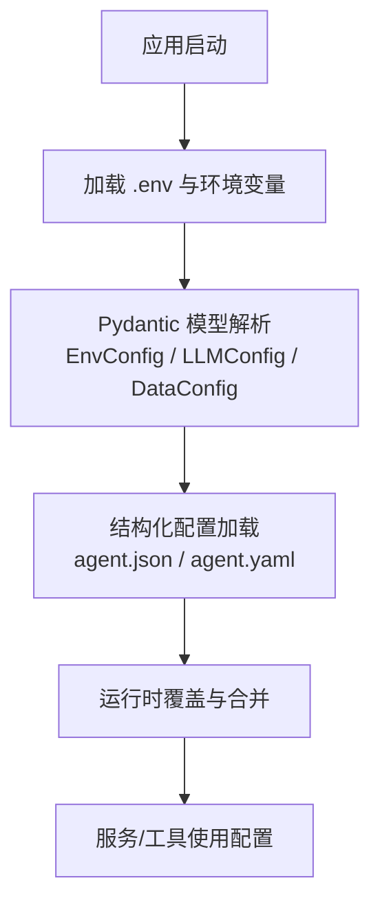
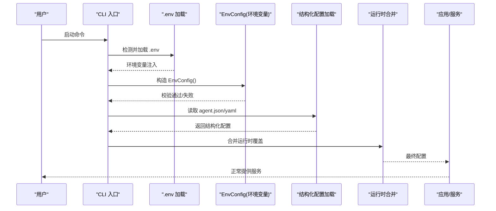
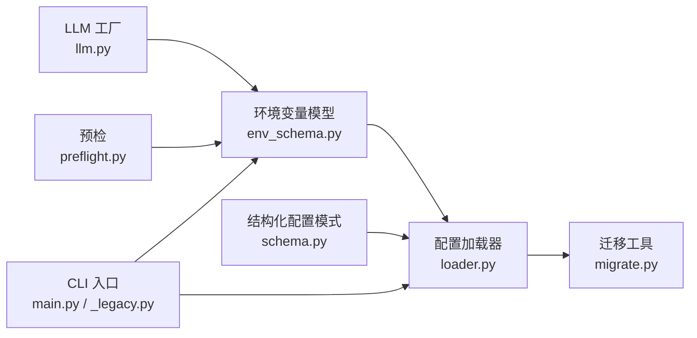

# 配置问题

<cite>
**本文引用的文件**
- [env_schema.py](file://agent/src/config/env_schema.py)
- [loader.py](file://agent/src/config/loader.py)
- [schema.py](file://agent/src/config/schema.py)
- [migrate.py](file://agent/src/config/migrate.py)
- [llm.py](file://agent/src/providers/llm.py)
- [preflight.py](file://agent/src/preflight.py)
- [main.py](file://agent/cli/main.py)
- [_legacy.py](file://agent/cli/_legacy.py)
- [SKILL.md](file://agent/src/skills/yfinance/SKILL.md)
</cite>

## 目录
1. [简介](#简介)
2. [项目结构](#项目结构)
3. [核心组件](#核心组件)
4. [架构总览](#架构总览)
5. [详细组件分析](#详细组件分析)
6. [依赖关系分析](#依赖关系分析)
7. [性能与可靠性考量](#性能与可靠性考量)
8. [故障排查指南](#故障排查指南)
9. [结论](#结论)
10. [附录](#附录)

## 简介
本指南聚焦于 Vibe-Trading 的配置问题排查，覆盖环境变量验证、配置文件语法校验、LLM 提供商配置、数据源配置（Tushare、yfinance、数据库等）、配置热重载机制与配置迁移工具的使用。目标是帮助你在最短时间内定位并修复配置错误，确保系统稳定运行。

## 项目结构
本项目将配置分为两类：
- 环境变量配置：通过 Pydantic 模型集中定义、校验与类型转换，统一从进程环境读取。
- 结构化配置文件：支持 JSON/YAML，提供运行时合并与迁移能力。

**图示来源**
- [env_schema.py:132-593](file://agent/src/config/env_schema.py#L132-L593)
- [loader.py:28-151](file://agent/src/config/loader.py#L28-L151)

**章节来源**
- [env_schema.py:1-593](file://agent/src/config/env_schema.py#L1-L593)
- [loader.py:1-346](file://agent/src/config/loader.py#L1-L346)

## 核心组件
- 环境变量模型层：集中定义所有环境变量名、默认值、类型与校验规则，并提供布尔/数值安全转换。
- 结构化配置加载器：读取 JSON/YAML，进行格式校验、合并与运行时覆盖。
- 迁移工具：将历史状态目录迁移到新的运行时根目录，保证升级不丢失数据。
- 预检与诊断：对关键外部依赖（如 yfinance、Tushare）进行可用性检查。

**章节来源**
- [env_schema.py:47-124](file://agent/src/config/env_schema.py#L47-L124)
- [loader.py:232-259](file://agent/src/config/loader.py#L232-L259)
- [migrate.py:114-152](file://agent/src/config/migrate.py#L114-L152)
- [preflight.py:184-224](file://agent/src/preflight.py#L184-L224)

## 架构总览
下图展示了从 .env 到最终配置生效的完整链路，包括 CLI 初始化、环境变量加载、Pydantic 校验、结构化配置合并与迁移。

**图示来源**
- [main.py:101-103](file://agent/cli/main.py#L101-L103)
- [env_schema.py:685-716](file://agent/src/config/env_schema.py#L685-L716)
- [loader.py:28-151](file://agent/src/config/loader.py#L28-L151)

## 详细组件分析

### 环境变量配置验证
- 统一模型：EnvConfig 聚合 LLM、Data、API、Swarm、AgentTuning、Paths、OCR、Memory 等子配置，每个字段都有明确的别名（环境变量名）、默认值与类型约束。
- 布尔转换：自定义 BeforeValidator 接受多种字符串表示（如 true/false/on/off/1/0），避免误配导致崩溃。
- 数值安全：当环境变量为字符串但目标类型为 int/float 时，若无法解析则静默回退到默认值，防止启动失败。
- API Key 别名兼容：当仅设置 VIBE_TRADING_API_KEY 时，自动复制到 api_auth_key，保持 CLI 与服务端一致性。

常见错误与修复建议：
- 变量名拼写错误：确认使用 UPPER_SNAKE_CASE 的别名（例如 TUSHARE_TOKEN、OPENAI_MODEL）。
- 数据类型错误：布尔型请使用 true/false；数值型必须可解析为数字。
- 缺失必填项：某些场景下未设置会导致功能降级或不可用（如 Tushare token）。

**章节来源**
- [env_schema.py:48-74](file://agent/src/config/env_schema.py#L48-L74)
- [env_schema.py:81-124](file://agent/src/config/env_schema.py#L81-L124)
- [env_schema.py:132-214](file://agent/src/config/env_schema.py#L132-L214)
- [env_schema.py:685-716](file://agent/src/config/env_schema.py#L685-L716)

### 配置文件语法错误（JSON/YAML/模板渲染）
- 文件格式：仅支持 .json 与 .yaml/.yml；不支持其他扩展名。
- YAML 依赖：若缺少 PyYAML，将明确报错提示“YAML 配置不可用”。
- 内容校验：解析后必须为对象（字典），否则拒绝加载并记录警告。
- 合并策略：运行时覆盖会递归合并字典，MCP server 配置在传输类型切换时会重置不兼容字段，避免冲突。

常见问题与修复建议：
- JSON 语法错误：检查逗号、引号、括号匹配。
- YAML 缩进错误：确保层级缩进一致，避免混合 Tab/空格。
- 模板渲染失败：若使用外部模板生成配置，请确保输出为合法 JSON/YAML 后再交由加载器处理。

**章节来源**
- [loader.py:232-259](file://agent/src/config/loader.py#L232-L259)
- [loader.py:262-346](file://agent/src/config/loader.py#L262-L346)

### LLM 提供商配置问题
- 关键环境变量：
  - 提供商与模型：LANGCHAIN_PROVIDER、LANGCHAIN_MODEL_NAME、OPENAI_MODEL
  - 超时与重试：TIMEOUT_SECONDS、MAX_RETRIES
  - 代理控制：VIBE_TRADING_DISABLE_HTTP_PROXY（需 httpx 支持）
  - Responses API：LANGCHAIN_USE_RESPONSES_API（严格匹配 "true"）
- base URL 与认证：
  - OpenAI Codex base URL：OPENAI_CODEX_BASE_URL
  - 部分提供商通过 OAuth 管理 Authorization 头，禁止同时设置静态 headers
- 调试要点：
  - 若启用禁用代理，需安装 httpx，否则会抛出运行时错误
  - 使用预检脚本验证连接与可达性

**章节来源**
- [env_schema.py:132-159](file://agent/src/config/env_schema.py#L132-L159)
- [llm.py:49-72](file://agent/src/providers/llm.py#L49-L72)
- [schema.py:353-457](file://agent/src/config/schema.py#L353-L457)

### 数据源配置
- Tushare：
  - 环境变量：TUSHARE_TOKEN
  - 预检：未设置或占位符将被标记为未配置，影响 A 股数据获取
- yfinance：
  - 无需 API Key，直接抓取公开数据；注意速率限制与时间范围
  - 代理配置：可通过标准 HTTP(S)_PROXY 环境变量影响底层请求；如需绕过代理，参考 LLM 层的代理控制思路
- 其他数据源：
  - CCXT、Futu、Finnhub、AlphaVantage、Tiingo、FMP、Fred、Longbridge、QVeris、TickerAll、Rsshub、DashScope 等均有对应环境变量，详见 DataConfig

**章节来源**
- [env_schema.py:166-214](file://agent/src/config/env_schema.py#L166-L214)
- [preflight.py:184-224](file://agent/src/preflight.py#L184-L224)
- [SKILL.md:241-266](file://agent/src/skills/yfinance/SKILL.md#L241-L266)

### 配置热重载机制
- 环境变量热更新：EnvConfig 每次实例化都会从 os.environ 读取最新值，适合在进程内动态调整参数（如开关、阈值）。
- 结构化配置热更新：通过运行时覆盖（overrides）实现局部变更，不会重启进程即可生效。
- 注意事项：
  - 某些组件可能缓存配置，需要显式刷新或重新初始化
  - MCP server 配置在传输类型切换时会重置不兼容字段，避免半配置状态

**章节来源**
- [env_schema.py:81-124](file://agent/src/config/env_schema.py#L81-L124)
- [loader.py:57-100](file://agent/src/config/loader.py#L57-L100)

### 配置迁移工具
- 目的：将旧版代码相对路径下的状态目录（sessions、runs、.swarm/runs、uploads）迁移至新的运行时根目录，确保升级不丢失历史数据。
- 行为：
  - 原子移动：使用临时前缀命名，完成后再重命名，避免中途失败导致数据损坏
  - 幂等执行：重复运行不会重复迁移，已存在的目标会跳过
  - 恢复机制：中断后的临时文件会在下次启动时尝试恢复
- 适用场景：首次升级到新版本、重装后保留会话与运行历史

**章节来源**
- [migrate.py:1-19](file://agent/src/config/migrate.py#L1-L19)
- [migrate.py:114-152](file://agent/src/config/migrate.py#L114-L152)

## 依赖关系分析

**图示来源**
- [env_schema.py:685-716](file://agent/src/config/env_schema.py#L685-L716)
- [loader.py:28-151](file://agent/src/config/loader.py#L28-L151)
- [schema.py:301-513](file://agent/src/config/schema.py#L301-L513)
- [migrate.py:114-152](file://agent/src/config/migrate.py#L114-L152)
- [llm.py:49-72](file://agent/src/providers/llm.py#L49-L72)
- [preflight.py:184-224](file://agent/src/preflight.py#L184-L224)
- [main.py:101-103](file://agent/cli/main.py#L101-L103)
- [_legacy.py:422-457](file://agent/cli/_legacy.py#L422-L457)

**章节来源**
- [env_schema.py:132-593](file://agent/src/config/env_schema.py#L132-L593)
- [loader.py:1-346](file://agent/src/config/loader.py#L1-L346)
- [schema.py:1-513](file://agent/src/config/schema.py#L1-L513)
- [migrate.py:1-153](file://agent/src/config/migrate.py#L1-L153)
- [llm.py:1-200](file://agent/src/providers/llm.py#L1-L200)
- [preflight.py:184-224](file://agent/src/preflight.py#L184-L224)
- [main.py:101-103](file://agent/cli/main.py#L101-L103)
- [_legacy.py:422-457](file://agent/cli/_legacy.py#L422-L457)

## 性能与可靠性考量
- 配置加载失败降级：结构化配置加载失败会记录警告并回退到默认配置，保证服务可用。
- 数值与布尔安全转换：避免因非法环境变量导致启动崩溃。
- 迁移原子性：使用临时命名与重命名，确保迁移过程可恢复。
- 预检快速反馈：对关键外部依赖进行快速检查，尽早暴露问题。

[本节为通用指导，不直接分析具体文件]

## 故障排查指南

### 环境变量配置验证
- 检查点：
  - 变量名是否为 UPPER_SNAKE_CASE 别名（如 TUSHARE_TOKEN、OPENAI_MODEL）
  - 布尔值是否使用 true/false/on/off/1/0
  - 数值是否可解析为 int/float
- 建议步骤：
  - 打印当前环境变量，核对是否存在拼写错误
  - 逐步注释可疑变量，定位问题源头
  - 使用最小化配置复现问题

**章节来源**
- [env_schema.py:48-74](file://agent/src/config/env_schema.py#L48-L74)
- [env_schema.py:81-124](file://agent/src/config/env_schema.py#L81-L124)

### 配置文件语法错误
- 检查点：
  - JSON 是否合法（逗号、引号、括号）
  - YAML 缩进是否一致（避免 Tab/空格混用）
  - 是否安装了 PyYAML（否则 YAML 不可用）
- 建议步骤：
  - 使用在线 JSON/YAML 校验器验证
  - 逐步缩小配置范围，定位错误片段
  - 若使用模板生成，先输出到文件再校验

**章节来源**
- [loader.py:232-259](file://agent/src/config/loader.py#L232-L259)

### LLM 提供商配置问题
- 检查点：
  - 提供商与模型名称是否正确
  - base URL 是否指向正确网关
  - 是否启用了 Responses API（仅允许 "true"）
  - 是否禁用了代理且安装了 httpx
- 建议步骤：
  - 使用预检脚本测试连通性
  - 逐步关闭特性（如 Responses API、代理禁用）隔离问题
  - 检查 OAuth 配置是否与静态 headers 冲突

**章节来源**
- [env_schema.py:132-159](file://agent/src/config/env_schema.py#L132-L159)
- [llm.py:49-72](file://agent/src/providers/llm.py#L49-L72)
- [schema.py:353-457](file://agent/src/config/schema.py#L353-L457)

### 数据源配置
- Tushare：
  - 检查 TUSHARE_TOKEN 是否设置且非占位符
  - 使用预检查看状态
- yfinance：
  - 无需密钥，注意速率限制
  - 代理通过标准环境变量影响
- 其他数据源：
  - 对照 DataConfig 中的环境变量逐一核对

**章节来源**
- [env_schema.py:166-214](file://agent/src/config/env_schema.py#L166-L214)
- [preflight.py:184-224](file://agent/src/preflight.py#L184-L224)
- [SKILL.md:241-266](file://agent/src/skills/yfinance/SKILL.md#L241-L266)

### 配置热重载与迁移
- 热重载：
  - 修改环境变量后，重新实例化 EnvConfig 即可生效
  - 结构化配置通过运行时覆盖合并，避免重启
- 迁移：
  - 首次升级会自动迁移历史状态
  - 若迁移失败，检查权限与磁盘空间，查看日志中的警告信息

**章节来源**
- [env_schema.py:81-124](file://agent/src/config/env_schema.py#L81-L124)
- [loader.py:57-100](file://agent/src/config/loader.py#L57-L100)
- [migrate.py:114-152](file://agent/src/config/migrate.py#L114-L152)

## 结论
通过统一的 Pydantic 模型与结构化配置加载器，Vibe-Trading 提供了健壮、可维护的配置体系。排查配置问题时，优先检查环境变量别名与类型、配置文件语法、外部依赖可达性，并利用预检与迁移工具快速定位与恢复。遵循本指南的步骤，可显著降低配置错误的停机时间与排错成本。

[本节为总结，不直接分析具体文件]

## 附录
- CLI 初始化与环境变量：
  - 首次启动会检测 .env 候选路径，必要时引导创建
  - 支持项目级与工作目录级 .env 优先级
- 常用环境变量速查：
  - LLM：LANGCHAIN_PROVIDER、LANGCHAIN_MODEL_NAME、TIMEOUT_SECONDS、MAX_RETRIES、OPENAI_CODEX_BASE_URL
  - Data：TUSHARE_TOKEN、CCXT_EXCHANGE、FINNHUB_API_KEY、ALPHAVANTAGE_API_KEY、TIINGO_API_KEY、FMP_API_KEY、FRED_API_KEY
  - API：API_AUTH_KEY、CORS_ORIGINS、ENABLE_SESSION_RUNTIME
  - Swarm：SWARM_WORKER_TIMEOUT、SWARM_MAX_WORKERS、SWARM_TIMEOUT
  - Agent Tuning：TOKEN_THRESHOLD、VT_HEARTBEAT_INTERVAL_S、VIBE_TRADING_TOOL_TIMEOUT_SECONDS
  - Paths：VIBE_TRADING_HYPOTHESES_PATH、VIBE_TRADING_GOAL_DB_PATH
  - OCR：VIBE_TRADING_OCR_ENGINE、VIBE_TRADING_OCR_LLM_MODEL
  - Memory：VT_MEMORY、VT_MEMORY_QUALITY、VT_MEMORY_GC、VT_MEMORY_DECAY

**章节来源**
- [env_schema.py:132-593](file://agent/src/config/env_schema.py#L132-L593)
- [main.py:101-103](file://agent/cli/main.py#L101-L103)
- [_legacy.py:422-457](file://agent/cli/_legacy.py#L422-L457)