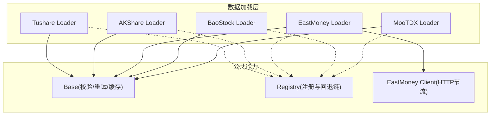
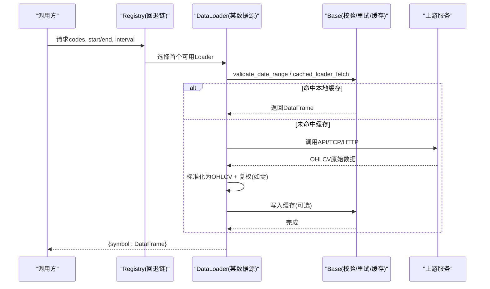
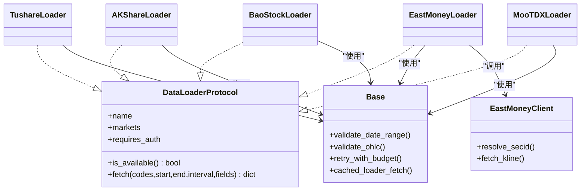

# A股市场数据源

<cite>
**本文引用的文件**
- [agent/backtest/loaders/tushare.py](file://agent/backtest/loaders/tushare.py)
- [agent/backtest/loaders/akshare_loader.py](file://agent/backtest/loaders/akshare_loader.py)
- [agent/backtest/loaders/eastmoney_loader.py](file://agent/backtest/loaders/eastmoney_loader.py)
- [agent/backtest/loaders/baostock_loader.py](file://agent/backtest/loaders/baostock_loader.py)
- [agent/backtest/loaders/mootdx_loader.py](file://agent/backtest/loaders/mootdx_loader.py)
- [agent/backtest/loaders/eastmoney_client.py](file://agent/backtest/loaders/eastmoney_client.py)
- [agent/backtest/loaders/base.py](file://agent/backtest/loaders/base.py)
- [agent/backtest/loaders/registry.py](file://agent/backtest/loaders/registry.py)
- [agent/src/api/settings_routes.py](file://agent/src/api/settings_routes.py)
- [agent/tests/test_settings_api.py](file://agent/tests/test_settings_api.py)
- [agent/tests/test_tushare_loader.py](file://agent/tests/test_tushare_loader.py)
- [agent/tests/test_akshare_loader.py](file://agent/tests/test_akshare_loader.py)
</cite>

## 目录
1. [简介](#简介)
2. [项目结构](#项目结构)
3. [核心组件](#核心组件)
4. [架构总览](#架构总览)
5. [详细组件分析](#详细组件分析)
6. [依赖关系分析](#依赖关系分析)
7. [性能与限流](#性能与限流)
8. [故障排查指南](#故障排查指南)
9. [结论](#结论)
10. [附录：A股特有字段与配置选项](#附录a股特有字段与配置选项)

## 简介
本指南面向需要在回测与实盘中接入A股数据的用户，系统性地说明Tushare、AkShare、东方财富、BaoStock、MooTDX等主流数据源的配置方法、API密钥获取流程、权限设置、数据加载器的时间周期与复权方式，以及常见问题（限流、缺失、网络异常）的解决方案。文档基于仓库内已实现的Loader实现与测试用例进行归纳，确保可操作且与代码行为一致。

## 项目结构
- 数据源以“Loader”为统一抽象，每个市场/数据商一个模块，通过注册表集中管理并支持按市场自动回退。
- 通用能力（日期校验、OHLC校验、重试预算、本地缓存）集中在base模块。
- 部分数据源（如东方财富）通过专用HTTP客户端封装节流与协议细节。
- Tushare的鉴权由环境变量注入，并通过设置接口持久化到项目.env。

图表来源
- [agent/backtest/loaders/tushare.py:116-141](file://agent/backtest/loaders/tushare.py#L116-L141)
- [agent/backtest/loaders/akshare_loader.py:286-308](file://agent/backtest/loaders/akshare_loader.py#L286-L308)
- [agent/backtest/loaders/eastmoney_loader.py:51-67](file://agent/backtest/loaders/eastmoney_loader.py#L51-L67)
- [agent/backtest/loaders/baostock_loader.py:32-53](file://agent/backtest/loaders/baostock_loader.py#L32-L53)
- [agent/backtest/loaders/mootdx_loader.py:66-94](file://agent/backtest/loaders/mootdx_loader.py#L66-L94)
- [agent/backtest/loaders/base.py:168-256](file://agent/backtest/loaders/base.py#L168-L256)
- [agent/backtest/loaders/eastmoney_client.py:1-40](file://agent/backtest/loaders/eastmoney_client.py#L1-L40)
- [agent/backtest/loaders/registry.py:1-37](file://agent/backtest/loaders/registry.py#L1-L37)

章节来源
- [agent/backtest/loaders/base.py:168-256](file://agent/backtest/loaders/base.py#L168-L256)
- [agent/backtest/loaders/registry.py:1-37](file://agent/backtest/loaders/registry.py#L1-L37)

## 核心组件
- DataLoaderProtocol与通用工具：提供统一的fetch接口、日期/OHLC校验、重试预算、本地Parquet缓存等。
- 各Loader实现：负责将上游数据源的数据转换为统一的OHLCV DataFrame（trade_date索引，open/high/low/close/volume列）。
- 注册表与回退链：根据市场类型选择可用Loader，并在失败时尝试下一个候选。
- 东方财富HTTP客户端：统一处理IP级节流、JSONP解析、secid映射与kline拉取。

章节来源
- [agent/backtest/loaders/base.py:851-887](file://agent/backtest/loaders/base.py#L851-L887)
- [agent/backtest/loaders/registry.py:1-37](file://agent/backtest/loaders/registry.py#L1-L37)
- [agent/backtest/loaders/eastmoney_client.py:1-40](file://agent/backtest/loaders/eastmoney_client.py#L1-L40)

## 架构总览
下图展示了从上层调用到具体数据源的请求路径，包含鉴权、路由、节流与缓存。

图表来源
- [agent/backtest/loaders/base.py:623-661](file://agent/backtest/loaders/base.py#L623-L661)
- [agent/backtest/loaders/tushare.py:148-211](file://agent/backtest/loaders/tushare.py#L148-L211)
- [agent/backtest/loaders/akshare_loader.py:310-349](file://agent/backtest/loaders/akshare_loader.py#L310-L349)
- [agent/backtest/loaders/eastmoney_loader.py:69-116](file://agent/backtest/loaders/eastmoney_loader.py#L69-L116)
- [agent/backtest/loaders/baostock_loader.py:55-112](file://agent/backtest/loaders/baostock_loader.py#L55-L112)
- [agent/backtest/loaders/mootdx_loader.py:96-153](file://agent/backtest/loaders/mootdx_loader.py#L96-L153)

## 详细组件分析

### Tushare Loader
- 鉴权与可用性
  - 需要设置环境变量TUSHARE_TOKEN；可通过设置接口写入项目.env并生效。
  - is_available检查token是否有效。
- 数据范围与周期
  - 日线：daily/fund_daily/index_daily/hk_daily
  - 分钟线：stk_mins（需积分门槛），支持1m/5m/15m/30m/1H
- 复权处理
  - A股使用adj_factor前复权；指数无复权因子；ETF使用fund_adj；港股无复权因子系列。
- 限流与重试
  - 识别配额拒绝关键字并执行指数退避重试（5s/20s/40s）。
- 财务字段
  - 可按fields合并daily_basic列（仅股票）。

章节来源
- [agent/backtest/loaders/tushare.py:116-141](file://agent/backtest/loaders/tushare.py#L116-L141)
- [agent/backtest/loaders/tushare.py:148-211](file://agent/backtest/loaders/tushare.py#L148-L211)
- [agent/backtest/loaders/tushare.py:207-268](file://agent/backtest/loaders/tushare.py#L207-L268)
- [agent/backtest/loaders/tushare.py:361-414](file://agent/backtest/loaders/tushare.py#L361-L414)
- [agent/backtest/loaders/tushare.py:416-476](file://agent/backtest/loaders/tushare.py#L416-L476)
- [agent/src/api/settings_routes.py:666-689](file://agent/src/api/settings_routes.py#L666-L689)
- [agent/tests/test_settings_api.py:516-555](file://agent/tests/test_settings_api.py#L516-L555)

### AkShare Loader
- 鉴权与可用性
  - 无需鉴权；依赖akshare库安装。
- 数据范围与周期
  - 仅支持日线（daily/weekly/monthly），美股/港股/外汇/ETF均为日线。
- 数据路由
  - 自动识别A股、ETF、美股、港股、外汇，分别调用对应接口。
- 标准化
  - 统一中文/英文列名，输出标准OHLCV；外汇无成交量则填充0。

章节来源
- [agent/backtest/loaders/akshare_loader.py:286-308](file://agent/backtest/loaders/akshare_loader.py#L286-L308)
- [agent/backtest/loaders/akshare_loader.py:98-161](file://agent/backtest/loaders/akshare_loader.py#L98-L161)
- [agent/backtest/loaders/akshare_loader.py:163-297](file://agent/backtest/loaders/akshare_loader.py#L163-L297)
- [agent/tests/test_akshare_loader.py:1-177](file://agent/tests/test_akshare_loader.py#L1-L177)

### 东方财富 Loader
- 鉴权与可用性
  - 免费接口，无需鉴权；通过HTTP客户端进行每主机节流。
- 数据范围与周期
  - 支持多周期（1D/1W/1M/1m/5m/15m/30m/1H），通过KLT映射。
- 地址解析
  - 将符号解析为secid（A股/港股/美股），美股通过搜索端点解析并缓存。
- 数据拉取
  - 统一调用push2his接口，返回行后标准化为OHLCV。

章节来源
- [agent/backtest/loaders/eastmoney_loader.py:51-116](file://agent/backtest/loaders/eastmoney_loader.py#L51-L116)
- [agent/backtest/loaders/eastmoney_client.py:1-40](file://agent/backtest/loaders/eastmoney_client.py#L1-L40)
- [agent/backtest/loaders/eastmoney_client.py:136-267](file://agent/backtest/loaders/eastmoney_client.py#L136-L267)
- [agent/backtest/loaders/eastmoney_client.py:300-355](file://agent/backtest/loaders/eastmoney_client.py#L300-L355)

### BaoStock Loader
- 鉴权与可用性
  - 免费TCP协议，无需鉴权；依赖baostock库。
- 数据范围与周期
  - 仅支持日线；自动登录/登出。
- 复权与单位
  - 默认前复权；成交量从“手”归一化为“股”，再换算为“手”以与其他源一致。

章节来源
- [agent/backtest/loaders/baostock_loader.py:32-112](file://agent/backtest/loaders/baostock_loader.py#L32-L112)
- [agent/backtest/loaders/baostock_loader.py:114-174](file://agent/backtest/loaders/baostock_loader.py#L114-L174)

### MooTDX Loader
- 鉴权与可用性
  - 免费TCP直连通达信服务器，无需鉴权；依赖mootdx库。
- 数据范围与周期
  - 支持1m/5m/15m/30m/1H/1D/1W/1M；北交所不支持会跳过。
- 历史分页
  - 非日线的bars()通过向后翻页覆盖起始日期，限制最大页数防止长时间阻塞。

章节来源
- [agent/backtest/loaders/mootdx_loader.py:66-153](file://agent/backtest/loaders/mootdx_loader.py#L66-L153)
- [agent/backtest/loaders/mootdx_loader.py:155-207](file://agent/backtest/loaders/mootdx_loader.py#L155-L207)
- [agent/backtest/loaders/mootdx_loader.py:209-258](file://agent/backtest/loaders/mootdx_loader.py#L209-L258)

## 依赖关系分析
- 所有Loader均依赖base提供的日期校验、OHLC校验、重试预算与本地缓存。
- EastMoney Loader额外依赖eastmoney_client进行HTTP节流与协议适配。
- Registry维护市场到Loader的回退链，保证在某个Loader不可用时自动切换。

图表来源
- [agent/backtest/loaders/base.py:851-887](file://agent/backtest/loaders/base.py#L851-L887)
- [agent/backtest/loaders/eastmoney_client.py:239-355](file://agent/backtest/loaders/eastmoney_client.py#L239-L355)
- [agent/backtest/loaders/tushare.py:116-141](file://agent/backtest/loaders/tushare.py#L116-L141)
- [agent/backtest/loaders/akshare_loader.py:286-308](file://agent/backtest/loaders/akshare_loader.py#L286-L308)
- [agent/backtest/loaders/eastmoney_loader.py:51-67](file://agent/backtest/loaders/eastmoney_loader.py#L51-L67)
- [agent/backtest/loaders/baostock_loader.py:32-53](file://agent/backtest/loaders/baostock_loader.py#L32-L53)
- [agent/backtest/loaders/mootdx_loader.py:66-94](file://agent/backtest/loaders/mootdx_loader.py#L66-L94)

章节来源
- [agent/backtest/loaders/base.py:168-256](file://agent/backtest/loaders/base.py#L168-L256)
- [agent/backtest/loaders/registry.py:1-37](file://agent/backtest/loaders/registry.py#L1-L37)

## 性能与限流
- Tushare
  - 配额拒绝识别与退避重试（5s/20s/40s），避免频繁触发每分钟限制。
- 东方财富
  - 通过HTTP客户端对同一主机进行最小间隔控制，避免被IP封禁。
- 通用
  - 本地Parquet缓存减少重复请求；仅在end_date已结算时才写入缓存。
  - 重试预算与超时保护，防止长耗时请求拖垮整体流程。

章节来源
- [agent/backtest/loaders/tushare.py:18-79](file://agent/backtest/loaders/tushare.py#L18-L79)
- [agent/backtest/loaders/eastmoney_client.py:32-40](file://agent/backtest/loaders/eastmoney_client.py#L32-L40)
- [agent/backtest/loaders/base.py:377-450](file://agent/backtest/loaders/base.py#L377-L450)
- [agent/backtest/loaders/base.py:243-441](file://agent/backtest/loaders/base.py#L243-L441)

## 故障排查指南
- API限流
  - Tushare：出现“每分钟/每天/频率/访问该接口”等提示即触发退避重试；若仍失败，降低并发或延长间隔。
  - 东方财富：调整最小请求间隔（通过客户端内部逻辑），避免IP封禁。
- 数据缺失
  - 确认符号类型与后缀正确（.SH/.SZ/.HK/.US等），不同Loader对符号格式有差异。
  - 分钟线在某些数据源受限（如Tushare stk_mins需积分），请降级为日线或更换数据源。
- 网络异常重试
  - 使用base中的retry_with_budget与check_budget，结合deadline与backoff策略，避免无限重试。
- 复权问题
  - Tushare：若无可用复权因子，将直接丢弃该标的以避免错误收益计算。
  - BaoStock：默认前复权，注意成交量单位归一化。
- 缓存相关
  - 若启用本地缓存但结果异常，检查缓存开关与end_date是否为已结算日期。

章节来源
- [agent/backtest/loaders/tushare.py:18-79](file://agent/backtest/loaders/tushare.py#L18-L79)
- [agent/backtest/loaders/base.py:377-450](file://agent/backtest/loaders/base.py#L377-L450)
- [agent/backtest/loaders/base.py:243-441](file://agent/backtest/loaders/base.py#L243-L441)
- [agent/backtest/loaders/tushare.py:253-268](file://agent/backtest/loaders/tushare.py#L253-L268)
- [agent/backtest/loaders/baostock_loader.py:137-174](file://agent/backtest/loaders/baostock_loader.py#L137-L174)

## 结论
本项目为A股数据接入提供了统一、健壮且可扩展的Loader体系。Tushare适合需要分钟线与财务字段的场景；AkShare与BaoStock/MooTDX提供免费、稳定的日线与分钟线来源；东方财富通过HTTP节流保障稳定性。配合统一的校验、重试与缓存机制，可在生产环境中获得高可用的数据供给。

## 附录：A股特有字段与配置选项

- 复权因子
  - Tushare：使用adj_factor进行前复权；指数无复权因子；ETF使用fund_adj；港股无复权因子系列。
  - BaoStock：默认前复权；成交量单位归一化处理。
  - 东方财富：fqt参数控制复权模式（0原始、1前复权、2后复权）。
- 停牌信息
  - 当前Loader主要关注OHLCV；停牌通常表现为空数据或缺失行，建议在下游做缺失值处理与标记。
- 涨跌停限制
  - 可通过Tushare的涨跌停专题接口获取每日涨跌停与炸板情况（用于研究或风控），不在基础OHLCV中体现。
- 交易日历
  - 通过数据源返回的交易日期序列推断；缺失日期视为非交易日。
- 数据加载器配置选项
  - 时间周期：各Loader支持的interval不同，详见各Loader实现；MooTDX支持最丰富的分钟线集合。
  - 复权方式：Tushare/BaoStock默认前复权；东方财富通过fqt选择。
  - 财务数据范围：Tushare可按fields合并daily_basic列（仅限股票）。

章节来源
- [agent/backtest/loaders/tushare.py:207-268](file://agent/backtest/loaders/tushare.py#L207-L268)
- [agent/backtest/loaders/baostock_loader.py:137-174](file://agent/backtest/loaders/baostock_loader.py#L137-L174)
- [agent/backtest/loaders/eastmoney_client.py:300-355](file://agent/backtest/loaders/eastmoney_client.py#L300-L355)
- [agent/backtest/loaders/mootdx_loader.py:25-37](file://agent/backtest/loaders/mootdx_loader.py#L25-L37)
- [agent/backtest/loaders/akshare_loader.py:22-31](file://agent/backtest/loaders/akshare_loader.py#L22-L31)