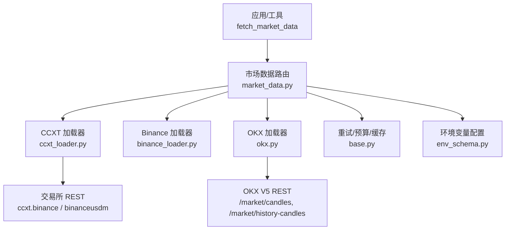
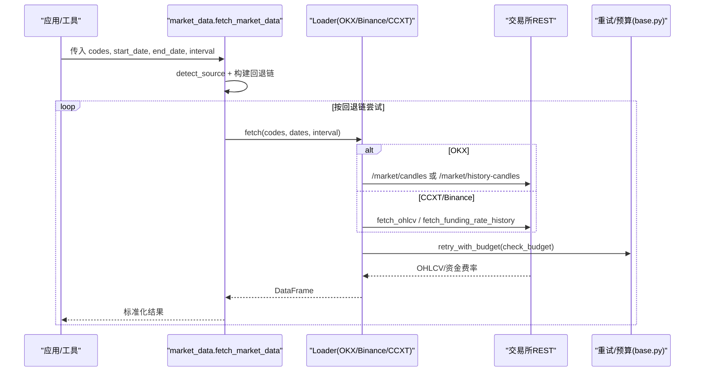
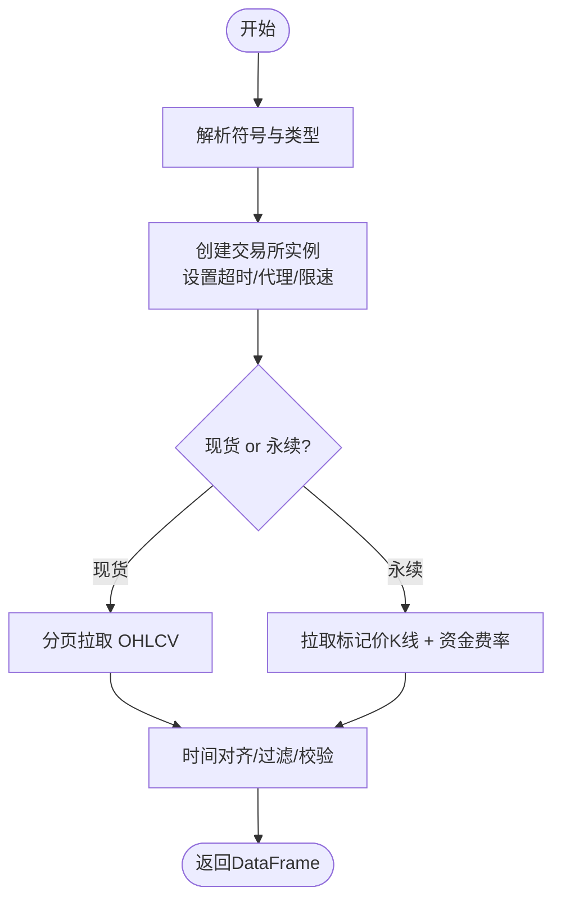
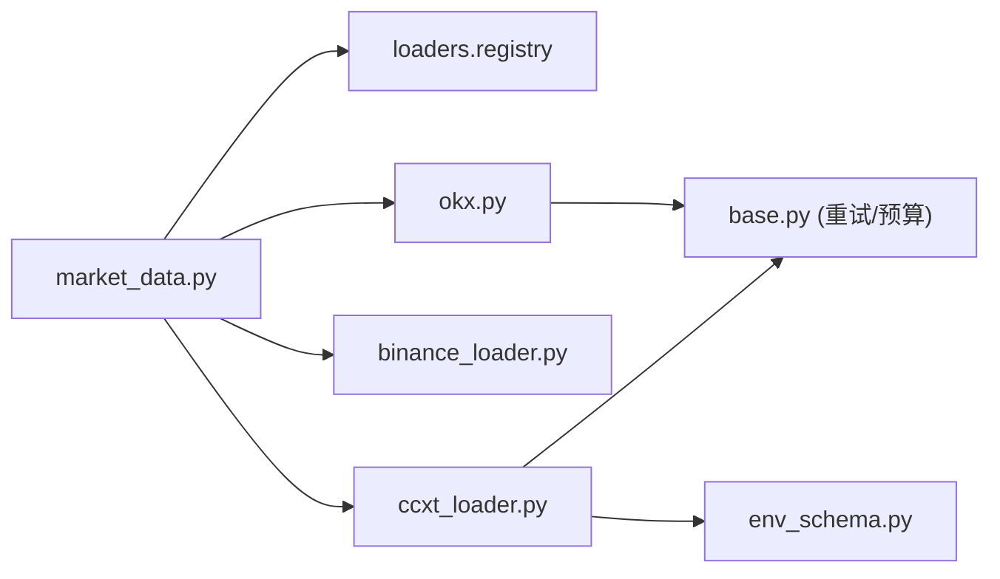

# 加密货币市场数据源

<cite>
**本文引用的文件**
- [agent/backtest/loaders/ccxt_loader.py](file://agent/backtest/loaders/ccxt_loader.py)
- [agent/backtest/loaders/binance_loader.py](file://agent/backtest/loaders/binance_loader.py)
- [agent/backtest/loaders/okx.py](file://agent/backtest/loaders/okx.py)
- [agent/src/market_data.py](file://agent/src/market_data.py)
- [agent/backtest/loaders/base.py](file://agent/backtest/loaders/base.py)
- [agent/src/config/env_schema.py](file://agent/src/config/env_schema.py)
- [agent/src/trading/connectors/okx/sdk.py](file://agent/src/trading/connectors/okx/sdk.py)
- [agent/src/trading/connectors/binance/sdk.py](file://agent/src/trading/connectors/binance/sdk.py)
- [agent/tests/test_ccxt_loader_bounded.py](file://agent/tests/test_ccxt_loader_bounded.py)
- [agent/src/api/system_routes.py](file://agent/src/api/system_routes.py)
- [agent/src/skills/ccxt/SKILL.md](file://agent/src/skills/ccxt/SKILL.md)
- [agent/src/skills/okx-market/SKILL.md](file://agent/src/skills/okx-market/SKILL.md)
</cite>

## 目录
1. [简介](#简介)
2. [项目结构](#项目结构)
3. [核心组件](#核心组件)
4. [架构总览](#架构总览)
5. [详细组件分析](#详细组件分析)
6. [依赖关系分析](#依赖关系分析)
7. [性能与稳定性](#性能与稳定性)
8. [故障排查指南](#故障排查指南)
9. [结论](#结论)
10. [附录：配置清单与安全建议](#附录：配置清单与安全建议)

## 简介
本指南面向需要在项目中接入加密货币市场数据的工程师，重点覆盖以下目标：
- 使用 CCXT 统一接口对接多家交易所（默认 Binance），并支持 OKX 直连。
- 说明如何配置交易所 API（密钥、权限、IP 白名单）以及何时需要认证。
- 解释加密货币数据特性：现货与合约（永续）、资金费率、标记价格、成交量等。
- 提供多交易所切换、标准化数据格式、实时行情获取的用法。
- 给出安全配置建议：API 密钥加密存储、请求签名验证、速率限制处理。

本项目对“仅公开行情”的数据拉取无需任何 API Key；仅在涉及账户级或交易类能力时才需要配置密钥。

## 项目结构
围绕加密货币数据拉取的关键模块如下：
- 统一加载层：通过 market_data 路由到具体 loader，支持自动回退链。
- 数据加载器：
  - CCXT 加载器：基于 ccxt 库统一访问 100+ 交易所，默认 Binance。
  - Binance 专用加载器：固定走 Binance 现货或 USD-M 永续。
  - OKX 加载器：直接调用 OKX V5 REST 公开接口。
- 配置与环境变量：集中式环境配置模型，定义 CCXT_EXCHANGE、超时与预算等。
- 交易连接器（可选）：OKX/Binance 的交易 SDK 配置（用于交易/只读账户查询，非纯行情拉取）。

图表来源
- [agent/src/market_data.py:97-234](file://agent/src/market_data.py#L97-L234)
- [agent/backtest/loaders/ccxt_loader.py:203-308](file://agent/backtest/loaders/ccxt_loader.py#L203-L308)
- [agent/backtest/loaders/okx.py:131-208](file://agent/backtest/loaders/okx.py#L131-L208)
- [agent/backtest/loaders/base.py:377-414](file://agent/backtest/loaders/base.py#L377-L414)
- [agent/src/config/env_schema.py:197-207](file://agent/src/config/env_schema.py#L197-L207)

章节来源
- [agent/src/market_data.py:97-234](file://agent/src/market_data.py#L97-L234)
- [agent/backtest/loaders/ccxt_loader.py:203-308](file://agent/backtest/loaders/ccxt_loader.py#L203-L308)
- [agent/backtest/loaders/okx.py:131-208](file://agent/backtest/loaders/okx.py#L131-L208)
- [agent/backtest/loaders/base.py:377-414](file://agent/backtest/loaders/base.py#L377-L414)
- [agent/src/config/env_schema.py:197-207](file://agent/src/config/env_schema.py#L197-L207)

## 核心组件
- CCXT 加载器：统一封装 OHLCV 与永续合约数据（含标记价格与资金费率），支持代理、超时、预算控制与分页拉取。
- Binance 加载器：固定使用 ccxt.binance 或 ccxt.binanceusdm，便于在回退链中与 OKX 并存。
- OKX 加载器：直接调用 OKX V5 公开 REST，自动选择近期或历史 K 线端点，具备可用性探测。
- 市场数据路由：根据符号规则选择首选源，并在不可用时按回退链尝试。
- 配置与环境：集中管理 CCXT_EXCHANGE、超时、预算等关键参数。

章节来源
- [agent/backtest/loaders/ccxt_loader.py:184-308](file://agent/backtest/loaders/ccxt_loader.py#L184-L308)
- [agent/backtest/loaders/binance_loader.py:23-44](file://agent/backtest/loaders/binance_loader.py#L23-L44)
- [agent/backtest/loaders/okx.py:101-208](file://agent/backtest/loaders/okx.py#L101-L208)
- [agent/src/market_data.py:97-234](file://agent/src/market_data.py#L97-L234)
- [agent/src/config/env_schema.py:197-207](file://agent/src/config/env_schema.py#L197-L207)

## 架构总览
下图展示了从上层工具到交易所的完整调用链路，包括回退链、重试与预算控制。

图表来源
- [agent/src/market_data.py:138-200](file://agent/src/market_data.py#L138-L200)
- [agent/backtest/loaders/okx.py:220-265](file://agent/backtest/loaders/okx.py#L220-L265)
- [agent/backtest/loaders/ccxt_loader.py:426-501](file://agent/backtest/loaders/ccxt_loader.py#L426-L501)
- [agent/backtest/loaders/base.py:377-414](file://agent/backtest/loaders/base.py#L377-L414)

## 详细组件分析

### CCXT 加载器（统一接口）
- 功能要点
  - 支持现货与 USD-M 永续合约（BASE-USDT-PERP），自动解析符号并映射到 ccxt 规范。
  - 永续合约拉取包含执行价 K 线与标记价 K 线对齐，并合并资金费率结算点。
  - 维护保证金档位（maintenance brackets）以版本化 artifact 形式校验，不在线拉取，避免鉴权需求。
  - 支持代理、超时、预算控制与分页拉取，失败快速退出。
- 关键实现路径
  - 交换实例创建：读取 CCXT_EXCHANGE，构造 exchange，设置 enableRateLimit、timeout、proxies。
  - 符号解析：将 BTC-USDT-PERP 转换为 ccxt 符号并识别为 swap。
  - 永续合约数据：合并 trade/mark 价格与 funding rate，校验结算时间点。
  - 历史 OHLCV：分页拉取，检查是否覆盖请求区间，否则报错。
- 复杂度与性能
  - 分页拉取 O(N) 页，每页 limit=1000；整体受 wall-clock budget 约束，避免长时间挂起。
  - 时间粒度映射与去重保证索引一致性。

图表来源
- [agent/backtest/loaders/ccxt_loader.py:60-71](file://agent/backtest/loaders/ccxt_loader.py#L60-L71)
- [agent/backtest/loaders/ccxt_loader.py:203-224](file://agent/backtest/loaders/ccxt_loader.py#L203-L224)
- [agent/backtest/loaders/ccxt_loader.py:310-372](file://agent/backtest/loaders/ccxt_loader.py#L310-L372)
- [agent/backtest/loaders/ccxt_loader.py:426-501](file://agent/backtest/loaders/ccxt_loader.py#L426-L501)

章节来源
- [agent/backtest/loaders/ccxt_loader.py:60-71](file://agent/backtest/loaders/ccxt_loader.py#L60-L71)
- [agent/backtest/loaders/ccxt_loader.py:203-224](file://agent/backtest/loaders/ccxt_loader.py#L203-L224)
- [agent/backtest/loaders/ccxt_loader.py:310-372](file://agent/backtest/loaders/ccxt_loader.py#L310-L372)
- [agent/backtest/loaders/ccxt_loader.py:426-501](file://agent/backtest/loaders/ccxt_loader.py#L426-L501)

### Binance 加载器（专用）
- 固定使用 ccxt.binance 或 ccxt.binanceusdm，忽略 CCXT_EXCHANGE，确保在回退链中稳定可用。
- 继承 CCXT 加载器的统一逻辑，专注 Binance 场景。

章节来源
- [agent/backtest/loaders/binance_loader.py:23-44](file://agent/backtest/loaders/binance_loader.py#L23-L44)

### OKX 加载器（直连）
- 使用 OKX V5 公开 REST，优先使用 history-candles 以支持更长历史范围。
- is_available 进行轻量探测，失败则降级。
- 支持代理、超时、预算控制，并对 HTTP 429/5xx 与业务码非 0 的情况进行重试与错误上报。
- 输出标准化 OHLCV，时间戳归一化为 UTC。

章节来源
- [agent/backtest/loaders/okx.py:101-208](file://agent/backtest/loaders/okx.py#L101-L208)
- [agent/backtest/loaders/okx.py:220-373](file://agent/backtest/loaders/okx.py#L220-L373)

### 市场数据路由与回退链
- 根据符号模式匹配首选源（如 BTC-USDT → okx，BTC/USDT → ccxt）。
- 若首选源不可用，按市场回退链依次尝试（例如 crypto 链：okx → binance → ccxt → yahoo）。
- 每次尝试均带异常捕获与日志记录，最终汇总结果与来源元信息。

章节来源
- [agent/src/market_data.py:16-57](file://agent/src/market_data.py#L16-L57)
- [agent/src/market_data.py:97-234](file://agent/src/market_data.py#L97-L234)

### 交易连接器（可选：OKX/Binance）
- OKX 连接器：支持 paper/live-readonly/profile 等配置，配置文件位于运行时根目录。
- Binance 连接器：支持 testnet/live 主机映射与符号规范化。
- 注意：这些连接器主要用于交易或账户查询；纯行情拉取可通过 CCXT/OKX 公开接口完成，无需密钥。

章节来源
- [agent/src/trading/connectors/okx/sdk.py:51-73](file://agent/src/trading/connectors/okx/sdk.py#L51-L73)
- [agent/src/trading/connectors/okx/sdk.py:138-162](file://agent/src/trading/connectors/okx/sdk.py#L138-L162)
- [agent/src/trading/connectors/binance/sdk.py:37-49](file://agent/src/trading/connectors/binance/sdk.py#L37-L49)
- [agent/src/trading/connectors/binance/sdk.py:160-193](file://agent/src/trading/connectors/binance/sdk.py#L160-L193)

## 依赖关系分析
- CCXT 加载器依赖 base 中的重试/预算工具，确保网络抖动时快速失败与有限重试。
- OKX 加载器独立于 CCXT，但同样复用 base 的重试/预算工具。
- 市场数据路由依赖 loaders.registry 的回退链机制，保证高可用。
- 环境变量由 env_schema 统一管理，集中定义 CCXT_EXCHANGE、超时与预算等。

图表来源
- [agent/src/market_data.py:138-200](file://agent/src/market_data.py#L138-L200)
- [agent/backtest/loaders/ccxt_loader.py:203-224](file://agent/backtest/loaders/ccxt_loader.py#L203-L224)
- [agent/backtest/loaders/okx.py:220-265](file://agent/backtest/loaders/okx.py#L220-L265)
- [agent/backtest/loaders/base.py:377-414](file://agent/backtest/loaders/base.py#L377-L414)
- [agent/src/config/env_schema.py:197-207](file://agent/src/config/env_schema.py#L197-L207)

章节来源
- [agent/src/market_data.py:138-200](file://agent/src/market_data.py#L138-L200)
- [agent/backtest/loaders/ccxt_loader.py:203-224](file://agent/backtest/loaders/ccxt_loader.py#L203-L224)
- [agent/backtest/loaders/okx.py:220-265](file://agent/backtest/loaders/okx.py#L220-L265)
- [agent/backtest/loaders/base.py:377-414](file://agent/backtest/loaders/base.py#L377-L414)
- [agent/src/config/env_schema.py:197-207](file://agent/src/config/env_schema.py#L197-L207)

## 性能与稳定性
- 超时与预算
  - CCXT 加载器：通过 CCXT_TIMEOUT_MS 控制单次请求超时；CCXT_FETCH_BUDGET_S 控制整次拉取的墙钟预算，防止卡死。
  - OKX 加载器：OKX_TIMEOUT_S 与 OKX_FETCH_BUDGET_S 类似作用。
- 重试策略
  - 仅对瞬态异常（如网络错误、HTTP 429/5xx）进行有限重试，非瞬态错误立即抛出。
  - 测试覆盖了瞬态错误重试、持久断开快速失败、非网络错误不重试等场景。
- 分页与完整性
  - 分页拉取时检查是否覆盖请求区间，未覆盖则报错提示不完整历史。
  - 永续合约资金费率结算点缺失会触发严格校验。

章节来源
- [agent/backtest/loaders/ccxt_loader.py:50-57](file://agent/backtest/loaders/ccxt_loader.py#L50-L57)
- [agent/backtest/loaders/ccxt_loader.py:426-501](file://agent/backtest/loaders/ccxt_loader.py#L426-L501)
- [agent/backtest/loaders/okx.py:67-69](file://agent/backtest/loaders/okx.py#L67-L69)
- [agent/backtest/loaders/okx.py:291-322](file://agent/backtest/loaders/okx.py#L291-L322)
- [agent/tests/test_ccxt_loader_bounded.py:55-90](file://agent/tests/test_ccxt_loader_bounded.py#L55-L90)

## 故障排查指南
- 常见问题定位
  - 拉取为空或不完整：检查时间范围、时间粒度映射、分页是否达到上限；查看是否命中“不完整历史”的错误提示。
  - 网络超时/限流：调整 CCXT_TIMEOUT_MS、CCXT_FETCH_BUDGET_S、OKX_TIMEOUT_S、OKX_FETCH_BUDGET_S；确认代理设置。
  - 永续合约资金费率缺失：核对结算时间点是否齐全；必要时放宽时间范围或检查交易所侧数据。
  - 首选源不可用：观察回退链日志，确认是否成功切换到备用源。
- 调试建议
  - 启用 include_provenance=True 查看实际使用的 source、是否发生回退、volume_unit 等信息。
  - 针对 CCXT 加载器，关注 _fetch_one 与 _fetch_perpetual 的异常堆栈，定位是网络问题还是数据不一致。
  - 对于 OKX，关注 _paginate 中的 HTTP 状态码与业务 code，必要时降低并发或增大预算。

章节来源
- [agent/src/market_data.py:207-234](file://agent/src/market_data.py#L207-L234)
- [agent/backtest/loaders/ccxt_loader.py:310-372](file://agent/backtest/loaders/ccxt_loader.py#L310-L372)
- [agent/backtest/loaders/ccxt_loader.py:426-501](file://agent/backtest/loaders/ccxt_loader.py#L426-L501)
- [agent/backtest/loaders/okx.py:291-322](file://agent/backtest/loaders/okx.py#L291-L322)

## 结论
本项目提供了稳健且可回退的加密货币市场数据接入方案：
- 通过 CCXT 统一接口对接多家交易所，默认 Binance，同时支持 OKX 直连。
- 对公开行情拉取无需 API Key；仅在交易或账户查询时才需配置密钥。
- 内置超时、预算、重试与分页完整性校验，保障在高延迟或限流环境下快速失败与稳定运行。
- 通过环境变量集中管理配置，便于在不同环境中灵活切换与调优。

## 附录：配置清单与安全建议

### 环境变量与配置项
- CCXT_EXCHANGE：选择 CCXT 交易所（默认 binance）。
- CCXT_TIMEOUT_MS：CCXT 单次请求超时毫秒数。
- CCXT_FETCH_BUDGET_S：CCXT 拉取总预算秒数。
- OKX_TIMEOUT_S：OKX 单次请求超时秒数。
- OKX_FETCH_BUDGET_S：OKX 拉取总预算秒数。
- 代理：通过 ALL_PROXY/HTTP_PROXY/HTTPS_PROXY 注入代理（CCXT/OKX 均支持）。

章节来源
- [agent/src/config/env_schema.py:197-207](file://agent/src/config/env_schema.py#L197-L207)
- [agent/backtest/loaders/ccxt_loader.py:81-92](file://agent/backtest/loaders/ccxt_loader.py#L81-L92)
- [agent/backtest/loaders/okx.py:72-90](file://agent/backtest/loaders/okx.py#L72-L90)

### 交易所 API 配置（如需交易或账户查询）
- 币安（Binance）
  - 在 ~/.vibe-trading/binance.json 中配置 api_key、api_secret、profile（paper/live-readonly/live）。
  - 测试网与生产网主机映射由配置决定。
- OKX
  - 在 ~/.vibe-trading/okx.json 中配置 api_key、api_secret、passphrase、profile（paper/live-readonly/live）。
  - 注意 demo 与 live 密钥隔离，不可混用。

章节来源
- [agent/src/trading/connectors/binance/sdk.py:160-193](file://agent/src/trading/connectors/binance/sdk.py#L160-L193)
- [agent/src/trading/connectors/okx/sdk.py:138-162](file://agent/src/trading/connectors/okx/sdk.py#L138-L162)

### 加密货币数据特性
- 现货与合约：
  - 现货：BTC/USDT 等标准交易对。
  - 永续合约：BASE-USDT-PERP，拉取执行价与标记价 K 线，并合并资金费率。
- 资金费率：
  - 永续合约按固定小时结算（如 0/8/16 点），缺失将触发严格校验。
- 成交量：
  - 不同来源可能单位不同，建议使用 provenance 中的 volume_unit 字段。

章节来源
- [agent/backtest/loaders/ccxt_loader.py:60-71](file://agent/backtest/loaders/ccxt_loader.py#L60-L71)
- [agent/backtest/loaders/ccxt_loader.py:310-372](file://agent/backtest/loaders/ccxt_loader.py#L310-L372)
- [agent/src/market_data.py:207-234](file://agent/src/market_data.py#L207-L234)

### 安全配置建议
- API 密钥存储
  - 交易连接器将密钥保存在用户级 JSON 文件中（binance.json/okx.json），建议限制文件权限。
  - 前端 API 认证键通过 localStorage 安全存取，空值时移除。
- 请求签名与鉴权
  - 公开行情拉取无需签名；交易/账户查询需按交易所要求签名与鉴权。
- 速率限制
  - 启用 enableRateLimit（CCXT）与 OKX 的预算/重试机制，避免触发交易所限流。
  - 系统内建滑动窗口限流器可用于 API 入口保护。

章节来源
- [agent/src/trading/connectors/binance/sdk.py:160-193](file://agent/src/trading/connectors/binance/sdk.py#L160-L193)
- [agent/src/trading/connectors/okx/sdk.py:138-162](file://agent/src/trading/connectors/okx/sdk.py#L138-L162)
- [agent/src/api/system_routes.py:57-79](file://agent/src/api/system_routes.py#L57-L79)
- [frontend/src/lib/apiAuth.ts:1-21](file://frontend/src/lib/apiAuth.ts#L1-L21)

### 使用示例（无代码片段）
- 统一接口获取标准化 OHLCV：
  - 调用 fetch_market_data，传入 codes、start_date、end_date、interval，source 可为 auto。
  - 支持 include_provenance=True 查看数据来源与体积单位。
- 多交易所切换：
  - 通过 CCXT_EXCHANGE 指定 CCXT 交易所；或直接指定 source="binance"/"okx"/"ccxt"。
- 实时行情：
  - 使用 CCXT 的 ticker/order book/trades 方法（见技能文档）；或通过 OKX 公开端点获取最新报价。

章节来源
- [agent/src/market_data.py:97-234](file://agent/src/market_data.py#L97-L234)
- [agent/src/skills/ccxt/SKILL.md:14-56](file://agent/src/skills/ccxt/SKILL.md#L14-L56)
- [agent/src/skills/okx-market/SKILL.md:1-34](file://agent/src/skills/okx-market/SKILL.md#L1-L34)