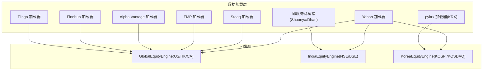
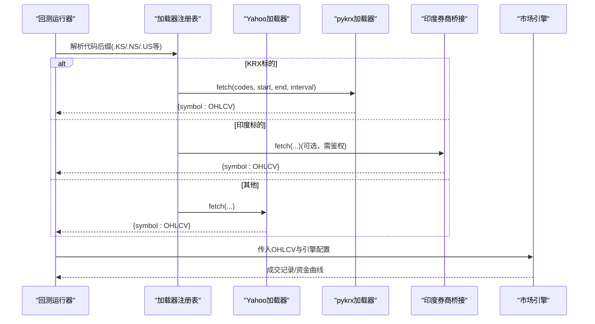
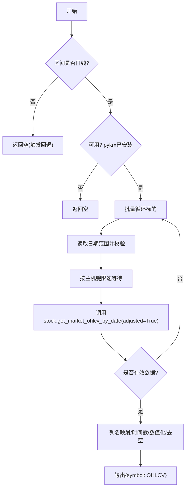
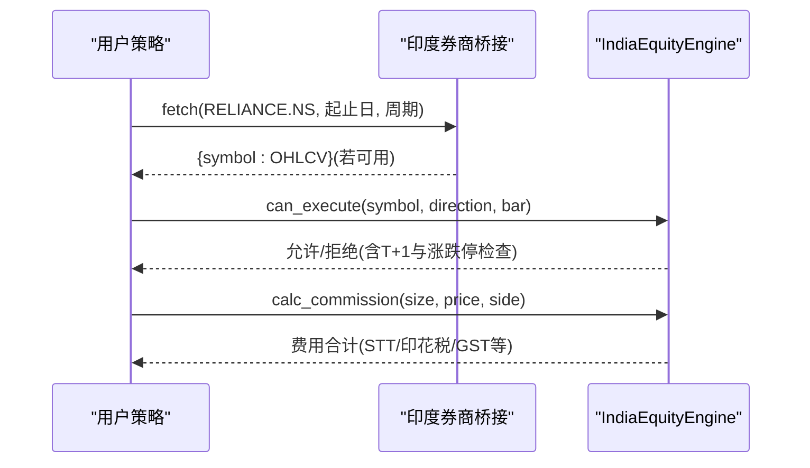
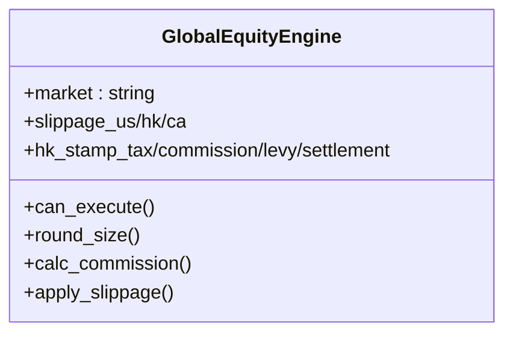
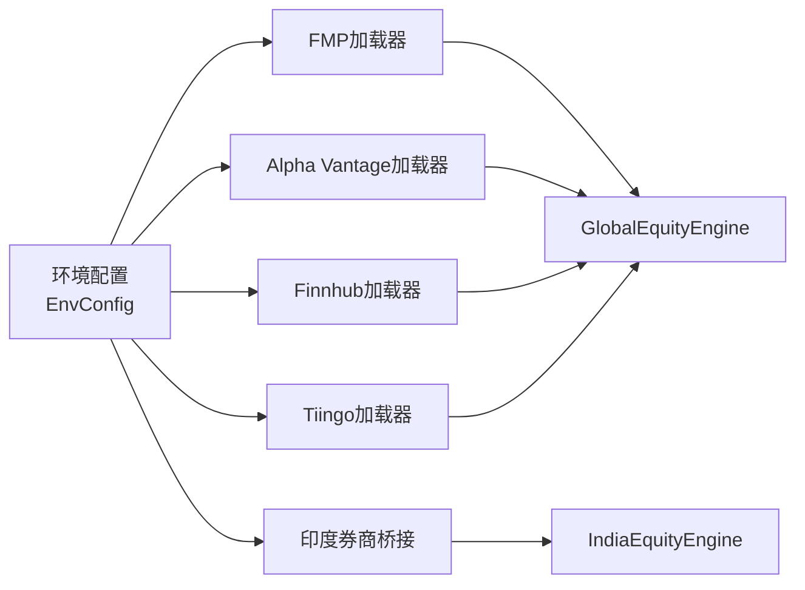

# 国际市场数据源

<cite>
**本文引用的文件**
- [pykrx_loader.py](file://agent/backtest/loaders/pykrx_loader.py)
- [india_broker_loader.py](file://agent/backtest/loaders/india_broker_loader.py)
- [stooq_loader.py](file://agent/backtest/loaders/stooq_loader.py)
- [korea_equity.py](file://agent/backtest/engines/korea_equity.py)
- [india_equity.py](file://agent/backtest/engines/india_equity.py)
- [global_equity.py](file://agent/backtest/engines/global_equity.py)
- [yahoo_loader.py](file://agent/backtest/loaders/yahoo_loader.py)
- [fmp_loader.py](file://agent/backtest/loaders/fmp_loader.py)
- [alphavantage_loader.py](file://agent/backtest/loaders/alphavantage_loader.py)
- [finnhub_loader.py](file://agent/backtest/loaders/finnhub_loader.py)
- [tiingo_loader.py](file://agent/backtest/loaders/tiingo_loader.py)
- [env_schema.py](file://agent/src/config/env_schema.py)
- [triggers.py](file://agent/src/live/runtime/triggers.py)
</cite>

## 目录
1. [简介](#简介)
2. [项目结构](#项目结构)
3. [核心组件](#核心组件)
4. [架构总览](#架构总览)
5. [详细组件分析](#详细组件分析)
6. [依赖关系分析](#依赖关系分析)
7. [性能与限流](#性能与限流)
8. [故障排查指南](#故障排查指南)
9. [结论](#结论)
10. [附录：区域配置清单](#附录区域配置清单)

## 简介
本指南面向需要在回测与实盘中接入国际金融市场数据的用户，重点覆盖韩国股市（KRX）、印度市场（NSE/BSE）以及通用全球市场（US/HK/加拿大等）的数据源与引擎。文档聚焦以下目标：
- 各地区数据源的本地化API、货币单位、交易时区与节假日处理
- 不同交易制度（T+0/T+1）、涨跌停/熔断、做市商与结算规则对回测的影响
- 区域特定的数据加载器配置：语言/符号映射、数据格式转换、本地化指标计算
- 跨境投资注意事项：汇率换算、税务考虑、监管合规要点

## 项目结构
本项目将“数据加载器”和“回测引擎”解耦：
- 数据加载器负责从各交易所或第三方服务拉取OHLCV并标准化为统一框架
- 回测引擎封装各市场的交易制度、成本栈、滑点与撮合规则
- 统一的注册表与缓存机制保证多源切换与失败隔离

图表来源
- [yahoo_loader.py:173-185](file://agent/backtest/loaders/yahoo_loader.py#L173-L185)
- [stooq_loader.py:88-97](file://agent/backtest/loaders/stooq_loader.py#L88-L97)
- [pykrx_loader.py:76-82](file://agent/backtest/loaders/pykrx_loader.py#L76-L82)
- [india_broker_loader.py:118-124](file://agent/backtest/loaders/india_broker_loader.py#L118-L124)
- [fmp_loader.py:77-83](file://agent/backtest/loaders/fmp_loader.py#L77-L83)
- [alphavantage_loader.py:97-103](file://agent/backtest/loaders/alphavantage_loader.py#L97-L103)
- [finnhub_loader.py:144-150](file://agent/backtest/loaders/finnhub_loader.py#L144-L150)
- [tiingo_loader.py:205-211](file://agent/backtest/loaders/tiingo_loader.py#L205-L211)
- [global_equity.py:33-45](file://agent/backtest/engines/global_equity.py#L33-L45)
- [india_equity.py:38-47](file://agent/backtest/engines/india_equity.py#L38-L47)
- [korea_equity.py:139-155](file://agent/backtest/engines/korea_equity.py#L139-L155)

章节来源
- [yahoo_loader.py:173-185](file://agent/backtest/loaders/yahoo_loader.py#L173-L185)
- [global_equity.py:33-45](file://agent/backtest/engines/global_equity.py#L33-L45)

## 核心组件
- 韩国市场（KRX）
  - 数据源：pykrx（免费、无鉴权），仅日线；通过HostThrottle控制请求间隔
  - 引擎：KoreaEquityEngine，长仓为主、±30%涨跌停、按价格档位量化、双边佣金+卖出侧证券交易税
- 印度市场（NSE/BSE）
  - 数据源：Yahoo（公共）、印度券商历史（Shoonya/Dhan，需鉴权）
  - 引擎：IndiaEquityEngine，T+1交割、默认不允许隔夜做空、可配涨跌停带、完整税费栈（STT/印花税/GST等）
- 全球市场（US/HK/加拿大）
  - 数据源：Yahoo、Stooq、FMP、Alpha Vantage、Finnhub、Tiingo
  - 引擎：GlobalEquityEngine，支持T+0、美股零佣金、港股印花税与整手、加元tick网格

章节来源
- [pykrx_loader.py:76-82](file://agent/backtest/loaders/pykrx_loader.py#L76-L82)
- [korea_equity.py:139-155](file://agent/backtest/engines/korea_equity.py#L139-L155)
- [india_broker_loader.py:118-124](file://agent/backtest/loaders/india_broker_loader.py#L118-L124)
- [india_equity.py:38-47](file://agent/backtest/engines/india_equity.py#L38-L47)
- [global_equity.py:33-45](file://agent/backtest/engines/global_equity.py#L33-L45)

## 架构总览
下图展示一次典型的多源回测数据获取流程：调度器根据标的后缀选择加载器，调用后统一输出标准OHLCV帧，再由对应市场引擎进行撮合与费用计算。

图表来源
- [yahoo_loader.py:195-242](file://agent/backtest/loaders/yahoo_loader.py#L195-L242)
- [pykrx_loader.py:92-144](file://agent/backtest/loaders/pykrx_loader.py#L92-L144)
- [india_broker_loader.py:144-204](file://agent/backtest/loaders/india_broker_loader.py#L144-L204)
- [korea_equity.py:175-228](file://agent/backtest/engines/korea_equity.py#L175-L228)
- [india_equity.py:64-95](file://agent/backtest/engines/india_equity.py#L64-L95)
- [global_equity.py:65-81](file://agent/backtest/engines/global_equity.py#L65-L81)

## 详细组件分析

### 韩国股市（KRX）数据源与引擎
- 数据源特性
  - 使用pykrx拉取KOSPI/KOSDAQ日线，返回韩文列名，内部重命名为open/high/low/close/volume
  - 明确使用复权序列（Naver-backed adjusted），适合回测
  - 强制日频；非日频直接返回空以触发回退链
  - 通过HostThrottle按主机键“pykrx”限速，默认最小间隔1秒，可通过环境变量覆盖
- 引擎规则
  - 长仓为主，拒绝做空（日内T+0允许当日买卖）
  - ±30%涨跌停，基于基准价按KRX价格档位截断计算
  - 成本：双边佣金+卖出侧证券交易税（可按KONEX调整）
  - 滑点按价格档位向上/下对齐，避免落在无效价位

图表来源
- [pykrx_loader.py:92-144](file://agent/backtest/loaders/pykrx_loader.py#L92-L144)
- [pykrx_loader.py:167-194](file://agent/backtest/loaders/pykrx_loader.py#L167-L194)
- [korea_equity.py:175-228](file://agent/backtest/engines/korea_equity.py#L175-L228)
- [korea_equity.py:273-316](file://agent/backtest/engines/korea_equity.py#L273-L316)

章节来源
- [pykrx_loader.py:1-30](file://agent/backtest/loaders/pykrx_loader.py#L1-L30)
- [pykrx_loader.py:76-82](file://agent/backtest/loaders/pykrx_loader.py#L76-L82)
- [pykrx_loader.py:92-144](file://agent/backtest/loaders/pykrx_loader.py#L92-L144)
- [pykrx_loader.py:167-194](file://agent/backtest/loaders/pykrx_loader.py#L167-L194)
- [korea_equity.py:139-155](file://agent/backtest/engines/korea_equity.py#L139-L155)
- [korea_equity.py:175-228](file://agent/backtest/engines/korea_equity.py#L175-L228)
- [korea_equity.py:273-316](file://agent/backtest/engines/korea_equity.py#L273-L316)

### 印度市场（NSE/BSE）数据源与引擎
- 数据源
  - Yahoo：覆盖印度股票，公共接口，无需鉴权
  - 券商历史：Shoonya/Dhan，需SDK与账户配置；仅返回近期有限窗口，适合与实盘账户一致的回测
- 引擎规则
  - T+1交割：买入当日不可卖出
  - 默认不允许隔夜做空；开启allow_short可近似模拟MIS日内做空
  - 涨跌停带：按单一比例配置（默认±20%）
  - 成本栈：STT、印花税、交易所费用、SEBI费、GST、DP费等

图表来源
- [india_broker_loader.py:144-204](file://agent/backtest/loaders/india_broker_loader.py#L144-L204)
- [india_equity.py:64-95](file://agent/backtest/engines/india_equity.py#L64-L95)
- [india_equity.py:82-99](file://agent/backtest/engines/india_equity.py#L82-L99)

章节来源
- [india_broker_loader.py:1-21](file://agent/backtest/loaders/india_broker_loader.py#L1-L21)
- [india_broker_loader.py:118-124](file://agent/backtest/loaders/india_broker_loader.py#L118-L124)
- [india_broker_loader.py:144-204](file://agent/backtest/loaders/india_broker_loader.py#L144-L204)
- [india_equity.py:38-47](file://agent/backtest/engines/india_equity.py#L38-L47)
- [india_equity.py:64-95](file://agent/backtest/engines/india_equity.py#L64-L95)
- [india_equity.py:82-99](file://agent/backtest/engines/india_equity.py#L82-L99)

### 全球市场（US/HK/加拿大）数据源与引擎
- 数据源
  - Yahoo：覆盖US/HK/印度/加拿大等，公共接口
  - Stooq：US EOD CSV，免费无鉴权
  - FMP/Alpha Vantage/Finnhub/Tiingo：需API Key，均提供日频历史
- 引擎规则
  - US：T+0、可做多做空、低滑点、通常零佣金
  - HK：T+0、印花税双边、整手（100股）
  - 加拿大：整股、TSX/TSXV价格步进网格

图表来源
- [global_equity.py:33-45](file://agent/backtest/engines/global_equity.py#L33-L45)
- [global_equity.py:65-124](file://agent/backtest/engines/global_equity.py#L65-L124)

章节来源
- [yahoo_loader.py:173-185](file://agent/backtest/loaders/yahoo_loader.py#L173-L185)
- [stooq_loader.py:88-97](file://agent/backtest/loaders/stooq_loader.py#L88-L97)
- [fmp_loader.py:77-83](file://agent/backtest/loaders/fmp_loader.py#L77-L83)
- [alphavantage_loader.py:97-103](file://agent/backtest/loaders/alphavantage_loader.py#L97-L103)
- [finnhub_loader.py:144-150](file://agent/backtest/loaders/finnhub_loader.py#L144-L150)
- [tiingo_loader.py:205-211](file://agent/backtest/loaders/tiingo_loader.py#L205-L211)
- [global_equity.py:33-45](file://agent/backtest/engines/global_equity.py#L33-L45)
- [global_equity.py:65-124](file://agent/backtest/engines/global_equity.py#L65-L124)

## 依赖关系分析
- 加载器与引擎的耦合度低：加载器只负责标准化OHLCV，引擎只关注交易规则与成本
- 多源冗余与回退：同一市场可由多个加载器提供数据，任一失败不影响整体
- 鉴权与环境变量：所有Key-gated加载器通过集中配置模型读取环境变量，便于统一管理

图表来源
- [env_schema.py:166-214](file://agent/src/config/env_schema.py#L166-L214)
- [fmp_loader.py:46-50](file://agent/backtest/loaders/fmp_loader.py#L46-L50)
- [alphavantage_loader.py:59-68](file://agent/backtest/loaders/alphavantage_loader.py#L59-L68)
- [finnhub_loader.py:161-165](file://agent/backtest/loaders/finnhub_loader.py#L161-L165)
- [tiingo_loader.py:50-60](file://agent/backtest/loaders/tiingo_loader.py#L50-L60)
- [india_broker_loader.py:50-72](file://agent/backtest/loaders/india_broker_loader.py#L50-L72)

章节来源
- [env_schema.py:166-214](file://agent/src/config/env_schema.py#L166-L214)

## 性能与限流
- 共享节流：多数HTTP加载器通过HostThrottle按主机键限速，避免被供应商封禁
- 最小间隔：每个加载器定义默认最小间隔，可通过环境变量覆盖（如VIBE_TRADING_PYKRX_MIN_INTERVAL、VIBE_TRADING_FMP_MIN_INTERVAL等）
- 缓存：加载器使用缓存键（source/symbol/timeframe/date range）减少重复请求
- 批量容错：单个标的失败不会中断整个批次，日志记录后可继续

章节来源
- [pykrx_loader.py:58-63](file://agent/backtest/loaders/pykrx_loader.py#L58-L63)
- [stooq_loader.py:35-39](file://agent/backtest/loaders/stooq_loader.py#L35-L39)
- [fmp_loader.py:37-40](file://agent/backtest/loaders/fmp_loader.py#L37-L40)
- [alphavantage_loader.py:37-41](file://agent/backtest/loaders/alphavantage_loader.py#L37-L41)
- [finnhub_loader.py:38-42](file://agent/backtest/loaders/finnhub_loader.py#L38-L42)
- [tiingo_loader.py:35-38](file://agent/backtest/loaders/tiingo_loader.py#L35-L38)

## 故障排查指南
- 无法拉取数据
  - 检查加载器可用性：is_available()是否返回True（鉴权缺失、包未安装、网络异常）
  - 查看日志中的警告信息（例如不支持的周期、无数据、速率限制）
- 数据为空或列缺失
  - 确认区间合法、标的存在、数据源返回格式符合预期
  - 检查列映射是否正确（如pykrx韩文列名映射）
- 回测结果异常
  - 核对引擎规则（涨跌停、T+1、整手、滑点、税费）
  - 确认输入数据的时间索引与频率是否符合引擎假设

章节来源
- [pykrx_loader.py:120-126](file://agent/backtest/loaders/pykrx_loader.py#L120-L126)
- [stooq_loader.py:136-142](file://agent/backtest/loaders/stooq_loader.py#L136-L142)
- [fmp_loader.py:123-129](file://agent/backtest/loaders/fmp_loader.py#L123-L129)
- [alphavantage_loader.py:137-143](file://agent/backtest/loaders/alphavantage_loader.py#L137-L143)
- [finnhub_loader.py:200-206](file://agent/backtest/loaders/finnhub_loader.py#L200-L206)
- [tiingo_loader.py:252-258](file://agent/backtest/loaders/tiingo_loader.py#L252-L258)
- [korea_equity.py:175-228](file://agent/backtest/engines/korea_equity.py#L175-L228)
- [india_equity.py:64-95](file://agent/backtest/engines/india_equity.py#L64-L95)

## 结论
本项目通过“加载器+引擎”的分层设计，实现了多国市场的一致化接入与差异化规则建模。对于韩国与印度市场，提供了贴近交易所规则的引擎实现；对于全球市场，则通过多源加载器与通用引擎组合，兼顾灵活性与鲁棒性。建议在生产环境中：
- 合理设置各加载器的最小间隔与缓存策略
- 严格校验数据源可用性，并在失败时启用回退链
- 结合各市场交易制度与税费进行精细化回测与实盘风控

## 附录：区域配置清单
- 韩国（KRX）
  - 数据源：pykrx（免费、无鉴权）
  - 货币：KRW（韩元）
  - 交易制度：T+0、±30%涨跌停、按价格档位量化
  - 成本：双边佣金+卖出侧证券交易税
  - 关键配置：VIBE_TRADING_PYKRX_MIN_INTERVAL（请求间隔）
  - 参考文件
    - [pykrx_loader.py:76-82](file://agent/backtest/loaders/pykrx_loader.py#L76-L82)
    - [korea_equity.py:139-155](file://agent/backtest/engines/korea_equity.py#L139-L155)
    - [korea_equity.py:273-316](file://agent/backtest/engines/korea_equity.py#L273-L316)

- 印度（NSE/BSE）
  - 数据源：Yahoo（免费）、Shoonya/Dhan（需鉴权）
  - 货币：INR（卢比）
  - 交易制度：T+1交割、默认禁止隔夜做空、可配涨跌停带
  - 成本：STT、印花税、交易所费用、SEBI费、GST、DP费
  - 关键配置：INDIA_BROKER SDK与账户配置（通过连接器检测）
  - 参考文件
    - [india_broker_loader.py:118-124](file://agent/backtest/loaders/india_broker_loader.py#L118-L124)
    - [india_equity.py:38-47](file://agent/backtest/engines/india_equity.py#L38-L47)
    - [india_equity.py:82-99](file://agent/backtest/engines/india_equity.py#L82-L99)

- 全球（US/HK/加拿大）
  - 数据源：Yahoo/Stooq/FMP/Alpha Vantage/Finnhub/Tiingo
  - 货币：USD/HKD/CAD等
  - 交易制度：US/HK T+0、HK整手、加拿大整股与tick网格
  - 成本：US零佣金、HK印花税与附加费、加拿大券商费率
  - 关键配置：各加载器API Key（见下方环境变量）
  - 参考文件
    - [global_equity.py:33-45](file://agent/backtest/engines/global_equity.py#L33-L45)
    - [global_equity.py:65-124](file://agent/backtest/engines/global_equity.py#L65-L124)

- 环境变量与鉴权（集中管理）
  - FINNHUB_API_KEY、ALPHAVANTAGE_API_KEY、TIINGO_API_KEY、FMP_API_KEY
  - 其他数据相关开关与路径、缓存等
  - 参考文件
    - [env_schema.py:166-214](file://agent/src/config/env_schema.py#L166-L214)

- 交易时区与节假日
  - 运行时提供市场规格（时区、开闭市时间、工作日、静态节假日集合）
  - 美国股票节假日静态集用于触发判断（可扩展至更多市场）
  - 参考文件
    - [triggers.py:37-93](file://agent/src/live/runtime/triggers.py#L37-L93)

- 跨境投资注意事项
  - 汇率换算：现金流折算需逐笔结算日汇率，保留原币种与元数据
  - 税务考虑：各国税费差异显著（如印度STT/印花税/GST、韩国证券交易税、香港印花税）
  - 监管合规：做空限制、涨跌停/熔断、信息披露要求与结算规则差异
  - 参考文件
    - [cashflow.py:694-721](file://agent/src/entities/cashflow.py#L694-L721)
    - [india_equity.py:82-99](file://agent/backtest/engines/india_equity.py#L82-L99)
    - [korea_equity.py:273-316](file://agent/backtest/engines/korea_equity.py#L273-L316)
    - [global_equity.py:83-99](file://agent/backtest/engines/global_equity.py#L83-L99)