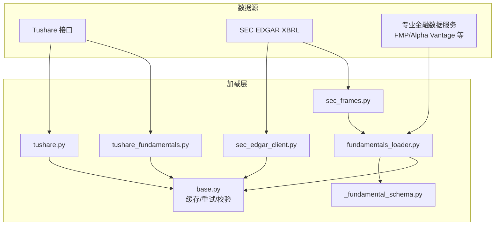
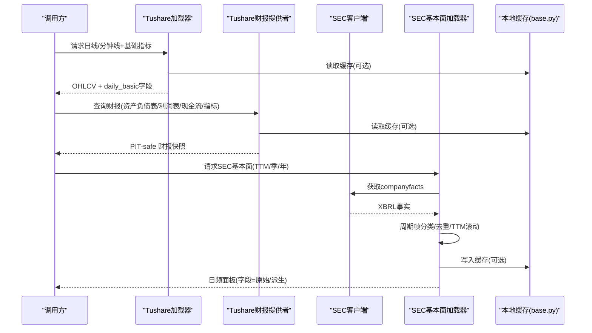
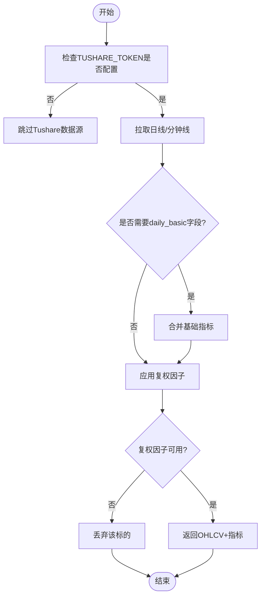
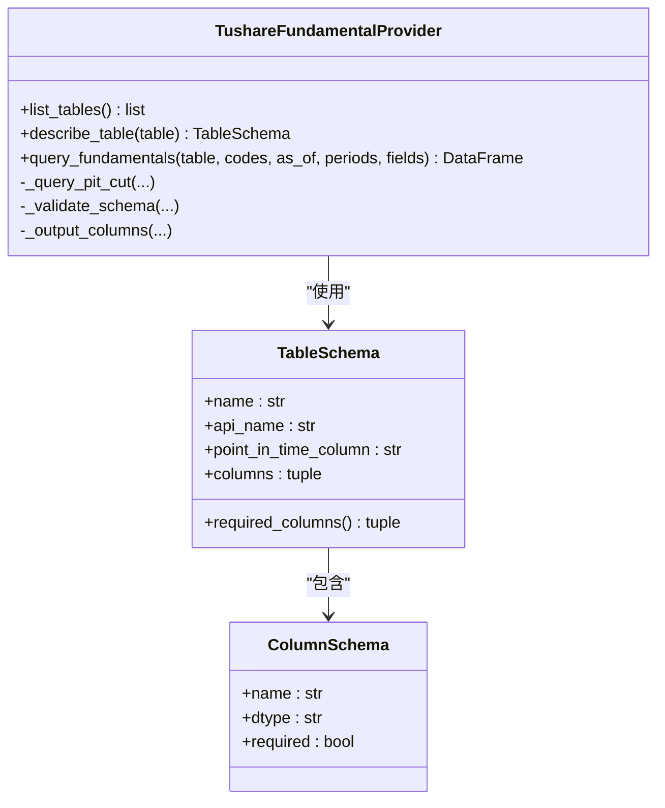
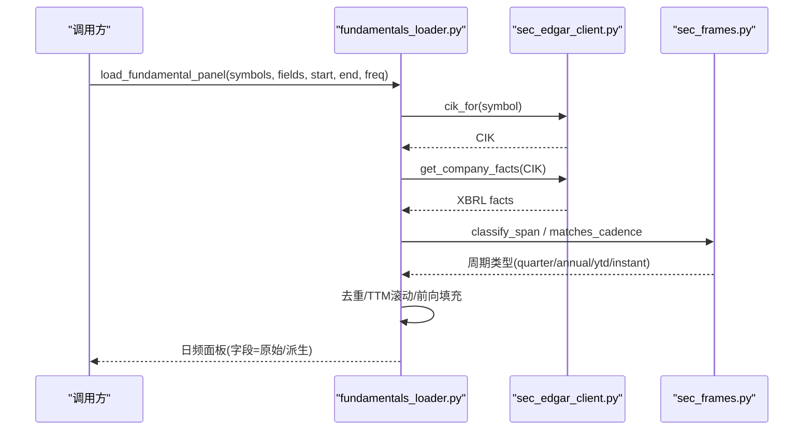
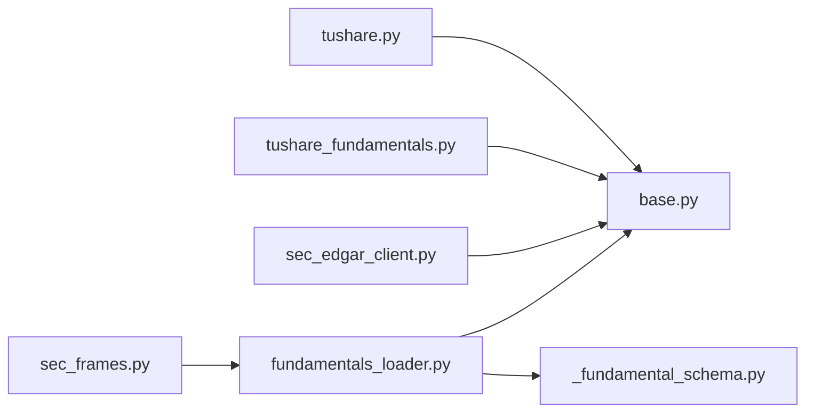

# 基本面数据源

<cite>
**本文引用的文件**
- [agent/backtest/loaders/tushare.py](file://agent/backtest/loaders/tushare.py)
- [agent/backtest/loaders/tushare_fundamentals.py](file://agent/backtest/loaders/tushare_fundamentals.py)
- [agent/backtest/loaders/sec_edgar_client.py](file://agent/backtest/loaders/sec_edgar_client.py)
- [agent/backtest/loaders/sec_frames.py](file://agent/backtest/loaders/sec_frames.py)
- [agent/backtest/loaders/fundamentals_loader.py](file://agent/backtest/loaders/fundamentals_loader.py)
- [agent/backtest/loaders/_fundamental_schema.py](file://agent/backtest/loaders/_fundamental_schema.py)
- [agent/backtest/loaders/base.py](file://agent/backtest/loaders/base.py)
- [agent/src/config/accessor.py](file://agent/src/config/accessor.py)
- [agent/src/skills/sec-edgar/SKILL.md](file://agent/src/skills/sec-edgar/SKILL.md)
- [agent/src/skills/sec-edgar/references/endpoints_and_limits.md](file://agent/src/skills/sec-edgar/references/endpoints_and_limits.md)
- [agent/src/skills/sec-edgar/references/sec_edgar_client.md](file://agent/src/skills/sec-edgar/references/sec_edgar_client.md)
</cite>

## 目录
1. [简介](#简介)
2. [项目结构](#项目结构)
3. [核心组件](#核心组件)
4. [架构总览](#架构总览)
5. [详细组件分析](#详细组件分析)
6. [依赖关系分析](#依赖关系分析)
7. [性能与可用性](#性能与可用性)
8. [故障排查指南](#故障排查指南)
9. [结论](#结论)
10. [附录：配置清单与最佳实践](#附录：配置清单与最佳实践)

## 简介
本指南面向需要获取并处理上市公司基本面数据的用户，覆盖三大类数据源与能力：
- 中国A股/港股/基金等市场：Tushare 财务接口（日线、分钟线、每日基础指标）
- 美国上市公司：SEC EDGAR XBRL 公司事实（companyfacts），支持年报/季报/滚动TTM
- 专业金融数据服务：通过统一加载器与缓存机制接入（如 FMP、Alpha Vantage 等，由通用框架承载）

文档重点包括：
- 各数据源的配置方法与环境变量
- 数据结构定义：资产负债表、利润表、现金流量表、财务比率
- 数据清洗与标准化：会计科目映射、完整性检查、异常值处理
- 基本面分析工具：指标计算、趋势分析、同业比较

## 项目结构
本项目在 backtest/loaders 下提供多数据源加载器，并通过统一的缓存与校验基础设施保障稳定性与可重复性。与基本面相关的关键模块如下：
- Tushare 日线/分钟线与基础指标加载器
- Tushare 财务报表提供者（带“时点安全”过滤）
- SEC EDGAR 客户端与XBRL周期帧选择
- 统一基本面字段模式与派生指标
- 通用加载器基类与本地缓存

图表来源
- [agent/backtest/loaders/tushare.py:1-386](file://agent/backtest/loaders/tushare.py#L1-L386)
- [agent/backtest/loaders/tushare_fundamentals.py:1-380](file://agent/backtest/loaders/tushare_fundamentals.py#L1-L380)
- [agent/backtest/loaders/sec_edgar_client.py:1-235](file://agent/backtest/loaders/sec_edgar_client.py#L1-L235)
- [agent/backtest/loaders/sec_frames.py:1-129](file://agent/backtest/loaders/sec_frames.py#L1-L129)
- [agent/backtest/loaders/fundamentals_loader.py:1-501](file://agent/backtest/loaders/fundamentals_loader.py#L1-L501)
- [agent/backtest/loaders/_fundamental_schema.py:1-227](file://agent/backtest/loaders/_fundamental_schema.py#L1-L227)
- [agent/backtest/loaders/base.py:1-657](file://agent/backtest/loaders/base.py#L1-L657)

章节来源
- [agent/backtest/loaders/tushare.py:1-386](file://agent/backtest/loaders/tushare.py#L1-L386)
- [agent/backtest/loaders/sec_edgar_client.py:1-235](file://agent/backtest/loaders/sec_edgar_client.py#L1-L235)
- [agent/backtest/loaders/fundamentals_loader.py:1-501](file://agent/backtest/loaders/fundamentals_loader.py#L1-L501)
- [agent/backtest/loaders/_fundamental_schema.py:1-227](file://agent/backtest/loaders/_fundamental_schema.py#L1-L227)
- [agent/backtest/loaders/base.py:1-657](file://agent/backtest/loaders/base.py#L1-L657)

## 核心组件
- Tushare 日线/分钟线加载器：负责A股/港股/基金等OHLCV与每日基础指标（如估值因子）的拉取、复权与合并。
- Tushare 财务报表提供者：按“时点安全”原则查询资产负债表、利润表、现金流及财务指标，并进行去重与可见时间线构建。
- SEC EDGAR 客户端：封装ticker->CIK映射、提交索引与XBRL公司事实的访问，内置限流与合规UA。
- SEC XBRL 周期帧选择：将公司事实中的瞬时、季度、年度、年初至今等期间进行识别与筛选。
- 统一基本面字段模式：定义原始字段与派生字段（ROE、ROA、杠杆率、应计利润等），并提供SEC概念别名映射。
- 通用加载器基类：提供日期校验、OHLC校验、重试预算、本地Parquet缓存等基础设施。

章节来源
- [agent/backtest/loaders/tushare.py:116-386](file://agent/backtest/loaders/tushare.py#L116-L386)
- [agent/backtest/loaders/tushare_fundamentals.py:110-380](file://agent/backtest/loaders/tushare_fundamentals.py#L110-L380)
- [agent/backtest/loaders/sec_edgar_client.py:1-235](file://agent/backtest/loaders/sec_edgar_client.py#L1-L235)
- [agent/backtest/loaders/sec_frames.py:1-129](file://agent/backtest/loaders/sec_frames.py#L1-L129)
- [agent/backtest/loaders/_fundamental_schema.py:28-227](file://agent/backtest/loaders/_fundamental_schema.py#L28-L227)
- [agent/backtest/loaders/base.py:31-119, 163-236, 243-441:168-256](file://agent/backtest/loaders/base.py#L168-L256)

## 架构总览
下图展示了从数据源到最终面板的数据流，强调“时点安全”和“本地缓存”。

图表来源
- [agent/backtest/loaders/tushare.py:142-323](file://agent/backtest/loaders/tushare.py#L142-L323)
- [agent/backtest/loaders/tushare_fundamentals.py:144-187](file://agent/backtest/loaders/tushare_fundamentals.py#L144-L187)
- [agent/backtest/loaders/sec_edgar_client.py:166-227](file://agent/backtest/loaders/sec_edgar_client.py#L166-L227)
- [agent/backtest/loaders/fundamentals_loader.py:196-277](file://agent/backtest/loaders/fundamentals_loader.py#L196-L277)
- [agent/backtest/loaders/base.py:623-661](file://agent/backtest/loaders/base.py#L623-L661)

## 详细组件分析

### Tushare 财务接口（中国A股/港股/基金）
- 功能要点
  - 支持1D/1m/5m/15m/30m/1H，自动识别指数/ETF/港股/美股/加密货币并路由不同端点
  - 日线支持合并 daily_basic 基础指标（如PE/PB等）
  - 复权：使用前复权因子对价格序列进行处理；无可用复权因子则丢弃该标的以避免回测偏差
  - 限流保护：针对每分钟配额拒绝进行退避重试
- 配置要点
  - 环境变量：TUSHARE_TOKEN（通过配置层读取）
  - 可用性判断：当token非空且非占位符时启用
- 数据结构
  - OHLCV：open/high/low/close/volume
  - daily_basic：按fields追加列（如估值、换手率等）
- 数据清洗
  - 类型转换与缺失值处理
  - 复权因子不可用时的稳健处理（直接丢弃标的）
  - 分钟级数据需满足权限要求（点数门槛）

图表来源
- [agent/backtest/loaders/tushare.py:133-146](file://agent/backtest/loaders/tushare.py#L133-L146)
- [agent/backtest/loaders/tushare.py:207-268](file://agent/backtest/loaders/tushare.py#L207-L268)
- [agent/backtest/loaders/tushare.py:361-414](file://agent/backtest/loaders/tushare.py#L361-L414)
- [agent/backtest/loaders/tushare.py:416-476](file://agent/backtest/loaders/tushare.py#L416-L476)

章节来源
- [agent/backtest/loaders/tushare.py:116-386](file://agent/backtest/loaders/tushare.py#L116-L386)

### Tushare 财务报表提供者（资产负债表/利润表/现金流/指标）
- 功能要点
  - 支持 balancesheet/income/cashflow/fina_indicator 等表
  - “时点安全”：以 f_ann_date/ann_date 为可见时间锚，确保回溯时不会看到未来披露
  - 去重策略：同一(ts_code,end_date)保留最新有效披露；同期间重述按输入顺序保留最后一条
  - 输出列：ts_code/end_date/ann_date + 指定fields
- 配置要点
  - 通过配置层读取TUSHARE_TOKEN初始化API
- 数据结构
  - 资产负债表：总资产、总负债、股东权益等
  - 利润表：营收、营业利润、净利润等
  - 现金流量表：经营现金流、期末现金余额等
  - 财务指标：EPS、毛利率、净利率、ROE、资产负债率等
- 数据清洗
  - 必填字段校验（Schema验证）
  - 日期解析与归一化
  - 可见时间线构建与合并（merge_asof）

图表来源
- [agent/backtest/loaders/tushare_fundamentals.py:33-53](file://agent/backtest/loaders/tushare_fundamentals.py#L33-L53)
- [agent/backtest/loaders/tushare_fundamentals.py:118-187](file://agent/backtest/loaders/tushare_fundamentals.py#L118-L187)
- [agent/backtest/loaders/tushare_fundamentals.py:189-259](file://agent/backtest/loaders/tushare_fundamentals.py#L189-L259)

章节来源
- [agent/backtest/loaders/tushare_fundamentals.py:1-380](file://agent/backtest/loaders/tushare_fundamentals.py#L1-L380)

### SEC EDGAR 美国上市公司文件（XBRL companyfacts）
- 功能要点
  - ticker->CIK映射（进程内缓存）、提交索引、公司事实JSON
  - 严格限流：默认~0.12s/请求，遵守SEC公平访问政策，附带合规User-Agent
  - 周期帧分类：区分瞬时（资产负债表）、季度、年度、年初至今（YTD）
  - 支持频率：annual/quarterly/ttm（TTM采用四期滚动求和）
- 配置要点
  - 环境变量：VIBE_TRADING_SEC_UA（自定义UA）、VIBE_TRADING_SEC_MIN_INTERVAL（最小间隔）
  - 仅支持美国上市公司（非US符号无法解析CIK）
- 数据结构
  - 原始字段：revenue/cogs/gross_profit/operating_income/net_income/total_assets/total_equity/total_debt/cash/shares_diluted/cfo/capex
  - 派生字段：roe/roa/gross_profitability/asset_growth/accruals/leverage
  - 字段到SEC概念别名映射，容错多概念并集
- 数据清洗
  - 表单过滤（10-K/10-Q）
  - 期间去重与TTM滚动
  - 稀疏值前向填充至交易日序列

图表来源
- [agent/backtest/loaders/fundamentals_loader.py:196-277](file://agent/backtest/loaders/fundamentals_loader.py#L196-L277)
- [agent/backtest/loaders/sec_edgar_client.py:166-227](file://agent/backtest/loaders/sec_edgar_client.py#L166-L227)
- [agent/backtest/loaders/sec_frames.py:42-129](file://agent/backtest/loaders/sec_frames.py#L42-L129)

章节来源
- [agent/backtest/loaders/sec_edgar_client.py:1-235](file://agent/backtest/loaders/sec_edgar_client.py#L1-L235)
- [agent/backtest/loaders/sec_frames.py:1-129](file://agent/backtest/loaders/sec_frames.py#L1-L129)
- [agent/backtest/loaders/fundamentals_loader.py:1-501](file://agent/backtest/loaders/fundamentals_loader.py#L1-L501)
- [agent/src/skills/sec-edgar/SKILL.md:64-72](file://agent/src/skills/sec-edgar/SKILL.md#L64-L72)
- [agent/src/skills/sec-edgar/references/endpoints_and_limits.md:1-34](file://agent/src/skills/sec-edgar/references/endpoints_and_limits.md#L1-L34)
- [agent/src/skills/sec-edgar/references/sec_edgar_client.md:1-32](file://agent/src/skills/sec-edgar/references/sec_edgar_client.md#L1-L32)

### 统一基本面字段模式与派生指标
- 原始字段（示例）
  - 利润表：revenue、cogs、gross_profit、operating_income、net_income
  - 资产负债表：total_assets、total_equity、total_debt、cash
  - 现金流量表：cfo、capex
  - 其他：shares_diluted
- 派生字段（示例）
  - ROE = net_income / total_equity
  - ROA = net_income / total_assets
  - 杠杆率 = total_debt / total_equity
  - 资产增长率 = total_assets / shift(total_assets) - 1
  - 应计利润 = (net_income - cfo) / total_assets
- 数据清洗与标准化
  - 除零保护：分母为0时返回NaN
  - 字段到SEC概念别名映射，优先新标准概念
  - 缺失字段记录日志但不伪造数值

章节来源
- [agent/backtest/loaders/_fundamental_schema.py:28-227](file://agent/backtest/loaders/_fundamental_schema.py#L28-L227)

### 通用加载器基类与缓存
- 日期范围校验、OHLC结构校验（高/低/开/收逻辑一致性、非正价格处理）
- 重试预算与退避：适用于不稳定外部API
- 本地缓存：基于内容哈希的Parquet缓存，避免重复请求与提升可重复性
- 关键函数
  - validate_date_range / validate_ohlc
  - retry_with_budget / check_budget
  - cached_loader_fetch / loader_cache_*

章节来源
- [agent/backtest/loaders/base.py:31-119, 163-236, 243-441:168-256](file://agent/backtest/loaders/base.py#L168-L256)

## 依赖关系分析
- Tushare 加载器依赖配置层读取TUSHARE_TOKEN，并复用base缓存与校验
- Tushare 财报提供者依赖Tushare API，实现PIT-safe查询与Schema验证
- SEC 基本面加载器依赖EDGAR客户端与周期帧选择，结合统一字段模式生成面板
- 所有加载器共享base提供的重试、预算与缓存机制

图表来源
- [agent/backtest/loaders/tushare.py:1-386](file://agent/backtest/loaders/tushare.py#L1-L386)
- [agent/backtest/loaders/tushare_fundamentals.py:1-380](file://agent/backtest/loaders/tushare_fundamentals.py#L1-L380)
- [agent/backtest/loaders/sec_edgar_client.py:1-235](file://agent/backtest/loaders/sec_edgar_client.py#L1-L235)
- [agent/backtest/loaders/sec_frames.py:1-129](file://agent/backtest/loaders/sec_frames.py#L1-L129)
- [agent/backtest/loaders/fundamentals_loader.py:1-501](file://agent/backtest/loaders/fundamentals_loader.py#L1-L501)
- [agent/backtest/loaders/_fundamental_schema.py:1-227](file://agent/backtest/loaders/_fundamental_schema.py#L1-L227)
- [agent/backtest/loaders/base.py:1-657](file://agent/backtest/loaders/base.py#L1-L657)

章节来源
- [agent/backtest/loaders/base.py:1-657](file://agent/backtest/loaders/base.py#L1-L657)

## 性能与可用性
- Tushare
  - 分钟级数据需要较高权限等级；配额限制触发时会退避重试
  - 复权因子缺失会直接丢弃标的，避免回测偏差
- SEC EDGAR
  - 每IP限流约10次/秒；默认0.12s间隔，可通过环境变量调整
  - 必须携带合规User-Agent，否则可能被临时封禁
- 通用
  - 本地缓存显著减少重复请求；仅对已结算区间进行缓存
  - 重试预算防止长时间挂起；失败快速退出

章节来源
- [agent/backtest/loaders/tushare.py:18-35, 207-268:18-35](file://agent/backtest/loaders/tushare.py#L18-L35)
- [agent/backtest/loaders/sec_edgar_client.py:13-18, 40-43, 63-75:13-18](file://agent/backtest/loaders/sec_edgar_client.py#L13-L18)
- [agent/backtest/loaders/base.py:163-236, 330-342:377-450](file://agent/backtest/loaders/base.py#L377-L450)

## 故障排查指南
- Tushare配额拒绝
  - 现象：出现“每分钟/每天/抽取/访问该接口/频率”等提示
  - 处理：自动退避重试；若持续失败，降低请求频率或升级权限
- 复权因子不可用
  - 现象：日志提示无可用复权因子并丢弃标的
  - 处理：确认标的是否具备复权因子；必要时改用未复权数据进行研究
- SEC UA不合规或被限流
  - 现象：请求被拒或短暂封禁
  - 处理：设置VIBE_TRADING_SEC_UA为含联系邮箱的UA；增大VIBE_TRADING_SEC_MIN_INTERVAL
- 字段缺失或概念未命中
  - 现象：日志记录“concept miss”，对应字段为NaN
  - 处理：检查字段是否在SEC_CONCEPT_MAP中；必要时扩展别名或改用其他数据源
- 本地缓存异常
  - 现象：读取失败或元数据损坏
  - 处理：缓存读取失败会回退到在线请求；清理损坏缓存文件后重试

章节来源
- [agent/backtest/loaders/tushare.py:18-35, 253-268:18-35](file://agent/backtest/loaders/tushare.py#L18-L35)
- [agent/backtest/loaders/sec_edgar_client.py:63-75](file://agent/backtest/loaders/sec_edgar_client.py#L63-L75)
- [agent/backtest/loaders/fundamentals_loader.py:504-521](file://agent/backtest/loaders/fundamentals_loader.py#L504-L521)
- [agent/backtest/loaders/base.py:477-513](file://agent/backtest/loaders/base.py#L477-L513)

## 结论
本项目提供了完善的基本面数据获取与处理能力：
- Tushare覆盖中国A股/港股/基金等市场，支持日线/分钟线与基础指标
- SEC EDGAR提供美国上市公司的XBRL事实，支持TTM与季度/年度频率
- 统一字段模式与派生指标便于跨市场分析与建模
- 完善的清洗、校验与缓存机制保障数据质量与运行效率

建议在实际使用中：
- 合理配置环境变量与限流参数
- 关注字段覆盖率与缺失情况，必要时扩展概念映射
- 利用本地缓存与重试机制提高鲁棒性
- 结合财务指标与趋势分析开展研究与策略开发

## 附录：配置清单与最佳实践
- 环境变量
  - TUSHARE_TOKEN：Tushare接口令牌（中国A股/港股/基金）
  - VIBE_TRADING_SEC_UA：SEC EDGAR合规User-Agent（含联系邮箱）
  - VIBE_TRADING_SEC_MIN_INTERVAL：SEC请求最小间隔（秒）
  - VIBE_TRADING_DATA_CACHE：是否启用本地缓存
  - VIBE_TRADING_DATA_CACHE_ROOT：缓存根目录
- 数据源选择
  - 中国市场优先Tushare；若权限不足或配额受限，可考虑AKShare等替代
  - 美国市场使用SEC EDGAR；如需更广泛覆盖或更高时效，可接入专业数据服务（如FMP、Alpha Vantage等，由通用加载器承载）
- 数据清洗与标准化
  - 会计科目映射：使用SEC_CONCEPT_MAP将统一字段映射到多个SEC概念
  - 完整性检查：Schema验证必填字段；缺失字段记录日志并置NaN
  - 异常值处理：OHLC结构校验；非正价格策略可配置；除零保护
- 分析工具
  - 指标计算：ROE、ROA、杠杆率、资产增长、应计利润等
  - 趋势分析：TTM滚动、季度/年度对比、同比/环比
  - 同业比较：基于统一字段的横截面排序与分组统计

章节来源
- [agent/src/config/accessor.py:52-76](file://agent/src/config/accessor.py#L52-L76)
- [agent/backtest/loaders/sec_edgar_client.py:40-43, 63-75:40-43](file://agent/backtest/loaders/sec_edgar_client.py#L40-L43)
- [agent/backtest/loaders/base.py:243-283, 330-342:243-283](file://agent/backtest/loaders/base.py#L243-L283)
- [agent/backtest/loaders/_fundamental_schema.py:82-153, 156-189:99-170](file://agent/backtest/loaders/_fundamental_schema.py#L99-L170)