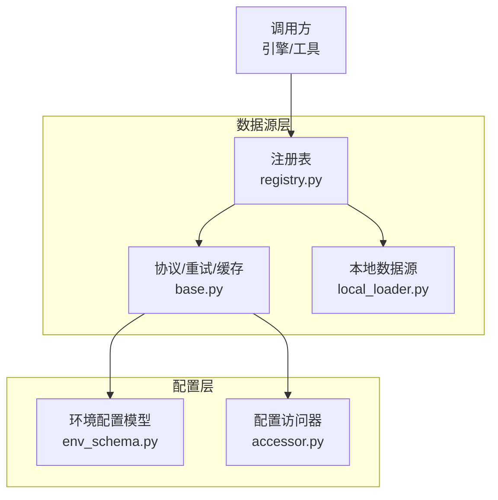
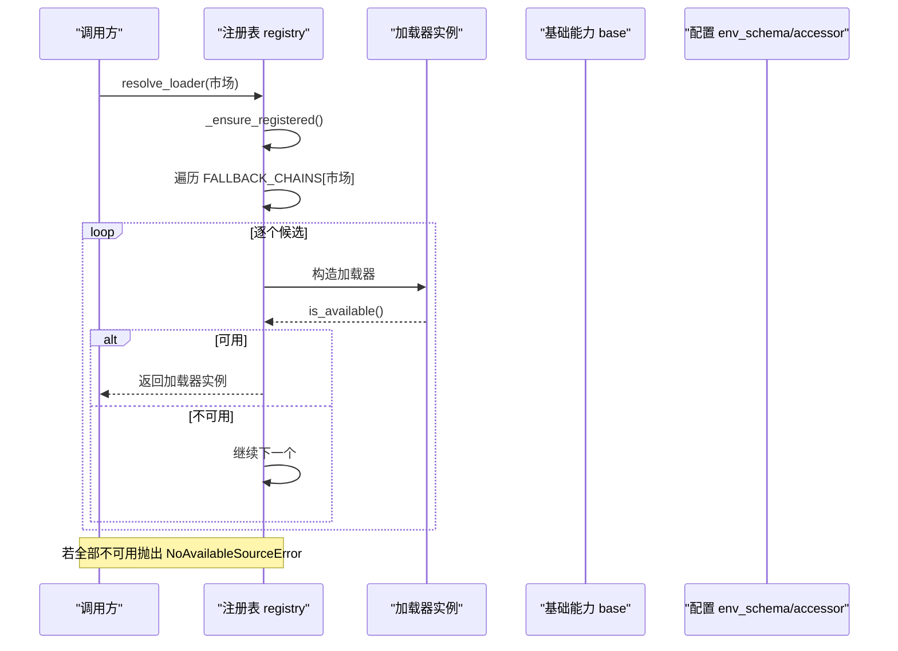
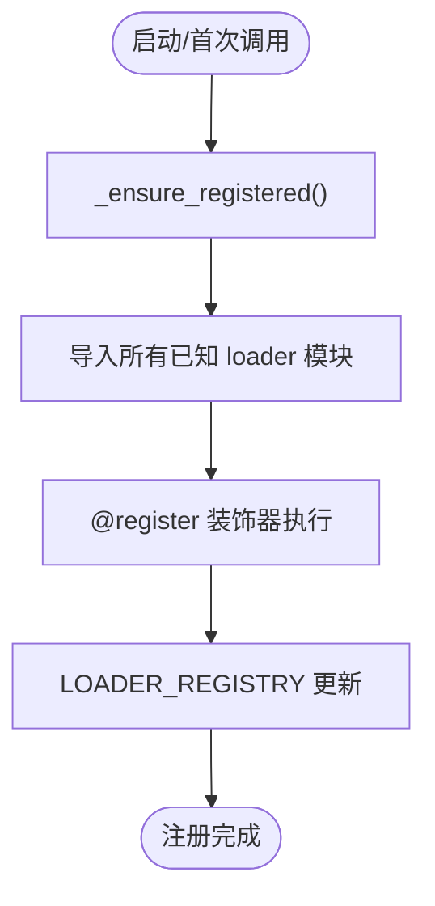
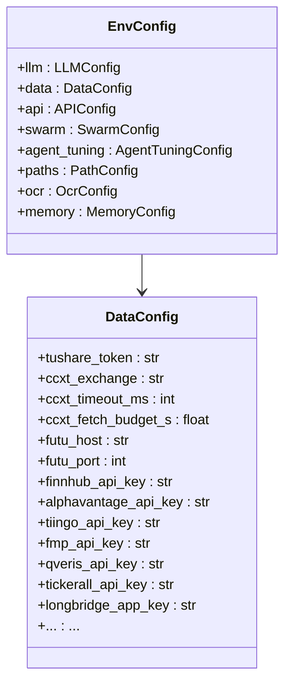
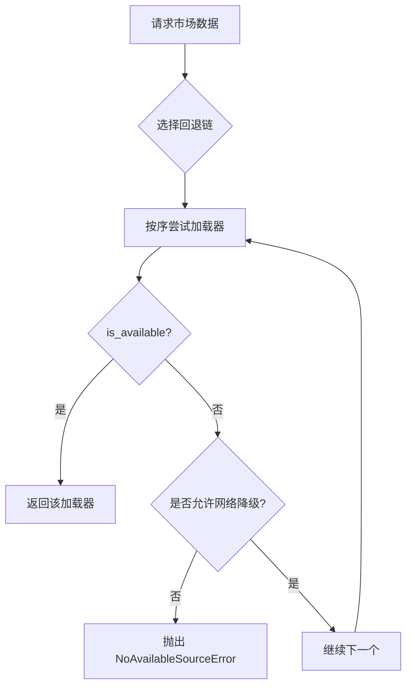
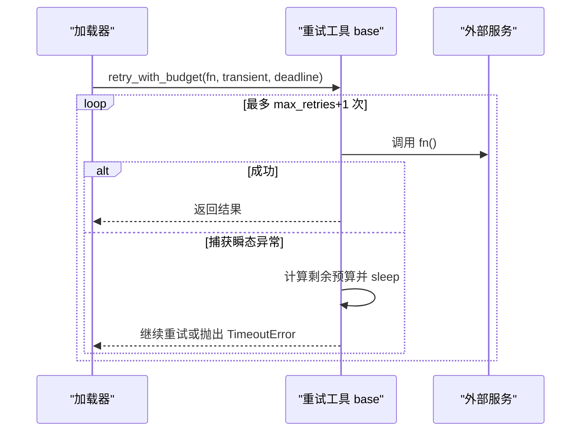
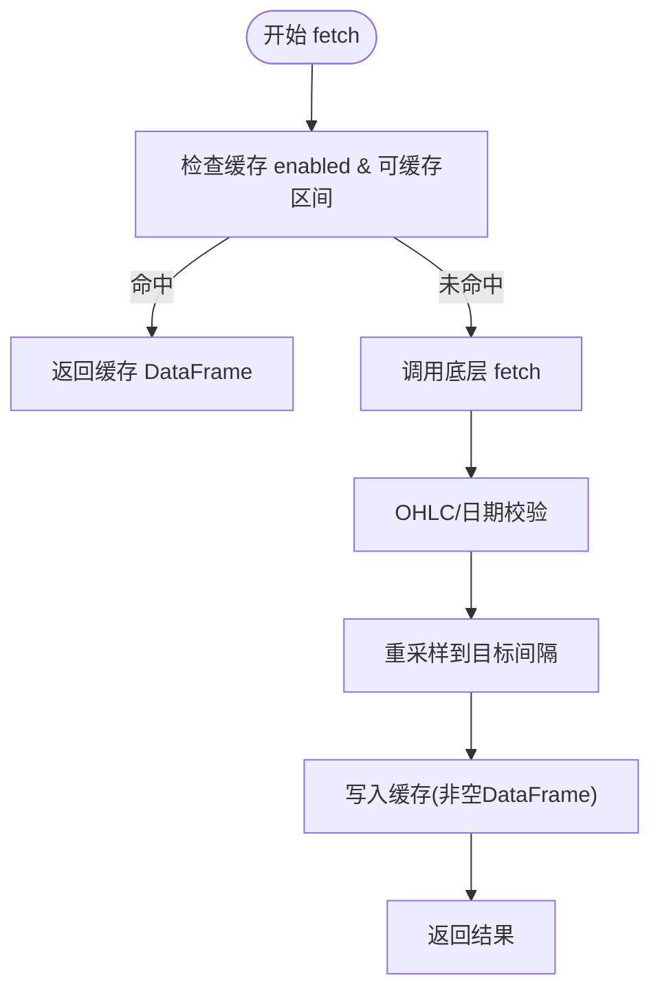

# 数据源管理

<cite>
**本文引用的文件**
- [agent/backtest/loaders/registry.py](file://agent/backtest/loaders/registry.py)
- [agent/backtest/loaders/base.py](file://agent/backtest/loaders/base.py)
- [agent/backtest/loaders/local_loader.py](file://agent/backtest/loaders/local_loader.py)
- [agent/src/config/accessor.py](file://agent/src/config/accessor.py)
- [agent/src/config/env_schema.py](file://agent/src/config/env_schema.py)
</cite>

## 目录
1. [简介](#简介)
2. [项目结构](#项目结构)
3. [核心组件](#核心组件)
4. [架构总览](#架构总览)
5. [详细组件分析](#详细组件分析)
6. [依赖关系分析](#依赖关系分析)
7. [性能考量](#性能考量)
8. [故障排查指南](#故障排查指南)
9. [结论](#结论)
10. [附录](#附录)

## 简介
本指南面向“数据源管理”的完整生命周期：注册与动态发现、配置与环境变量、故障转移与降级、监控与诊断、自定义数据源开发与测试，以及缓存、批量处理与内存优化等最佳实践。内容基于代码库中的加载器注册表、协议定义、本地数据源实现与统一配置层进行系统化梳理，帮助读者在复杂多源环境下稳定获取行情与基本面数据。

## 项目结构
围绕数据源管理的核心代码集中在以下位置：
- 加载器注册与回退链：backtest/loaders/registry.py
- 数据加载协议、重试与缓存工具：backtest/loaders/base.py
- 本地数据源实现（CSV/Parquet/DuckDB）：backtest/loaders/local_loader.py
- 环境变量与配置模型：src/config/env_schema.py、src/config/accessor.py



图表来源
- [agent/backtest/loaders/registry.py:1-256](file://agent/backtest/loaders/registry.py#L1-L256)
- [agent/backtest/loaders/base.py:1-657](file://agent/backtest/loaders/base.py#L1-L657)
- [agent/backtest/loaders/local_loader.py:1-354](file://agent/backtest/loaders/local_loader.py#L1-L354)
- [agent/src/config/env_schema.py:1-593](file://agent/src/config/env_schema.py#L1-L593)
- [agent/src/config/accessor.py:1-149](file://agent/src/config/accessor.py#L1-L149)

章节来源
- [agent/backtest/loaders/registry.py:1-256](file://agent/backtest/loaders/registry.py#L1-L256)
- [agent/backtest/loaders/base.py:1-657](file://agent/backtest/loaders/base.py#L1-L657)
- [agent/backtest/loaders/local_loader.py:1-354](file://agent/backtest/loaders/local_loader.py#L1-L354)
- [agent/src/config/env_schema.py:1-593](file://agent/src/config/env_schema.py#L1-L593)
- [agent/src/config/accessor.py:1-149](file://agent/src/config/accessor.py#L1-L149)

## 核心组件
- 数据加载协议与异常：定义了统一的 DataLoaderProtocol 接口、NoAvailableSourceError 异常、OHLC 校验、日期范围校验、重试预算与指数退避等通用能力。
- 加载器注册与自动发现：通过装饰器将具体加载器类注册到全局字典；启动时按需导入所有已知模块以触发注册；提供按市场类型的回退链解析。
- 本地数据源：支持 CSV/Parquet/DuckDB 三种格式，读取用户配置文件，完成列映射、时间解析、区间过滤与重采样。
- 配置与环境变量：集中式 Pydantic 模型统一管理所有环境变量，提供类型校验、默认值、别名兼容与线程安全的单例访问。

章节来源
- [agent/backtest/loaders/base.py:164-256](file://agent/backtest/loaders/base.py#L164-L256)
- [agent/backtest/loaders/base.py:398-450](file://agent/backtest/loaders/base.py#L398-L450)
- [agent/backtest/loaders/base.py:243-441](file://agent/backtest/loaders/base.py#L243-L441)
- [agent/backtest/loaders/base.py:851-887](file://agent/backtest/loaders/base.py#L851-L887)
- [agent/backtest/loaders/registry.py:23-127](file://agent/backtest/loaders/registry.py#L23-L127)
- [agent/backtest/loaders/registry.py:139-196](file://agent/backtest/loaders/registry.py#L139-L196)
- [agent/backtest/loaders/local_loader.py:1-354](file://agent/backtest/loaders/local_loader.py#L1-L354)
- [agent/src/config/env_schema.py:166-214](file://agent/src/config/env_schema.py#L166-L214)
- [agent/src/config/accessor.py:52-93](file://agent/src/config/accessor.py#L52-L93)

## 架构总览
数据源管理采用“协议 + 注册表 + 回退链 + 配置中心”的分层设计：
- 协议层：所有数据源必须实现 DataLoaderProtocol，确保 fetch/is_available 等接口一致。
- 注册与发现：registry 维护全局 LOADER_REGISTRY，_ensure_registered 懒加载并导入所有 loader 模块，使 @register 装饰器生效。
- 回退链：FALLBACK_CHAINS 为每个市场定义优先级顺序，resolve_loader 依次尝试可用加载器。
- 配置层：EnvConfig/DataConfig 集中管理 API Key、超时、预算、缓存开关等；accessor 提供线程安全单例访问。



图表来源
- [agent/backtest/loaders/registry.py:72-117](file://agent/backtest/loaders/registry.py#L72-L117)
- [agent/backtest/loaders/registry.py:614-649](file://agent/backtest/loaders/registry.py#L614-L649)
- [agent/backtest/loaders/base.py:851-887](file://agent/backtest/loaders/base.py#L851-L887)
- [agent/src/config/env_schema.py:166-214](file://agent/src/config/env_schema.py#L166-L214)
- [agent/src/config/accessor.py:52-93](file://agent/src/config/accessor.py#L52-L93)

## 详细组件分析

### 数据源注册机制：动态发现、自动加载、版本管理
- 动态发现：通过 @register 装饰器将加载器类名映射到类对象，保存在全局字典中。
- 自动加载：_ensure_registered 使用 importlib 导入所有已知 loader 模块，即使缺失依赖也会被静默跳过，保证健壮性。
- 版本管理：加载器缓存使用版本号字段（_LOADER_CACHE_VERSION），当缓存键或磁盘布局变更时，旧条目不再命中，避免脏数据。



图表来源
- [agent/backtest/loaders/registry.py:72-117](file://agent/backtest/loaders/registry.py#L72-L117)
- [agent/backtest/loaders/base.py:243-250](file://agent/backtest/loaders/base.py#L243-L250)

章节来源
- [agent/backtest/loaders/registry.py:23-127](file://agent/backtest/loaders/registry.py#L23-L127)
- [agent/backtest/loaders/base.py:243-250](file://agent/backtest/loaders/base.py#L243-L250)

### 数据源配置管理：环境变量、配置文件、敏感信息保护
- 环境变量配置：DataConfig 集中声明所有数据源相关的环境变量（如 TUSHARE_TOKEN、FINNHUB_API_KEY、CCXT_*、QVERIS_*、TICKERALL_*、LONGBRIDGE_* 等），并提供默认值与类型校验。
- 配置文件管理：本地数据源通过 ~/.vibe-trading/data-bridge/config.yaml 声明 symbol -> 文件/查询映射，支持列名映射、日期格式、DuckDB SQL 查询。
- 敏感信息保护：API Key 仅存在于环境变量与受控配置文件中；accessor 提供线程安全的 EnvConfig 单例，避免重复创建与并发竞争。



图表来源
- [agent/src/config/env_schema.py:166-214](file://agent/src/config/env_schema.py#L166-L214)
- [agent/src/config/env_schema.py:685-716](file://agent/src/config/env_schema.py#L685-L716)

章节来源
- [agent/src/config/env_schema.py:166-214](file://agent/src/config/env_schema.py#L166-L214)
- [agent/backtest/loaders/local_loader.py:1-354](file://agent/backtest/loaders/local_loader.py#L1-L354)
- [agent/src/config/accessor.py:52-93](file://agent/src/config/accessor.py#L52-L93)

### 数据源故障转移策略：主备切换、负载均衡、降级处理
- 主备切换：按市场类型从 FALLBACK_CHAINS 中按序尝试各数据源，首个 is_available() 为 True 即返回。
- 负载均衡：当前未实现显式轮询或权重分配；可通过调整回退链顺序影响请求分布。
- 降级处理：对明确指定且不应网络降级的源（如 local、qveris、tickerall），若不可用则直接报错，避免误用无关网络源掩盖配置问题。



图表来源
- [agent/backtest/loaders/registry.py:139-196](file://agent/backtest/loaders/registry.py#L139-L196)
- [agent/backtest/loaders/registry.py:199-255](file://agent/backtest/loaders/registry.py#L199-L255)

章节来源
- [agent/backtest/loaders/registry.py:139-196](file://agent/backtest/loaders/registry.py#L139-L196)
- [agent/backtest/loaders/registry.py:199-255](file://agent/backtest/loaders/registry.py#L199-L255)

### 数据源监控与诊断：连接状态检查、性能指标收集、错误日志分析
- 连接状态检查：每个加载器实现 is_available()，用于快速判断凭据、网络或依赖是否就绪。
- 性能指标收集：通过 CCXT_FETCH_BUDGET_S、TIMEOUT_SECONDS、MAX_RETRIES 等配置控制请求预算与重试；base 中 retry_with_budget/check_budget 提供统一的重试与超时控制。
- 错误日志分析：加载失败、构造异常、缓存读写异常均记录日志；本地数据源对缺失路径/列/查询给出警告，便于定位配置问题。



图表来源
- [agent/backtest/loaders/base.py:398-450](file://agent/backtest/loaders/base.py#L398-L450)
- [agent/src/config/env_schema.py:173-183](file://agent/src/config/env_schema.py#L173-L183)

章节来源
- [agent/backtest/loaders/base.py:398-450](file://agent/backtest/loaders/base.py#L398-L450)
- [agent/backtest/loaders/local_loader.py:322-347](file://agent/backtest/loaders/local_loader.py#L322-L347)

### 自定义数据源开发：接口规范、实现示例、测试方法
- 接口规范：实现 DataLoaderProtocol 的 name/markets/requires_auth/is_available/fetch；遵循 OHLC 校验与日期范围校验。
- 实现示例：参考 local_loader 的实现模式——读取配置、规范化列、时间索引、区间过滤、重采样、缓存封装。
- 测试方法：利用 base 提供的 validate_date_range/validate_ohlc/cached_loader_fetch 等工具；结合 pytest 构造 mock 数据与异常场景，验证 is_available/fetch 行为与回退逻辑。

```mermaid
classDiagram
class DataLoaderProtocol {
<<protocol>>
+name : str
+markets : set[str]
+requires_auth : bool
+is_available() bool
+fetch(codes, start_date, end_date, interval, fields) dict
}
class LocalLoader {
+name = "local"
+markets = {...}
+is_available() bool
+fetch(...) dict
}
DataLoaderProtocol <|.. LocalLoader
```

图表来源
- [agent/backtest/loaders/base.py:851-887](file://agent/backtest/loaders/base.py#L851-L887)
- [agent/backtest/loaders/local_loader.py:271-347](file://agent/backtest/loaders/local_loader.py#L271-L347)

章节来源
- [agent/backtest/loaders/base.py:851-887](file://agent/backtest/loaders/base.py#L851-L887)
- [agent/backtest/loaders/local_loader.py:271-347](file://agent/backtest/loaders/local_loader.py#L271-L347)

### 数据源最佳实践：缓存策略、批量处理、内存优化
- 缓存策略：启用 VIBE_TRADING_DATA_CACHE=1，数据写入 Parquet + JSON 元数据，按内容寻址生成 key；仅对已结算的 end_date 缓存；读/写失败不影响主流程。
- 批量处理：fetch 接受 codes 列表，内部循环逐码拉取并复用缓存；建议在同一批次内合并相同区间的请求以减少开销。
- 内存优化：使用 DuckDB 读写 Parquet 减少中间对象；重采样后丢弃空行；严格 OHLC 校验避免下游 NaN/Inf 传播。



图表来源
- [agent/backtest/loaders/base.py:243-441](file://agent/backtest/loaders/base.py#L243-L441)
- [agent/backtest/loaders/local_loader.py:88-131](file://agent/backtest/loaders/local_loader.py#L88-L131)
- [agent/backtest/loaders/local_loader.py:349-405](file://agent/backtest/loaders/local_loader.py#L349-L405)

章节来源
- [agent/backtest/loaders/base.py:243-441](file://agent/backtest/loaders/base.py#L243-L441)
- [agent/backtest/loaders/local_loader.py:88-131](file://agent/backtest/loaders/local_loader.py#L88-L131)
- [agent/backtest/loaders/local_loader.py:349-405](file://agent/backtest/loaders/local_loader.py#L349-L405)

## 依赖关系分析
- 注册表依赖 base 的异常与协议；本地数据源依赖 base 的缓存与校验工具；配置层被 base 与注册表间接使用（例如缓存开关）。
- 无循环依赖：registry 仅依赖 base；base 不反向依赖 registry；local_loader 依赖 base 与 registry。


图表来源
- [agent/backtest/loaders/registry.py:1-256](file://agent/backtest/loaders/registry.py#L1-L256)
- [agent/backtest/loaders/base.py:1-657](file://agent/backtest/loaders/base.py#L1-L657)
- [agent/backtest/loaders/local_loader.py:1-354](file://agent/backtest/loaders/local_loader.py#L1-L354)
- [agent/src/config/env_schema.py:1-593](file://agent/src/config/env_schema.py#L1-L593)
- [agent/src/config/accessor.py:1-149](file://agent/src/config/accessor.py#L1-L149)

章节来源
- [agent/backtest/loaders/registry.py:1-256](file://agent/backtest/loaders/registry.py#L1-L256)
- [agent/backtest/loaders/base.py:1-657](file://agent/backtest/loaders/base.py#L1-L657)
- [agent/backtest/loaders/local_loader.py:1-354](file://agent/backtest/loaders/local_loader.py#L1-L354)
- [agent/src/config/env_schema.py:1-593](file://agent/src/config/env_schema.py#L1-L593)
- [agent/src/config/accessor.py:1-149](file://agent/src/config/accessor.py#L1-L149)

## 性能考量
- 重试与预算：通过 CCXT_FETCH_BUDGET_S、TIMEOUT_SECONDS、MAX_RETRIES 控制外部请求成本；retry_with_budget 提供指数退避与截止时间检查，避免无限重试。
- 缓存命中率：合理设置 end_date 与 timeframe，确保缓存可命中；对频繁查询的标的优先启用缓存。
- I/O 效率：本地数据源使用 DuckDB 读写 Parquet，减少 Python 对象开销；重采样聚合降低后续计算压力。
- 内存占用：严格 OHLC 校验与 dropna，避免无效数据进入下游；缓存只保存已结算区间，防止临时数据长期驻留。

[本节为通用指导，无需特定文件引用]

## 故障排查指南
- 无法找到可用数据源：检查市场对应的回退链顺序与各加载器的 is_available() 条件；确认凭据与环境变量是否正确设置。
- 本地数据源不可用：确认 ~/.vibe-trading/data-bridge/config.yaml 存在且 sources 非空；symbol 与 type/path/db_path/query 配置正确。
- 缓存相关问题：检查 VIBE_TRADING_DATA_CACHE 是否开启；end_date 是否为已结算日期；查看缓存目录是否存在损坏文件（会降级到在线源）。
- 超时与限流：调大 CCXT_FETCH_BUDGET_S/TIMEOUT_SECONDS；适当增加 MAX_RETRIES；关注日志中的重试与超时提示。

章节来源
- [agent/backtest/loaders/registry.py:614-649](file://agent/backtest/loaders/registry.py#L614-L649)
- [agent/backtest/loaders/local_loader.py:134-138](file://agent/backtest/loaders/local_loader.py#L134-L138)
- [agent/backtest/loaders/base.py:243-441](file://agent/backtest/loaders/base.py#L243-L441)
- [agent/src/config/env_schema.py:173-183](file://agent/src/config/env_schema.py#L173-L183)

## 结论
本系统通过协议化抽象、注册表驱动与回退链机制，实现了多数据源的统一接入与高可用保障；配合集中式配置与可选本地缓存，既满足灵活扩展又兼顾性能与稳定性。建议在生产环境中：
- 明确各市场的回退链优先级，避免关键业务依赖单一源；
- 启用本地缓存以降低外部依赖与网络波动的影响；
- 完善环境变量与配置文件管理，确保凭据安全与可追溯；
- 建立监控与告警，覆盖 is_available、重试次数、超时与缓存命中率等关键指标。

[本节为总结性内容，无需特定文件引用]

## 附录
- 常用环境变量（数据源相关）：
  - TUSHARE_TOKEN、FINNHUB_API_KEY、ALPHAVANTAGE_API_KEY、TIINGO_API_KEY、FMP_API_KEY
  - CCXT_EXCHANGE、CCXT_TIMEOUT_MS、CCXT_FETCH_BUDGET_S
  - QVERIS_API_KEY、QVERIS_BASE_URL
  - TICKERALL_API_KEY、TICKERALL_ACCOUNT_ID、TICKERALL_BASE_URL
  - LONGBRIDGE_APP_KEY、LONGBRIDGE_APP_SECRET、LONGBRIDGE_ACCESS_TOKEN
  - VIBE_TRADING_DATA_CACHE、VIBE_TRADING_DATA_CACHE_ROOT
- 本地数据源配置文件路径：~/.vibe-trading/data-bridge/config.yaml

章节来源
- [agent/src/config/env_schema.py:166-214](file://agent/src/config/env_schema.py#L166-L214)
- [agent/backtest/loaders/local_loader.py:1-354](file://agent/backtest/loaders/local_loader.py#L1-L354)