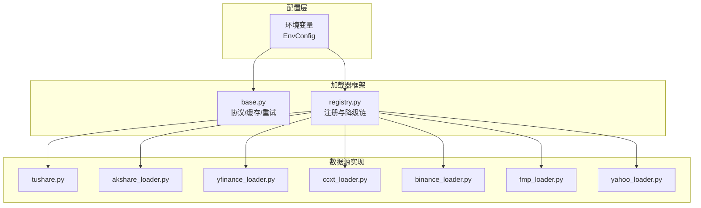
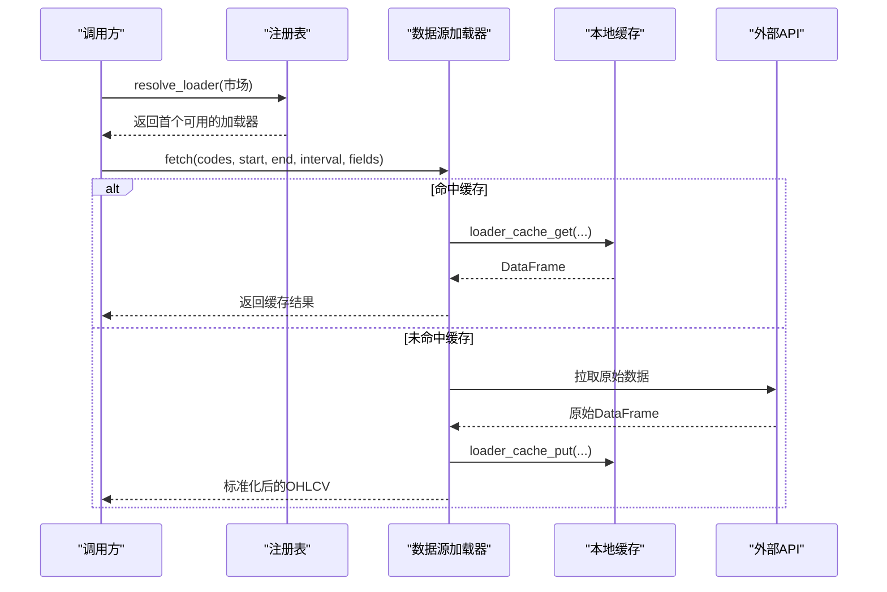
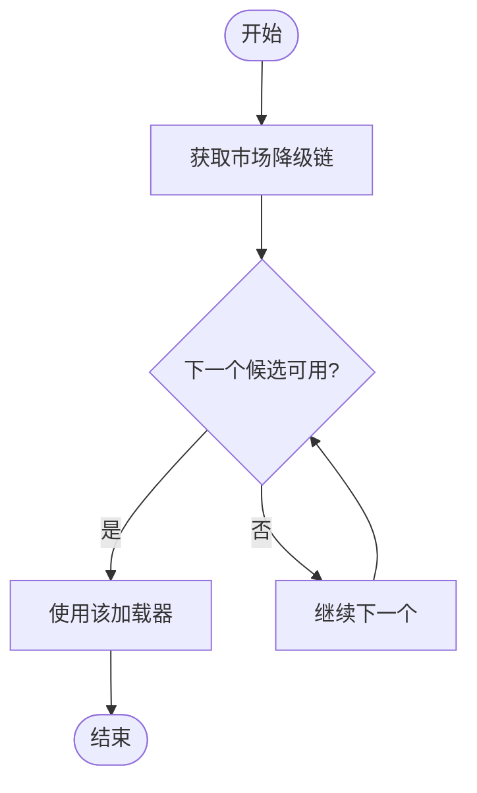
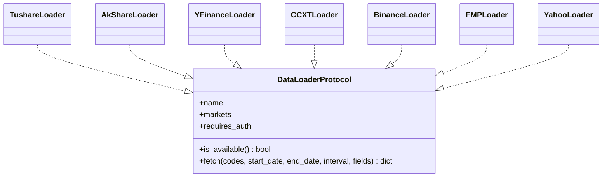

# 数据源配置

<cite>
**本文引用的文件**
- [agent/backtest/loaders/base.py](file://agent/backtest/loaders/base.py)
- [agent/backtest/loaders/registry.py](file://agent/backtest/loaders/registry.py)
- [agent/src/config/env_schema.py](file://agent/src/config/env_schema.py)
- [agent/backtest/loaders/tushare.py](file://agent/backtest/loaders/tushare.py)
- [agent/backtest/loaders/akshare_loader.py](file://agent/backtest/loaders/akshare_loader.py)
- [agent/backtest/loaders/yfinance_loader.py](file://agent/backtest/loaders/yfinance_loader.py)
- [agent/backtest/loaders/ccxt_loader.py](file://agent/backtest/loaders/ccxt_loader.py)
- [agent/backtest/loaders/binance_loader.py](file://agent/backtest/loaders/binance_loader.py)
- [agent/backtest/loaders/fmp_loader.py](file://agent/backtest/loaders/fmp_loader.py)
- [agent/backtest/loaders/yahoo_loader.py](file://agent/backtest/loaders/yahoo_loader.py)
</cite>

## 目录
1. [简介](#简介)
2. [项目结构](#项目结构)
3. [核心组件](#核心组件)
4. [架构总览](#架构总览)
5. [详细组件分析](#详细组件分析)
6. [依赖关系分析](#依赖关系分析)
7. [性能与可用性优化](#性能与可用性优化)
8. [故障排查指南](#故障排查指南)
9. [结论](#结论)

## 简介
本指南面向需要在回测与研究中接入多市场、多数据源的工程师，系统说明本项目支持的金融数据源（A股、美股、加密货币等）、认证配置方法、数据加载器选项（时间范围、周期、字段、缓存）、多数据源切换与故障转移机制，以及可用性检查与性能优化建议（连接复用、请求限流、错误重试）。

## 项目结构
- 数据源抽象与通用能力：统一的数据加载协议、日期校验、OHLC 校验、本地缓存、预算与重试工具。
- 数据源注册与自动选择：按市场维护“首选—备选”的降级链，自动选择可用数据源。
- 环境配置集中管理：所有 API Key、超时、预算、缓存开关等通过环境变量集中声明与校验。
- 具体数据源实现：A股（Tushare、AkShare）、美股（Yahoo Finance、FMP）、加密货币（CCXT、Binance）等。

图表来源
- [agent/backtest/loaders/base.py:122-236](file://agent/backtest/loaders/base.py#L122-L236)
- [agent/backtest/loaders/registry.py:130-158](file://agent/backtest/loaders/registry.py#L130-L158)
- [agent/src/config/env_schema.py:166-214](file://agent/src/config/env_schema.py#L166-L214)

章节来源
- [agent/backtest/loaders/base.py:122-236](file://agent/backtest/loaders/base.py#L122-L236)
- [agent/backtest/loaders/registry.py:130-158](file://agent/backtest/loaders/registry.py#L130-L158)
- [agent/src/config/env_schema.py:166-214](file://agent/src/config/env_schema.py#L166-L214)

## 核心组件
- DataLoaderProtocol：统一接口 name/markets/requires_auth/is_available/fetch(...)，所有数据源必须实现。
- 缓存与重试：基于内容寻址的本地 Parquet 缓存；带截止时间与指数退避的重试工具。
- 注册表与降级链：按市场维护有序候选列表，优先尝试更稳定或更轻量的源，失败时自动降级。
- 环境配置：集中定义各数据源的密钥、超时、预算、缓存开关等。

章节来源
- [agent/backtest/loaders/base.py:851-887](file://agent/backtest/loaders/base.py#L851-L887)
- [agent/backtest/loaders/base.py:377-450](file://agent/backtest/loaders/base.py#L377-L450)
- [agent/backtest/loaders/registry.py:130-196](file://agent/backtest/loaders/registry.py#L130-L196)
- [agent/src/config/env_schema.py:166-214](file://agent/src/config/env_schema.py#L166-L214)

## 架构总览
下图展示从调用方到数据源的完整流程：解析市场→选择降级链→逐个尝试 is_available()→fetch()→标准化 OHLCV→可选写入本地缓存。

图表来源
- [agent/backtest/loaders/registry.py:614-649](file://agent/backtest/loaders/registry.py#L614-L649)
- [agent/backtest/loaders/base.py:565-661](file://agent/backtest/loaders/base.py#L565-L661)

## 详细组件分析

### A股数据源
- Tushare（需认证）
  - 认证：设置 TUSHARE_TOKEN。
  - 支持：A股日频与分钟级（1m/5m/15m/30m/1H），ETF/指数/期货/基金部分路径。
  - 特性：内置配额限制识别与退避重试；可合并基本面字段（daily_basic）。
  - 参考：[tushare.py:116-141](file://agent/backtest/loaders/tushare.py#L116-L141)、[tushare.py:148-211](file://agent/backtest/loaders/tushare.py#L148-L211)、[tushare.py:207-268](file://agent/backtest/loaders/tushare.py#L207-L268)、[tushare.py:361-414](file://agent/backtest/loaders/tushare.py#L361-L414)、[tushare.py:416-476](file://agent/backtest/loaders/tushare.py#L416-L476)
- AkShare（免费，无需认证）
  - 支持：A股、美股、港股、期货、外汇、宏观等，当前主要支持日频。
  - 特性：统一归一化列名，缺失成交量补零；ETF/外汇特殊处理。
  - 参考：[akshare_loader.py:286-308](file://agent/backtest/loaders/akshare_loader.py#L286-L308)、[akshare_loader.py:98-161](file://agent/backtest/loaders/akshare_loader.py#L98-L161)、[akshare_loader.py:387-472](file://agent/backtest/loaders/akshare_loader.py#L387-L472)、[akshare_loader.py:250-297](file://agent/backtest/loaders/akshare_loader.py#L250-L297)

章节来源
- [agent/backtest/loaders/tushare.py:116-386](file://agent/backtest/loaders/tushare.py#L116-L386)
- [agent/backtest/loaders/akshare_loader.py:74-297](file://agent/backtest/loaders/akshare_loader.py#L74-L297)

### 美股数据源
- Yahoo Finance（yfinance 与直接 HTTP）
  - yfinance 加载器：支持美股、港股、印度、韩国、加拿大及加密；支持多种周期映射与 4H 重采样。
  - 直接 HTTP 加载器：绕过第三方库，使用共享节流与会话，覆盖 US/HK/IND/KOR/CAN 等。
  - 参考：[yfinance_loader.py:229-346](file://agent/backtest/loaders/yfinance_loader.py#L229-L346)、[yahoo_loader.py:173-275](file://agent/backtest/loaders/yahoo_loader.py#L173-L275)
- Financial Modeling Prep（FMP，需认证）
  - 认证：设置 FMP_API_KEY。
  - 支持：美股日频；进程内最小间隔节流；单标的失败不中断批量。
  - 参考：[fmp_loader.py:75-179](file://agent/backtest/loaders/fmp_loader.py#L75-L179)、[fmp_loader.py:182-222](file://agent/backtest/loaders/fmp_loader.py#L182-L222)

章节来源
- [agent/backtest/loaders/yfinance_loader.py:229-346](file://agent/backtest/loaders/yfinance_loader.py#L229-L346)
- [agent/backtest/loaders/yahoo_loader.py:173-275](file://agent/backtest/loaders/yahoo_loader.py#L173-L275)
- [agent/backtest/loaders/fmp_loader.py:75-222](file://agent/backtest/loaders/fmp_loader.py#L75-L222)

### 加密货币数据源
- CCXT（统一多交易所）
  - 默认交易所由 CCXT_EXCHANGE 控制（默认 binance）。
  - 支持现货与永续合约（BASE-USDT-PERP），含资金费率与标记价格对齐；分页抓取并带预算与重试。
  - 代理与超时：读取 ALL_PROXY/HTTP_PROXY/HTTPS_PROXY；CCXT_TIMEOUT_MS 控制单次超时。
  - 参考：[ccxt_loader.py:184-308](file://agent/backtest/loaders/ccxt_loader.py#L184-L308)、[ccxt_loader.py:310-424](file://agent/backtest/loaders/ccxt_loader.py#L310-L424)、[ccxt_loader.py:426-502](file://agent/backtest/loaders/ccxt_loader.py#L426-L502)
- Binance（专用别名）
  - 固定走 Binance/Binance USD-M，忽略 CCXT_EXCHANGE；公共行情无需密钥。
  - 参考：[binance_loader.py:23-45](file://agent/backtest/loaders/binance_loader.py#L23-L45)

章节来源
- [agent/backtest/loaders/ccxt_loader.py:184-502](file://agent/backtest/loaders/ccxt_loader.py#L184-L502)
- [agent/backtest/loaders/binance_loader.py:23-45](file://agent/backtest/loaders/binance_loader.py#L23-L45)

### 数据加载器配置选项
- 数据范围：start_date/end_date（YYYY-MM-DD），内部会校验起止顺序与格式。
- 时间周期：interval（如 1D/1H/4H/1W/1M/1m/5m/15m/30m），不同加载器支持度不同。
- 字段选择：fields（部分加载器支持扩展基本面字段，如 Tushare daily_basic）。
- 缓存策略：启用 VIBE_TRADING_DATA_CACHE=1，数据以内容寻址方式落盘为 Parquet；仅对已结算区间生效。
- 参考：
  - 日期与 OHLC 校验：[base.py:168-256](file://agent/backtest/loaders/base.py#L168-L256)
  - 缓存开关与根路径：[base.py:243-283](file://agent/backtest/loaders/base.py#L243-L283)
  - 缓存键生成与读写：[base.py:506-661](file://agent/backtest/loaders/base.py#L506-L661)
  - 字段合并示例：[tushare.py:361-414](file://agent/backtest/loaders/tushare.py#L361-L414)

章节来源
- [agent/backtest/loaders/base.py:168-256](file://agent/backtest/loaders/base.py#L168-L256)
- [agent/backtest/loaders/base.py:243-441](file://agent/backtest/loaders/base.py#L243-L441)
- [agent/backtest/loaders/tushare.py:361-414](file://agent/backtest/loaders/tushare.py#L361-L414)

### 多数据源切换与故障转移
- 市场级降级链：每个市场维护一个有序候选列表，按 IP 封禁风险与数据质量排序。
- 自动选择：resolve_loader(市场) 遍历候选，调用 is_available() 选择首个可用加载器。
- 显式源不可用时的行为：local/qveris/tickerall 等不会静默降级到网络源，避免掩盖配置问题。
- 参考：
  - 降级链定义：[registry.py:130-158](file://agent/backtest/loaders/registry.py#L130-L158)
  - 自动选择逻辑：[registry.py:614-649](file://agent/backtest/loaders/registry.py#L614-L649)
  - 禁止静默降级的集合：[registry.py:119-127](file://agent/backtest/loaders/registry.py#L119-L127)

图表来源
- [agent/backtest/loaders/registry.py:130-196](file://agent/backtest/loaders/registry.py#L130-L196)

章节来源
- [agent/backtest/loaders/registry.py:119-196](file://agent/backtest/loaders/registry.py#L119-L196)

## 依赖关系分析
- 配置依赖：所有数据源通过 EnvConfig 读取密钥与参数，保证单一事实来源。
- 框架依赖：所有加载器实现 DataLoaderProtocol，并使用 base 提供的缓存与重试工具。
- 市场路由：registry 将市场与加载器解耦，便于扩展新源与调整优先级。

图表来源
- [agent/backtest/loaders/base.py:851-887](file://agent/backtest/loaders/base.py#L851-L887)
- [agent/backtest/loaders/tushare.py:116-141](file://agent/backtest/loaders/tushare.py#L116-L141)
- [agent/backtest/loaders/akshare_loader.py:286-308](file://agent/backtest/loaders/akshare_loader.py#L286-L308)
- [agent/backtest/loaders/yfinance_loader.py:229-246](file://agent/backtest/loaders/yfinance_loader.py#L229-L246)
- [agent/backtest/loaders/ccxt_loader.py:184-198](file://agent/backtest/loaders/ccxt_loader.py#L184-L198)
- [agent/backtest/loaders/binance_loader.py:23-29](file://agent/backtest/loaders/binance_loader.py#L23-L29)
- [agent/backtest/loaders/fmp_loader.py:77-90](file://agent/backtest/loaders/fmp_loader.py#L77-L90)
- [agent/backtest/loaders/yahoo_loader.py:173-189](file://agent/backtest/loaders/yahoo_loader.py#L173-L189)

章节来源
- [agent/backtest/loaders/base.py:851-887](file://agent/backtest/loaders/base.py#L851-L887)

## 性能与可用性优化
- 连接池与会话复用
  - FMP：进程内共享最小间隔与会话，降低重复开销。
  - Yahoo：共享节流与 HTTP 会话，避免被限速。
  - CCXT：可配置 enableRateLimit 与 timeout，支持代理。
- 请求频率限制
  - Tushare：识别配额拒绝关键词并退避重试。
  - FMP：可通过环境变量调整最小间隔。
  - Yahoo：统一节流客户端。
- 错误重试策略
  - 通用：retry_with_budget 提供截止时间+指数退避，仅对声明的瞬时异常重试。
  - CCXT：对 NetworkError 重试，分页抓取带预算上限。
  - Tushare：针对每分钟配额限制的专门退避。
- 本地缓存
  - 启用 VIBE_TRADING_DATA_CACHE=1，数据按 source/symbol/timeframe/date/fields 生成内容地址键，落盘 Parquet。
  - 仅对已结算区间缓存，避免缓存进行中的 K 线。
- 代理与超时
  - CCXT：读取 ALL_PROXY/HTTP_PROXY/HTTPS_PROXY；CCXT_TIMEOUT_MS 控制单次超时；CCXT_FETCH_BUDGET_S 控制整体预算。
- 参考：
  - 重试与预算：[base.py:377-450](file://agent/backtest/loaders/base.py#L377-L450)
  - Tushare 配额退避：[tushare.py:18-79](file://agent/backtest/loaders/tushare.py#L18-L79)
  - FMP 节流：[fmp_loader.py:37-55](file://agent/backtest/loaders/fmp_loader.py#L37-L55)
  - Yahoo 节流：[yahoo_loader.py:1-13](file://agent/backtest/loaders/yahoo_loader.py#L1-L13)
  - CCXT 代理/超时/预算：[ccxt_loader.py:50-92](file://agent/backtest/loaders/ccxt_loader.py#L50-L92)、[ccxt_loader.py:203-224](file://agent/backtest/loaders/ccxt_loader.py#L203-L224)
  - 缓存开关与路径：[base.py:243-283](file://agent/backtest/loaders/base.py#L243-L283)

章节来源
- [agent/backtest/loaders/base.py:377-450](file://agent/backtest/loaders/base.py#L377-L450)
- [agent/backtest/loaders/tushare.py:18-79](file://agent/backtest/loaders/tushare.py#L18-L79)
- [agent/backtest/loaders/fmp_loader.py:37-55](file://agent/backtest/loaders/fmp_loader.py#L37-L55)
- [agent/backtest/loaders/yahoo_loader.py:1-13](file://agent/backtest/loaders/yahoo_loader.py#L1-L13)
- [agent/backtest/loaders/ccxt_loader.py:50-92](file://agent/backtest/loaders/ccxt_loader.py#L50-L92)
- [agent/backtest/loaders/ccxt_loader.py:203-224](file://agent/backtest/loaders/ccxt_loader.py#L203-L224)
- [agent/backtest/loaders/base.py:243-283](file://agent/backtest/loaders/base.py#L243-L283)

## 故障排查指南
- 无可用数据源
  - 现象：抛出 NoAvailableSourceError。
  - 原因：该市场所有候选均不可用（缺密钥、网络异常、依赖未安装）。
  - 处理：检查对应密钥与环境变量；确认依赖是否安装；查看降级链顺序。
  - 参考：[registry.py:614-649](file://agent/backtest/loaders/registry.py#L614-L649)
- Tushare 配额限制
  - 现象：出现“每分钟/每天/抽取/访问该接口/频率”等提示。
  - 处理：等待退避后重试；降低请求频率；必要时更换数据源。
  - 参考：[tushare.py:18-79](file://agent/backtest/loaders/tushare.py#L18-L79)
- CCXT 超时/网络错误
  - 现象：NetworkError、超时或分页不完整。
  - 处理：增大 CCXT_TIMEOUT_MS；调整 CCXT_FETCH_BUDGET_S；检查代理；必要时切换到 Binance 专用加载器。
  - 参考：[ccxt_loader.py:50-92](file://agent/backtest/loaders/ccxt_loader.py#L50-L92)、[ccxt_loader.py:426-502](file://agent/backtest/loaders/ccxt_loader.py#L426-L502)
- FMP 缺少 API Key
  - 现象：跳过请求并记录警告。
  - 处理：设置 FMP_API_KEY。
  - 参考：[fmp_loader.py:88-90](file://agent/backtest/loaders/fmp_loader.py#L88-L90)
- 缓存未命中或损坏
  - 现象：仍会回源拉取；损坏条目会被忽略。
  - 处理：检查 VIBE_TRADING_DATA_CACHE 与根路径；确保 end_date 已结算；清理过期缓存。
  - 参考：[base.py:550-661](file://agent/backtest/loaders/base.py#L550-L661)

章节来源
- [agent/backtest/loaders/registry.py:614-649](file://agent/backtest/loaders/registry.py#L614-L649)
- [agent/backtest/loaders/tushare.py:18-79](file://agent/backtest/loaders/tushare.py#L18-L79)
- [agent/backtest/loaders/ccxt_loader.py:50-92](file://agent/backtest/loaders/ccxt_loader.py#L50-L92)
- [agent/backtest/loaders/ccxt_loader.py:426-502](file://agent/backtest/loaders/ccxt_loader.py#L426-L502)
- [agent/backtest/loaders/fmp_loader.py:88-90](file://agent/backtest/loaders/fmp_loader.py#L88-L90)
- [agent/backtest/loaders/base.py:550-661](file://agent/backtest/loaders/base.py#L550-L661)

## 结论
本项目通过统一的加载器协议、集中的环境配置、健壮的重试与缓存机制，以及按市场设计的降级链，实现了跨市场、多数据源的灵活接入与高可用保障。推荐在生产环境中：
- 明确设置各数据源密钥与代理；
- 合理配置超时与预算，避免长时间挂起；
- 开启本地缓存以提升重复查询性能；
- 根据市场与网络情况调整降级链优先级；
- 监控日志中的配额限制与网络错误，及时调优。