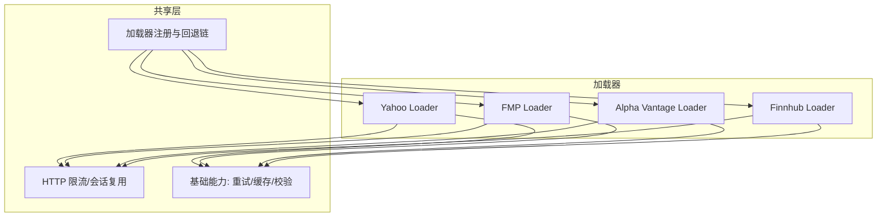
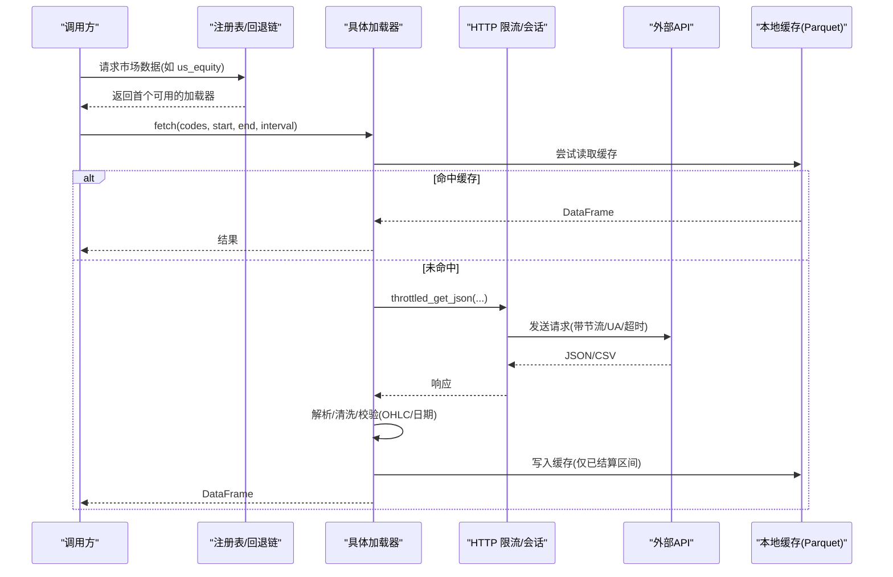
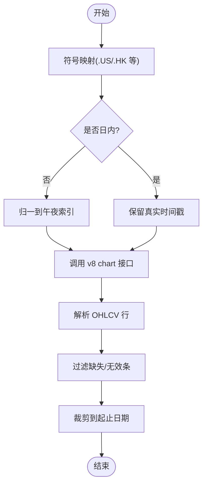
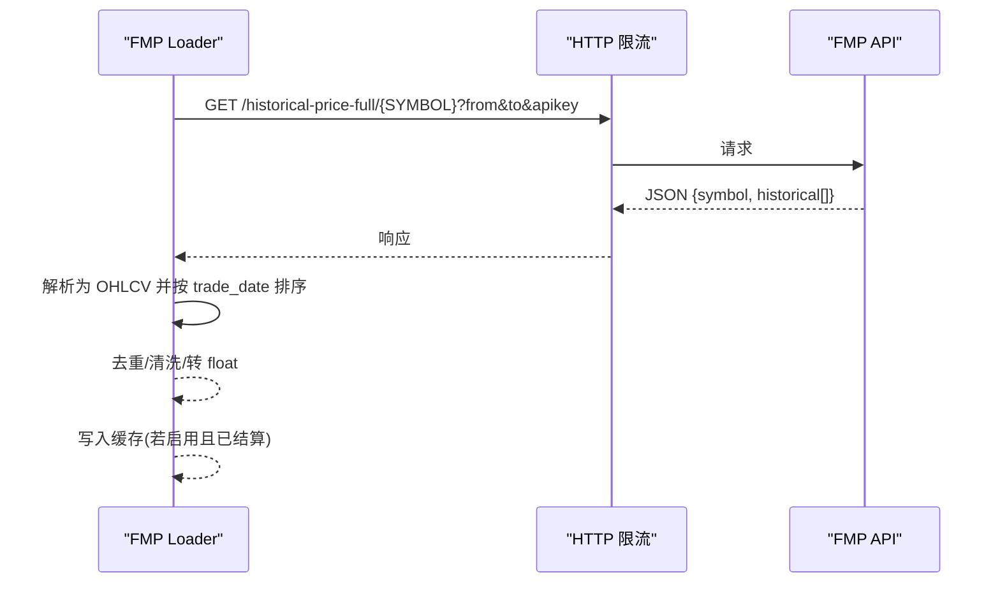
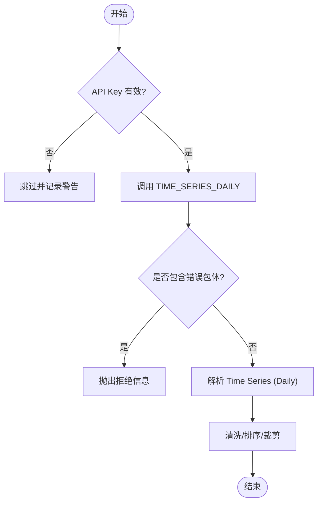
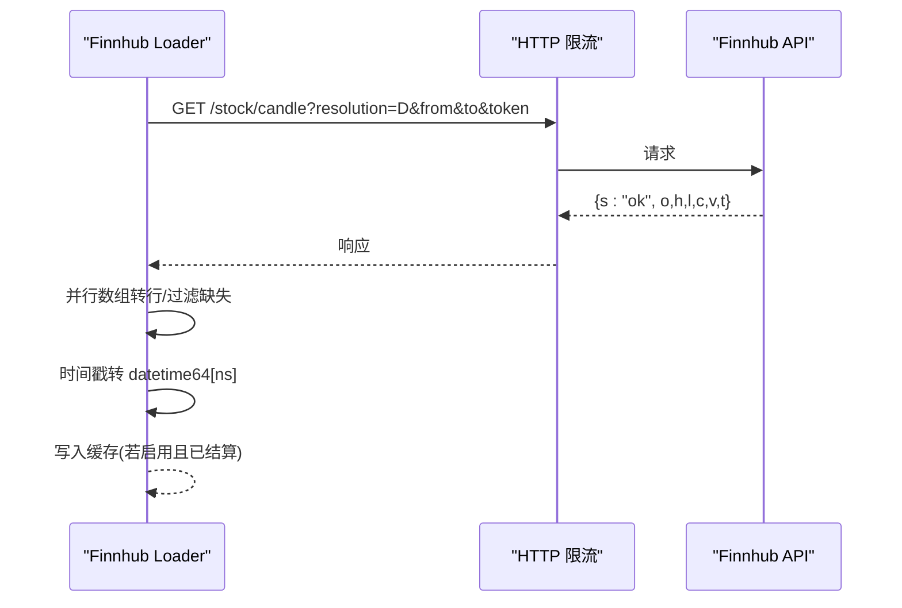
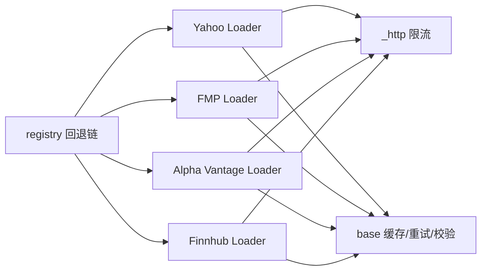

# 美股市场数据源

<cite>
**本文引用的文件**
- [agent/backtest/loaders/yahoo_loader.py](file://agent/backtest/loaders/yahoo_loader.py)
- [agent/backtest/loaders/yahoo_client.py](file://agent/backtest/loaders/yahoo_client.py)
- [agent/backtest/loaders/fmp_loader.py](file://agent/backtest/loaders/fmp_loader.py)
- [agent/backtest/loaders/alphavantage_loader.py](file://agent/backtest/loaders/alphavantage_loader.py)
- [agent/backtest/loaders/finnhub_loader.py](file://agent/backtest/loaders/finnhub_loader.py)
- [agent/backtest/loaders/_http.py](file://agent/backtest/loaders/_http.py)
- [agent/backtest/loaders/base.py](file://agent/backtest/loaders/base.py)
- [agent/backtest/loaders/registry.py](file://agent/backtest/loaders/registry.py)
- [agent/src/config/env_schema.py](file://agent/src/config/env_schema.py)
</cite>

## 目录
1. [简介](#简介)
2. [项目结构](#项目结构)
3. [核心组件](#核心组件)
4. [架构总览](#架构总览)
5. [详细组件分析](#详细组件分析)
6. [依赖关系分析](#依赖关系分析)
7. [性能与优化建议](#性能与优化建议)
8. [故障排查指南](#故障排查指南)
9. [结论](#结论)
10. [附录：配置速查与环境变量](#附录：配置速查与环境变量)

## 简介
本指南面向需要接入美股市场数据的用户，聚焦以下数据源的配置与使用：Yahoo Finance、Financial Modeling Prep（FMP）、Alpha Vantage、Finnhub。内容涵盖：
- 认证配置：API 密钥申请要点、账户等级与访问频率限制
- 美股数据特性：盘前盘后交易、股票分割、分红调整、ADR 转换等
- 数据加载器高级配置：多交易所支持、期权数据获取、基本面数据分析
- 性能优化：批量请求、缓存策略、错误处理机制

## 项目结构
本项目将各数据源以“加载器”模块组织在 backtest/loaders 下，并通过统一的注册表与 HTTP 限流层进行调度。关键路径如下：
- Yahoo：yahoo_loader + yahoo_client
- FMP：fmp_loader
- Alpha Vantage：alphavantage_loader
- Finnhub：finnhub_loader
- 公共能力：_http（限流/会话复用）、base（重试/缓存/校验）、registry（回退链）

图表来源
- [agent/backtest/loaders/yahoo_loader.py:173-275](file://agent/backtest/loaders/yahoo_loader.py#L173-L275)
- [agent/backtest/loaders/fmp_loader.py:75-179](file://agent/backtest/loaders/fmp_loader.py#L75-L179)
- [agent/backtest/loaders/alphavantage_loader.py:97-233](file://agent/backtest/loaders/alphavantage_loader.py#L97-L233)
- [agent/backtest/loaders/finnhub_loader.py:144-279](file://agent/backtest/loaders/finnhub_loader.py#L144-L279)
- [agent/backtest/loaders/_http.py:46-201](file://agent/backtest/loaders/_http.py#L46-L201)
- [agent/backtest/loaders/base.py:122-441](file://agent/backtest/loaders/base.py#L122-L441)
- [agent/backtest/loaders/registry.py:139-158](file://agent/backtest/loaders/registry.py#L139-L158)

章节来源
- [agent/backtest/loaders/registry.py:139-158](file://agent/backtest/loaders/registry.py#L139-L158)

## 核心组件
- Yahoo Finance 加载器：免费、无需鉴权，直接调用公开 v8 chart 接口；支持美股、港股、加股等；内置时间粒度映射与日内/日级索引对齐逻辑。
- FMP 加载器：需 API Key，提供美股日线 OHLCV；通过统一 HTTP 层限流与缓存。
- Alpha Vantage 加载器：需 API Key，提供美股日线；对配额/错误包体做识别与提示。
- Finnhub 加载器：需 API Key，提供美股日线蜡烛图；按秒级时间戳解析并归一化。
- 共享 HTTP 层：进程内 Host 级节流、随机抖动、Session 复用，避免被免费源封禁。
- 基础能力：日期校验、OHLC 结构校验、本地 Parquet 缓存、预算/重试工具。
- 注册表与回退链：按市场类型自动选择可用加载器，优先轻量/无鉴权源，再降级到 key-gated REST。

章节来源
- [agent/backtest/loaders/yahoo_loader.py:173-275](file://agent/backtest/loaders/yahoo_loader.py#L173-L275)
- [agent/backtest/loaders/fmp_loader.py:75-179](file://agent/backtest/loaders/fmp_loader.py#L75-L179)
- [agent/backtest/loaders/alphavantage_loader.py:97-233](file://agent/backtest/loaders/alphavantage_loader.py#L97-L233)
- [agent/backtest/loaders/finnhub_loader.py:144-279](file://agent/backtest/loaders/finnhub_loader.py#L144-L279)
- [agent/backtest/loaders/_http.py:46-201](file://agent/backtest/loaders/_http.py#L46-L201)
- [agent/backtest/loaders/base.py:122-441](file://agent/backtest/loaders/base.py#L122-L441)
- [agent/backtest/loaders/registry.py:139-158](file://agent/backtest/loaders/registry.py#L139-L158)

## 架构总览
下图展示从上层调用到具体数据源的请求流程，包括限流、缓存、重试与回退。

图表来源
- [agent/backtest/loaders/base.py:243-441](file://agent/backtest/loaders/base.py#L243-L441)
- [agent/backtest/loaders/_http.py:127-201](file://agent/backtest/loaders/_http.py#L127-L201)
- [agent/backtest/loaders/registry.py:614-649](file://agent/backtest/loaders/registry.py#L614-L649)

## 详细组件分析

### Yahoo Finance（免费直连）
- 认证：无需 API Key，直接使用公开 v8 chart 接口。
- 支持市场：美股、港股、印度、韩国、加拿大等；通过后缀识别（.US/.HK/.NS/.KS/.TO/.V 等）。
- 时间粒度：支持 1D/1H/4H(近似)/1W/1M；分钟/小时为日内，日及以上会归一到午夜索引。
- 符号映射：自动去除 .US 后缀；港股前导零规范化；其他后缀原样传递。
- 选项与搜索：客户端封装了 quoteSummary、options、search、news 等能力，内部维护 cookie+crumb 握手与过期刷新。
- 限流：通过共享 host_key 的节流器控制请求间隔，默认约 0.6s，可环境变量覆盖。

图表来源
- [agent/backtest/loaders/yahoo_loader.py:31-106](file://agent/backtest/loaders/yahoo_loader.py#L31-L106)
- [agent/backtest/loaders/yahoo_loader.py:139-184](file://agent/backtest/loaders/yahoo_loader.py#L139-L184)
- [agent/backtest/loaders/yahoo_client.py:71-93](file://agent/backtest/loaders/yahoo_client.py#L71-L93)
- [agent/backtest/loaders/yahoo_client.py:156-205](file://agent/backtest/loaders/yahoo_client.py#L156-L205)

章节来源
- [agent/backtest/loaders/yahoo_loader.py:173-275](file://agent/backtest/loaders/yahoo_loader.py#L173-L275)
- [agent/backtest/loaders/yahoo_client.py:98-156](file://agent/backtest/loaders/yahoo_client.py#L98-L156)
- [agent/backtest/loaders/yahoo_client.py:302-419](file://agent/backtest/loaders/yahoo_client.py#L302-L419)

### Financial Modeling Prep（FMP）
- 认证：需要设置 FMP_API_KEY。
- 数据范围：美股日线 OHLCV。
- 限流：默认最小间隔约 0.3s，可通过环境变量覆盖。
- 行为：不支持非日线；单标的失败不影响批次；返回空数组时跳过。

图表来源
- [agent/backtest/loaders/fmp_loader.py:75-179](file://agent/backtest/loaders/fmp_loader.py#L75-L179)
- [agent/backtest/loaders/fmp_loader.py:182-222](file://agent/backtest/loaders/fmp_loader.py#L182-L222)

章节来源
- [agent/backtest/loaders/fmp_loader.py:75-179](file://agent/backtest/loaders/fmp_loader.py#L75-L179)

### Alpha Vantage
- 认证：需要设置 ALPHAVANTAGE_API_KEY；忽略占位值（如 demo）。
- 数据范围：美股日线 TIME_SERIES_DAILY。
- 限流：默认最小间隔约 1.0s，可通过环境变量覆盖。
- 错误处理：当返回 Note/Information/Error Message 包体时，作为拒绝信息抛出或记录。

图表来源
- [agent/backtest/loaders/alphavantage_loader.py:59-73](file://agent/backtest/loaders/alphavantage_loader.py#L59-L73)
- [agent/backtest/loaders/alphavantage_loader.py:76-94](file://agent/backtest/loaders/alphavantage_loader.py#L76-L94)
- [agent/backtest/loaders/alphavantage_loader.py:170-233](file://agent/backtest/loaders/alphavantage_loader.py#L170-L233)

章节来源
- [agent/backtest/loaders/alphavantage_loader.py:97-233](file://agent/backtest/loaders/alphavantage_loader.py#L97-L233)

### Finnhub
- 认证：需要设置 FINNHUB_API_KEY。
- 数据范围：美股日线 candle（o/h/l/c/v + t）。
- 限流：默认最小间隔约 0.4s，可通过环境变量覆盖。
- 行为：只接受日线；单标的失败不影响批次；空窗口返回空结果。

图表来源
- [agent/backtest/loaders/finnhub_loader.py:53-88](file://agent/backtest/loaders/finnhub_loader.py#L53-L88)
- [agent/backtest/loaders/finnhub_loader.py:91-141](file://agent/backtest/loaders/finnhub_loader.py#L91-L141)
- [agent/backtest/loaders/finnhub_loader.py:235-279](file://agent/backtest/loaders/finnhub_loader.py#L235-L279)

章节来源
- [agent/backtest/loaders/finnhub_loader.py:144-279](file://agent/backtest/loaders/finnhub_loader.py#L144-L279)

### 美股数据特性说明
- 盘前盘后交易：Yahoo 的 v8 chart 接口返回的是交易所撮合时段数据；对于日内数据，分钟/小时级别保留真实时间戳，日及以上归一到午夜索引，便于与其他加载器对齐。
- 股票分割与分红调整：Yahoo 公开端点通常返回复权后的价格序列（取决于其内部处理），如需原始未复权数据，请结合券商或专业数据源；本项目加载器输出标准化 OHLCV，不额外做复权/除权计算。
- ADR 转换：Yahoo 支持美国存托凭证（如 .US 后缀），加载器会自动去除 .US 后缀以适配上游服务；不同市场的 ADR 比率由上游决定，本层不做换算。
- 数据完整性：加载器会对缺失 OHLC 的行进行过滤，并对结构异常（如 high < low）进行校验与丢弃，确保下游回测稳定性。

章节来源
- [agent/backtest/loaders/yahoo_loader.py:90-119](file://agent/backtest/loaders/yahoo_loader.py#L90-L119)
- [agent/backtest/loaders/yahoo_loader.py:139-184](file://agent/backtest/loaders/yahoo_loader.py#L139-L184)
- [agent/backtest/loaders/base.py:187-256](file://agent/backtest/loaders/base.py#L187-L256)

### 高级配置：多交易所、期权、基本面
- 多交易所支持：Yahoo 加载器支持 US/HK/India/Korea/Canada 等后缀；注册表为 us_equity 市场定义了回退链，优先使用无鉴权源，再降级到 key-gated REST。
- 期权数据：Yahoo 客户端提供 options 查询能力（v7 finance/options），内部自动处理 cookie+crumb 握手与过期刷新；适用于期权链抓取。
- 基本面数据：Yahoo 客户端提供 quoteSummary 模块（price、summaryDetail 等），可用于获取公司概况与关键指标；同样受限于公开端点的可用性。

章节来源
- [agent/backtest/loaders/yahoo_loader.py:44-55](file://agent/backtest/loaders/yahoo_loader.py#L44-L55)
- [agent/backtest/loaders/yahoo_client.py:302-419](file://agent/backtest/loaders/yahoo_client.py#L302-L419)
- [agent/backtest/loaders/registry.py:139-158](file://agent/backtest/loaders/registry.py#L139-L158)

## 依赖关系分析
- 加载器均依赖 _http 进行节流与 Session 复用，降低被封禁风险。
- base 提供缓存、重试、预算与 OHLC 校验，保证鲁棒性。
- registry 根据市场类型选择加载器，并在不可用时回退到同市场其他可用源。

图表来源
- [agent/backtest/loaders/_http.py:46-201](file://agent/backtest/loaders/_http.py#L46-L201)
- [agent/backtest/loaders/base.py:122-441](file://agent/backtest/loaders/base.py#L122-L441)
- [agent/backtest/loaders/registry.py:139-196](file://agent/backtest/loaders/registry.py#L139-L196)

章节来源
- [agent/backtest/loaders/registry.py:139-196](file://agent/backtest/loaders/registry.py#L139-L196)

## 性能与优化建议
- 批量请求
  - 每个加载器内部对 codes 列表逐个拉取，单标的失败不会中断批次；适合批量拉取多只股票。
  - 通过 _http 的 host_key 节流与随机抖动，避免并发冲突与瞬时峰值触发限流。
- 缓存策略
  - 启用本地 Parquet 缓存（VIBE_TRADING_DATA_CACHE=true），仅缓存已结算区间的结果，避免对当日形成中的数据进行持久化。
  - 缓存键基于 source/symbol/timeframe/start/end/fields 的内容哈希，版本化以避免旧格式污染。
- 错误处理
  - 使用 base 的重试与预算工具，对瞬态错误进行有限次重试，并在预算耗尽时快速失败。
  - 对结构异常（high < low、非正价格等）进行校验与丢弃，保障下游稳定性。
- 调优参数
  - 各源的最小请求间隔可通过环境变量覆盖（如 VIBE_TRADING_YAHOO_MIN_INTERVAL、VIBE_TRADING_FINNHUB_MIN_INTERVAL 等），在批量任务中适当增大以降低限流风险。

章节来源
- [agent/backtest/loaders/base.py:122-441](file://agent/backtest/loaders/base.py#L122-L441)
- [agent/backtest/loaders/_http.py:127-201](file://agent/backtest/loaders/_http.py#L127-L201)

## 故障排查指南
- 无法连接或频繁 429/401
  - 检查对应 API Key 是否设置正确（FINNHUB_API_KEY、ALPHAVANTAGE_API_KEY、FMP_API_KEY）。
  - 适当增大 *_MIN_INTERVAL 环境变量，降低请求频率。
  - 确认网络代理/防火墙未拦截目标域名。
- 数据为空或仅有少量条
  - 检查起止日期是否合理（start <= end），以及标的是否存在于该源。
  - 对于 Alpha Vantage，留意返回的 Note/Information/Error Message 包体，可能表示配额用尽或请求被拒。
- 数据质量异常
  - 使用 OHLC 校验剔除结构异常条；必要时放宽非正价格策略（某些市场允许负价）。
- 缓存问题
  - 若怀疑缓存损坏，可清理 ~/.vibe-trading/cache/loaders 下的文件；缓存读写失败不会导致主流程失败。

章节来源
- [agent/backtest/loaders/base.py:187-256](file://agent/backtest/loaders/base.py#L187-L256)
- [agent/backtest/loaders/alphavantage_loader.py:76-94](file://agent/backtest/loaders/alphavantage_loader.py#L76-L94)
- [agent/backtest/loaders/base.py:243-441](file://agent/backtest/loaders/base.py#L243-L441)

## 结论
本项目为美股市场数据提供了多源、稳健、可扩展的接入方案：
- 首选无鉴权的 Yahoo 公开端点，辅以 key-gated 的 FMP/Alpha Vantage/Finnhub 作为回退。
- 通过统一的限流、缓存与校验机制，确保在高并发与不稳定网络环境下的稳定性。
- 针对美股特性（盘前盘后、分割、分红、ADR）进行了合理的时序对齐与数据清洗。
- 提供丰富的环境变量与回退链，便于在不同部署环境下灵活配置与优化。

## 附录：配置速查与环境变量
- 认证与环境变量
  - FINNHUB_API_KEY：Finnhub 鉴权
  - ALPHAVANTAGE_API_KEY：Alpha Vantage 鉴权（忽略占位值）
  - FMP_API_KEY：FMP 鉴权
  - VIBE_TRADING_DATA_CACHE：启用本地缓存（true/false）
  - VIBE_TRADING_DATA_CACHE_ROOT：自定义缓存根目录
  - VIBE_TRADING_*_MIN_INTERVAL：各源最小请求间隔（秒）
- 市场与回退
  - us_equity 回退链：yahoo → stooq → sina → eastmoney → yfinance → tiingo → fmp → finnhub → alphavantage → longbridge → akshare → local
- 高级功能
  - Yahoo 期权与基本面：通过 yahoo_client 的 options/quoteSummary 接口获取
  - 多交易所：Yahoo 加载器支持 .US/.HK/.NS/.KS/.TO/.V 等后缀

章节来源
- [agent/src/config/env_schema.py:166-214](file://agent/src/config/env_schema.py#L166-L214)
- [agent/backtest/loaders/registry.py:139-158](file://agent/backtest/loaders/registry.py#L139-L158)
- [agent/backtest/loaders/yahoo_client.py:302-419](file://agent/backtest/loaders/yahoo_client.py#L302-L419)