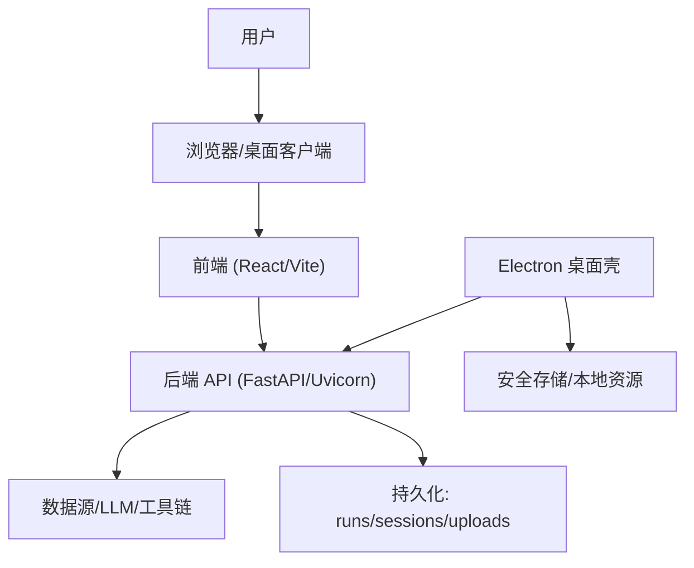
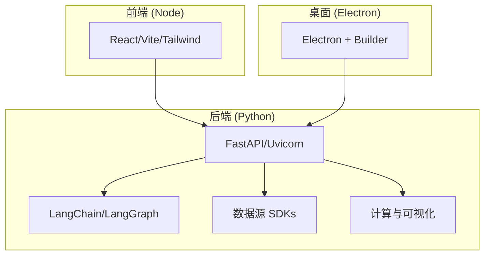
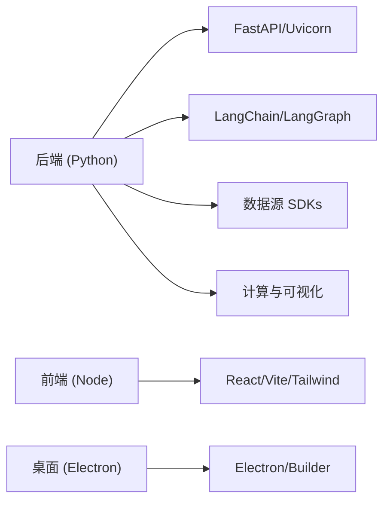

# 环境要求与依赖

<cite>
**本文引用的文件**
- [pyproject.toml](file://pyproject.toml)
- [agent/requirements.txt](file://agent/requirements.txt)
- [requirements-lock.txt](file://requirements-lock.txt)
- [requirements-channels-lock.txt](file://requirements-channels-lock.txt)
- [frontend/package.json](file://frontend/package.json)
- [desktop/electron/package.json](file://desktop/electron/package.json)
- [Dockerfile](file://Dockerfile)
- [docker-compose.yml](file://docker-compose.yml)
- [.devcontainer/devcontainer.json](file://.devcontainer/devcontainer.json)
</cite>

## 目录
1. [简介](#简介)
2. [项目结构](#项目结构)
3. [核心组件](#核心组件)
4. [架构总览](#架构总览)
5. [详细组件分析](#详细组件分析)
6. [依赖关系分析](#依赖关系分析)
7. [性能考虑](#性能考虑)
8. [故障排查指南](#故障排查指南)
9. [结论](#结论)
10. [附录](#附录)

## 简介
本指南面向首次部署或二次开发 Vibe-Trading 的工程师，聚焦“环境要求与依赖安装”。内容涵盖：
- 系统要求：Python、Node.js、包管理器版本
- 后端 Python 依赖（FastAPI、LangChain、数据源等）
- 前端 Node.js 依赖（React、Vite、Tailwind 等）
- 桌面应用 Electron 依赖
- 依赖验证方法与常见问题解决方案
- 虚拟环境配置建议与生产优化选项

## 项目结构
Vibe-Trading 由三大部分组成：
- 后端服务：基于 FastAPI + Uvicorn，提供 REST/SSE/MCP 接口，内置 Web 静态资源
- 前端界面：基于 React + Vite + Tailwind，支持多语言与图表渲染
- 桌面壳层：Electron 封装，负责本地进程管理、安全存储与打包

**图示来源**
- [Dockerfile:1-119](file://Dockerfile#L1-L119)
- [docker-compose.yml:1-90](file://docker-compose.yml#L1-L90)
- [frontend/package.json:1-58](file://frontend/package.json#L1-L58)
- [desktop/electron/package.json:1-86](file://desktop/electron/package.json#L1-L86)

**章节来源**
- [Dockerfile:1-119](file://Dockerfile#L1-L119)
- [docker-compose.yml:1-90](file://docker-compose.yml#L1-L90)

## 核心组件
- 后端 Python 运行时
  - 框架：FastAPI + Uvicorn + Pydantic + SSE
  - LLM 编排：LangChain/LangGraph/OpenAI 兼容适配器
  - 数据处理：Pandas/NumPy/Scipy/DuckDB
  - 数据源：Tushare/AkShare/YFinance/CCXT 等
  - 文档与报告：Jinja2/Matplotlib/WeasyPrint
  - 搜索与网络：httpx/aiohttp/requests/websockets/ddgs
- 前端 Node.js 运行时
  - 框架：React + TypeScript + Vite
  - UI：TailwindCSS + i18n + ECharts/KaTeX
  - 测试：Vitest + jsdom
- 桌面 Electron 运行时
  - 构建与打包：Electron + electron-builder
  - 脚本：TypeScript + Node 脚本
  - 目标平台：Windows NSIS 安装包（社区版）

**章节来源**
- [pyproject.toml:24-69](file://pyproject.toml#L24-L69)
- [agent/requirements.txt:1-69](file://agent/requirements.txt#L1-L69)
- [frontend/package.json:1-58](file://frontend/package.json#L1-L58)
- [desktop/electron/package.json:1-86](file://desktop/electron/package.json#L1-L86)

## 架构总览
下图展示各组件之间的依赖与运行边界：

**图示来源**
- [pyproject.toml:24-69](file://pyproject.toml#L24-L69)
- [frontend/package.json:17-55](file://frontend/package.json#L17-L55)
- [desktop/electron/package.json:24-29](file://desktop/electron/package.json#L24-L29)

## 详细组件分析

### 后端 Python 环境与依赖
- 系统要求
  - Python 3.11–3.13（项目声明 >=3.11, <3.14）
  - 推荐在隔离环境中安装（venv/conda），避免污染全局解释器
- 关键依赖与作用
  - FastAPI/Uvicorn：高性能异步 Web 框架与服务端点
  - LangChain/LangGraph/OpenAI：大模型调用与工作流编排
  - Pandas/NumPy/Scipy/DuckDB：金融数据计算与查询
  - Tushare/AkShare/YFinance/CCXT：多市场数据接入
  - Pydantic/HTTPX/WebSockets：请求校验与实时通信
  - Jinja2/Matplotlib/WeasyPrint：报告生成与 PDF 渲染
- 可选扩展
  - 渠道通道：Telegram/Discord/飞书/Slack 等（通过 channels extras）
  - 量化统计：statsmodels/arch（可选）
  - 特定数据源：A 股 BaoStock、KRX pykrx、MT5（仅 Windows）
- 锁定策略
  - 使用 requirements-lock.txt 进行哈希校验安装，保证可重复构建
  - Docker 镜像采用多阶段构建，仅在 builder 阶段安装编译依赖

**章节来源**
- [pyproject.toml:1-23](file://pyproject.toml#L1-L23)
- [pyproject.toml:24-69](file://pyproject.toml#L24-L69)
- [agent/requirements.txt:1-69](file://agent/requirements.txt#L1-L69)
- [requirements-lock.txt:1-200](file://requirements-lock.txt#L1-L200)
- [Dockerfile:14-54](file://Dockerfile#L14-L54)

### 前端 Node.js 环境与依赖
- 系统要求
  - Node.js >= 22.22.0（engines 字段约束）
  - 推荐使用 npm 或 yarn（仓库包含 package-lock.json）
- 关键依赖与作用
  - React/ReactDOM：UI 框架
  - Vite：构建与开发服务器
  - TailwindCSS：原子化样式
  - ECharts/KaTeX：图表与数学公式渲染
  - i18next/react-i18next：国际化
  - Vitest/jsdom：单元测试
- 构建与预览
  - 开发：npm run dev
  - 构建：npm run build
  - 预览：npm run preview

**章节来源**
- [frontend/package.json:1-58](file://frontend/package.json#L1-L58)

### 桌面 Electron 环境与依赖
- 系统要求
  - Node.js（与前端一致）
  - 构建产物为 Windows NSIS 安装包（社区版）
- 关键依赖与作用
  - Electron：跨平台桌面壳
  - electron-builder：打包与签名流程
  - TypeScript：类型检查与编译
- 脚本说明
  - prepare:electron：准备 Electron 运行时
  - pack:win：打包 Windows 目录分发
  - installer:win:review/sign：生成审查/签名安装包

**章节来源**
- [desktop/electron/package.json:1-86](file://desktop/electron/package.json#L1-L86)

### 容器化与开发环境
- Docker
  - 前端：node:22-slim 构建静态资源
  - 后端：python:3.11-slim 构建 venv 并复制进运行时镜像
  - 运行时：最小化镜像，仅含 weasyprint 所需系统库与字体
  - 端口：默认 8899（API+静态资源）
- docker-compose
  - 暴露 127.0.0.1:8899
  - 挂载数据卷：runs/sessions/uploads/.swarm/runs 与 ~/.vibe-trading
  - Ollama 默认指向 host.docker.internal:11434
- DevContainer
  - 基于 python:3.11-bookworm，启用 Node 特性
  - 自动安装后端与前端依赖，转发 8899/5899 端口

**章节来源**
- [Dockerfile:1-119](file://Dockerfile#L1-L119)
- [docker-compose.yml:1-90](file://docker-compose.yml#L1-L90)
- [.devcontainer/devcontainer.json:1-40](file://.devcontainer/devcontainer.json#L1-L40)

## 依赖关系分析
- 后端依赖分层
  - 基础层：Python 标准库 + httpx/requests/websockets
  - 框架层：FastAPI/Uvicorn/Pydantic/SSE
  - 智能体层：LangChain/LangGraph/OpenAI 兼容适配
  - 数据层：Pandas/NumPy/Scipy/DuckDB + 数据源 SDKs
  - 报告层：Jinja2/Matplotlib/WeasyPrint
- 前端依赖分层
  - 运行时：React/ReactDOM
  - 构建与样式：Vite/TailwindCSS
  - 功能：ECharts/KaTeX/i18n
  - 测试：Vitest/jsdom
- 桌面依赖分层
  - 运行时：Electron
  - 构建：electron-builder/TypeScript
- 锁定与可重复性
  - 后端使用 requirements-lock.txt（带哈希）
  - 渠道依赖使用 requirements-channels-lock.txt（带哈希）
  - 前端使用 package-lock.json

**图示来源**
- [pyproject.toml:24-69](file://pyproject.toml#L24-L69)
- [agent/requirements.txt:1-69](file://agent/requirements.txt#L1-L69)
- [frontend/package.json:17-55](file://frontend/package.json#L17-L55)
- [desktop/electron/package.json:24-29](file://desktop/electron/package.json#L24-L29)

**章节来源**
- [requirements-lock.txt:1-200](file://requirements-lock.txt#L1-L200)
- [requirements-channels-lock.txt:1-200](file://requirements-channels-lock.txt#L1-L200)

## 性能考虑
- 后端
  - 使用 Uvicorn 异步事件循环，适合高并发 SSE/WS
  - 大数据处理优先使用 Pandas/NumPy/Scipy 向量化
  - 报告生成按需启用 WeasyPrint（需系统库）
- 前端
  - 使用 Vite 快速热更新与增量构建
  - 图表按需加载，避免首屏过大
- 桌面
  - 使用 asar 压缩与只读文件系统提升启动与安全性
- 容器
  - 多阶段构建减小镜像体积
  - 限制 CPU/内存/PID，防止单任务占用过多资源

[本节为通用指导，不直接分析具体代码文件]

## 故障排查指南
- 版本冲突
  - 症状：pip 解析失败或导入错误
  - 解决：使用 requirements-lock.txt 安装；必要时重建 venv
  - 参考：后端锁定文件与 Docker 安装命令
- 网络问题
  - 症状：下载超时或代理错误
  - 解决：配置 pip/npm 代理；检查防火墙；使用国内镜像（如适用）
  - 参考：前端/后端依赖安装均可能受网络影响
- 权限不足
  - 症状：写入 ~/.vibe-trading 或 /app 目录失败
  - 解决：确保当前用户有写权限；容器内以非 root 用户运行
  - 参考：Dockerfile 创建 vibe/vibe-sandbox 用户与目录权限
- 缺少系统库
  - 症状：PDF 渲染失败或字体空白
  - 解决：安装 weasyprint 所需系统库与字体（见 Dockerfile）
  - 参考：Dockerfile 中 apt 安装列表
- 端口占用
  - 症状：启动失败或无法访问
  - 解决：修改端口映射或释放占用端口
  - 参考：docker-compose 暴露 8899/5899
- 环境变量
  - 症状：LLM 连接失败或认证错误
  - 解决：检查 .env 与 compose 环境变量；确认 OLLAMA_BASE_URL
  - 参考：docker-compose.yml 中的 env_file 与环境变量

**章节来源**
- [Dockerfile:73-86](file://Dockerfile#L73-L86)
- [docker-compose.yml:1-90](file://docker-compose.yml#L1-L90)
- [requirements-lock.txt:1-200](file://requirements-lock.txt#L1-L200)

## 结论
Vibe-Trading 的环境与依赖体系清晰分层：后端以 FastAPI/LangChain 为核心，前端以 React/Vite 构建，桌面端通过 Electron 封装。通过严格的锁定文件与容器化方案，确保可重复构建与稳定运行。按本指南完成环境准备后，即可顺利启动后端、前端与桌面应用，并根据需要启用可选扩展。

[本节为总结，不直接分析具体代码文件]

## 附录

### 快速安装清单
- 后端（Python）
  - 创建虚拟环境并激活
  - 使用 requirements-lock.txt 安装依赖（哈希校验）
  - 可选：安装渠道扩展或特定数据源
- 前端（Node）
  - 切换至 Node >= 22.22.0
  - 进入 frontend 目录执行 npm install
  - 开发：npm run dev；构建：npm run build
- 桌面（Electron）
  - 进入 desktop/electron 目录执行 npm install
  - 构建与打包：npm run build；Windows 打包：npm run pack:win

**章节来源**
- [pyproject.toml:24-69](file://pyproject.toml#L24-L69)
- [agent/requirements.txt:1-69](file://agent/requirements.txt#L1-L69)
- [requirements-lock.txt:1-200](file://requirements-lock.txt#L1-L200)
- [frontend/package.json:1-58](file://frontend/package.json#L1-L58)
- [desktop/electron/package.json:1-86](file://desktop/electron/package.json#L1-L86)

### 生产环境优化建议
- 使用容器镜像（已预构建 venv 与静态资源）
- 限制资源上限（CPU/内存/PID）
- 启用只读根文件系统与 tmpfs 临时目录
- 挂载持久化卷保存 runs/sessions/uploads 与 ~/.vibe-trading
- 配置健康检查与重启策略

**章节来源**
- [docker-compose.yml:40-66](file://docker-compose.yml#L40-L66)
- [Dockerfile:99-118](file://Dockerfile#L99-L118)