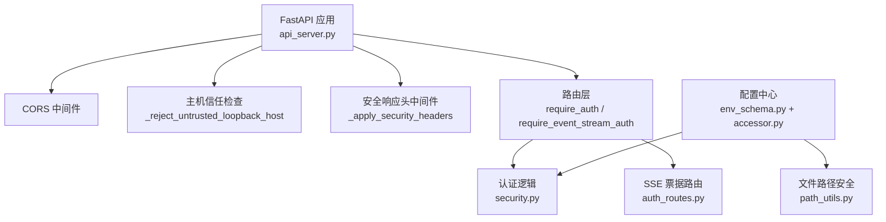
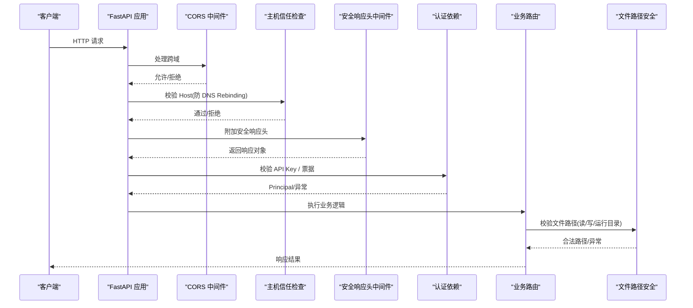
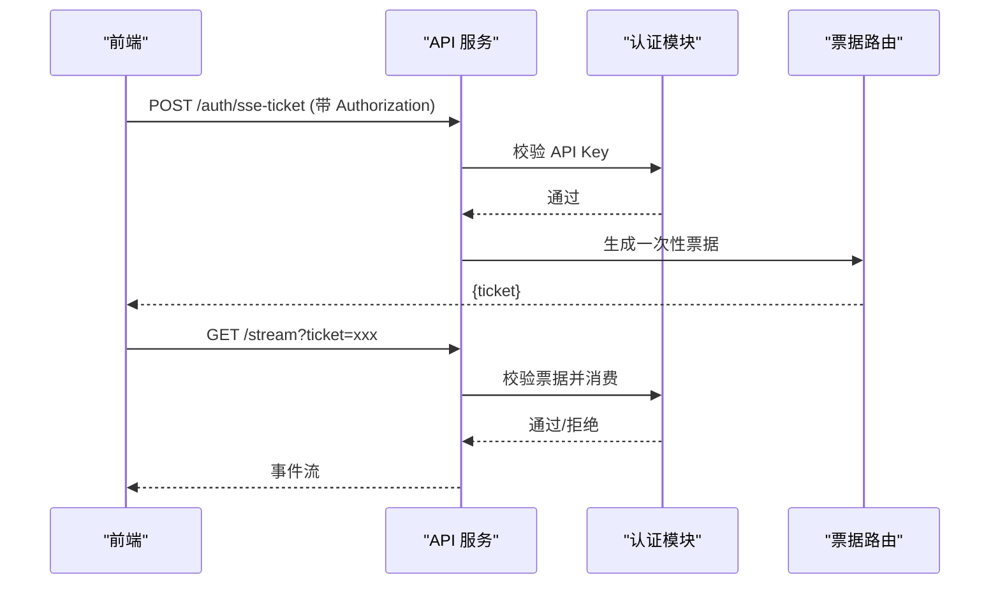
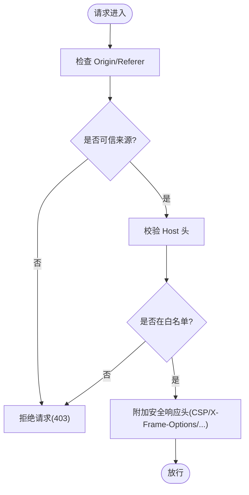
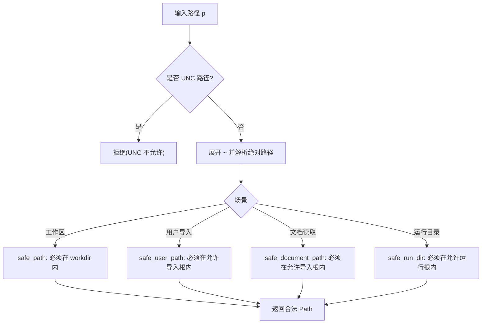
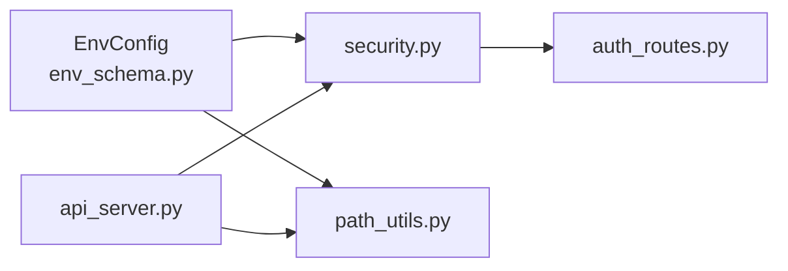

# 安全设置

<cite>
**本文引用的文件**
- [agent/api_server.py](file://agent/api_server.py)
- [agent/src/api/security.py](file://agent/src/api/security.py)
- [agent/src/api/auth_routes.py](file://agent/src/api/auth_routes.py)
- [agent/src/config/env_schema.py](file://agent/src/config/env_schema.py)
- [agent/src/config/accessor.py](file://agent/src/config/accessor.py)
- [agent/src/tools/path_utils.py](file://agent/src/tools/path_utils.py)
- [SECURITY.md](file://SECURITY.md)
</cite>

## 目录
1. [简介](#简介)
2. [项目结构](#项目结构)
3. [核心组件](#核心组件)
4. [架构总览](#架构总览)
5. [详细组件分析](#详细组件分析)
6. [依赖关系分析](#依赖关系分析)
7. [性能与安全权衡](#性能与安全权衡)
8. [故障排查指南](#故障排查指南)
9. [结论](#结论)
10. [附录：配置清单与最佳实践](#附录配置清单与最佳实践)

## 简介
本文件面向部署与运维人员，系统化说明 Vibe-Trading 的安全设置与配置要点，覆盖 API 认证（API 密钥、SSE 票据）、网络安全（CORS、Host 白名单、HTTPS 建议）、文件访问安全（允许路径、读写权限、沙箱机制），以及安全最佳实践（密钥轮换、敏感信息加密、审计日志）和常见漏洞防护（SQL 注入、XSS、CSRF）。内容基于代码库中的实际实现与配置项，确保可操作且可验证。

## 项目结构
安全相关能力主要分布在以下模块：
- API 服务器装配与中间件注册：api_server.py
- 认证、鉴权、CORS、主机校验、安全响应头、SSE 票据：src/api/security.py
- SSE 票据发放路由：src/api/auth_routes.py
- 环境变量与配置模型（含 API 安全开关、CORS、Host、文件根目录等）：src/config/env_schema.py
- 配置单例与布尔解析：src/config/accessor.py
- 文件路径安全与沙箱：src/tools/path_utils.py
- 安全策略与披露流程：SECURITY.md

图表来源
- [agent/api_server.py:166-185](file://agent/api_server.py#L166-L185)
- [agent/src/api/security.py:166-253](file://agent/src/api/security.py#L166-L253)
- [agent/src/api/auth_routes.py:21-55](file://agent/src/api/auth_routes.py#L21-L55)
- [agent/src/config/env_schema.py:326-375](file://agent/src/config/env_schema.py#L326-L375)
- [agent/src/tools/path_utils.py:46-74](file://agent/src/tools/path_utils.py#L46-L74)

章节来源
- [agent/api_server.py:166-185](file://agent/api_server.py#L166-L185)
- [agent/src/api/security.py:166-253](file://agent/src/api/security.py#L166-L253)
- [agent/src/api/auth_routes.py:21-55](file://agent/src/api/auth_routes.py#L21-L55)
- [agent/src/config/env_schema.py:326-375](file://agent/src/config/env_schema.py#L326-L375)
- [agent/src/tools/path_utils.py:46-74](file://agent/src/tools/path_utils.py#L46-L74)

## 核心组件
- API 认证与鉴权
  - 支持通过 Bearer Token 或查询参数（按端点策略）进行 API Key 校验；未配置 Key 时仅信任本地回环客户端。
  - 浏览器 EventSource 使用一次性短期票据（ticket）避免将长生命周期密钥放入 URL。
- 网络安全
  - CORS：默认允许本地开发站点，支持追加额外可信来源；禁止在启用凭据时使用通配符。
  - Host 白名单：限制本地回环请求的 Host 头，防止 DNS Rebinding。
  - 安全响应头：CSP、X-Frame-Options、X-Content-Type-Options、Permissions-Policy、Referrer-Policy。
- 文件访问安全
  - 三类路径校验：工作区沙箱 safe_path、用户导入 safe_user_path/safe_document_path、运行目录 safe_run_dir。
  - 通过环境变量限定允许的读/写/运行根目录，拒绝 UNC 路径与越界路径。
- 配置管理
  - 集中式 Pydantic 模型定义所有环境变量，提供类型校验、默认值与别名兼容。
  - 线程安全的懒加载单例，支持运行时重置以生效新配置。

章节来源
- [agent/src/api/security.py:347-504](file://agent/src/api/security.py#L347-L504)
- [agent/src/api/security.py:591-622](file://agent/src/api/security.py#L591-L622)
- [agent/src/api/security.py:69-158](file://agent/src/api/security.py#L69-L158)
- [agent/src/api/security.py:166-253](file://agent/src/api/security.py#L166-L253)
- [agent/src/tools/path_utils.py:46-74](file://agent/src/tools/path_utils.py#L46-L74)
- [agent/src/tools/path_utils.py:137-182](file://agent/src/tools/path_utils.py#L137-L182)
- [agent/src/tools/path_utils.py:283-369](file://agent/src/tools/path_utils.py#L283-L369)
- [agent/src/config/env_schema.py:326-375](file://agent/src/config/env_schema.py#L326-L375)
- [agent/src/config/accessor.py:52-93](file://agent/src/config/accessor.py#L52-L93)

## 架构总览
下图展示从请求进入 FastAPI 到认证、安全头、CORS、文件访问控制的完整链路。

图表来源
- [agent/api_server.py:176-185](file://agent/api_server.py#L176-L185)
- [agent/src/api/security.py:166-253](file://agent/src/api/security.py#L166-L253)
- [agent/src/api/security.py:463-504](file://agent/src/api/security.py#L463-L504)
- [agent/src/tools/path_utils.py:46-74](file://agent/src/tools/path_utils.py#L46-L74)

## 详细组件分析

### API 认证配置
- API 密钥管理
  - 通过环境变量 API_AUTH_KEY（或兼容别名 VIBE_TRADING_API_KEY）配置共享密钥；当配置后，所有非本地客户端必须携带有效密钥。
  - 支持从 Authorization 头部或受控查询参数读取凭证；对敏感写入接口强制头部方式。
  - 本地回环模式：未配置密钥时仅信任本地回环来源，远程访问将被拒绝。
- JWT 令牌设置
  - 当前实现未包含 JWT 签发/校验逻辑；如需集成，建议在网关或反向代理层完成，并在后端继续使用 API Key 或票据。
- OAuth 集成
  - 当前实现未内置 OAuth 服务端流程；可通过外部身份提供方在入口层完成授权，再将已认证的主体映射为内部 Principal。
- SSE 票据（EventSource 认证）
  - 浏览器无法发送 Authorization 头，前端先通过 POST /auth/sse-ticket 换取一次性 ticket，再用于建立流连接；票据有效期短且单次使用，避免密钥泄露。

图表来源
- [agent/src/api/auth_routes.py:46-55](file://agent/src/api/auth_routes.py#L46-L55)
- [agent/src/api/security.py:318-340](file://agent/src/api/security.py#L318-L340)
- [agent/src/api/security.py:591-622](file://agent/src/api/security.py#L591-L622)

章节来源
- [agent/src/api/security.py:347-504](file://agent/src/api/security.py#L347-L504)
- [agent/src/api/security.py:591-622](file://agent/src/api/security.py#L591-L622)
- [agent/src/api/auth_routes.py:21-55](file://agent/src/api/auth_routes.py#L21-L55)
- [agent/src/config/env_schema.py:326-335](file://agent/src/config/env_schema.py#L326-L335)
- [agent/src/config/accessor.py:52-93](file://agent/src/config/accessor.py#L52-L93)

### 网络安全配置
- CORS 设置
  - 默认允许本地开发站点；可通过 CORS_ORIGINS 替换默认列表，或通过 VIBE_TRADING_EXTRA_CORS_ORIGINS 追加额外可信来源；启用凭据时禁止通配符。
- Host 白名单
  - 本地回环 Host 白名单包含 localhost、127.0.0.1、::1、[::1]、testserver；可通过 API_ALLOWED_HOSTS 追加额外可信 Host；拒绝不信任的本地 Host 头以防 DNS Rebinding。
- HTTPS 配置
  - 应用层不强制 HSTS；建议在终止 TLS 的反向代理/网关层设置 Strict-Transport-Security，并确保只接受来自可信上游的请求。

图表来源
- [agent/src/api/security.py:69-158](file://agent/src/api/security.py#L69-L158)
- [agent/src/api/security.py:166-173](file://agent/src/api/security.py#L166-L173)
- [agent/src/api/security.py:235-253](file://agent/src/api/security.py#L235-L253)

章节来源
- [agent/src/api/security.py:69-158](file://agent/src/api/security.py#L69-L158)
- [agent/src/api/security.py:166-173](file://agent/src/api/security.py#L166-L173)
- [agent/src/api/security.py:235-253](file://agent/src/api/security.py#L235-L253)
- [agent/src/config/env_schema.py:335-348](file://agent/src/config/env_schema.py#L335-L348)

### 文件访问安全
- 允许的文件路径
  - 读路径：safe_user_path/safe_document_path 仅允许在配置的导入根目录下；默认包含 uploads、data、~/.vibe-trading 等目录，可通过 VIBE_TRADING_ALLOWED_FILE_ROOTS 扩展。
  - 写路径：allowed_write_roots 默认包含 uploads/runs 等目录，可通过 VIBE_TRADING_ALLOWED_WRITE_ROOTS 扩展。
  - 运行目录：safe_run_dir/safe_run_id 限制在 allowed run roots，可通过 VIBE_TRADING_ALLOWED_RUN_ROOTS 扩展。
- 读写权限控制
  - 所有路径均拒绝 UNC 路径；相对路径会在工作区或允许根下解析并校验 containment；绝对路径需落在允许范围内。
- 沙箱机制
  - safe_path 将 LLM 可控的路径限制在当前工作区内，防止逃逸；resolve_safe_path 在 run_dir 失败时回退到允许根目录校验。

图表来源
- [agent/src/tools/path_utils.py:46-74](file://agent/src/tools/path_utils.py#L46-L74)
- [agent/src/tools/path_utils.py:137-182](file://agent/src/tools/path_utils.py#L137-L182)
- [agent/src/tools/path_utils.py:283-369](file://agent/src/tools/path_utils.py#L283-L369)

章节来源
- [agent/src/tools/path_utils.py:46-74](file://agent/src/tools/path_utils.py#L46-L74)
- [agent/src/tools/path_utils.py:137-182](file://agent/src/tools/path_utils.py#L137-L182)
- [agent/src/tools/path_utils.py:283-369](file://agent/src/tools/path_utils.py#L283-L369)
- [agent/src/config/env_schema.py:363-371](file://agent/src/config/env_schema.py#L363-L371)

### 安全最佳实践
- 密钥轮换策略
  - 定期更换 API_AUTH_KEY；更新后重启服务或调用配置重置使新 Key 生效；对历史票据与缓存进行清理。
- 敏感信息加密
  - 配置文件写入采用原子替换与严格权限（如 .env 文件权限 0600），避免残留临时文件与明文泄露。
- 审计日志配置
  - 访问日志中自动脱敏 api_key/ticket 等敏感查询参数；建议结合反向代理与集中日志系统记录访问与错误。

章节来源
- [agent/src/api/security.py:260-297](file://agent/src/api/security.py#L260-L297)
- [agent/src/config/env_schema.py:326-375](file://agent/src/config/env_schema.py#L326-L375)
- [SECURITY.md:23-28](file://SECURITY.md#L23-L28)

### 常见安全漏洞防护
- SQL 注入防护
  - 本项目未直接暴露数据库操作；若后续引入 ORM/SQL，请使用参数化查询与最小权限账户。
- XSS 防护
  - 通过 CSP（Content-Security-Policy）限制脚本、样式、连接来源；文档页面放宽至必要 CDN；同时设置 X-Frame-Options、X-Content-Type-Options 等。
- CSRF 防护
  - 通过严格的 CORS 与同源校验、安全响应头与跨站请求拒绝逻辑降低风险；对无状态 API 建议使用 Bearer Token 并配合 SameSite Cookie 策略（由网关/前端控制）。

章节来源
- [agent/src/api/security.py:180-253](file://agent/src/api/security.py#L180-L253)
- [agent/src/api/security.py:423-431](file://agent/src/api/security.py#L423-L431)

## 依赖关系分析
- 配置依赖
  - security.py 通过 accessor.get_env_config() 读取 APIConfig 中的 cors_origins、extra origins、allowed hosts、文件根目录等。
  - path_utils.py 同样依赖 EnvConfig 获取允许的文件/运行根目录。
- 中间件依赖
  - api_server.py 注册 CORS、主机信任检查、安全响应头中间件，形成统一安全边界。
- 路由依赖
  - auth_routes.py 挂载票据发放路由，依赖 security.py 的票据生成与校验。

图表来源
- [agent/src/config/env_schema.py:326-375](file://agent/src/config/env_schema.py#L326-L375)
- [agent/src/api/security.py:147-158](file://agent/src/api/security.py#L147-L158)
- [agent/src/tools/path_utils.py:82-92](file://agent/src/tools/path_utils.py#L82-L92)
- [agent/api_server.py:176-185](file://agent/api_server.py#L176-L185)
- [agent/src/api/auth_routes.py:21-55](file://agent/src/api/auth_routes.py#L21-L55)

章节来源
- [agent/src/config/env_schema.py:326-375](file://agent/src/config/env_schema.py#L326-L375)
- [agent/src/api/security.py:147-158](file://agent/src/api/security.py#L147-L158)
- [agent/src/tools/path_utils.py:82-92](file://agent/src/tools/path_utils.py#L82-L92)
- [agent/api_server.py:176-185](file://agent/api_server.py#L176-L185)
- [agent/src/api/auth_routes.py:21-55](file://agent/src/api/auth_routes.py#L21-L55)

## 性能与安全权衡
- CORS 与凭据
  - 启用 allow_credentials=True 时严禁使用通配符；精确列出可信来源以避免扩大攻击面。
- 票据机制
  - 票据有效期短且单次使用，减少重放风险；但会增加一次往返开销，适合浏览器流式场景。
- 文件路径校验
  - 严格 containment 检查带来少量 CPU 开销，但显著降低越界访问风险；建议合理配置允许根以减少不必要的解析。

[本节为通用指导，无需具体文件引用]

## 故障排查指南
- 401/403 错误
  - 确认是否配置了 API_AUTH_KEY；未配置时仅本地回环可用。
  - 检查 CORS 与 Host 白名单是否包含当前来源；浏览器跨站请求会被拒绝。
- 票据无效
  - 票据一次性使用且过期时间短；重新申请后再发起流连接。
- 文件路径被拒
  - 确认路径位于允许根目录内；检查 UNC 路径与相对路径解析；必要时扩展 VIBE_TRADING_ALLOWED_*_ROOTS。
- 日志泄露
  - 确认已安装访问日志脱敏过滤器；避免在查询串中传递敏感参数。

章节来源
- [agent/src/api/security.py:463-504](file://agent/src/api/security.py#L463-L504)
- [agent/src/api/security.py:591-622](file://agent/src/api/security.py#L591-L622)
- [agent/src/tools/path_utils.py:283-369](file://agent/src/tools/path_utils.py#L283-L369)
- [agent/src/api/security.py:260-297](file://agent/src/api/security.py#L260-L297)

## 结论
Vibe-Trading 在 API 认证、网络安全、文件访问安全方面提供了完善的默认保护与可配置扩展点。建议在生产环境启用 API Key、收紧 CORS 与 Host 白名单、通过反向代理实施 HTTPS 与 HSTS，并遵循密钥轮换与敏感信息保护的最佳实践。对于需要 JWT/OAuth 的场景，可在网关层集成，后端继续使用现有认证机制。

[本节为总结性内容，无需具体文件引用]

## 附录：配置清单与最佳实践
- API 认证
  - API_AUTH_KEY：设置共享密钥；未设置时仅本地回环可用。
  - VIBE_TRADING_API_KEY：兼容别名，优先使用 API_AUTH_KEY。
- 网络安全
  - CORS_ORIGINS：替换默认可信来源；启用凭据时不可使用通配符。
  - VIBE_TRADING_EXTRA_CORS_ORIGINS：追加额外可信来源。
  - API_ALLOWED_HOSTS：追加本地回环可信 Host。
  - VIBE_TRADING_MCP_ALLOWED_HOSTS：网络 MCP 传输的 Host 白名单。
  - VIBE_TRADING_CSP_REPORT_ONLY：以 Report-Only 模式输出 CSP，便于灰度。
  - VIBE_TRADING_TRUST_DOCKER_LOOPBACK：信任 Docker 网关回环 IP。
- 文件访问
  - VIBE_TRADING_ALLOWED_FILE_ROOTS：允许导入/读取文件的根目录。
  - VIBE_TRADING_ALLOWED_WRITE_ROOTS：允许写入/编辑的根目录。
  - VIBE_TRADING_ALLOWED_RUN_ROOTS：允许运行目录的根目录。
- 其他
  - ENABLE_SESSION_RUNTIME：启用会话运行时。
  - VIBE_TRADING_ENABLE_SHELL_TOOLS：谨慎开启，仅在受控环境中启用。

章节来源
- [agent/src/config/env_schema.py:326-375](file://agent/src/config/env_schema.py#L326-L375)
- [agent/src/api/security.py:69-158](file://agent/src/api/security.py#L69-L158)
- [agent/src/api/security.py:166-173](file://agent/src/api/security.py#L166-L173)
- [agent/src/api/security.py:235-253](file://agent/src/api/security.py#L235-L253)
- [agent/src/tools/path_utils.py:82-92](file://agent/src/tools/path_utils.py#L82-L92)
- [agent/src/tools/path_utils.py:137-182](file://agent/src/tools/path_utils.py#L137-L182)
- [agent/src/tools/path_utils.py:243-259](file://agent/src/tools/path_utils.py#L243-L259)