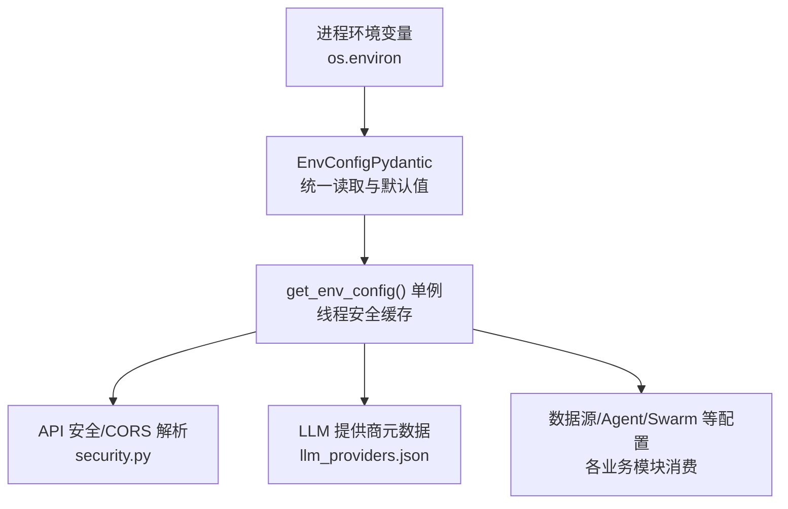
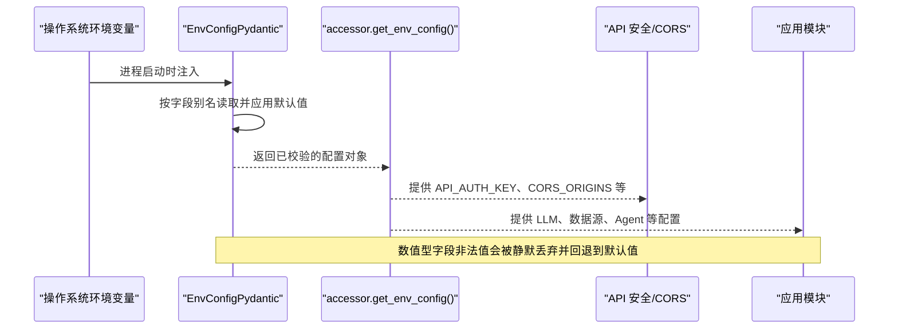
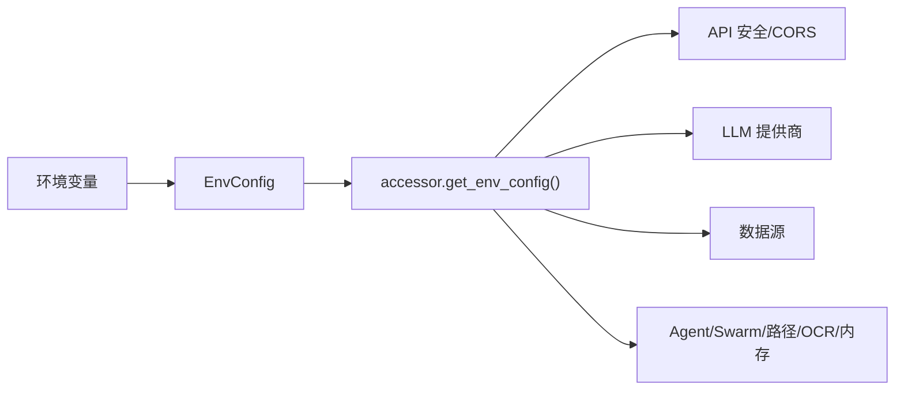

# 环境变量配置

<cite>
**本文引用的文件**
- [env_schema.py](file://agent/src/config/env_schema.py)
- [accessor.py](file://agent/src/config/accessor.py)
- [loader.py](file://agent/src/config/loader.py)
- [schema.py](file://agent/src/config/schema.py)
- [llm_providers.json](file://agent/src/providers/llm_providers.json)
- [security.py](file://agent/src/api/security.py)
- [api_server.py](file://agent/api_server.py)
- [settings_routes.py](file://agent/src/api/settings_routes.py)
</cite>

## 目录
1. [简介](#简介)
2. [项目结构](#项目结构)
3. [核心组件](#核心组件)
4. [架构总览](#架构总览)
5. [详细组件分析](#详细组件分析)
6. [依赖关系分析](#依赖关系分析)
7. [性能与验证特性](#性能与验证特性)
8. [故障排查指南](#故障排查指南)
9. [结论](#结论)
10. [附录：环境变量清单](#附录环境变量清单)

## 简介
本文件系统化说明 Vibe-Trading 支持的环境变量及其用途，覆盖 LLM 提供商、数据源认证、API 服务器安全与跨域、Agent 调优参数等。文档同时解释环境变量的读取优先级、默认值机制、布尔值特殊处理规则以及数值类型的校验行为，帮助你在本地开发、容器化部署或远程服务中正确配置系统。

## 项目结构
环境变量由统一的配置层集中管理，并通过 Pydantic 模型进行类型校验与默认值填充；运行时通过单例访问器提供线程安全的配置读取；API 与安全模块在启动时解析 CORS、鉴权开关等关键设置。

图表来源
- [env_schema.py:1-125](file://agent/src/config/env_schema.py#L1-L125)
- [accessor.py:52-76](file://agent/src/config/accessor.py#L52-L76)
- [security.py:30-51](file://agent/src/api/security.py#L30-L51)
- [llm_providers.json:1-236](file://agent/src/providers/llm_providers.json#L1-L236)

章节来源
- [env_schema.py:1-125](file://agent/src/config/env_schema.py#L1-L125)
- [accessor.py:52-76](file://agent/src/config/accessor.py#L52-L76)
- [security.py:30-51](file://agent/src/api/security.py#L30-L51)

## 核心组件
- EnvConfig 及子模型：定义所有环境变量的名称、类型、默认值与别名，负责从 os.environ 读取并应用默认值。
- 访问器 accessor：提供 get_env_config() 单例与 reset_env_config()，保证多线程安全与运行时刷新。
- API 安全模块：解析 CORS_ORIGINS 与 VIBE_TRADING_EXTRA_CORS_ORIGINS，控制跨域白名单与本地回环信任。
- LLM 提供商清单：llm_providers.json 声明支持的提供商、密钥与环境基地址的映射。
- Settings 路由：暴露 /settings/llm 与 /settings/data-sources 接口，用于查看和写入 agent/.env。

章节来源
- [env_schema.py:132-593](file://agent/src/config/env_schema.py#L132-L593)
- [accessor.py:52-93](file://agent/src/config/accessor.py#L52-L93)
- [security.py:69-74](file://agent/src/api/security.py#L69-L74)
- [llm_providers.json:1-236](file://agent/src/providers/llm_providers.json#L1-L236)
- [settings_routes.py:1-389](file://agent/src/api/settings_routes.py#L1-L389)

## 架构总览
下图展示了环境变量如何被加载、校验并在系统中生效的关键路径。

图表来源
- [env_schema.py:81-125](file://agent/src/config/env_schema.py#L81-L125)
- [accessor.py:52-76](file://agent/src/config/accessor.py#L52-L76)
- [security.py:69-74](file://agent/src/api/security.py#L69-L74)

## 详细组件分析

### LLM 提供商配置
- 主要变量
  - LANGCHAIN_PROVIDER：选择 LLM 提供商（如 openai、anthropic、deepseek、ollama 等）。
  - OPENAI_MODEL：OpenAI 专用模型名覆盖。
  - LANGCHAIN_MODEL_NAME：通用模型名覆盖。
  - LANGCHAIN_TEMPERATURE：生成温度。
  - TIMEOUT_SECONDS、MAX_RETRIES：请求超时与重试次数。
  - LANGCHAIN_REASONING_EFFORT：推理努力程度。
  - LANGCHAIN_USE_RESPONSES_API：仅当值为字符串 "true" 时才启用 Responses 传输。
  - VIBE_TRADING_DEEPSEEK_ADAPTER：DeepSeek 适配器策略。
  - MOONSHOT_USER_AGENT：Moonshot/Kimi 用户代理。
  - OPENAI_CODEX_BASE_URL：OpenAI Codex 后端地址。
  - VIBE_TRADING_DISABLE_HTTP_PROXY：禁用 HTTP 代理。
- 默认值与来源
  - 默认值在 LLMConfig 中定义；具体提供商的默认模型与基地址来自 llm_providers.json。
- 使用示例
  - 设置 LANGCHAIN_PROVIDER=openai 并使用默认模型；或设置 OPENAI_MODEL=自定义模型以覆盖默认。
- 注意事项
  - 不同提供商需要各自的 API Key 环境变量（例如 OPENAI_API_KEY、ANTHROPIC_API_KEY 等），这些键名在 llm_providers.json 中声明。

章节来源
- [env_schema.py:132-159](file://agent/src/config/env_schema.py#L132-L159)
- [llm_providers.json:1-236](file://agent/src/providers/llm_providers.json#L1-L236)

### 数据源认证与调优
- 主要变量
  - TUSHARE_TOKEN：A 股数据源 Tushare 的令牌。
  - CCXT_EXCHANGE、CCXT_TIMEOUT_MS、CCXT_FETCH_BUDGET_S：加密货币交易所连接与预算。
  - FUTU_HOST、FUTU_PORT：富途客户端主机与端口。
  - FINNHUB_API_KEY、ALPHAVANTAGE_API_KEY、TIINGO_API_KEY、FMP_API_KEY、FRED_API_KEY：第三方数据源密钥。
  - VIBE_TRADING_IWENCAI_KEY、VIBE_TRADING_SEC_UA：搜索与 SEC 工具相关。
  - VIBE_TRADING_SEC_13F_MAX_XML_MB、VIBE_TRADING_SEC_13F_BUDGET_S：SEC 13F 扫描限制与预算。
  - VIBE_TRADING_DATA_CACHE、VIBE_TRADING_DATA_CACHE_ROOT：数据缓存开关与根路径。
  - ALIYUN_IQS_API_KEY、QVERIS_API_KEY、QVERIS_BASE_URL、TICKERALL_*、RSSHUB_BASE_URL、DASHSCOPE_API_KEY、LONGBRIDGE_*、ETORO_*：其他数据源与平台密钥。
- 默认值与约束
  - 字符串默认多为空；数值型字段若传入非法值将被静默丢弃并回退到默认值。
- 使用示例
  - 设置 TUSHARE_TOKEN=你的令牌以启用 Tushare；或设置 CCXT_EXCHANGE=binance 指定交易所。

章节来源
- [env_schema.py:166-214](file://agent/src/config/env_schema.py#L166-L214)

### API 服务器设置与安全
- 主要变量
  - API_AUTH_KEY：非本地访问时的 Bearer Token；未设置时在开发模式下仅允许 loopback。
  - CORS_ORIGINS：替换默认的本地回环 CORS 列表。
  - VIBE_TRADING_EXTRA_CORS_ORIGINS：追加到默认 CORS 列表的额外来源（逗号分隔）。
  - API_ALLOWED_HOSTS：网络 MCP 传输的 Host/Origin 白名单。
  - ENABLE_SESSION_RUNTIME：是否启用会话运行时。
  - VIBE_TRADING_TRUST_DOCKER_LOOPBACK：信任 Docker Desktop 宿主网关的 loopback。
  - VIBE_TRADING_CSP_REPORT_ONLY：将 CSP 作为 Report-Only 发送。
  - VIBE_TRADING_ENABLE_SHELL_TOOLS：是否启用 shell 工具。
  - VIBE_TRADING_ALLOWED_FILE_ROOTS、VIBE_TRADING_ALLOWED_WRITE_ROOTS、VIBE_TRADING_ALLOWED_RUN_ROOTS：文件读写与运行根目录白名单。
  - VIBE_TRADING_API_URL：API 地址。
  - FUTU_TRADE_PWD_MD5：富途交易密码 MD5。
- 默认值与行为
  - CORS 默认包含多个本地地址；CORS_ORIGINS 会替换默认，而 VIBE_TRADING_EXTRA_CORS_ORIGINS 会追加。
  - 未设置 API_AUTH_KEY 时，敏感端点仅在 loopback 可访问；设置后需携带 Authorization: Bearer <key>。
- 使用示例
  - 部署到局域网时设置 API_AUTH_KEY，并在浏览器 Settings 中输入同一 key；如需信任 OpenBB Workspace，设置 VIBE_TRADING_EXTRA_CORS_ORIGINS=https://pro.openbb.co。

章节来源
- [env_schema.py:326-375](file://agent/src/config/env_schema.py#L326-L375)
- [security.py:30-51](file://agent/src/api/security.py#L30-L51)
- [security.py:69-74](file://agent/src/api/security.py#L69-L74)
- [api_server.py:34-71](file://agent/api_server.py#L34-L71)

### Agent 调优参数
- 主要变量
  - TOKEN_THRESHOLD：Token 阈值。
  - VT_HEARTBEAT_INTERVAL_S：心跳间隔秒数。
  - VT_REASONING_DELTA_MIN_INTERVAL_S：推理增量最小间隔。
  - VT_STREAM_RETRY_DELAY_S：流式重试延迟。
  - VIBE_TRADING_TOOL_TIMEOUT_SECONDS：工具调用超时。
  - VIBE_TRADING_GOAL_MAX_CONTINUATIONS：目标最大续跑次数。
  - VIBE_TRADING_SSE_TIMEOUT：SSE 超时。
  - CONTENT_FILTER_WARNING_THRESHOLD：内容过滤警告阈值。
  - VIBE_TRADING_ENABLE_ADVISORY、VIBE_TRADING_ENABLE_SCHEDULER：功能开关（建议/调度器）。
  - VIBE_TRADING_SCHEDULER_MAX_CONSECUTIVE_FAILURES、VIBE_TRADING_SCHEDULER_RETRY_BASE_DELAY_MS、VIBE_TRADING_SCHEDULER_RETRY_MAX_DELAY_MS：调度器失败与重试策略。
  - VIBE_TRADING_CHANNELS_AUTO_START：通道自动启动。
  - VIBE_TRADING_DISABLE_BOTTLENECK、VIBE_TRADING_BENCH_WORKERS、VIBE_TRADING_SEARCH_BACKENDS、VIBE_TRADING_SLASH_ARG_MAX、VIBE_TRADING_SEARCH_BING_FALLBACK、VIBE_LIVE_AUTHORIZE_TIMEOUT_SECONDS：其他调优项。
- 默认值与行为
  - 数值型字段非法值会被静默丢弃并回退到默认值；布尔开关遵循统一的 true/false/on/off/1/0 解析规则。
- 使用示例
  - 开启定时研究：VIBE_TRADING_ENABLE_SCHEDULER=1；调整心跳：VT_HEARTBEAT_INTERVAL_S=3.0。

章节来源
- [env_schema.py:339-394](file://agent/src/config/env_schema.py#L339-L394)

### 内存与路径等其他配置
- 内存开关
  - VT_MEMORY：预设 off/on/full；VT_MEMORY_QUALITY、VT_MEMORY_GC、VT_MEMORY_DECAY、VT_MEMORY_HIERARCHY、VT_MEMORY_LINKS、VT_MEMORY_COMPRESSION、VT_MEMORY_FTS_INDEX：细粒度开关。
- 路径与主题
  - VIBE_TRADING_HYPOTHESES_PATH、VIBE_TRADING_GOAL_DB_PATH、VIBE_TRADING_PLAYBOOK_DIR、VIBE_TRADING_SWARM_AGENT_CONFIG、ALLOW_SESSION_MCP_SERVERS、VIBE_TRADING_THEME、VIBE_GOAL_SESSION_ID、VIBE_TRADING_STRATEGY_STORE_DB_PATH。
- OCR
  - VIBE_TRADING_OCR_ENGINE、VIBE_TRADING_OCR_LLM_MODEL（兼容旧名 VIBE_TRADING_OCR_QWEN_MODEL）。

章节来源
- [env_schema.py:401-554](file://agent/src/config/env_schema.py#L401-L554)

### 布尔值的特殊处理方式
- 统一解析规则
  - 真值集合："1"、"true"、"yes"、"on"（不区分大小写）。
  - 假值集合："0"、"false"、"no"、"off"、""（空串）。
  - 非字符串值直接交由 Pydantic 内置转换处理。
- 特例
  - LANGCHAIN_USE_RESPONSES_API：仅当字符串为 "true" 时才启用（严格匹配）。
- 实现位置
  - _parse_env_bool 与 _parse_responses_api_bool；accessor._parse_bool 提供全局布尔解析。

章节来源
- [env_schema.py:47-74](file://agent/src/config/env_schema.py#L47-L74)
- [accessor.py:95-113](file://agent/src/config/accessor.py#L95-L113)

### 数值类型的验证规则
- 行为
  - 对于 int/float 字段，如果环境变量无法解析为对应数值，将被静默丢弃，随后 Pydantic 应用字段默认值，不会抛出异常。
- 影响
  - 这保证了配置加载的鲁棒性：错误拼写或格式错误的数值不会导致启动失败，而是降级到安全默认值。

章节来源
- [env_schema.py:91-124](file://agent/src/config/env_schema.py#L91-L124)

### 环境变量读取优先级与默认值机制
- 优先级
  - 构造参数 > 环境变量（通过字段别名 UPPER_SNAKE_CASE）> 字段默认值。
  - 对于部分字段，存在向后兼容别名（如 VIBE_TRADING_API_KEY → API_AUTH_KEY）。
- 机制
  - EnvConfig 的子模型在 before 验证阶段从 os.environ 读取缺失字段，并对数值型做安全转换。
  - 访问器 get_env_config() 提供线程安全的单例；reset_env_config() 可在运行时刷新。
- 使用场景
  - Settings API 写入 agent/.env 后，调用 reset_env_config() 使新值生效。

章节来源
- [env_schema.py:81-125](file://agent/src/config/env_schema.py#L81-L125)
- [accessor.py:52-93](file://agent/src/config/accessor.py#L52-L93)
- [settings_routes.py:1-389](file://agent/src/api/settings_routes.py#L1-L389)

## 依赖关系分析
- EnvConfig 是单一事实来源，所有模块通过 accessor.get_env_config() 获取配置。
- API 安全模块在启动时读取 CORS 与鉴权相关环境变量，构建中间件与访问控制。
- LLM 提供商清单与 EnvConfig 共同决定默认模型与密钥环境变量映射。
- Loader 与 Schema 负责结构化配置文件的加载与合并，与环境变量互补。

图表来源
- [env_schema.py:685-716](file://agent/src/config/env_schema.py#L685-L716)
- [accessor.py:52-76](file://agent/src/config/accessor.py#L52-L76)
- [security.py:69-74](file://agent/src/api/security.py#L69-L74)
- [llm_providers.json:1-236](file://agent/src/providers/llm_providers.json#L1-L236)

章节来源
- [env_schema.py:685-716](file://agent/src/config/env_schema.py#L685-L716)
- [accessor.py:52-76](file://agent/src/config/accessor.py#L52-L76)
- [security.py:69-74](file://agent/src/api/security.py#L69-L74)
- [llm_providers.json:1-236](file://agent/src/providers/llm_providers.json#L1-L236)

## 性能与验证特性
- 配置加载一次性完成，后续通过单例访问，避免重复解析开销。
- 数值型字段非法值静默丢弃，提升容错性与启动稳定性。
- 布尔值统一解析，减少分支判断不一致带来的维护成本。
- CORS 与鉴权在启动时解析，确保请求进入时即具备安全策略。

[本节为通用指导，无需特定文件引用]

## 故障排查指南
- 现象：远程访问被拒绝（403/401）
  - 检查是否设置了 API_AUTH_KEY；若未设置，仅允许 loopback 访问。
  - 确认浏览器或客户端是否正确携带 Authorization: Bearer <key>。
- 现象：跨域请求被阻止
  - 检查 CORS_ORIGINS 是否覆盖了默认列表；如需追加而非替换，使用 VIBE_TRADING_EXTRA_CORS_ORIGINS。
  - 在 Docker Desktop 宿主网关场景下，可设置 VIBE_TRADING_TRUST_DOCKER_LOOPBACK=1。
- 现象：LLM 调用失败或模型不生效
  - 确认 LANGCHAIN_PROVIDER 与对应的 API Key 环境变量已设置。
  - 如需覆盖默认模型，设置 OPENAI_MODEL 或 LANGCHAIN_MODEL_NAME。
- 现象：数据源不可用
  - 检查 TUSHARE_TOKEN、FINNHUB_API_KEY、FMP_API_KEY 等密钥是否正确。
  - 检查 CCXT_EXCHANGE、FUTU_HOST、FUTU_PORT 等连接参数。
- 现象：Settings 写入无效
  - 写入 agent/.env 后需调用 reset_env_config() 刷新配置单例。

章节来源
- [security.py:69-74](file://agent/src/api/security.py#L69-L74)
- [accessor.py:79-93](file://agent/src/config/accessor.py#L79-L93)
- [settings_routes.py:1-389](file://agent/src/api/settings_routes.py#L1-L389)

## 结论
Vibe-Trading 通过 EnvConfig 将环境变量集中管理，提供类型安全、默认值与健壮的错误处理；配合 accessor 的单例模式与 API 安全模块，实现了灵活且安全的运行时配置。按照本文档配置 LLM、数据源、API 与 Agent 参数，即可在不同环境中稳定运行。

[本节为总结，无需特定文件引用]

## 附录：环境变量清单
以下为常用环境变量的类别、用途、类型、默认值与示例说明。注意：默认值来源于 env_schema.py；布尔值遵循统一解析规则；数值型非法值将被静默丢弃并回退默认。

- LLM 提供商
  - LANGCHAIN_PROVIDER：字符串，默认 "openai"。示例：LANGCHAIN_PROVIDER=anthropic。
  - OPENAI_MODEL：字符串，默认 ""。示例：OPENAI_MODEL=gpt-5.5。
  - LANGCHAIN_MODEL_NAME：字符串，默认 ""。示例：LANGCHAIN_MODEL_NAME=claude-sonnet-4-6。
  - LANGCHAIN_TEMPERATURE：浮点数，默认 0.0。示例：LANGCHAIN_TEMPERATURE=0.7。
  - TIMEOUT_SECONDS：整数，默认 120。示例：TIMEOUT_SECONDS=300。
  - MAX_RETRIES：整数，默认 2。示例：MAX_RETRIES=5。
  - LANGCHAIN_REASONING_EFFORT：字符串，默认 ""。示例：LANGCHAIN_REASONING_EFFORT=high。
  - LANGCHAIN_USE_RESPONSES_API：布尔（仅 "true" 启用），默认 None。示例：LANGCHAIN_USE_RESPONSES_API=true。
  - VIBE_TRADING_DEEPSEEK_ADAPTER：字符串，默认 "auto"。示例：VIBE_TRADING_DEEPSEEK_ADAPTER=strict。
  - MOONSHOT_USER_AGENT：字符串，默认 ""。示例：MOONSHOT_USER_AGENT=my-agent/1.0。
  - OPENAI_CODEX_BASE_URL：字符串，默认 "https://chatgpt.com/backend-api/codex/responses"。示例：OPENAI_CODEX_BASE_URL=https://custom.example/v1。
  - VIBE_TRADING_DISABLE_HTTP_PROXY：布尔，默认 False。示例：VIBE_TRADING_DISABLE_HTTP_PROXY=1。

- 数据源认证
  - TUSHARE_TOKEN：字符串，默认 ""。示例：TUSHARE_TOKEN=your-token。
  - CCXT_EXCHANGE：字符串，默认 "binance"。示例：CCXT_EXCHANGE=okx。
  - CCXT_TIMEOUT_MS：整数，默认 15000。示例：CCXT_TIMEOUT_MS=30000。
  - CCXT_FETCH_BUDGET_S：浮点数，默认 60.0。示例：CCXT_FETCH_BUDGET_S=120.0。
  - FUTU_HOST：字符串，默认 "127.0.0.1"。示例：FUTU_HOST=192.168.1.10。
  - FUTU_PORT：整数，默认 11111。示例：FUTU_PORT=11112。
  - FINNHUB_API_KEY、ALPHAVANTAGE_API_KEY、TIINGO_API_KEY、FMP_API_KEY、FRED_API_KEY：字符串，默认 ""。示例：FINNHUB_API_KEY=your-key。
  - VIBE_TRADING_IWENCAI_KEY、VIBE_TRADING_SEC_UA：字符串，默认 ""。示例：VIBE_TRADING_IWENCAI_KEY=your-key。
  - VIBE_TRADING_SEC_13F_MAX_XML_MB：浮点数，默认 25.0。示例：VIBE_TRADING_SEC_13F_MAX_XML_MB=50.0。
  - VIBE_TRADING_SEC_13F_BUDGET_S：浮点数，默认 120.0。示例：VIBE_TRADING_SEC_13F_BUDGET_S=300.0。
  - VIBE_TRADING_DATA_CACHE：布尔，默认 False。示例：VIBE_TRADING_DATA_CACHE=true。
  - VIBE_TRADING_DATA_CACHE_ROOT：字符串，默认 ""。示例：VIBE_TRADING_DATA_CACHE_ROOT=/data/cache。
  - ALIYUN_IQS_API_KEY、QVERIS_API_KEY、QVERIS_BASE_URL、TICKERALL_API_KEY、TICKERALL_ACCOUNT_ID、TICKERALL_BASE_URL、RSSHUB_BASE_URL、DASHSCOPE_API_KEY、LONGBRIDGE_APP_KEY、LONGBRIDGE_APP_SECRET、LONGBRIDGE_ACCESS_TOKEN、ETORO_API_KEY、ETORO_USER_KEY：字符串，默认 ""。示例：QVERIS_BASE_URL=https://qveris.example/v1。

- API 服务器设置
  - API_AUTH_KEY：字符串，默认 ""。示例：API_AUTH_KEY=strong-secret。
  - CORS_ORIGINS：字符串，默认 ""（为空时使用内置默认列表）。示例：CORS_ORIGINS=http://localhost:3000,http://localhost:5173。
  - VIBE_TRADING_EXTRA_CORS_ORIGINS：字符串，默认 ""。示例：VIBE_TRADING_EXTRA_CORS_ORIGINS=https://pro.openbb.co。
  - API_ALLOWED_HOSTS：字符串，默认 ""。示例：API_ALLOWED_HOSTS=localhost,127.0.0.1。
  - ENABLE_SESSION_RUNTIME：布尔，默认 True。示例：ENABLE_SESSION_RUNTIME=false。
  - VIBE_TRADING_TRUST_DOCKER_LOOPBACK：布尔，默认 False。示例：VIBE_TRADING_TRUST_DOCKER_LOOPBACK=1。
  - VIBE_TRADING_CSP_REPORT_ONLY：布尔，默认 False。示例：VIBE_TRADING_CSP_REPORT_ONLY=true。
  - VIBE_TRADING_ENABLE_SHELL_TOOLS：布尔，默认 False。示例：VIBE_TRADING_ENABLE_SHELL_TOOLS=1。
  - VIBE_TRADING_ALLOWED_FILE_ROOTS、VIBE_TRADING_ALLOWED_WRITE_ROOTS、VIBE_TRADING_ALLOWED_RUN_ROOTS：字符串，默认 ""。示例：VIBE_TRADING_ALLOWED_RUN_ROOTS=/tmp/runs。
  - VIBE_TRADING_API_URL：字符串，默认 "http://127.0.0.1:8000"。示例：VIBE_TRADING_API_URL=http://api.example:8000。
  - FUTU_TRADE_PWD_MD5：字符串，默认 ""。示例：FUTU_TRADE_PWD_MD5=md5hash。

- Agent 调优参数
  - TOKEN_THRESHOLD：整数，默认 40000。示例：TOKEN_THRESHOLD=60000。
  - VT_HEARTBEAT_INTERVAL_S：浮点数，默认 3.0。示例：VT_HEARTBEAT_INTERVAL_S=5.0。
  - VT_REASONING_DELTA_MIN_INTERVAL_S：浮点数，默认 1.0。示例：VT_REASONING_DELTA_MIN_INTERVAL_S=2.0。
  - VT_STREAM_RETRY_DELAY_S：浮点数，默认 1.0。示例：VT_STREAM_RETRY_DELAY_S=3.0。
  - VIBE_TRADING_TOOL_TIMEOUT_SECONDS：浮点数，默认 1800.0。示例：VIBE_TRADING_TOOL_TIMEOUT_SECONDS=3600.0。
  - VIBE_TRADING_GOAL_MAX_CONTINUATIONS：整数，默认 3。示例：VIBE_TRADING_GOAL_MAX_CONTINUATIONS=5。
  - VIBE_TRADING_SSE_TIMEOUT：整数，默认 90。示例：VIBE_TRADING_SSE_TIMEOUT=120。
  - CONTENT_FILTER_WARNING_THRESHOLD：浮点数，默认 0.05。示例：CONTENT_FILTER_WARNING_THRESHOLD=0.1。
  - VIBE_TRADING_ENABLE_ADVISORY：布尔，默认 False。示例：VIBE_TRADING_ENABLE_ADVISORY=true。
  - VIBE_TRADING_ENABLE_SCHEDULER：布尔，默认 False。示例：VIBE_TRADING_ENABLE_SCHEDULER=1。
  - VIBE_TRADING_SCHEDULER_MAX_CONSECUTIVE_FAILURES：整数，默认 3。示例：VIBE_TRADING_SCHEDULER_MAX_CONSECUTIVE_FAILURES=5。
  - VIBE_TRADING_SCHEDULER_RETRY_BASE_DELAY_MS：整数，默认 60000。示例：VIBE_TRADING_SCHEDULER_RETRY_BASE_DELAY_MS=120000。
  - VIBE_TRADING_SCHEDULER_RETRY_MAX_DELAY_MS：整数，默认 3600000。示例：VIBE_TRADING_SCHEDULER_RETRY_MAX_DELAY_MS=7200000。
  - VIBE_TRADING_CHANNELS_AUTO_START：布尔，默认 False。示例：VIBE_TRADING_CHANNELS_AUTO_START=true。
  - VIBE_TRADING_DISABLE_BOTTLENECK：布尔，默认 False。示例：VIBE_TRADING_DISABLE_BOTTLENECK=1。
  - VIBE_TRADING_BENCH_WORKERS：整数，默认 0。示例：VIBE_TRADING_BENCH_WORKERS=4。
  - VIBE_TRADING_SEARCH_BACKENDS：字符串，默认 ""。示例：VIBE_TRADING_SEARCH_BACKENDS=duckduckgo,bing。
  - VIBE_TRADING_SLASH_ARG_MAX：整数，默认 600。示例：VIBE_TRADING_SLASH_ARG_MAX=1000。
  - VIBE_TRADING_SEARCH_BING_FALLBACK：布尔，默认 True。示例：VIBE_TRADING_SEARCH_BING_FALLBACK=false。
  - VIBE_LIVE_AUTHORIZE_TIMEOUT_SECONDS：整数，默认 300。示例：VIBE_LIVE_AUTHORIZE_TIMEOUT_SECONDS=600。

- 内存与路径
  - VT_MEMORY：枚举（off/on/full），默认 "off"。示例：VT_MEMORY=full。
  - VT_MEMORY_QUALITY、VT_MEMORY_GC、VT_MEMORY_DECAY、VT_MEMORY_HIERARCHY、VT_MEMORY_LINKS、VT_MEMORY_COMPRESSION、VT_MEMORY_FTS_INDEX：布尔，默认 False。示例：VT_MEMORY_QUALITY=true。
  - VIBE_TRADING_HYPOTHESES_PATH、VIBE_TRADING_GOAL_DB_PATH、VIBE_TRADING_PLAYBOOK_DIR、VIBE_TRADING_SWARM_AGENT_CONFIG、ALLOW_SESSION_MCP_SERVERS、VIBE_TRADING_THEME、VIBE_GOAL_SESSION_ID、VIBE_TRADING_STRATEGY_STORE_DB_PATH：字符串，默认 ""。示例：VIBE_TRADING_HYPOTHESES_PATH=/path/to/hypotheses。

- OCR
  - VIBE_TRADING_OCR_ENGINE：字符串，默认 "auto"。示例：VIBE_TRADING_OCR_ENGINE=llm。
  - VIBE_TRADING_OCR_LLM_MODEL：字符串，默认 ""。示例：VIBE_TRADING_OCR_LLM_MODEL=qwen-vl-max。

章节来源
- [env_schema.py:132-554](file://agent/src/config/env_schema.py#L132-L554)
- [accessor.py:95-113](file://agent/src/config/accessor.py#L95-L113)
- [security.py:69-74](file://agent/src/api/security.py#L69-L74)
- [llm_providers.json:1-236](file://agent/src/providers/llm_providers.json#L1-L236)