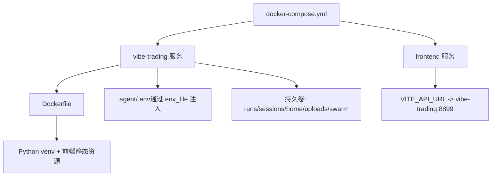
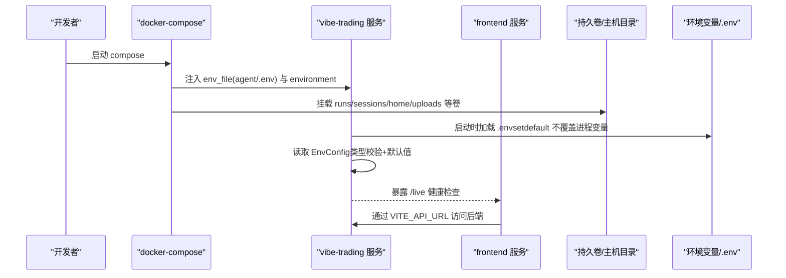
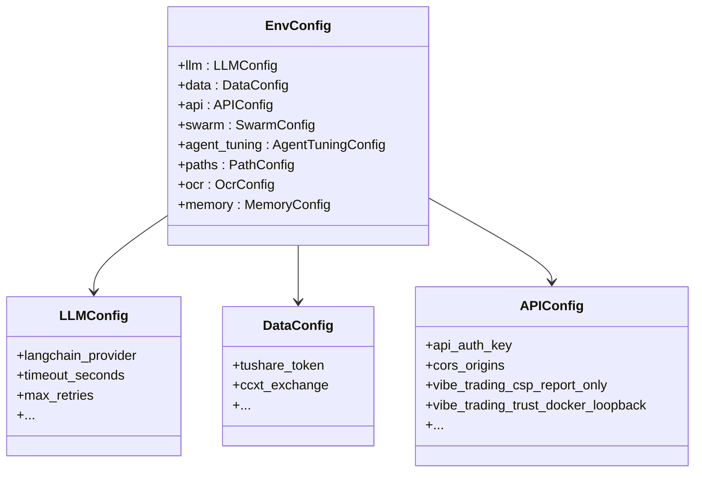
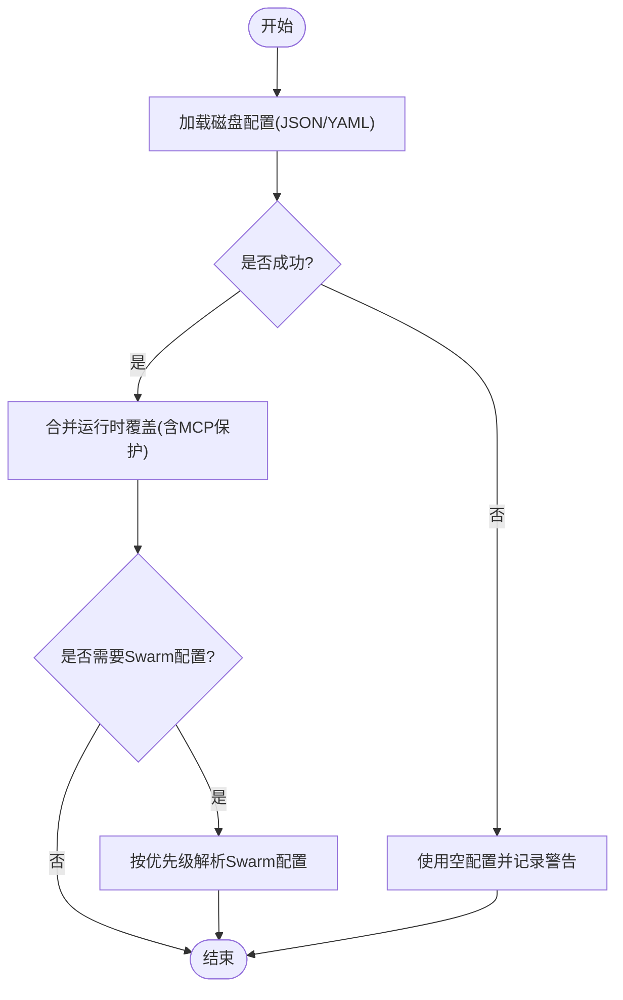
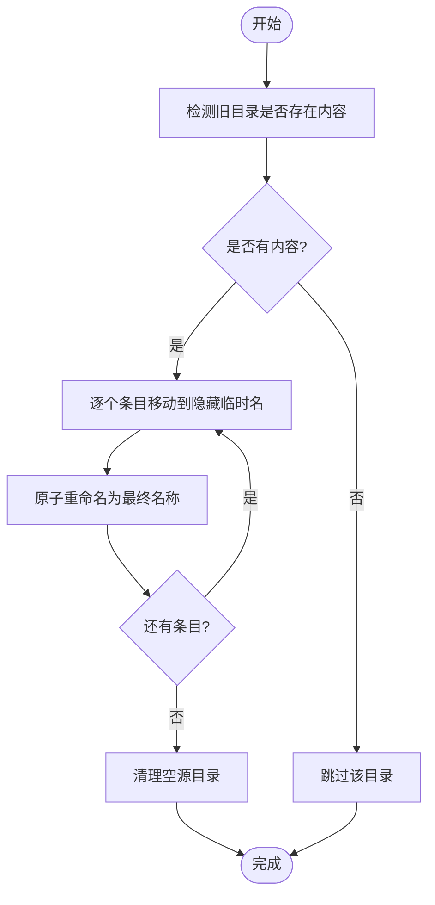
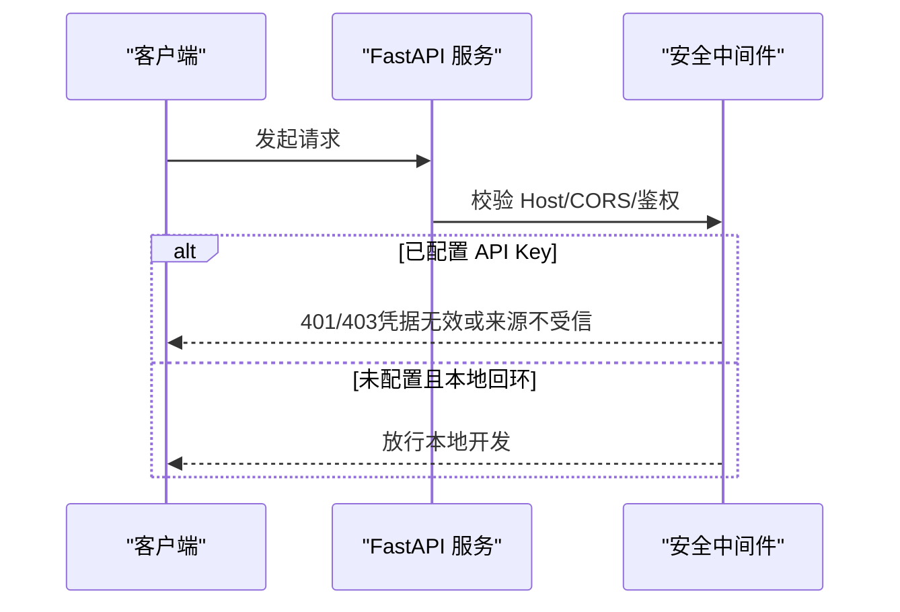
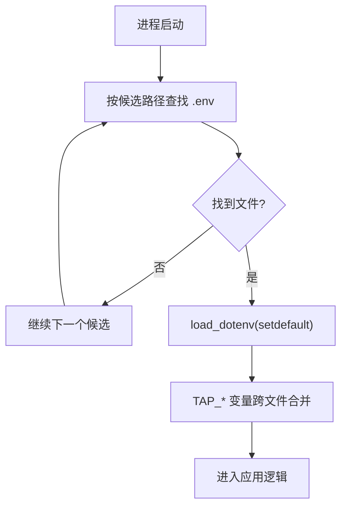
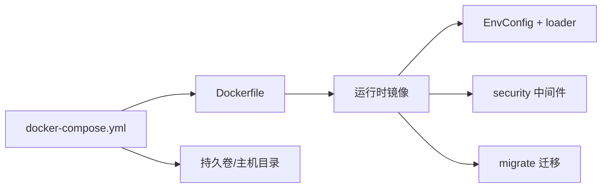

# 环境模板

<cite>
**本文引用的文件**
- [docker-compose.yml](file://docker-compose.yml)
- [Dockerfile](file://Dockerfile)
- [.devcontainer/devcontainer.json](file://.devcontainer/devcontainer.json)
- [agent/src/config/env_schema.py](file://agent/src/config/env_schema.py)
- [agent/src/config/loader.py](file://agent/src/config/loader.py)
- [agent/src/config/migrate.py](file://agent/src/config/migrate.py)
- [agent/src/api/security.py](file://agent/src/api/security.py)
- [agent/src/providers/llm.py](file://agent/src/providers/llm.py)
- [agent/src/trading/tap_forward.py](file://agent/src/trading/tap_forward.py)
- [agent/tests/conftest.py](file://agent/tests/conftest.py)
- [agent/tests/test_env_schema.py](file://agent/tests/test_env_schema.py)
- [agent/tests/test_api_infrastructure.py](file://agent/tests/test_api_infrastructure.py)
</cite>

## 目录
1. [简介](#简介)
2. [项目结构](#项目结构)
3. [核心组件](#核心组件)
4. [架构总览](#架构总览)
5. [详细组件分析](#详细组件分析)
6. [依赖关系分析](#依赖关系分析)
7. [性能考虑](#性能考虑)
8. [故障排除指南](#故障排除指南)
9. [结论](#结论)
10. [附录：环境配置模板与最佳实践](#附录：环境配置模板与最佳实践)

## 简介
本文件提供面向开发、测试、生产三套环境的配置模板与落地指南，覆盖环境变量组织、敏感信息分离、版本控制策略；并给出 Docker 容器间通信、环境变量传递、卷挂载与安全加固的配置要点。同时说明配置迁移工具的使用方法与常见问题排查路径，帮助团队在不同环境中快速、安全地部署 Vibe-Trading。

## 项目结构
Vibe-Trading 的环境与运行相关的关键位置如下：
- 容器编排与镜像构建：docker-compose.yml、Dockerfile
- 本地开发容器：.devcontainer/devcontainer.json
- 环境变量与配置模型：agent/src/config/env_schema.py、loader.py、migrate.py
- 运行时安全与鉴权：agent/src/api/security.py
- .env 加载与合并：agent/src/providers/llm.py、agent/src/trading/tap_forward.py
- 测试隔离与环境重置：agent/tests/conftest.py、test_env_schema.py、test_api_infrastructure.py

图表来源
- [docker-compose.yml:1-90](file://docker-compose.yml#L1-L90)
- [Dockerfile:1-119](file://Dockerfile#L1-L119)

章节来源
- [docker-compose.yml:1-90](file://docker-compose.yml#L1-L90)
- [Dockerfile:1-119](file://Dockerfile#L1-L119)

## 核心组件
- 环境变量与配置模型：集中定义所有环境变量及其默认值、类型校验与别名映射，统一由 EnvConfig 读取 os.environ 并应用默认值。
- 配置加载与覆盖：支持从磁盘 JSON/YAML 加载 Agent 配置，并在运行时合并覆盖项；Swarm 子进程有独立的配置解析顺序。
- 配置迁移：将旧版代码相对路径下的状态目录迁移到新的运行时根目录，保证升级不丢失历史数据。
- 安全与鉴权：API Key、CORS、Host 白名单、DNS 重绑定防护、CSP 等；支持 Docker 回环信任开关。
- .env 加载策略：按候选路径顺序加载，使用 setdefault 避免覆盖进程已有变量；TAP_* 前缀变量会跨多个 .env 合并。

章节来源
- [agent/src/config/env_schema.py:1-593](file://agent/src/config/env_schema.py#L1-L593)
- [agent/src/config/loader.py:1-346](file://agent/src/config/loader.py#L1-L346)
- [agent/src/config/migrate.py:1-153](file://agent/src/config/migrate.py#L1-L153)
- [agent/src/api/security.py:1-670](file://agent/src/api/security.py#L1-L670)
- [agent/src/providers/llm.py:621-988](file://agent/src/providers/llm.py#L621-L988)
- [agent/src/trading/tap_forward.py:49-76](file://agent/src/trading/tap_forward.py#L49-L76)

## 架构总览
下图展示了不同环境在启动时如何组合环境变量、配置文件与容器能力，形成一致的运行时行为。

图表来源
- [docker-compose.yml:1-90](file://docker-compose.yml#L1-L90)
- [agent/src/providers/llm.py:965-988](file://agent/src/providers/llm.py#L965-L988)
- [agent/src/config/env_schema.py:685-716](file://agent/src/config/env_schema.py#L685-L716)

## 详细组件分析

### 环境变量与配置模型（EnvConfig）
- 作用：为所有功能域（LLM、数据源、API、Swarm、Agent 调优、路径、OCR、记忆系统）提供统一的 Pydantic 模型，字段带类型、默认值与环境变量别名。
- 行为：构造时无参即从 os.environ 读取缺失字段；数值型非法值自动回退默认；布尔值支持多种字符串真值。
- 关键特性：
  - 内存系统预设 VT_MEMORY=off|on|full，可被单标志位覆盖。
  - API 密钥别名兼容：VIBE_TRADING_API_KEY 会自动复制到 api_auth_key。
  - 安全开关：如 CSP Report-Only、Shell Tools、Docker 回环信任等。

图表来源
- [agent/src/config/env_schema.py:132-593](file://agent/src/config/env_schema.py#L132-L593)

章节来源
- [agent/src/config/env_schema.py:1-593](file://agent/src/config/env_schema.py#L1-L593)

### 配置加载与覆盖（loader）
- 磁盘配置：支持 JSON/YAML，失败则降级为空配置并记录警告。
- 运行时覆盖：会话级覆盖可传入，仅覆盖指定字段；对 MCP 服务器定义进行传输切换保护。
- Swarm 配置优先级：环境变量绝对覆盖 > swarm-agent.json > agent.json/yaml > 无配置（本地工具模式）。

图表来源
- [agent/src/config/loader.py:28-151](file://agent/src/config/loader.py#L28-L151)
- [agent/src/config/loader.py:154-229](file://agent/src/config/loader.py#L154-L229)

章节来源
- [agent/src/config/loader.py:1-346](file://agent/src/config/loader.py#L1-L346)

### 配置迁移工具（migrate）
- 目标：将旧版代码相对路径下的 sessions/runs/.swarm/runs/uploads 迁移至新的运行时根目录，确保升级不丢历史。
- 机制：逐条目原子移动（先移动到隐藏临时名再 rename），恢复中断迁移；跳过疑似 Python 包的目录；冲突时告警并保留目标。
- 幂等：重复执行不会重复迁移。

图表来源
- [agent/src/config/migrate.py:1-153](file://agent/src/config/migrate.py#L1-L153)

章节来源
- [agent/src/config/migrate.py:1-153](file://agent/src/config/migrate.py#L1-L153)

### 安全与鉴权（security）
- 鉴权：支持 API Key（Header/Query 受控）、本地回环信任、SSE 一次性票据。
- CORS/Host：默认允许本地开发端口；可通过环境变量追加额外可信来源；拒绝 credentialed 的 *。
- DNS 重绑定防护：对本地客户端 Host 头进行白名单校验。
- CSP：默认严格，文档路由放宽；支持 Report-Only 回滚开关。
- Docker 回环信任：可通过环境变量启用，允许来自宿主网关的回环请求。

图表来源
- [agent/src/api/security.py:69-158](file://agent/src/api/security.py#L69-L158)
- [agent/src/api/security.py:166-174](file://agent/src/api/security.py#L166-L174)
- [agent/src/api/security.py:235-253](file://agent/src/api/security.py#L235-L253)
- [agent/src/api/security.py:463-504](file://agent/src/api/security.py#L463-L504)

章节来源
- [agent/src/api/security.py:1-670](file://agent/src/api/security.py#L1-L670)

### .env 加载与合并策略
- 候选路径：~/.vibe-trading/.env、agent/.env、当前工作目录 .env（按顺序首次命中加载）。
- 行为：使用 setdefault，不覆盖进程已有变量；因此 docker-compose environment 优先于 .env。
- TAP_* 前缀：扫描所有候选 .env 并合并到进程环境，便于多文件分域管理。

图表来源
- [agent/src/providers/llm.py:965-988](file://agent/src/providers/llm.py#L965-L988)
- [agent/src/trading/tap_forward.py:49-76](file://agent/src/trading/tap_forward.py#L49-L76)

章节来源
- [agent/src/providers/llm.py:621-988](file://agent/src/providers/llm.py#L621-L988)
- [agent/src/trading/tap_forward.py:49-76](file://agent/src/trading/tap_forward.py#L49-L76)

## 依赖关系分析
- 容器与服务：compose 负责编排 vibe-trading 与 frontend，前者暴露 8899，后者通过 VITE_API_URL 访问。
- 镜像层：前端构建阶段与 Python 构建阶段分离，运行时仅携带预编译 venv 与静态资源，减小攻击面。
- 配置依赖：EnvConfig 是全局配置入口；loader 提供结构化配置加载；migrate 保障状态迁移；security 提供运行时安全策略。

图表来源
- [docker-compose.yml:1-90](file://docker-compose.yml#L1-L90)
- [Dockerfile:1-119](file://Dockerfile#L1-L119)

章节来源
- [docker-compose.yml:1-90](file://docker-compose.yml#L1-L90)
- [Dockerfile:1-119](file://Dockerfile#L1-L119)

## 性能考虑
- 资源限制：容器设置 CPU、内存、PID 上限，防止失控任务影响宿主机。
- 只读根文件系统：配合 tmpfs 写入 /tmp 与缓存目录，提升安全性与稳定性。
- 并行基准测试：通过环境变量控制工作进程数，可在测试环境验证并行与串行一致性。
- 日志与监控：建议在生产侧结合反向代理/网关收集指标与日志；CSP Report-Only 可用于灰度发布后回滚。

[本节为通用指导，不直接分析具体文件]

## 故障排除指南
- 环境变量未生效
  - 检查 docker-compose environment 是否覆盖了 .env 中的同名键（进程优先）。
  - 确认 .env 候选路径是否正确，以及是否包含 TAP_* 变量。
  - 参考：[agent/src/providers/llm.py:965-988](file://agent/src/providers/llm.py#L965-L988)、[agent/src/trading/tap_forward.py:49-76](file://agent/src/trading/tap_forward.py#L49-L76)
- 配置类型错误导致回退默认
  - 数值型非法值会被忽略并回退默认；布尔值需符合约定真值集合。
  - 参考：[agent/tests/test_env_schema.py:190-219](file://agent/tests/test_env_schema.py#L190-L219)
- 测试污染与隔离
  - 每个测试前后会快照并恢复 os.environ，并重置 EnvConfig 缓存，避免泄漏。
  - 参考：[agent/tests/conftest.py:16-45](file://agent/tests/conftest.py#L16-L45)
- 权限与文件写入
  - Web UI 写入 .env 时会创建私有父目录并设置 0600 权限；注意跨平台差异。
  - 参考：[agent/tests/test_api_infrastructure.py:305-317](file://agent/tests/test_api_infrastructure.py#L305-L317)
- 迁移异常
  - 若迁移中断，下次启动会自动恢复；遇到冲突会告警并保留目标。
  - 参考：[agent/src/config/migrate.py:57-102](file://agent/src/config/migrate.py#L57-L102)

章节来源
- [agent/tests/conftest.py:16-45](file://agent/tests/conftest.py#L16-L45)
- [agent/tests/test_env_schema.py:190-219](file://agent/tests/test_env_schema.py#L190-L219)
- [agent/tests/test_api_infrastructure.py:305-317](file://agent/tests/test_api_infrastructure.py#L305-L317)
- [agent/src/config/migrate.py:57-102](file://agent/src/config/migrate.py#L57-L102)

## 结论
通过集中化的环境变量模型、严格的加载与覆盖策略、安全的运行时中间件以及完善的迁移工具，Vibe-Trading 能够在开发、测试、生产环境中保持一致的行为与更高的安全性。结合 Docker 编排与卷挂载，可实现数据持久化与容器间通信；遵循本文模板与最佳实践，可显著降低部署与维护成本。

[本节为总结性内容，不直接分析具体文件]

## 附录：环境配置模板与最佳实践

### 开发环境模板（调试模式、详细日志、本地数据库）
- 目标
  - 开启本地调试与更详细的日志输出（建议在应用层或日志框架中调整级别）。
  - 使用本地或易获取的数据源与 LLM 端点，便于联调。
  - 使用本地回环信任以简化鉴权流程。
- 推荐环境变量（示例）
  - LANGCHAIN_PROVIDER、LANGCHAIN_MODEL_NAME、OPENAI_BASE_URL（或对应提供商 base_url）
  - API_AUTH_KEY（可选，本地可留空以启用回环信任）
  - VIBE_TRADING_TRUST_DOCKER_LOOPBACK=1（如在容器中调试）
  - VITE_API_URL=http://localhost:8899（前端开发）
- 容器与卷
  - 使用 devcontainer 或 docker-compose 启动，挂载 agent/.env 以便热更新。
  - 如需本地数据库，通过额外服务或挂载卷实现。
- 参考
  - [docker-compose.yml:1-90](file://docker-compose.yml#L1-L90)
  - [.devcontainer/devcontainer.json:1-40](file://.devcontainer/devcontainer.json#L1-L40)
  - [agent/src/api/security.py:147-158](file://agent/src/api/security.py#L147-L158)

### 测试环境模板（Mock 服务、隔离数据、并行测试）
- 目标
  - 使用 Mock 数据源与 LLM 端点，避免真实调用。
  - 确保测试间环境隔离，避免 .env 与进程环境变量泄漏。
  - 支持并行基准测试以验证吞吐与一致性。
- 推荐环境变量（示例）
  - 设置 VIBE_TRADING_BENCH_WORKERS 控制并行度。
  - 通过测试夹具重置 EnvConfig 与 os.environ。
- 容器与卷
  - 每次测试使用独立临时目录作为 .env 与数据根，避免共享状态。
- 参考
  - [agent/tests/test_bench_parallel.py:71-100](file://agent/tests/test_bench_parallel.py#L71-L100)
  - [agent/tests/conftest.py:16-45](file://agent/tests/conftest.py#L16-L45)
  - [agent/tests/test_env_schema.py:190-219](file://agent/tests/test_env_schema.py#L190-L219)

### 生产环境模板（性能优化、监控配置、高可用设置）
- 目标
  - 关闭不必要的调试开关，启用严格的安全策略（CSP 强制、Host 白名单、CORS 最小化）。
  - 配置 API Key 认证，禁止匿名访问。
  - 合理设置资源限制与健康检查，结合反向代理/网关做监控与限流。
- 推荐环境变量（示例）
  - API_AUTH_KEY（必填）
  - CORS_ORIGINS（显式列出可信来源）
  - VIBE_TRADING_EXTRA_CORS_ORIGINS（按需追加）
  - VIBE_TRADING_CSP_REPORT_ONLY=0（生产建议强制）
  - VIBE_TRADING_ENABLE_SHELL_TOOLS=0（禁用危险能力）
  - VIBE_TRADING_TRUST_DOCKER_LOOPBACK=0（除非确有必要）
- 容器与卷
  - 使用只读根文件系统 + tmpfs 写入必要目录。
  - 持久化 runs/sessions/uploads 等数据到命名卷或外部存储。
- 参考
  - [docker-compose.yml:40-66](file://docker-compose.yml#L40-L66)
  - [agent/src/api/security.py:180-253](file://agent/src/api/security.py#L180-L253)
  - [agent/src/config/env_schema.py:326-375](file://agent/src/config/env_schema.py#L326-L375)

### Docker 环境配置要点
- 容器间通信
  - frontend 通过 VITE_API_URL 指向 vibe-trading 服务名与端口。
  - 参考：[docker-compose.yml:68-82](file://docker-compose.yml#L68-L82)
- 环境变量传递
  - 使用 env_file 注入 agent/.env；environment 列表用于覆盖或注入运行时参数。
  - 参考：[docker-compose.yml:6-15](file://docker-compose.yml#L6-L15)
- 卷挂载配置
  - 持久化 runs/sessions/home/uploads/swarm 等目录，避免重建丢失。
  - 台湾股票快照只读挂载，路径位于仓库外。
  - 参考：[docker-compose.yml:20-39](file://docker-compose.yml#L20-L39)
- 安全加固
  - 丢弃全部能力，仅添加 SETUID/SETGID；启用 no-new-privileges；只读根文件系统。
  - 参考：[docker-compose.yml:40-66](file://docker-compose.yml#L40-L66)

章节来源
- [docker-compose.yml:1-90](file://docker-compose.yml#L1-L90)

### 环境变量文件管理
- .env 组织
  - 候选路径：~/.vibe-trading/.env、agent/.env、当前工作目录 .env。
  - 进程环境变量优先于 .env；TAP_* 变量会跨多个 .env 合并。
  - 参考：[agent/src/providers/llm.py:965-988](file://agent/src/providers/llm.py#L965-L988)、[agent/src/trading/tap_forward.py:49-76](file://agent/src/trading/tap_forward.py#L49-L76)
- 敏感信息分离
  - 将密钥放入 ~/.vibe-trading/.env 或 CI 密钥管理；agent/.env 仅放非敏感配置。
  - Web UI 写入 .env 时设置 0600 权限，父目录 0700。
  - 参考：[agent/tests/test_api_infrastructure.py:305-317](file://agent/tests/test_api_infrastructure.py#L305-L317)
- 版本控制策略
  - 不要提交包含密钥的 .env；提交 .env.example 或 README 说明所需变量。
  - 使用 CI 注入敏感变量，运行时通过 env_file/environment 注入。

章节来源
- [agent/src/providers/llm.py:965-988](file://agent/src/providers/llm.py#L965-L988)
- [agent/src/trading/tap_forward.py:49-76](file://agent/src/trading/tap_forward.py#L49-L76)
- [agent/tests/test_api_infrastructure.py:305-317](file://agent/tests/test_api_infrastructure.py#L305-L317)

### 配置迁移工具使用方法
- 何时运行：首次升级到新版本时，自动迁移旧版状态目录到新的运行时根。
- 行为：原子移动、中断恢复、冲突告警、幂等。
- 参考：[agent/src/config/migrate.py:1-153](file://agent/src/config/migrate.py#L1-L153)

章节来源
- [agent/src/config/migrate.py:1-153](file://agent/src/config/migrate.py#L1-L153)