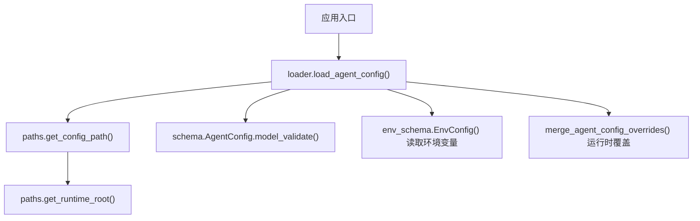
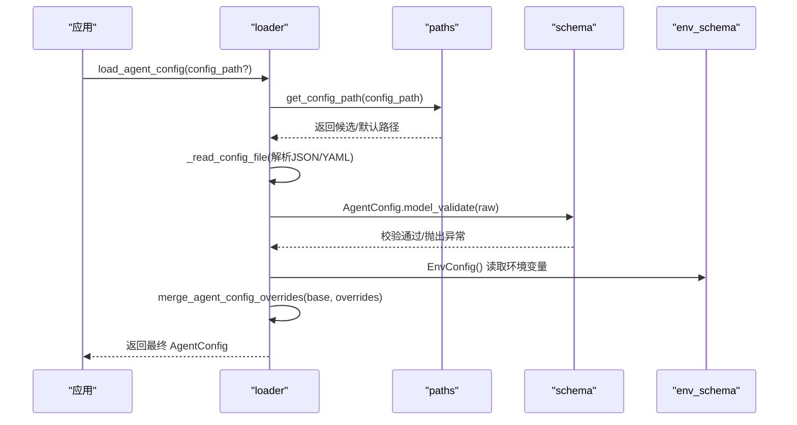
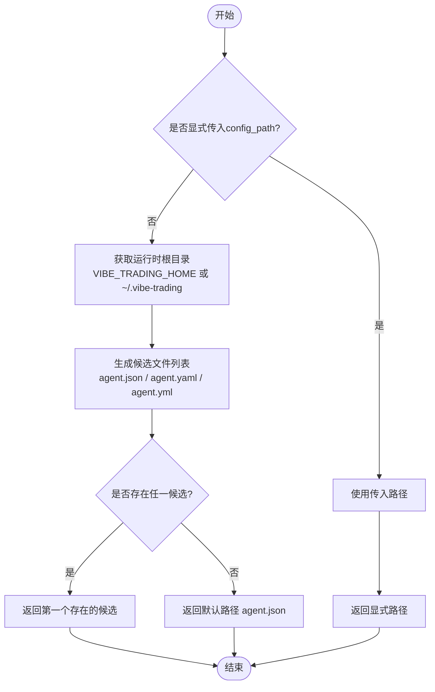
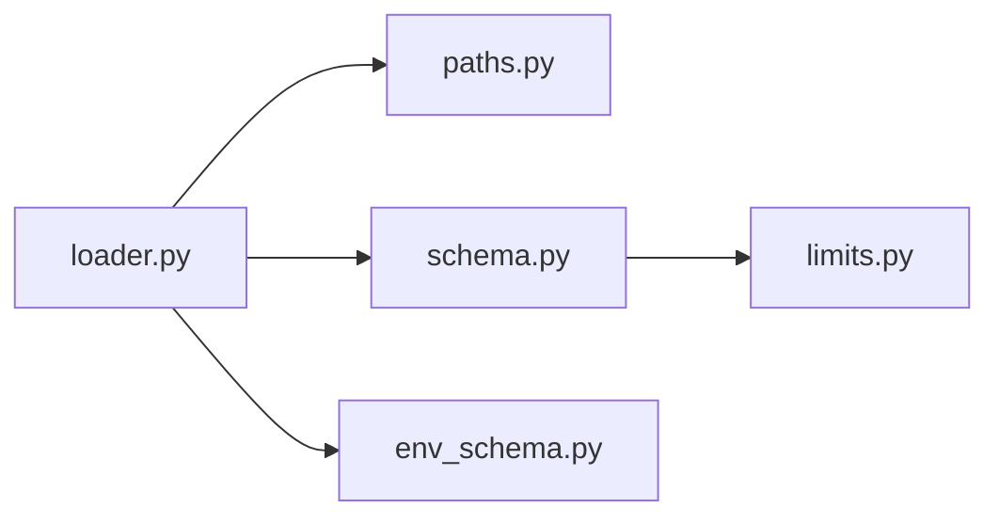

# 配置文件管理

<cite>
**本文引用的文件**
- [agent/src/config/__init__.py](file://agent/src/config/__init__.py)
- [agent/src/config/loader.py](file://agent/src/config/loader.py)
- [agent/src/config/schema.py](file://agent/src/config/schema.py)
- [agent/src/config/env_schema.py](file://agent/src/config/env_schema.py)
- [agent/src/config/paths.py](file://agent/src/config/paths.py)
- [agent/src/config/limits.py](file://agent/src/config/limits.py)
</cite>

## 目录
1. [简介](#简介)
2. [项目结构](#项目结构)
3. [核心组件](#核心组件)
4. [架构总览](#架构总览)
5. [详细组件分析](#详细组件分析)
6. [依赖关系分析](#依赖关系分析)
7. [性能考虑](#性能考虑)
8. [故障排查指南](#故障排查指南)
9. [结论](#结论)
10. [附录：模板与最佳实践](#附录模板与最佳实践)

## 简介
本指南聚焦于 Vibe-Trading Agent 的配置系统，覆盖以下主题：
- 配置文件格式与结构：支持 JSON/YAML，嵌套对象、数组配置项的语义与约束。
- 配置加载优先级：命令行参数 > 环境变量 > 配置文件 > 默认值（通过运行时覆盖与环境变量实现）。
- 配置文件位置查找逻辑：当前工作区/用户目录/系统目录的搜索顺序与回退策略。
- 多环境切换策略与最佳实践：开发、生产环境的配置组织方式。
- 配置验证规则与错误处理机制：基于 Pydantic 的强类型校验、安全限制与可恢复降级。

## 项目结构
配置相关代码集中在 agent/src/config 目录下，按职责拆分：
- loader.py：负责从磁盘读取并解析配置文件，合并运行时覆盖，提供统一的加载入口。
- schema.py：定义结构化配置模型（AgentConfig、MCPServerConfig、ChannelsConfig 等）及业务校验规则。
- env_schema.py：集中声明所有环境变量及其默认值、类型与别名，统一从 os.environ 注入。
- paths.py：定义运行时根目录、配置文件候选路径、数据目录与工作区路径。
- limits.py：工具结果长度限制等运行期常量（与配置使用场景相关）。
- __init__.py：对外暴露配置加载与路径工具函数。

图表来源
- [agent/src/config/loader.py:28-54](file://agent/src/config/loader.py#L28-L54)
- [agent/src/config/paths.py:13-34](file://agent/src/config/paths.py#L13-L34)
- [agent/src/config/env_schema.py:685-716](file://agent/src/config/env_schema.py#L685-L716)

章节来源
- [agent/src/config/__init__.py:1-25](file://agent/src/config/__init__.py#L1-L25)
- [agent/src/config/loader.py:1-346](file://agent/src/config/loader.py#L1-L346)
- [agent/src/config/schema.py:1-513](file://agent/src/config/schema.py#L1-L513)
- [agent/src/config/env_schema.py:1-593](file://agent/src/config/env_schema.py#L1-L593)
- [agent/src/config/paths.py:1-113](file://agent/src/config/paths.py#L1-L113)
- [agent/src/config/limits.py:1-49](file://agent/src/config/limits.py#L1-L49)

## 核心组件
- 配置加载器（loader）
  - 从磁盘读取 JSON/YAML，解析为字典后交由 Pydantic 模型校验。
  - 支持运行时覆盖（overrides），对 MCP 服务器配置进行“传输族”感知合并。
  - 提供 Swarm 专用配置加载路径解析，优先使用环境变量指定路径。
- 配置模型（schema）
  - AgentConfig：顶层配置，包含 mcp_servers 与 channels。
  - MCPServerConfig：单个外部 MCP 服务器的连接、认证、超时、工具白名单等。
  - ChannelsConfig：IM 通道全局设置与操作者白名单。
  - 内置安全校验：禁止在“实盘券商”服务器上使用通配符 enabled_tools=["*"]，除非满足只读探测条件。
- 环境变量配置（env_schema）
  - EnvConfig 聚合 LLM、数据源、API、Swarm、Agent 调优、路径、OCR、记忆系统等子配置。
  - 每个字段带 UPPER_SNAKE_CASE 别名，自动从 os.environ 填充，并提供默认值与类型约束。
- 路径管理（paths）
  - get_runtime_root：决定运行时根目录（~/.vibe-trading 或 VIBE_TRADING_HOME）。
  - get_config_candidates/get_config_path：返回配置文件候选列表与最终生效路径。
  - 其他辅助：sessions/runs/uploads/workspace 等目录定位。

章节来源
- [agent/src/config/loader.py:28-151](file://agent/src/config/loader.py#L28-L151)
- [agent/src/config/schema.py:301-513](file://agent/src/config/schema.py#L301-L513)
- [agent/src/config/env_schema.py:132-593](file://agent/src/config/env_schema.py#L132-L593)
- [agent/src/config/paths.py:13-113](file://agent/src/config/paths.py#L13-L113)

## 架构总览
下图展示了配置加载的整体流程与关键交互点：

图表来源
- [agent/src/config/loader.py:28-151](file://agent/src/config/loader.py#L28-L151)
- [agent/src/config/paths.py:57-87](file://agent/src/config/paths.py#L57-L87)
- [agent/src/config/env_schema.py:685-716](file://agent/src/config/env_schema.py#L685-L716)

## 详细组件分析

### 配置文件格式与结构
- 支持格式
  - JSON：直接解析为字典。
  - YAML/YML：需要安装 PyYAML；若缺失则报错提示。
  - 其他后缀：不支持，将抛出错误。
- 顶层结构
  - mcp_servers：键为服务器标识，值为 MCPServerConfig 对象（type/command/url/auth/enabled_tools 等）。
  - channels：ChannelsConfig，包含 send_progress、operators 等全局通道设置。
- 嵌套对象与数组
  - MCPServerConfig 中的 headers、env、enabled_tools 等为字典/数组。
  - ChannelsConfig 允许额外键（平台特定通道配置），但全局字段受严格约束。
- 字段命名兼容
  - 内部使用 snake_case，对外可通过 camelCase 别名写入（alias_generator + populate_by_name）。

章节来源
- [agent/src/config/loader.py:232-259](file://agent/src/config/loader.py#L232-L259)
- [agent/src/config/schema.py:301-457](file://agent/src/config/schema.py#L301-L457)

### 配置加载优先级
- 运行时覆盖（最高优先级）
  - 通过 merge_agent_config_overrides 将 session 级或调用方传入的 overrides 合并到基础配置。
  - 仅覆盖显式提供的字段，且会再次校验，失败时回退到基础配置。
- 环境变量（次高优先级）
  - EnvConfig 从 os.environ 读取，提供默认值；部分开关影响行为（如 ALLOW_SESSION_MCP_SERVERS）。
- 配置文件（基础配置）
  - 由 loader 从磁盘读取并校验；若不存在或解析失败，回退到默认空配置。
- 默认值（最低优先级）
  - Pydantic 模型默认值与 EnvConfig 默认值共同构成最终兜底。

注意：命令行参数通常通过 API/CLI 层转换为运行时 overrides 传入 loader，因此体现为“运行时覆盖”。

章节来源
- [agent/src/config/loader.py:57-151](file://agent/src/config/loader.py#L57-L151)
- [agent/src/config/env_schema.py:81-124](file://agent/src/config/env_schema.py#L81-L124)

### 配置文件位置查找逻辑
- 运行时根目录
  - 优先使用 VIBE_TRADING_HOME 指定；否则默认 ~/.vibe-trading。
  - 若显式传入 config_path，则以该文件的父目录作为运行时根。
- 配置文件候选顺序
  - 当未显式指定路径时，依次检查：agent.json、agent.yaml、agent.yml。
  - 任一存在即采用；若均不存在，返回推荐默认路径（agent.json）。
- Swarm 专用配置
  - 优先使用 VIBE_TRADING_SWARM_AGENT_CONFIG 指定的绝对路径。
  - 其次尝试 <runtime_root>/swarm-agent.json。
  - 最后回退到主配置的常见文件名。

图表来源
- [agent/src/config/paths.py:13-87](file://agent/src/config/paths.py#L13-L87)
- [agent/src/config/loader.py:154-201](file://agent/src/config/loader.py#L154-L201)

章节来源
- [agent/src/config/paths.py:13-87](file://agent/src/config/paths.py#L13-L87)
- [agent/src/config/loader.py:154-201](file://agent/src/config/loader.py#L154-L201)

### 配置验证规则与安全限制
- 传输族校验
  - stdio：必须提供 command，不允许 url/headers/auth。
  - sse/streamableHttp：必须提供 url，不允许 command/args/env；若使用 auth，则必须 HTTPS。
- 实盘券商限制
  - 对 robinhood、ibkr 等“实盘券商”服务器，禁止使用 enabled_tools=["*"]，除非满足只读探测条件（例如 IBKR 仅请求 mcp.read 且无写权限）。
  - 违规将抛出 ValueError，阻止危险配置生效。
- 会话级注入防护
  - 来自 API 调用方的 session overrides 中，mcpServers/mcp_servers 会被剥离，除非设置 ALLOW_SESSION_MCP_SERVERS=1。
- 字段类型与范围
  - 数值字段具备范围约束（如 tool_timeout >= 0.1）。
  - 布尔型环境变量支持多种字符串表示（true/false/on/off/1/0 等）。

章节来源
- [agent/src/config/schema.py:349-493](file://agent/src/config/schema.py#L349-L493)
- [agent/src/config/loader.py:107-134](file://agent/src/config/loader.py#L107-L134)

### 配置合并与覆盖策略
- 非 MCP 字段：完全覆盖。
- mcp_servers：
  - 若覆盖为 dict，则按服务器名逐项合并；若覆盖为标量，则整体替换。
  - 单项服务器合并时，若检测到“传输族切换”，会重置不兼容字段，再合并。
- 递归合并：嵌套字典逐层合并，避免意外覆盖。

章节来源
- [agent/src/config/loader.py:262-345](file://agent/src/config/loader.py#L262-L345)

## 依赖关系分析
- loader 依赖 paths 确定文件位置，依赖 schema 进行模型校验，依赖 env_schema 读取环境变量。
- schema 定义强类型与业务规则，被 loader 用于最终装配。
- env_schema 提供统一的环境变量入口，避免散落的全局读取。
- limits 提供运行期常量，供工具输出截断等场景使用。

图表来源
- [agent/src/config/loader.py:1-15](file://agent/src/config/loader.py#L1-L15)
- [agent/src/config/schema.py:1-16](file://agent/src/config/schema.py#L1-L16)
- [agent/src/config/env_schema.py:1-40](file://agent/src/config/env_schema.py#L1-L40)
- [agent/src/config/paths.py:1-11](file://agent/src/config/paths.py#L1-L11)

章节来源
- [agent/src/config/loader.py:1-15](file://agent/src/config/loader.py#L1-L15)
- [agent/src/config/schema.py:1-16](file://agent/src/config/schema.py#L1-L16)
- [agent/src/config/env_schema.py:1-40](file://agent/src/config/env_schema.py#L1-L40)
- [agent/src/config/paths.py:1-11](file://agent/src/config/paths.py#L1-L11)

## 性能考虑
- 配置文件读取与解析仅在启动或会话初始化时执行，开销较小。
- 使用 Pydantic 模型校验带来类型安全与快速失败，有助于减少后续错误分支。
- 递归合并字典可能随配置规模增长而增加 CPU 消耗，建议保持配置精简。
- 工具结果截断（limits）避免大响应阻塞模型上下文，提升整体吞吐。

[本节为通用指导，不直接分析具体文件]

## 故障排查指南
- 无法找到配置文件
  - 检查 VIBE_TRADING_HOME 是否指向正确目录。
  - 确认候选文件 agent.json/agent.yaml/agent.yml 是否存在。
- YAML 解析失败
  - 确保已安装 PyYAML；否则会提示缺少依赖。
  - 检查 YAML 语法是否正确。
- 配置校验失败
  - 查看 ValidationError 详情，修正字段类型或范围。
  - 对于实盘券商服务器，避免使用 enabled_tools=["*"]，改为明确列出只读工具。
- 会话级注入被拒绝
  - 如需允许 session 级注入 mcpServers，需设置 ALLOW_SESSION_MCP_SERVERS=1。
- 环境变量未生效
  - 确认环境变量名称与别名一致（UPPER_SNAKE_CASE）。
  - 检查 EnvConfig 对应字段是否设置了默认值或被覆盖。

章节来源
- [agent/src/config/loader.py:28-54](file://agent/src/config/loader.py#L28-L54)
- [agent/src/config/schema.py:349-493](file://agent/src/config/schema.py#L349-L493)
- [agent/src/config/env_schema.py:81-124](file://agent/src/config/env_schema.py#L81-L124)

## 结论
该配置系统通过分层加载（运行时覆盖 > 环境变量 > 配置文件 > 默认值）、严格的类型与业务校验、以及安全的传输族与实盘券商限制，提供了健壮、可扩展且安全的配置管理能力。配合清晰的路径查找逻辑与多环境切换策略，可满足开发与生产环境的差异化需求。

[本节为总结性内容，不直接分析具体文件]

## 附录：模板与最佳实践

### 配置文件模板
- 基本结构（JSON）
  - 顶层包含 mcp_servers 与 channels。
  - mcp_servers 下每个条目指定 type、command/url、auth、enabled_tools 等。
- 示例要点
  - stdio 传输：提供 command 与可选 args/env。
  - HTTP 传输：提供 url 与 type（sse/streamableHttp），必要时配置 OAuth。
  - 通道设置：send_progress、operators 等。

章节来源
- [agent/src/config/schema.py:301-457](file://agent/src/config/schema.py#L301-L457)

### 多环境切换策略
- 开发环境
  - 使用本地 stdio 服务器或测试 URL，开启更多调试日志。
  - 通过环境变量启用沙箱或受限模式。
- 生产环境
  - 使用 HTTPS 与 OAuth 的远程 MCP 服务器。
  - 严格限制 enabled_tools，禁止通配符。
  - 通过 VIBE_TRADING_HOME 隔离不同部署的用户目录。
- 切换方式
  - 通过命令行参数传入 overrides（最高优先级）。
  - 或通过环境变量调整行为（如 ALLOW_SESSION_MCP_SERVERS）。
  - 或使用不同的配置文件路径（VIBE_TRADING_SWARM_AGENT_CONFIG 等）。

章节来源
- [agent/src/config/loader.py:154-201](file://agent/src/config/loader.py#L154-L201)
- [agent/src/config/env_schema.py:522-540](file://agent/src/config/env_schema.py#L522-L540)

### 最佳实践
- 始终使用 Pydantic 模型定义的字段名（snake_case 或 camelCase 别名）。
- 对实盘券商服务器，明确列出只读工具，避免通配符。
- 使用环境变量管理敏感信息（密钥、URL、端口等）。
- 通过运行时覆盖实现细粒度控制，避免频繁修改磁盘配置。
- 定期审查配置变更，确保符合安全策略与业务需求。

[本节为通用指导，不直接分析具体文件]