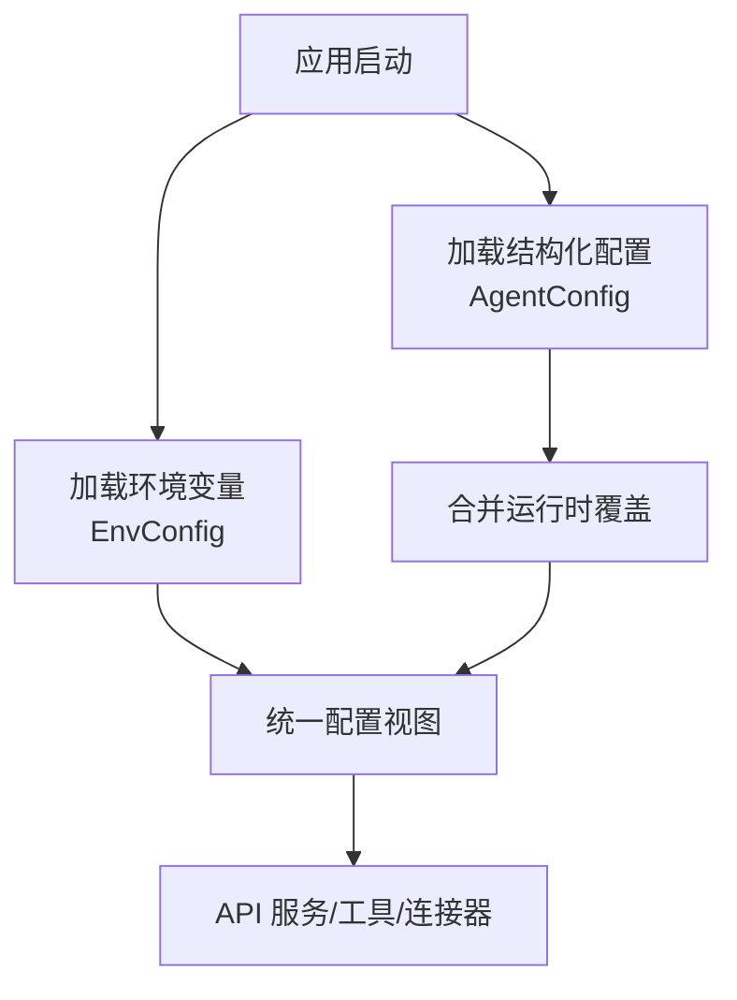
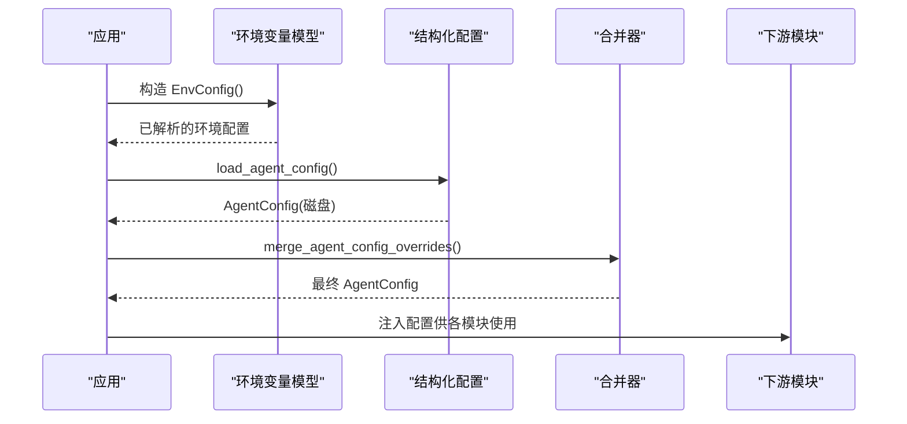
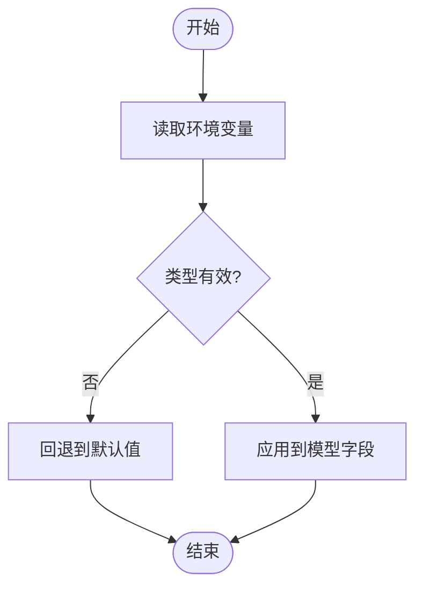
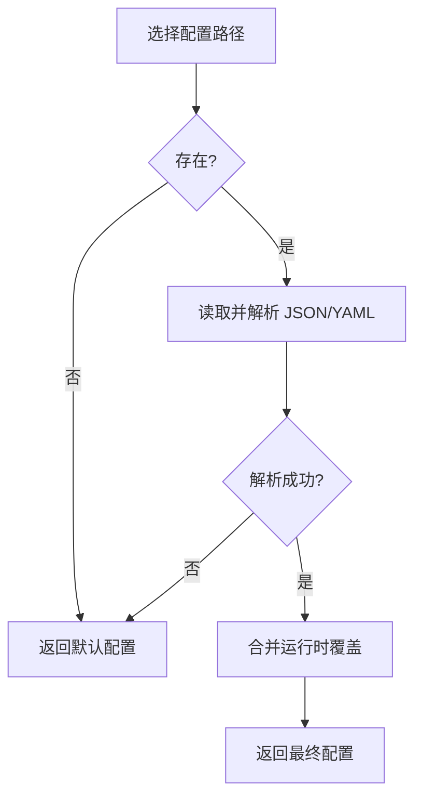
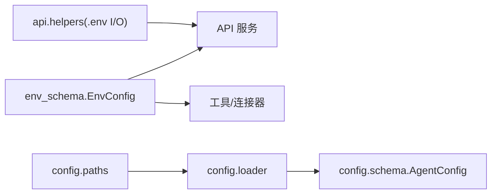

# 配置设置

<cite>
**本文引用的文件**
- [env_schema.py](file://agent/src/config/env_schema.py)
- [loader.py](file://agent/src/config/loader.py)
- [schema.py](file://agent/src/config/schema.py)
- [paths.py](file://agent/src/config/paths.py)
- [helpers.py](file://agent/src/api/helpers.py)
- [api_server.py](file://agent/api_server.py)
- [test_settings_api.py](file://agent/tests/test_settings_api.py)
</cite>

## 目录
1. [简介](#简介)
2. [项目结构](#项目结构)
3. [核心组件](#核心组件)
4. [架构总览](#架构总览)
5. [详细组件分析](#详细组件分析)
6. [依赖关系分析](#依赖关系分析)
7. [性能考虑](#性能考虑)
8. [故障排查指南](#故障排查指南)
9. [结论](#结论)
10. [附录](#附录)

## 简介
本指南聚焦 Vibe-Trading 的配置体系，覆盖环境变量、配置文件与默认值的优先级；API 密钥管理（OpenAI、Tushare、Yahoo Finance 等数据源）、数据库连接、服务器端口与安全；并提供不同环境的最佳实践、验证方法与常用示例路径，帮助开发者快速、安全地上手。

## 项目结构
Vibe-Trading 的配置由“环境变量 + 结构化配置文件 + 运行时覆盖”三层组成：
- 环境变量：集中定义于 Pydantic 模型中，提供类型校验、默认值与环境读取。
- 结构化配置文件：JSON/YAML，位于用户运行时根目录（默认 ~/.vibe-trading），支持 agent.json / agent.yaml / agent.yml。
- 运行时覆盖：会话级或进程级覆盖，用于在不修改磁盘文件的情况下临时调整行为。

图表来源
- [env_schema.py:685-716](file://agent/src/config/env_schema.py#L685-L716)
- [loader.py:28-55](file://agent/src/config/loader.py#L28-L55)
- [loader.py:137-151](file://agent/src/config/loader.py#L137-L151)
- [paths.py:13-34](file://agent/src/config/paths.py#L13-L34)

章节来源
- [env_schema.py:1-593](file://agent/src/config/env_schema.py#L1-L593)
- [loader.py:1-346](file://agent/src/config/loader.py#L1-L346)
- [paths.py:1-113](file://agent/src/config/paths.py#L1-L113)

## 核心组件
- 环境变量模型 EnvConfig：集中声明所有受支持的变量名、类型、默认值与别名，自动从 os.environ 读取并做类型转换与校验。
- 结构化配置 AgentConfig：描述 MCP 服务器、通道等高级能力，支持 JSON/YAML 与运行时覆盖。
- 路径与运行时根 get_runtime_root：决定配置与数据存放位置，可通过环境变量覆盖。
- API 助手 helpers：负责 .env 文件的原子写入、权限控制与读取。

章节来源
- [env_schema.py:685-716](file://agent/src/config/env_schema.py#L685-L716)
- [schema.py:301-513](file://agent/src/config/schema.py#L301-L513)
- [paths.py:13-34](file://agent/src/config/paths.py#L13-L34)
- [helpers.py:73-133](file://agent/src/api/helpers.py#L73-L133)

## 架构总览
配置加载与使用流程如下：

图表来源
- [env_schema.py:685-716](file://agent/src/config/env_schema.py#L685-L716)
- [loader.py:28-55](file://agent/src/config/loader.py#L28-L55)
- [loader.py:57-100](file://agent/src/config/loader.py#L57-L100)

## 详细组件分析

### 环境变量与优先级
- 单一真相源：所有环境变量在 env_schema.py 中以 Pydantic 模型集中定义，字段带 alias（大写环境名）与默认值。
- 读取顺序：
  1) 显式构造参数（最高优先级）
  2) 环境变量（通过 alias 映射）
  3) 字段默认值
- 布尔值解析：支持多种字符串形式（如 true/false/on/off/1/0）。
- 兼容处理：部分旧变量名会被迁移到新字段并记录警告。

图表来源
- [env_schema.py:48-74](file://agent/src/config/env_schema.py#L48-L74)
- [env_schema.py:81-124](file://agent/src/config/env_schema.py#L81-L124)
- [env_schema.py:295-318](file://agent/src/config/env_schema.py#L295-L318)

章节来源
- [env_schema.py:1-593](file://agent/src/config/env_schema.py#L1-L593)

### 结构化配置文件与运行时覆盖
- 配置文件位置：默认在运行时根目录（~/.vibe-trading），候选文件名 agent.json / agent.yaml / agent.yml。
- 格式支持：JSON 与 YAML（需安装 PyYAML）。
- 加载策略：不存在则返回空配置；解析失败则降级为默认配置并记录日志。
- 运行时覆盖：merge_agent_config_overrides 将会话级覆盖合并到基础配置，仅覆盖指定字段。
- 安全限制：会话覆盖默认剥离 mcpServers/mcp_servers 等高风险键，除非显式允许。

图表来源
- [paths.py:57-87](file://agent/src/config/paths.py#L57-L87)
- [loader.py:28-55](file://agent/src/config/loader.py#L28-L55)
- [loader.py:57-100](file://agent/src/config/loader.py#L57-L100)
- [loader.py:107-134](file://agent/src/config/loader.py#L107-L134)

章节来源
- [loader.py:1-346](file://agent/src/config/loader.py#L1-L346)
- [paths.py:1-113](file://agent/src/config/paths.py#L1-L113)

### API 密钥与数据源配置
- LLM 提供商：通过 LLMConfig 的字段（如 LANGCHAIN_PROVIDER、LANGCHAIN_MODEL_NAME、TIMEOUT_SECONDS、MAX_RETRIES 等）配置。
- 数据源密钥：DataConfig 包含 TUSHARE_TOKEN、FINNHUB_API_KEY、ALPHAVANTAGE_API_KEY、TIINGO_API_KEY、FMP_API_KEY、FRED_API_KEY、QVERIS_API_KEY、DASHSCOPE_API_KEY、LONGBRIDGE_*、ETORO_* 等。
- API 鉴权：APIConfig 中的 API_AUTH_KEY（亦支持 VIBE_TRADING_API_KEY 别名）用于 Web UI 与远程访问鉴权；CORS_ORIGINS、VIBE_TRADING_EXTRA_CORS_ORIGINS、API_ALLOWED_HOSTS 控制跨域与主机白名单。
- 运行子进程隔离：生成的回测代码仅传递只读市场数据密钥（如 TUSHARE_TOKEN、FMP_API_KEY、FRED_API_KEY、VIBE_TRADING_IWENCAI_KEY），不传递 LLM 密钥、API 鉴权、shell 开关、交易秘密等。

章节来源
- [env_schema.py:132-214](file://agent/src/config/env_schema.py#L132-L214)
- [env_schema.py:326-375](file://agent/src/config/env_schema.py#L326-L375)
- [README.md:1433-1433](file://README.md#L1433-L1433)

### 数据库与持久化路径
- 运行时根目录：get_runtime_root 决定状态与配置根路径，可通过 VIBE_TRADING_HOME 覆盖。
- 数据目录：get_data_dir 会创建并返回配置所在目录，用于存放会话、运行产物、上传文件等。
- 工作区：get_workspace_path 提供通道适配器持久化状态的工作目录。

章节来源
- [paths.py:13-34](file://agent/src/config/paths.py#L13-L34)
- [paths.py:90-113](file://agent/src/config/paths.py#L90-L113)

### 服务器端口与安全
- 绑定与监听：API 服务默认在本地回环地址绑定，便于本地开发；如需网络暴露，应设置强 API_AUTH_KEY 并通过 Authorization 头访问。
- CORS 与主机白名单：通过 CORS_ORIGINS、VIBE_TRADING_EXTRA_CORS_ORIGINS、API_ALLOWED_HOSTS、VIBE_TRADING_MCP_ALLOWED_HOSTS 精细控制。
- Docker 信任：VIBE_TRADING_TRUST_DOCKER_LOOPBACK=1 可信任 Docker Desktop 的主机网关回环地址。
- 内容安全策略：VIBE_TRADING_CSP_REPORT_ONLY 可将 CSP 设置为报告模式以兼容额外资源。

章节来源
- [env_schema.py:326-375](file://agent/src/config/env_schema.py#L326-L375)
- [api_server.py:166-185](file://agent/api_server.py#L166-L185)

### 敏感信息管理
- .env 文件：位于 ~/.vibe-trading/.env，由 Web UI 设置写入时采用原子写入与 0600 权限，避免半写与泄露。
- 读取与展示：Settings 接口对敏感信息做脱敏显示，且仅在配置了 API_AUTH_KEY 时要求认证。
- 安全建议：
  - 不要将密钥提交至版本库；使用 .env 或系统级密钥管理服务。
  - 生产环境启用 API_AUTH_KEY，并限制 CORS 与主机白名单。
  - 容器内若只读根文件系统，写入会降级为原地写入但仍保持 0600。

章节来源
- [helpers.py:73-133](file://agent/src/api/helpers.py#L73-L133)
- [test_settings_api.py:452-592](file://agent/tests/test_settings_api.py#L452-L592)

### 不同环境的配置模板与实践
- 开发环境
  - 本地运行即可，无需 API_AUTH_KEY；如需从其他机器访问，请设置 API_AUTH_KEY 并在浏览器 Settings 中输入一次。
  - 可使用默认数据源（如 AKShare）减少外部依赖。
- 测试环境
  - 建议使用最小必要的数据源密钥（如 TUSHARE_TOKEN、FMP_API_KEY），关闭非必要功能开关。
  - 使用独立的 VIBE_TRADING_HOME 隔离数据与配置。
- 生产环境
  - 必须设置强 API_AUTH_KEY；严格配置 CORS_ORIGINS 与 API_ALLOWED_HOSTS。
  - 仅开放必要的只读数据源密钥给生成代码；禁用 shell 工具与不必要的通道。
  - 使用 HTTPS 与反向代理，确保 OAuth 传输安全。

[本节为概念性指导，不直接分析具体文件]

### 配置验证工具与常用示例
- 验证入口
  - 环境变量：通过 EnvConfig() 实例化进行类型与默认值校验。
  - 配置文件：load_agent_config 会在解析失败时降级并记录日志，便于定位问题。
  - 运行时覆盖：merge_agent_config_overrides 会先按部分模型校验再合并。
- 常用示例路径
  - 环境变量示例：参考 README 中的环境变量表与示例片段。
  - 结构化配置：在 ~/.vibe-trading 下创建 agent.json 或 agent.yaml，按需填写 mcpServers、channels 等。
  - .env 示例：项目内提供 .env.example，可在 Web UI Settings 中一键生成或编辑。

章节来源
- [env_schema.py:685-716](file://agent/src/config/env_schema.py#L685-L716)
- [loader.py:28-55](file://agent/src/config/loader.py#L28-L55)
- [loader.py:57-100](file://agent/src/config/loader.py#L57-L100)
- [helpers.py:127-133](file://agent/src/api/helpers.py#L127-L133)

## 依赖关系分析
配置子系统的关键依赖关系如下：

图表来源
- [env_schema.py:685-716](file://agent/src/config/env_schema.py#L685-L716)
- [loader.py:28-55](file://agent/src/config/loader.py#L28-L55)
- [schema.py:301-513](file://agent/src/config/schema.py#L301-L513)
- [paths.py:13-34](file://agent/src/config/paths.py#L13-L34)
- [helpers.py:73-133](file://agent/src/api/helpers.py#L73-L133)

章节来源
- [env_schema.py:1-593](file://agent/src/config/env_schema.py#L1-L593)
- [loader.py:1-346](file://agent/src/config/loader.py#L1-L346)
- [schema.py:1-513](file://agent/src/config/schema.py#L1-L513)
- [paths.py:1-113](file://agent/src/config/paths.py#L1-L113)
- [helpers.py:1-200](file://agent/src/api/helpers.py#L1-L200)

## 性能考虑
- 环境变量解析：Pydantic 的 BeforeValidator 与 model_validator 在初始化时执行，开销极低，适合全局配置。
- 配置文件加载：仅在启动或需要时加载，解析失败会快速降级，不影响主流程。
- 运行时覆盖：仅合并变更字段，避免全量替换带来的不必要开销。
- .env 写入：原子写入与权限控制带来少量 I/O 开销，但保障安全性与一致性。

[本节提供一般性指导，不直接分析具体文件]

## 故障排查指南
- 无法读取环境变量
  - 检查变量名是否匹配 env_schema 中的 alias（通常为大写下划线命名）。
  - 确认布尔值是否为支持的字符串形式。
- 配置文件解析失败
  - 检查文件格式（JSON/YAML）与语法。
  - 查看日志中的警告与调试信息，确认是否回退到默认配置。
- 运行时覆盖被忽略
  - 检查是否包含受限键（如 mcpServers），必要时显式允许。
- .env 写入失败或权限异常
  - 确认目标目录可写；若为只读容器卷，会降级为原地写入但仍保持 0600。
  - 检查是否存在残留临时文件，清理后重试。
- 远程访问被拒绝
  - 未设置 API_AUTH_KEY 时，非本地客户端访问敏感端点会返回 403；请设置密钥或在本地访问。
  - 检查 CORS_ORIGINS 与 API_ALLOWED_HOSTS 是否正确。

章节来源
- [loader.py:28-55](file://agent/src/config/loader.py#L28-L55)
- [loader.py:107-134](file://agent/src/config/loader.py#L107-L134)
- [helpers.py:73-133](file://agent/src/api/helpers.py#L73-L133)
- [test_settings_api.py:452-592](file://agent/tests/test_settings_api.py#L452-L592)

## 结论
Vibe-Trading 的配置体系以环境变量为核心、结构化配置文件为扩展、运行时覆盖为灵活补充，配合严格的类型校验与安全机制，既满足开发便捷性，又保障生产安全性。遵循本文的最佳实践与排障步骤，可快速搭建稳定可靠的配置环境。

## 附录
- 环境变量分组速查
  - LLM：LANGCHAIN_PROVIDER、LANGCHAIN_MODEL_NAME、TIMEOUT_SECONDS、MAX_RETRIES 等。
  - 数据源：TUSHARE_TOKEN、FINNHUB_API_KEY、ALPHAVANTAGE_API_KEY、TIINGO_API_KEY、FMP_API_KEY、FRED_API_KEY、QVERIS_API_KEY、DASHSCOPE_API_KEY、LONGBRIDGE_*、ETORO_*。
  - API 与服务：API_AUTH_KEY、CORS_ORIGINS、API_ALLOWED_HOSTS、VIBE_TRADING_EXTRA_CORS_ORIGINS、VIBE_TRADING_MCP_ALLOWED_HOSTS、VIBE_TRADING_TRUST_DOCKER_LOOPBACK、VIBE_TRADING_CSP_REPORT_ONLY。
- 配置文件位置
  - 运行时根：~/.vibe-trading（可通过 VIBE_TRADING_HOME 覆盖）。
  - 配置文件：agent.json / agent.yaml / agent.yml。
  - 环境变量文件：~/.vibe-trading/.env（由 Web UI 设置写入，权限 0600）。

[本节为概念性汇总，不直接分析具体文件]