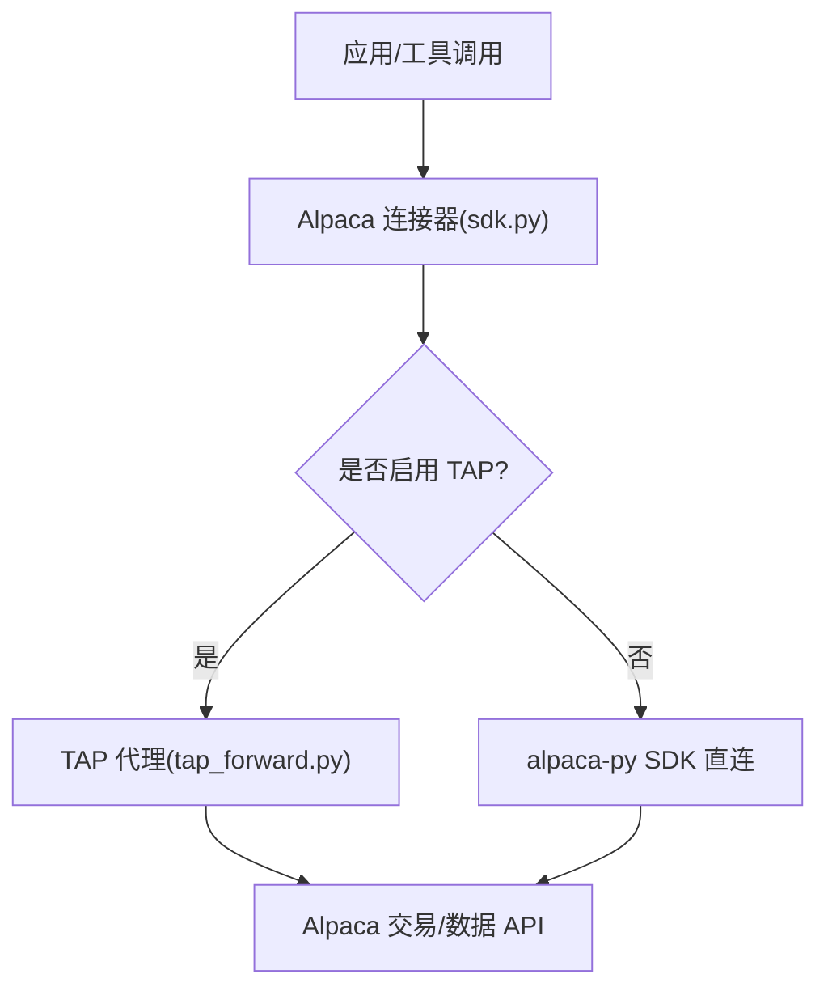
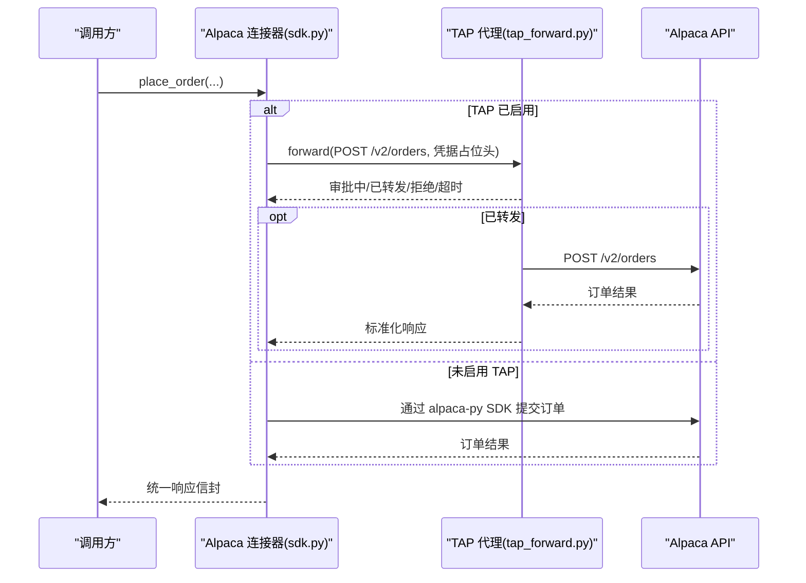
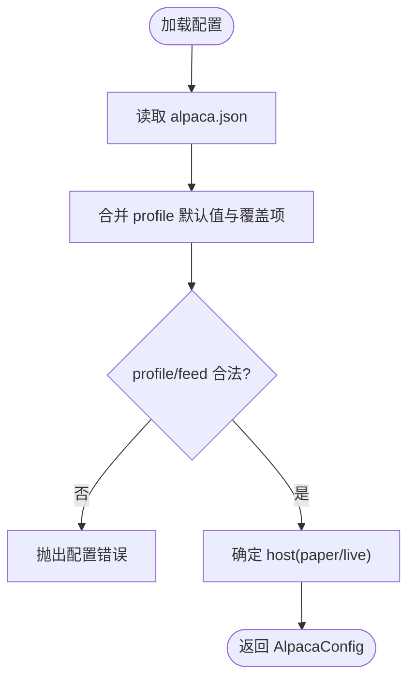
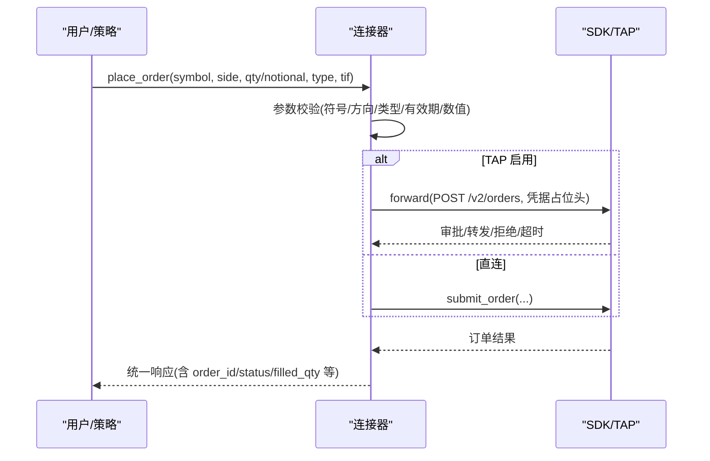
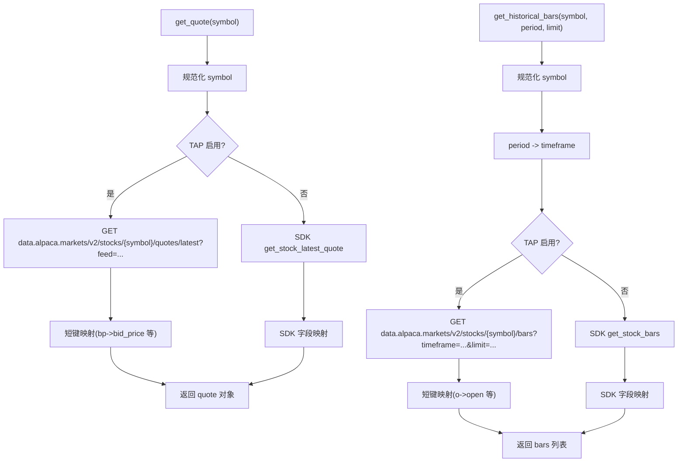
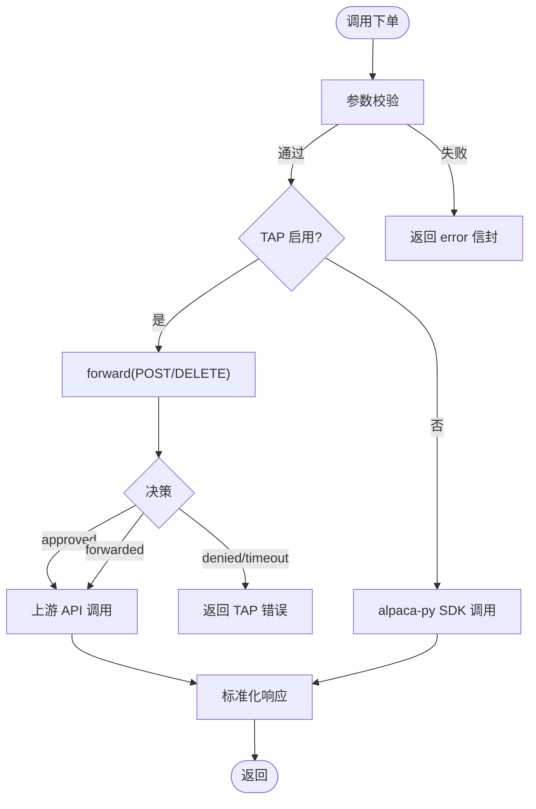
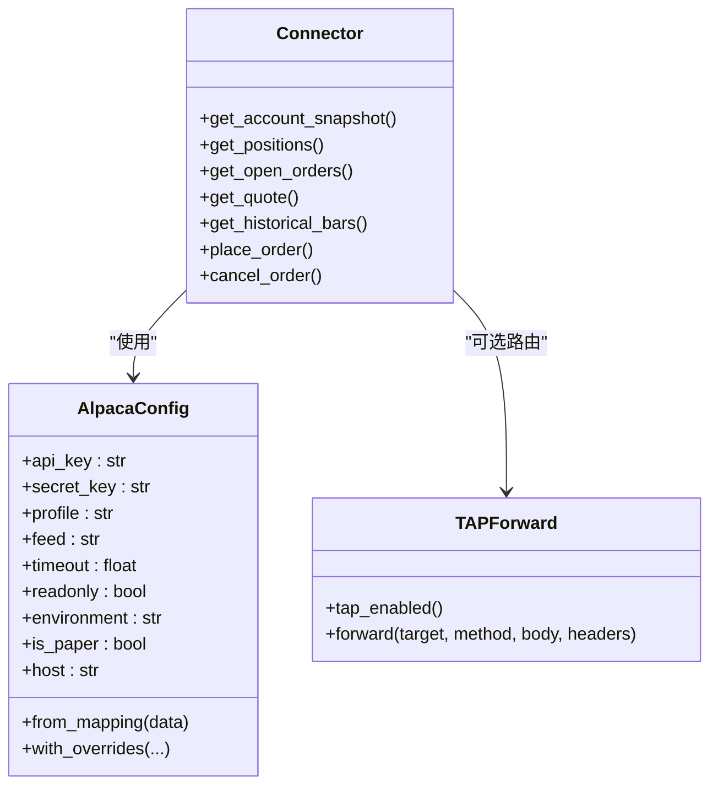

# Alpaca 连接器

<cite>
**本文引用的文件**
- [sdk.py](file://agent/src/trading/connectors/alpaca/sdk.py)
- [profiles.py](file://agent/src/trading/connectors/alpaca/profiles.py)
- [classification.py](file://agent/src/trading/connectors/alpaca/classification.py)
- [__init__.py](file://agent/src/trading/connectors/alpaca/__init__.py)
- [tap_forward.py](file://agent/src/trading/tap_forward.py)
- [test_alpaca_tap_routing.py](file://agent/tests/test_alpaca_tap_routing.py)
</cite>

## 目录
1. [简介](#简介)
2. [项目结构](#项目结构)
3. [核心组件](#核心组件)
4. [架构总览](#架构总览)
5. [详细组件分析](#详细组件分析)
6. [依赖关系分析](#依赖关系分析)
7. [性能与可靠性](#性能与可靠性)
8. [故障排查指南](#故障排查指南)
9. [结论](#结论)
10. [附录](#附录)

## 简介
本技术文档面向使用 Vibe-Trading 的开发者，系统性说明 Alpaca 连接器的实现与用法，覆盖：
- API 认证配置与环境变量（含可选 TAP 代理模式）
- 美股交易能力：下单、订单管理、账户查询
- 市场数据获取：实时报价、历史 K 线等
- 支持的订单类型与参数约束
- 开发/生产环境部署建议（沙箱与正式环境）
- 错误处理与重试机制
- 实际示例与性能优化建议

## 项目结构
Alpaca 连接器位于 agent 模块下的 trading/connectors/alpaca 目录，核心由以下文件组成：
- sdk.py：连接器主实现，封装账户、持仓、订单、行情等读写接口，并支持可选 TAP 代理路由
- profiles.py：内置 profile（纸盘/实盘、只读/可交易）
- classification.py：对 SDK 操作进行读/写分类，配合安全门控
- __init__.py：模块级说明与定位
- tap_forward.py：TAP 代理转发器，负责凭据隔离、人工审批、目标主机白名单校验

图表来源
- [sdk.py:1-20](file://agent/src/trading/connectors/alpaca/sdk.py#L1-L20)
- [tap_forward.py:1-22](file://agent/src/trading/tap_forward.py#L1-L22)

章节来源
- [sdk.py:1-20](file://agent/src/trading/connectors/alpaca/sdk.py#L1-L20)
- [profiles.py:1-71](file://agent/src/trading/connectors/alpaca/profiles.py#L1-L71)
- [classification.py:1-26](file://agent/src/trading/connectors/alpaca/classification.py#L1-L26)
- [__init__.py:1-14](file://agent/src/trading/connectors/alpaca/__init__.py#L1-L14)
- [tap_forward.py:1-22](file://agent/src/trading/tap_forward.py#L1-L22)

## 核心组件
- 配置模型与解析
  - AlpacaConfig：包含 api_key、secret_key、profile、feed、timeout、readonly 等字段；提供 from_mapping/with_overrides/environment/host/is_paper 等方法
  - build_config/load_config/save_config：从运行时根目录读取 alpaca.json，合并 profile 默认值与 CLI 覆盖项，并以 0o600 权限持久化
- 账户与订单
  - get_account_snapshot/get_positions/get_open_orders：读取账户摘要、当前持仓、未成交/已成交订单
  - place_order/cancel_order：下单与取消订单，输入严格校验，失败返回结构化错误
- 市场数据
  - get_quote/get_historical_bars：最新报价与历史 K 线，支持 feed 切换（iex/sip），时间粒度映射到 Alpaca REST 或 SDK TimeFrame
- TAP 代理路由（可选）
  - 当环境变量 TAP_PROXY_URL + TAP_AGENT_KEY 存在时，所有出站请求经 TAP 转发，凭据以占位符形式注入，写入类操作需人工审批
  - 读取类 GET 自动通过，写入类 POST/DELETE 阻塞等待审批
- 安全分类
  - classification.py 将 SDK 方法标记为 READ/WRITE，配合上层“指令授权”策略，防止误用

章节来源
- [sdk.py:67-153](file://agent/src/trading/connectors/alpaca/sdk.py#L67-L153)
- [sdk.py:263-366](file://agent/src/trading/connectors/alpaca/sdk.py#L263-L366)
- [sdk.py:396-455](file://agent/src/trading/connectors/alpaca/sdk.py#L396-L455)
- [sdk.py:429-577](file://agent/src/trading/connectors/alpaca/sdk.py#L429-L577)
- [sdk.py:712-792](file://agent/src/trading/connectors/alpaca/sdk.py#L712-L792)
- [classification.py:12-25](file://agent/src/trading/connectors/alpaca/classification.py#L12-L25)
- [tap_forward.py:99-188](file://agent/src/trading/tap_forward.py#L99-L188)

## 架构总览
Alpaca 连接器采用“双路径”设计：
- 直连路径：直接调用 alpaca-py SDK（TradingClient/StockHistoricalDataClient）访问交易与数据 API
- TAP 路径：通过 TAP 代理转发，凭据隔离、目标主机白名单、人工审批保障安全

图表来源
- [sdk.py:429-577](file://agent/src/trading/connectors/alpaca/sdk.py#L429-L577)
- [tap_forward.py:105-188](file://agent/src/trading/tap_forward.py#L105-L188)

## 详细组件分析

### 认证与配置
- 配置文件位置与格式
  - 运行时根目录下 alpaca.json，键包括 api_key、secret_key、profile、feed、timeout、readonly
  - 保存时使用 0o600 权限，避免密钥泄露
- Profile 与环境
  - profile 取值 paper/live-readonly/live；environment 派生自 profile；host 根据 is_paper 选择 paper-api.alpaca.markets 或 api.alpaca.markets
  - feed 取值 iex（免费）或 sip（付费），影响数据源
- TAP 环境变量
  - TAP_PROXY_URL：TAP 代理地址
  - TAP_AGENT_KEY：TAP 代理鉴权密钥
  - TAP_ALPACA_CREDENTIAL：可选，指定凭据名称（默认 alpaca），用于构造 <CREDENTIAL:...> 占位头
  - TAP_APPROVAL_TIMEOUT：审批轮询超时秒数（默认 300）

图表来源
- [sdk.py:87-153](file://agent/src/trading/connectors/alpaca/sdk.py#L87-L153)
- [sdk.py:156-181](file://agent/src/trading/connectors/alpaca/sdk.py#L156-L181)

章节来源
- [sdk.py:67-153](file://agent/src/trading/connectors/alpaca/sdk.py#L67-L153)
- [sdk.py:156-181](file://agent/src/trading/connectors/alpaca/sdk.py#L156-L181)
- [tap_forward.py:39-96](file://agent/src/trading/tap_forward.py#L39-L96)
- [tap_forward.py:219-224](file://agent/src/trading/tap_forward.py#L219-L224)

### 美股交易功能
- 账户查询
  - get_account_snapshot：返回账户号、状态、币种、现金、权益、购买力、组合价值、是否日内交易者、是否被限制交易
- 持仓查询
  - get_positions：返回当前持仓列表（数量、成本、市值、浮动盈亏等）
- 订单管理
  - get_open_orders：查询未成交订单，可选 include_executions 返回已成交执行记录
  - place_order：下单，支持 quantity 或 notional（二选一），order_type 支持 market/limit，time_in_force 支持 day/gtc
  - cancel_order：按 order_id 取消订单
- 订单类型与约束
  - 市价单：无需 limit_price
  - 限价单：必须提供 limit_price
  - 数量/金额：quantity 与 notional 互斥且必须为正数
  - 买卖方向：buy/sell
  - 有效期：day（当日有效）/ gtc（撤单前有效）

图表来源
- [sdk.py:429-577](file://agent/src/trading/connectors/alpaca/sdk.py#L429-L577)
- [tap_forward.py:105-188](file://agent/src/trading/tap_forward.py#L105-L188)

章节来源
- [sdk.py:301-366](file://agent/src/trading/connectors/alpaca/sdk.py#L301-L366)
- [sdk.py:429-577](file://agent/src/trading/connectors/alpaca/sdk.py#L429-L577)
- [sdk.py:712-792](file://agent/src/trading/connectors/alpaca/sdk.py#L712-L792)

### 市场数据获取
- 实时报价
  - get_quote：返回 bid/ask/bid_size/ask_size/time，feed 由配置决定（iex/sip）
- 历史 K 线
  - get_historical_bars：period 支持 1m/5m/15m/30m/1h/4h/1w/1M 等，映射到 Alpaca REST timeframe 或 SDK TimeFrame；limit 控制条数
- 公司基本面信息
  - 当前连接器未暴露公司基本面接口；如需可通过外部数据源或扩展连接器实现

图表来源
- [sdk.py:396-455](file://agent/src/trading/connectors/alpaca/sdk.py#L396-L455)

章节来源
- [sdk.py:396-455](file://agent/src/trading/connectors/alpaca/sdk.py#L396-L455)

### 订单类型支持与使用方法
- 市价单（market）：不设置 limit_price，适合快速成交
- 限价单（limit）：必须设置 limit_price，价格优于等于指定价才成交
- 有效期（time_in_force）：
  - day：当日收盘后失效
  - gtc：撤单前一直有效
- 数量/金额：
  - quantity：整数或小数股数
  - notional：美元金额（支持碎股）
- 方向：buy/sell

章节来源
- [sdk.py:429-577](file://agent/src/trading/connectors/alpaca/sdk.py#L429-L577)

### 开发环境与生产环境部署
- 开发（纸盘）
  - 在 alpaca.json 中配置 profile=paper，使用纸盘 key pair
  - 可使用 alpaca-paper-sdk 或 alpaca-paper-trade profile
- 生产（实盘）
  - 配置 profile=live 或 live-readonly（只读）
  - 建议使用 TAP 代理模式，开启人工审批与凭据隔离
  - 确保 TAP 凭据的 allowed_hosts 仅允许 api.alpaca.markets 与 data.alpaca.markets
- 环境变量
  - TAP_PROXY_URL、TAP_AGENT_KEY：启用 TAP 必需
  - TAP_ALPACA_CREDENTIAL：可选，指定凭据名
  - TAP_APPROVAL_TIMEOUT：可选，调整审批超时

章节来源
- [profiles.py:15-71](file://agent/src/trading/connectors/alpaca/profiles.py#L15-L71)
- [tap_forward.py:39-96](file://agent/src/trading/tap_forward.py#L39-L96)
- [sdk.py:44-56](file://agent/src/trading/connectors/alpaca/sdk.py#L44-L56)

### 错误处理与重试机制
- 输入校验失败：place_order 返回 {"status":"error","error": "..."}，不抛异常
- 依赖缺失：未安装 alpaca-py 时，check_status 报告缺失，下单/查询会抛出依赖错误
- TAP 审批失败：
  - denied/timeout/error：返回结构化错误，包含 tap_decision
  - 写入类操作（下单/取消）需人工审批，读取类 GET 自动通过
- 网络异常：
  - TAP 内部 _http 捕获 HTTPError/URLError，返回结构化结果
  - 读取路径在 TAP 错误时抛出 RuntimeError，保持与 SDK 行为一致
- 幂等性：
  - TAP 模式下下单携带确定性 client_order_id（基于订单内容哈希），重复提交会被上游去重，避免重复成交

图表来源
- [sdk.py:429-577](file://agent/src/trading/connectors/alpaca/sdk.py#L429-L577)
- [tap_forward.py:105-188](file://agent/src/trading/tap_forward.py#L105-L188)

章节来源
- [sdk.py:263-298](file://agent/src/trading/connectors/alpaca/sdk.py#L263-L298)
- [sdk.py:597-600](file://agent/src/trading/connectors/alpaca/sdk.py#L597-L600)
- [tap_forward.py:196-211](file://agent/src/trading/tap_forward.py#L196-L211)
- [test_alpaca_tap_routing.py:82-123](file://agent/tests/test_alpaca_tap_routing.py#L82-L123)

### 实际交易示例（步骤）
- 纸盘测试
  - 配置 profile=paper，调用 get_account_snapshot 查看资金与权限
  - 调用 get_quote 获取 AAPL 最新报价
  - 调用 get_historical_bars 拉取日线数据
  - 调用 place_order 提交限价单（例如 buy AAPL, qty=1, limit_price=xxx, time_in_force=gtc）
  - 调用 get_open_orders 查看未成交订单
  - 调用 cancel_order 取消订单
- 实盘上线
  - 配置 profile=live，启用 TAP 代理
  - 在 TAP 中配置 allowed_hosts 仅允许 api.alpaca.markets 与 data.alpaca.markets
  - 通过 TAP 审批流程完成下单/取消

章节来源
- [sdk.py:299-426](file://agent/src/trading/connectors/alpaca/sdk.py#L299-L426)
- [sdk.py:429-577](file://agent/src/trading/connectors/alpaca/sdk.py#L429-L577)
- [sdk.py:712-792](file://agent/src/trading/connectors/alpaca/sdk.py#L712-L792)
- [profiles.py:15-71](file://agent/src/trading/connectors/alpaca/profiles.py#L15-L71)

## 依赖关系分析
- 连接器与 SDK
  - 直连路径依赖 alpaca-py（TradingClient/StockHistoricalDataClient）
  - 若未安装，check_status 与下单/查询会报告缺失
- 连接器与 TAP
  - 通过 tap_forward.forward 统一转发，支持审批流与凭据隔离
- 安全分类
  - classification.py 将 SDK 方法标注为 READ/WRITE，供上层策略门控

图表来源
- [sdk.py:67-153](file://agent/src/trading/connectors/alpaca/sdk.py#L67-L153)
- [tap_forward.py:99-188](file://agent/src/trading/tap_forward.py#L99-L188)

章节来源
- [sdk.py:67-153](file://agent/src/trading/connectors/alpaca/sdk.py#L67-L153)
- [classification.py:12-25](file://agent/src/trading/connectors/alpaca/classification.py#L12-L25)
- [tap_forward.py:99-188](file://agent/src/trading/tap_forward.py#L99-L188)

## 性能与可靠性
- 性能建议
  - 合理设置 timeout（默认 15s），避免长时间阻塞
  - 批量查询时注意 feed 与 limit 的限制，避免频繁拉取导致限流
  - 使用 TAP 模式时，审批轮询间隔固定为 2s，可根据业务调整 TAP_APPROVAL_TIMEOUT
- 可靠性建议
  - 使用 TAP 模式的幂等 client_order_id 避免重复下单
  - 对读取失败进行重试（指数退避），对写入失败结合审批结果重试
  - 在生产环境启用 TAP 代理，限制 allowed_hosts，降低密钥泄露风险

[本节为通用指导，不直接分析具体文件]

## 故障排查指南
- 常见问题
  - 未安装 alpaca-py：check_status 报告缺失，需 pip install alpaca-py
  - 配置缺失：check_status 提示缺少 api_key/secret_key/profile/feed
  - TAP 未配置：tap_enabled 返回 False，不会走代理路径
  - 审批拒绝/超时：place_order/cancel_order 返回 tap_decision 为 denied/timeout
  - 网络异常：TAP 内部捕获 HTTPError/URLError，返回结构化错误
- 诊断步骤
  - 使用 check_status 检查 connector 健康状态与账户信息
  - 确认 profile/host 是否正确（paper/live）
  - 检查 TAP 环境变量与 .env 文件中的 TAP_* 变量
  - 查看 TAP 审批日志，确认是否有人工审批通过

章节来源
- [sdk.py:263-298](file://agent/src/trading/connectors/alpaca/sdk.py#L263-L298)
- [tap_forward.py:196-211](file://agent/src/trading/tap_forward.py#L196-L211)
- [test_alpaca_tap_routing.py:82-123](file://agent/tests/test_alpaca_tap_routing.py#L82-L123)

## 结论
Alpaca 连接器提供了完整的纸盘/实盘接入能力，涵盖账户、持仓、订单与市场数据。通过可选的 TAP 代理模式，实现了凭据隔离、目标主机白名单与人工审批，显著提升了生产环境的安全性与可控性。建议在开发阶段使用纸盘 profile 充分验证策略，在生产环境启用 TAP 并严格配置 allowed_hosts 与审批流程。

[本节为总结，不直接分析具体文件]

## 附录
- 常用端点与行为
  - 交易 API：/v2/account、/v2/positions、/v2/orders
  - 数据 API：/v2/stocks/{symbol}/quotes/latest、/v2/stocks/{symbol}/bars
- 关键环境变量
  - TAP_PROXY_URL、TAP_AGENT_KEY、TAP_ALPACA_CREDENTIAL、TAP_APPROVAL_TIMEOUT
- 配置文件
  - alpaca.json：api_key、secret_key、profile、feed、timeout、readonly

[本节为补充信息，不直接分析具体文件]