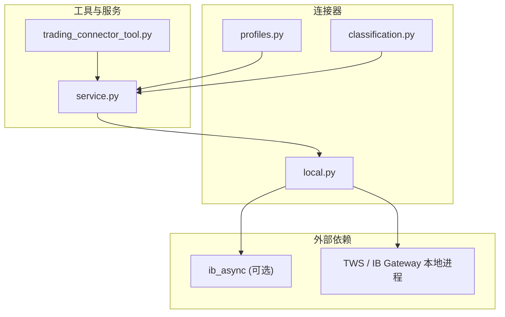
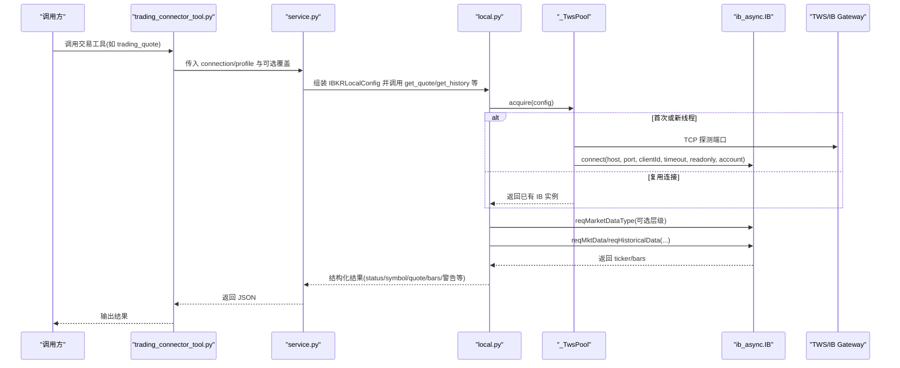
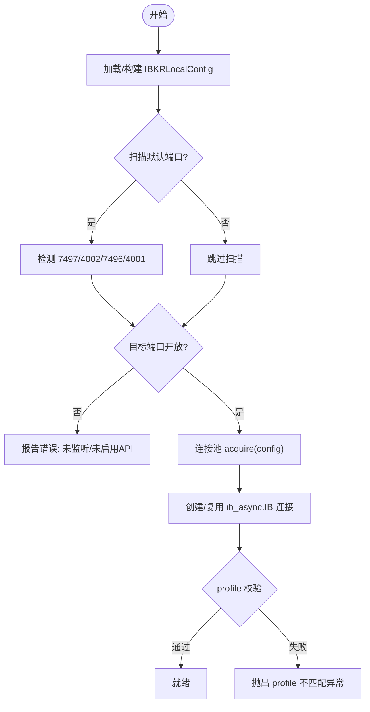
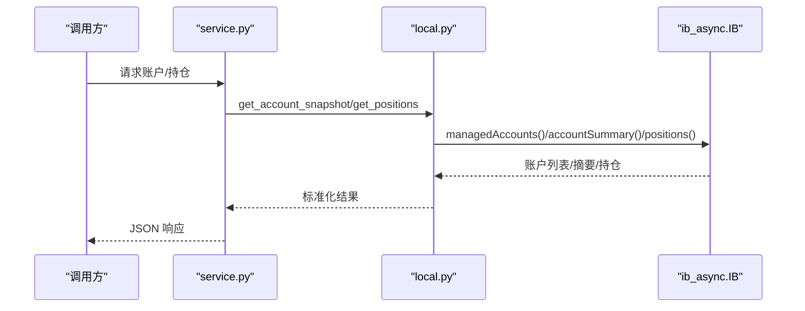
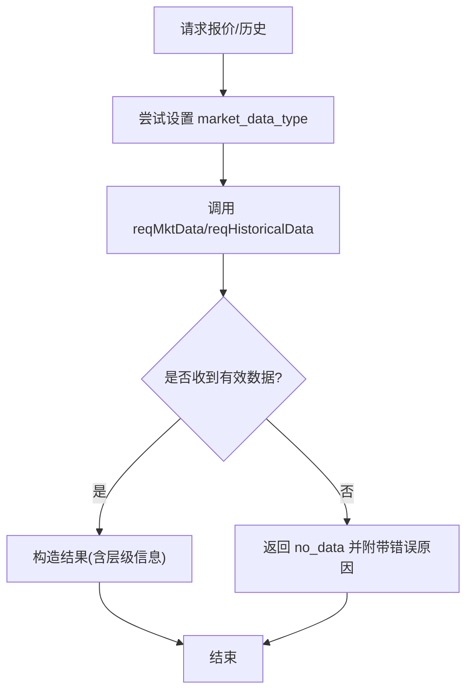

# IBKR 连接器

<cite>
**本文引用的文件**
- [agent/src/trading/connectors/ibkr/__init__.py](file://agent/src/trading/connectors/ibkr/__init__.py)
- [agent/src/trading/connectors/ibkr/local.py](file://agent/src/trading/connectors/ibkr/local.py)
- [agent/src/trading/connectors/ibkr/profiles.py](file://agent/src/trading/connectors/ibkr/profiles.py)
- [agent/src/trading/connectors/ibkr/classification.py](file://agent/src/trading/connectors/ibkr/classification.py)
- [agent/src/tools/trading_connector_tool.py](file://agent/src/tools/trading_connector_tool.py)
- [agent/src/trading/service.py](file://agent/src/trading/service.py)
- [agent/tests/test_ibkr_local.py](file://agent/tests/test_ibkr_local.py)
- [README_zh.md](file://README_zh.md)
</cite>

## 目录
1. [简介](#简介)
2. [项目结构](#项目结构)
3. [核心组件](#核心组件)
4. [架构总览](#架构总览)
5. [详细组件分析](#详细组件分析)
6. [依赖关系分析](#依赖关系分析)
7. [性能与可靠性](#性能与可靠性)
8. [故障排除指南](#故障排除指南)
9. [结论](#结论)
10. [附录：配置与使用示例](#附录：配置与使用示例)

## 简介
本文件为 Interactive Brokers（IBKR）连接器的技术文档，聚焦于通过本地 TWS/IB Gateway 进行只读数据访问的连接器实现。该连接器不直接持有 IBKR 账户凭证，也不暴露下单能力；它通过本地 Socket API 读取账户摘要、持仓、挂单、实时报价与历史K线等数据，并提供健康检查、端口扫描、市场数据层级选择等能力。同时，文档还涵盖官方 MCP 模式的只读接入方式与工具分类策略。

## 项目结构
IBKR 连接器位于 agent 模块的交易连接器子系统中，采用“连接器 + 配置文件 + 工具层”的分层组织：
- 连接器实现：local.py 提供基于 ib_async 的本地 TWS/Gateway 连接、账户快照、持仓、订单、报价、历史数据等功能。
- 预置 Profile：profiles.py 定义纸盘/实盘只读/官方 MCP 只读三种内置 profile。
- 工具分类：classification.py 对 IBKR 官方 MCP 写工具进行显式标注，未知工具默认拒绝。
- 工具入口：trading_connector_tool.py 将 connector 能力以工具形式暴露给上层调用。
- 服务编排：service.py 负责根据 profile 组装配置并路由到具体连接器。
- 测试：test_ibkr_local.py 覆盖连接池、市场数据层级、超时与错误路径等关键行为。

图表来源
- [agent/src/trading/connectors/ibkr/local.py:1-804](file://agent/src/trading/connectors/ibkr/local.py#L1-L804)
- [agent/src/trading/connectors/ibkr/profiles.py:1-45](file://agent/src/trading/connectors/ibkr/profiles.py#L1-L45)
- [agent/src/trading/connectors/ibkr/classification.py:1-27](file://agent/src/trading/connectors/ibkr/classification.py#L1-L27)
- [agent/src/tools/trading_connector_tool.py:1-200](file://agent/src/tools/trading_connector_tool.py#L1-L200)
- [agent/src/trading/service.py:48-208](file://agent/src/trading/service.py#L48-L208)

章节来源
- [agent/src/trading/connectors/ibkr/__init__.py:1-26](file://agent/src/trading/connectors/ibkr/__init__.py#L1-L26)
- [agent/src/trading/connectors/ibkr/local.py:1-804](file://agent/src/trading/connectors/ibkr/local.py#L1-L804)
- [agent/src/trading/connectors/ibkr/profiles.py:1-45](file://agent/src/trading/connectors/ibkr/profiles.py#L1-L45)
- [agent/src/trading/connectors/ibkr/classification.py:1-27](file://agent/src/trading/connectors/ibkr/classification.py#L1-L27)
- [agent/src/tools/trading_connector_tool.py:1-200](file://agent/src/tools/trading_connector_tool.py#L1-L200)
- [agent/src/trading/service.py:48-208](file://agent/src/trading/service.py#L48-L208)

## 核心组件
- IBKRLocalConfig：封装本地 TWS/Gateway 的连接参数（host/port/client_id/profile/account/timeout/readonly/market_data_type），支持从映射构建与字段覆盖。
- _TwsPool：线程安全的 ib_async 连接池，按线程维护引用计数，避免并发 client_id 冲突，并在引用计数归零时断开连接。
- 数据接口：get_account_snapshot、get_positions、get_open_orders、get_quote、get_historical_bars、check_local_status。
- 市场数据层级：默认使用延迟行情（delayed），避免无订阅时的静默失败；支持 live/frozen/delayed/delayed-frozen 四种层级。
- Profile 与工具分类：内置 paper/live-readonly/official-mcp 三种 profile；对 IBKR 官方 MCP 写工具进行显式标注，未知工具默认拒绝。

章节来源
- [agent/src/trading/connectors/ibkr/local.py:61-141](file://agent/src/trading/connectors/ibkr/local.py#L61-L141)
- [agent/src/trading/connectors/ibkr/local.py:525-599](file://agent/src/trading/connectors/ibkr/local.py#L525-L599)
- [agent/src/trading/connectors/ibkr/local.py:188-241](file://agent/src/trading/connectors/ibkr/local.py#L188-L241)
- [agent/src/trading/connectors/ibkr/local.py:264-330](file://agent/src/trading/connectors/ibkr/local.py#L264-L330)
- [agent/src/trading/connectors/ibkr/local.py:420-521](file://agent/src/trading/connectors/ibkr/local.py#L420-L521)
- [agent/src/trading/connectors/ibkr/profiles.py:7-44](file://agent/src/trading/connectors/ibkr/profiles.py#L7-L44)
- [agent/src/trading/connectors/ibkr/classification.py:14-26](file://agent/src/trading/connectors/ibkr/classification.py#L14-L26)

## 架构总览
下图展示了从工具调用到 IBKR 本地进程的完整链路，包括配置加载、连接池复用、市场数据层级设置、以及返回结果的结构化封装。

图表来源
- [agent/src/tools/trading_connector_tool.py:139-196](file://agent/src/tools/trading_connector_tool.py#L139-L196)
- [agent/src/trading/service.py:48-208](file://agent/src/trading/service.py#L48-L208)
- [agent/src/trading/connectors/ibkr/local.py:525-599](file://agent/src/trading/connectors/ibkr/local.py#L525-L599)
- [agent/src/trading/connectors/ibkr/local.py:352-421](file://agent/src/trading/connectors/ibkr/local.py#L352-L421)
- [agent/src/trading/connectors/ibkr/local.py:420-521](file://agent/src/trading/connectors/ibkr/local.py#L420-L521)

## 详细组件分析

### 连接与配置管理
- 配置文件位置与持久化：用户级配置文件 ibkr-local.json，保存 host/port/client_id/profile/account/timeout/readonly/market_data_type。
- 默认端口与端点扫描：内置 TWS Paper(7497)、IB Gateway Paper(4002)、TWS Live(7496)、IB Gateway Live(4001)。
- 连接池：线程局部存储，自动递增 clientId，避免冲突；引用计数归零时断开。
- 安全与权限：默认 readonly=True；profile 校验防止误连实盘；account 过滤仅影响请求范围。

图表来源
- [agent/src/trading/connectors/ibkr/local.py:23-33](file://agent/src/trading/connectors/ibkr/local.py#L23-L33)
- [agent/src/trading/connectors/ibkr/local.py:144-176](file://agent/src/trading/connectors/ibkr/local.py#L144-L176)
- [agent/src/trading/connectors/ibkr/local.py:188-241](file://agent/src/trading/connectors/ibkr/local.py#L188-L241)
- [agent/src/trading/connectors/ibkr/local.py:525-599](file://agent/src/trading/connectors/ibkr/local.py#L525-L599)
- [agent/src/trading/connectors/ibkr/local.py:626-637](file://agent/src/trading/connectors/ibkr/local.py#L626-L637)

章节来源
- [agent/src/trading/connectors/ibkr/local.py:61-141](file://agent/src/trading/connectors/ibkr/local.py#L61-L141)
- [agent/src/trading/connectors/ibkr/local.py:144-176](file://agent/src/trading/connectors/ibkr/local.py#L144-L176)
- [agent/src/trading/connectors/ibkr/local.py:188-241](file://agent/src/trading/connectors/ibkr/local.py#L188-L241)
- [agent/src/trading/connectors/ibkr/local.py:525-599](file://agent/src/trading/connectors/ibkr/local.py#L525-L599)
- [agent/src/trading/connectors/ibkr/local.py:626-637](file://agent/src/trading/connectors/ibkr/local.py#L626-L637)

### 账户与资金管理
- 账户快照：获取 managed accounts 与 accountSummary 值，合并去重后返回账户列表与摘要。
- 资金查询：通过 accountSummary 中的 tag/value 项（如净值、现金等）获取。
- 持仓监控：positions 接口返回合约信息、数量与均价。
- 盈亏计算：由上层依据持仓与最新价格计算；连接器仅提供原始数据。

图表来源
- [agent/src/trading/connectors/ibkr/local.py:264-330](file://agent/src/trading/connectors/ibkr/local.py#L264-L330)
- [agent/src/trading/service.py:74-107](file://agent/src/trading/service.py#L74-L107)

章节来源
- [agent/src/trading/connectors/ibkr/local.py:264-330](file://agent/src/trading/connectors/ibkr/local.py#L264-L330)
- [agent/src/trading/service.py:74-107](file://agent/src/trading/service.py#L74-L107)

### 市场数据订阅（实时与历史）
- 实时报价：reqMktData(..., snapshot=True)，等待 ticker 填充 bid/ask/last/volume/time；若未收到有效数据，返回 no_data 并给出诊断提示。
- 历史K线：reqHistoricalData，支持 duration/bar-size/whatToShow/useRTH 等参数。
- 市场数据层级：在请求前尝试设置 reqMarketDataType；若 SDK 不支持或失败，则标记为未应用并给出警告，避免误导。

图表来源
- [agent/src/trading/connectors/ibkr/local.py:352-421](file://agent/src/trading/connectors/ibkr/local.py#L352-L421)
- [agent/src/trading/connectors/ibkr/local.py:420-521](file://agent/src/trading/connectors/ibkr/local.py#L420-L521)

章节来源
- [agent/src/trading/connectors/ibkr/local.py:352-421](file://agent/src/trading/connectors/ibkr/local.py#L352-L421)
- [agent/src/trading/connectors/ibkr/local.py:420-521](file://agent/src/trading/connectors/ibkr/local.py#L420-L521)

### 订单执行流程
- 本地 TWS/Gateway 连接器：当前实现为只读，不提供下单能力。
- 官方 MCP 模式：write 工具需经 OAuth 授权；连接器对写工具名称进行显式分类，未知工具默认拒绝。
- 建议：如需下单，请使用 IBKR 官方 MCP 通道并按其流程完成授权与工具发现。

章节来源
- [agent/src/trading/connectors/ibkr/profiles.py:30-44](file://agent/src/trading/connectors/ibkr/profiles.py#L30-L44)
- [agent/src/trading/connectors/ibkr/classification.py:14-26](file://agent/src/trading/connectors/ibkr/classification.py#L14-L26)

### 工具与 Profile
- 内置 Profile：
  - ibkr-paper-local：本地纸盘，只读。
  - ibkr-live-local-readonly：本地实盘，只读。
  - ibkr-live-official-mcp-readonly：官方 MCP 只读，需 OAuth。
- 工具参数：connection/host/port/client_id/account 等可覆盖。
- 工具注册：connector 作用域工具包含连接检查、账户、持仓、订单、报价、历史等。

章节来源
- [agent/src/trading/connectors/ibkr/profiles.py:7-44](file://agent/src/trading/connectors/ibkr/profiles.py#L7-L44)
- [agent/src/tools/trading_connector_tool.py:139-196](file://agent/src/tools/trading_connector_tool.py#L139-L196)
- [README_zh.md:1524-1565](file://README_zh.md#L1524-L1565)

## 依赖关系分析
- 运行时依赖：ib_async（可选）。若未安装，健康检查会明确提示缺失。
- 外部进程：TWS/IB Gateway 必须运行并启用 API socket clients。
- 内部耦合：
  - service.py 通过 _ibkr_config 将 profile 与覆盖参数转换为 IBKRLocalConfig。
  - trading_connector_tool.py 将通用参数解析为覆盖字典，传递给 service。
  - local.py 通过 _TwsPool 管理连接生命周期，确保线程安全与资源释放。

图表来源
- [agent/src/tools/trading_connector_tool.py:139-196](file://agent/src/tools/trading_connector_tool.py#L139-L196)
- [agent/src/trading/service.py:48-208](file://agent/src/trading/service.py#L48-L208)
- [agent/src/trading/connectors/ibkr/local.py:525-599](file://agent/src/trading/connectors/ibkr/local.py#L525-L599)

章节来源
- [agent/src/trading/connectors/ibkr/local.py:525-599](file://agent/src/trading/connectors/ibkr/local.py#L525-L599)
- [agent/src/trading/service.py:48-208](file://agent/src/trading/service.py#L48-L208)
- [agent/src/tools/trading_connector_tool.py:139-196](file://agent/src/tools/trading_connector_tool.py#L139-L196)

## 性能与可靠性
- 连接复用：_TwsPool 在同一线程内复用连接，减少握手开销；跨线程隔离避免并发冲突。
- 事件循环处理：报价等待使用 ib.sleep 轮询，确保消息泵送稳定，避免误判。
- 市场数据层级：默认 delayed，降低对付费订阅的依赖；若未成功应用层级，会在结果中明确标注。
- 健壮性：对旧版 SDK 或缺少某些方法的情况做兼容处理，不会因层级设置失败而中断读取。

章节来源
- [agent/src/trading/connectors/ibkr/local.py:393-421](file://agent/src/trading/connectors/ibkr/local.py#L393-L421)
- [agent/src/trading/connectors/ibkr/local.py:352-381](file://agent/src/trading/connectors/ibkr/local.py#L352-L381)
- [agent/tests/test_ibkr_local.py:368-450](file://agent/tests/test_ibkr_local.py#L368-L450)

## 故障排除指南
- 无法连接：
  - 现象：check_local_status 返回 error，提示未监听或未启用 API。
  - 排查：确认 TWS/IB Gateway 已启动并启用 API socket clients；检查 host/port 是否正确；端口扫描结果。
  - 参考：[agent/src/trading/connectors/ibkr/local.py:188-241](file://agent/src/trading/connectors/ibkr/local.py#L188-L241)
- 缺少 ib_async：
  - 现象：健康检查报告缺少可选依赖。
  - 解决：安装 ib_async>=2.0。
  - 参考：[agent/src/trading/connectors/ibkr/local.py:179-186](file://agent/src/trading/connectors/ibkr/local.py#L179-L186)
- 行情无数据：
  - 现象：get_quote 返回 no_data，提示可能未应用市场数据层级或无订阅。
  - 解决：调整 market_data_type 至 delayed/frozen；确认合约与交易所正确；在非交易时段使用 frozen。
  - 参考：[agent/src/trading/connectors/ibkr/local.py:420-521](file://agent/src/trading/connectors/ibkr/local.py#L420-L521)
- 纸盘/实盘配置不匹配：
  - 现象：配置为 paper 但连接到实盘账户，抛出 profile 不匹配异常。
  - 解决：核对 profile 与账户前缀（DU 开头为纸盘）。
  - 参考：[agent/src/trading/connectors/ibkr/local.py:626-637](file://agent/src/trading/connectors/ibkr/local.py#L626-L637)
- 连接超时：
  - 现象：connect 超时或端口不可达。
  - 解决：增大 timeout；检查防火墙/网络；确认客户端 ID 唯一。
  - 参考：[agent/src/trading/connectors/ibkr/local.py:548-576](file://agent/src/trading/connectors/ibkr/local.py#L548-L576)

章节来源
- [agent/src/trading/connectors/ibkr/local.py:179-186](file://agent/src/trading/connectors/ibkr/local.py#L179-L186)
- [agent/src/trading/connectors/ibkr/local.py:188-241](file://agent/src/trading/connectors/ibkr/local.py#L188-L241)
- [agent/src/trading/connectors/ibkr/local.py:420-521](file://agent/src/trading/connectors/ibkr/local.py#L420-L521)
- [agent/src/trading/connectors/ibkr/local.py:548-576](file://agent/src/trading/connectors/ibkr/local.py#L548-L576)
- [agent/src/trading/connectors/ibkr/local.py:626-637](file://agent/src/trading/connectors/ibkr/local.py#L626-L637)

## 结论
该 IBKR 连接器以“本地只读”为核心定位，通过 TWS/IB Gateway 的 Socket API 提供稳健的账户、持仓、订单与行情数据访问。其设计强调安全性（不持凭据、默认只读）、健壮性（连接池、层级回退、错误诊断）与易用性（内置 profile、端口扫描、健康检查）。对于需要下单的场景，建议使用 IBKR 官方 MCP 通道并完成 OAuth 授权。

## 附录：配置与使用示例
- 本地开发环境搭建
  - 安装可选 SDK：pip install "vibe-trading-ai[ibkr]"
  - 启动 TWS/IB Gateway 并启用 API socket clients
  - 选择并配置 profile：connector use ibkr-paper-local；connector configure ibkr-paper-local --yes
  - 验证连接：connector check；查看账户与持仓：connector account；connector positions
  - 获取报价与历史：connector quote AAPL；connector history AAPL --duration "30 D" --bar-size "1 day"
  - 参考：[README_zh.md:1524-1565](file://README_zh.md#L1524-L1565)

- 生产环境部署配置
  - 使用 ibkr-live-local-readonly profile 连接本地实盘 TWS/Gateway（只读）
  - 或通过 ibkr-live-official-mcp-readonly 使用官方 MCP 只读通道（需 OAuth）
  - 注意：下单工具在当前本地连接器中未暴露；如需下单请走官方 MCP 流程
  - 参考：[agent/src/trading/connectors/ibkr/profiles.py:7-44](file://agent/src/trading/connectors/ibkr/profiles.py#L7-L44)

- 常见配置项说明
  - host/port：TWS/IB Gateway 监听地址与端口
  - client_id：唯一客户端标识，避免冲突
  - profile：paper 或 live-readonly
  - account：账户过滤（可选）
  - timeout：连接超时（秒）
  - readonly：始终为 True（本地连接器）
  - market_data_type：1=live, 2=frozen, 3=delayed, 4=delayed-frozen（默认 3）
  - 参考：[agent/src/trading/connectors/ibkr/local.py:61-141](file://agent/src/trading/connectors/ibkr/local.py#L61-L141)

- 连接测试方法
  - 健康检查：connector check
  - 端口扫描：check_local_status 会扫描默认端口并报告状态
  - 账户快照：connector account
  - 参考：[agent/src/trading/connectors/ibkr/local.py:188-241](file://agent/src/trading/connectors/ibkr/local.py#L188-L241)

- 最佳实践
  - 研发/回测优先使用 paper profile 与 delayed 层级
  - 生产环境严格区分 paper/live profile，避免误连
  - 合理设置 timeout 与重试策略，避免阻塞
  - 关注 market_data_type_applied 与 warning 字段，及时诊断数据问题
  - 参考：[agent/tests/test_ibkr_local.py:368-450](file://agent/tests/test_ibkr_local.py#L368-L450)