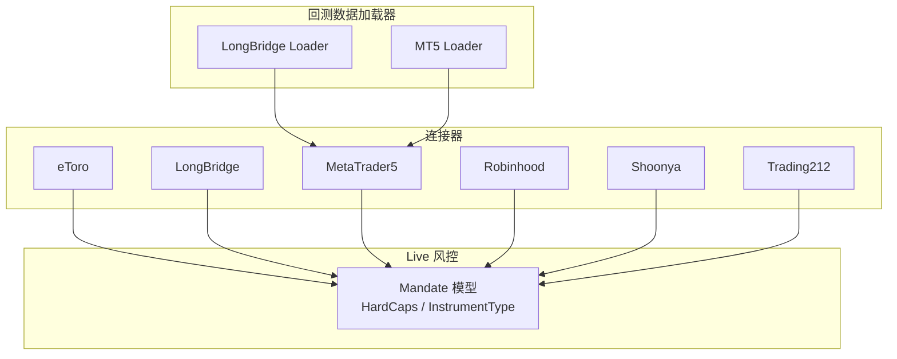
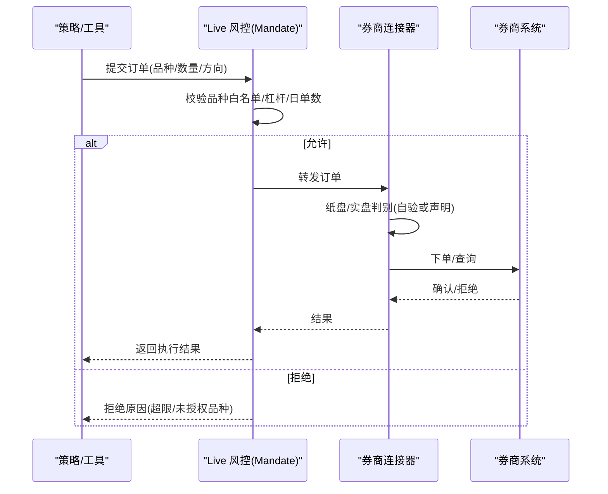
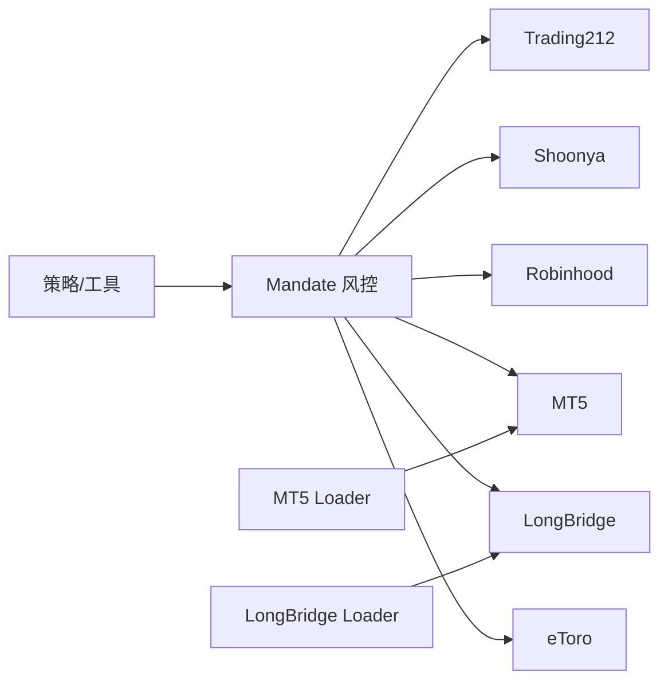

# 其他券商连接器

<cite>
**本文引用的文件**
- [agent/src/trading/connectors/etoro/__init__.py](file://agent/src/trading/connectors/etoro/__init__.py)
- [agent/src/trading/connectors/longbridge/__init__.py](file://agent/src/trading/connectors/longbridge/__init__.py)
- [agent/src/trading/connectors/mt5/__init__.py](file://agent/src/trading/connectors/mt5/__init__.py)
- [agent/src/trading/connectors/robinhood/__init__.py](file://agent/src/trading/connectors/robinhood/__init__.py)
- [agent/src/trading/connectors/shoonya/__init__.py](file://agent/src/trading/connectors/shoonya/__init__.py)
- [agent/src/trading/connectors/trading212/__init__.py](file://agent/src/trading/connectors/trading212/__init__.py)
- [agent/src/live/mandate/model.py](file://agent/src/live/mandate/model.py)
- [agent/backtest/loaders/longbridge.py](file://agent/backtest/loaders/longbridge.py)
- [agent/backtest/loaders/mt5_loader.py](file://agent/backtest/loaders/mt5_loader.py)
- [agent/backtest/engines/global_futures.py](file://agent/backtest/engines/global_futures.py)
</cite>

## 目录
1. [简介](#简介)
2. [项目结构](#项目结构)
3. [核心组件](#核心组件)
4. [架构总览](#架构总览)
5. [详细组件分析](#详细组件分析)
6. [依赖关系分析](#依赖关系分析)
7. [性能与限流](#性能与限流)
8. [故障排除指南](#故障排除指南)
9. [结论](#结论)
10. [附录](#附录)

## 简介
本技术文档面向“其他券商连接器”，覆盖 eToro、LongBridge（LongPort）、MetaTrader5（MT5）、Robinhood、Shoonya、Trading212 等平台的集成方式与使用要点。文档重点说明：
- 各平台特色能力：eToro 社交交易、MT5 专业终端、Robinhood 零佣金账户、Shoonya 印度市场低成本接入、Trading212 欧洲零售交易等。
- 区域市场支持：印度（NSE/BSE，Shoonya）、欧洲（Trading212）等特定区域功能。
- 非传统资产：差价合约（CFD）、外汇、商品期货等在 MT5 与回测引擎中的体现。
- 配置要求与限制：API 限流、交易时间、最小交易量等约束的通用建议与平台差异。
- 错误处理与故障排除：基于连接器的安全门控、纸盘/实盘区分、授权与指令执行边界。
- 跨平台策略实现：统一抽象下的策略适配与注意事项。

## 项目结构
连接器以“按券商分目录”的方式组织，每个券商包含分类、凭证、SDK、订单/读取等模块；回测数据加载器位于 backtest/loaders，提供历史数据与合约元数据映射；Live 层通过 Mandate 模型对可交易品种、杠杆、敞口等进行硬约束。

图表来源
- [agent/src/trading/connectors/etoro/__init__.py:1-7](file://agent/src/trading/connectors/etoro/__init__.py#L1-L7)
- [agent/src/trading/connectors/longbridge/__init__.py:1-14](file://agent/src/trading/connectors/longbridge/__init__.py#L1-L14)
- [agent/src/trading/connectors/mt5/__init__.py:1-15](file://agent/src/trading/connectors/mt5/__init__.py#L1-L15)
- [agent/src/trading/connectors/robinhood/__init__.py:1-3](file://agent/src/trading/connectors/robinhood/__init__.py#L1-L3)
- [agent/src/trading/connectors/shoonya/__init__.py:1-9](file://agent/src/trading/connectors/shoonya/__init__.py#L1-L9)
- [agent/src/trading/connectors/trading212/__init__.py:1-8](file://agent/src/trading/connectors/trading212/__init__.py#L1-L8)
- [agent/backtest/loaders/longbridge.py](file://agent/backtest/loaders/longbridge.py)
- [agent/backtest/loaders/mt5_loader.py](file://agent/backtest/loaders/mt5_loader.py)
- [agent/src/live/mandate/model.py:17-44](file://agent/src/live/mandate/model.py#L17-L44)

章节来源
- [agent/src/trading/connectors/etoro/__init__.py:1-7](file://agent/src/trading/connectors/etoro/__init__.py#L1-L7)
- [agent/src/trading/connectors/longbridge/__init__.py:1-14](file://agent/src/trading/connectors/longbridge/__init__.py#L1-L14)
- [agent/src/trading/connectors/mt5/__init__.py:1-15](file://agent/src/trading/connectors/mt5/__init__.py#L1-L15)
- [agent/src/trading/connectors/robinhood/__init__.py:1-3](file://agent/src/trading/connectors/robinhood/__init__.py#L1-L3)
- [agent/src/trading/connectors/shoonya/__init__.py:1-9](file://agent/src/trading/connectors/shoonya/__init__.py#L1-L9)
- [agent/src/trading/connectors/trading212/__init__.py:1-8](file://agent/src/trading/connectors/trading212/__init__.py#L1-L8)

## 核心组件
- 统一抽象：各连接器对外暴露一致的“读/写”接口，由 Live 层的 Mandate 进行品种白名单、杠杆、日下单次数等硬约束。
- 纸盘/实盘区分：不同券商实现不同的自我验证或声明式区分机制，确保订单路由到正确环境。
- 回测对接：通过 loaders 将券商合约/行情映射为统一格式，便于策略在历史数据上验证。

章节来源
- [agent/src/live/mandate/model.py:17-44](file://agent/src/live/mandate/model.py#L17-L44)
- [agent/backtest/loaders/longbridge.py](file://agent/backtest/loaders/longbridge.py)
- [agent/backtest/loaders/mt5_loader.py](file://agent/backtest/loaders/mt5_loader.py)

## 架构总览
下图展示从策略到券商执行的端到端流程，包括纸盘/实盘判定、Mandate 风控、以及各连接器的差异化行为。

图表来源
- [agent/src/live/mandate/model.py:17-44](file://agent/src/live/mandate/model.py#L17-L44)
- [agent/src/trading/connectors/mt5/__init__.py:1-15](file://agent/src/trading/connectors/mt5/__init__.py#L1-L15)
- [agent/src/trading/connectors/trading212/__init__.py:1-8](file://agent/src/trading/connectors/trading212/__init__.py#L1-L8)

## 详细组件分析

### eToro 连接器
- 特色能力：支持 Demo 与生产共用 API Key 对，通过 Profile 切换路径；具备社交交易生态，适合跟单与组合管理场景。
- 读写能力：Demo/Real 均可读；写操作需通过 Live 动作门控并受 Mandate 约束。
- 区域与市场：主要面向全球零售与 CFD/股票/ETF 等，具体合约以平台为准。
- 配置要点：Profile 选择 demo/real；遵循平台 API 限流与认证流程。
- 限制与注意：写操作必须通过授权与风控门；不可绕过 Mandate 直接下单。

章节来源
- [agent/src/trading/connectors/etoro/__init__.py:1-7](file://agent/src/trading/connectors/etoro/__init__.py#L1-L7)

### LongBridge（LongPort）连接器
- 特色能力：基于官方 Python SDK（TradeContext/QuoteContext），提供账户与行情读取；适合港股/美股等多市场。
- 读写能力：当前实现侧重读取；订单写入需满足可靠的运行时区分与授权。
- 纸盘/实盘区分：无法从 API 响应中自动区分，需在配置中声明并由运行期鉴别。
- 配置要点：App Key/Token 等凭据；遵循平台速率限制与交易时段。
- 限制与注意：订单路由需先解决纸盘/实盘判别，避免误发至真实账户。

章节来源
- [agent/src/trading/connectors/longbridge/__init__.py:1-14](file://agent/src/trading/connectors/longbridge/__init__.py#L1-L14)
- [agent/backtest/loaders/longbridge.py](file://agent/backtest/loaders/longbridge.py)

### MetaTrader5（MT5）连接器
- 特色能力：通过本地 MT5 终端通信，支持外汇、贵金属、指数、能源、加密货币等 CFD 及期货；专业交易终端生态完善。
- 纸盘/实盘区分：每次会话读取账户信息并判断交易模式；禁止将纸盘配置绑定到真实账户（反之亦然）。
- 区域与市场：多经纪商生态，覆盖全球外汇与衍生品市场。
- 配置要点：Windows 环境；安装可选扩展；凭据存放于指定路径；遵循平台交易时间与合约乘数。
- 限制与注意：实盘下单需经 Mandate 与熔断开关；注意合约乘数与保证金规则。

章节来源
- [agent/src/trading/connectors/mt5/__init__.py:1-15](file://agent/src/trading/connectors/mt5/__init__.py#L1-L15)
- [agent/backtest/loaders/mt5_loader.py](file://agent/backtest/loaders/mt5_loader.py)
- [agent/backtest/engines/global_futures.py:1-23](file://agent/backtest/engines/global_futures.py#L1-L23)

### Robinhood 连接器
- 特色能力：零佣金零售交易，适合美股基础标的；强调易用性与低门槛。
- 读写能力：连接器包存在，具体读写能力以实际实现为准；需遵循平台授权与风控。
- 区域与市场：美国市场为主。
- 配置要点：OAuth/凭据；遵守平台限流与交易时段。
- 限制与注意：订单执行需符合 Mandate 与平台规则。

章节来源
- [agent/src/trading/connectors/robinhood/__init__.py:1-3](file://agent/src/trading/connectors/robinhood/__init__.py#L1-L3)

### Shoonya（Finvasia）连接器
- 特色能力：印度市场低成本接入，零经纪费与免费 API；支持 NSE/BSE 股票、F&O、货币与商品。
- 读写能力：通过 NorenRestApiPy SDK 提供只读与纸盘/实盘访问。
- 区域与市场：印度（NSE/BSE）。
- 配置要点：遵循平台交易时段、合约规格与最小交易单位；注意 F&O 合约乘数与保证金。
- 限制与注意：严格遵循交易所与券商规则；策略需考虑流动性与滑点。

章节来源
- [agent/src/trading/connectors/shoonya/__init__.py:1-9](file://agent/src/trading/connectors/shoonya/__init__.py#L1-L9)

### Trading212 连接器
- 特色能力：欧洲零售交易平台，公开 REST API；适合 ETF/股票/CFD 等。
- 读写能力：公开 API 不提供纸盘/实盘运行时判别，因此下单与撤单被有意禁用，仅支持只读。
- 区域与市场：欧洲市场为主。
- 配置要点：遵循平台限流与认证；关注交易时段与产品可用性。
- 限制与注意：不可用于实盘下单；如需执行请评估其他支持写操作的连接器。

章节来源
- [agent/src/trading/connectors/trading212/__init__.py:1-8](file://agent/src/trading/connectors/trading212/__init__.py#L1-L8)

## 依赖关系分析
- 连接器与 Mandate：所有连接器在执行前均受 Mandate 的品种白名单、杠杆、日下单次数等约束，确保“可交易范围”和“风险上限”。
- 回测与连接器：LongBridge/MT5 的回测加载器将平台合约与行情映射为统一格式，便于策略在历史数据上验证后再上线。
- 平台差异：部分连接器（如 Trading212）仅提供只读；MT5 支持 CFD/外汇/期货等复杂品种；Shoonya 聚焦印度市场。

图表来源
- [agent/src/live/mandate/model.py:17-44](file://agent/src/live/mandate/model.py#L17-L44)
- [agent/backtest/loaders/longbridge.py](file://agent/backtest/loaders/longbridge.py)
- [agent/backtest/loaders/mt5_loader.py](file://agent/backtest/loaders/mt5_loader.py)

章节来源
- [agent/src/live/mandate/model.py:17-44](file://agent/src/live/mandate/model.py#L17-L44)
- [agent/backtest/loaders/longbridge.py](file://agent/backtest/loaders/longbridge.py)
- [agent/backtest/loaders/mt5_loader.py](file://agent/backtest/loaders/mt5_loader.py)

## 性能与限流
- 通用建议
  - 合理批量请求：合并查询以减少调用次数。
  - 退避重试：遇到限流时采用指数退避与最大重试次数。
  - 缓存热点数据：如合约元数据、汇率等减少重复请求。
  - 避开高峰：尽量在非集中竞价或低波动时段执行批量任务。
- 平台差异提示
  - eToro：Demo/Real 共享 Key，但路径不同；遵循平台速率限制。
  - LongBridge：基于官方 SDK，注意 REST 调用频率与交易时段。
  - MT5：本地终端通信，注意终端负载与合约乘数、保证金变化。
  - Robinhood：遵循 OAuth 限流与美股交易时段。
  - Shoonya：印度交易所时段与 F&O 合约特性需纳入策略设计。
  - Trading212：公开 API 限流较严，且不支持下单。

[本节为通用指导，不直接分析具体文件]

## 故障排除指南
- 纸盘/实盘误配
  - MT5：会话会读取账户交易模式，若检测到纸盘配置绑定到真实账户（或相反）将被拒绝。
  - LongBridge：无法从 API 响应自动区分，需在配置中声明并确保运行期判别可靠。
  - Trading212：公开 API 无运行时判别，下单被禁用，需改用支持写操作的连接器。
- 授权与风控
  - 所有写操作需通过授权与 Mandate 门控；若被拒绝，检查品种白名单、杠杆、日下单次数等限制。
- 常见错误定位
  - 限流：观察返回码与日志，增加退避重试与降低请求频率。
  - 合约规格：核对合约乘数、最小变动价位、最小交易量等。
  - 交易时段：确认目标市场开市时间与结算规则。

章节来源
- [agent/src/trading/connectors/mt5/__init__.py:1-15](file://agent/src/trading/connectors/mt5/__init__.py#L1-L15)
- [agent/src/trading/connectors/longbridge/__init__.py:1-14](file://agent/src/trading/connectors/longbridge/__init__.py#L1-L14)
- [agent/src/trading/connectors/trading212/__init__.py:1-8](file://agent/src/trading/connectors/trading212/__init__.py#L1-L8)
- [agent/src/live/mandate/model.py:17-44](file://agent/src/live/mandate/model.py#L17-L44)

## 结论
- 各连接器在统一抽象下提供了多市场、多品种的接入能力，并通过 Mandate 实现强约束的风控。
- 平台差异显著：MT5 擅长 CFD/外汇/期货；Shoonya 聚焦印度低成本接入；Trading212 提供欧洲只读能力；eToro 支持社交交易生态；LongBridge 覆盖多市场读取；Robinhood 适合美股零佣金场景。
- 建议在策略上线前充分使用回测加载器验证，并在 Live 层开启严格的 Mandate 与熔断机制，确保资金与合规安全。

[本节为总结性内容，不直接分析具体文件]

## 附录
- 非传统资产交易
  - CFD：MT5 支持指数、能源、贵金属等 CFD；策略需关注保证金与合约乘数。
  - 外汇：MT5 提供主流货币对；注意点差与隔夜利息。
  - 商品期货：回测引擎覆盖全球期货规则（保证金、涨跌停、乘数等）。
- 区域市场要点
  - 印度（Shoonya）：NSE/BSE 股票与 F&O，注意合约乘数、最小交易量与交易时段。
  - 欧洲（Trading212）：公开 API 只读，关注产品可用性与限流。
- 配置清单（示例字段，具体以平台为准）
  - 认证：API Key/Secret、OAuth Token、本地终端账号等。
  - 环境：Demo/Real 切换、地区/语言设置。
  - 风控：最大单笔名义金额、总敞口、杠杆上限、日下单次数、品种白名单。
  - 交易参数：最小交易量、合约乘数、滑点容忍度、止损止盈策略。

[本节为补充信息，不直接分析具体文件]