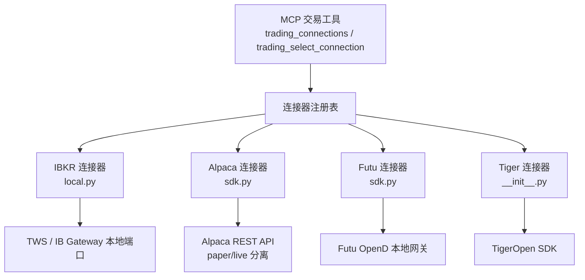
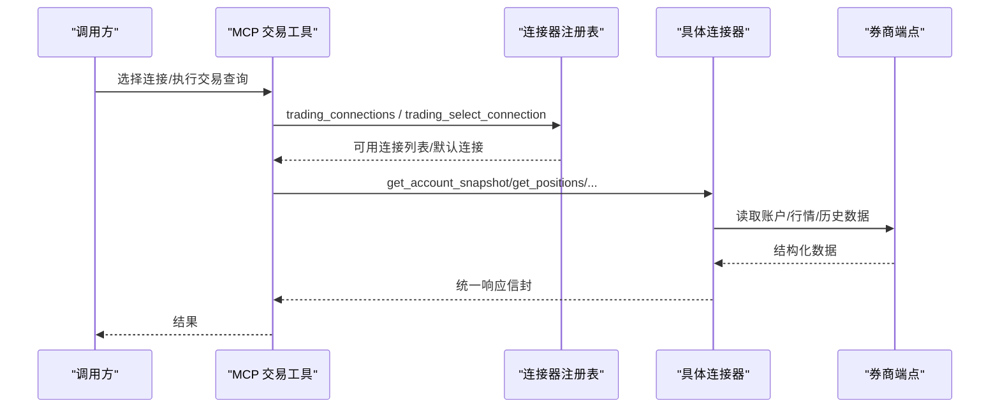
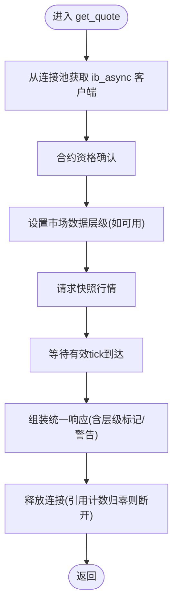
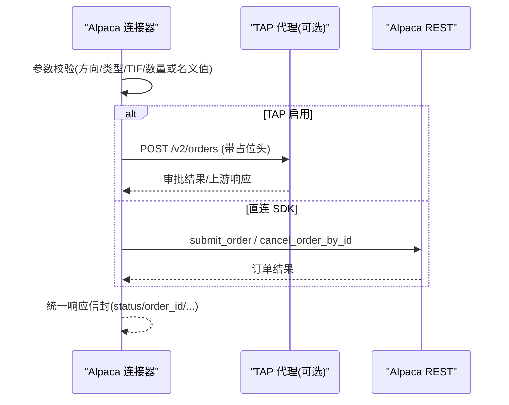
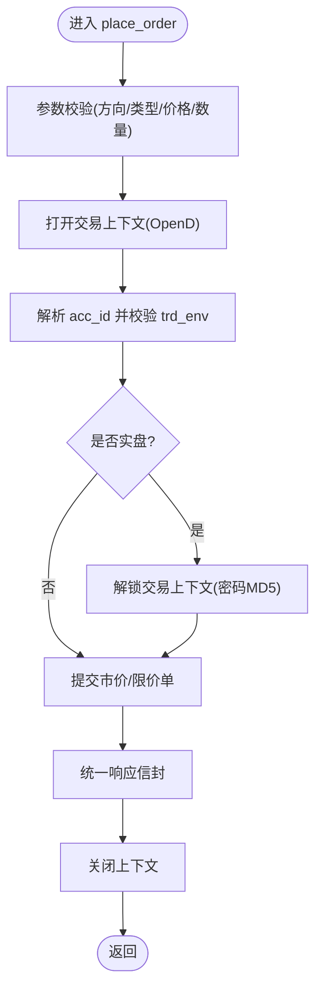
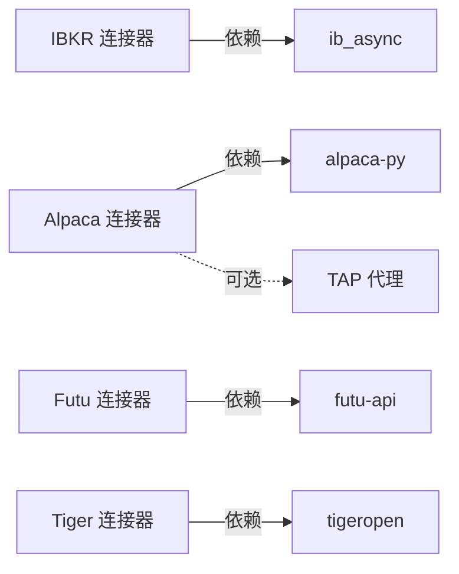

# 券商接口集成

<cite>
**本文引用的文件**
- [agent/src/trading/connectors/ibkr/local.py](file://agent/src/trading/connectors/ibkr/local.py)
- [agent/src/trading/connectors/alpaca/sdk.py](file://agent/src/trading/connectors/alpaca/sdk.py)
- [agent/src/trading/connectors/futu/sdk.py](file://agent/src/trading/connectors/futu/sdk.py)
- [agent/src/trading/connectors/tiger/__init__.py](file://agent/src/trading/connectors/tiger/__init__.py)
- [agent/mcp_server.py](file://agent/mcp_server.py)
</cite>

## 目录
1. [简介](#简介)
2. [项目结构](#项目结构)
3. [核心组件](#核心组件)
4. [架构总览](#架构总览)
5. [详细组件分析](#详细组件分析)
6. [依赖关系分析](#依赖关系分析)
7. [性能与连接管理](#性能与连接管理)
8. [故障处理与异常恢复](#故障处理与异常恢复)
9. [新券商接入指南](#新券商接入指南)
10. [最佳实践与示例](#最佳实践与示例)
11. [结论](#结论)

## 简介
本技术文档面向券商开发者与技术集成人员，系统化说明统一接口抽象、多券商适配架构、数据模型标准化、错误处理机制、连接与会话管理策略，以及 IBKR、Alpaca、Futu、Tiger 等主流平台的实现要点。文档同时提供新券商接入步骤、测试验证方法与部署配置建议，帮助快速构建稳定、可审计、可扩展的交易连接器。

## 项目结构
交易连接器位于 agent/src/trading/connectors 下，按券商分目录组织；每个连接器通常包含：
- 配置与校验（dataclass + JSON 持久化）
- 健康检查（check_status）
- 只读能力（账户快照、持仓、挂单、行情、历史K线）
- 可选的下单/撤单能力（视平台与阶段而定）
- 认证与传输方式（本地网关、官方SDK、或经 TAP 代理转发）

MCP 层暴露统一的 trading_* 工具，供上层调用选择连接并执行操作。

图表来源
- [agent/mcp_server.py:1144-1190](file://agent/mcp_server.py#L1144-L1190)
- [agent/src/trading/connectors/ibkr/local.py:1-800](file://agent/src/trading/connectors/ibkr/local.py#L1-L800)
- [agent/src/trading/connectors/alpaca/sdk.py:1-800](file://agent/src/trading/connectors/alpaca/sdk.py#L1-L800)
- [agent/src/trading/connectors/futu/sdk.py:1-800](file://agent/src/trading/connectors/futu/sdk.py#L1-L800)
- [agent/src/trading/connectors/tiger/__init__.py:1-8](file://agent/src/trading/connectors/tiger/__init__.py#L1-L8)

章节来源
- [agent/mcp_server.py:1144-1190](file://agent/mcp_server.py#L1144-L1190)

## 核心组件
- 统一接口抽象
  - 所有连接器对外暴露一致的只读方法族：get_account_snapshot、get_positions、get_open_orders、get_quote、get_historical_bars；部分连接器在后续阶段提供 place_order/cancel_order。
  - 返回体采用统一信封：status、profile、is_paper（或 trd_env）、业务数据列表/对象。
- 配置管理
  - 每个连接器定义 dataclass 配置类，支持 from_mapping/with_overrides，JSON 持久化到用户运行时目录，读取时进行字段归一化与校验。
- 健康检查
  - check_status 输出 SDK 安装状态、目标可达性、账户身份与 profile 信息，便于运维自检。
- 认证与传输
  - IBKR：通过本地 TWS/IB Gateway 端口通信，不直接持有凭据。
  - Alpaca：官方 alpaca-py SDK 直连 REST；可选 TAP 代理转发以隔离密钥。
  - Futu：通过本地 OpenD 网关通信，不直接持有凭据；实盘需解锁交易上下文。
  - Tiger：官方 tigeropen SDK 直连 REST（RSA 签名）。

章节来源
- [agent/src/trading/connectors/ibkr/local.py:1-800](file://agent/src/trading/connectors/ibkr/local.py#L1-L800)
- [agent/src/trading/connectors/alpaca/sdk.py:1-800](file://agent/src/trading/connectors/alpaca/sdk.py#L1-L800)
- [agent/src/trading/connectors/futu/sdk.py:1-800](file://agent/src/trading/connectors/futu/sdk.py#L1-L800)
- [agent/src/trading/connectors/tiger/__init__.py:1-8](file://agent/src/trading/connectors/tiger/__init__.py#L1-L8)

## 架构总览
连接器遵循“连接器模式”：
- 每券商一个独立模块，封装其 SDK/网关差异。
- 上层通过统一接口访问，屏蔽底层差异。
- 配置与环境（paper/live）由连接器内部严格区分，防止误用。

图表来源
- [agent/mcp_server.py:1144-1190](file://agent/mcp_server.py#L1144-L1190)
- [agent/src/trading/connectors/ibkr/local.py:1-800](file://agent/src/trading/connectors/ibkr/local.py#L1-L800)
- [agent/src/trading/connectors/alpaca/sdk.py:1-800](file://agent/src/trading/connectors/alpaca/sdk.py#L1-L800)
- [agent/src/trading/connectors/futu/sdk.py:1-800](file://agent/src/trading/connectors/futu/sdk.py#L1-L800)

## 详细组件分析

### IBKR 连接器（本地 TWS/IB Gateway）
- 连接与配置
  - 使用 dataclass 配置（host/port/client_id/profile/account/timeout/readonly/market_data_type），默认端口与 profile 映射清晰。
  - 通过 TCP 端口探测与 ib_async 连接池（线程局部、引用计数）复用连接，避免并发冲突。
- 只读能力
  - 账户快照、持仓、挂单、报价、历史K线；报价与历史数据支持市场数据层级设置，未应用时给出明确警告。
- 安全与防护
  - 纸面/实盘账户标识校验（DU/U 前缀），防止纸面配置连到实盘。
  - 仅暴露只读方法，无下单能力。
- 健康检查
  - check_status 扫描默认端口、检测 SDK、尝试获取账户快照，返回可读的错误提示。

图表来源
- [agent/src/trading/connectors/ibkr/local.py:420-474](file://agent/src/trading/connectors/ibkr/local.py#L420-L474)
- [agent/src/trading/connectors/ibkr/local.py:525-599](file://agent/src/trading/connectors/ibkr/local.py#L525-L599)

章节来源
- [agent/src/trading/connectors/ibkr/local.py:1-800](file://agent/src/trading/connectors/ibkr/local.py#L1-L800)

### Alpaca 连接器（REST SDK + 可选 TAP 代理）
- 连接与配置
  - dataclass 配置（api_key/secret_key/profile/feed/timeout/readonly），profile 决定 paper/live 主机，严格隔离。
  - 可选 TAP 代理：将全部 egress（读/写）经 TAP 转发，服务端注入密钥，Agent 进程不持密。
- 只读能力
  - 账户、持仓、挂单、最新报价、历史K线；TAP 路径对行情短键做别名转换以兼容上层模型。
- 下单与撤单
  - 支持 place_order/cancel_order；TAP 路径具备幂等 client_order_id，避免重复下单。
- 健康检查
  - check_status 报告 SDK、TAP、纸面/实盘守卫、目标主机与账户信息。

图表来源
- [agent/src/trading/connectors/alpaca/sdk.py:429-577](file://agent/src/trading/connectors/alpaca/sdk.py#L429-L577)
- [agent/src/trading/connectors/alpaca/sdk.py:580-665](file://agent/src/trading/connectors/alpaca/sdk.py#L580-L665)
- [agent/src/trading/connectors/alpaca/sdk.py:712-792](file://agent/src/trading/connectors/alpaca/sdk.py#L712-L792)

章节来源
- [agent/src/trading/connectors/alpaca/sdk.py:1-800](file://agent/src/trading/connectors/alpaca/sdk.py#L1-L800)

### Futu 连接器（本地 OpenD 网关）
- 连接与配置
  - dataclass 配置（host/port/profile/security_firm/filter_trdmarket/acc_id/timeout/readonly），默认本地网关端口。
  - 通过 OpenD 网关通信，不直接持有登录凭据；每次连接前进行 TCP 端口探测。
- 账户与交易
  - 账户快照、持仓、挂单、行情、历史K线；下单/撤单在后续阶段引入，实盘需解锁交易上下文（MD5 密码）。
- 环境守卫
  - 基于 trd_env（SIMULATE/REAL）与 acc_id 匹配，确保纸面/实盘不可混用。
- 健康检查
  - check_status 报告网关可达性、SDK、trd_env 与账户信息。

图表来源
- [agent/src/trading/connectors/futu/sdk.py:755-887](file://agent/src/trading/connectors/futu/sdk.py#L755-L887)
- [agent/src/trading/connectors/futu/sdk.py:965-991](file://agent/src/trading/connectors/futu/sdk.py#L965-L991)

章节来源
- [agent/src/trading/connectors/futu/sdk.py:1-800](file://agent/src/trading/connectors/futu/sdk.py#L1-L800)

### Tiger 连接器（官方 SDK）
- 定位与能力
  - 当前 Layer A 提供只读账户/市场访问；下单能力在后续阶段叠加。
  - 通过 tigeropen SDK 直连 REST（RSA 签名），属于 broker_sdk 传输。
- 设计要点
  - 保持与其他连接器一致的只读接口契约，便于上层统一编排。

章节来源
- [agent/src/trading/connectors/tiger/__init__.py:1-8](file://agent/src/trading/connectors/tiger/__init__.py#L1-L8)

## 依赖关系分析
- 外部依赖
  - IBKR：ib_async（可选，缺失时健康检查会提示安装）。
  - Alpaca：alpaca-py（可选，缺失时健康检查会提示安装）；TAP（可选，环境变量控制）。
  - Futu：futu-api（可选，缺失时健康检查会提示安装）。
  - Tiger：tigeropen（可选，缺失时健康检查会提示安装）。
- 内部依赖
  - 配置路径：统一从运行时根目录加载 JSON 配置文件。
  - 统一响应：各连接器均返回 status/profile/is_paper 或 trd_env 等通用字段。

图表来源
- [agent/src/trading/connectors/ibkr/local.py:179-186](file://agent/src/trading/connectors/ibkr/local.py#L179-L186)
- [agent/src/trading/connectors/alpaca/sdk.py:254-260](file://agent/src/trading/connectors/alpaca/sdk.py#L254-L260)
- [agent/src/trading/connectors/futu/sdk.py:214-220](file://agent/src/trading/connectors/futu/sdk.py#L214-L220)

章节来源
- [agent/src/trading/connectors/ibkr/local.py:179-186](file://agent/src/trading/connectors/ibkr/local.py#L179-L186)
- [agent/src/trading/connectors/alpaca/sdk.py:254-260](file://agent/src/trading/connectors/alpaca/sdk.py#L254-L260)
- [agent/src/trading/connectors/futu/sdk.py:214-220](file://agent/src/trading/connectors/futu/sdk.py#L214-L220)

## 性能与连接管理
- 连接池与会话
  - IBKR：线程局部连接池，按引用计数复用与释放，避免并发冲突与频繁握手。
  - Futu：每次调用创建/关闭上下文，适合低频调用；可通过外部调度减少频繁切换。
  - Alpaca：HTTP 长连接由 SDK 管理；TAP 路径增加审批延迟但提升安全性。
- 心跳与重连
  - 连接器层面未内置显式心跳；通过 check_status 与端口探测实现“失败快速失败”。
  - 建议在调度层实现周期性健康检查与自动重连策略（例如指数退避重试）。
- 资源占用
  - 本地网关（TWS/OpenD）需常驻；注意端口占用与账号登录态。
  - 行情订阅/快照注意市场数据层级与订阅限制，避免无效请求。

[本节为通用指导，不直接分析具体文件]

## 故障处理与异常恢复
- 统一错误信封
  - 下单/撤单路径普遍返回 {"status":"error","error":...}，避免抛出异常中断上层流程。
- 典型错误与修复
  - 依赖缺失：提示安装对应 SDK（ib_async/alpaca-py/futu-api/tigeropen）。
  - 网关不可达：提示启动本地网关并确认端口；Futu/IBKR 均有端口探测。
  - 纸面/实盘错配：IBKR 通过账户前缀校验；Futu 通过 trd_env 校验；Alpaca 通过 host 隔离。
  - 行情无数据：检查市场数据层级、交易时段、标的/交易所组合。
- 幂等与重试
  - Alpaca TAP 路径使用确定性 client_order_id 去重；建议在超时后按幂等键重试。

章节来源
- [agent/src/trading/connectors/ibkr/local.py:49-59](file://agent/src/trading/connectors/ibkr/local.py#L49-L59)
- [agent/src/trading/connectors/alpaca/sdk.py:429-577](file://agent/src/trading/connectors/alpaca/sdk.py#L429-L577)
- [agent/src/trading/connectors/futu/sdk.py:755-887](file://agent/src/trading/connectors/futu/sdk.py#L755-L887)

## 新券商接入指南
- 步骤概览
  1) 新建连接器目录与模块，定义 dataclass 配置类（from_mapping/with_overrides）。
  2) 实现只读接口：get_account_snapshot、get_positions、get_open_orders、get_quote、get_historical_bars。
  3) 实现健康检查：check_status（SDK 可用性、目标可达、账户身份）。
  4) 实现配置持久化：config_path/load_config/save_config。
  5) 如需下单：实现 place_order/cancel_order，遵循“失败闭合”原则，返回统一信封。
  6) 注册到连接器注册表（若需要），并通过 MCP 工具暴露。
- 测试验证
  - 单元测试覆盖：配置解析、健康检查、只读接口、下单/撤单错误路径。
  - 集成测试：连接真实/仿真环境，验证纸面/实盘隔离与账户身份。
  - 回归测试：行情字段映射、时间粒度映射、分页与限流。
- 部署配置
  - 准备配置文件（JSON），设置 profile、feed/市场数据层级、网关地址等。
  - 若使用 TAP 代理，配置环境变量与凭据名称，确保 allowed_hosts 正确。
  - 在调度层加入健康检查与自动重连策略。

[本节为通用指导，不直接分析具体文件]

## 最佳实践与示例
- 纸面/实盘隔离
  - 优先通过主机/环境/账户标识三重隔离，避免误触实盘。
- 最小权限与只读优先
  - Layer A 仅提供只读能力；写入操作在后续阶段受授权门控。
- 健壮的错误处理
  - 所有写入路径“失败闭合”，返回统一错误信封；上层据此决策重试或告警。
- 可观测性
  - 利用 check_status 输出结构化健康报告；记录关键指标（耗时、错误码、重试次数）。
- 示例参考
  - 查看 IBKR 的 get_quote/get_historical_bars 实现，理解市场数据层级与等待 tick 的策略。
  - 查看 Alpaca 的 place_order/cancel_order，理解 TAP 路径的幂等与审批流程。
  - 查看 Futu 的 place_order，理解实盘解锁与 trd_env 校验。

章节来源
- [agent/src/trading/connectors/ibkr/local.py:420-521](file://agent/src/trading/connectors/ibkr/local.py#L420-L521)
- [agent/src/trading/connectors/alpaca/sdk.py:429-748](file://agent/src/trading/connectors/alpaca/sdk.py#L429-L748)
- [agent/src/trading/connectors/futu/sdk.py:755-991](file://agent/src/trading/connectors/futu/sdk.py#L755-L991)

## 结论
本方案通过连接器模式实现了多券商的统一抽象与解耦，结合严格的纸面/实盘隔离、标准化的数据模型与错误信封、以及可选的 TAP 代理增强安全性，为稳健的自动化交易提供了坚实基础。建议在生产环境中配合健康检查、自动重连与审计日志，持续优化稳定性与可维护性。