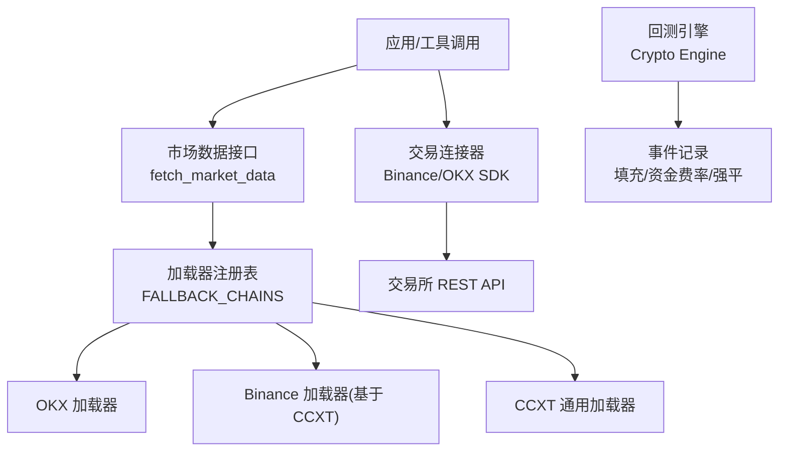
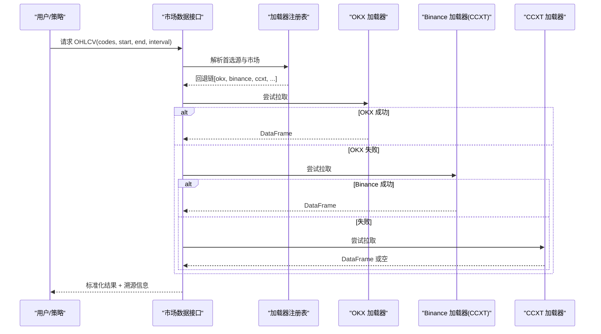
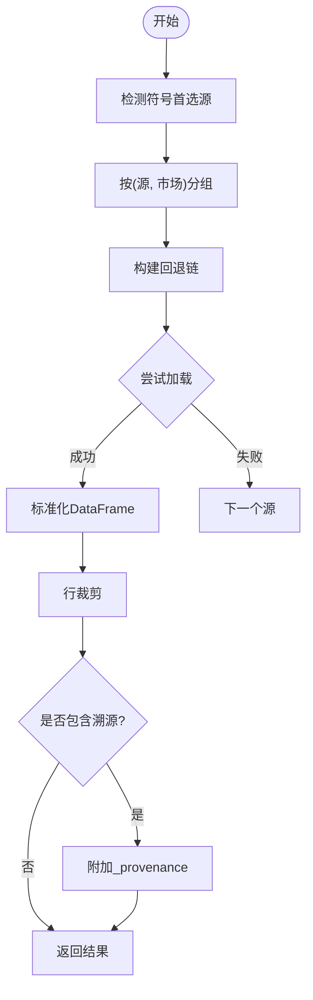
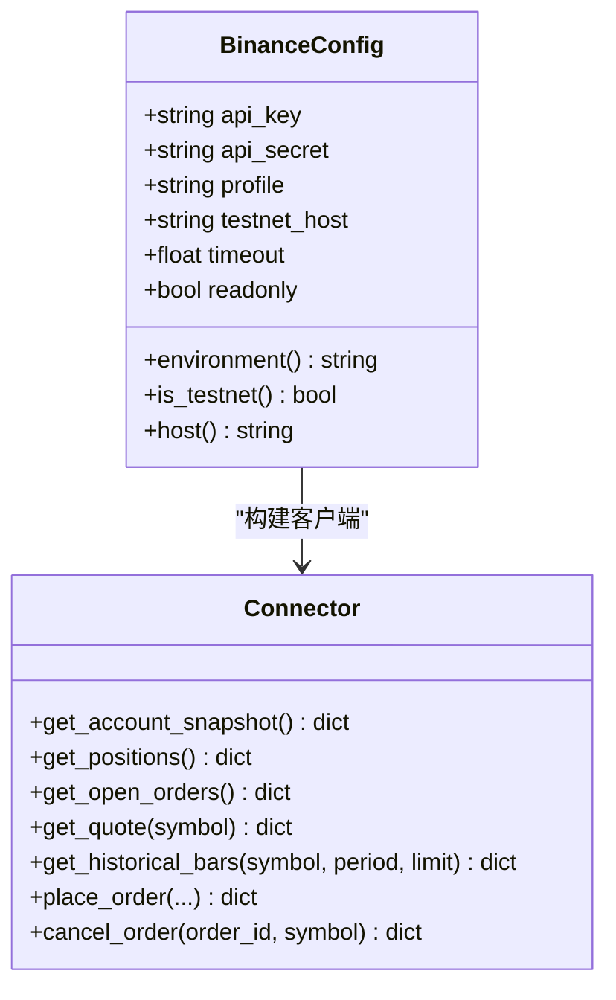
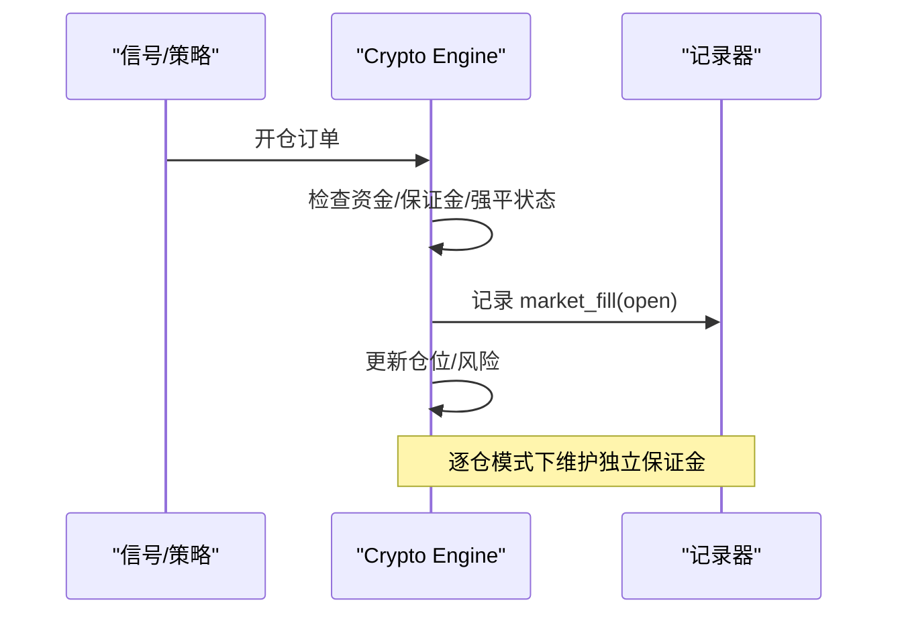
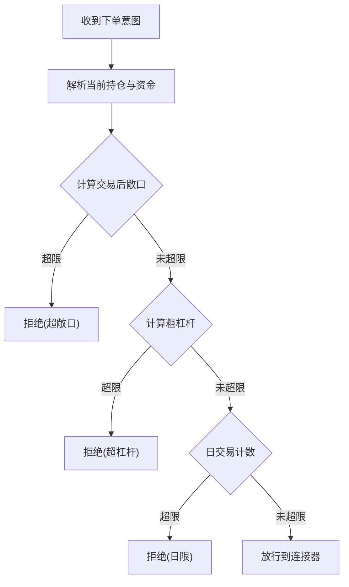
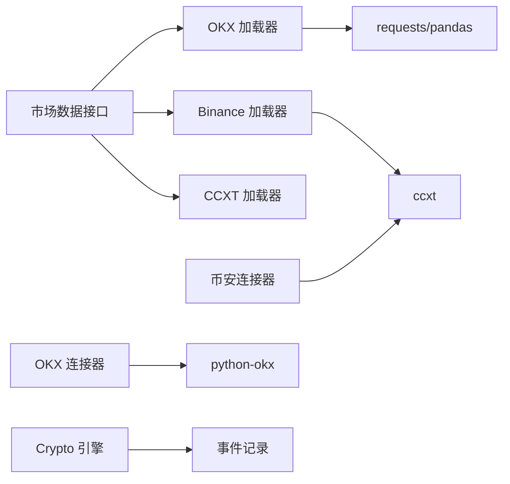

# 加密货币连接器

<cite>
**本文引用的文件**
- [README.md](file://README.md)
- [market_data.py](file://agent/src/market_data.py)
- [binance_loader.py](file://agent/backtest/loaders/binance_loader.py)
- [okx.py](file://agent/backtest/loaders/okx.py)
- [ccxt_loader.py](file://agent/backtest/loaders/ccxt_loader.py)
- [binance_sdk.py](file://agent/src/trading/connectors/binance/sdk.py)
- [okx_sdk.py](file://agent/src/trading/connectors/okx/sdk.py)
- [crypto_engine.py](file://agent/backtest/engines/crypto.py)
- [enforcement.py](file://agent/src/live/enforcement.py)
- [SKILL: perp-funding-basis](file://agent/src/skills/perp-funding-basis/SKILL.md)
- [SKILL: crypto-derivatives](file://agent/src/skills/crypto-derivatives/SKILL.md)
</cite>

## 目录
1. [简介](#简介)
2. [项目结构](#项目结构)
3. [核心组件](#核心组件)
4. [架构总览](#架构总览)
5. [详细组件分析](#详细组件分析)
6. [依赖关系分析](#依赖关系分析)
7. [性能与可靠性](#性能与可靠性)
8. [故障排查指南](#故障排查指南)
9. [结论](#结论)
10. [附录](#附录)

## 简介
本技术文档面向“加密货币连接器”能力，覆盖主流交易所（币安、OKX、CCXT 聚合等）的现货与合约接入、资金管理与钱包操作、市场数据订阅、API 认证与安全配置，以及策略实现（套利、做市、趋势跟踪）。文档基于仓库中已实现的加载器、连接器与回测引擎进行说明，并提供架构图、时序图与流程图帮助理解。

## 项目结构
围绕加密货币交易的关键代码分布在以下位置：
- 市场数据加载层：统一通过 loader 注册表与回退链获取 OHLCV，支持 OKX、Binance（via CCXT）、CCXT 通用等。
- 交易连接器层：提供币安与 OKX 的账户、持仓、订单、行情与历史 K 线读取；写路径（下单/撤单）在连接器内以安全方式暴露，并在上层受指令与风控约束。
- 回测引擎层：针对加密货币与永续合约的回测逻辑，包含保证金、强平、资金费率等事件记录。
- 策略技能与知识：永续资金费率与基差、衍生品策略等策略指引。

图表来源
- [market_data.py:97-234](file://agent/src/market_data.py#L97-L234)
- [okx.py:101-208](file://agent/backtest/loaders/okx.py#L101-L208)
- [binance_loader.py:23-45](file://agent/backtest/loaders/binance_loader.py#L23-L45)
- [ccxt_loader.py:1-200](file://agent/backtest/loaders/ccxt_loader.py#L1-L200)
- [binance_sdk.py:267-405](file://agent/src/trading/connectors/binance/sdk.py#L267-L405)
- [okx_sdk.py:248-349](file://agent/src/trading/connectors/okx/sdk.py#L248-L349)
- [crypto_engine.py:486-549](file://agent/backtest/engines/crypto.py#L486-L549)

章节来源
- [README.md:1-166](file://README.md#L1-L166)

## 核心组件
- 统一市场数据接口：按符号自动选择首选源，并沿市场回退链尝试多个加载器，返回标准化 OHLCV，附带来源溯源信息（如成交量单位）。
- 交易所加载器：
  - OKX：公共 REST 获取 K 线，支持历史深度拉取、代理、重试与预算控制。
  - Binance（加载器）：基于 CCXT 的 binance/binanceusdm 公开数据。
  - CCXT：通用多交易所统一封装。
- 交易连接器：
  - 币安：通过 ccxt 统一客户端，提供账户快照、持仓、订单、报价、历史 K 线；写路径（下单/撤单）具备参数校验与环境隔离。
  - OKX：通过 python-okx SDK，提供账户、持仓、订单、报价、历史 K 线；写路径具备签名与失败关闭策略。
- 回测引擎：加密货币专用引擎，支持永续严格模式、逐仓/全仓、资金费率与强平事件记录。
- 策略技能：永续资金费率与基差、跨期结构与期权波动率策略指引。

章节来源
- [market_data.py:97-234](file://agent/src/market_data.py#L97-L234)
- [okx.py:101-208](file://agent/backtest/loaders/okx.py#L101-L208)
- [binance_loader.py:23-45](file://agent/backtest/loaders/binance_loader.py#L23-L45)
- [binance_sdk.py:267-405](file://agent/src/trading/connectors/binance/sdk.py#L267-L405)
- [okx_sdk.py:248-349](file://agent/src/trading/connectors/okx/sdk.py#L248-L349)
- [crypto_engine.py:486-549](file://agent/backtest/engines/crypto.py#L486-L549)

## 架构总览
系统采用“加载器 + 连接器 + 引擎”的分层设计：
- 数据层：统一入口 fetch_market_data 根据符号识别市场与首选源，沿回退链依次尝试加载器，保证高可用与容错。
- 连接层：连接器对交易所 SDK 或统一客户端进行封装，提供只读与受限写能力；环境隔离（测试网/实盘）由配置与头部/主机名强制约束。
- 执行层：回测引擎将信号转换为订单，记录填充、资金费率、强平等事件，支持严格模式下的真实生命周期模拟。

图表来源
- [market_data.py:97-234](file://agent/src/market_data.py#L97-L234)
- [okx.py:131-208](file://agent/backtest/loaders/okx.py#L131-L208)
- [binance_loader.py:23-45](file://agent/backtest/loaders/binance_loader.py#L23-L45)
- [ccxt_loader.py:1-200](file://agent/backtest/loaders/ccxt_loader.py#L1-L200)

## 详细组件分析

### 市场数据加载与回退机制
- 自动源检测：根据符号规则匹配首选源（如 BTC-USDT → okx，BTC/USDT → ccxt），未匹配则默认 tushare。
- 回退链：按市场维度组织回退顺序，避免跨市场误路由；可配置最大回退次数。
- 结果裁剪与溯源：限制每符号行数，输出 _provenance 包含 source、requested_source、detected_source、fallback_used、volume_unit 等。

图表来源
- [market_data.py:51-84](file://agent/src/market_data.py#L51-L84)
- [market_data.py:97-234](file://agent/src/market_data.py#L97-L234)

章节来源
- [market_data.py:51-84](file://agent/src/market_data.py#L51-L84)
- [market_data.py:97-234](file://agent/src/market_data.py#L97-L234)

### OKX 加载器（现货 K 线）
- 端点选择：近期使用 /market/candles，历史范围优先 /market/history-candles。
- 时间粒度映射：支持 1m/5m/15m/30m/1h/4h/1d 等，大小写兼容。
- 健壮性：代理支持、HTTP 429/5xx 重试、业务码非 0 报错、预算与页上限控制。
- 数据清洗：确认标志过滤、UTC 时间对齐、去重与区间裁剪。

章节来源
- [okx.py:34-69](file://agent/backtest/loaders/okx.py#L34-L69)
- [okx.py:101-208](file://agent/backtest/loaders/okx.py#L101-L208)
- [okx.py:220-373](file://agent/backtest/loaders/okx.py#L220-L373)

### Binance 加载器（基于 CCXT）
- 仅公开市场数据，无需 API Key。
- 通过 CCXT 的 binance/binanceusdm 交换类获取 OHLCV。
- 与 OKX 并列存在于加密回退链，提升可用性。

章节来源
- [binance_loader.py:1-45](file://agent/backtest/loaders/binance_loader.py#L1-L45)

### CCXT 通用加载器
- 作为通用桥接层，支持多交易所统一访问。
- 提供代理、超时、错误处理等基础能力，供 Binance 加载器复用。

章节来源
- [ccxt_loader.py:1-200](file://agent/backtest/loaders/ccxt_loader.py#L1-L200)

### 币安连接器（SDK）
- 只读能力：账户快照、持仓（从余额推导）、订单、报价、历史 K 线。
- 写能力：下单/撤单，参数严格校验，失败关闭；支持按名义金额（quoteOrderQty）或数量下单。
- 环境隔离：测试网与实盘通过不同主机与 set_sandbox_mode 区分；每次调用前断言主机一致性，防止密钥/主机不匹配。
- 配置管理：本地 JSON 配置文件，权限收紧，支持 profile 覆盖与 CLI 覆盖。

图表来源
- [binance_sdk.py:82-152](file://agent/src/trading/connectors/binance/sdk.py#L82-L152)
- [binance_sdk.py:267-405](file://agent/src/trading/connectors/binance/sdk.py#L267-L405)
- [binance_sdk.py:423-547](file://agent/src/trading/connectors/binance/sdk.py#L423-L547)
- [binance_sdk.py:550-600](file://agent/src/trading/connectors/binance/sdk.py#L550-L600)
- [binance_sdk.py:628-663](file://agent/src/trading/connectors/binance/sdk.py#L628-L663)

章节来源
- [binance_sdk.py:267-405](file://agent/src/trading/connectors/binance/sdk.py#L267-L405)
- [binance_sdk.py:423-547](file://agent/src/trading/connectors/binance/sdk.py#L423-L547)
- [binance_sdk.py:550-600](file://agent/src/trading/connectors/binance/sdk.py#L550-L600)
- [binance_sdk.py:628-663](file://agent/src/trading/connectors/binance/sdk.py#L628-L663)

### OKX 连接器（SDK）
- 只读能力：账户、持仓、订单、报价、历史 K 线。
- 写能力：下单/撤单，参数校验与失败关闭；spot 使用现金交易模式。
- 环境隔离：通过 SDK flag（demo/live）与可选 UID 校验；每次调用携带 paper_guard 标记。
- 配置管理：本地 JSON 配置文件，权限收紧，支持 profile 覆盖。

章节来源
- [okx_sdk.py:51-133](file://agent/src/trading/connectors/okx/sdk.py#L51-L133)
- [okx_sdk.py:186-245](file://agent/src/trading/connectors/okx/sdk.py#L186-L245)
- [okx_sdk.py:248-349](file://agent/src/trading/connectors/okx/sdk.py#L248-L349)
- [okx_sdk.py:371-479](file://agent/src/trading/connectors/okx/sdk.py#L371-L479)
- [okx_sdk.py:482-526](file://agent/src/trading/connectors/okx/sdk.py#L482-L526)
- [okx_sdk.py:597-615](file://agent/src/trading/connectors/okx/sdk.py#L597-L615)

### 加密货币回测引擎（含永续合约）
- 开仓/加仓/减仓/平仓流程：在严格模式下记录 market_fill 事件，分离执行价与标记价。
- 逐仓模式：维护独立保证金账户，强平后阻止后续调整。
- 强平与清算：在终端状态为强平时拒绝新增仓位，确保回测真实性。

图表来源
- [crypto_engine.py:486-549](file://agent/backtest/engines/crypto.py#L486-L549)

章节来源
- [crypto_engine.py:486-549](file://agent/backtest/engines/crypto.py#L486-L549)

### 资金管理与风控（订单前置校验）
- 暴露额度与杠杆限制：计算交易后总敞口与粗杠杆，超过限额即拒绝。
- 日交易次数限制：按 UTC 日历统计，超限拒绝。
- 失败关闭：任何不可解析或异常均返回拒绝，避免副作用。

图表来源
- [enforcement.py:551-597](file://agent/src/live/enforcement.py#L551-L597)

章节来源
- [enforcement.py:551-597](file://agent/src/live/enforcement.py#L551-L597)

### 策略实现参考（永续资金费率与基差、衍生品）
- 永续资金费率：每 8 小时结算，年化 = 8h 费率 × 3 × 365；正负费率指示多空情绪与套利机会。
- 基差与期限结构：Contango/Backwardation 用于跨期与现金+期货套利。
- 风险控制：低杠杆、高保证金比例、分散币种、止损阈值。

章节来源
- [SKILL: perp-funding-basis:1-38](file://agent/src/skills/perp-funding-basis/SKILL.md#L1-L38)
- [SKILL: crypto-derivatives:1-80](file://agent/src/skills/crypto-derivatives/SKILL.md#L1-L80)

## 依赖关系分析
- 市场数据依赖：
  - OKX 加载器：requests、pandas、缓存与重试工具。
  - Binance 加载器：ccxt（binance/binanceusdm）。
  - CCXT 加载器：统一客户端封装。
- 连接器依赖：
  - 币安连接器：ccxt（可选），本地 JSON 配置。
  - OKX 连接器：python-okx（可选），本地 JSON 配置。
- 回测引擎：pandas、事件记录、风险模型。

图表来源
- [okx.py:24-69](file://agent/backtest/loaders/okx.py#L24-L69)
- [binance_loader.py:15-45](file://agent/backtest/loaders/binance_loader.py#L15-L45)
- [binance_sdk.py:608-640](file://agent/src/trading/connectors/binance/sdk.py#L608-L640)
- [okx_sdk.py:589-615](file://agent/src/trading/connectors/okx/sdk.py#L589-L615)

章节来源
- [okx.py:24-69](file://agent/backtest/loaders/okx.py#L24-L69)
- [binance_loader.py:15-45](file://agent/backtest/loaders/binance_loader.py#L15-L45)
- [binance_sdk.py:608-640](file://agent/src/trading/connectors/binance/sdk.py#L608-L640)
- [okx_sdk.py:589-615](file://agent/src/trading/connectors/okx/sdk.py#L589-L615)

## 性能与可靠性
- 数据拉取优化：
  - OKX 历史优先：长时段优先 history-candles，减少空结果。
  - 分页与预算：按粒度设置最大页数，结合预算与重试，避免超时与限流。
  - 缓存：加载器级缓存减少重复网络请求。
- 连接器健壮性：
  - 失败关闭：参数校验失败直接返回错误，不发送请求。
  - 环境隔离：主机/头部/UID 校验，防止误连实盘。
- 回测真实性：
  - 严格模式：先结算历史资金费率再填充，逐仓强平真实发生。
  - 事件记录：填充、资金费率、强平事件完整持久化。

章节来源
- [okx.py:131-208](file://agent/backtest/loaders/okx.py#L131-L208)
- [okx.py:220-373](file://agent/backtest/loaders/okx.py#L220-L373)
- [binance_sdk.py:423-547](file://agent/src/trading/connectors/binance/sdk.py#L423-L547)
- [okx_sdk.py:371-479](file://agent/src/trading/connectors/okx/sdk.py#L371-L479)
- [crypto_engine.py:486-549](file://agent/backtest/engines/crypto.py#L486-L549)

## 故障排查指南
- 无法拉取数据：
  - 检查网络代理环境变量（ALL_PROXY/HTTP_PROXY/HTTPS_PROXY）。
  - 查看 OKX 探测与业务码错误日志，确认 is_available 与 code 字段。
  - 切换回退链中的其他源（如从 OKX 切换到 Binance/CCXT）。
- 连接器健康检查失败：
  - 币安：确认 ccxt 安装、配置文件存在且 host 与 profile 一致。
  - OKX：确认 python-okx 安装、flag 正确、expected_uid 匹配。
- 下单被拒：
  - 检查参数（side/order_type/quantity/notional/limit_price）合法性。
  - 检查前置风控（敞口、杠杆、日交易次数）是否超限。
  - 查看失败关闭的错误消息，定位具体原因。

章节来源
- [okx.py:109-125](file://agent/backtest/loaders/okx.py#L109-L125)
- [okx.py:291-315](file://agent/backtest/loaders/okx.py#L291-L315)
- [binance_sdk.py:217-264](file://agent/src/trading/connectors/binance/sdk.py#L217-L264)
- [okx_sdk.py:186-245](file://agent/src/trading/connectors/okx/sdk.py#L186-L245)
- [binance_sdk.py:423-547](file://agent/src/trading/connectors/binance/sdk.py#L423-L547)
- [okx_sdk.py:371-479](file://agent/src/trading/connectors/okx/sdk.py#L371-L479)
- [enforcement.py:551-597](file://agent/src/live/enforcement.py#L551-L597)

## 结论
本项目提供了完善的加密货币连接器能力：通过统一市场数据接口与多源回退链保障数据可用性；通过币安与 OKX 连接器实现安全的只读与受限写能力；通过加密货币回测引擎支持永续合约的真实生命周期模拟；配套的策略技能文档为资金费率套利、期限结构与期权策略提供实践指导。整体架构清晰、健壮性强，适合研究与生产环境的扩展与集成。

## 附录
- 术语说明：
  - 永续合约：无到期日的衍生品，通过资金费率锚定现货价格。
  - 交割合约：有明确到期日的期货合约。
  - 基差：现货与期货价差，反映市场预期与资金成本。
  - 逐仓/全仓：逐仓为每个仓位独立保证金；全仓为账户共享保证金。
- 最佳实践：
  - 始终使用回退链与缓存，降低网络与限流影响。
  - 写路径必须经过前置风控与失败关闭策略。
  - 严格模式回测下关注资金费率与强平事件，确保策略稳健性。