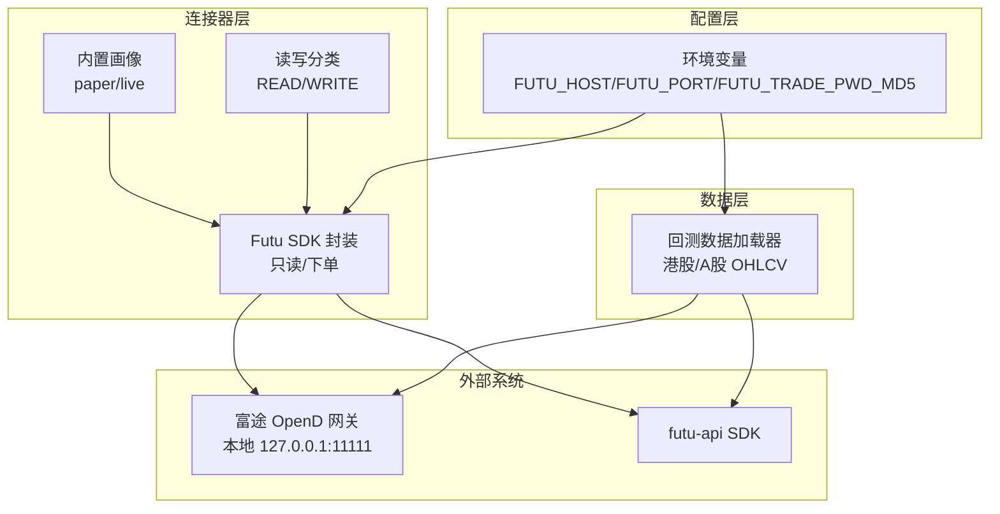
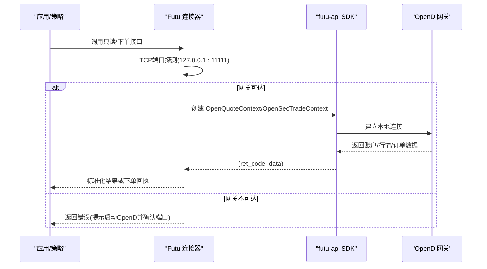
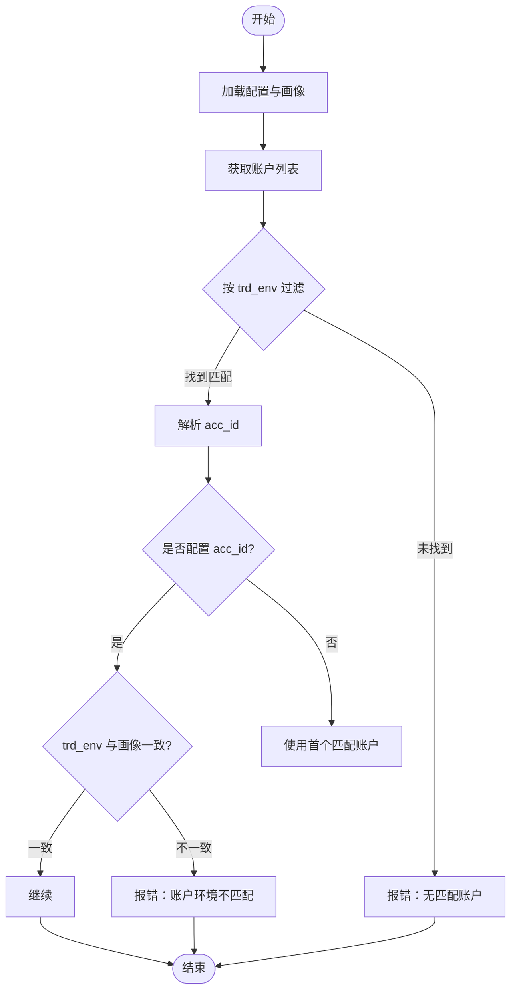
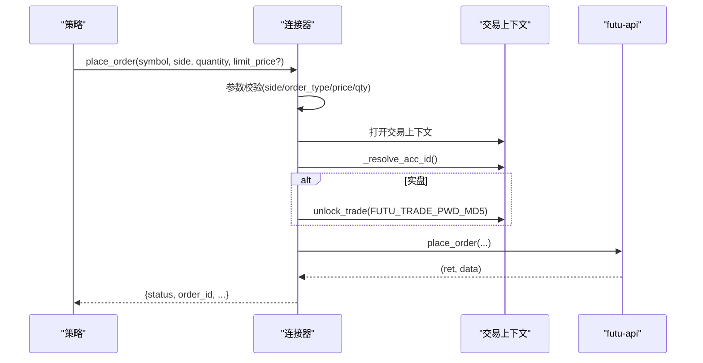
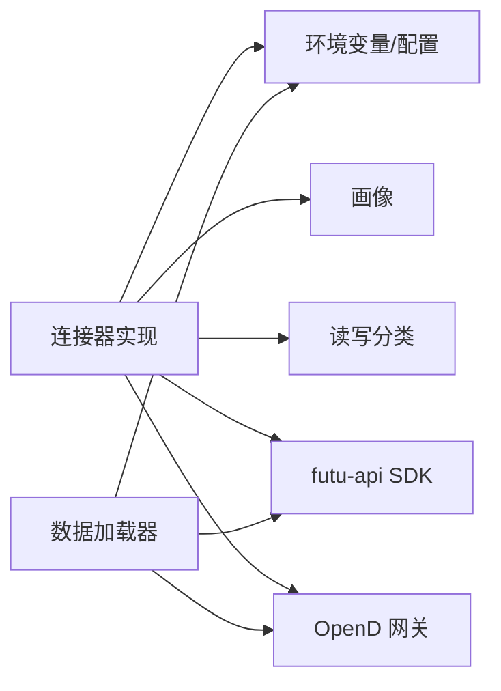

# 富途连接器

<cite>
**本文引用的文件**
- [sdk.py](file://agent/src/trading/connectors/futu/sdk.py)
- [profiles.py](file://agent/src/trading/connectors/futu/profiles.py)
- [classification.py](file://agent/src/trading/connectors/futu/classification.py)
- [futu_loader.py](file://agent/backtest/loaders/futu.py)
- [env_schema.py](file://agent/src/config/env_schema.py)
- [test_futu_loader.py](file://agent/tests/test_futu_loader.py)
</cite>

## 目录
1. [简介](#简介)
2. [项目结构](#项目结构)
3. [核心组件](#核心组件)
4. [架构总览](#架构总览)
5. [详细组件分析](#详细组件分析)
6. [依赖关系分析](#依赖关系分析)
7. [性能与稳定性](#性能与稳定性)
8. [故障排查指南](#故障排查指南)
9. [结论](#结论)
10. [附录](#附录)

## 简介
本文件为富途（Futu）连接器的技术文档，聚焦于通过本地 OpenD 网关使用官方 futu-api SDK 的只读与交易能力。文档涵盖：
- OpenD 客户端配置要点（本地安装、端口、授权码/密码相关）
- 港股与美股交易能力边界（买卖、期权、融资融券等）
- A股通（沪深港通）数据获取能力
- 实时行情订阅能力说明
- 多账户管理方案（模拟与实盘切换）
- 连接稳定性保障（断线检测、错误降级、异常恢复）
- 实际交易流程与最佳实践（风险控制与安全注意事项）

## 项目结构
富途连接器由以下关键部分组成：
- 连接器实现：位于 agent/src/trading/connectors/futu/sdk.py，封装 futu-api 的只读与交易接口，提供账户、持仓、订单、报价、历史K线等能力
- 内置交易画像：位于 agent/src/trading/connectors/futu/profiles.py，定义纸模拟与实盘的只读/可下单画像
- 读写分类：位于 agent/src/trading/connectors/futu/classification.py，标注哪些SDK方法属于读/写，用于实盘风控门控
- 回测数据加载器：位于 agent/backtest/loaders/futu.py，基于 futu-api 拉取港股与A股OHLCV数据
- 环境变量与配置：位于 agent/src/config/env_schema.py，定义 FUTU_HOST、FUTU_PORT、FUTU_TRADE_PWD_MD5 等
- 测试用例：位于 agent/tests/test_futu_loader.py，覆盖符号映射、区间映射、可用性检查与分页拉取等

图表来源
- [sdk.py:1-25](file://agent/src/trading/connectors/futu/sdk.py#L1-L25)
- [profiles.py:14-80](file://agent/src/trading/connectors/futu/profiles.py#L14-L80)
- [classification.py:18-31](file://agent/src/trading/connectors/futu/classification.py#L18-L31)
- [futu_loader.py:106-116](file://agent/backtest/loaders/futu.py#L106-L116)
- [env_schema.py:208-209](file://agent/src/config/env_schema.py#L208-L209)
- [env_schema.py:375-375](file://agent/src/config/env_schema.py#L375-L375)

章节来源
- [sdk.py:1-25](file://agent/src/trading/connectors/futu/sdk.py#L1-L25)
- [profiles.py:14-80](file://agent/src/trading/connectors/futu/profiles.py#L14-L80)
- [classification.py:18-31](file://agent/src/trading/connectors/futu/classification.py#L18-L31)
- [futu_loader.py:106-116](file://agent/backtest/loaders/futu.py#L106-L116)
- [env_schema.py:208-209](file://agent/src/config/env_schema.py#L208-L209)
- [env_schema.py:375-375](file://agent/src/config/env_schema.py#L375-L375)

## 核心组件
- FutuConfig：连接器配置对象，包含 host、port、profile、security_firm、filter_trdmarket、acc_id、timeout、readonly 等字段，并提供 from_mapping/with_overrides 等方法
- 只读接口：get_account_snapshot、get_positions、get_open_orders、get_quote、get_historical_bars
- 交易接口：place_order、cancel_order；实盘下单需解锁交易上下文（unlock_trade），并通过环境变量传入交易密码MD5
- 账户环境隔离：通过 trd_env（SIMULATE/REAL）区分纸模拟与实盘，并在解析账户时做严格匹配，防止误用
- 数据加载器：FutuLoader 支持港股与A股的OHLCV历史数据拉取，支持多种周期映射与分页读取

章节来源
- [sdk.py:71-157](file://agent/src/trading/connectors/futu/sdk.py#L71-L157)
- [sdk.py:275-393](file://agent/src/trading/connectors/futu/sdk.py#L275-L393)
- [sdk.py:755-962](file://agent/src/trading/connectors/futu/sdk.py#L755-L962)
- [sdk.py:1060-1101](file://agent/src/trading/connectors/futu/sdk.py#L1060-L1101)
- [futu_loader.py:106-253](file://agent/backtest/loaders/futu.py#L106-L253)

## 架构总览
富途连接器采用“本地 OpenD 网关 + futu-api SDK”的架构。应用侧不直接持有富途登录凭据，所有交易与行情均通过本地网关转发。连接器在每次连接前进行TCP端口探测，若网关不可达则快速失败并返回清晰错误信息。账户选择通过 get_acc_list 结合 trd_env 进行强校验，确保纸模拟与实盘隔离。

图表来源
- [sdk.py:1012-1051](file://agent/src/trading/connectors/futu/sdk.py#L1012-L1051)
- [sdk.py:223-272](file://agent/src/trading/connectors/futu/sdk.py#L223-L272)

章节来源
- [sdk.py:1012-1051](file://agent/src/trading/connectors/futu/sdk.py#L1012-L1051)
- [sdk.py:223-272](file://agent/src/trading/connectors/futu/sdk.py#L223-L272)

## 详细组件分析

### 连接器配置与环境变量
- 默认网关地址与端口：127.0.0.1:11111
- 配置文件路径：~/.vibe-trading/futu.json（运行时根目录下）
- 环境变量：
  - FUTU_HOST / FUTU_PORT：用于数据加载器与部分配置
  - FUTU_TRADE_PWD_MD5：实盘下单所需的交易密码MD5（仅用于 unlock_trade）
- 配置构建优先级：保存的配置 ← 画像默认值 ← 调用时覆盖参数

章节来源
- [sdk.py:39-56](file://agent/src/trading/connectors/futu/sdk.py#L39-L56)
- [sdk.py:163-211](file://agent/src/trading/connectors/futu/sdk.py#L163-L211)
- [env_schema.py:208-209](file://agent/src/config/env_schema.py#L208-L209)
- [env_schema.py:375-375](file://agent/src/config/env_schema.py#L375-L375)

### 账户与画像（多账户管理）
- 内置画像：
  - futu-paper-sdk：只读纸模拟
  - futu-live-sdk-readonly：只读实盘
  - futu-paper-trade：纸模拟下单
  - futu-live-trade：实盘下单（需要 mandate 门控与交易密码解锁）
- 账户解析：通过 get_acc_list 筛选 trd_env=SIMULATE/REAL，若配置了 acc_id，则强制校验其环境与画像一致，否则拒绝
- 安全隔离：纸模拟账户永不解锁交易上下文；实盘账户仅在下单时尝试解锁，且必须提供正确的交易密码MD5

图表来源
- [sdk.py:1060-1101](file://agent/src/trading/connectors/futu/sdk.py#L1060-L1101)
- [profiles.py:14-80](file://agent/src/trading/connectors/futu/profiles.py#L14-L80)

章节来源
- [profiles.py:14-80](file://agent/src/trading/connectors/futu/profiles.py#L14-L80)
- [sdk.py:1060-1101](file://agent/src/trading/connectors/futu/sdk.py#L1060-L1101)

### 港股与美股交易能力
- 支持的账户市场过滤：filter_trdmarket（默认 HK）
- 交易类型：
  - 股票买卖：支持市价单与限价单（quantity 必填；notional 不支持）
  - 期权交易：连接器当前未暴露期权下单接口
  - 融资融券：连接器未暴露融资融券专用下单接口
- 下单流程：
  - 解析账户与 trd_env
  - 实盘下单前尝试 unlock_trade（需要 FUTU_TRADE_PWD_MD5）
  - 调用 place_order 提交订单，返回 order_id
  - 取消订单通过 modify_order(CANCEL)

图表来源
- [sdk.py:755-887](file://agent/src/trading/connectors/futu/sdk.py#L755-L887)
- [sdk.py:965-991](file://agent/src/trading/connectors/futu/sdk.py#L965-L991)

章节来源
- [sdk.py:755-887](file://agent/src/trading/connectors/futu/sdk.py#L755-L887)
- [sdk.py:965-991](file://agent/src/trading/connectors/futu/sdk.py#L965-L991)

### A股通（沪深港通）数据获取
- 数据加载器支持港股与A股（SZ/SH）的OHLCV历史数据
- 符号转换：将项目符号转换为富途格式（如 700.HK → HK.00700；000001.SZ → SZ.000001）
- 周期映射：支持 1m/5m/15m/30m/1H/4H/1D/1W/1M 等
- 分页拉取：支持 page_req_key 翻页，合并后标准化为统一列名与索引
- 缓存：对已拉取的数据进行缓存，减少重复请求

章节来源
- [futu_loader.py:39-55](file://agent/backtest/loaders/futu.py#L39-L55)
- [futu_loader.py:80-101](file://agent/backtest/loaders/futu.py#L80-L101)
- [futu_loader.py:140-253](file://agent/backtest/loaders/futu.py#L140-L253)
- [test_futu_loader.py:91-133](file://agent/tests/test_futu_loader.py#L91-L133)

### 实时行情订阅
- 连接器提供快照查询 get_market_snapshot，适用于获取某标的的即时报价
- 连接器未暴露流式订阅接口（如五档行情、逐笔成交、分时数据等）
- 如需流式行情，建议通过富途官方客户端或其他支持订阅的通道获取，再与本系统对接

章节来源
- [sdk.py:377-387](file://agent/src/trading/connectors/futu/sdk.py#L377-L387)

### 读写分类与实盘门控
- READ：账户查询、持仓查询、订单查询、成交查询、快照、历史K线、账户列表
- WRITE：下单、改单/撤单、解锁交易上下文
- 实盘下单受 mandate 门控保护，未满足条件时禁止写入

章节来源
- [classification.py:18-31](file://agent/src/trading/connectors/futu/classification.py#L18-L31)
- [profiles.py:46-80](file://agent/src/trading/connectors/futu/profiles.py#L46-L80)

## 依赖关系分析
- 外部依赖：
  - futu-api SDK：可选依赖，缺失时会抛出依赖错误
  - OpenD 网关：必须在本地运行并监听指定端口
- 内部依赖：
  - 配置模块：读取环境变量与用户级配置文件
  - 画像模块：定义不同画像的能力集与默认配置
  - 分类模块：标注SDK方法的读写属性，用于实盘风控

图表来源
- [sdk.py:1004-1051](file://agent/src/trading/connectors/futu/sdk.py#L1004-L1051)
- [futu_loader.py:118-138](file://agent/backtest/loaders/futu.py#L118-L138)
- [env_schema.py:208-209](file://agent/src/config/env_schema.py#L208-L209)
- [env_schema.py:375-375](file://agent/src/config/env_schema.py#L375-L375)

章节来源
- [sdk.py:1004-1051](file://agent/src/trading/connectors/futu/sdk.py#L1004-L1051)
- [futu_loader.py:118-138](file://agent/backtest/loaders/futu.py#L118-L138)
- [env_schema.py:208-209](file://agent/src/config/env_schema.py#L208-L209)
- [env_schema.py:375-375](file://agent/src/config/env_schema.py#L375-L375)

## 性能与稳定性
- 连接健康检查：check_status 会探测网关端口、SDK可用性与账户身份，便于快速定位问题
- 错误降级：所有读操作在 ret_code 非成功时返回空记录而非抛错；下单路径统一以 {"status":"error",...} 形式返回，避免异常上抛
- 资源释放：所有上下文在 finally 中关闭，避免连接泄漏
- 数据拉取优化：数据加载器支持分页与缓存，减少重复网络开销
- 风险隔离：账户环境强校验，防止纸模拟与实盘混用；实盘下单需密码解锁，降低误操作风险

章节来源
- [sdk.py:223-272](file://agent/src/trading/connectors/futu/sdk.py#L223-L272)
- [sdk.py:1122-1148](file://agent/src/trading/connectors/futu/sdk.py#L1122-L1148)
- [sdk.py:1104-1109](file://agent/src/trading/connectors/futu/sdk.py#L1104-L1109)
- [futu_loader.py:174-253](file://agent/backtest/loaders/futu.py#L174-L253)

## 故障排查指南
- 无法连接 OpenD：
  - 检查 OpenD 是否启动并登录
  - 确认端口是否为 11111（或自定义端口）
  - 查看 check_status 返回的 gateway.open 状态
- SDK 未安装：
  - 安装 futu-api 包
  - 检查 futu_available() 返回
- 账户环境不匹配：
  - 确认所选画像与账户 trd_env 一致
  - 若配置了 acc_id，确保该账户的环境与画像匹配
- 实盘下单失败：
  - 设置 FUTU_TRADE_PWD_MD5 环境变量
  - 确认 mandate 门控已通过
  - 检查 place_order 返回的错误信息
- 数据拉取失败：
  - 检查 FUTU_HOST/FUTU_PORT 是否正确
  - 确认周期映射是否受支持
  - 查看分页拉取过程中的错误日志

章节来源
- [sdk.py:223-272](file://agent/src/trading/connectors/futu/sdk.py#L223-L272)
- [sdk.py:1004-1027](file://agent/src/trading/connectors/futu/sdk.py#L1004-L1027)
- [sdk.py:1060-1101](file://agent/src/trading/connectors/futu/sdk.py#L1060-L1101)
- [sdk.py:755-887](file://agent/src/trading/connectors/futu/sdk.py#L755-L887)
- [futu_loader.py:125-138](file://agent/backtest/loaders/futu.py#L125-L138)
- [test_futu_loader.py:167-206](file://agent/tests/test_futu_loader.py#L167-L206)

## 结论
富途连接器通过本地 OpenD 网关与 futu-api SDK 提供了稳健的只读与交易能力。其设计强调：
- 安全隔离：纸模拟与实盘严格分离，账户环境强校验
- 稳定可靠：连接前探测、错误降级、资源及时释放
- 可扩展性：画像化配置与读写分类便于接入更多功能与风控策略
对于实时行情订阅与复杂衍生品交易，当前连接器主要提供快照与基础下单能力；如需更高级功能，建议结合富途官方客户端或其他订阅通道集成。

## 附录

### OpenD 客户端配置步骤（摘要）
- 安装富途 OpenD 客户端并登录
- 确认本地网关监听端口（默认 127.0.0.1:11111）
- 在系统中设置环境变量：
  - FUTU_HOST、FUTU_PORT（用于数据加载器）
  - FUTU_TRADE_PWD_MD5（仅实盘下单时需要）
- 在运行时根目录维护 futu.json 配置文件（host/port/profile/security_firm/filter_trdmarket/acc_id/timeout/readonly）

章节来源
- [sdk.py:39-56](file://agent/src/trading/connectors/futu/sdk.py#L39-L56)
- [sdk.py:163-211](file://agent/src/trading/connectors/futu/sdk.py#L163-L211)
- [env_schema.py:208-209](file://agent/src/config/env_schema.py#L208-L209)
- [env_schema.py:375-375](file://agent/src/config/env_schema.py#L375-L375)

### 实际交易流程与最佳实践
- 下单前校验：side、order_type、limit_price、quantity 等参数必须合法
- 账户选择：优先通过 trd_env 自动解析，必要时显式配置 acc_id 并保证环境一致
- 实盘解锁：仅在实盘下单时尝试解锁交易上下文，并确保密码MD5正确
- 风险控制：利用读写分类与 mandate 门控限制实盘写入；对错误路径统一返回结构化错误以便上层处理
- 安全注意：不在代码中硬编码密码；使用环境变量传递敏感信息；定期审计权限与画像配置

章节来源
- [sdk.py:755-887](file://agent/src/trading/connectors/futu/sdk.py#L755-L887)
- [classification.py:18-31](file://agent/src/trading/connectors/futu/classification.py#L18-L31)
- [profiles.py:46-80](file://agent/src/trading/connectors/futu/profiles.py#L46-L80)