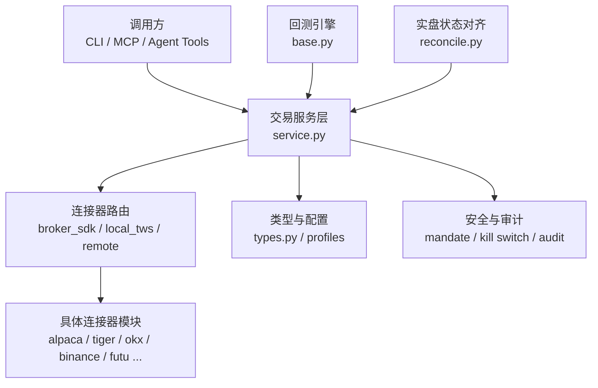
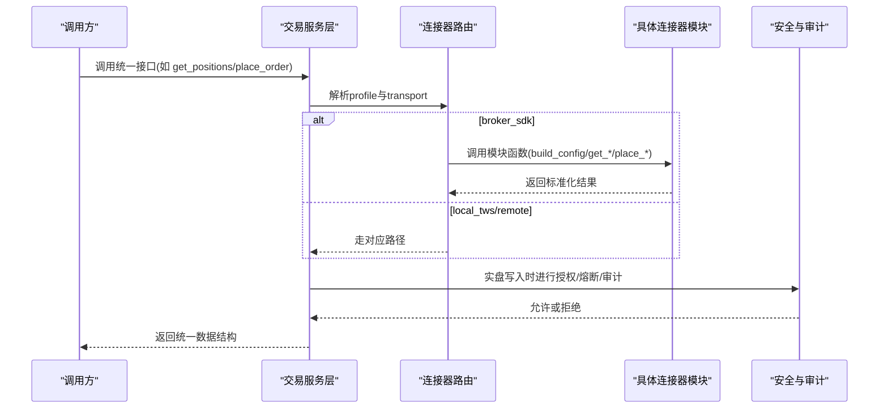
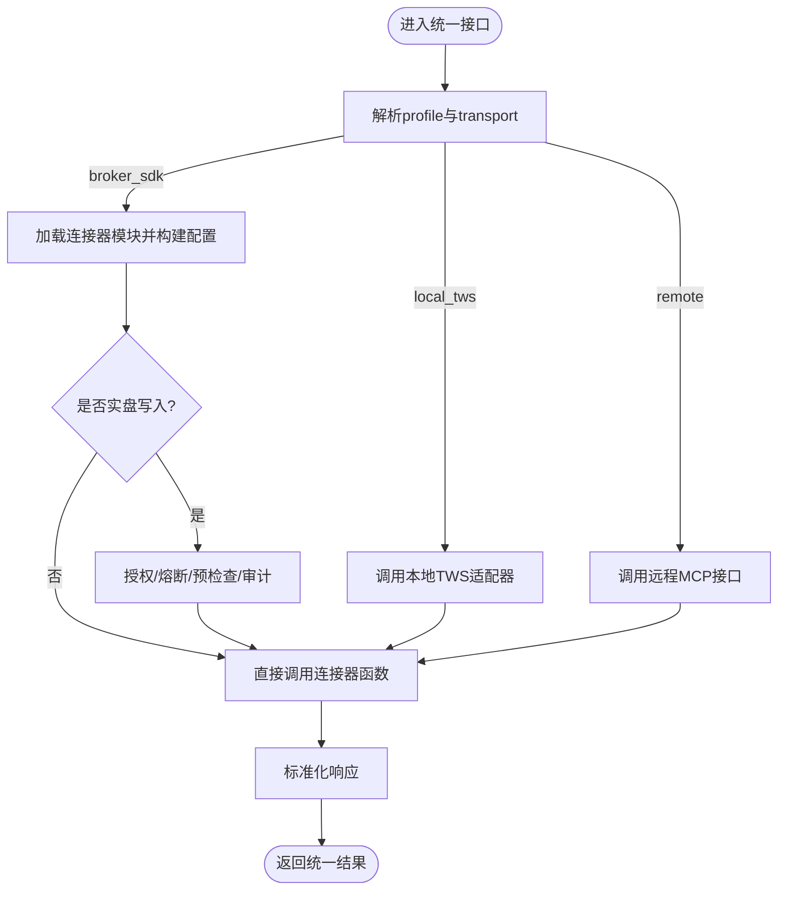
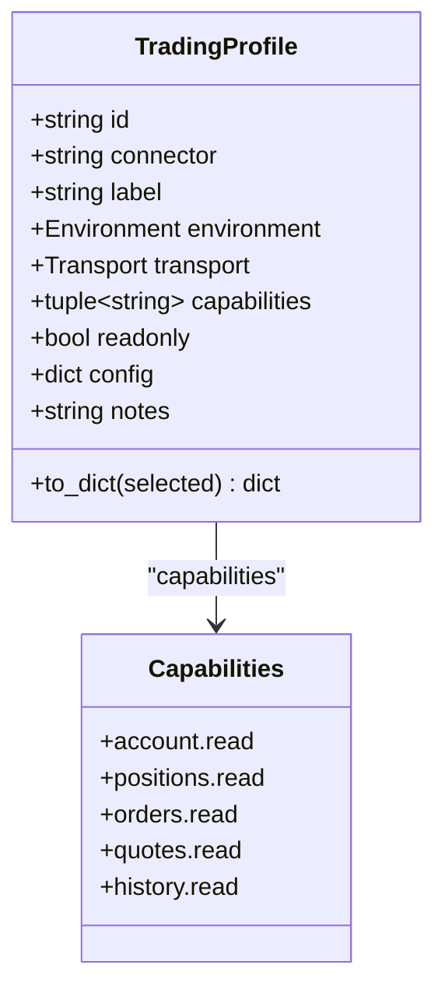
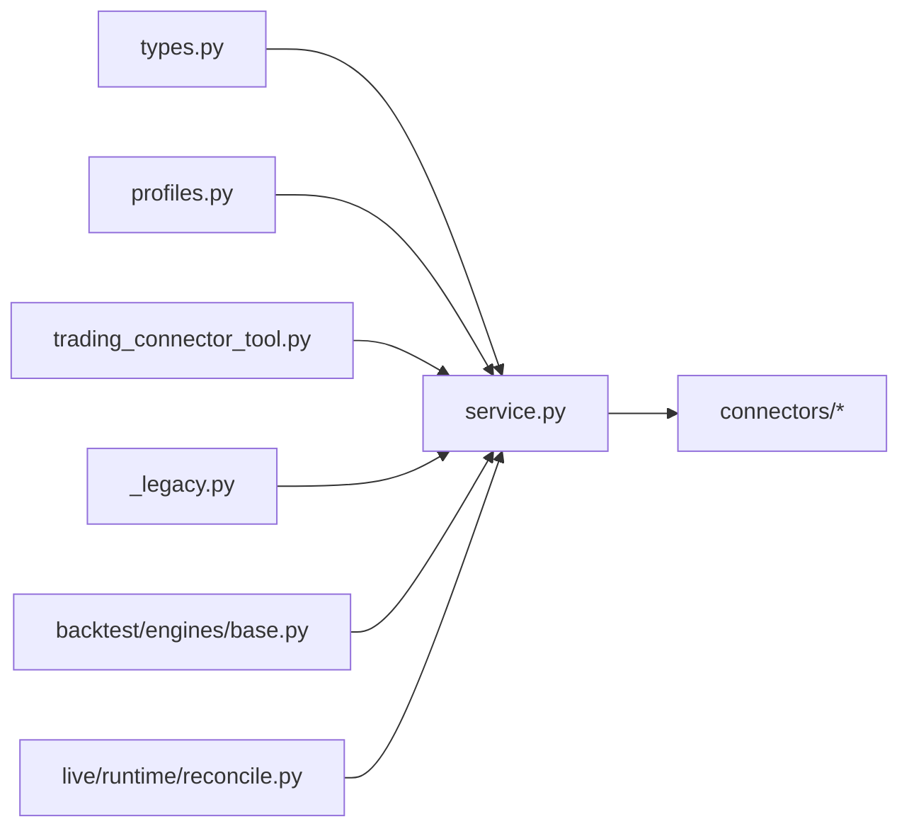

# 统一接口设计

<cite>
**本文引用的文件**
- [agent/src/trading/__init__.py](file://agent/src/trading/__init__.py)
- [agent/src/trading/types.py](file://agent/src/trading/types.py)
- [agent/src/trading/service.py](file://agent/src/trading/service.py)
- [agent/src/trading/connectors/alpaca/profiles.py](file://agent/src/trading/connectors/alpaca/profiles.py)
- [agent/src/tools/trading_connector_tool.py](file://agent/src/tools/trading_connector_tool.py)
- [agent/cli/_legacy.py](file://agent/cli/_legacy.py)
- [agent/backtest/engines/base.py](file://agent/backtest/engines/base.py)
- [agent/src/live/runtime/reconcile.py](file://agent/src/live/runtime/reconcile.py)
</cite>

## 目录
1. [简介](#简介)
2. [项目结构](#项目结构)
3. [核心组件](#核心组件)
4. [架构总览](#架构总览)
5. [详细组件分析](#详细组件分析)
6. [依赖关系分析](#依赖关系分析)
7. [性能考虑](#性能考虑)
8. [故障排查指南](#故障排查指南)
9. [结论](#结论)
10. [附录](#附录)

## 简介
本技术文档围绕“统一接口设计”展开，聚焦交易接口的抽象层与标准化规范。内容涵盖：
- 统一的订单管理、账户查询、市场数据获取等核心接口规范
- 数据模型标准化（订单状态、持仓信息、资金余额等）
- 错误处理机制（异常分类、错误码定义、重试策略）
- 连接管理与会话维护（连接池、心跳检测、自动重连）
- 接口扩展指南（新券商适配步骤、实现规范、测试验证方法）
- 性能优化建议与最佳实践

目标是帮助开发者快速理解并实现新的券商集成，同时保证系统的一致性与可维护性。

## 项目结构
本项目采用分层与插件化组织方式：
- 交易抽象层：位于 agent/src/trading，提供统一的交易操作入口与类型定义
- 连接器实现：位于 agent/src/trading/connectors，按券商或平台拆分具体实现
- 工具与CLI：通过 agent/src/tools 与 agent/cli 暴露统一能力给上层调用
- 回测引擎：agent/backtest/engines 提供回测与执行逻辑
- 实盘运行时：agent/src/live/runtime 负责状态对齐与持久化

图表来源
- [agent/src/trading/service.py:1-120](file://agent/src/trading/service.py#L1-L120)
- [agent/src/trading/types.py:1-52](file://agent/src/trading/types.py#L1-L52)
- [agent/backtest/engines/base.py:943-1389](file://agent/backtest/engines/base.py#L943-L1389)
- [agent/src/live/runtime/reconcile.py:584-608](file://agent/src/live/runtime/reconcile.py#L584-L608)

章节来源
- [agent/src/trading/__init__.py:1-32](file://agent/src/trading/__init__.py#L1-L32)
- [agent/src/trading/types.py:1-52](file://agent/src/trading/types.py#L1-L52)
- [agent/src/trading/service.py:1-230](file://agent/src/trading/service.py#L1-L230)

## 核心组件
- 统一交易服务：提供账户查询、持仓、订单、行情、历史K线、下单、撤单等统一API
- 连接器路由：根据 profile.transport 选择本地TWS、远程MCP或直接SDK模式
- 类型与能力声明：TradingProfile 描述连接器的能力集、环境、传输方式等
- 工具封装：将统一接口暴露为工具函数，便于CLI与Agent调用
- 回测与实盘：回测引擎基于统一接口进行模拟；实盘运行时对状态进行对齐与持久化

章节来源
- [agent/src/trading/service.py:42-230](file://agent/src/trading/service.py#L42-L230)
- [agent/src/trading/types.py:37-68](file://agent/src/trading/types.py#L37-L68)
- [agent/src/tools/trading_connector_tool.py:731-759](file://agent/src/tools/trading_connector_tool.py#L731-L759)
- [agent/backtest/engines/base.py:943-1389](file://agent/backtest/engines/base.py#L943-L1389)
- [agent/src/live/runtime/reconcile.py:584-608](file://agent/src/live/runtime/reconcile.py#L584-L608)

## 架构总览
统一接口通过 service.py 作为中枢，屏蔽底层券商差异，向上提供一致的数据结构与行为。关键流程包括：
- 读取类接口：账户、持仓、订单、报价、历史K线
- 写入类接口：下单、撤单、部分平仓、止损止盈编辑、复制交易等
- 安全门控：实盘写入需经过授权、熔断、预检查与审计
- 连接器适配：不同券商以模块形式接入，遵循统一读/写接口约定

图表来源
- [agent/src/trading/service.py:42-230](file://agent/src/trading/service.py#L42-L230)
- [agent/src/trading/service.py:283-374](file://agent/src/trading/service.py#L283-L374)

## 详细组件分析

### 统一交易服务（service.py）
- 功能要点
  - 统一读取：get_account、get_positions、get_open_orders、get_quote、get_history
  - 统一写入：place_order、cancel_order、close_position、edit_position_stops、copy_*
  - 连接器路由：根据 transport 选择 local_tws、broker_sdk 或 remote
  - 安全门控：实盘写入经 mandate、kill switch、pre-trade checks、audit
- 数据流
  - 输入：profile_id、symbol、side、quantity/notional、order_type、time_in_force 等
  - 输出：统一的结构化响应，包含 status、error、data 字段
- 错误处理
  - 不支持的能力返回结构化错误
  - 参数校验失败返回明确错误信息
  - 外部异常捕获后包装为统一错误格式

图表来源
- [agent/src/trading/service.py:42-230](file://agent/src/trading/service.py#L42-L230)
- [agent/src/trading/service.py:283-374](file://agent/src/trading/service.py#L283-L374)

章节来源
- [agent/src/trading/service.py:42-230](file://agent/src/trading/service.py#L42-L230)
- [agent/src/trading/service.py:283-374](file://agent/src/trading/service.py#L283-L374)

### 类型与能力（types.py）
- TradingProfile 描述连接器的标识、标签、环境、传输方式、能力集、只读标志与配置
- READ_CAPABILITIES 定义读取类能力集合
- Environment 与 Transport 枚举约束使用范围

图表来源
- [agent/src/trading/types.py:11-52](file://agent/src/trading/types.py#L11-L52)

章节来源
- [agent/src/trading/types.py:1-52](file://agent/src/trading/types.py#L1-L52)

### 连接器示例（Alpaca profiles.py）
- 内置 Alpaca 的纸交易与实盘配置文件
- 标注读写能力，实盘下单需要 mandate 支持
- 通过 capability 声明限制与提示

章节来源
- [agent/src/trading/connectors/alpaca/profiles.py:1-13](file://agent/src/trading/connectors/alpaca/profiles.py#L1-L13)

### 工具封装（trading_connector_tool.py）
- 将统一接口封装为工具函数，供CLI与Agent调用
- 下单工具参数包括 symbol、side、quantity/notional、order_type、time_in_force 等
- 强调幂等与安全：下单不可重复提交，实盘需通过授权与审计

章节来源
- [agent/src/tools/trading_connector_tool.py:731-759](file://agent/src/tools/trading_connector_tool.py#L731-L759)

### CLI 渲染与兼容（cli/_legacy.py）
- 兼容多种连接器返回结构（如 IBKR 与 broker_sdk 的差异）
- 打印持仓与账户摘要，确保字段映射正确
- 提供命令式入口，便于运维与调试

章节来源
- [agent/cli/_legacy.py:4951-4988](file://agent/cli/_legacy.py#L4951-L4988)

### 回测引擎（backtest/engines/base.py）
- 基于统一接口进行计划与执行
- 再平衡逻辑包含目标权重计算、开仓/减仓计划、费用与保证金估算
- 数值校验与异常处理保障稳定性

章节来源
- [agent/backtest/engines/base.py:943-1389](file://agent/backtest/engines/base.py#L943-L1389)

### 实盘状态对齐（live/runtime/reconcile.py）
- 定期从券商拉取真实状态（订单、持仓、余额）
- 持久化对齐后的快照，带时间戳与版本信息
- 用于后续决策与风控一致性

章节来源
- [agent/src/live/runtime/reconcile.py:584-608](file://agent/src/live/runtime/reconcile.py#L584-L608)

## 依赖关系分析
- 服务层依赖类型与配置文件，决定路由与能力
- 连接器模块通过统一接口被动态导入与调用
- 回测引擎与实盘运行时均依赖统一接口，保证一致性
- 工具与CLI作为上层入口，不直接耦合具体券商

图表来源
- [agent/src/trading/types.py:1-52](file://agent/src/trading/types.py#L1-L52)
- [agent/src/trading/service.py:1-230](file://agent/src/trading/service.py#L1-L230)
- [agent/src/trading/connectors/alpaca/profiles.py:1-13](file://agent/src/trading/connectors/alpaca/profiles.py#L1-L13)
- [agent/src/tools/trading_connector_tool.py:731-759](file://agent/src/tools/trading_connector_tool.py#L731-L759)
- [agent/cli/_legacy.py:4951-4988](file://agent/cli/_legacy.py#L4951-L4988)
- [agent/backtest/engines/base.py:943-1389](file://agent/backtest/engines/base.py#L943-L1389)
- [agent/src/live/runtime/reconcile.py:584-608](file://agent/src/live/runtime/reconcile.py#L584-L608)

章节来源
- [agent/src/trading/service.py:1-230](file://agent/src/trading/service.py#L1-L230)
- [agent/src/trading/types.py:1-52](file://agent/src/trading/types.py#L1-L52)

## 性能考虑
- 批量读取：优先使用批量接口减少网络往返
- 缓存热点数据：报价与历史K线可按时间窗口缓存
- 限流与退避：对高频请求实施速率限制与指数退避
- 连接复用：保持长连接或连接池，避免频繁握手
- 异步与并发：在安全边界内并行请求非互斥资源
- 序列化优化：减少大对象传输，按需字段裁剪
- 监控与指标：记录延迟、错误率、吞吐，定位瓶颈

[本节为通用指导，无需特定文件引用]

## 故障排查指南
- 常见错误分类
  - 参数校验失败：检查 symbol、side、quantity/notional、order_type 等
  - 能力不支持：确认 profile 的 capabilities 与 transport
  - 授权失败：检查 mandate 与 kill switch 状态
  - 外部异常：捕获并包装为统一错误格式，便于上层处理
- 错误码与消息
  - 使用结构化响应中的 error 与 error_code 字段
  - 对不支持的能力返回明确的错误码（如 copy_unavailable_on_paper）
- 重试策略
  - 网络抖动：指数退避+最大重试次数
  - 临时限流：等待后重试，避免雪崩
  - 幂等性：仅对可重试且幂等的操作启用自动重试
- 日志与审计
  - 记录关键操作的上下文（profile、session_id、request_id）
  - 实盘写入必须审计，便于追溯与合规

章节来源
- [agent/src/trading/service.py:377-437](file://agent/src/trading/service.py#L377-L437)
- [agent/src/trading/service.py:946-1074](file://agent/src/trading/service.py#L946-L1074)

## 结论
本统一接口设计通过服务层抽象、连接器模块化、类型与能力声明、安全门控与审计，实现了跨券商的一致性体验。开发者可依据此规范快速接入新券商，并在回测与实盘中保持一致的行为与数据结构。建议在实现过程中重视参数校验、错误处理、性能优化与可观测性，以确保系统的稳定性与可维护性。

[本节为总结，无需特定文件引用]

## 附录

### 数据模型标准化
- 订单状态
  - 字段建议：order_id、symbol、side、quantity、filled_quantity、limit_price、status、created_at、updated_at
  - 状态值：pending、partially_filled、filled、cancelled、rejected
- 持仓信息
  - 字段建议：symbol、quantity、available_quantity、cost_price、market、currency
  - 兼容多连接器字段映射（如 position→quantity、avg_cost→cost_price、sec_type→market）
- 资金余额
  - 字段建议：currency、total_cash、net_assets、buy_power、init_margin、maintenance_margin
  - 账户币种可从聚合组合或PnL中推断

章节来源
- [agent/cli/_legacy.py:4951-4988](file://agent/cli/_legacy.py#L4951-L4988)

### 连接管理与会话维护
- 连接池设计
  - 按连接器维度维护连接池，控制最大连接数与空闲超时
  - 连接健康检查与自动回收
- 心跳检测
  - 周期性发送心跳或轻量查询，维持连接活性
  - 失败时触发重连与告警
- 自动重连机制
  - 指数退避与最大重试次数
  - 支持断点续传（如Last-Event-ID）
- 会话维护
  - session_id 贯穿请求链路，便于追踪与审计
  - 状态对齐任务定期刷新，确保一致性

章节来源
- [agent/src/live/runtime/reconcile.py:584-608](file://agent/src/live/runtime/reconcile.py#L584-L608)

### 接口扩展指南（新券商适配）
- 步骤
  - 新增连接器模块：实现 build_config、check_status、get_account_snapshot、get_positions、get_open_orders、get_quote、get_historical_bars、place_order、cancel_order 等
  - 注册到服务层：在 _SDK_CONNECTOR_MODULES 中添加映射
  - 声明能力：在 profiles 中声明 capabilities 与 readonly
  - 工具封装：如需暴露为工具，添加参数与描述
  - 测试验证：单元测试覆盖读取与写入路径，集成测试验证端到端流程
- 实现规范
  - 统一响应结构：status、error、data
  - 参数校验：严格类型与范围检查
  - 错误处理：捕获异常并包装为统一格式
  - 安全门控：实盘写入需通过 mandate、kill switch、pre-trade checks、audit
- 测试验证方法
  - 单元测试：Mock外部依赖，验证逻辑分支
  - 集成测试：使用纸交易账户验证真实交互
  - 回归测试：确保新变更不影响既有能力

章节来源
- [agent/src/trading/service.py:17-39](file://agent/src/trading/service.py#L17-L39)
- [agent/src/trading/connectors/alpaca/profiles.py:1-13](file://agent/src/trading/connectors/alpaca/profiles.py#L1-L13)
- [agent/src/tools/trading_connector_tool.py:731-759](file://agent/src/tools/trading_connector_tool.py#L731-L759)