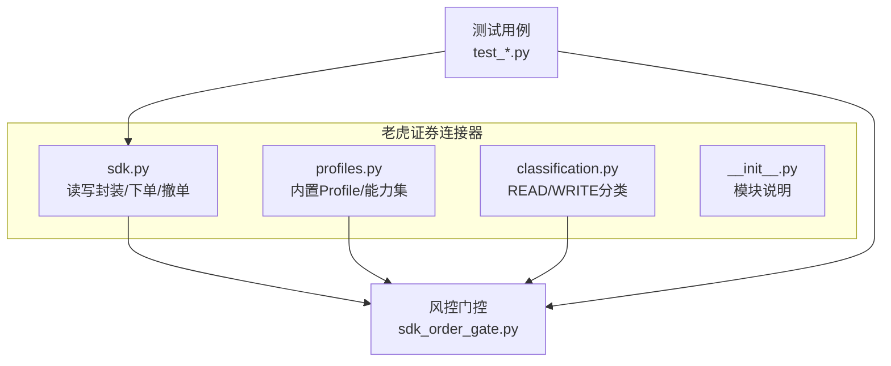
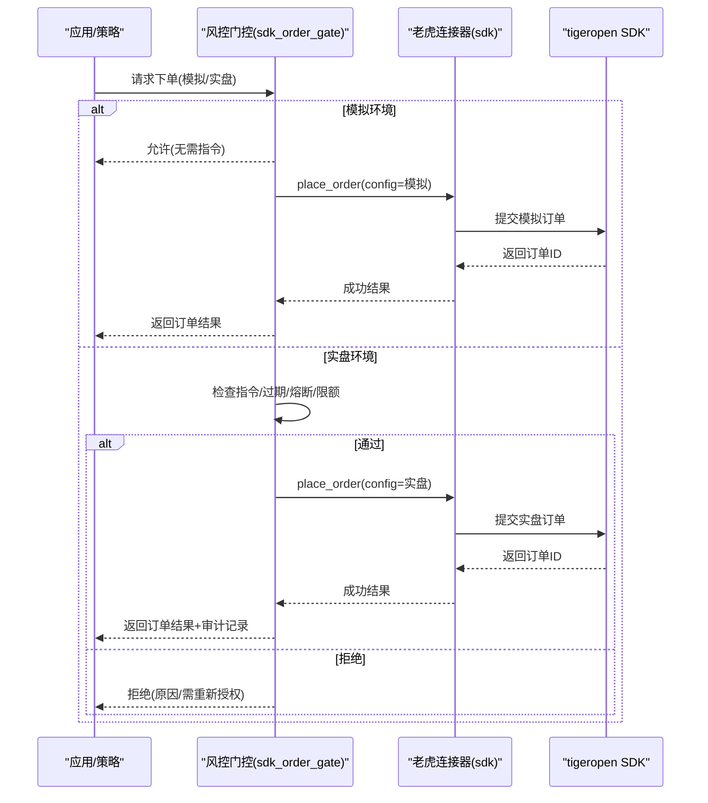
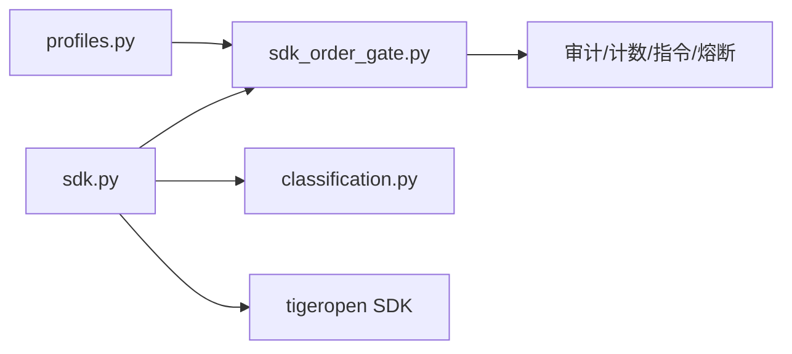

# 老虎证券连接器

<cite>
**本文引用的文件**
- [sdk.py](file://agent/src/trading/connectors/tiger/sdk.py)
- [profiles.py](file://agent/src/trading/connectors/tiger/profiles.py)
- [classification.py](file://agent/src/trading/connectors/tiger/classification.py)
- [__init__.py](file://agent/src/trading/connectors/tiger/__init__.py)
- [sdk_order_gate.py](file://agent/src/live/sdk_order_gate.py)
- [test_tiger_period_hour_case.py](file://agent/tests/test_tiger_period_hour_case.py)
- [test_sdk_connectors.py](file://agent/tests/test_sdk_connectors.py)
</cite>

## 目录
1. [简介](#简介)
2. [项目结构](#项目结构)
3. [核心组件](#核心组件)
4. [架构总览](#架构总览)
5. [详细组件分析](#详细组件分析)
6. [依赖关系分析](#依赖关系分析)
7. [性能与可靠性](#性能与可靠性)
8. [故障排查指南](#故障排查指南)
9. [结论](#结论)
10. [附录：配置与集成清单](#附录：配置与集成清单)

## 简介
本技术文档面向“老虎证券（Tiger Trading）连接器”的实现与使用，覆盖以下主题：
- 连接与配置：基于官方 tigeropen SDK 的 RSA 签名认证、配置文件路径、账户环境区分（模拟/实盘只读/实盘交易）。
- 全球市场数据与交易能力：通过统一接口暴露账户、持仓、订单、行情快照与历史K线；在风控门控后支持下单与撤单。
- 实时数据服务：行情快照与历史K线拉取；技术指标计算由上层策略层完成，连接器提供原始数据。
- 订单管理生命周期：创建、查询、撤销等完整流程，含参数校验、环境守卫与审计。
- 移动端/桌面端集成：通过本地运行时的配置与API暴露，供前端或第三方工具调用。
- 风控与合规：指令授权（mandate）、熔断（halt）、日频限额、敞口与杠杆限制、标的白名单等。
- 应用场景：量化回测与实盘自动化策略接入。

## 项目结构
老虎证券连接器位于 agent/src/trading/connectors/tiger 目录下，采用“连接器SDK + 配置 + 分类 + 内置Profile”的分层组织方式：
- sdk.py：封装 tigeropen SDK，实现账户、持仓、订单、行情、历史K线读取，以及受控的下单/撤单。
- profiles.py：声明内置的交易Profile（模拟只读、实盘只读、模拟交易、实盘交易），并绑定能力集。
- classification.py：将连接器操作标记为 READ/WRITE，供风控门控识别。
- __init__.py：模块级说明，强调该连接器为 broker_sdk 直连模式。

图表来源
- [sdk.py:1-742](file://agent/src/trading/connectors/tiger/sdk.py#L1-L742)
- [profiles.py:1-75](file://agent/src/trading/connectors/tiger/profiles.py#L1-L75)
- [classification.py:1-32](file://agent/src/trading/connectors/tiger/classification.py#L1-L32)
- [sdk_order_gate.py:1-727](file://agent/src/live/sdk_order_gate.py#L1-L727)
- [test_tiger_period_hour_case.py:1-37](file://agent/tests/test_tiger_period_hour_case.py#L1-L37)
- [test_sdk_connectors.py:143-176](file://agent/tests/test_sdk_connectors.py#L143-L176)

章节来源
- [sdk.py:1-742](file://agent/src/trading/connectors/tiger/sdk.py#L1-L742)
- [profiles.py:1-75](file://agent/src/trading/connectors/tiger/profiles.py#L1-L75)
- [classification.py:1-32](file://agent/src/trading/connectors/tiger/classification.py#L1-L32)
- [__init__.py:1-8](file://agent/src/trading/connectors/tiger/__init__.py#L1-L8)

## 核心组件
- 配置模型与解析
  - TigerConfig：包含 tiger_id、私钥路径、账户号、profile、超时、是否只读等字段；支持从映射构建、合并覆盖、持久化到用户运行时目录。
  - 配置文件路径：~/.vibe-trading/tiger.json；加载失败会抛出配置错误。
- 账户与环境守卫
  - is_paper_account：识别17位数字的模拟账户。
  - _assert_profile：确保 profile 与账户类型一致，防止误用模拟/实盘环境。
- 数据读取
  - get_account_snapshot/get_positions/get_open_orders：账户资产、持仓、未成交订单。
  - get_quote/get_historical_bars：行情快照与历史K线；周期映射处理大小写敏感（如 1H/4H 映射为小时级别）。
- 订单执行（受控）
  - place_order/cancel_order：参数校验、环境守卫、构造订单、提交、拒单检测；返回标准化结果包。
- 分类与注册
  - TIGER_TOOL_CLASS：明确哪些操作是 READ，哪些是 WRITE（下单/撤单/改单）。
  - TIGER_PROFILES：内置四个 Profile，分别对应模拟只读、实盘只读、模拟交易、实盘交易（后者需指令授权）。

章节来源
- [sdk.py:61-174](file://agent/src/trading/connectors/tiger/sdk.py#L61-L174)
- [sdk.py:186-319](file://agent/src/trading/connectors/tiger/sdk.py#L186-L319)
- [sdk.py:333-541](file://agent/src/trading/connectors/tiger/sdk.py#L333-L541)
- [classification.py:17-31](file://agent/src/trading/connectors/tiger/classification.py#L17-L31)
- [profiles.py:14-74](file://agent/src/trading/connectors/tiger/profiles.py#L14-L74)

## 架构总览
老虎证券连接器以“broker_sdk”直连模式工作，不经过MCP远程工具，直接调用 tigeropen SDK。上层通过统一的交易层暴露读/写能力，并在实盘下单时强制经过风控门控（mandate gate）。

图表来源
- [sdk_order_gate.py:59-157](file://agent/src/live/sdk_order_gate.py#L59-L157)
- [sdk.py:333-489](file://agent/src/trading/connectors/tiger/sdk.py#L333-L489)

章节来源
- [sdk_order_gate.py:1-727](file://agent/src/live/sdk_order_gate.py#L1-L727)
- [sdk.py:1-742](file://agent/src/trading/connectors/tiger/sdk.py#L1-L742)

## 详细组件分析

### 配置与认证
- 认证方式：RSA静态密钥（tiger_id + 本地PKCS#1私钥 + 账户号），无OAuth，无令牌刷新；私钥仅保存在本地路径，不离开本机。
- 配置文件：~/.vibe-trading/tiger.json，保存 tiger_id、private_key_path、account、profile、timeout、readonly。
- 构建与覆盖：build_config 支持从文件加载、叠加Profile默认值、再叠加CLI/工具覆盖；覆盖键限定为已知安全字段。
- 安全存储：save_config 写入后尝试设置仅所有者可读写权限。

章节来源
- [sdk.py:8-17](file://agent/src/trading/connectors/tiger/sdk.py#L8-L17)
- [sdk.py:61-174](file://agent/src/trading/connectors/tiger/sdk.py#L61-L174)

### 账户与持仓读取
- 账户快照：get_account_snapshot 返回资产列表（币种、现金、净值、购买力、权益、未实现盈亏等）。
- 持仓：get_positions 返回当前持仓（代码、币种、数量、均价、市值、未实现盈亏等）。
- 开放订单：get_open_orders 支持可选包含已成交订单。

章节来源
- [sdk.py:233-274](file://agent/src/trading/connectors/tiger/sdk.py#L233-L274)

### 行情与历史数据
- 行情快照：get_quote 获取股票最新报价（买一/卖一/最新价/开盘/高/低/昨收/成交量/时间）。
- 历史K线：get_historical_bars 支持分钟/小时/日/周/月等多周期；周期映射对大小写敏感（1m vs 1M），且 1H/4H 映射为小时级别。
- 周期映射：_PERIOD_MAP 将项目风格周期转换为 tigeropen 的 period 字符串。

章节来源
- [sdk.py:277-319](file://agent/src/trading/connectors/tiger/sdk.py#L277-L319)
- [test_tiger_period_hour_case.py:17-36](file://agent/tests/test_tiger_period_hour_case.py#L17-L36)

### 订单生命周期管理
- 下单：place_order
  - 输入校验：side/order_type/time_in_force/quantity/notional/limit_price/symbol 严格校验。
  - 环境守卫：_assert_profile 确保 profile 与账户匹配；模拟账户不支持GTC，自动降级为DAY。
  - 订单构造：根据 order_type 构造限价或市价单；提交后检查拒单状态。
  - 返回：标准化结果包，包含订单ID、符号、侧向、环境、类型、数量、限价、TIF等。
- 撤单：cancel_order 按订单ID取消，兼容不同SDK版本参数名。
- 分类：TIGER_TOOL_CLASS 将 place_order/cancel_order/modify_order 标记为 WRITE，确保风控门控生效。

章节来源
- [sdk.py:326-541](file://agent/src/trading/connectors/tiger/sdk.py#L326-L541)
- [classification.py:17-31](file://agent/src/trading/connectors/tiger/classification.py#L17-L31)

### 风控与合规（指令授权与限额）
- 指令授权（Mandate）：execute_live_order 在下单前加载指令，校验版本与有效期；过期则拒绝并要求重新授权。
- 熔断（Halt）：若熔断标志置位，直接拒绝所有下单。
- 价格归一化：将 quantity 换算为 USD 名义金额（优先使用连接器报价或数据源报价），用于限额判断。
- 限额检查：包括排除标的、允许标的、资产类别、单笔名义上限、总敞口上限、杠杆上限、每日交易次数上限、账户资金下限、宇宙地板等。
- 审计与计数：每次决策写入审计事件；成功下单才消耗当日计数；并发下单共享锁避免重复计数。

章节来源
- [sdk_order_gate.py:59-157](file://agent/src/live/sdk_order_gate.py#L59-L157)
- [sdk_order_gate.py:317-438](file://agent/src/live/sdk_order_gate.py#L317-L438)
- [sdk_order_gate.py:525-631](file://agent/src/live/sdk_order_gate.py#L525-L631)

### 内置Profile与能力集
- tiger-paper-sdk：模拟账户只读，禁止下单。
- tiger-live-sdk-readonly：实盘账户只读，禁止下单。
- tiger-paper-trade：模拟账户可下单（沙箱），仍受参数与环境守卫约束。
- tiger-live-trade：实盘账户可下单，必须通过指令授权与风控门控。

章节来源
- [profiles.py:14-74](file://agent/src/trading/connectors/tiger/profiles.py#L14-L74)

### 测试与行为验证
- 周期映射：验证 1H/4H 映射为小时级别，不会坍缩到日线。
- 账户类型校验：模拟账户与 profile 必须匹配，否则抛出配置不匹配错误。
- 配置合并：build_config 正确合并 profile 默认与覆盖项。

章节来源
- [test_tiger_period_hour_case.py:17-36](file://agent/tests/test_tiger_period_hour_case.py#L17-L36)
- [test_sdk_connectors.py:143-176](file://agent/tests/test_sdk_connectors.py#L143-L176)

## 依赖关系分析
- 外部依赖：tigeropen Python SDK（可选依赖，缺失时健康检查报告错误）。
- 内部依赖：
  - 风控门控：sdk_order_gate 负责指令、熔断、限额、审计与计数。
  - 配置路径：get_runtime_root 定位用户运行时目录。
  - 分类与注册：classification 与 registry 将操作归类为 READ/WRITE，驱动风控策略。

图表来源
- [sdk.py:1-742](file://agent/src/trading/connectors/tiger/sdk.py#L1-L742)
- [sdk_order_gate.py:1-727](file://agent/src/live/sdk_order_gate.py#L1-L727)
- [classification.py:1-32](file://agent/src/trading/connectors/tiger/classification.py#L1-L32)
- [profiles.py:1-75](file://agent/src/trading/connectors/tiger/profiles.py#L1-L75)

章节来源
- [sdk.py:177-184](file://agent/src/trading/connectors/tiger/sdk.py#L177-L184)
- [sdk_order_gate.py:1-727](file://agent/src/live/sdk_order_gate.py#L1-L727)

## 性能与可靠性
- 健壮性：所有对外函数均返回标准化结果包，异常被捕获并转化为错误信息，避免向上抛出。
- 兼容性：_safe_call 对 tigeropen SDK 方法签名差异进行降级调用，提升跨版本兼容性。
- 并发控制：下单计数使用全局锁，避免并发下重复计数。
- 网络超时：配置中支持 timeout，降低长尾请求风险。
- 数据一致性：历史K线与行情读取使用统一映射与清洗逻辑，保证周期与字段一致性。

章节来源
- [sdk.py:724-742](file://agent/src/trading/connectors/tiger/sdk.py#L724-L742)
- [sdk_order_gate.py:120-157](file://agent/src/live/sdk_order_gate.py#L120-L157)

## 故障排查指南
- 依赖缺失：提示安装 tigeropen；健康检查会报告依赖状态。
- 配置不完整：缺少 tiger_id/private_key_path/account 会报告缺失字段。
- 环境不匹配：profile 与账户类型不一致会抛出配置不匹配错误。
- 订单失败：下单返回 error 时检查 side/order_type/limit_price/time_in_force/quantity 等参数；注意模拟账户不支持GTC。
- 行情/历史为空：确认 symbol 大小写与周期映射是否正确（如 1H/4H 为小时级别）。
- 风控拒绝：查看拒绝原因（指令过期、熔断、限额超限、标的不在白名单等），必要时调整指令或头寸。

章节来源
- [sdk.py:186-230](file://agent/src/trading/connectors/tiger/sdk.py#L186-L230)
- [sdk.py:333-489](file://agent/src/trading/connectors/tiger/sdk.py#L333-L489)
- [sdk_order_gate.py:59-157](file://agent/src/live/sdk_order_gate.py#L59-L157)

## 结论
老虎证券连接器通过官方 tigeropen SDK 实现了稳健的账户、持仓、订单、行情与历史数据访问，并以“broker_sdk”直连模式融入系统。其关键优势在于：
- 强化的环境与身份守卫，防止模拟/实盘误用。
- 完善的风控门控，确保实盘交易在指令授权、熔断、限额与审计框架内运行。
- 良好的兼容性与健壮性设计，适配不同SDK版本与异常场景。
- 清晰的配置与Profile体系，便于多环境管理与能力隔离。

## 附录：配置与集成清单

### 配置要点
- 配置文件位置：~/.vibe-trading/tiger.json
- 必填字段：tiger_id、private_key_path、account
- 可选字段：profile（paper/live-readonly/live）、timeout、readonly
- 安全建议：私钥文件仅本地可读；定期轮换密钥；使用最小权限账户。

章节来源
- [sdk.py:61-174](file://agent/src/trading/connectors/tiger/sdk.py#L61-L174)

### 全球市场交易功能
- 美股：通过 tigeropen 的股票合约与订单接口支持；周期映射与行情读取适用于美股。
- 港股/A股通：连接器提供通用读接口；具体标的与合约细节由 tigeropen SDK 决定。
- 外汇：连接器主要聚焦股票；外汇相关可通过其他连接器或数据源组合实现。

章节来源
- [sdk.py:277-319](file://agent/src/trading/connectors/tiger/sdk.py#L277-L319)
- [profiles.py:14-74](file://agent/src/trading/connectors/tiger/profiles.py#L14-L74)

### 实时数据服务
- 行情推送：连接器提供快照式行情（get_quote）；持续推送可由上层轮询或结合其他数据通道。
- 历史数据下载：get_historical_bars 支持多周期；周期映射确保正确解析。
- 技术指标计算：由上层策略层基于历史K线计算；连接器专注数据供给。

章节来源
- [sdk.py:277-319](file://agent/src/trading/connectors/tiger/sdk.py#L277-L319)

### 订单管理系统
- 创建：place_order 支持市价/限价单；参数严格校验；模拟账户GTC自动降级。
- 修改：modify_order 标记为 WRITE，受风控门控保护。
- 撤销：cancel_order 按订单ID撤销；兼容不同SDK版本。
- 查询：get_open_orders 支持包含已成交订单；get_positions/get_account_snapshot 提供持仓与资产。

章节来源
- [sdk.py:333-541](file://agent/src/trading/connectors/tiger/sdk.py#L333-L541)
- [classification.py:17-31](file://agent/src/trading/connectors/tiger/classification.py#L17-L31)

### 移动端与桌面端集成
- 本地运行时：配置存储在用户目录；前端/桌面端通过本地API或进程间通信调用连接器。
- 第三方工具：通过标准结果包与错误包对接；无需感知底层SDK差异。
- 安全边界：私钥不出本机；配置与密钥由本地管理。

章节来源
- [sdk.py:149-174](file://agent/src/trading/connectors/tiger/sdk.py#L149-L174)
- [profiles.py:14-74](file://agent/src/trading/connectors/tiger/profiles.py#L14-L74)

### 风控与合规
- 仓位限制：总敞口上限、单笔名义上限、账户资金下限。
- 交易频率控制：每日交易次数上限，并发下单共享锁。
- 合规检查：标的白名单/黑名单、资产类别限制、杠杆上限。
- 审计与追踪：每笔决策写入审计事件，包含意图、限额检查结果与结果。

章节来源
- [sdk_order_gate.py:59-157](file://agent/src/live/sdk_order_gate.py#L59-L157)
- [sdk_order_gate.py:317-438](file://agent/src/live/sdk_order_gate.py#L317-L438)

### 实际应用场景
- 量化交易：利用历史K线与行情快照进行信号生成；通过风控门控执行下单。
- 自动化策略：定时任务触发策略，经指令授权与限额检查后下单；失败重试与审计记录保障可追溯性。
- 多市场组合：结合其他连接器（如外汇/期货）形成跨市场策略；老虎连接器专注股票与合约细节。

章节来源
- [sdk_order_gate.py:59-157](file://agent/src/live/sdk_order_gate.py#L59-L157)
- [profiles.py:14-74](file://agent/src/trading/connectors/tiger/profiles.py#L14-L74)