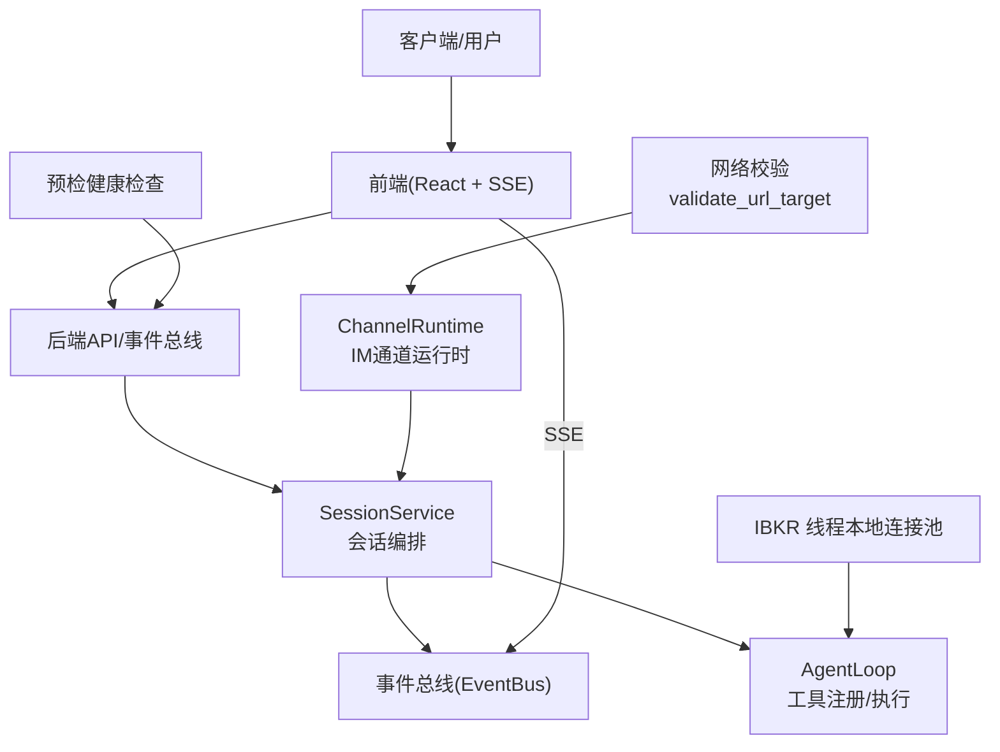
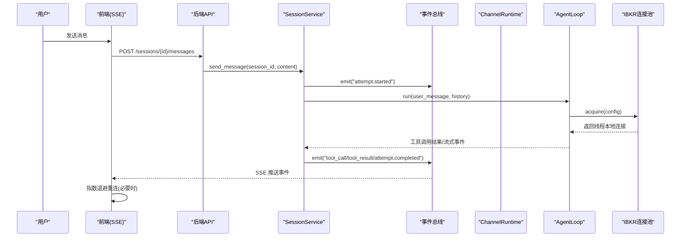
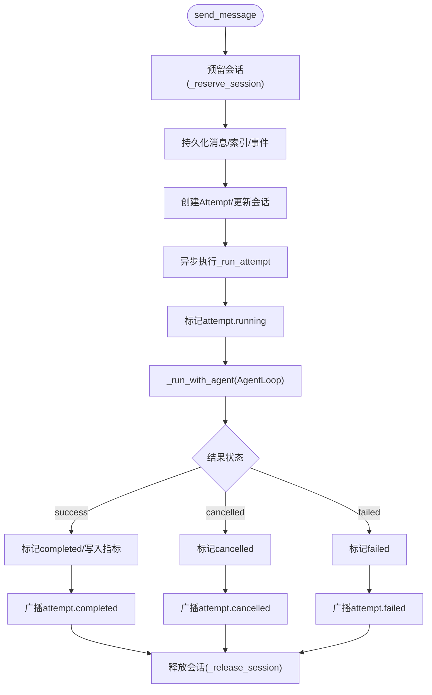
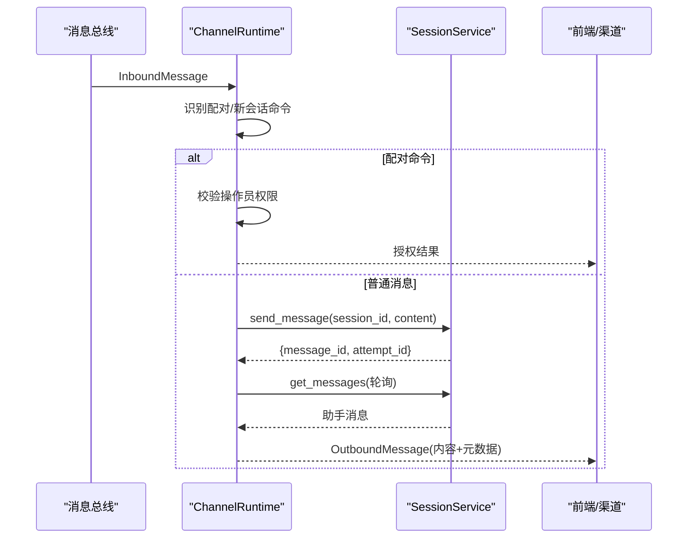
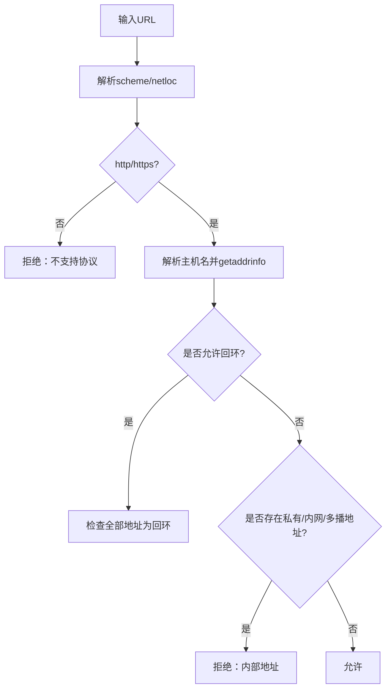
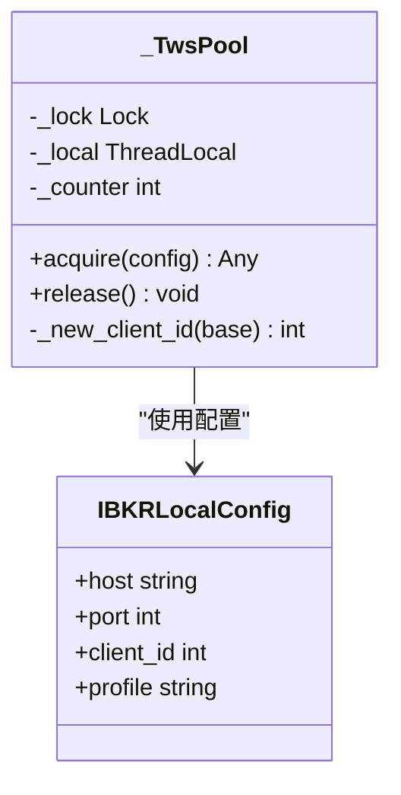
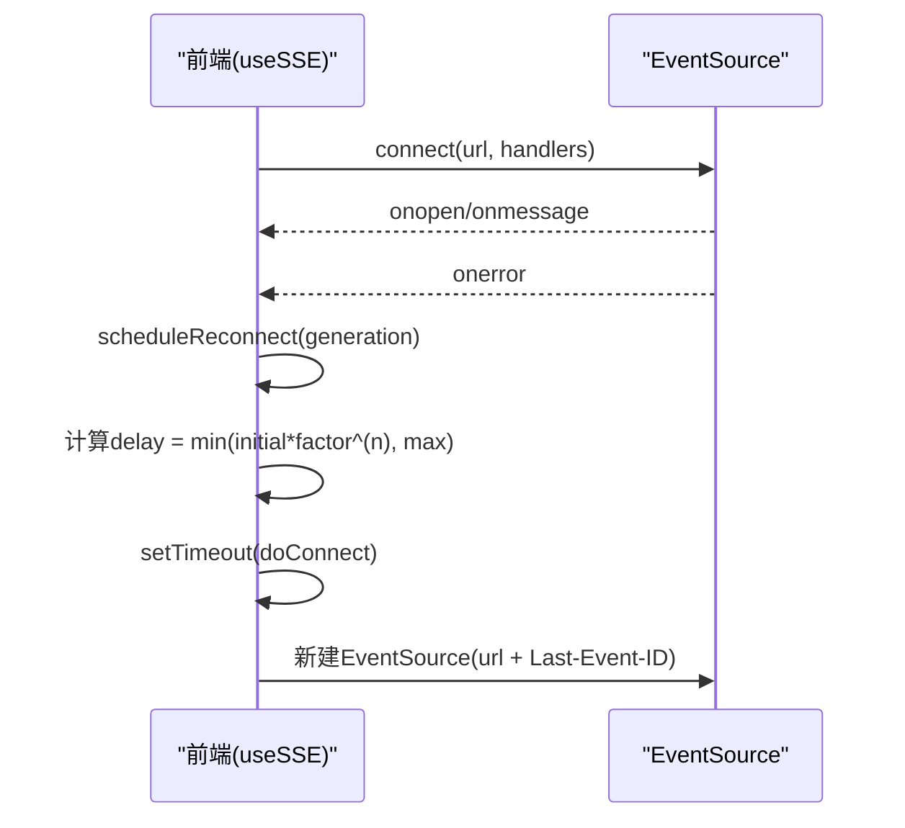
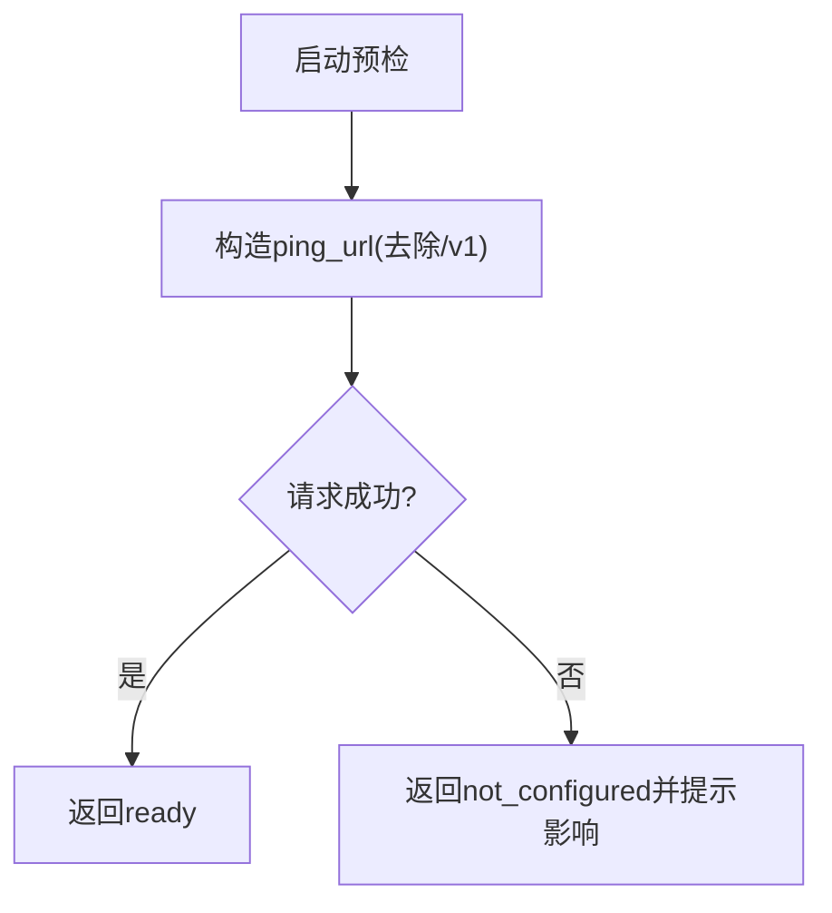
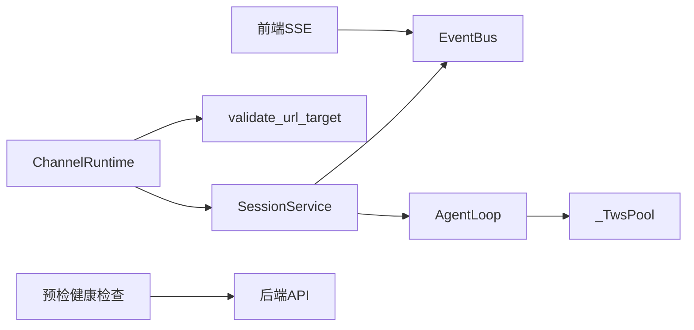

# 连接管理

<cite>
**本文引用的文件**
- [agent/src/session/service.py](file://agent/src/session/service.py)
- [agent/src/channels/runtime.py](file://agent/src/channels/runtime.py)
- [agent/src/channels/utils.py](file://agent/src/channels/utils.py)
- [agent/src/security/network.py](file://agent/src/security/network.py)
- [agent/src/trading/connectors/ibkr/local.py](file://agent/src/trading/connectors/ibkr/local.py)
- [agent/tests/test_ibkr_local.py](file://agent/tests/test_ibkr_local.py)
- [agent/src/preflight.py](file://agent/src/preflight.py)
- [frontend/src/hooks/useSSE.ts](file://frontend/src/hooks/useSSE.ts)
- [frontend/src/components/layout/ConnectionBanner.tsx](file://frontend/src/components/layout/ConnectionBanner.tsx)
- [frontend/src/lib/__tests__/api.test.ts](file://frontend/src/lib/__tests__/api.test.ts)
- [agent/tests/test_longbridge_runtime.py](file://agent/tests/test_longbridge_runtime.py)
</cite>

## 目录
1. [简介](#简介)
2. [项目结构](#项目结构)
3. [核心组件](#核心组件)
4. [架构总览](#架构总览)
5. [详细组件分析](#详细组件分析)
6. [依赖关系分析](#依赖关系分析)
7. [性能考量](#性能考量)
8. [故障排查指南](#故障排查指南)
9. [结论](#结论)
10. [附录](#附录)

## 简介
本技术文档聚焦于“连接管理”主题，围绕连接池与复用、会话维护、心跳与健康检查、自动重连、监控诊断与安全机制展开。代码库中并未实现传统意义上的“TCP连接池”，而是通过线程本地连接池（如 IBKR 的 TWS 连接）、消息通道运行时（IM 到会话路由）、SSE 前端重连与恢复、以及预检健康检查等机制，共同构成高可用的连接与会话管理体系。

## 项目结构
连接相关能力分布在以下模块：
- 会话与服务编排：SessionService 负责会话生命周期、并发控制、事件总线广播。
- IM 通道运行时：ChannelRuntime 将外部渠道消息路由到会话服务，并处理配对、会话映射与超时等待。
- 安全与网络校验：URL 目标合法性校验、内网/私有地址拦截、SSRF 防护。
- 交易连接器连接池：IBKR 使用线程本地连接池，按线程复用 socket，避免冲突。
- 前端 SSE 重连：指数退避、Last-Event-ID 续传、连接状态横幅。
- 预检与健康检查：启动时对 LLM 等外部端点进行连通性探测。

**图示来源**
- [agent/src/session/service.py:158-246](file://agent/src/session/service.py#L158-L246)
- [agent/src/channels/runtime.py:114-245](file://agent/src/channels/runtime.py#L114-L245)
- [agent/src/channels/utils.py:146-190](file://agent/src/channels/utils.py#L146-L190)
- [agent/src/trading/connectors/ibkr/local.py:525-556](file://agent/src/trading/connectors/ibkr/local.py#L525-L556)
- [agent/src/preflight.py:122-147](file://agent/src/preflight.py#L122-L147)
- [frontend/src/hooks/useSSE.ts:158-194](file://frontend/src/hooks/useSSE.ts#L158-L194)

**章节来源**
- [agent/src/session/service.py:158-246](file://agent/src/session/service.py#L158-L246)
- [agent/src/channels/runtime.py:114-245](file://agent/src/channels/runtime.py#L114-L245)
- [agent/src/channels/utils.py:146-190](file://agent/src/channels/utils.py#L146-L190)
- [agent/src/trading/connectors/ibkr/local.py:525-556](file://agent/src/trading/connectors/ibkr/local.py#L525-L556)
- [agent/src/preflight.py:122-147](file://agent/src/preflight.py#L122-L147)
- [frontend/src/hooks/useSSE.ts:158-194](file://frontend/src/hooks/useSSE.ts#L158-L194)

## 核心组件
- 会话服务（SessionService）
  - 职责：创建/删除会话、消息入队、尝试（Attempt）生命周期、并发限制、事件广播、指标加载。
  - 并发控制：通过 _inflight 集合与锁保证同一会话同时只有一个运行中的任务；失败或取消时释放。
  - 事件总线：向订阅者（如前端 SSE）推送 attempt 开始/完成/失败等事件。
- IM 通道运行时（ChannelRuntime）
  - 职责：消费消息总线入站消息，识别配对命令与新会话命令，路由到 SessionService，等待助手回复并回发。
  - 会话映射：持久化 channel:chat_id 到 session_id 的映射，支持重置会话。
  - 超时与错误：对助手回复设置超时；捕获异常并返回友好提示。
- 安全与网络校验
  - URL 目标校验：仅允许 http/https，解析域名并检查 IP，阻止私有/内网/多播地址，严格限制回环地址。
  - 安全代理：security.network 重新导出校验函数供通道适配器使用。
- 交易连接器连接池（IBKR）
  - 线程本地连接池：每个工作线程拥有独立 ib_async.IB 实例，按引用计数复用，在最后一次 release 时断开。
  - 端口探测：获取报价前探测 TWS/IB Gateway 端口是否开放。
- 前端 SSE 重连
  - 指数退避：基于 initialRetryMs 与 backoffFactor 计算延迟，上限为 maxRetryMs。
  - Last-Event-ID：重连时将上次事件ID附加到URL，实现断点续传。
  - 连接状态横幅：显示重连次数与最终断开提示，提供刷新按钮。
- 预检与健康检查
  - 启动时 ping LLM base URL（去除 /v1），判断连通性与配置完整性。

**章节来源**
- [agent/src/session/service.py:53-246](file://agent/src/session/service.py#L53-L246)
- [agent/src/channels/runtime.py:34-245](file://agent/src/channels/runtime.py#L34-L245)
- [agent/src/channels/utils.py:146-190](file://agent/src/channels/utils.py#L146-L190)
- [agent/src/security/network.py:1-11](file://agent/src/security/network.py#L1-L11)
- [agent/src/trading/connectors/ibkr/local.py:525-556](file://agent/src/trading/connectors/ibkr/local.py#L525-L556)
- [frontend/src/hooks/useSSE.ts:158-194](file://frontend/src/hooks/useSSE.ts#L158-L194)
- [frontend/src/components/layout/ConnectionBanner.tsx:1-43](file://frontend/src/components/layout/ConnectionBanner.tsx#L1-L43)
- [agent/src/preflight.py:122-147](file://agent/src/preflight.py#L122-L147)

## 架构总览
连接管理由“后端会话编排 + IM 通道路由 + 安全校验 + 连接器连接池 + 前端 SSE 重连 + 预检健康检查”组成。整体流程如下：

**图示来源**
- [agent/src/session/service.py:158-246](file://agent/src/session/service.py#L158-L246)
- [agent/src/channels/runtime.py:114-245](file://agent/src/channels/runtime.py#L114-L245)
- [agent/src/trading/connectors/ibkr/local.py:525-556](file://agent/src/trading/connectors/ibkr/local.py#L525-L556)
- [frontend/src/hooks/useSSE.ts:158-194](file://frontend/src/hooks/useSSE.ts#L158-L194)

## 详细组件分析

### 会话服务（SessionService）
- 并发与资源管理
  - 使用线程池限制并发 Agent 数量，避免耗尽默认执行器。
  - 通过 _inflight 集合与锁确保同一会话仅一个运行任务；失败/取消路径均释放。
- 会话状态与上下文保持
  - 创建/更新会话，记录 last_attempt_id、updated_at。
  - 构建历史上下文（OpenAI 格式），按字符预算裁剪，保留关键标记（如 prev_run）。
- 事务处理
  - Attempt 状态机：running → completed/cancelled/failed；事件总线统一广播终端事件。
  - 指标加载：从 run_dir/artifacts/metrics.csv 读取指标并注入回复元数据。
- 错误处理
  - 捕获 CancelledError 与通用异常，分别标记 cancelled/failed 并广播。

**图示来源**
- [agent/src/session/service.py:158-246](file://agent/src/session/service.py#L158-L246)
- [agent/src/session/service.py:248-345](file://agent/src/session/service.py#L248-L345)
- [agent/src/session/service.py:346-440](file://agent/src/session/service.py#L346-L440)

**章节来源**
- [agent/src/session/service.py:30-91](file://agent/src/session/service.py#L30-L91)
- [agent/src/session/service.py:158-246](file://agent/src/session/service.py#L158-L246)
- [agent/src/session/service.py:248-345](file://agent/src/session/service.py#L248-L345)
- [agent/src/session/service.py:346-440](file://agent/src/session/service.py#L346-L440)
- [agent/src/session/service.py:515-581](file://agent/src/session/service.py#L515-L581)

### IM 通道运行时（ChannelRuntime）
- 消息路由与会话映射
  - 消费入站消息，识别配对命令与重置会话命令。
  - 根据 channel:chat_id 查找或创建会话，持久化映射。
- 超时与重试
  - 等待助手回复设置超时；若超时则返回最后一条助手消息或抛出超时错误。
- 错误与权限
  - 非操作员尝试 /pairing 被拒绝并返回明确提示。
  - 捕获异常并返回友好错误信息。

**图示来源**
- [agent/src/channels/runtime.py:114-245](file://agent/src/channels/runtime.py#L114-L245)
- [agent/src/channels/runtime.py:322-352](file://agent/src/channels/runtime.py#L322-L352)

**章节来源**
- [agent/src/channels/runtime.py:34-245](file://agent/src/channels/runtime.py#L34-L245)
- [agent/src/channels/runtime.py:322-352](file://agent/src/channels/runtime.py#L322-L352)
- [agent/src/channels/runtime.py:354-384](file://agent/src/channels/runtime.py#L354-L384)

### 安全与网络校验
- URL 目标校验
  - 仅允许 http/https；解析域名并检查所有解析地址，阻止私有/内网/多播地址。
  - 回环地址仅在显式 allow_loopback=True 且全部解析为回环时允许。
- 安全代理
  - security.network 重新导出校验函数，供通道适配器统一使用。

**图示来源**
- [agent/src/channels/utils.py:146-190](file://agent/src/channels/utils.py#L146-L190)
- [agent/src/security/network.py:1-11](file://agent/src/security/network.py#L1-L11)

**章节来源**
- [agent/src/channels/utils.py:146-190](file://agent/src/channels/utils.py#L146-L190)
- [agent/src/security/network.py:1-11](file://agent/src/security/network.py#L1-L11)

### 交易连接器连接池（IBKR）
- 线程本地连接池
  - 每个工作线程持有独立的 ib_async.IB 实例，按引用计数复用。
  - 最后一次 release 时断开连接，避免资源泄漏。
- 端口探测
  - 获取报价前探测 TWS/IB Gateway 端口是否开放，未开放则报错。

**图示来源**
- [agent/src/trading/connectors/ibkr/local.py:525-556](file://agent/src/trading/connectors/ibkr/local.py#L525-L556)

**章节来源**
- [agent/src/trading/connectors/ibkr/local.py:525-556](file://agent/src/trading/connectors/ibkr/local.py#L525-L556)
- [agent/tests/test_ibkr_local.py:317-338](file://agent/tests/test_ibkr_local.py#L317-L338)

### 前端 SSE 重连与恢复
- 指数退避重连
  - 初始延迟 × backoffFactor^attempt，上限为 maxRetryMs。
  - 重连回调包含 attempt 与 delayMs。
- Last-Event-ID 续传
  - 重连时将上次事件ID附加到URL，服务端可据此恢复流。
- 连接状态横幅
  - 显示重连次数；达到阈值后展示断开提示并提供刷新按钮。

**图示来源**
- [frontend/src/hooks/useSSE.ts:158-194](file://frontend/src/hooks/useSSE.ts#L158-L194)
- [frontend/src/components/layout/ConnectionBanner.tsx:1-43](file://frontend/src/components/layout/ConnectionBanner.tsx#L1-L43)

**章节来源**
- [frontend/src/hooks/useSSE.ts:158-194](file://frontend/src/hooks/useSSE.ts#L158-L194)
- [frontend/src/components/layout/ConnectionBanner.tsx:1-43](file://frontend/src/components/layout/ConnectionBanner.tsx#L1-L43)

### 预检与健康检查
- 启动时探测 LLM base URL
  - 去除 /v1 后缀进行 ping，判断 TCP/SSL 连通性。
  - 未配置或不可达时返回 not_configured/ready 状态及影响说明。

**图示来源**
- [agent/src/preflight.py:122-147](file://agent/src/preflight.py#L122-L147)

**章节来源**
- [agent/src/preflight.py:122-147](file://agent/src/preflight.py#L122-L147)

## 依赖关系分析
- 会话服务依赖事件总线与存储，负责编排 AgentLoop 执行与状态流转。
- IM 通道运行时依赖消息总线与会话服务，承担渠道适配与会话映射。
- 安全校验被通道适配器与网络访问路径复用，防止 SSRF 与内网访问。
- IBKR 连接池被工具层调用，保障多线程下连接隔离与复用。
- 前端 SSE 依赖后端事件流，实现实时交互与断线恢复。

**图示来源**
- [agent/src/session/service.py:158-246](file://agent/src/session/service.py#L158-L246)
- [agent/src/channels/runtime.py:114-245](file://agent/src/channels/runtime.py#L114-L245)
- [agent/src/channels/utils.py:146-190](file://agent/src/channels/utils.py#L146-L190)
- [agent/src/trading/connectors/ibkr/local.py:525-556](file://agent/src/trading/connectors/ibkr/local.py#L525-L556)
- [agent/src/preflight.py:122-147](file://agent/src/preflight.py#L122-L147)

**章节来源**
- [agent/src/session/service.py:158-246](file://agent/src/session/service.py#L158-L246)
- [agent/src/channels/runtime.py:114-245](file://agent/src/channels/runtime.py#L114-L245)
- [agent/src/channels/utils.py:146-190](file://agent/src/channels/utils.py#L146-L190)
- [agent/src/trading/connectors/ibkr/local.py:525-556](file://agent/src/trading/connectors/ibkr/local.py#L525-L556)
- [agent/src/preflight.py:122-147](file://agent/src/preflight.py#L122-L147)

## 性能考量
- 会话并发限制：线程池限制 Agent 并发数，避免阻塞与资源耗尽。
- 历史上下文裁剪：按字符预算裁剪历史消息，减少 LLM 输入成本并保持关键上下文。
- 连接池复用：IBKR 线程本地连接池减少握手开销，提升并行工具调用效率。
- SSE 重连优化：指数退避与 Last-Event-ID 降低重连风暴与重复事件处理成本。
- 预检快速失败：启动时快速探测外部端点，尽早暴露配置问题。

[本节为通用指导，不直接分析具体文件]

## 故障排查指南
- 会话忙（409）
  - 现象：同一会话同时收到多条消息，返回“仍在处理上一条”。
  - 定位：SessionBusyError 在 ChannelRuntime 中被捕获并转为友好提示。
  - 处理：等待当前任务完成或重置会话。
- 连接器验证失败
  - 现象：前端显示“连接验证失败”，后端返回 connection_state=error 与 error_code。
  - 定位：测试用例覆盖 Longbridge 状态返回与时间戳规范化。
  - 处理：检查凭证完整性、SDK 安装、网络可达性与券商只读验证响应。
- 认证与访问控制
  - 现象：远程访问需要 API_AUTH_KEY，否则敏感接口返回 403。
  - 定位：前端测试验证携带 Authorization 头发起验证请求。
  - 处理：设置 API_AUTH_KEY 或在本地回环访问。
- 网络与安全
  - 现象：访问内网/私有地址被拒绝。
  - 定位：validate_url_target 阻止非全局可路由地址。
  - 处理：使用公网可达地址或显式允许回环场景。

**章节来源**
- [agent/src/channels/runtime.py:235-269](file://agent/src/channels/runtime.py#L235-L269)
- [agent/tests/test_longbridge_runtime.py:286-325](file://agent/tests/test_longbridge_runtime.py#L286-L325)
- [frontend/src/lib/__tests__/api.test.ts:43-83](file://frontend/src/lib/__tests__/api.test.ts#L43-L83)
- [agent/src/channels/utils.py:146-190](file://agent/src/channels/utils.py#L146-L190)

## 结论
该项目的连接管理以“会话编排 + 通道路由 + 安全校验 + 连接池复用 + SSE 重连 + 预检健康检查”为核心，形成高可用、可扩展的连接与会话体系。通过严格的并发控制、安全的网络访问、可靠的连接复用与前端重连机制，系统在复杂环境下仍能保持稳定与高效。建议在生产环境中结合监控指标与日志，持续优化超时、退避策略与连接池大小，以提升整体稳定性与用户体验。

[本节为总结，不直接分析具体文件]

## 附录
- 最佳实践
  - 性能优化：合理设置会话历史裁剪长度、调整 SSE 重退避参数、评估连接池大小与线程数。
  - 故障预防：启用预检健康检查、配置合理的超时与重试策略、限制非全局可路由地址访问。
  - 运维监控：关注事件总线负载、会话并发、连接器连接状态与前端重连频率。
- 参考实现路径
  - 会话服务：[agent/src/session/service.py](file://agent/src/session/service.py)
  - 通道运行时：[agent/src/channels/runtime.py](file://agent/src/channels/runtime.py)
  - 安全校验：[agent/src/channels/utils.py](file://agent/src/channels/utils.py)、[agent/src/security/network.py](file://agent/src/security/network.py)
  - 连接池：[agent/src/trading/connectors/ibkr/local.py](file://agent/src/trading/connectors/ibkr/local.py)
  - 前端重连：[frontend/src/hooks/useSSE.ts](file://frontend/src/hooks/useSSE.ts)、[frontend/src/components/layout/ConnectionBanner.tsx](file://frontend/src/components/layout/ConnectionBanner.tsx)
  - 预检健康检查：[agent/src/preflight.py](file://agent/src/preflight.py)

[本节为参考指引，不直接分析具体文件]