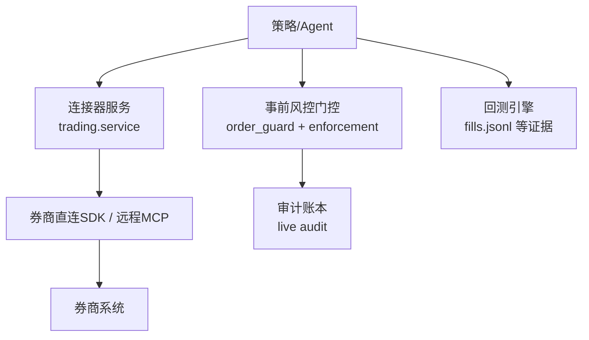
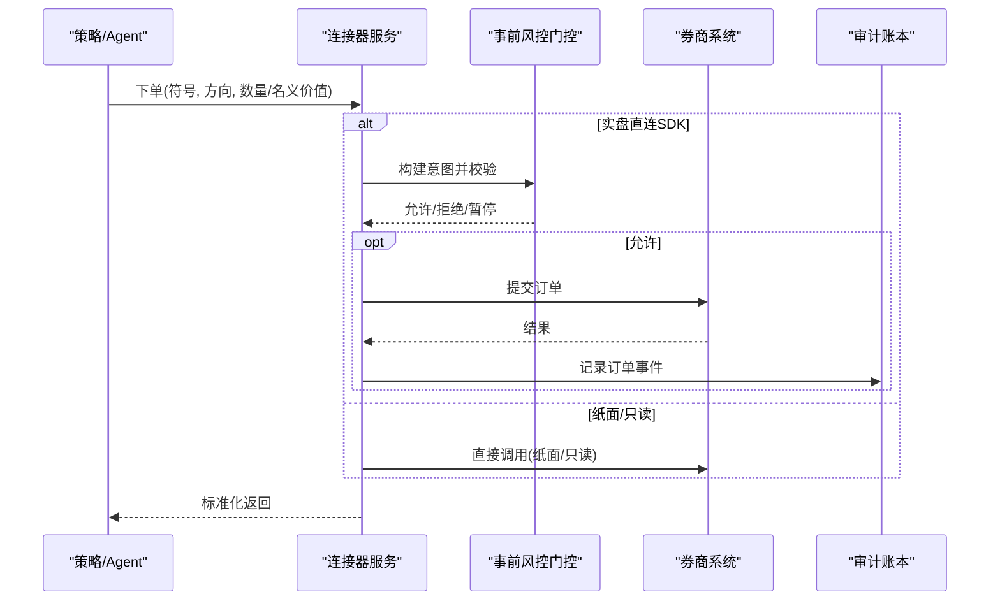
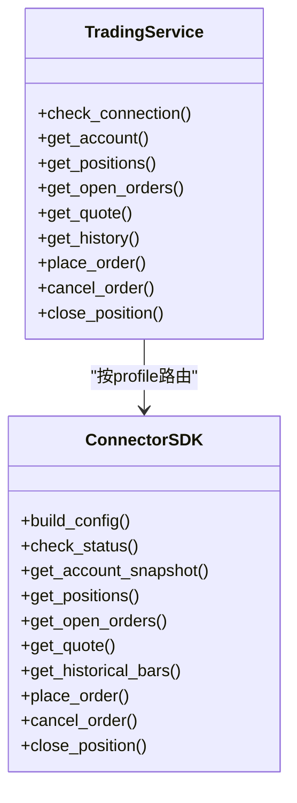
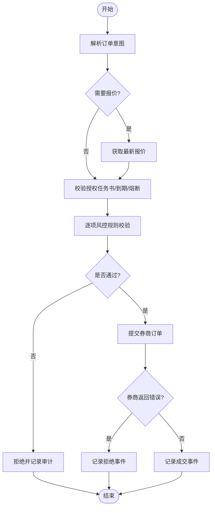
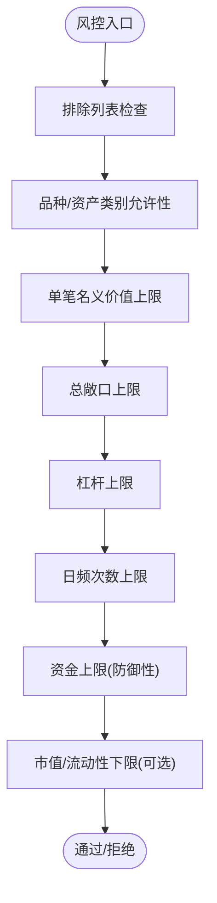
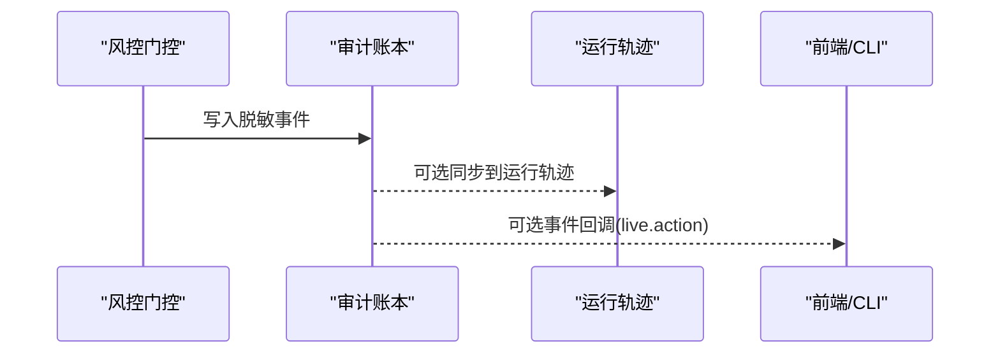
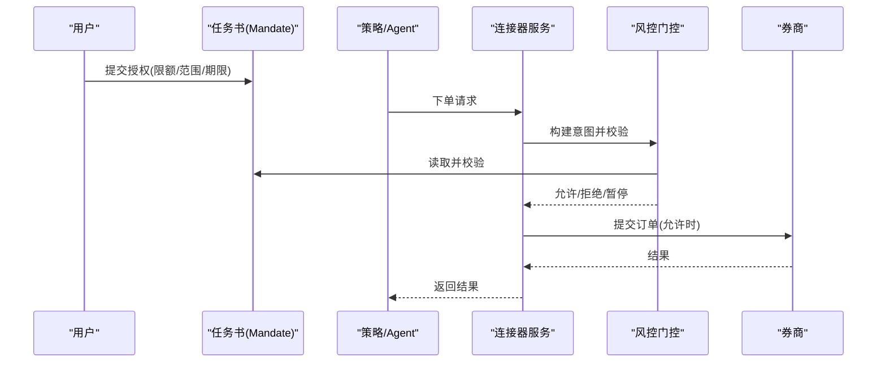
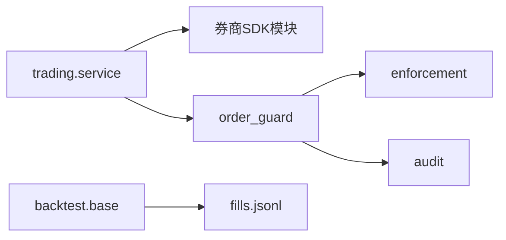
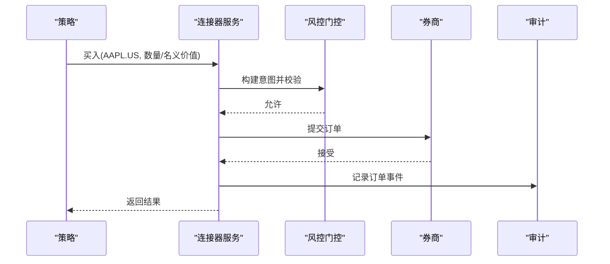

# 实时交易

<cite>
**本文引用的文件**
- [README.md](file://README.md)
- [__init__.py（live）](file://agent/src/live/__init__.py)
- [order_guard.py](file://agent/src/live/order_guard.py)
- [enforcement.py](file://agent/src/live/enforcement.py)
- [audit.py](file://agent/src/live/audit.py)
- [service.py](file://agent\src\trading\service.py)
- [__init__.py（trading）](file://agent/src/trading/__init__.py)
- [base.py（回测引擎）](file://agent/backtest/engines/base.py)
- [models.py（目标与证据）](file://agent/src/goal/models.py)
</cite>

## 目录
1. [简介](#简介)
2. [项目结构](#项目结构)
3. [核心组件](#核心组件)
4. [架构总览](#架构总览)
5. [详细组件分析](#详细组件分析)
6. [依赖关系分析](#依赖关系分析)
7. [性能考虑](#性能考虑)
8. [故障排查指南](#故障排查指南)
9. [结论](#结论)
10. [附录：券商接入与实战流程](#附录：券商接入与实战流程)

## 简介
本技术文档面向实盘交易者与技术开发者，系统化说明该实时交易系统的券商接口集成、订单管理、风险控制、审计追踪、指令委托以及故障恢复等关键能力。系统采用“连接器优先”的券商抽象层，统一暴露账户、持仓、行情、历史数据与下单/撤单等操作；在真实资金路径上通过强制性的事前风控门控、可撤销的熔断开关与不可篡改的审计账本，确保策略执行在授权范围内安全落地。

## 项目结构
- 实时交易通道与风控：位于 agent/src/live，包含事前风控门控、授权任务书（Mandate）、审计记录、熔断与日常计数等。
- 券商连接器与服务：位于 agent/src/trading，提供多券商的统一读写接口与直连SDK路由。
- 回测与证据：backtest/engines 提供回测执行与成交证据输出；goal 模块维护目标、证据与审计行。
- API与CLI：通过 FastAPI 与 CLI 暴露运行状态、通道、设置、会话等能力，支撑前端与自动化。

**图表来源**
- [service.py:283-346](file://agent/src/trading/service.py#L283-L346)
- [order_guard.py:97-214](file://agent/src/live/order_guard.py#L97-L214)
- [enforcement.py:458-620](file://agent/src/live/enforcement.py#L458-L620)
- [audit.py:1-23](file://agent/src/live/audit.py#L1-L23)
- [base.py:2303-2332](file://agent/backtest/engines/base.py#L2303-L2332)

**章节来源**
- [README.md:1-166](file://README.md#L1-L166)
- [__init__.py（live）:1-11](file://agent/src/live/__init__.py#L1-L11)
- [__init__.py（trading）:1-32](file://agent/src/trading/__init__.py#L1-L32)

## 核心组件
- 连接器服务（trading.service）
  - 统一封装账户、持仓、订单、行情、历史数据读取与下单/撤单操作。
  - 支持本地TWS、直连SDK与远程MCP三种传输方式，按profile选择具体实现。
  - 对直连SDK的写操作，在实盘环境自动进入事前风控门控与审计。
- 事前风控门控（order_guard + enforcement）
  - 解析订单意图、获取报价与持仓快照、校验授权任务书（Mandate）与硬约束。
  - 结构化拒绝（宇宙/品种限制）与量化超限（头寸、杠杆、日频次数、资金上限）。
  - 失败关闭（fail-closed）原则：任何无法解析或数据缺失均拒绝。
- 审计追踪（live audit）
  - 所有真实资金动作写入独立追加式账本，附带脱敏后的请求/响应与决策依据。
  - 支持可选的事件回调与每运行轨迹落盘，便于合规审查与问题回溯。
- 回测与证据（backtest engines）
  - 生成不可变的成交证据（fills.jsonl），用于归因、复盘与报告。
- 目标与证据（goal models）
  - 以证据链支撑目标达成判定，形成可审计的研究闭环。

**章节来源**
- [service.py:42-229](file://agent/src/trading/service.py#L42-L229)
- [order_guard.py:97-214](file://agent/src/live/order_guard.py#L97-L214)
- [enforcement.py:458-620](file://agent/src/live/enforcement.py#L458-L620)
- [audit.py:1-23](file://agent/src/live/audit.py#L1-L23)
- [base.py:2303-2332](file://agent/backtest/engines/base.py#L2303-L2332)
- [models.py:121-161](file://agent/src/goal/models.py#L121-L161)

## 架构总览
系统以“连接器优先”的抽象层屏蔽不同券商差异，上层策略/Agent仅调用统一接口。真实资金路径必须经过事前风控门控与审计，读操作保持无门控以提升效率。回测与实盘共享一致的“证据”理念，保证结果可追溯。

**图表来源**
- [service.py:283-346](file://agent/src/trading/service.py#L283-L346)
- [order_guard.py:130-214](file://agent/src/live/order_guard.py#L130-L214)
- [audit.py:1-23](file://agent/src/live/audit.py#L1-L23)

## 详细组件分析

### 券商接口集成架构
- 统一接口抽象
  - trading.service 将账户、持仓、订单、行情、历史数据读取与下单/撤单统一暴露，屏蔽底层差异。
  - 支持 local_tws、broker_sdk、远程MCP三种传输，按profile动态路由。
- 多券商适配
  - 直连SDK连接器映射表集中管理，新增券商只需注册模块与实现标准接口。
  - 对特殊券商（如eToro）提供专用能力（复制交易、平仓、止损止盈编辑等）。
- 连接管理
  - check_connection 快速验证连通性；get_* 系列方法负责读取；place/cancel/close 等写操作在实盘时进入风控门控。

**图表来源**
- [service.py:42-229](file://agent/src/trading/service.py#L42-L229)
- [service.py:283-346](file://agent/src/trading/service.py#L283-L346)

**章节来源**
- [service.py:17-29](file://agent/src/trading/service.py#L17-L29)
- [service.py:42-229](file://agent/src/trading/service.py#L42-L229)
- [service.py:283-346](file://agent/src/trading/service.py#L283-L346)

### 订单管理系统（生命周期、状态跟踪、异常处理）
- 订单生命周期
  - 构造意图：从工具参数提取符号、方向、数量/名义价值，必要时用最新报价推导名义价值。
  - 风控校验：检查授权任务书、到期时间、熔断标志、排除列表、品种/资产类别、单笔名义价值、总敞口、杠杆、日频次数与资金上限。
  - 执行与审计：允许则转发至券商；无论成功或错误，均记录审计事件。
- 状态跟踪
  - 通过连接器服务查询持仓、未平订单与历史成交，结合审计事件还原全链路状态。
- 异常处理
  - 失败关闭：任何解析失败、数据缺失、网络异常均拒绝订单。
  - 结构化拒绝：区分结构性违规（宇宙/品种）与量化超限（头寸/杠杆/次数/资金），后者可能触发重新授权。

**图表来源**
- [order_guard.py:130-214](file://agent/src/live/order_guard.py#L130-L214)
- [enforcement.py:458-620](file://agent/src/live/enforcement.py#L458-L620)
- [audit.py:1-23](file://agent/src/live/audit.py#L1-L23)

**章节来源**
- [order_guard.py:97-214](file://agent/src/live/order_guard.py#L97-L214)
- [enforcement.py:458-620](file://agent/src/live/enforcement.py#L458-L620)
- [audit.py:1-23](file://agent/src/live/audit.py#L1-L23)

### 风险控制机制（仓位限制、止损止盈、熔断保护）
- 仓位限制
  - 单笔名义价值上限、总敞口上限、杠杆上限、日频交易次数上限、账户资金上限。
  - 市场容量与流动性下限（市值/日均成交额）作为可选门槛，缺失数据即拒绝。
- 止损止盈
  - 针对特定连接器（如eToro）提供修改止损/止盈的能力，但需通过风控门控与审计。
- 熔断保护
  - 外部熔断标志（halt flag）一旦置位，所有写操作立即拒绝，避免风险扩大。
  - 每日订单计数与锁，防止并发与重复下单导致计数失真。

**图表来源**
- [enforcement.py:458-620](file://agent/src/live/enforcement.py#L458-L620)
- [order_guard.py:130-214](file://agent/src/live/order_guard.py#L130-L214)

**章节来源**
- [enforcement.py:458-620](file://agent/src/live/enforcement.py#L458-L620)
- [order_guard.py:130-214](file://agent/src/live/order_guard.py#L130-L214)

### 审计追踪记录（操作日志、合规检查、证据保存）
- 操作日志
  - 所有真实资金动作（下单、拒绝、熔断、任务书提交等）写入独立追加式审计账本。
  - 每条记录包含去标识化的请求/响应、决策依据、时间戳与关联的任务书签名引用。
- 合规检查
  - 通过任务书（Mandate）与硬约束进行事前合规校验，确保策略行为在授权范围内。
- 证据保存
  - 回测阶段生成不可变成交证据（fills.jsonl），与实盘审计共同构成完整证据链。
  - 目标达成通过证据链验证，形成可审计的研究闭环。

**图表来源**
- [audit.py:1-23](file://agent/src/live/audit.py#L1-L23)
- [order_guard.py:364-432](file://agent/src/live/order_guard.py#L364-L432)
- [base.py:2303-2332](file://agent/backtest/engines/base.py#L2303-L2332)
- [models.py:121-161](file://agent/src/goal/models.py#L121-L161)

**章节来源**
- [audit.py:1-23](file://agent/src/live/audit.py#L1-L23)
- [order_guard.py:364-432](file://agent/src/live/order_guard.py#L364-L432)
- [base.py:2303-2332](file://agent/backtest/engines/base.py#L2303-L2332)
- [models.py:121-161](file://agent/src/goal/models.py#L121-L161)

### 指令委托系统（用户授权、策略执行、风险审查）
- 用户授权
  - 通过任务书（Mandate）明确允许的品种、资产类别、单笔与总敞口、杠杆、日频次数与资金上限。
  - 任务书具备有效期与版本控制，过期或版本不匹配即拒绝。
- 策略执行
  - 策略/Agent调用连接器服务下单；实盘直连SDK路径强制进入风控门控。
- 风险审查
  - 事前风控逐项校验，必要时提示重新授权；审计记录贯穿始终，便于事后审查。

**图表来源**
- [order_guard.py:130-214](file://agent/src/live/order_guard.py#L130-L214)
- [service.py:283-346](file://agent/src/trading/service.py#L283-L346)

**章节来源**
- [order_guard.py:130-214](file://agent/src/live/order_guard.py#L130-L214)
- [service.py:283-346](file://agent/src/trading/service.py#L283-L346)

## 依赖关系分析
- 连接器服务依赖券商SDK模块，按profile动态导入；写操作在实盘时依赖风控门控与审计。
- 风控门控依赖任务书模型、熔断标志、日常计数、报价与持仓读取工具。
- 审计模块独立于业务逻辑，提供追加式写入与可选回调。
- 回测引擎与实盘共用“证据”理念，确保一致性。

**图表来源**
- [service.py:17-29](file://agent/src/trading/service.py#L17-L29)
- [service.py:283-346](file://agent/src/trading/service.py#L283-L346)
- [order_guard.py:97-214](file://agent/src/live/order_guard.py#L97-L214)
- [enforcement.py:458-620](file://agent/src/live/enforcement.py#L458-L620)
- [audit.py:1-23](file://agent/src/live/audit.py#L1-L23)
- [base.py:2303-2332](file://agent/backtest/engines/base.py#L2303-L2332)

**章节来源**
- [service.py:17-29](file://agent/src/trading/service.py#L17-L29)
- [service.py:283-346](file://agent/src/trading/service.py#L283-L346)
- [order_guard.py:97-214](file://agent/src/live/order_guard.py#L97-L214)
- [enforcement.py:458-620](file://agent/src/live/enforcement.py#L458-L620)
- [audit.py:1-23](file://agent/src/live/audit.py#L1-L23)
- [base.py:2303-2332](file://agent/backtest/engines/base.py#L2303-L2332)

## 性能考虑
- 读操作无门控：账户、持仓、行情等读取走直通路径，降低延迟。
- 失败关闭与最小化网络调用：仅在必要时拉取报价与持仓，减少冗余请求。
- 批量与缓存：回测加载器支持缓存与批量下载，提升回测效率。
- 审计写入非阻塞：审计失败不影响主流程，保障高可用。

[本节为通用指导，无需特定文件来源]

## 故障排查指南
- 常见拒绝原因
  - 任务书无效或过期：检查任务书版本与有效期。
  - 熔断标志置位：确认外部熔断开关状态。
  - 品种/资产类别不在允许范围：调整任务书或修正符号。
  - 单笔/总敞口/杠杆/日频/资金超限：调小订单规模或放宽限额。
  - 数据缺失：网络或数据源不可用，重试或切换数据源。
- 定位步骤
  - 查看审计账本中的 live.action 事件，确认拒绝原因与决策依据。
  - 使用连接器服务的 check_connection 与 get_* 方法验证连通性与数据。
  - 对比回测 fills.jsonl 与实盘审计，识别差异点。

**章节来源**
- [order_guard.py:130-214](file://agent/src/live/order_guard.py#L130-L214)
- [enforcement.py:458-620](file://agent/src/live/enforcement.py#L458-L620)
- [audit.py:1-23](file://agent/src/live/audit.py#L1-L23)

## 结论
本系统通过“连接器优先”的抽象层与强约束的事前风控门控，实现了多券商接入与安全的真实资金执行。审计账本与回测证据共同构建了可追溯、可审计的交易闭环。对于实盘交易者，系统提供了清晰的风险边界与可操作的授权机制；对于开发者，统一的接口与模块化设计降低了扩展与维护成本。

[本节为总结，无需特定文件来源]

## 附录：券商接入与实战流程

### 新券商接入指南
- 注册连接器模块
  - 在连接器服务中注册新的 broker_sdk 模块，实现标准接口（配置构建、状态检查、账户/持仓/订单/行情/历史数据读取，以及下单/撤单/平仓等写操作）。
- 适配与测试
  - 使用 check_connection 验证连通性；通过 get_* 系列方法验证数据读取。
  - 在纸面账户下测试 place_order/cancel_order/close_position，确保返回格式一致。
  - 在实盘路径下启用风控门控，验证任务书、熔断、审计与拒绝逻辑。
- 上线与监控
  - 配置任务书与限额；开启审计与可选事件回调；持续监控审计账本与运行轨迹。

**章节来源**
- [service.py:17-29](file://agent/src/trading/service.py#L17-L29)
- [service.py:42-229](file://agent/src/trading/service.py#L42-L229)
- [service.py:283-346](file://agent/src/trading/service.py#L283-L346)

### 实际交易场景（从策略执行到风险监控）
- 策略发出买入信号，调用连接器服务下单。
- 风控门控解析意图、获取报价与持仓，逐项校验任务书与硬约束。
- 允许则提交券商；无论结果如何，审计账本记录事件。
- 前端/CLI通过事件回调或查询接口展示状态；回测与实盘证据保持一致。

**图表来源**
- [service.py:283-346](file://agent/src/trading/service.py#L283-L346)
- [order_guard.py:130-214](file://agent/src/live/order_guard.py#L130-L214)
- [audit.py:1-23](file://agent/src/live/audit.py#L1-L23)

**章节来源**
- [service.py:283-346](file://agent/src/trading/service.py#L283-L346)
- [order_guard.py:130-214](file://agent/src/live/order_guard.py#L130-L214)
- [audit.py:1-23](file://agent/src/live/audit.py#L1-L23)