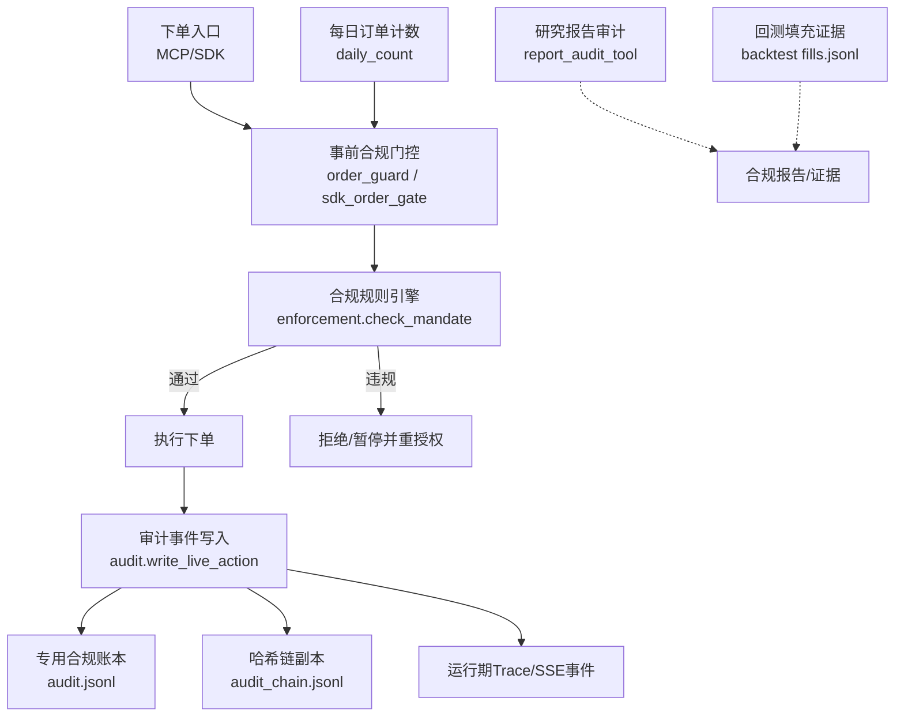
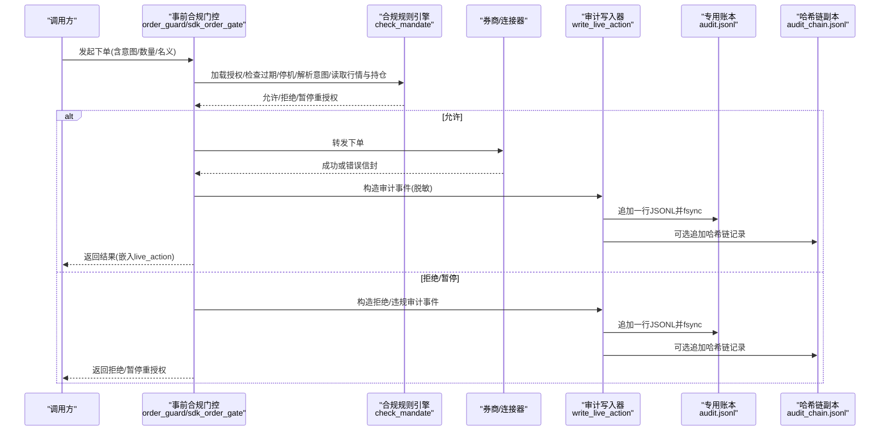
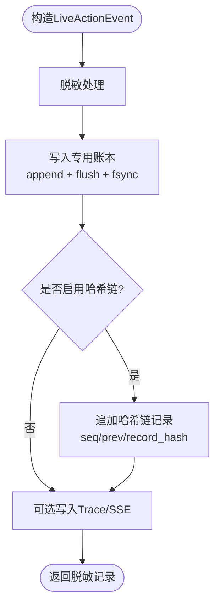
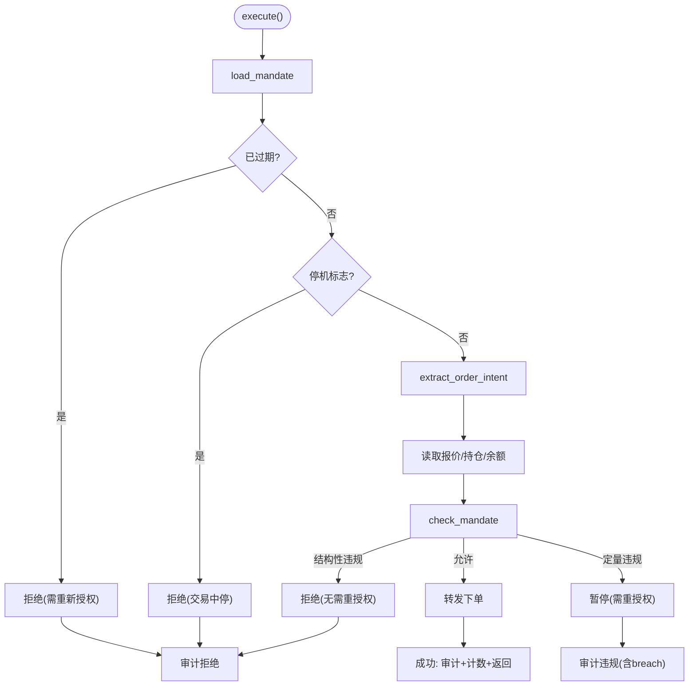
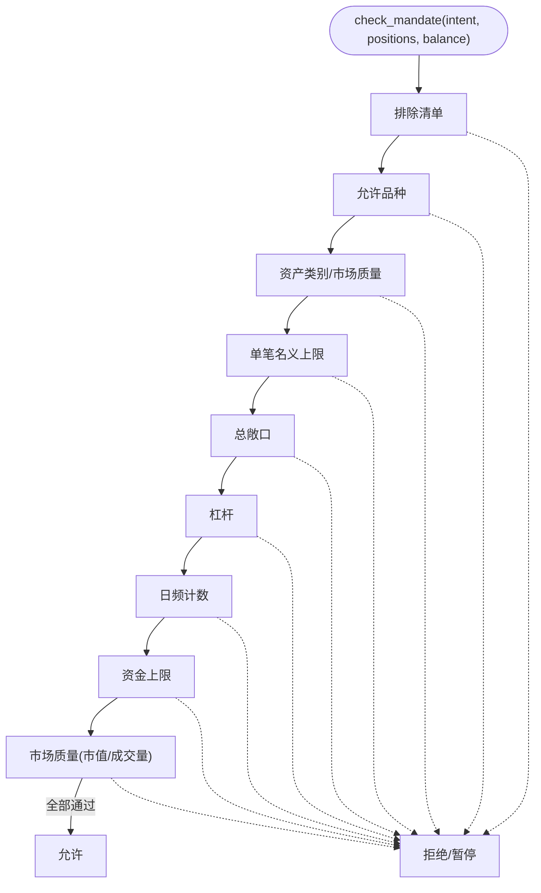
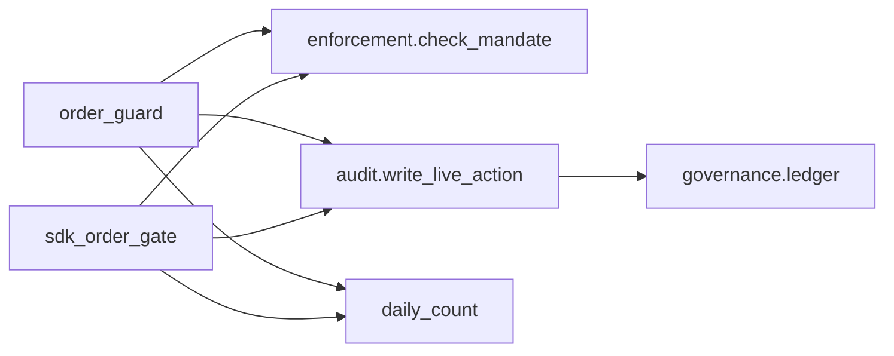

# 审计追踪记录

<cite>
**本文引用的文件**
- [agent/src/live/audit.py](file://agent/src/live/audit.py)
- [agent/src/live/order_guard.py](file://agent/src/live/order_guard.py)
- [agent/src/live/sdk_order_gate.py](file://agent/src/live/sdk_order_gate.py)
- [agent/src/live/enforcement.py](file://agent/src/live/enforcement.py)
- [agent/src/live/daily_count.py](file://agent/src/live/daily_count.py)
- [agent/src/governance/ledger.py](file://agent/src/governance/ledger.py)
- [agent/src/tools/report_audit_tool.py](file://agent/src/tools/report_audit_tool.py)
- [agent/backtest/engines/base.py](file://agent/backtest/engines/base.py)
- [agent/tests/test_mandate_enforcement.py](file://agent/tests/test_mandate_enforcement.py)
</cite>

## 目录
1. [简介](#简介)
2. [项目结构](#项目结构)
3. [核心组件](#核心组件)
4. [架构总览](#架构总览)
5. [详细组件分析](#详细组件分析)
6. [依赖关系分析](#依赖关系分析)
7. [性能与可靠性](#性能与可靠性)
8. [故障排查指南](#故障排查指南)
9. [结论](#结论)
10. [附录](#附录)

## 简介
本技术文档聚焦于“审计追踪记录”的完整实现与使用，覆盖以下方面：
- 操作日志记录：用户操作审计、系统事件记录、交易行为追踪。
- 合规检查机制：监管规则验证、交易限制检查、异常行为识别。
- 证据保存与管理：交易快照、决策记录、变更历史（含防篡改链）。
- 审计数据存储与查询：存储格式、索引优化思路、查询接口建议。
- 审计报告生成：合规报告、交易报告、风险分析报告。
- 审计数据分析与挖掘：模式识别、异常检测、趋势分析。
- 数据保护与备份策略：持久化、防篡改、归档与导出。
- 在合规监管与风险控制中的作用：以可追溯、可验证、可审计为核心目标。

## 项目结构
围绕审计追踪的关键代码分布在 live（实盘）、governance（治理）、tools（工具）与 backtest（回测）等模块中：
- 实时审计账本：将每笔真实资金操作写入不可变追加式 JSONL 账本，并可选写入哈希链副本。
- 事前合规门控：对每一笔下单执行强制校验（指令解析、限额、敞口、杠杆、日频计数、资金上限、市场质量等），失败即拒绝或暂停重授权。
- 每日订单计数：跨进程原子递增，UTC 日历日切分，作为防御性补充。
- 哈希链与防篡改：独立模块提供带序列号与前序哈希的追加式账本，支持完整性校验、分段归档与离线导出验证。
- 研究报告审计：抽取报告中的数值点并与权威来源比对，形成 PASS/FAIL 判定。
- 回测填充证据：将填充记录以 JSONL 形式输出为不可变执行证据。

图表来源
- [agent/src/live/order_guard.py:130-214](file://agent/src/live/order_guard.py#L130-L214)
- [agent/src/live/sdk_order_gate.py:59-157](file://agent/src/live/sdk_order_gate.py#L59-L157)
- [agent/src/live/enforcement.py:458-620](file://agent/src/live/enforcement.py#L458-L620)
- [agent/src/live/audit.py:248-351](file://agent/src/live/audit.py#L248-L351)
- [agent/src/governance/ledger.py:368-469](file://agent/src/governance/ledger.py#L368-L469)
- [agent/src/live/daily_count.py:72-134](file://agent/src/live/daily_count.py#L72-L134)
- [agent/src/tools/report_audit_tool.py:427-538](file://agent/src/tools/report_audit_tool.py#L427-L538)
- [agent/backtest/engines/base.py:2303-2332](file://agent/backtest/engines/base.py#L2303-L2332)

章节来源
- [agent/src/live/order_guard.py:1-800](file://agent/src/live/order_guard.py#L1-L800)
- [agent/src/live/sdk_order_gate.py:1-727](file://agent/src/live/sdk_order_gate.py#L1-L727)
- [agent/src/live/enforcement.py:1-798](file://agent/src/live/enforcement.py#L1-L798)
- [agent/src/live/audit.py:1-352](file://agent/src/live/audit.py#L1-L352)
- [agent/src/governance/ledger.py:1-739](file://agent/src/governance/ledger.py#L1-L739)
- [agent/src/live/daily_count.py:1-135](file://agent/src/live/daily_count.py#L1-L135)
- [agent/src/tools/report_audit_tool.py:1-503](file://agent/src/tools/report_audit_tool.py#L1-L503)
- [agent/backtest/engines/base.py:2303-2332](file://agent/backtest/engines/base.py#L2303-L2332)

## 核心组件
- 实时审计事件模型与写入器：定义统一事件结构、脱敏、三路扇出（专用账本、运行期 Trace、SSE 事件），并支持可选哈希链副本。
- 事前合规门控（MCP 路径）：包装远程下单工具，顺序执行授权、过期、停机标志、意图解析、报价/持仓读取、限额检查，最终放行或拒绝。
- 事前合规门控（直接 SDK 路径）：对非 MCP 的直连 SDK 下单进行相同流程封装，保证一致性与可审计性。
- 合规规则引擎：集中实现“排除清单→允许品种→资产类别→单笔名义→总敞口→杠杆→日频计数→资金上限→市场质量”的严格顺序检查，全部 fail-closed。
- 每日订单计数：按 UTC 日历日统计，原子写入，跨进程互斥锁保护。
- 哈希链账本：追加式 JSONL，每条记录包含 seq、prev_record_hash、record_hash，支持全链校验、分段归档、离线导出与验证。
- 研究报告审计：从 Markdown 抽取数值点，抽样后与权威来源比对，给出 PASS/FAIL 判定。
- 回测填充证据：将每次填充写为自包含 JSONL 行，作为不可变执行证据。

章节来源
- [agent/src/live/audit.py:172-351](file://agent/src/live/audit.py#L172-L351)
- [agent/src/live/order_guard.py:97-214](file://agent/src/live/order_guard.py#L97-L214)
- [agent/src/live/sdk_order_gate.py:59-157](file://agent/src/live/sdk_order_gate.py#L59-L157)
- [agent/src/live/enforcement.py:458-620](file://agent/src/live/enforcement.py#L458-L620)
- [agent/src/live/daily_count.py:72-134](file://agent/src/live/daily_count.py#L72-L134)
- [agent/src/governance/ledger.py:368-469](file://agent/src/governance/ledger.py#L368-L469)
- [agent/src/tools/report_audit_tool.py:427-538](file://agent/src/tools/report_audit_tool.py#L427-L538)
- [agent/backtest/engines/base.py:2303-2332](file://agent/backtest/engines/base.py#L2303-L2332)

## 架构总览
下图展示一次下单请求从进入门控到审计落盘的端到端流程，以及关键分支（拒绝、暂停重授权、错误转发）。

图表来源
- [agent/src/live/order_guard.py:130-214](file://agent/src/live/order_guard.py#L130-L214)
- [agent/src/live/sdk_order_gate.py:59-157](file://agent/src/live/sdk_order_gate.py#L59-L157)
- [agent/src/live/enforcement.py:458-620](file://agent/src/live/enforcement.py#L458-L620)
- [agent/src/live/audit.py:248-351](file://agent/src/live/audit.py#L248-L351)
- [agent/src/governance/ledger.py:368-469](file://agent/src/governance/ledger.py#L368-L469)

## 详细组件分析

### 实时审计事件与写入器
- 事件模型：统一描述 kind、session_id、outcome、server、remote_tool、intent_normalized、mandate_snapshot_ref、consent_record_ref、broker_request/response、gate_decision、error、audit_id、ts。
- 三路扇出：专用合规账本（始终写入）、运行期 Trace（可选）、SSE 事件（可选）。所有敏感字段在写入前统一脱敏。
- 持久化与防篡改：专用账本追加写入并 fsync；可选写入哈希链副本，具备 seq、prev_record_hash、record_hash，支持后续完整性校验。

图表来源
- [agent/src/live/audit.py:172-351](file://agent/src/live/audit.py#L172-L351)
- [agent/src/governance/ledger.py:368-469](file://agent/src/governance/ledger.py#L368-L469)

章节来源
- [agent/src/live/audit.py:172-351](file://agent/src/live/audit.py#L172-L351)
- [agent/src/governance/ledger.py:368-469](file://agent/src/governance/ledger.py#L368-L469)

### 事前合规门控（MCP 路径）
- 执行顺序：加载授权→检查过期→停机标志→解析意图→读取持仓与余额→限额检查→放行或拒绝/暂停。
- 数量转名义：若仅传数量，则先取报价（优先券商报价，其次数据源），计算 implied notional，并与显式名义取较大值，防止绕过限额。
- 审计嵌入：无论放行还是拒绝，均写入审计事件；放行且成功时才会消耗当日计数。

图表来源
- [agent/src/live/order_guard.py:130-214](file://agent/src/live/order_guard.py#L130-L214)
- [agent/src/live/order_guard.py:218-288](file://agent/src/live/order_guard.py#L218-L288)
- [agent/src/live/order_guard.py:364-432](file://agent/src/live/order_guard.py#L364-L432)

章节来源
- [agent/src/live/order_guard.py:97-214](file://agent/src/live/order_guard.py#L97-L214)
- [agent/src/live/order_guard.py:218-288](file://agent/src/live/order_guard.py#L218-L288)
- [agent/src/live/order_guard.py:364-432](file://agent/src/live/order_guard.py#L364-L432)

### 事前合规门控（直接 SDK 路径）
- 与 MCP 路径保持一致的审核流程，适配不同连接器 API。
- 风险降低型动作可跳过部分检查但仍被审计；风险增加型动作遵循完整流程。
- 仅在成功且非错误响应时消费当日计数，并在结果中嵌入审计记录。

章节来源
- [agent/src/live/sdk_order_gate.py:59-157](file://agent/src/live/sdk_order_gate.py#L59-L157)
- [agent/src/live/sdk_order_gate.py:364-426](file://agent/src/live/sdk_order_gate.py#L364-L426)
- [agent/src/live/sdk_order_gate.py:387-438](file://agent/src/live/sdk_order_gate.py#L387-L438)

### 合规规则引擎（check_mandate）
- 检查顺序（fail-closed）：
  1) 排除清单 → 2) 允许品种 → 3) 资产类别（含市场质量下限）→ 4) 单笔名义上限 → 5) 总敞口 → 6) 杠杆 → 7) 日频计数 → 8) 资金上限 → 9) 市场质量（市值/日均成交额）。
- 结构化违规（universe/instrument）：直接拒绝。
- 定量违规（quantitative）：暂停并要求重新授权。
- 位置与余额解析：兼容多种信封格式，无法解析则拒绝。

图表来源
- [agent/src/live/enforcement.py:458-620](file://agent/src/live/enforcement.py#L458-L620)
- [agent/src/live/enforcement.py:623-679](file://agent/src/live/enforcement.py#L623-L679)

章节来源
- [agent/src/live/enforcement.py:458-620](file://agent/src/live/enforcement.py#L458-L620)
- [agent/src/live/enforcement.py:623-679](file://agent/src/live/enforcement.py#L623-L679)

### 每日订单计数与并发控制
- 计数器：按 UTC 日历日维护，原子替换写入，避免竞态。
- 互斥锁：跨进程非阻塞锁，获取失败即拒绝，确保同一时刻仅一个提交窗口。
- 只读容错：读取失败视为 0，不阻断下单（但不会误计）。

章节来源
- [agent/src/live/daily_count.py:72-134](file://agent/src/live/daily_count.py#L72-L134)

### 哈希链账本与防篡改
- 记录结构：payload + seq + prev_record_hash + record_hash。
- 追加流程：先验整条链（含归档段），再追加新记录，默认 fsync。
- 归档与导出：超过阈值自动归档，保留完整历史；支持构建离线可验证导出包。
- 校验能力：verify_chain、verify_export、verify_chain_with_archives。

章节来源
- [agent/src/governance/ledger.py:368-469](file://agent/src/governance/ledger.py#L368-L469)
- [agent/src/governance/ledger.py:496-585](file://agent/src/governance/ledger.py#L496-L585)
- [agent/src/governance/ledger.py:614-739](file://agent/src/governance/ledger.py#L614-L739)

### 研究报告审计
- 两阶段：extract（抽取数值点并抽样）→ verdict（与权威来源比对，1% 容忍度）。
- 输出：PASS/FAIL 判定及明细，便于合规报告引用。

章节来源
- [agent/src/tools/report_audit_tool.py:132-223](file://agent/src/tools/report_audit_tool.py#L132-L223)
- [agent/src/tools/report_audit_tool.py:265-382](file://agent/src/tools/report_audit_tool.py#L265-L382)
- [agent/src/tools/report_audit_tool.py:427-538](file://agent/src/tools/report_audit_tool.py#L427-L538)

### 回测填充证据
- 将每次填充写为自包含 JSONL 行，作为不可变执行证据，便于事后审计与复盘。

章节来源
- [agent/backtest/engines/base.py:2303-2332](file://agent/backtest/engines/base.py#L2303-L2332)

## 依赖关系分析
- 门控依赖规则引擎：order_guard 与 sdk_order_gate 均调用 check_mandate 做决策。
- 审计写入依赖脱敏与治理模块：audit 依赖 redaction 与 governance ledger。
- 计数与门控：daily_count 被门控用于日频限制与并发控制。
- 测试覆盖：针对各限额与边界场景的参数化测试，确保 fail-closed 语义。

图表来源
- [agent/src/live/order_guard.py:130-214](file://agent/src/live/order_guard.py#L130-L214)
- [agent/src/live/sdk_order_gate.py:59-157](file://agent/src/live/sdk_order_gate.py#L59-L157)
- [agent/src/live/enforcement.py:458-620](file://agent/src/live/enforcement.py#L458-L620)
- [agent/src/live/audit.py:248-351](file://agent/src/live/audit.py#L248-L351)
- [agent/src/governance/ledger.py:368-469](file://agent/src/governance/ledger.py#L368-L469)
- [agent/src/live/daily_count.py:72-134](file://agent/src/live/daily_count.py#L72-L134)

章节来源
- [agent/tests/test_mandate_enforcement.py:1-242](file://agent/tests/test_mandate_enforcement.py#L1-L242)

## 性能与可靠性
- 写入性能：专用账本逐行追加并 fsync；哈希链副本在追加前会遍历现有链（O(n)），适合低频高价值事件。
- 并发控制：每日计数采用文件级互斥锁，避免重复计数与竞态。
- 容错设计：所有外部读取（报价、持仓、余额、数据源）失败均 fail-closed，宁可拒绝也不放行。
- 持久化保障：首次创建目录与文件时 fsync 目录项，减少崩溃丢失风险。
- 可扩展性：审计事件三路扇出，便于扩展新的下游消费者（如告警、报表）。

[本节为通用指导，不直接分析具体文件]

## 故障排查指南
- 审计写入失败：若 fsync 失败，会降级为 flush-only 并记录警告；不影响主流程，但会降低持久化保证。
- 哈希链损坏：追加前会校验整条链，若发现损坏将抛出异常，阻止继续追加；可使用 verify_chain/verify_export 定位问题。
- 每日计数锁不可用：当另一个进程持有锁时会拒绝提交，需等待或排查卡住的进程。
- 报价/数据源不可用：数量转名义失败会导致拒绝；检查券商报价工具或数据源可用性。
- 授权过期或停机：检查 mandate 有效期与 halt 标志，必要时重新授权或解除停机。

章节来源
- [agent/src/live/audit.py:80-97](file://agent/src/live/audit.py#L80-L97)
- [agent/src/governance/ledger.py:309-324](file://agent/src/governance/ledger.py#L309-L324)
- [agent/src/governance/ledger.py:439-441](file://agent/src/governance/ledger.py#L439-L441)
- [agent/src/live/daily_count.py:74-105](file://agent/src/live/daily_count.py#L74-L105)
- [agent/src/live/order_guard.py:797-810](file://agent/src/live/order_guard.py#L797-L810)

## 结论
该审计追踪体系以“不可变、可追溯、可验证”为核心，贯穿从下单前的合规检查到下单后的审计落盘全过程。通过严格的 fail-closed 策略、统一的审计事件模型、可选的哈希链防篡改与完整的归档导出能力，系统在合规监管与风险控制中提供了坚实的技术基础。配合研究报告审计与回测填充证据，形成了覆盖研究、实盘与回溯的全链路审计闭环。

[本节为总结性内容，不直接分析具体文件]

## 附录

### 审计数据存储与查询建议
- 存储格式：专用账本与哈希链均为 JSONL，便于流式读取与增量处理。
- 索引优化：
  - 基于时间戳 ts 建立倒排索引或按天分片，加速时间范围查询。
  - 基于 session_id、kind、server、remote_tool 建立复合索引，支撑多维度检索。
  - 对高频过滤字段（如 outcome、gate_decision.allowed）建立位图或布隆过滤器以提升扫描效率。
- 查询接口建议：
  - 提供 REST/GraphQL 接口，支持按时间、会话、类型、结果、网关决策等条件筛选。
  - 提供导出接口，支持将指定时间段内的审计记录导出为 JSONL/CSV，并附带哈希链校验摘要。
  - 提供审计链校验接口，返回 verify_chain/verify_export 的结果。

[本节为通用指导，不直接分析具体文件]

### 审计报告生成
- 合规报告：汇总拒绝/违规事件、闸门决策、授权快照与同意记录，附哈希链校验结果。
- 交易报告：按账户/券商/策略维度聚合成交、拒绝、暂停重授权事件，统计日频计数与限额使用情况。
- 风险分析报告：结合风险评估工具（VaR/CVaR、最大回撤、尾部风险）与审计事件，评估策略风险暴露与异常行为。

[本节为通用指导，不直接分析具体文件]

### 审计数据分析与挖掘
- 模式识别：基于 kind/outcome/session_id 聚类，识别异常批量下单或频繁拒绝模式。
- 异常检测：对 gate_decision.checked_limits 与 breach 字段进行阈值监控，触发告警。
- 趋势分析：按日/周统计拒绝率、暂停重授权频率、限额触发分布，辅助调整授权参数。

[本节为通用指导，不直接分析具体文件]

### 数据保护与备份策略
- 本地备份：定期复制专用账本与哈希链副本至异地存储，保留原始 JSONL 与导出包。
- 归档策略：按大小或时间归档哈希链，保持不可变与可验证。
- 访问控制：账本目录权限最小化（如 0o700），仅授权服务可读写。
- 校验策略：周期性运行 verify_chain/verify_export，确保链完整性与导出一致性。

[本节为通用指导，不直接分析具体文件]