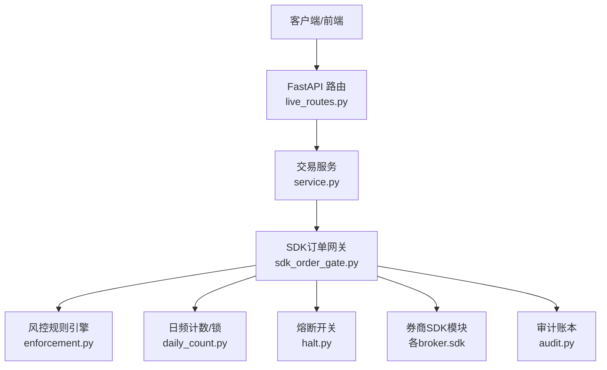
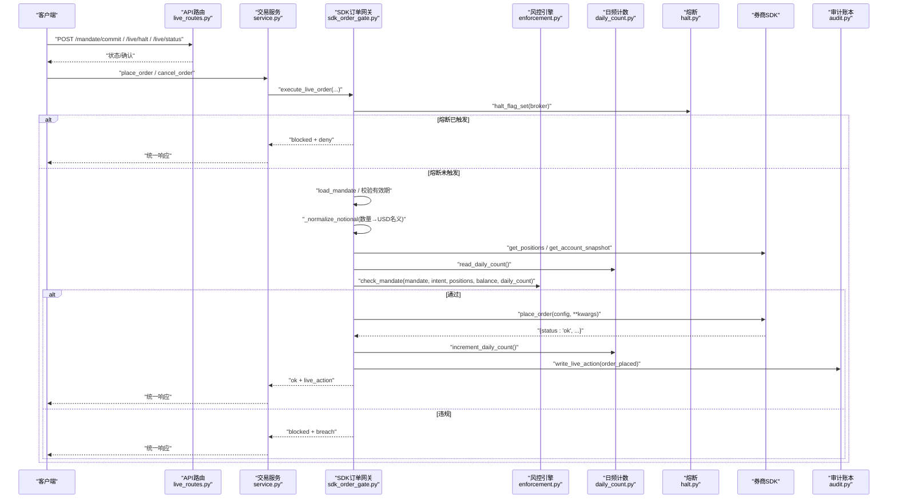
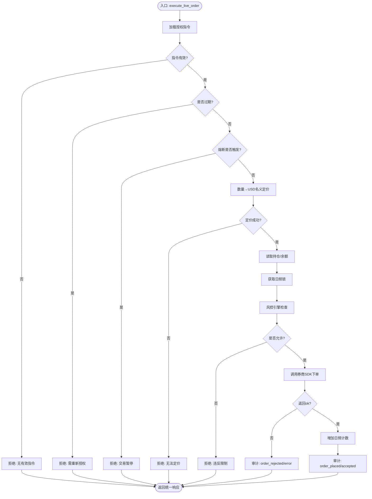
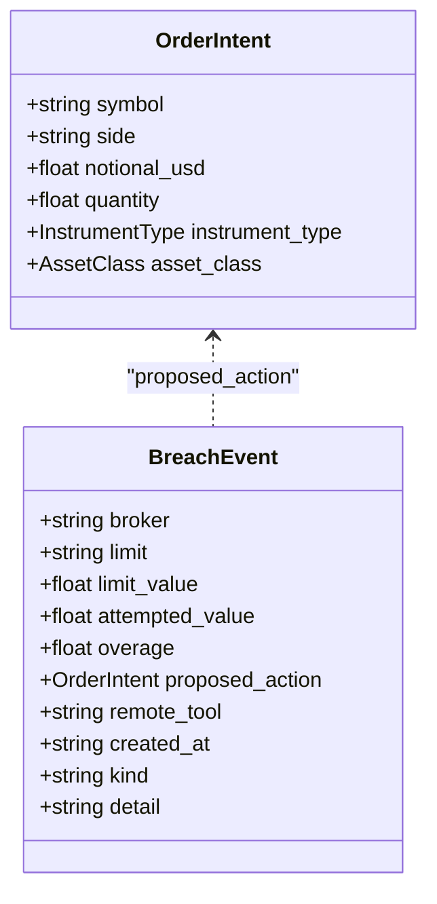
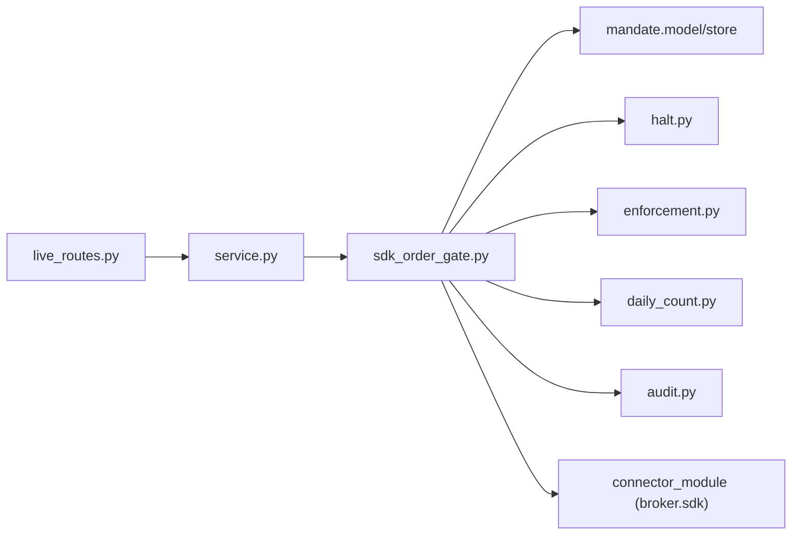
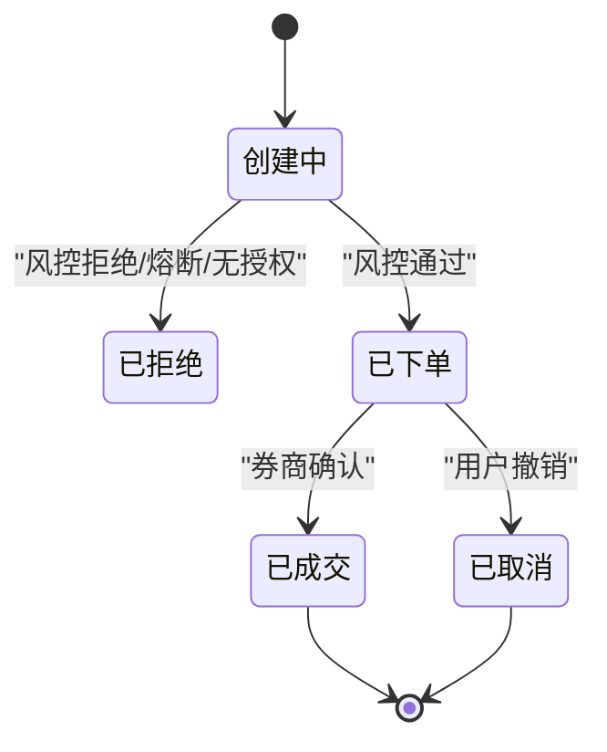

# SDK订单网关

<cite>
**本文引用的文件**
- [sdk_order_gate.py](file://agent/src/live/sdk_order_gate.py)
- [enforcement.py](file://agent/src/live/enforcement.py)
- [audit.py](file://agent/src/live/audit.py)
- [daily_count.py](file://agent/src/live/daily_count.py)
- [halt.py](file://agent/src/live/halt.py)
- [service.py](file://agent/src/trading/service.py)
- [live_routes.py](file://agent/src/api/live_routes.py)
- [test_sdk_order_gate.py](file://agent/tests/test_sdk_order_gate.py)
</cite>

## 目录
1. [简介](#简介)
2. [项目结构](#项目结构)
3. [核心组件](#核心组件)
4. [架构总览](#架构总览)
5. [详细组件分析](#详细组件分析)
6. [依赖关系分析](#依赖关系分析)
7. [性能与可靠性](#性能与可靠性)
8. [故障排查指南](#故障排查指南)
9. [结论](#结论)
10. [附录：API与消息规范、使用示例与集成指南](#附录api与消息规范使用示例与集成指南)

## 简介
本技术文档聚焦于“SDK订单网关”（Direct-SDK Live Order Gate），其职责是在任何真实资金交易到达券商之前，执行强一致的前置风控与合规校验。该网关以函数式门面暴露统一入口，对下单、撤销等写操作进行强制拦截与审计，确保：
- 授权指令（Mandate）有效且未过期
- 熔断开关（Halt）未触发
- 数量型订单可定价并转换为统一的美元名义金额
- 组合持仓与账户余额读取失败时采用fail-closed策略
- 通过统一的风控规则引擎检查单笔名义、总敞口、杠杆、每日次数等限制
- 所有决策与执行结果均写入不可篡改的审计账本，并附带红字脱敏

此外，本文档还覆盖REST端点、WebSocket事件、请求处理流程、响应封装、错误码、订单生命周期、重试机制以及多券商适配方案。

## 项目结构
SDK订单网关位于实时交易层（live），与交易服务（trading）、API路由（api）和审计（audit）紧密协作。关键路径如下：
- 网关实现：agent/src/live/sdk_order_gate.py
- 风控规则与意图模型：agent/src/live/enforcement.py
- 审计账本：agent/src/live/audit.py
- 日频计数与并发锁：agent/src/live/daily_count.py
- 熔断开关：agent/src/live/halt.py
- 交易服务编排：agent/src/trading/service.py
- 实时通道HTTP路由：agent/src/api/live_routes.py
- 单元测试覆盖：agent/tests/test_sdk_order_gate.py

**图表来源**
- [live_routes.py:1-200](file://agent/src/api/live_routes.py#L1-L200)
- [service.py:1-200](file://agent/src/trading/service.py#L1-L200)
- [sdk_order_gate.py:59-158](file://agent/src/live/sdk_order_gate.py#L59-L158)
- [enforcement.py:111-177](file://agent/src/live/enforcement.py#L111-L177)
- [audit.py:120-200](file://agent/src/live/audit.py#L120-L200)

**章节来源**
- [sdk_order_gate.py:1-727](file://agent/src/live/sdk_order_gate.py#L1-L727)
- [service.py:1-200](file://agent/src/trading/service.py#L1-L200)
- [live_routes.py:1-200](file://agent/src/api/live_routes.py#L1-L200)

## 核心组件
- SDK订单网关（execute_live_order / execute_live_action）
  - 负责加载授权指令、校验有效期、熔断状态、数量定价、读取持仓与余额、调用风控引擎、执行下单/动作、记录审计、更新日频计数。
- 风控规则引擎（OrderIntent / check_mandate / BreachEvent）
  - 定义标准化订单意图、违规事件类型与判定顺序（排除列表→品种→资产类别→单笔名义→总敞口→杠杆→日频→资金）。
- 审计账本（LiveActionEvent / write_live_action）
  - 将每次动作（下单、拒绝、撤销、授权提交、熔断切换）持久化到追加型账本，支持SSE事件与TraceWriter输出，并对敏感字段脱敏。
- 日频计数与并发锁（daily_order_lock / increment_daily_count / read_daily_count）
  - 保证同一券商在同一时间窗口内仅能成功消费一次日频额度，避免并发重复下单。
- 熔断开关（halt_flag_set）
  - 全局或按券商维度的紧急停止开关，命中后直接拒绝写操作。
- 交易服务（service.py）
  - 面向CLI/MCP/Agent的统一交易接口，区分纸交易与实盘，并将实盘下单路由至网关。

**章节来源**
- [sdk_order_gate.py:59-158](file://agent/src/live/sdk_order_gate.py#L59-L158)
- [enforcement.py:111-177](file://agent/src/live/enforcement.py#L111-L177)
- [audit.py:120-200](file://agent/src/live/audit.py#L120-L200)
- [daily_count.py:1-200](file://agent/src/live/daily_count.py#L1-L200)
- [halt.py:1-200](file://agent/src/live/halt.py#L1-L200)
- [service.py:335-373](file://agent/src/trading/service.py#L335-L373)

## 架构总览
SDK订单网关作为“前置闸门”，在请求进入券商SDK前完成一系列安全与合规检查。整体数据流如下：

**图表来源**
- [sdk_order_gate.py:59-158](file://agent/src/live/sdk_order_gate.py#L59-L158)
- [enforcement.py:111-177](file://agent/src/live/enforcement.py#L111-L177)
- [audit.py:120-200](file://agent/src/live/audit.py#L120-L200)
- [service.py:335-373](file://agent/src/trading/service.py#L335-L373)

## 详细组件分析

### 网关主流程：execute_live_order
- 输入：券商键、连接器模块、配置、标准化订单意图、下单参数、会话ID
- 步骤：
  - 加载并校验授权指令（schema版本、过期时间）
  - 检查熔断开关
  - 将数量型订单转换为美元名义金额（优先连接器报价，其次市场数据加载器）
  - 读取持仓与账户快照（失败则fail-closed）
  - 获取日频计数并调用风控引擎检查
  - 若允许：调用券商SDK下单；成功则增加日频计数并写入审计；否则返回错误信封
  - 若拒绝：返回统一拒绝响应，包含决策、原因、是否需要重新授权、违规详情（如有）

**图表来源**
- [sdk_order_gate.py:59-158](file://agent/src/live/sdk_order_gate.py#L59-L158)
- [sdk_order_gate.py:387-438](file://agent/src/live/sdk_order_gate.py#L387-L438)
- [sdk_order_gate.py:441-517](file://agent/src/live/sdk_order_gate.py#L441-L517)

**章节来源**
- [sdk_order_gate.py:59-158](file://agent/src/live/sdk_order_gate.py#L59-L158)
- [sdk_order_gate.py:387-438](file://agent/src/live/sdk_order_gate.py#L387-L438)
- [sdk_order_gate.py:441-517](file://agent/src/live/sdk_order_gate.py#L441-L517)

### 通用写操作门：execute_live_action
- 适用于非place_order的写操作（如撤销、调整等）
- 风险降低型操作跳过熔断与授权检查但仍审计
- 其他写操作遵循与下单相同的授权、定价、风控、审计流程
- 成功执行后根据策略决定是否消耗日频计数

**章节来源**
- [sdk_order_gate.py:207-361](file://agent/src/live/sdk_order_gate.py#L207-L361)
- [sdk_order_gate.py:364-426](file://agent/src/live/sdk_order_gate.py#L364-L426)

### 风控规则引擎：OrderIntent与check_mandate
- OrderIntent：标准化订单意图，携带symbol、side、notional_usd、quantity、instrument_type、asset_class
- BreachEvent：违规事件，包含limit、attempted_value、overage、kind（universe/instrument/quantitative）
- 检查顺序：排除列表→品种→资产类别→单笔名义→总敞口→杠杆→日频→资金
- 结构性违规（universe/instrument）直接拒绝；定量违规暂停并要求重新授权

**图表来源**
- [enforcement.py:111-177](file://agent/src/live/enforcement.py#L111-L177)

**章节来源**
- [enforcement.py:1-200](file://agent/src/live/enforcement.py#L1-200)

### 审计与事件：LiveActionEvent与write_live_action
- 每个动作生成一个不可变事件，写入追加型审计账本
- 支持可选的TraceWriter与SSE事件回调
- 对所有敏感字段进行脱敏，保证合规
- 同时维护链式防篡改副本（audit_chain.jsonl）

**章节来源**
- [audit.py:1-200](file://agent/src/live/audit.py#L1-L200)

### 日频计数与并发控制
- 使用daily_order_lock确保同一券商在同一时刻只有一个成功消费日频额度的操作
- 仅在成功下单后才增加计数，失败不消耗
- 测试覆盖了并发场景下的串行化行为

**章节来源**
- [sdk_order_gate.py:123-154](file://agent/src/live/sdk_order_gate.py#L123-L154)
- [test_sdk_order_gate.py:880-932](file://agent/tests/test_sdk_order_gate.py#L880-L932)

### 熔断开关
- halt_flag_set用于判断是否处于紧急停止状态
- 一旦触发，所有写操作立即拒绝

**章节来源**
- [sdk_order_gate.py:120-123](file://agent/src/live/sdk_order_gate.py#L120-L123)
- [halt.py:1-200](file://agent/src/live/halt.py#L1-L200)

### 交易服务路由
- service.place_order：纸交易直接调用连接器；实盘通过网关
- service.cancel_order：撤销为风险降低操作，仍审计但不受熔断/授权阻断

**章节来源**
- [service.py:335-373](file://agent/src/trading/service.py#L335-L373)

## 依赖关系分析
- 网关依赖：
  - 授权指令加载与校验（mandate model/store）
  - 熔断开关（halt）
  - 风控引擎（enforcement）
  - 日频计数与锁（daily_count）
  - 审计（audit）
  - 连接器模块（connector_module）
- 服务依赖：
  - 配置文件与连接器映射（_SDK_CONNECTOR_MODULES）
  - 交易服务方法（check_connection/get_positions/get_quote等）
- API路由依赖：
  - 提供授权提交、熔断控制、状态查询等HTTP端点

**图表来源**
- [sdk_order_gate.py:24-48](file://agent/src/live/sdk_order_gate.py#L24-L48)
- [service.py:13-39](file://agent/src/trading/service.py#L13-L39)
- [live_routes.py:1-200](file://agent/src/api/live_routes.py#L1-L200)

**章节来源**
- [sdk_order_gate.py:24-48](file://agent/src/live/sdk_order_gate.py#L24-L48)
- [service.py:13-39](file://agent/src/trading/service.py#L13-L39)
- [live_routes.py:1-200](file://agent/src/api/live_routes.py#L1-L200)

## 性能与可靠性
- fail-closed设计：任何缺失数据或异常都会导致拒绝，避免误放行
- 并发保护：日频锁确保同一券商不会并发超额下单
- 定价容错：连接器报价失败时回退到市场数据加载器；仍失败则拒绝
- 审计幂等：审计写入失败不影响主流程，但会记录警告
- 熔断快速路径：熔断命中直接拒绝，零开销
- 建议优化：
  - 缓存连接器报价与账户快照（短TTL）以降低外部依赖延迟
  - 批量聚合风控计算（如总敞口）减少重复计算
  - 异步化非关键路径（审计、SSE事件）避免阻塞主流程

[本节为通用指导，无需特定文件引用]

## 故障排查指南
- 常见错误与定位：
  - 无有效授权指令：检查mandate是否已提交且schema版本匹配
  - 授权过期：提示重新授权
  - 熔断触发：检查全局或券商级熔断状态
  - 无法定价：检查连接器报价与市场数据加载器可用性
  - 风控违规：查看breach详情（limit、attempted_value、kind）
  - 日频耗尽：等待下一交易日或调整限额
  - 连接器异常：捕获异常并转为错误信封，检查日志
- 审计追踪：
  - 通过审计账本（audit.jsonl / audit_chain.jsonl）回溯每笔动作
  - SSE事件（live.action）可用于前端实时渲染
- 日志关键词：
  - “live place_order raised”、“connector quote failed”、“loader quote failed”、“live-action audit write failed”

**章节来源**
- [sdk_order_gate.py:364-426](file://agent/src/live/sdk_order_gate.py#L364-L426)
- [audit.py:1-200](file://agent/src/live/audit.py#L1-L200)
- [test_sdk_order_gate.py:935-963](file://agent/tests/test_sdk_order_gate.py#L935-L963)

## 结论
SDK订单网关以强一致的前置风控为核心，结合授权指令、熔断开关、数量定价、风控规则与审计账本，构建了可靠、可追溯、可扩展的实盘下单通道。通过统一响应封装与错误码体系，上层API与服务可稳定集成。多券商适配器通过标准连接器模块接入，便于扩展与维护。

[本节为总结性内容，无需特定文件引用]

## 附录：API与消息规范、使用示例与集成指南

### RESTful端点（实时通道）
- POST /mandate/commit：提交授权指令（唯一写入路径）
- POST /live/halt：触发或清除熔断开关
- GET /live/status：查询授权、熔断、运行器状态
- POST /live/authorize：OAuth引导（发现模式）
- POST /live/runner/start | stop：启动/停止持续运行器

这些端点由API路由层暴露，内部委托至服务与网关逻辑。

**章节来源**
- [live_routes.py:1-200](file://agent/src/api/live_routes.py#L1-L200)

### WebSocket连接与事件
- 事件总线复用现有Session EventBus，推送live.action事件
- 前端可通过已有SSE订阅获取实时审计事件
- 当前实现未新增独立WS通道，主要通过SSE与HTTP交互

**章节来源**
- [live_routes.py:1-200](file://agent/src/api/live_routes.py#L1-L200)
- [audit.py:1-200](file://agent/src/live/audit.py#L1-L200)

### 消息格式与响应封装
- 成功响应：{status:"ok", ...}，附加live_action审计记录
- 拒绝响应：{status:"blocked", decision:"deny"/"pause_for_reauth", reason, requires_reauthorization, broker, breach?}
- 错误响应：{status:"error", error}
- 审计记录包含gate_decision、intent_normalized、broker_request/response（已脱敏）

**章节来源**
- [sdk_order_gate.py:387-438](file://agent/src/live/sdk_order_gate.py#L387-L438)
- [sdk_order_gate.py:441-517](file://agent/src/live/sdk_order_gate.py#L441-L517)
- [audit.py:120-200](file://agent/src/live/audit.py#L120-L200)

### 错误码定义
- status: ok / blocked / error
- decision: allow / deny / pause_for_reauth
- outcome: accepted / filled / rejected / error / blocked
- kind: universe / instrument / quantitative
- 违规详情：limit、limit_value、attempted_value、overage、detail、proposed_action

**章节来源**
- [enforcement.py:111-177](file://agent/src/live/enforcement.py#L111-L177)
- [audit.py:120-200](file://agent/src/live/audit.py#L120-L200)

### 订单生命周期管理
- 创建：execute_live_order → 风控检查 → 下单 → 审计
- 修改：execute_live_action（风险降低型跳过部分检查）
- 取消：service.cancel_order（风险降低，仍审计）
- 确认：券商侧确认后，审计记录outcome为filled（由上游决定）

**图表来源**
- [sdk_order_gate.py:59-158](file://agent/src/live/sdk_order_gate.py#L59-L158)
- [service.py:335-373](file://agent/src/trading/service.py#L335-L373)
- [audit.py:120-200](file://agent/src/live/audit.py#L120-L200)

### SDK使用示例与集成指南
- 集成步骤：
  - 配置连接器模块（broker key → connector module）
  - 构建配置对象（build_config）
  - 调用service.place_order（纸交易直接执行；实盘走网关）
  - 订阅SSE事件获取审计与状态变更
- 示例路径（不展示代码内容）：
  - 下单入口：service.place_order
  - 网关调用：execute_live_order
  - 风控检查：check_mandate
  - 审计写入：write_live_action

**章节来源**
- [service.py:13-39](file://agent/src/trading/service.py#L13-L39)
- [service.py:335-373](file://agent/src/trading/service.py#L335-L373)
- [sdk_order_gate.py:59-158](file://agent/src/live/sdk_order_gate.py#L59-L158)
- [audit.py:120-200](file://agent/src/live/audit.py#L120-L200)

### 错误处理与重试机制
- 连接器异常：捕获并转为错误信封，不向上抛出
- 定价失败：fail-closed拒绝
- 审计失败：记录警告，不阻塞主流程
- 重试建议：
  - 网络超时类错误可指数退避重试
  - 风控拒绝不应重试（需调整策略或等待授权更新）
  - 熔断期间禁止重试

**章节来源**
- [sdk_order_gate.py:364-426](file://agent/src/live/sdk_order_gate.py#L364-L426)
- [sdk_order_gate.py:387-438](file://agent/src/live/sdk_order_gate.py#L387-L438)

### 多券商接口适配方案
- 统一连接器接口：build_config、check_status、get_account_snapshot、get_positions、get_open_orders、get_quote、get_historical_bars
- 下单方法差异：不同券商可能暴露不同的下单函数名（如place_order/submit_order/create_order），通过registry分类为WRITE操作
- 适配器要点：
  - 实现标准读接口
  - 实现下单函数并返回统一信封（status、order_id等）
  - 可选实现quantity_notional_usd以准确计算名义金额
  - 处理券商特有错误码（如OKX sCode）

**章节来源**
- [service.py:13-39](file://agent/src/trading/service.py#L13-L39)
- [test_sdk_order_gate.py:981-1009](file://agent/tests/test_sdk_order_gate.py#L981-L1009)