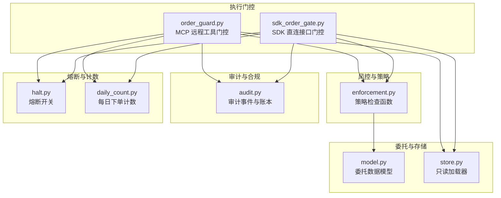
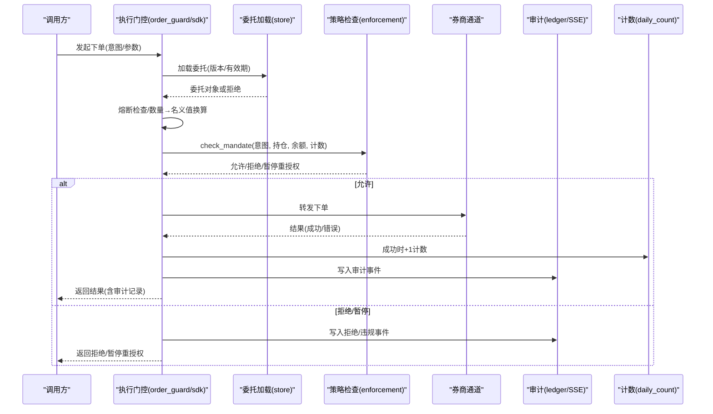
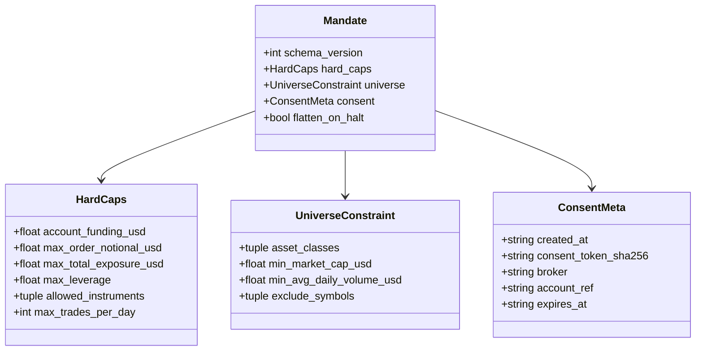
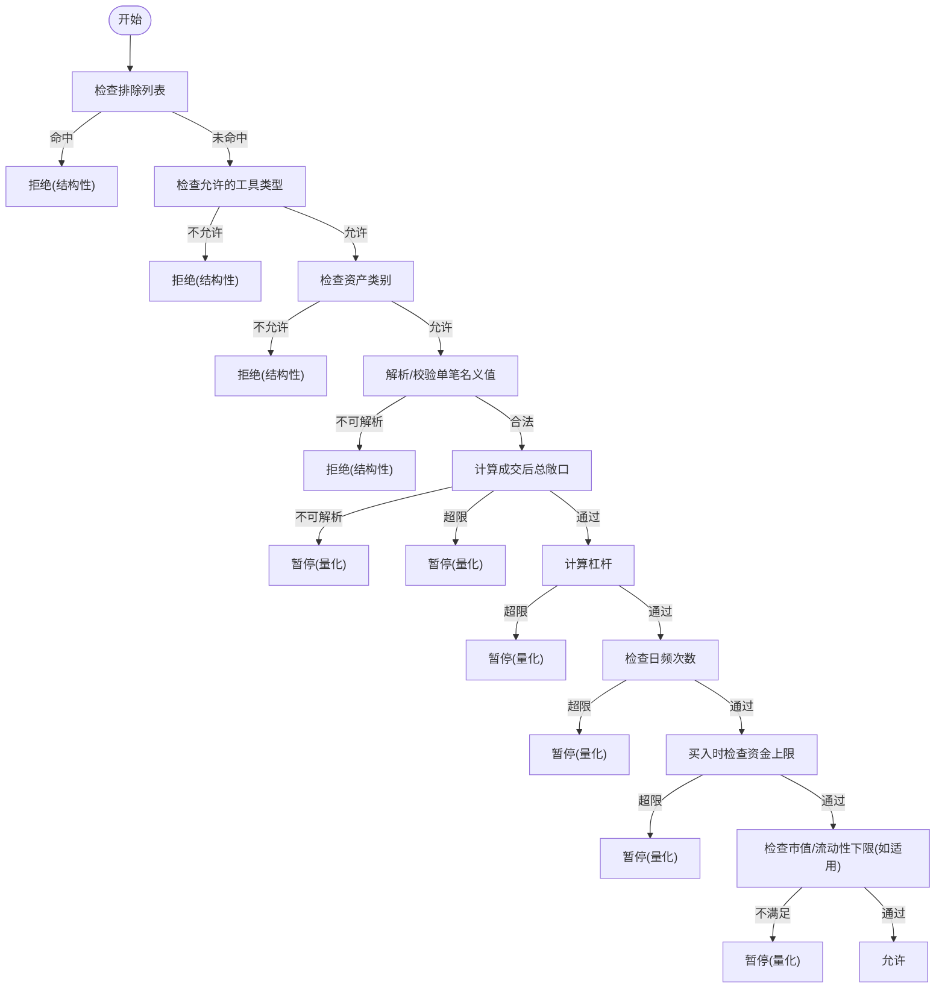
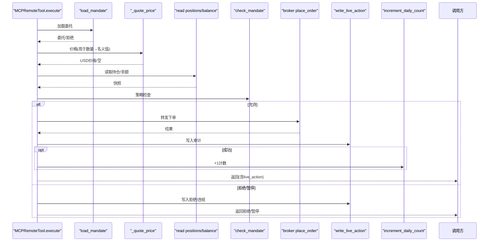
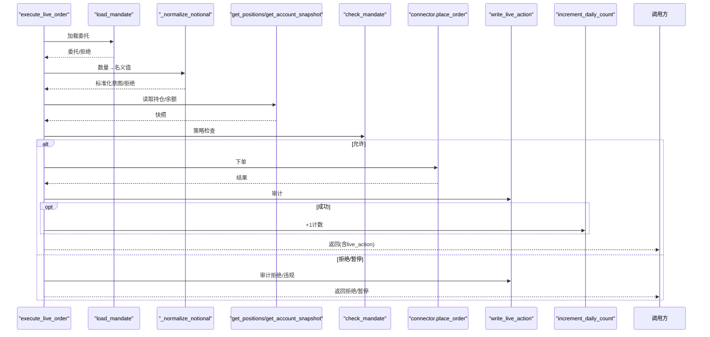
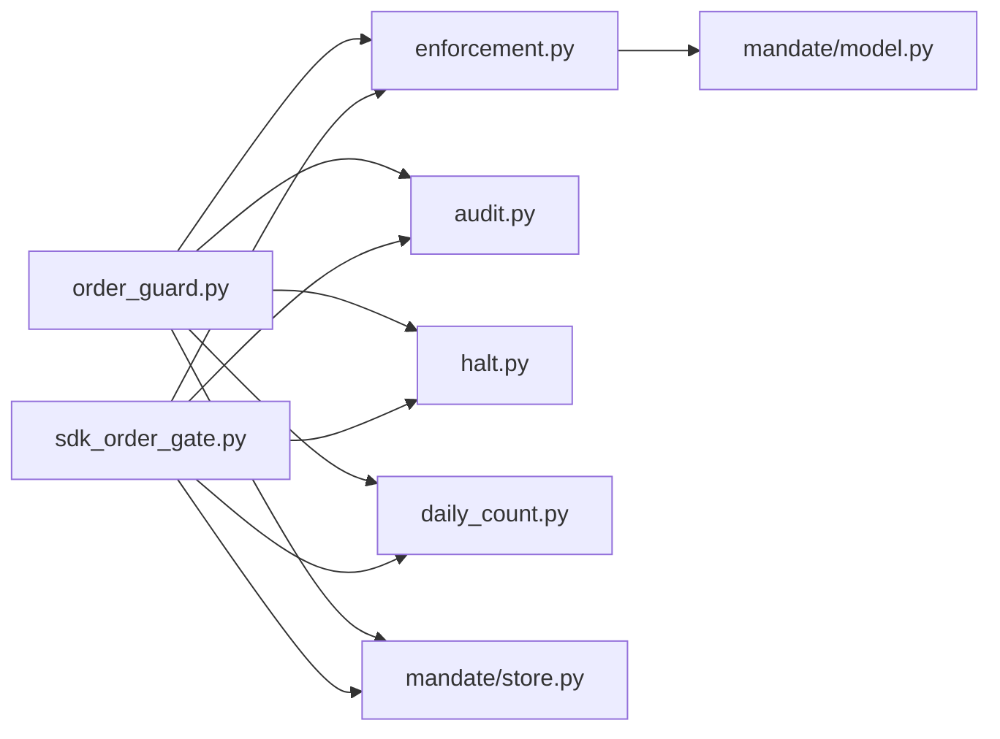

# 指令委托系统

<cite>
**本文引用的文件**
- [agent/src/live/mandate/model.py](file://agent/src/live/mandate/model.py)
- [agent/src/live/mandate/store.py](file://agent/src/live/mandate/store.py)
- [agent/src/live/enforcement.py](file://agent/src/live/enforcement.py)
- [agent/src/live/order_guard.py](file://agent/src/live/order_guard.py)
- [agent/src/live/sdk_order_gate.py](file://agent/src/live/sdk_order_gate.py)
- [agent/src/live/audit.py](file://agent/src/live/audit.py)
- [agent/src/live/halt.py](file://agent/src/live/halt.py)
- [agent/src/live/daily_count.py](file://agent/src/live/daily_count.py)
</cite>

## 目录
1. [简介](#简介)
2. [项目结构](#项目结构)
3. [核心组件](#核心组件)
4. [架构总览](#架构总览)
5. [详细组件分析](#详细组件分析)
6. [依赖关系分析](#依赖关系分析)
7. [性能与可靠性](#性能与可靠性)
8. [故障排查指南](#故障排查指南)
9. [结论](#结论)
10. [附录](#附录)

## 简介
本技术文档围绕“指令委托系统”展开，聚焦以下目标：
- 用户授权机制：权限管理、访问控制、安全验证（指令委托模型、有效期、不可变性与审计溯源）。
- 策略执行框架：策略注册、参数配置、执行调度（指令意图标准化、风控检查、拒绝/放行/暂停重授权）。
- 风险审查流程：事前检查、事中监控、事后审计（前置校验、实时告警、可追溯审计账本）。
- 指令生命周期管理：创建、审批、执行、确认（从委托提交到订单落库的全链路）。
- SDK 订单网关：API 接口设计、请求处理、响应封装（面向直连 SDK 的下单门控）。
- 指令模板与配置管理：预设策略、参数模板、批量操作（通过委托模型与约束表达）。
- 监控与调试工具：审计事件、链式防篡改账本、SSE 事件、运行期日志。
- 自动化交易应用场景与工作流：在真实券商通道中实现“受控自治”。

## 项目结构
指令委托系统位于 agent/src/live 下，按职责分层组织：
- 委托模型与存储：定义不可变的委托契约，提供只读加载器。
- 风控与策略：将订单意图与当前持仓/余额对照委托硬上限进行严格校验。
- 执行门控：MCP 远程工具包装器与 SDK 直连接口门控，统一拦截下单路径。
- 审计与合规：独立追加型审计账本，支持哈希链防篡改与 SSE 事件推送。
- 熔断与计数：全局/逐券商熔断开关；每日下单次数原子计数。

图表来源
- [agent/src/live/order_guard.py:130-214](file://agent/src/live/order_guard.py#L130-L214)
- [agent/src/live/sdk_order_gate.py:59-157](file://agent/src/live/sdk_order_gate.py#L59-L157)
- [agent/src/live/enforcement.py:458-620](file://agent/src/live/enforcement.py#L458-L620)
- [agent/src/live/audit.py:248-351](file://agent/src/live/audit.py#L248-L351)
- [agent/src/live/halt.py:135-163](file://agent/src/live/halt.py#L135-L163)
- [agent/src/live/daily_count.py:72-134](file://agent/src/live/daily_count.py#L72-L134)
- [agent/src/live/mandate/store.py:42-70](file://agent/src/live/mandate/store.py#L42-L70)
- [agent/src/live/mandate/model.py:46-149](file://agent/src/live/mandate/model.py#L46-L149)

章节来源
- [agent/src/live/order_guard.py:1-800](file://agent/src/live/order_guard.py#L1-L800)
- [agent/src/live/sdk_order_gate.py:1-727](file://agent/src/live/sdk_order_gate.py#L1-L727)
- [agent/src/live/enforcement.py:1-798](file://agent/src/live/enforcement.py#L1-L798)
- [agent/src/live/audit.py:1-352](file://agent/src/live/audit.py#L1-L352)
- [agent/src/live/halt.py:1-281](file://agent/src/live/halt.py#L1-L281)
- [agent/src/live/daily_count.py:1-135](file://agent/src/live/daily_count.py#L1-L135)
- [agent/src/live/mandate/store.py:1-133](file://agent/src/live/mandate/store.py#L1-L133)
- [agent/src/live/mandate/model.py:1-149](file://agent/src/live/mandate/model.py#L1-L149)

## 核心组件
- 委托模型（不可变契约）：以冻结数据类表达硬上限、可投资范围、同意元数据等，确保运行时只读且不可被智能体篡改。
- 委托加载器：只读加载 mandate.json，失败即关闭（fail-closed），未知版本直接拒绝。
- 策略引擎：对订单意图进行结构化与量化双重校验，返回允许/拒绝/暂停重授权三类决策。
- 执行门控：
  - MCP 远程工具门控：包裹下单远端工具，统一拦截、审计、计数。
  - SDK 直连接口门控：为直连 SDK 提供相同语义的门控流程。
- 审计与合规：追加型审计账本，支持可选的哈希链防篡改副本与 SSE 事件推送。
- 熔断与计数：文件系统级熔断开关；跨进程原子锁保护的每日下单计数。

章节来源
- [agent/src/live/mandate/model.py:46-149](file://agent/src/live/mandate/model.py#L46-L149)
- [agent/src/live/mandate/store.py:42-70](file://agent/src/live/mandate/store.py#L42-L70)
- [agent/src/live/enforcement.py:111-177](file://agent/src/live/enforcement.py#L111-L177)
- [agent/src/live/order_guard.py:97-214](file://agent/src/live/order_guard.py#L97-L214)
- [agent/src/live/sdk_order_gate.py:59-157](file://agent/src/live/sdk_order_gate.py#L59-L157)
- [agent/src/live/audit.py:172-351](file://agent/src/live/audit.py#L172-L351)
- [agent/src/live/halt.py:135-163](file://agent/src/live/halt.py#L135-L163)
- [agent/src/live/daily_count.py:72-134](file://agent/src/live/daily_count.py#L72-L134)

## 架构总览
指令委托系统采用“门控 + 策略 + 审计”的分层架构：
- 入口层：MCP 远程工具或 SDK 直连接口调用进入执行门控。
- 策略层：将订单归一化为 OrderIntent，结合委托、持仓、余额、报价进行风控检查。
- 执行层：通过门控后转发至券商通道，成功则消费每日计数并写入审计。
- 保障层：熔断开关、每日计数、审计账本与 SSE 事件贯穿全链路。

图表来源
- [agent/src/live/order_guard.py:130-214](file://agent/src/live/order_guard.py#L130-L214)
- [agent/src/live/sdk_order_gate.py:59-157](file://agent/src/live/sdk_order_gate.py#L59-L157)
- [agent/src/live/enforcement.py:458-620](file://agent/src/live/enforcement.py#L458-L620)
- [agent/src/live/audit.py:248-351](file://agent/src/live/audit.py#L248-L351)
- [agent/src/live/daily_count.py:106-134](file://agent/src/live/daily_count.py#L106-L134)

## 详细组件分析

### 委托模型与存储
- 不可变委托：使用冻结数据类表达硬上限（单笔名义值、总敞口、杠杆、日频次数）、可投资范围（资产类别、排除标的）、同意元数据（创建时间、有效期、券商、账户引用）。
- 只读加载：从受保护路径读取 mandate.json，解析严格、失败即关闭；未知 schema_version 直接拒绝。
- 安全要点：无写路径暴露给智能体；过期委托自动失效；可选 flatten_on_halt 控制熔断时是否平掉仓位。

图表来源
- [agent/src/live/mandate/model.py:46-149](file://agent/src/live/mandate/model.py#L46-L149)

章节来源
- [agent/src/live/mandate/model.py:46-149](file://agent/src/live/mandate/model.py#L46-L149)
- [agent/src/live/mandate/store.py:42-120](file://agent/src/live/mandate/store.py#L42-L120)

### 策略执行框架（风控检查）
- 订单意图：Broker 无关的 OrderIntent，包含 symbol、side、notional_usd、quantity、instrument_type、asset_class。
- 检查顺序（防御纵深）：排除列表 → 允许工具类型 → 资产类别 → 单笔名义值 → 总敞口 → 杠杆 → 日频次数 → 资金上限 → 市场容量/流动性下限（如适用）。
- 失败即关闭：任何无法解析的数据或缺失行情均拒绝订单。
- 决策输出：None 表示允许；否则返回 BreachEvent，区分结构性违规（拒绝）与量化超限（暂停重授权）。

图表来源
- [agent/src/live/enforcement.py:458-620](file://agent/src/live/enforcement.py#L458-L620)

章节来源
- [agent/src/live/enforcement.py:111-177](file://agent/src/live/enforcement.py#L111-L177)
- [agent/src/live/enforcement.py:458-620](file://agent/src/live/enforcement.py#L458-L620)

### 执行门控（MCP 远程工具）
- 统一拦截：所有下单远端工具经 LiveOrderGuardTool.execute 拦截。
- 前置检查：加载委托、校验版本与有效期、熔断检查、意图提取与名义值标准化。
- 快照读取：通过不受门控的路径读取持仓与余额。
- 策略调用：check_mandate 决定允许/拒绝/暂停重授权。
- 审计与计数：仅当券商返回非错误信封时才消费每日计数；始终写入审计事件并嵌入 live_action 字段。

图表来源
- [agent/src/live/order_guard.py:130-214](file://agent/src/live/order_guard.py#L130-L214)
- [agent/src/live/order_guard.py:364-432](file://agent/src/live/order_guard.py#L364-L432)
- [agent/src/live/order_guard.py:754-795](file://agent/src/live/order_guard.py#L754-L795)
- [agent/src/live/enforcement.py:458-620](file://agent/src/live/enforcement.py#L458-L620)

章节来源
- [agent/src/live/order_guard.py:97-214](file://agent/src/live/order_guard.py#L97-L214)
- [agent/src/live/order_guard.py:364-432](file://agent/src/live/order_guard.py#L364-L432)
- [agent/src/live/order_guard.py:754-795](file://agent/src/live/order_guard.py#L754-L795)

### SDK 订单网关（直连接口）
- 目标：为 tiger/alpaca/okx/binance/futu 等直连接口提供与 MCP 门控一致的下单前检查。
- 流程：加载委托 → 过期/熔断检查 → 数量→名义值标准化 → 读取持仓/余额 → check_mandate → 允许则调用 connector.place_order → 成功则计数并审计。
- 失败即关闭：无法定价、无法读取、锁不可用等均拒绝。

图表来源
- [agent/src/live/sdk_order_gate.py:59-157](file://agent/src/live/sdk_order_gate.py#L59-L157)
- [agent/src/live/sdk_order_gate.py:364-426](file://agent/src/live/sdk_order_gate.py#L364-L426)
- [agent/src/live/sdk_order_gate.py:387-438](file://agent/src/live/sdk_order_gate.py#L387-L438)

章节来源
- [agent/src/live/sdk_order_gate.py:59-157](file://agent/src/live/sdk_order_gate.py#L59-L157)
- [agent/src/live/sdk_order_gate.py:364-426](file://agent/src/live/sdk_order_gate.py#L364-L426)
- [agent/src/live/sdk_order_gate.py:387-438](file://agent/src/live/sdk_order_gate.py#L387-L438)

### 风险审查流程（事前/事中/事后）
- 事前检查：委托有效性、有效期、熔断、意图解析、名义值标准化、策略检查。
- 事中监控：SSE 事件推送 live.action；审计事件携带 gate_decision、intent_normalized、breach 详情。
- 事后审计：追加型审计账本（audit.jsonl），可选哈希链副本（audit_chain.jsonl）防篡改；支持 trace_writer 与 event_callback 双路输出。

章节来源
- [agent/src/live/order_guard.py:364-432](file://agent/src/live/order_guard.py#L364-L432)
- [agent/src/live/sdk_order_gate.py:364-426](file://agent/src/live/sdk_order_gate.py#L364-L426)
- [agent/src/live/audit.py:1-59](file://agent/src/live/audit.py#L1-L59)
- [agent/src/live/audit.py:248-351](file://agent/src/live/audit.py#L248-L351)

### 指令生命周期管理
- 创建：通过受保护的同意流程生成 mandate.json（不在智能体可写范围内）。
- 审批：委托包含 consent_token_sha256 与 expires_at，建立人类同意的可追溯性。
- 执行：下单前经过门控与策略检查；成功后写入审计并增加计数。
- 确认：券商返回非错误信封视为确认；否则审计为 rejected/error，不消耗计数。

章节来源
- [agent/src/live/mandate/store.py:42-70](file://agent/src/live/mandate/store.py#L42-L70)
- [agent/src/live/mandate/model.py:100-149](file://agent/src/live/mandate/model.py#L100-L149)
- [agent/src/live/order_guard.py:364-432](file://agent/src/live/order_guard.py#L364-L432)
- [agent/src/live/sdk_order_gate.py:364-426](file://agent/src/live/sdk_order_gate.py#L364-L426)

### SDK 订单网关 API 设计（概念）
- 输入：broker、connector_module、config、intent、place_kwargs、session_id。
- 行为：执行委托加载、过期/熔断检查、数量→名义值标准化、读取快照、策略检查、下单、审计与计数。
- 输出：允许时返回券商结果并附加 live_action；拒绝/暂停时返回结构化拒绝包（含 decision、reason、requires_reauthorization、breach 等）。

章节来源
- [agent/src/live/sdk_order_gate.py:59-157](file://agent/src/live/sdk_order_gate.py#L59-L157)
- [agent/src/live/sdk_order_gate.py:863-890](file://agent/src/live/sdk_order_gate.py#L863-L890)

### 指令模板与配置管理
- 预设策略：通过 HardCaps 与 UniverseConstraint 表达单笔名义值、总敞口、杠杆、日频次数、允许工具类型、资产类别、排除标的、市值/流动性下限等。
- 参数模板：委托 JSON 作为“策略模板”，由受保护路径加载，避免运行时篡改。
- 批量操作：通过统一门控与策略检查，保证批量下单同样遵循限额与风控规则。

章节来源
- [agent/src/live/mandate/model.py:46-149](file://agent/src/live/mandate/model.py#L46-L149)
- [agent/src/live/enforcement.py:458-620](file://agent/src/live/enforcement.py#L458-L620)

### 监控与调试工具
- 审计事件：kind/outcome/gate_decision/intent_normalized/breach 等字段便于定位问题。
- 链式账本：audit_chain.jsonl 提供可验证的防篡改副本。
- SSE 事件：event_callback("live.action", record) 支持前端/CLI 实时渲染。
- 熔断与计数：halt_flag_set 与 daily_order_lock 提供强一致性的运行期控制。

章节来源
- [agent/src/live/audit.py:172-351](file://agent/src/live/audit.py#L172-L351)
- [agent/src/live/halt.py:135-163](file://agent/src/live/halt.py#L135-L163)
- [agent/src/live/daily_count.py:72-134](file://agent/src/live/daily_count.py#L72-L134)

## 依赖关系分析
- 模块耦合：
  - order_guard 与 sdk_order_gate 共同依赖 enforcement、audit、daily_count、halt、mandate store。
  - enforcement 依赖 mandate model 与数据加载器（用于行情/市值/流动性）。
  - audit 独立于业务逻辑，仅接收事件并持久化。
- 外部依赖：
  - 数据加载器（yfinance/akshare/ccxt 等）用于行情与指标。
  - 券商连接器（MCP 或 SDK）用于下单与读取。
- 循环依赖：未发现循环导入；审计与熔断均为单向依赖。

图表来源
- [agent/src/live/order_guard.py:130-214](file://agent/src/live/order_guard.py#L130-L214)
- [agent/src/live/sdk_order_gate.py:59-157](file://agent/src/live/sdk_order_gate.py#L59-L157)
- [agent/src/live/enforcement.py:458-620](file://agent/src/live/enforcement.py#L458-L620)
- [agent/src/live/audit.py:248-351](file://agent/src/live/audit.py#L248-L351)
- [agent/src/live/halt.py:135-163](file://agent/src/live/halt.py#L135-L163)
- [agent/src/live/daily_count.py:72-134](file://agent/src/live/daily_count.py#L72-L134)
- [agent/src/live/mandate/store.py:42-70](file://agent/src/live/mandate/store.py#L42-L70)
- [agent/src/live/mandate/model.py:46-149](file://agent/src/live/mandate/model.py#L46-L149)

章节来源
- [agent/src/live/order_guard.py:130-214](file://agent/src/live/order_guard.py#L130-L214)
- [agent/src/live/sdk_order_gate.py:59-157](file://agent/src/live/sdk_order_gate.py#L59-L157)
- [agent/src/live/enforcement.py:458-620](file://agent/src/live/enforcement.py#L458-L620)

## 性能与可靠性
- 失败即关闭：任何缺失数据、解析失败、锁不可用均拒绝订单，避免误放行。
- 原子计数：基于文件锁与原子替换，防止并发重复计数。
- 审计耐久：审计账本 fsync 写入；可选哈希链副本增强可验证性。
- 熔断即时：文件系统级熔断，无需等待进程状态同步。
- 建议优化：
  - 缓存常用行情快照以降低网络开销（需考虑时效性）。
  - 对高频场景评估内存中的轻量计数器替代磁盘计数（需保持幂等与可恢复）。
  - 对审计写入做异步批处理（需保证主路径不阻塞）。

[本节为通用指导，不直接分析具体文件]

## 故障排查指南
- 委托无效/过期：
  - 现象：返回“no valid mandate on file”或“mandate expired — re-authorize”。
  - 排查：检查 mandate.json 是否存在、schema_version 是否匹配、expires_at 是否过期。
  - 参考：[agent/src/live/mandate/store.py:42-70](file://agent/src/live/mandate/store.py#L42-L70)、[agent/src/live/order_guard.py:145-159](file://agent/src/live/order_guard.py#L145-L159)、[agent/src/live/sdk_order_gate.py:88-101](file://agent/src/live/sdk_order_gate.py#L88-L101)
- 熔断触发：
  - 现象：返回“live trading halted”。
  - 排查：检查 <runtime_root>/live/HALT 或 per-broker HALT 文件是否存在。
  - 参考：[agent/src/live/halt.py:135-163](file://agent/src/live/halt.py#L135-L163)
- 数量无法定价：
  - 现象：返回“quantity order notional could not be priced (fail-closed)”。
  - 排查：确认券商报价工具可用或数据加载器可获取最近收盘价。
  - 参考：[agent/src/live/order_guard.py:218-261](file://agent/src/live/order_guard.py#L218-L261)、[agent/src/live/sdk_order_gate.py:525-590](file://agent/src/live/sdk_order_gate.py#L525-L590)
- 策略违规：
  - 现象：返回 breach 信息（limit/attempted_value/overage/kind）。
  - 排查：根据 limit 字段定位具体限制（如 max_order_notional_usd、max_total_exposure_usd、max_leverage、max_trades_per_day、account_funding_usd）。
  - 参考：[agent/src/live/enforcement.py:458-620](file://agent/src/live/enforcement.py#L458-L620)
- 计数异常：
  - 现象：日频次数不更新或冲突。
  - 排查：检查 trade_counter.json 与 .order_submit.lock 状态，确认锁可用。
  - 参考：[agent/src/live/daily_count.py:72-134](file://agent/src/live/daily_count.py#L72-L134)
- 审计缺失：
  - 现象：未收到 live.action 事件或账本无记录。
  - 排查：确认 write_live_action 调用与 event_callback/trace_writer 配置；检查审计文件路径与权限。
  - 参考：[agent/src/live/audit.py:248-351](file://agent/src/live/audit.py#L248-L351)

章节来源
- [agent/src/live/mandate/store.py:42-70](file://agent/src/live/mandate/store.py#L42-L70)
- [agent/src/live/order_guard.py:145-159](file://agent/src/live/order_guard.py#L145-L159)
- [agent/src/live/sdk_order_gate.py:88-101](file://agent/src/live/sdk_order_gate.py#L88-L101)
- [agent/src/live/halt.py:135-163](file://agent/src/live/halt.py#L135-L163)
- [agent/src/live/order_guard.py:218-261](file://agent/src/live/order_guard.py#L218-L261)
- [agent/src/live/sdk_order_gate.py:525-590](file://agent/src/live/sdk_order_gate.py#L525-L590)
- [agent/src/live/enforcement.py:458-620](file://agent/src/live/enforcement.py#L458-L620)
- [agent/src/live/daily_count.py:72-134](file://agent/src/live/daily_count.py#L72-L134)
- [agent/src/live/audit.py:248-351](file://agent/src/live/audit.py#L248-L351)

## 结论
指令委托系统通过“不可变委托 + 严格策略 + 统一门控 + 强审计”的设计，实现了在自动化交易中对资金、风险与合规的强约束。其关键优势包括：
- 安全优先：失败即关闭、熔断即时、审计可追溯。
- 可扩展：策略与数据源解耦，支持多券商与多资产类别。
- 可运维：SSE 事件与链式账本便于实时监控与事后审计。
建议在部署时结合业务需求细化委托策略，并完善熔断与审计告警机制，以确保生产环境的稳健运行。

[本节为总结性内容，不直接分析具体文件]

## 附录
- 术语
  - 委托（Mandate）：用户授权的不可变交易契约，限定风险边界与可投资范围。
  - 订单意图（OrderIntent）：归一化的下单描述，屏蔽券商差异。
  - 策略检查（check_mandate）：将意图与委托、持仓、余额对比，做出允许/拒绝/暂停重授权决策。
  - 执行门控：下单前的统一拦截点，负责前置检查、审计与计数。
  - 审计（Audit）：追加型账本与可选哈希链，记录所有关键动作。
  - 熔断（Halt）：文件系统级开关，立即停止所有下单。
  - 日频计数（Daily Count）：UTC 日历日的下单次数限制。

[本节为概念说明，不直接分析具体文件]