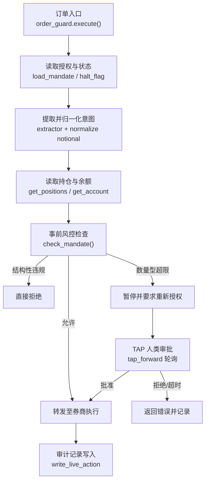
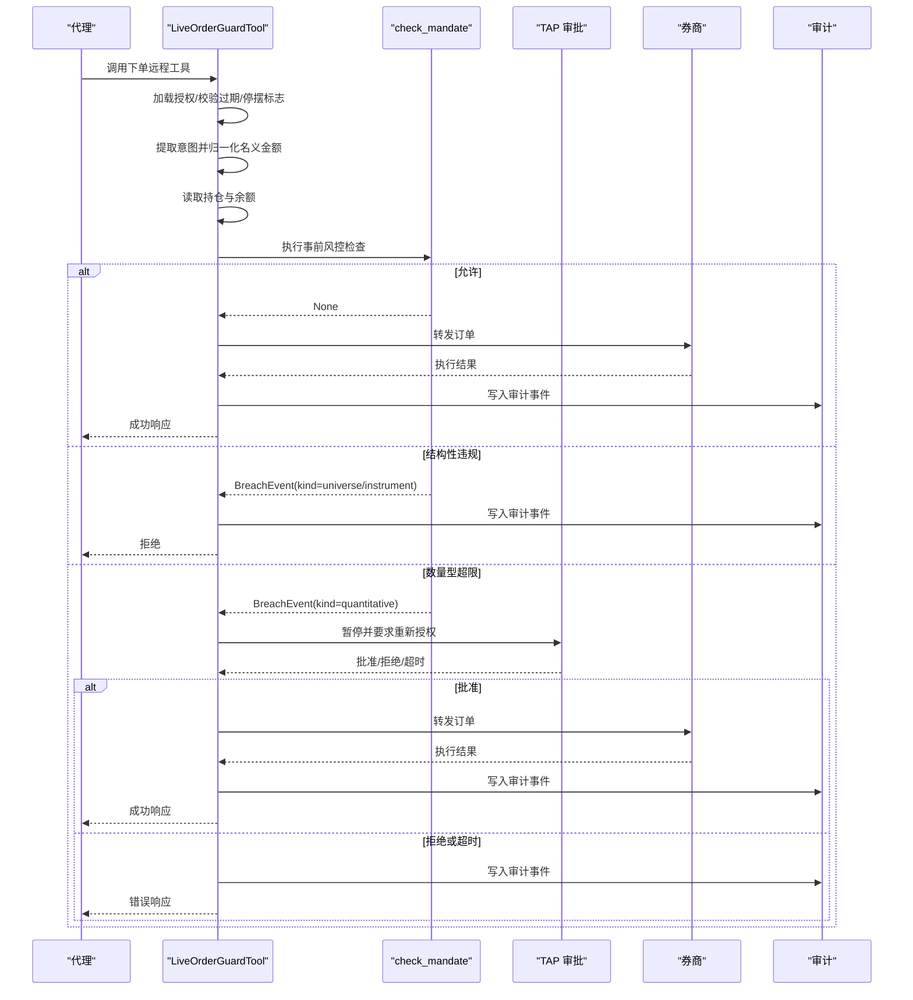
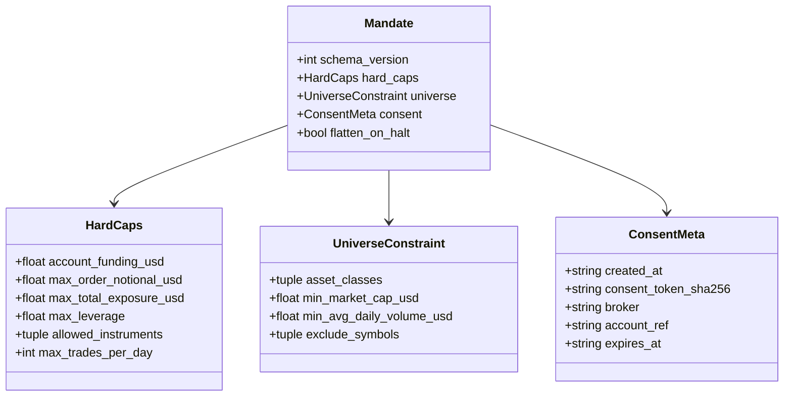
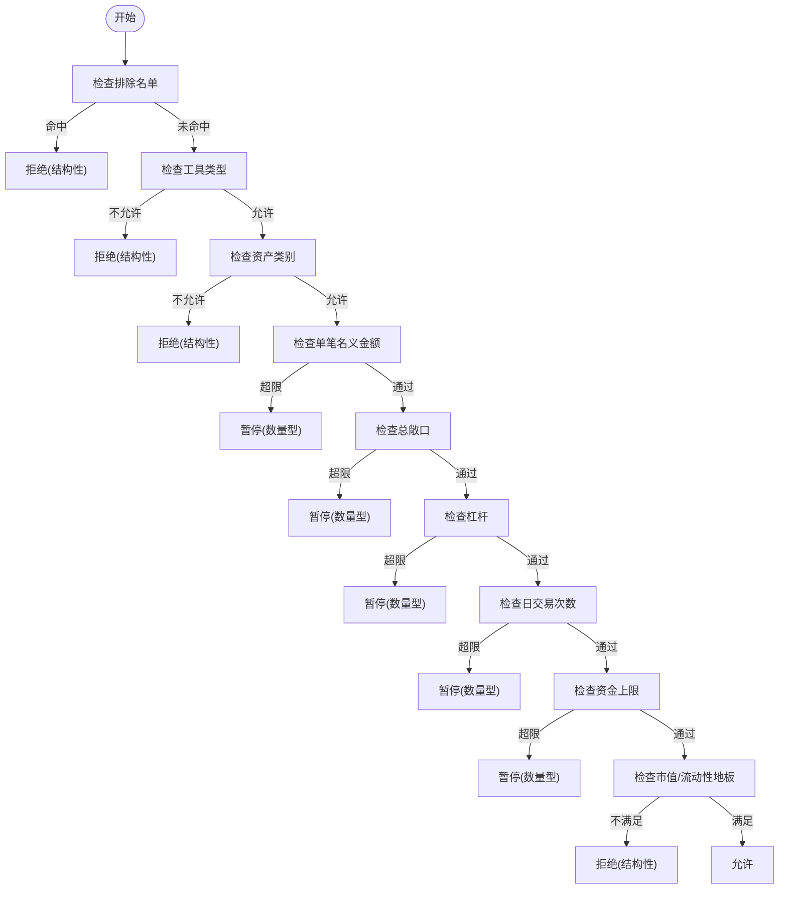
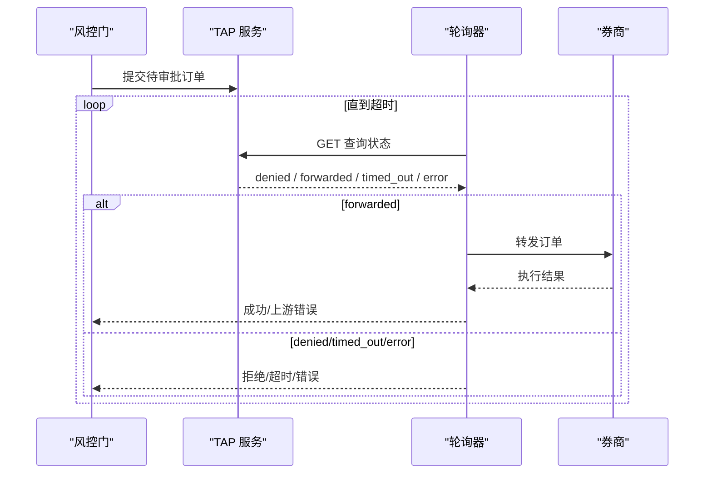
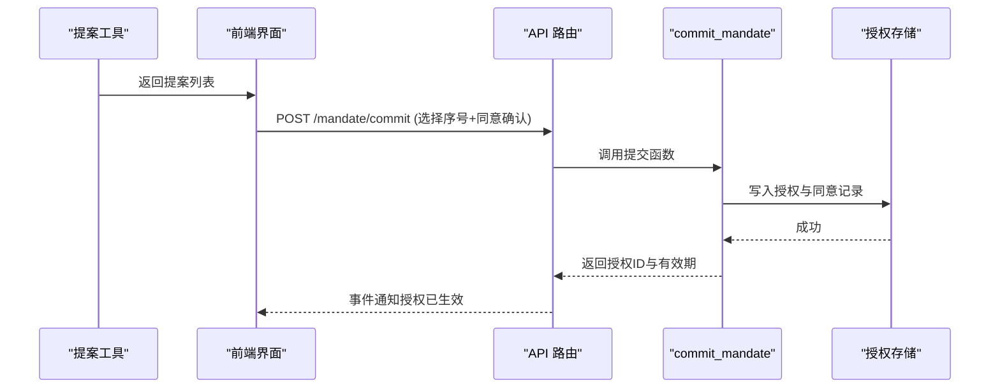
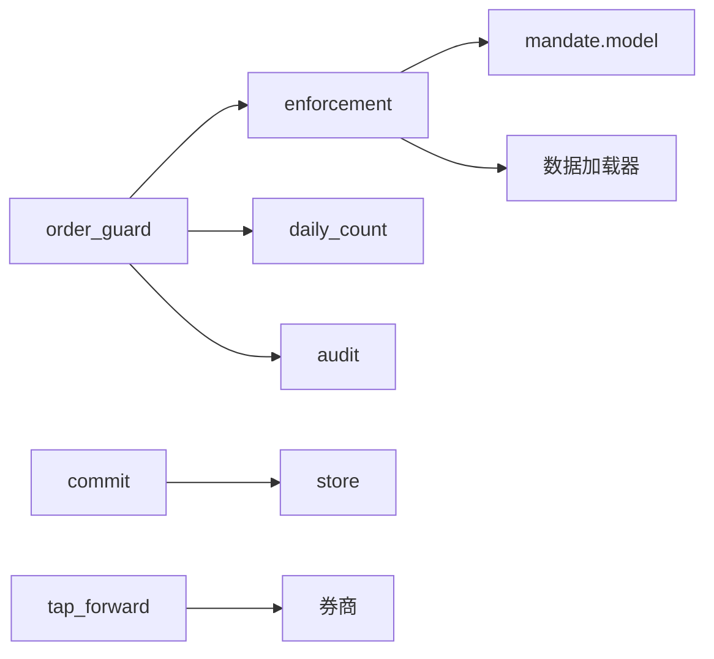

# 审批流程设计

<cite>
**本文引用的文件**
- [enforcement.py](file://agent/src/live/enforcement.py)
- [order_guard.py](file://agent/src/live/order_guard.py)
- [model.py](file://agent/src/live/mandate/model.py)
- [commit.py](file://agent/src/live/mandate/commit.py)
- [store.py](file://agent/src/live/mandate/store.py)
- [sdk_order_gate.py](file://agent/src/live/sdk_order_gate.py)
- [audit.py](file://agent/src/live/audit.py)
- [tap_forward.py](file://agent/src/trading/tap_forward.py)
- [live_routes.py](file://agent/src/api/live_routes.py)
- [propose_mandate_tool.py](file://agent/src/tools/propose_mandate_tool.py)
- [MandateProposalCard.tsx](file://frontend/src/components/chat/MandateProposalCard.tsx)
</cite>

## 目录
1. [简介](#简介)
2. [项目结构](#项目结构)
3. [核心组件](#核心组件)
4. [架构总览](#架构总览)
5. [详细组件分析](#详细组件分析)
6. [依赖关系分析](#依赖关系分析)
7. [性能与可靠性](#性能与可靠性)
8. [故障排查指南](#故障排查指南)
9. [结论](#结论)
10. [附录：配置与自定义规则](#附录：配置与自定义规则)

## 简介
本技术文档围绕“多级审批机制、条件判断逻辑、自动通过规则、超时与升级、审批配置与自定义规则”展开，基于代码库中的授权（Mandate）与事前风控（Enforcement Gate）、人类审批通道（TAP）以及前端承诺确认流进行系统化说明。系统采用“失败即关闭”的严格策略：任何不可解析或缺失数据都会拒绝交易，确保资金与风险可控。

## 项目结构
审批相关的关键模块分布在以下路径：
- 事前风控与指令归一化：enforcement.py、order_guard.py
- 授权模型与持久化：model.py、store.py、commit.py
- SDK直写与审计：sdk_order_gate.py、audit.py
- 人类审批通道（TAP）：tap_forward.py
- API与前端交互：live_routes.py、MandateProposalCard.tsx
- 提案生成工具：propose_mandate_tool.py

图表来源
- [order_guard.py:130-214](file://agent/src/live/order_guard.py#L130-L214)
- [enforcement.py:458-620](file://agent/src/live/enforcement.py#L458-L620)
- [tap_forward.py:169-188](file://agent/src/trading/tap_forward.py#L169-L188)

章节来源
- [order_guard.py:1-800](file://agent/src/live/order_guard.py#L1-L800)
- [enforcement.py:1-798](file://agent/src/live/enforcement.py#L1-L798)
- [tap_forward.py:169-188](file://agent/src/trading/tap_forward.py#L169-L188)

## 核心组件
- 授权模型（Mandate）：定义硬上限、可交易资产类别、市场范围约束、同意元数据及停摆行为。
- 事前风控（Enforcement Gate）：对每笔订单执行固定顺序的检查，包括排除名单、工具类型、资产类别、单笔名义金额、总敞口、杠杆、日交易次数、资金等。
- 人类审批通道（TAP）：在需要时暂停订单，等待人工批准；支持超时处理与上游转发竞态说明。
- 授权提交（Commit）：将用户选择的方案落盘为有效授权，绑定同意令牌与有效期。
- 审计（Audit）：对所有决策与执行结果进行不可变记录，包含授权快照引用与同意记录引用。

章节来源
- [model.py:1-149](file://agent/src/live/mandate/model.py#L1-L149)
- [enforcement.py:111-177](file://agent/src/live/enforcement.py#L111-L177)
- [order_guard.py:364-432](file://agent/src/live/order_guard.py#L364-L432)
- [commit.py:400-542](file://agent/src/live/mandate/commit.py#L400-L542)
- [audit.py:187-216](file://agent/src/live/audit.py#L187-L216)

## 架构总览
下图展示从订单到审批再到执行的完整链路，涵盖结构化拒绝、数量型暂停、TAP审批与审计事件。

图表来源
- [order_guard.py:130-214](file://agent/src/live/order_guard.py#L130-L214)
- [enforcement.py:458-620](file://agent/src/live/enforcement.py#L458-L620)
- [tap_forward.py:169-188](file://agent/src/trading/tap_forward.py#L169-L188)
- [audit.py:187-216](file://agent/src/live/audit.py#L187-L216)

## 详细组件分析

### 授权模型与权限控制
- 硬上限（HardCaps）：账户资金、单笔名义金额上限、总敞口上限、杠杆倍数、允许的工具类型、每日最大交易次数。
- 市场范围（UniverseConstraint）：允许的资产类别、市值下限、日均成交量下限、排除名单。
- 同意元数据（ConsentMeta）：创建时间、同意令牌哈希、券商、账户引用、过期时间。
- 停摆行为（flatten_on_halt）：触发停摆时是否平掉仓位（默认仅取消挂单）。

图表来源
- [model.py:46-149](file://agent/src/live/mandate/model.py#L46-L149)

章节来源
- [model.py:1-149](file://agent/src/live/mandate/model.py#L1-L149)
- [store.py:88-120](file://agent/src/live/mandate/store.py#L88-L120)

### 事前风控检查（条件判断逻辑）
检查顺序固定且“失败即关闭”，首个失败即产生裁决：
1. 排除名单优先于其他规则
2. 工具类型白名单
3. 资产类别（含多市场区分）
4. 单笔名义金额上限
5. 交易后总敞口（按符号级有向头寸计算）
6. 总杠杆（交易后总敞口/账户资金）
7. 日交易次数
8. 资金上限（防御性深度检查）
9. 市场范围地板（市值/流动性），缺失数据则拒绝

图表来源
- [enforcement.py:458-620](file://agent/src/live/enforcement.py#L458-L620)

章节来源
- [enforcement.py:111-177](file://agent/src/live/enforcement.py#L111-L177)
- [enforcement.py:458-620](file://agent/src/live/enforcement.py#L458-L620)

### 人类审批通道（TAP）与超时处理
- 当出现数量型超限时，订单进入“暂停并要求重新授权”状态。
- TAP 通过轮询获取审批状态：已转发、拒绝、超时或错误。
- 已知竞态：在超时边界恰好批准可能导致上报错误但订单已到达券商；可通过确定性 client_order_id 去重重试。

图表来源
- [tap_forward.py:169-188](file://agent/src/trading/tap_forward.py#L169-L188)

章节来源
- [tap_forward.py:169-188](file://agent/src/trading/tap_forward.py#L169-L188)

### 授权提交与生效（承诺层）
- 提案生成：只读工具生成若干候选授权方案，均被限制在账户上限内。
- 前端选择并提交：调用 commit 端点，再次验证所选方案仍符合上限快照。
- 落盘：写入 mandate.json 与同意记录，绑定同意令牌哈希与有效期（默认30天）。
- 失效：提案一次性使用，防止重放。

图表来源
- [propose_mandate_tool.py:1-25](file://agent/src/tools/propose_mandate_tool.py#L1-L25)
- [live_routes.py:652-682](file://agent/src/api/live_routes.py#L652-L682)
- [commit.py:400-542](file://agent/src/live/mandate/commit.py#L400-L542)
- [store.py:88-120](file://agent/src/live/mandate/store.py#L88-L120)
- [MandateProposalCard.tsx:190-231](file://frontend/src/components/chat/MandateProposalCard.tsx#L190-L231)

章节来源
- [propose_mandate_tool.py:1-25](file://agent/src/tools/propose_mandate_tool.py#L1-L25)
- [live_routes.py:652-682](file://agent/src/api/live_routes.py#L652-L682)
- [commit.py:400-542](file://agent/src/live/mandate/commit.py#L400-L542)
- [store.py:88-120](file://agent/src/live/mandate/store.py#L88-L120)
- [MandateProposalCard.tsx:190-231](file://frontend/src/components/chat/MandateProposalCard.tsx#L190-L231)

### SDK直写与审计
- SDK直写路径同样受风控门保护，风险降低操作跳过停摆与授权检查但仍记录审计。
- 审计事件包含授权快照引用与同意记录引用，形成可追溯的责任链。

章节来源
- [sdk_order_gate.py:138-178](file://agent/src/live/sdk_order_gate.py#L138-L178)
- [audit.py:187-216](file://agent/src/live/audit.py#L187-L216)

## 依赖关系分析
- order_guard 依赖 enforcement 进行风控决策，依赖 daily_count 进行日计数，依赖 audit 进行审计。
- enforcement 依赖 mandate model 与数据加载器（用于市值/流动性地板）。
- commit 依赖 store 与 proposal 管理，确保提案与上限一致。
- tap_forward 独立于风控门，提供人类审批通道。

图表来源
- [order_guard.py:1-800](file://agent/src/live/order_guard.py#L1-L800)
- [enforcement.py:1-798](file://agent/src/live/enforcement.py#L1-L798)
- [commit.py:400-542](file://agent/src/live/mandate/commit.py#L400-L542)
- [tap_forward.py:169-188](file://agent/src/trading/tap_forward.py#L169-L188)

章节来源
- [order_guard.py:1-800](file://agent/src/live/order_guard.py#L1-L800)
- [enforcement.py:1-798](file://agent/src/live/enforcement.py#L1-L798)
- [commit.py:400-542](file://agent/src/live/mandate/commit.py#L400-L542)
- [tap_forward.py:169-188](file://agent/src/trading/tap_forward.py#L169-L188)

## 性能与可靠性
- 所有检查“失败即关闭”，避免数据缺失导致放行。
- 仅在订单成功转发且非错误时才增加日计数，避免重复计数。
- 报价获取优先使用券商报价工具，其次回退到数据加载器，保证名义金额可定价。
- TAP 轮询存在已知竞态，需结合确定性 client_order_id 进行去重重试。

章节来源
- [order_guard.py:218-289](file://agent/src/live/order_guard.py#L218-L289)
- [order_guard.py:364-432](file://agent/src/live/order_guard.py#L364-L432)
- [tap_forward.py:169-188](file://agent/src/trading/tap_forward.py#L169-L188)

## 故障排查指南
- 无法解析订单意图：检查提取器与参数格式。
- 无法获取报价：确认券商报价工具可用或数据加载器网络正常。
- 授权过期或版本不匹配：重新提交授权。
- 停摆标志设置：检查全局停摆开关。
- 数量型超限：查看 BreachEvent 详情，调整授权或等待人类审批。
- TAP 超时：检查审批通道可用性，必要时重试并核对未成交订单。

章节来源
- [order_guard.py:130-214](file://agent/src/live/order_guard.py#L130-L214)
- [order_guard.py:514-616](file://agent/src/live/order_guard.py#L514-L616)
- [tap_forward.py:169-188](file://agent/src/trading/tap_forward.py#L169-L188)

## 结论
本审批流程以“授权模型+事前风控+人类审批+审计”为核心，确保交易在严格的安全边界内运行。通过固定顺序的风控检查、失败即关闭策略、TAP 审批通道与完善的审计记录，系统在灵活性与安全性之间取得平衡。建议在生产环境中持续监控 TAP 超时与上游竞态，并结合日计数与授权有效期进行稳健运营。

## 附录：配置与自定义规则

### 审批层级与权限控制
- 层级定义：由授权模型中的硬上限与市场范围共同决定。
- 权限控制：工具类型与资产类别白名单；排除名单优先。
- 审批人分配：数量型超限触发 TAP 人类审批；结构性违规直接拒绝。

章节来源
- [model.py:46-149](file://agent/src/live/mandate/model.py#L46-L149)
- [enforcement.py:458-620](file://agent/src/live/enforcement.py#L458-L620)
- [order_guard.py:229-231](file://agent/src/live/order_guard.py#L229-L231)

### 条件判断逻辑（金额阈值、风险等级、市场条件）
- 金额阈值：单笔名义金额、总敞口、杠杆、资金上限。
- 风险等级：结构性违规（universe/instrument）立即拒绝；数量型超限暂停并要求重新授权。
- 市场条件：市值下限与日均成交量下限，缺失数据则拒绝。

章节来源
- [enforcement.py:458-620](file://agent/src/live/enforcement.py#L458-L620)

### 自动通过规则
- 低风险交易：在授权范围内且满足市场条件时自动通过。
- 白名单策略：工具类型与资产类别白名单允许的交易。
- 历史表现良好：不在当前风控门中体现；可在策略评估与审计中作为参考。

章节来源
- [enforcement.py:458-620](file://agent/src/live/enforcement.py#L458-L620)
- [audit.py:187-216](file://agent/src/live/audit.py#L187-L216)

### 审批流程图与决策树
- 流程图：见“架构总览”中的序列图。
- 决策树：见“事前风控检查”中的流程图。

章节来源
- [order_guard.py:130-214](file://agent/src/live/order_guard.py#L130-L214)
- [enforcement.py:458-620](file://agent/src/live/enforcement.py#L458-L620)

### 超时处理与升级机制
- 超时处理：TAP 轮询在超时后返回错误；注意上游竞态。
- 升级机制：数量型超限升级为人类审批；结构性违规不升级。

章节来源
- [tap_forward.py:169-188](file://agent/src/trading/tap_forward.py#L169-L188)
- [order_guard.py:229-231](file://agent/src/live/order_guard.py#L229-L231)

### 审批配置示例与自定义规则开发指南
- 配置示例：通过提案工具生成多个授权方案，前端选择并提交；授权有效期默认30天。
- 自定义规则：扩展市场范围地板（市值/流动性）或新增量化检查；保持失败即关闭原则。

章节来源
- [propose_mandate_tool.py:1-25](file://agent/src/tools/propose_mandate_tool.py#L1-L25)
- [commit.py:400-542](file://agent/src/live/mandate/commit.py#L400-L542)
- [enforcement.py:623-679](file://agent/src/live/enforcement.py#L623-L679)