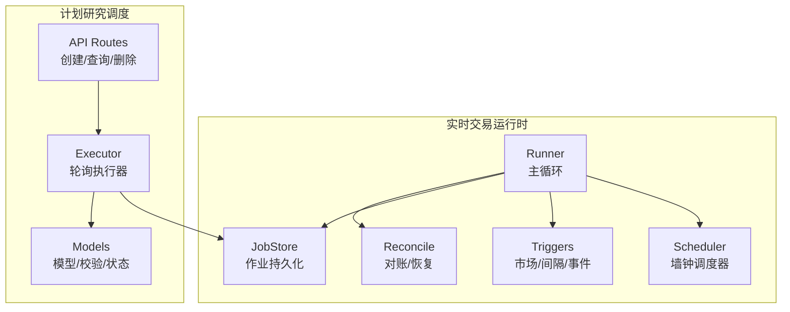
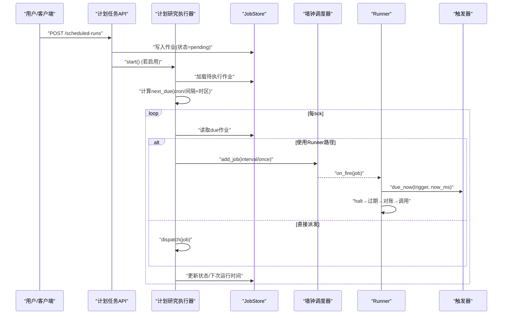
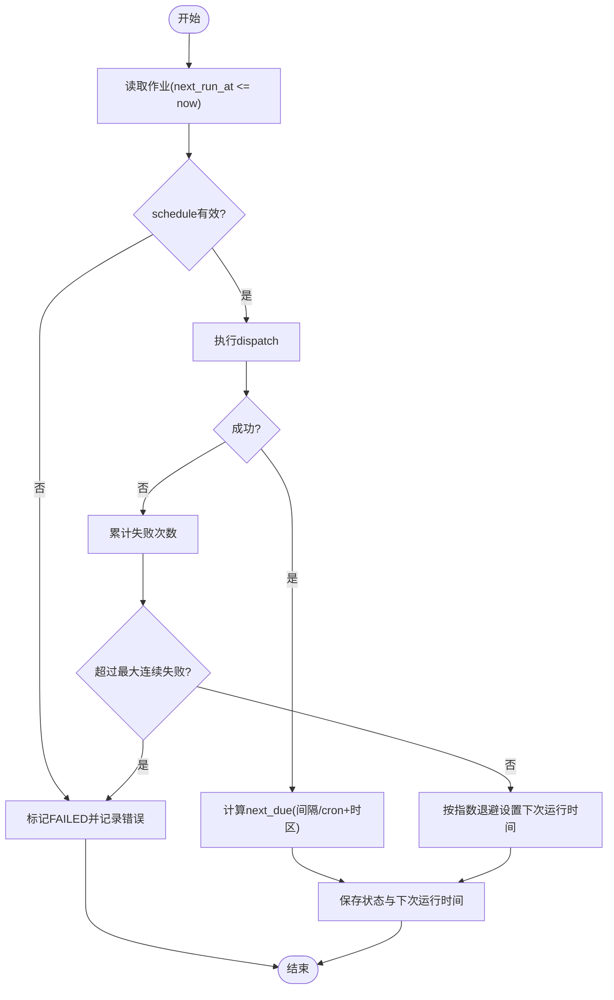
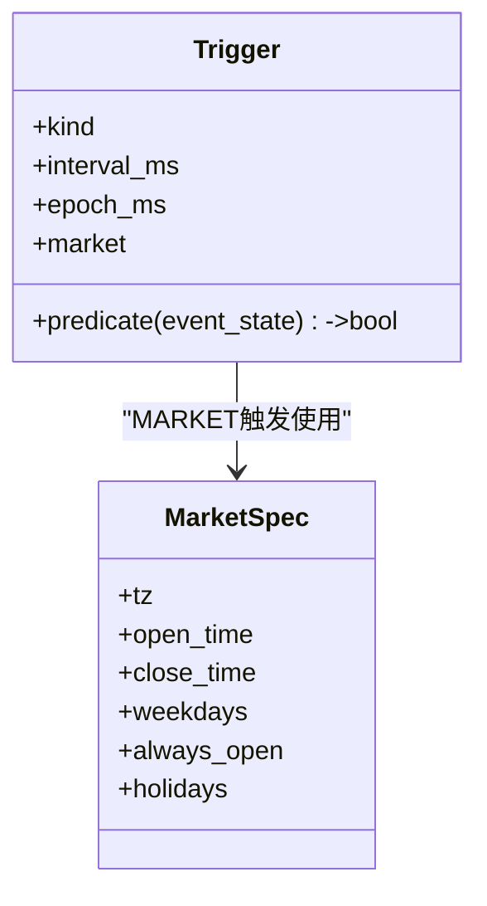
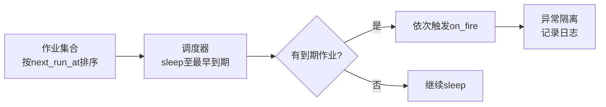
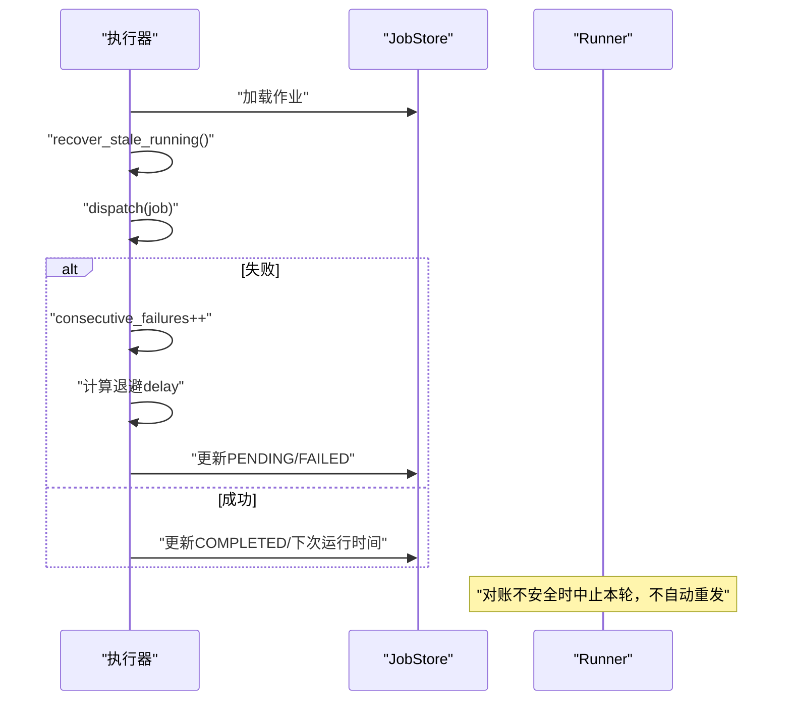
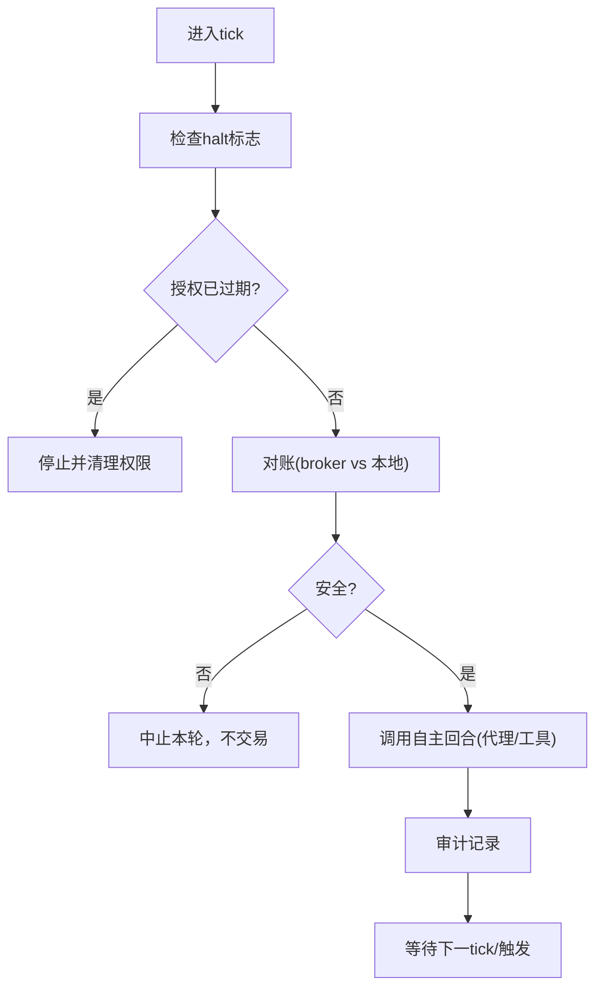
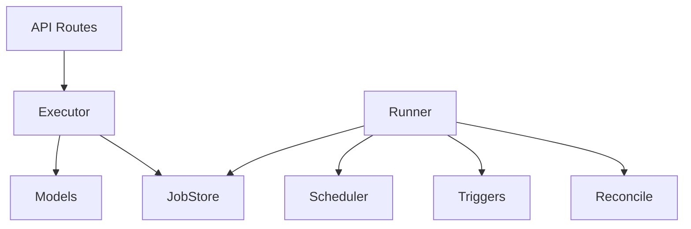

# 执行调度机制

<cite>
**本文引用的文件**
- [scheduler.py](file://agent/src/live/runtime/scheduler.py)
- [triggers.py](file://agent/src/live/runtime/triggers.py)
- [runner.py](file://agent/src/live/runtime/runner.py)
- [executor.py](file://agent/src/scheduled_research/executor.py)
- [models.py](file://agent/src/scheduled_research/models.py)
- [scheduled_routes.py](file://agent/src/api/scheduled_routes.py)
- [reconcile.py](file://agent/src/live/runtime/reconcile.py)
- [jobstore.py](file://agent/src/live/runtime/jobstore.py)
- [test_runtime_triggers.py](file://agent/tests/test_runtime_triggers.py)
</cite>

## 目录
1. [简介](#简介)
2. [项目结构](#项目结构)
3. [核心组件](#核心组件)
4. [架构总览](#架构总览)
5. [详细组件分析](#详细组件分析)
6. [依赖关系分析](#依赖关系分析)
7. [性能考量](#性能考量)
8. [故障排查指南](#故障排查指南)
9. [结论](#结论)
10. [附录](#附录)

## 简介
本技术文档系统化说明本仓库中的“执行调度机制”，覆盖以下关键能力：
- 定时执行：支持间隔调度与简化 cron（5 字段），含时区处理、重复执行、失败重试与退避。
- 事件触发：市场时段触发、固定间隔触发、外部事件触发（价格穿越、成交回报等）。
- 优先级管理：基于 next_run_at 的早到先执行；通过并发限制与信号量控制资源竞争。
- 架构图与任务流转图：提供调度器、触发器、执行器与持久化存储之间的交互视图。
- 失败重试与故障转移：连续失败计数、指数退避、陈旧 RUNNING 恢复、不可用时间带跳过。
- 配置示例与自定义触发器开发指南：给出 API 请求体结构与扩展方式。

## 项目结构
调度相关代码主要分布在 live runtime 与 scheduled research 两个子系统：
- live runtime：面向交易主循环的墙钟调度器、市场时段/事件触发器、Runner 编排与对账。
- scheduled research：面向研究/回测任务的持久化调度器，支持 cron/间隔、时区、重试与状态机。

图表来源
- [scheduler.py:178-329](file://agent/src/live/runtime/scheduler.py#L178-L329)
- [triggers.py:119-348](file://agent/src/live/runtime/triggers.py#L119-L348)
- [runner.py:1-200](file://agent/src/live/runtime/runner.py#L1-L200)
- [executor.py:160-452](file://agent/src/scheduled_research/executor.py#L160-L452)
- [models.py:177-328](file://agent/src/scheduled_research/models.py#L177-L328)
- [scheduled_routes.py:117-200](file://agent/src/api/scheduled_routes.py#L117-L200)

章节来源
- [scheduler.py:1-329](file://agent/src/live/runtime/scheduler.py#L1-L329)
- [triggers.py:1-348](file://agent/src/live/runtime/triggers.py#L1-L348)
- [runner.py:1-200](file://agent/src/live/runtime/runner.py#L1-L200)
- [executor.py:1-452](file://agent/src/scheduled_research/executor.py#L1-L452)
- [models.py:1-328](file://agent/src/scheduled_research/models.py#L1-L328)
- [scheduled_routes.py:1-200](file://agent/src/api/scheduled_routes.py#L1-L200)

## 核心组件
- 墙钟调度器（Scheduler）：以最小 sleep 唤醒策略驱动 due jobs，支持一次性与间隔重复，自动推进 next_run_at。
- 触发器（Triggers）：在 Scheduler 之上叠加市场时段、固定间隔与事件谓词三类触发条件。
- Runner：将调度与触发结合，按安全顺序执行 halt→过期检查→对账→自主回合→审计。
- 计划研究执行器（Executor）：轮询 JobStore，计算下次触发时间（cron/间隔+时区），执行并记录状态与重试。
- 模型与校验（Models）：定义作业状态机、schedule 语法校验与时区校验。
- API 路由（Scheduled Routes）：暴露创建/查询/删除计划任务的 HTTP 接口，启动/停止执行器。

章节来源
- [scheduler.py:51-176](file://agent/src/live/runtime/scheduler.py#L51-L176)
- [triggers.py:119-348](file://agent/src/live/runtime/triggers.py#L119-L348)
- [runner.py:1-200](file://agent/src/live/runtime/runner.py#L1-L200)
- [executor.py:160-452](file://agent/src/scheduled_research/executor.py#L160-L452)
- [models.py:177-328](file://agent/src/scheduled_research/models.py#L177-L328)
- [scheduled_routes.py:117-200](file://agent/src/api/scheduled_routes.py#L117-L200)

## 架构总览
下图展示从 API 创建任务到执行器轮询、调度器触发、Runner 执行与持久化的完整链路。

图表来源
- [scheduled_routes.py:117-200](file://agent/src/api/scheduled_routes.py#L117-L200)
- [executor.py:266-452](file://agent/src/scheduled_research/executor.py#L266-L452)
- [scheduler.py:178-329](file://agent/src/live/runtime/scheduler.py#L178-L329)
- [triggers.py:293-381](file://agent/src/live/runtime/triggers.py#L293-L381)
- [runner.py:1-200](file://agent/src/live/runtime/runner.py#L1-L200)

## 详细组件分析

### 定时执行：间隔与 cron、时区与重复
- 间隔调度：
  - 支持“interval:<ms>”或纯数字毫秒字符串作为 schedule。
  - 每次触发后推进 next_run_at = now + interval，保证稳定周期。
- Cron 调度：
  - 支持简化 5 字段 cron（分/时/日/月/周），范围、步长、逗号分隔均受支持。
  - 时区：当指定 IANA 时区键时，cron 在该本地日历上评估；不存在的时间点（夏令前进间隙）被跳过；重叠时间点取第一次出现。
  - 搜索窗口：为避免极端情况导致长时间扫描，采用有限天数窗口计算下一次命中。
- 重复执行：
  - 间隔型作业持续重复；一次性作业触发后移除。
  - 失败重试：连续失败计数达到阈值则标记为 FAILED；否则按指数退避重新安排下次运行。

图表来源
- [executor.py:123-193](file://agent/src/scheduled_research/executor.py#L123-L193)
- [executor.py:340-452](file://agent/src/scheduled_research/executor.py#L340-L452)
- [models.py:115-176](file://agent/src/scheduled_research/models.py#L115-L176)

章节来源
- [executor.py:123-193](file://agent/src/scheduled_research/executor.py#L123-L193)
- [executor.py:340-452](file://agent/src/scheduled_research/executor.py#L340-L452)
- [models.py:115-176](file://agent/src/scheduled_research/models.py#L115-L176)

### 事件触发机制：价格、时间与外部事件
- 市场时段触发：
  - 基于 MARKET_SPECS 判断当前市场是否开盘（包含工作日、节假日、本地交易时段）。
  - 24/7 市场（如加密货币）始终视为开盘。
- 固定间隔触发：
  - 以 epoch 为锚点，精确对齐到 interval_ms 的倍数时刻触发。
- 外部事件触发：
  - 通过 EVENT 触发器的 predicate 函数对 runner 提供的 event_state 进行判定（例如价格穿越、订单成交回报）。
  - 测试覆盖了未知市场拒绝、缺少 market/predicate 的错误路径。

图表来源
- [triggers.py:37-111](file://agent/src/live/runtime/triggers.py#L37-L111)
- [triggers.py:119-348](file://agent/src/live/runtime/triggers.py#L119-L348)

章节来源
- [triggers.py:261-381](file://agent/src/live/runtime/triggers.py#L261-L381)
- [test_runtime_triggers.py:115-227](file://agent/tests/test_runtime_triggers.py#L115-L227)

### 优先级管理与资源竞争
- 优先级：
  - 所有作业按 next_run_at 升序执行，最早到期者优先。
  - 调度器内部维护作业集合，sleep 至最近一次到期时间，确保及时响应。
- 资源竞争：
  - 对于重负载任务（如基准测试/对比），通过进程级信号量限制并发数，避免服务过载。
  - Runner 的 on_fire 异常被捕获并记录，不会中断整个调度循环。

图表来源
- [scheduler.py:100-176](file://agent/src/live/runtime/scheduler.py#L100-L176)
- [scheduler.py:313-329](file://agent/src/live/runtime/scheduler.py#L313-L329)
- [alpha_routes.py:61-95](file://agent/src/api/alpha_routes.py#L61-L95)
- [alpha_routes.py:509-621](file://agent/src/api/alpha_routes.py#L509-L621)

章节来源
- [scheduler.py:100-176](file://agent/src/live/runtime/scheduler.py#L100-L176)
- [scheduler.py:313-329](file://agent/src/live/runtime/scheduler.py#L313-L329)
- [alpha_routes.py:61-95](file://agent/src/api/alpha_routes.py#L61-L95)
- [alpha_routes.py:509-621](file://agent/src/api/alpha_routes.py#L509-L621)

### 调度失败重试与故障转移
- 失败重试：
  - 连续失败计数递增，成功则清零；达到阈值后标记 FAILED。
  - 指数退避：retry_base_delay_ms * 2^(n-1)，上限为 retry_max_delay_ms。
- 陈旧 RUNNING 恢复：
  - 启动时扫描持久化状态，将残留 RUNNING 重置为 PENDING，避免死锁。
- 不可用时区/时间：
  - 夏令前进间隙的时间点被跳过；无法解析的时区降级为 UTC 并记录告警。
- 对账与中止：
  - Runner 在对账阶段发现不安全/歧义状态时中止本轮交易，绝不自动重发变更操作。

图表来源
- [executor.py:367-389](file://agent/src/scheduled_research/executor.py#L367-L389)
- [executor.py:340-452](file://agent/src/scheduled_research/executor.py#L340-L452)
- [reconcile.py:1-18](file://agent/src/live/runtime/reconcile.py#L1-L18)

章节来源
- [executor.py:367-389](file://agent/src/scheduled_research/executor.py#L367-L389)
- [executor.py:340-452](file://agent/src/scheduled_research/executor.py#L340-L452)
- [reconcile.py:1-18](file://agent/src/live/runtime/reconcile.py#L1-L18)

### Runner 主循环与触发集成
- Runner 在每个 tick 中按固定顺序执行：halt → 授权过期检查 → 对账 → 自主回合 → 审计。
- 市场触发：Runner 以可配置的 market_watch_ms 周期唤醒，并通过 triggers.due_now 判断是否应执行。
- 持久化作业优先于触发：重启后若有持久化作业，优先恢复这些作业而非仅依赖触发。

图表来源
- [runner.py:1-200](file://agent/src/live/runtime/runner.py#L1-L200)
- [triggers.py:293-381](file://agent/src/live/runtime/triggers.py#L293-L381)

章节来源
- [runner.py:1-200](file://agent/src/live/runtime/runner.py#L1-L200)

## 依赖关系分析
- 模块耦合：
  - Runner 依赖 Scheduler、Triggers、JobStore、Reconcile，形成稳定的分层。
  - Scheduled Research Executor 依赖 Models（校验）、JobStore（持久化）与外部 dispatch（会话/工具）。
  - API Routes 负责装配 Store 与 Executor，并提供生命周期启停。
- 外部依赖：
  - 时区使用标准库 zoneinfo；无第三方 cron 库，内置轻量解析与校验。
  - 并发控制使用 asyncio.Semaphore 限制重负载任务并行度。

图表来源
- [scheduled_routes.py:84-110](file://agent/src/api/scheduled_routes.py#L84-L110)
- [executor.py:160-224](file://agent/src/scheduled_research/executor.py#L160-L224)
- [runner.py:86-132](file://agent/src/live/runtime/runner.py#L86-L132)

章节来源
- [scheduled_routes.py:84-110](file://agent/src/api/scheduled_routes.py#L84-L110)
- [executor.py:160-224](file://agent/src/scheduled_research/executor.py#L160-L224)
- [runner.py:86-132](file://agent/src/live/runtime/runner.py#L86-L132)

## 性能考量
- 调度器睡眠上限：即使下一个作业很远，也会定期唤醒（默认 5 分钟），防御时钟跳变与挂起恢复漂移。
- 批量 due 作业：按 next_run_at 排序后逐个触发，单个作业异常不影响其他作业。
- 并发限制：对重负载任务使用信号量限制并发，防止 CPU/内存耗尽。
- 时区计算：cron 评估采用有限天数窗口，避免极端情况下长时间扫描。

[本节为通用指导，无需特定文件引用]

## 故障排查指南
- 常见错误与定位：
  - 未知市场：Triggers 会抛出 ValueError，检查 MARKET_SPECS 是否包含该市场键。
  - 缺少必要字段：EVENT 触发器需 predicate，MARKET 触发器需 market。
  - 无效 schedule：Models 校验会在创建或执行前拒绝非法 cron/间隔。
  - 时区不可解析：降级为 UTC 并记录告警；检查系统时区数据库。
- 重试与失败：
  - 查看作业的 consecutive_failures、failure_kind、last_error 字段，定位失败原因。
  - 调整 retry_base_delay_ms 与 retry_max_delay_ms 以平衡重试频率与资源占用。
- 对账与安全：
  - 若对账报告标记不安全/歧义，Runner 会中止本轮；检查 broker 状态与本地持久化一致性。

章节来源
- [triggers.py:261-381](file://agent/src/live/runtime/triggers.py#L261-L381)
- [models.py:115-176](file://agent/src/scheduled_research/models.py#L115-L176)
- [executor.py:340-452](file://agent/src/scheduled_research/executor.py#L340-L452)
- [reconcile.py:1-18](file://agent/src/live/runtime/reconcile.py#L1-L18)

## 结论
本调度机制通过“墙钟调度器 + 触发器层 + 执行器 + 持久化”的分层设计，实现了：
- 可靠的定时执行（间隔与 cron），具备时区感知与重复执行能力。
- 灵活的事件触发（市场时段、固定间隔、外部事件谓词）。
- 明确的优先级与资源保护（按到期时间执行、并发限制）。
- 健壮的重试与故障恢复（指数退避、陈旧 RUNNING 恢复、对账中止）。
- 易用的 API 与可扩展的触发器体系，便于二次开发与定制。

[本节为总结性内容，无需特定文件引用]

## 附录

### 调度配置示例（HTTP）
- 创建计划任务（POST /scheduled-runs）
  - 字段说明：
    - id：可选，作业标识（字母、数字、下划线、短横线，1-128 字符）。
    - prompt：研究提示或回测描述。
    - schedule：间隔毫秒字符串或 5 字段 cron。
    - next_run_at：可选，下次运行时间（epoch 毫秒），默认当前时间。
    - config：可选，回测参数等。
    - timezone：可选，IANA 时区键；cron 生效，间隔忽略。
  - 参考模型定义：
    - [CreateScheduledRunRequest:117-148](file://agent/src/api/scheduled_routes.py#L117-L148)

- 从模板创建（POST /scheduled-runs/playbooks/{slug}）
  - 字段说明：
    - schedule：可选，覆盖模板建议的调度。
    - timezone：可选，覆盖模板建议的时区。
    - variables：可选，覆盖模板变量。
  - 参考模型定义：
    - [CreateRunFromPlaybookRequest:253-284](file://agent/src/api/scheduled_routes.py#L253-L284)

章节来源
- [scheduled_routes.py:117-200](file://agent/src/api/scheduled_routes.py#L117-L200)

### 自定义触发器开发指南
- 新增市场时段：
  - 在 MARKET_SPECS 中添加新市场条目，指定 tz、open_time、close_time、weekdays、holidays 或 always_open。
  - 参考：
    - [MARKET_SPECS:97-111](file://agent/src/live/runtime/triggers.py#L97-L111)
- 新增事件触发：
  - 使用 Trigger.event(predicate) 构造 EVENT 触发器，predicate 接收 event_state 并返回布尔值。
  - 参考：
    - [Trigger.event:199-210](file://agent/src/live/runtime/triggers.py#L199-L210)
    - [due_now 对 EVENT 的处理:328-331](file://agent/src/live/runtime/triggers.py#L328-L331)
- 测试建议：
  - 验证边界条件（如区间对齐、市场关闭、未知市场拒绝、缺少字段报错）。
  - 参考：
    - [test_runtime_triggers:115-227](file://agent/tests/test_runtime_triggers.py#L115-L227)

章节来源
- [triggers.py:97-111](file://agent/src/live/runtime/triggers.py#L97-L111)
- [triggers.py:199-210](file://agent/src/live/runtime/triggers.py#L199-L210)
- [triggers.py:328-331](file://agent/src/live/runtime/triggers.py#L328-L331)
- [test_runtime_triggers.py:115-227](file://agent/tests/test_runtime_triggers.py#L115-L227)