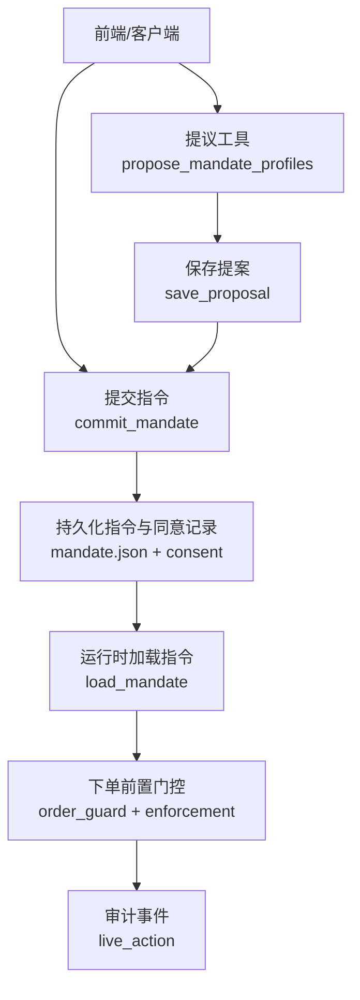
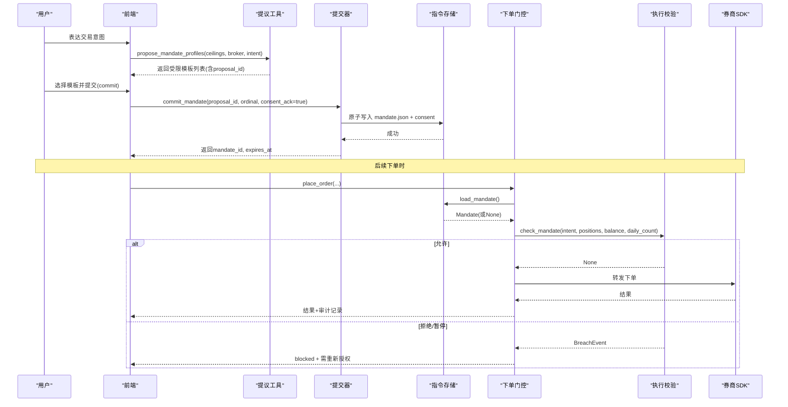
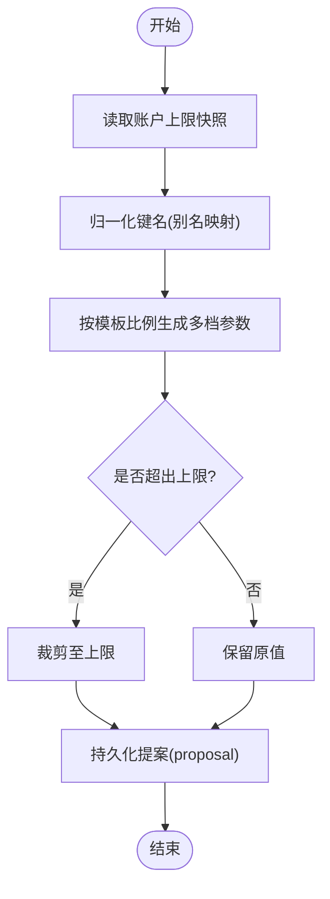
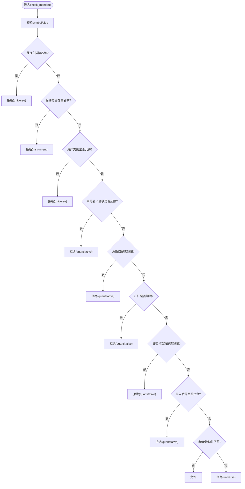
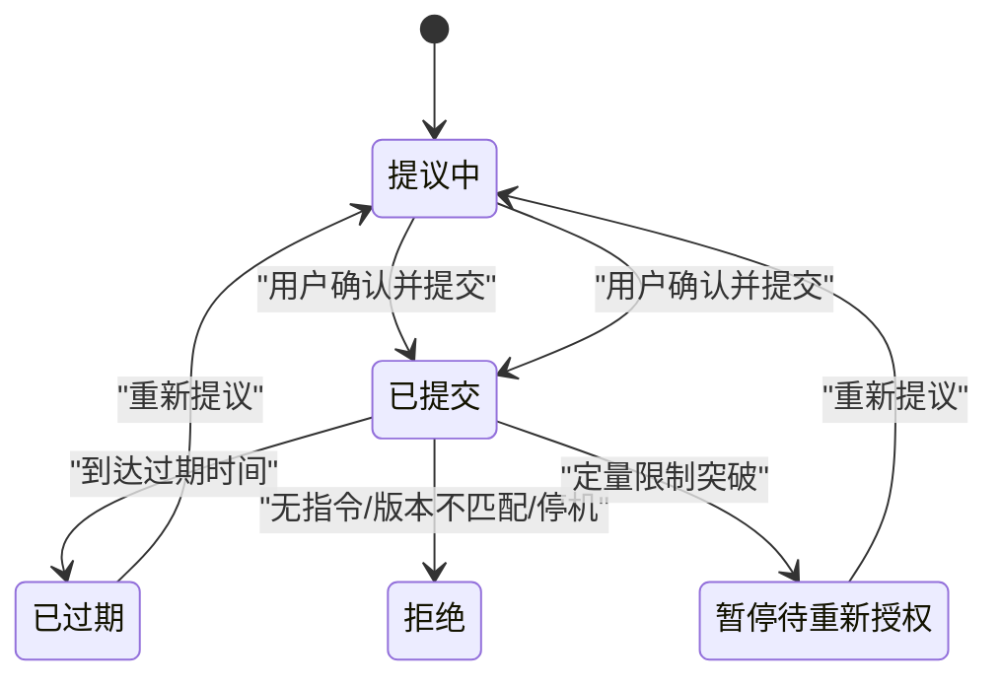
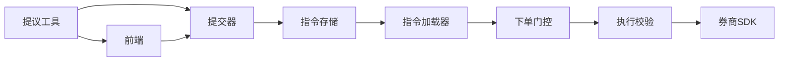

# 指令创建流程

<cite>
**本文引用的文件**
- [agent/src/live/mandate/model.py](file://agent/src/live/mandate/model.py)
- [agent/src/live/mandate/store.py](file://agent/src/live/mandate/store.py)
- [agent/src/live/mandate/commit.py](file://agent/src/live/mandate/commit.py)
- [agent/src/tools/propose_mandate_tool.py](file://agent/src/tools/propose_mandate_tool.py)
- [agent/src/live/enforcement.py](file://agent/src/live/enforcement.py)
- [agent/src/live/order_guard.py](file://agent/src/live/order_guard.py)
- [agent/src/live/sdk_order_gate.py](file://agent/src/live/sdk_order_gate.py)
- [frontend/src/components/chat/MandateProposalCard.tsx](file://frontend/src/components/chat/MandateProposalCard.tsx)
</cite>

## 目录
1. [简介](#简介)
2. [项目结构](#项目结构)
3. [核心组件](#核心组件)
4. [架构总览](#架构总览)
5. [详细组件分析](#详细组件分析)
6. [依赖关系分析](#依赖关系分析)
7. [性能考量](#性能考量)
8. [故障排查指南](#故障排查指南)
9. [结论](#结论)
10. [附录](#附录)

## 简介
本技术文档聚焦“指令创建”的完整生命周期，覆盖从模板选择、参数填充与默认值设置、初始验证规则（数据格式、业务规则、安全限制），到指令生效后的执行门控、错误处理与回滚机制。文档同时给出状态转换图、时序图与流程图，帮助读者理解不同券商场景下的适配逻辑与一致性保障。

## 项目结构
指令创建涉及“提议—提交—存储—读取—执行门控—审计”的全链路：
- 提议阶段：生成受账户上限约束的多套指令模板（profile），持久化为提案（proposal）。
- 提交阶段：用户确认后，将选定模板落盘为不可变指令（mandate），并写入同意记录。
- 读取阶段：运行时只读加载指令，校验版本与有效期。
- 执行阶段：每笔订单在下单前通过强制门控检查（排除名单、品种、资产类别、单笔名义金额、总敞口、杠杆、日交易次数、资金等）。
- 审计与告警：所有决策均写审计事件；可选顾问层提供风险提示但不阻断。

**图表来源**
- [agent/src/tools/propose_mandate_tool.py:103-170](file://agent/src/tools/propose_mandate_tool.py#L103-L170)
- [agent/src/live/mandate/commit.py:400-542](file://agent/src/live/mandate/commit.py#L400-L542)
- [agent/src/live/mandate/store.py:42-70](file://agent/src/live/mandate/store.py#L42-L70)
- [agent/src/live/order_guard.py:130-214](file://agent/src/live/order_guard.py#L130-L214)
- [agent/src/live/enforcement.py:458-620](file://agent/src/live/enforcement.py#L458-L620)

**章节来源**
- [agent/src/tools/propose_mandate_tool.py:103-170](file://agent/src/tools/propose_mandate_tool.py#L103-L170)
- [agent/src/live/mandate/commit.py:400-542](file://agent/src/live/mandate/commit.py#L400-L542)
- [agent/src/live/mandate/store.py:42-70](file://agent/src/live/mandate/store.py#L42-L70)
- [agent/src/live/order_guard.py:130-214](file://agent/src/live/order_guard.py#L130-L214)
- [agent/src/live/enforcement.py:458-620](file://agent/src/live/enforcement.py#L458-L620)

## 核心组件
- 指令模型：不可变的数据类集合，定义硬上限、可交易范围、同意元数据等。
- 提议工具：基于账户上限生成多套受限模板，持久化提案供后续提交。
- 提交器：唯一能激活交易权限的路径，严格重校验模板是否仍符合上限，原子落盘指令与同意记录。
- 指令加载器：只读加载指令，失败即关闭（fail-closed）。
- 执行门控：每笔订单前置校验，拒绝或暂停并要求重新授权。
- SDK 订单门控：对无有效指令或过期指令直接拒绝，并支持回退路径。

**章节来源**
- [agent/src/live/mandate/model.py:1-149](file://agent/src/live/mandate/model.py#L1-L149)
- [agent/src/tools/propose_mandate_tool.py:27-246](file://agent/src/tools/propose_mandate_tool.py#L27-L246)
- [agent/src/live/mandate/commit.py:1-502](file://agent/src/live/mandate/commit.py#L1-L502)
- [agent/src/live/mandate/store.py:1-133](file://agent/src/live/mandate/store.py#L1-L133)
- [agent/src/live/order_guard.py:1-831](file://agent/src/live/order_guard.py#L1-L831)
- [agent/src/live/sdk_order_gate.py:71-102](file://agent/src/live/sdk_order_gate.py#L71-L102)

## 架构总览
指令创建与执行的关键交互如下：

**图表来源**
- [agent/src/tools/propose_mandate_tool.py:103-170](file://agent/src/tools/propose_mandate_tool.py#L103-L170)
- [agent/src/live/mandate/commit.py:400-542](file://agent/src/live/mandate/commit.py#L400-L542)
- [agent/src/live/mandate/store.py:42-70](file://agent/src/live/mandate/store.py#L42-L70)
- [agent/src/live/order_guard.py:130-214](file://agent/src/live/order_guard.py#L130-L214)
- [agent/src/live/enforcement.py:458-620](file://agent/src/live/enforcement.py#L458-L620)

## 详细组件分析

### 指令模型与数据结构
- 硬上限（HardCaps）：账户资金、单笔名义金额上限、总敞口上限、杠杆上限、允许品种、每日交易次数。
- 宇宙约束（UniverseConstraint）：资产类别、最小市值、日均成交额下限、排除符号。
- 同意元数据（ConsentMeta）：创建时间、同意令牌哈希、券商、账户引用、过期时间。
- 指令（Mandate）：包含上述三部分及“停机时是否平仓”的策略位。

这些结构均为不可变数据类，确保指令一旦写入即不可被代理篡改。

**章节来源**
- [agent/src/live/mandate/model.py:46-149](file://agent/src/live/mandate/model.py#L46-L149)

### 模板选择机制（不同券商的适配）
- 模板由提议工具根据传入的“账户上限快照”生成，固定输出稳健/均衡/激进等多档，每档都按上限进行裁剪，保证任何选项都不会超过券商允许的硬上限。
- 模板字段包括：单笔名义金额、每日交易次数、杠杆、允许品种、宇宙范围、停机行为等。
- 模板差异点：
  - 券商账户类型：根据是否允许杠杆标记为现金或保证金账户。
  - 宇宙范围：不同券商支持的资产类别不同，模板会映射到对应类别。
  - 默认值：未显式设置的字段采用保守默认（如杠杆=none，停机不自动平仓）。
- 适配逻辑：
  - 通过统一的上限键别名归一化比较，避免拼写差异导致越权。
  - 提交时再次校验所选模板仍满足当时上限快照，防止“提交流程后上限变化”带来的风险。

**图表来源**
- [agent/src/tools/propose_mandate_tool.py:172-239](file://agent/src/tools/propose_mandate_tool.py#L172-L239)
- [agent/src/live/mandate/commit.py:112-136](file://agent/src/live/mandate/commit.py#L112-L136)

**章节来源**
- [agent/src/tools/propose_mandate_tool.py:27-246](file://agent/src/tools/propose_mandate_tool.py#L27-L246)
- [agent/src/live/mandate/commit.py:112-136](file://agent/src/live/mandate/commit.py#L112-L136)

### 参数填充过程（必填、可选、默认值）
- 必填字段：
  - 提议：broker、ceilings。
  - 提交：consent_ack必须为真；proposal_id、ordinal来自用户选择。
- 可选字段：
  - adjustments：仅允许收窄限额，不允许放宽。
  - flatten_on_halt：默认false（取消挂单），可显式开启“停机时自动平仓”。
- 默认值设置：
  - 杠杆默认none（现金交易）。
  - 允许品种默认包含权益类。
  - 宇宙资产类别默认美股权益。
  - 指令过期时间默认创建时间+30天。
- 数据校验：
  - 提案ID格式校验、路径防穿越。
  - 提交时重校验模板仍在上限内。
  - 指令文件以原子方式写入，权限收紧。

**章节来源**
- [agent/src/tools/propose_mandate_tool.py:55-99](file://agent/src/tools/propose_mandate_tool.py#L55-L99)
- [agent/src/live/mandate/commit.py:167-199](file://agent/src/live/mandate/commit.py#L167-L199)
- [agent/src/live/mandate/commit.py:231-310](file://agent/src/live/mandate/commit.py#L231-L310)
- [agent/src/live/mandate/commit.py:400-542](file://agent/src/live/mandate/commit.py#L400-L542)

### 初始验证规则（数据格式、业务规则、安全限制）
- 数据格式检查：
  - JSON解析严格，缺失或类型错误直接拒绝。
  - 枚举值（品种、资产类别）必须合法。
- 业务规则验证：
  - 排除名单优先于其他规则。
  - 品种白名单、资产类别白名单。
  - 单笔名义金额、总敞口、杠杆、日交易次数、资金上限。
  - 市场容量与流动性下限（若配置）。
- 安全限制：
  - 指令不可被代理修改；唯一写入路径在API层。
  - 过期指令立即失效。
  - 停机标志触发则拒绝所有下单。
  - 审计事件记录每次决策。

**图表来源**
- [agent/src/live/enforcement.py:458-620](file://agent/src/live/enforcement.py#L458-L620)

**章节来源**
- [agent/src/live/enforcement.py:458-620](file://agent/src/live/enforcement.py#L458-L620)

### 指令创建的生命周期与状态转换
- 状态：
  - 提议中（proposal persisted）
  - 已提交（mandate committed）
  - 已过期（expired）
  - 已拒绝（denied by gate）
  - 暂停待重新授权（pause_for_reauth）
- 转换：
  - 提议 → 提交：用户确认并调用提交接口。
  - 提交 → 已过期：到达expires_at。
  - 提交 → 拒绝：无有效指令、版本不匹配、停机标志。
  - 提交 → 暂停：定量限制突破，需要重新授权。
  - 暂停 → 提交：重新提议并提交新模板。

**图表来源**
- [agent/src/live/mandate/commit.py:400-542](file://agent/src/live/mandate/commit.py#L400-L542)
- [agent/src/live/order_guard.py:130-214](file://agent/src/live/order_guard.py#L130-L214)
- [agent/src/live/enforcement.py:458-620](file://agent/src/live/enforcement.py#L458-L620)

### 错误处理与回滚机制
- 原子写入：指令与同意记录使用临时文件+替换的方式写入，权限收紧，避免部分写入导致的损坏。
- 幂等性：提案ID一次性使用，提交后立即失效，防止重复提交。
- 失败关闭：任何解析失败、数据不可用、网络异常均拒绝订单，不放行。
- 审计与可观测：每个决策写审计事件，嵌入返回结果以便SSE广播。
- 回滚策略：
  - 提交失败：若无同意记录写入，指令不会生效；若指令写入但同意记录失败，存在孤儿记录便于诊断重试。
  - 下单失败：若券商返回错误信封，不消耗日计数，审计记录为rejected/error。
  - 停机：全局或券商级停机标志触发，拒绝所有下单。

**章节来源**
- [agent/src/live/mandate/commit.py:167-199](file://agent/src/live/mandate/commit.py#L167-L199)
- [agent/src/live/mandate/commit.py:520-527](file://agent/src/live/mandate/commit.py#L520-L527)
- [agent/src/live/order_guard.py:364-432](file://agent/src/live/order_guard.py#L364-L432)
- [agent/src/live/order_guard.py:514-616](file://agent/src/live/order_guard.py#L514-L616)

### 完整的指令创建代码示例与最佳实践
- 前端提交示例（调用提交接口）：
  - 参考前端组件中的handleCommit函数，传递broker、proposal_id、selected_ordinal、consent_ack=true、session_id。
- 后端提交入口：
  - 调用commit_mandate，传入proposal_id、ordinal、adjustments（可选）、consent_ack、broker、account_ref、session_id、ceilings_ref（可选）、lifetime_days（默认30）、flatten_on_halt（可选）。
- 最佳实践：
  - 始终使用上限快照进行模板生成与提交重校验。
  - 保持adjustments仅收窄限额，禁止放宽。
  - 明确设置flatten_on_halt以控制停机时的行为。
  - 审计事件用于问题定位与合规追踪。

**章节来源**
- [frontend/src/components/chat/MandateProposalCard.tsx:203-231](file://frontend/src/components/chat/MandateProposalCard.tsx#L203-L231)
- [agent/src/live/mandate/commit.py:400-542](file://agent/src/live/mandate/commit.py#L400-L542)

## 依赖关系分析
- 模块耦合：
  - 提议工具依赖上限快照与别名归一化。
  - 提交器依赖提议持久化、上限快照、原子写入。
  - 指令加载器依赖模型与路径解析。
  - 执行门控依赖指令加载、执行校验、审计、日计数锁。
  - SDK订单门控在无指令或过期时直接拒绝。
- 外部依赖：
  - 数据加载器用于市值与流动性校验。
  - 券商SDK用于实际下单与报价读取。

**图表来源**
- [agent/src/tools/propose_mandate_tool.py:103-170](file://agent/src/tools/propose_mandate_tool.py#L103-L170)
- [agent/src/live/mandate/commit.py:400-542](file://agent/src/live/mandate/commit.py#L400-L542)
- [agent/src/live/mandate/store.py:42-70](file://agent/src/live/mandate/store.py#L42-L70)
- [agent/src/live/order_guard.py:130-214](file://agent/src/live/order_guard.py#L130-L214)
- [agent/src/live/enforcement.py:458-620](file://agent/src/live/enforcement.py#L458-L620)

**章节来源**
- [agent/src/tools/propose_mandate_tool.py:103-170](file://agent/src/tools/propose_mandate_tool.py#L103-L170)
- [agent/src/live/mandate/commit.py:400-542](file://agent/src/live/mandate/commit.py#L400-L542)
- [agent/src/live/mandate/store.py:42-70](file://agent/src/live/mandate/store.py#L42-L70)
- [agent/src/live/order_guard.py:130-214](file://agent/src/live/order_guard.py#L130-L214)
- [agent/src/live/enforcement.py:458-620](file://agent/src/live/enforcement.py#L458-L620)

## 性能考量
- 报价获取：优先使用券商报价工具，失败时回退到数据加载器，减少网络开销。
- 原子写入：使用临时文件+替换，降低并发写入竞争。
- 日计数锁：避免重复计数与竞态条件。
- 审计写入：失败不阻塞主流程，仅记录日志。

[本节为通用指导，无需特定文件来源]

## 故障排查指南
- 常见错误：
  - 无有效指令：检查是否存在mandate.json且schema_version匹配。
  - 指令过期：检查expires_at是否已过。
  - 停机标志：检查全局或券商级停机状态。
  - 意图解析失败：检查提取器是否支持该远程工具。
  - 报价不可用：检查券商报价工具或数据加载器可用性。
  - 定量限制突破：查看BreachEvent详情，调整模板或重新授权。
- 排查步骤：
  - 查看审计事件中的gate_decision与breach信息。
  - 检查提案与提交记录是否一致。
  - 确认上限快照与模板字段归一化一致。

**章节来源**
- [agent/src/live/order_guard.py:130-214](file://agent/src/live/order_guard.py#L130-L214)
- [agent/src/live/order_guard.py:514-616](file://agent/src/live/order_guard.py#L514-L616)
- [agent/src/live/enforcement.py:458-620](file://agent/src/live/enforcement.py#L458-L620)

## 结论
指令创建流程通过“提议—提交—存储—读取—执行门控—审计”的闭环设计，实现了强安全与强一致性的交易授权。模板选择与参数填充严格受限于账户上限，初始验证规则覆盖数据格式、业务规则与安全限制，生命周期清晰且具备完善的错误处理与回滚机制。建议在扩展新券商时，遵循统一的别名归一化与上限校验策略，确保跨平台一致性。

[本节为总结，无需特定文件来源]

## 附录
- 关键常量与版本：
  - MANDATE_SCHEMA_VERSION：指令模式版本，不匹配则拒绝。
  - DEFAULT_MANDATE_LIFETIME_DAYS：默认30天有效期。
- 关键字段说明：
  - flatten_on_halt：停机时是否自动平仓（默认false）。
  - consent_token_sha256：绑定人类同意的令牌哈希。

**章节来源**
- [agent/src/live/mandate/model.py:14-149](file://agent/src/live/mandate/model.py#L14-L149)
- [agent/src/live/mandate/commit.py:44-46](file://agent/src/live/mandate/commit.py#L44-L46)