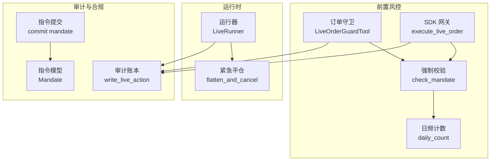
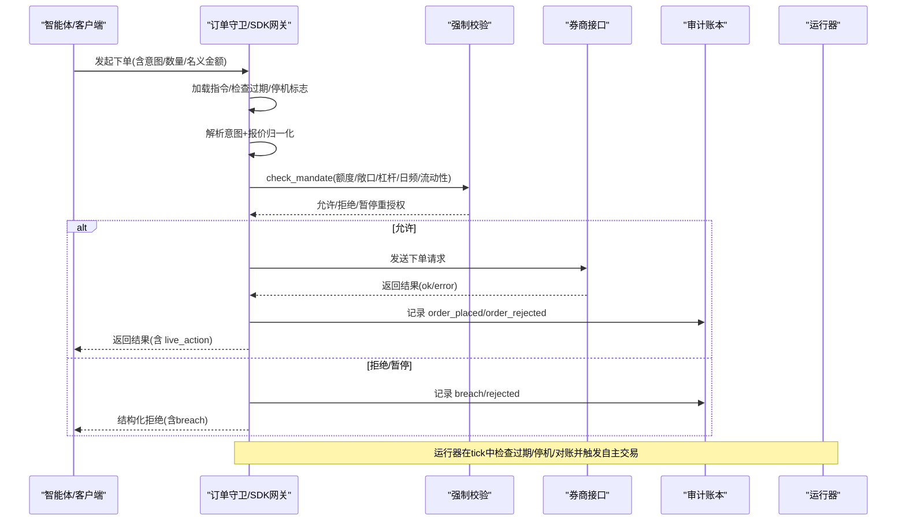
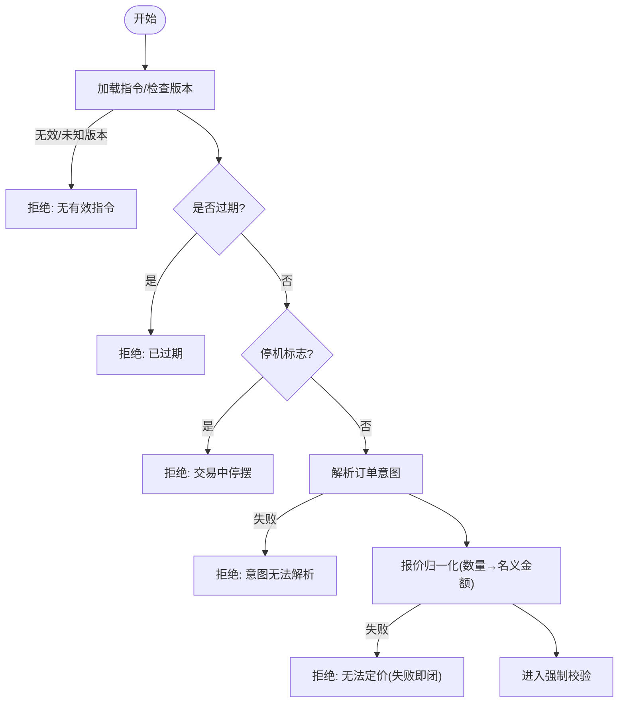
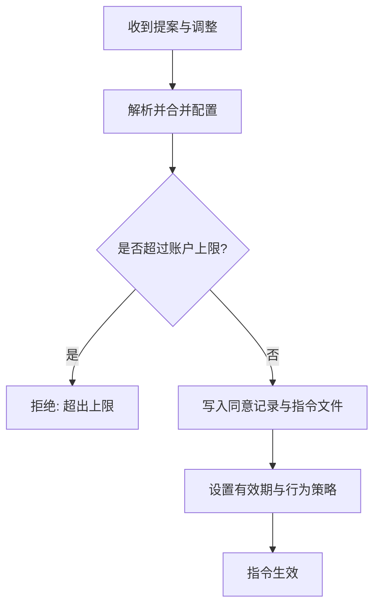
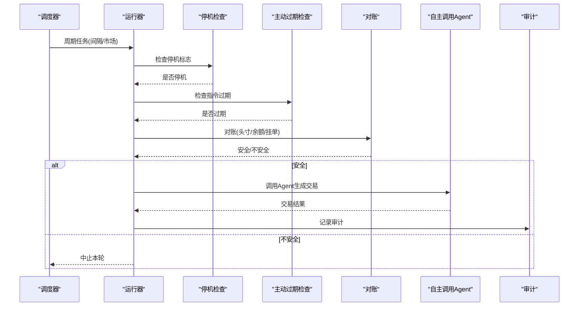
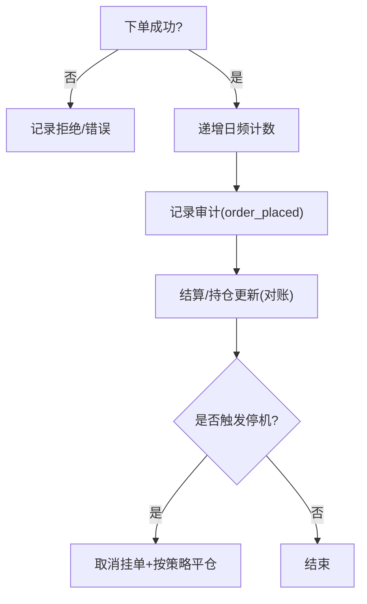
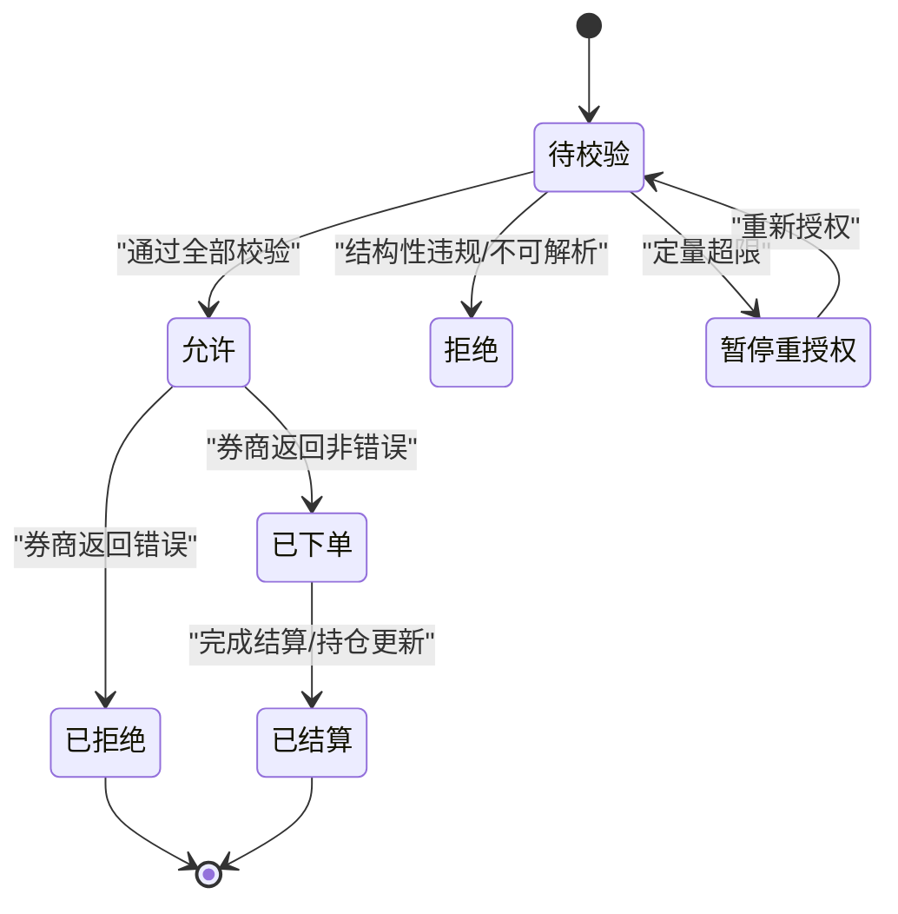
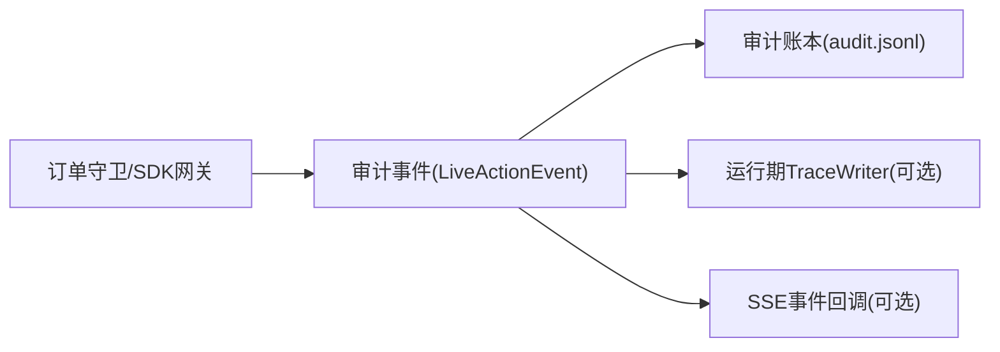
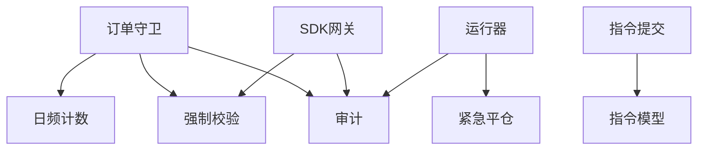

# 指令生命周期管理

<cite>
**本文引用的文件**
- [enforcement.py](file://agent/src/live/enforcement.py)
- [order_guard.py](file://agent/src/live/order_guard.py)
- [sdk_order_gate.py](file://agent/src/live/sdk_order_gate.py)
- [audit.py](file://agent/src/live/audit.py)
- [daily_count.py](file://agent/src/live/daily_count.py)
- [runner.py](file://agent/src/live/runtime/runner.py)
- [flatten.py](file://agent/src/live/runtime/flatten.py)
- [commit.py](file://agent/src/live/mandate/commit.py)
- [model.py](file://agent/src/live/mandate/model.py)
- [store.py](file://agent/src/live/mandate/store.py)
</cite>

## 目录
1. [简介](#简介)
2. [项目结构](#项目结构)
3. [核心组件](#核心组件)
4. [架构总览](#架构总览)
5. [详细组件分析](#详细组件分析)
6. [依赖关系分析](#依赖关系分析)
7. [性能考虑](#性能考虑)
8. [故障排查指南](#故障排查指南)
9. [结论](#结论)
10. [附录](#附录)

## 简介
本技术文档围绕“指令生命周期管理”展开，覆盖从指令创建、审批与授权、执行调度到确认结算的全链路。重点包括：
- 指令创建：模板选择、参数填充、初始校验（失败即闭）
- 审批流程：多级审批、条件判断、自动通过
- 执行调度：定时执行、事件触发、优先级管理
- 确认与结算：成交回报、资金清算、持仓更新
- 状态机与转换规则
- 查询与追踪：审计账本、可追溯性
- 批量处理与异常处理机制

## 项目结构
系统以“指令前置风控 + 运行时调度 + 审计追踪”为核心分层组织：
- 前置风控层：订单意图标准化、额度与范围校验、报价归一化、日频计数
- 运行时层：持久化运行循环、市场事件驱动、主动过期检查、紧急平仓
- 审计与合规：不可变审计账本、哈希链防篡改、SSE 实时推送
- 授权与指令集：指令提案、审批提交、有效期与冻结策略

**图表来源**
- [order_guard.py:130-214](file://agent/src/live/order_guard.py#L130-L214)
- [sdk_order_gate.py:59-157](file://agent/src/live/sdk_order_gate.py#L59-L157)
- [enforcement.py:458-620](file://agent/src/live/enforcement.py#L458-L620)
- [daily_count.py:72-135](file://agent/src/live/daily_count.py#L72-L135)
- [runner.py:1-34](file://agent/src/live/runtime/runner.py#L1-L34)
- [audit.py:1-59](file://agent/src/live/audit.py#L1-L59)
- [commit.py:488-524](file://agent/src/live/mandate/commit.py#L488-L524)
- [model.py:126-148](file://agent/src/live/mandate/model.py#L126-L148)

**章节来源**
- [order_guard.py:1-35](file://agent/src/live/order_guard.py#L1-L35)
- [sdk_order_gate.py:1-22](file://agent/src/live/sdk_order_gate.py#L1-L22)
- [enforcement.py:1-26](file://agent/src/live/enforcement.py#L1-L26)
- [audit.py:1-59](file://agent/src/live/audit.py#L1-L59)
- [runner.py:1-34](file://agent/src/live/runtime/runner.py#L1-L34)
- [commit.py:488-524](file://agent/src/live/mandate/commit.py#L488-L524)
- [model.py:126-148](file://agent/src/live/mandate/model.py#L126-L148)

## 核心组件
- 订单守卫（LiveOrderGuardTool）：对每个写操作进行前置拦截，统一执行授权、过期、停机标志、意图解析、报价归一化、额度校验、审计记录与日频计数。
- SDK 网关（execute_live_order / execute_live_action）：为直连 SDK 的券商提供与 MCP 守卫一致的放行路径，包含风险降低动作的豁免与审计。
- 强制校验（check_mandate）：按固定顺序执行排除列表、工具类型、资产类别、单笔名义金额、总敞口、杠杆、日频计数、资金上限、流动性/市值门槛等；任何不可解析或缺失数据均拒绝。
- 审计账本（write_live_action）：将每次真实资金动作写入不可变审计账本，支持可选的每运行期 TraceWriter 与 SSE 事件回调，并维护哈希链防篡改。
- 日频计数（daily_count）：基于 UTC 日历日的原子计数，跨进程锁保护，仅在成功下单后递增。
- 运行器（LiveRunner）：持久化运行循环，按 tick 执行停机检查、主动过期检查、对账、自主调用 agent、审计；支持定时与市场事件触发。
- 指令提交（commit）：将用户同意的指令提案落盘为 Mandate，附带同意记录、有效期与行为策略（如停机时是否平仓）。

**章节来源**
- [order_guard.py:97-214](file://agent/src/live/order_guard.py#L97-L214)
- [sdk_order_gate.py:59-157](file://agent/src/live/sdk_order_gate.py#L59-L157)
- [enforcement.py:458-620](file://agent/src/live/enforcement.py#L458-L620)
- [audit.py:172-352](file://agent/src/live/audit.py#L172-L352)
- [daily_count.py:72-135](file://agent/src/live/daily_count.py#L72-L135)
- [runner.py:1-34](file://agent/src/live/runtime/runner.py#L1-L34)
- [commit.py:488-524](file://agent/src/live/mandate/commit.py#L488-L524)

## 架构总览
指令生命周期贯穿“授权 → 前置风控 → 执行 → 审计 → 结算”。关键交互如下：

**图表来源**
- [order_guard.py:130-214](file://agent/src/live/order_guard.py#L130-L214)
- [sdk_order_gate.py:59-157](file://agent/src/live/sdk_order_gate.py#L59-L157)
- [enforcement.py:458-620](file://agent/src/live/enforcement.py#L458-L620)
- [audit.py:248-352](file://agent/src/live/audit.py#L248-L352)
- [runner.py:1-34](file://agent/src/live/runtime/runner.py#L1-L34)

## 详细组件分析

### 指令创建与参数填充
- 模板选择：指令由用户提案经审批后提交为 Mandate，包含硬约束、宇宙范围、同意元数据与有效期。
- 参数填充：订单意图被标准化为 OrderIntent（symbol/side/notional_usd/quantity/instrument_type/asset_class），缺失或歧义字段导致拒绝。
- 初始验证：意图解析失败、无有效指令、未知版本、过期、停机标志置位均直接拒绝；数量型订单需通过报价归一化为名义金额，防止绕过限额。

**图表来源**
- [order_guard.py:130-182](file://agent/src/live/order_guard.py#L130-L182)
- [sdk_order_gate.py:88-118](file://agent/src/live/sdk_order_gate.py#L88-L118)
- [enforcement.py:458-543](file://agent/src/live/enforcement.py#L458-L543)

**章节来源**
- [commit.py:488-524](file://agent/src/live/mandate/commit.py#L488-L524)
- [model.py:126-148](file://agent/src/live/mandate/model.py#L126-L148)
- [order_guard.py:130-182](file://agent/src/live/order_guard.py#L130-L182)
- [sdk_order_gate.py:88-118](file://agent/src/live/sdk_order_gate.py#L88-L118)

### 审批流程设计
- 多级审批：指令提案经调整后生成最终配置，写入同意记录与指令文件，包含有效期与行为策略（如停机时是否平仓）。
- 条件判断：提交前校验同意确认、指令处于活跃态、调整不放宽限制、解析后的配置不超过账户上限。
- 自动通过：当满足所有硬性约束且未触发结构性违规时，指令生效并在后续 tick 中可被执行。

**图表来源**
- [commit.py:446-524](file://agent/src/live/mandate/commit.py#L446-L524)
- [model.py:126-148](file://agent/src/live/mandate/model.py#L126-L148)

**章节来源**
- [commit.py:446-524](file://agent/src/live/mandate/commit.py#L446-L524)
- [model.py:126-148](file://agent/src/live/mandate/model.py#L126-L148)

### 执行调度机制
- 定时执行：运行器根据间隔或市场事件构建 Job，周期性唤醒执行。
- 事件触发：市场事件作为触发器，非墙钟触发不参与轮询。
- 优先级管理：tick 内固定顺序执行停机检查、主动过期检查、对账、自主调用 agent、审计；对账不安全则中止，避免重发。

**图表来源**
- [runner.py:1-34](file://agent/src/live/runtime/runner.py#L1-L34)
- [runner.py:842-870](file://agent/src/live/runtime/runner.py#L842-L870)
- [runner.py:977-1010](file://agent/src/live/runtime/runner.py#L977-L1010)

**章节来源**
- [runner.py:1-34](file://agent/src/live/runtime/runner.py#L1-L34)
- [runner.py:842-870](file://agent/src/live/runtime/runner.py#L842-L870)
- [runner.py:977-1010](file://agent/src/live/runtime/runner.py#L977-L1010)

### 确认与结算流程
- 成交回报：订单守卫在转发下单后检查券商响应是否为错误信封；仅当非错误时才计入日频计数并记录“已接受”。
- 资金清算：强制校验在买入时检查交易后敞口不超过资金上限；回测引擎中对永续合约的资金结算有明确事件记录（供参考）。
- 持仓更新：对账阶段读取当前头寸与余额，用于计算交易后敞口与杠杆；紧急平仓在停机时取消挂单并按策略平掉持仓。

**图表来源**
- [order_guard.py:364-432](file://agent/src/live/order_guard.py#L364-L432)
- [sdk_order_gate.py:364-426](file://agent/src/live/sdk_order_gate.py#L364-L426)
- [flatten.py:1-14](file://agent/src/live/runtime/flatten.py#L1-L14)

**章节来源**
- [order_guard.py:364-432](file://agent/src/live/order_guard.py#L364-L432)
- [sdk_order_gate.py:364-426](file://agent/src/live/sdk_order_gate.py#L364-L426)
- [flatten.py:1-14](file://agent/src/live/runtime/flatten.py#L1-L14)

### 指令状态机图与转换规则
- 指令（Mandate）状态：提案 → 已批准 → 已提交（带有效期）→ 到期失效。
- 订单（Order）状态：待校验 → 允许/拒绝/暂停重授权 → 已下单/已拒绝 → 已结算/错误。
- 转换规则：
  - 任何不可解析或缺失数据 → 拒绝（失败即闭）
  - 结构性违规（排除列表/不允许的工具类型/资产类别）→ 拒绝
  - 定量违规（名义金额/敞口/杠杆/日频/资金上限）→ 暂停重授权
  - 成功下单且非错误 → 记录“已接受”，计入日频
  - 停机 → 取消挂单，按策略平仓

**图表来源**
- [enforcement.py:458-620](file://agent/src/live/enforcement.py#L458-L620)
- [order_guard.py:364-432](file://agent/src/live/order_guard.py#L364-L432)
- [sdk_order_gate.py:364-426](file://agent/src/live/sdk_order_gate.py#L364-L426)

**章节来源**
- [enforcement.py:458-620](file://agent/src/live/enforcement.py#L458-L620)
- [order_guard.py:364-432](file://agent/src/live/order_guard.py#L364-L432)
- [sdk_order_gate.py:364-426](file://agent/src/live/sdk_order_gate.py#L364-L426)

### 指令查询与追踪
- 审计账本：每条真实资金动作写入不可变审计账本，包含会话 ID、指令快照引用、同意记录引用、券商请求/响应（脱敏）、门控决策与错误信息。
- 可追溯性：通过 mandate_snapshot_ref 与 consent_record_ref 建立“用户点击授权 → 指令 → 订单”的完整责任链。
- 实时推送：可选的事件回调将 live.action 事件推送到 CLI/前端，便于在线渲染。

**图表来源**
- [audit.py:172-352](file://agent/src/live/audit.py#L172-L352)
- [order_guard.py:754-795](file://agent/src/live/order_guard.py#L754-L795)
- [sdk_order_gate.py:639-693](file://agent/src/live/sdk_order_gate.py#L639-L693)

**章节来源**
- [audit.py:172-352](file://agent/src/live/audit.py#L172-L352)
- [order_guard.py:754-795](file://agent/src/live/order_guard.py#L754-L795)
- [sdk_order_gate.py:639-693](file://agent/src/live/sdk_order_gate.py#L639-L693)

### 批量指令处理与异常处理
- 批量处理：数据加载器在批量拉取时对单个标的失败进行隔离（不影响其他标的），并通过节流控制请求速率。
- 异常处理：
  - 前置风控：任何不可解析输入、缺失行情、未知版本均拒绝（失败即闭）
  - 券商调用：错误信封不被视为下单成功，不计入日频计数
  - 审计写入：审计失败不阻塞主流程，仅记录日志
  - 日频计数：读失败视为 0（对计数开放），但下单路径仍受其他限制保护

**章节来源**
- [test_alphavantage_loader.py:133-158](file://agent/tests/test_alphavantage_loader.py#L133-L158)
- [test_pykrx_loader.py:138-169](file://agent/tests/test_pykrx_loader.py#L138-L169)
- [order_guard.py:364-432](file://agent/src/live/order_guard.py#L364-L432)
- [audit.py:301-352](file://agent/src/live/audit.py#L301-L352)
- [daily_count.py:106-135](file://agent/src/live/daily_count.py#L106-L135)

## 依赖关系分析
- 模块耦合：
  - 订单守卫依赖强制校验、审计、日频计数、指令存储与停机标志
  - SDK 网关复用相同校验与审计逻辑，适配直连 SDK 的调用方式
  - 运行器依赖审计、停机、指令存储、对账与调度器
  - 指令提交依赖模型与存储，输出带有效期与行为策略的指令
- 外部依赖：
  - 数据加载器用于获取行情与流动性/市值指标
  - 券商接口用于下单、查询头寸与余额
  - 文件系统用于审计账本与日频计数

**图表来源**
- [order_guard.py:130-214](file://agent/src/live/order_guard.py#L130-L214)
- [sdk_order_gate.py:59-157](file://agent/src/live/sdk_order_gate.py#L59-L157)
- [runner.py:1-34](file://agent/src/live/runtime/runner.py#L1-L34)
- [commit.py:488-524](file://agent/src/live/mandate/commit.py#L488-L524)

**章节来源**
- [order_guard.py:130-214](file://agent/src/live/order_guard.py#L130-L214)
- [sdk_order_gate.py:59-157](file://agent/src/live/sdk_order_gate.py#L59-L157)
- [runner.py:1-34](file://agent/src/live/runtime/runner.py#L1-L34)
- [commit.py:488-524](file://agent/src/live/mandate/commit.py#L488-L524)

## 性能考虑
- 报价归一化优先使用券商报价工具，失败再回退至数据加载器，减少网络开销与不一致性。
- 日频计数采用原子写入与跨进程锁，避免并发竞争导致的重复计数。
- 审计写入 fsync 确保持久化，链式副本失败不阻塞主流程。
- 运行器 tick 间隔可调，避免过度轮询券商或数据源。

[本节提供通用指导，无需特定文件分析]

## 故障排查指南
- 常见拒绝原因：
  - 无有效指令或版本未知 → 检查指令文件与 schema_version
  - 指令过期 → 检查 expires_at 与当前时间
  - 停机标志置位 → 检查 halt 文件与策略
  - 意图无法解析 → 检查 symbol/side/notional/quantity 字段
  - 无法定价 → 检查券商报价工具与数据加载器可用性
  - 结构性违规 → 检查 exclude_symbols、allowed_instruments、asset_classes
  - 定量超限 → 检查 max_order_notional_usd、max_total_exposure_usd、max_leverage、max_trades_per_day、account_funding_usd
- 审计与追踪：
  - 查看 audit.jsonl 与可选的 chain ledger，定位具体 action 与 decision
  - 通过 mandate_snapshot_ref 与 consent_record_ref 回溯授权链
- 日频计数：
  - 检查 trade_counter.json 与 .order_submit.lock 是否存在与权限是否正确

**章节来源**
- [order_guard.py:130-214](file://agent/src/live/order_guard.py#L130-L214)
- [enforcement.py:458-620](file://agent/src/live/enforcement.py#L458-L620)
- [audit.py:248-352](file://agent/src/live/audit.py#L248-L352)
- [daily_count.py:72-135](file://agent/src/live/daily_count.py#L72-L135)

## 结论
本系统通过严格的前置风控、清晰的审批与授权、可靠的调度与审计，实现了指令生命周期的全链路可控与可追溯。失败即闭的设计确保在任何异常情况下都不会放行潜在风险；审计账本与哈希链提供合规级证据；运行器的主动过期与紧急平仓保障系统在异常时的安全性。建议在部署中关注报价源稳定性、数据加载器可用性与审计写入可靠性，并结合业务需求调整 tick 间隔与限额策略。

[本节总结性内容，无需特定文件分析]

## 附录
- 术语说明：
  - 指令（Mandate）：用户授权的量化交易约束集合，含硬约束、宇宙范围、同意元数据与有效期
  - 订单意图（OrderIntent）：标准化的下单意图，包含标的、方向、名义金额/数量、工具类型与资产类别
  - 强制校验（check_mandate）：对订单意图进行多维度限额与范围检查
  - 审计事件（LiveActionEvent）：记录真实资金动作的不可变事件
  - 运行器（LiveRunner）：持久化运行循环，负责调度、对账与自主交易
- 相关文件索引：
  - 前置风控：enforcement.py、order_guard.py、sdk_order_gate.py
  - 审计与合规：audit.py
  - 日频计数：daily_count.py
  - 运行时：runner.py、flatten.py
  - 指令提交与模型：commit.py、model.py、store.py

[本节为补充信息，无需特定文件分析]