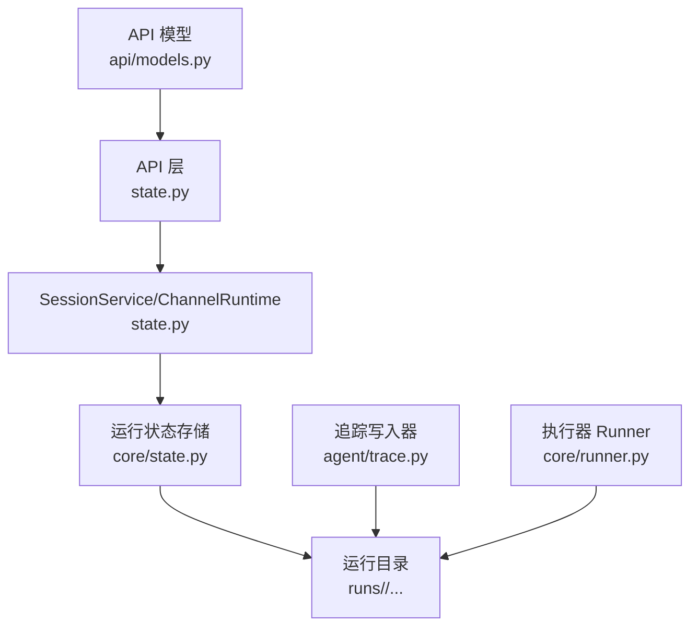
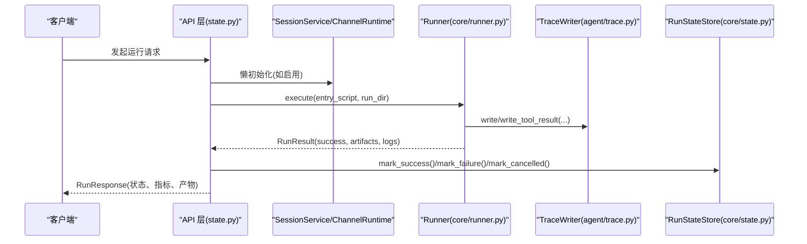
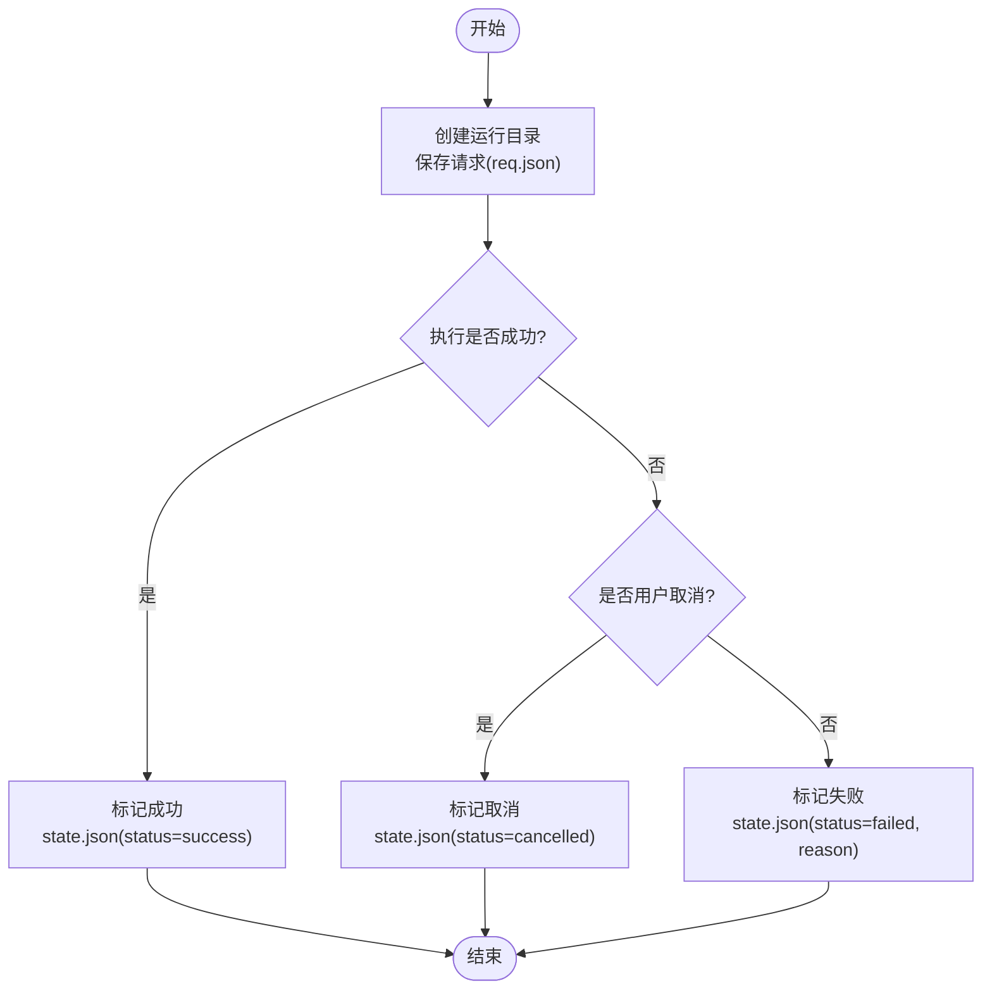
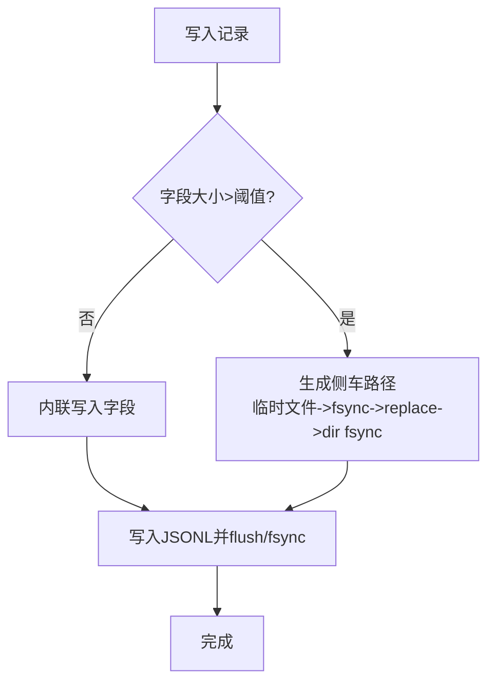
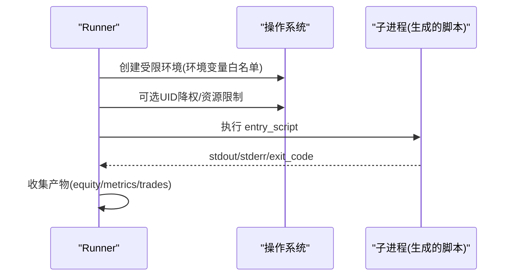
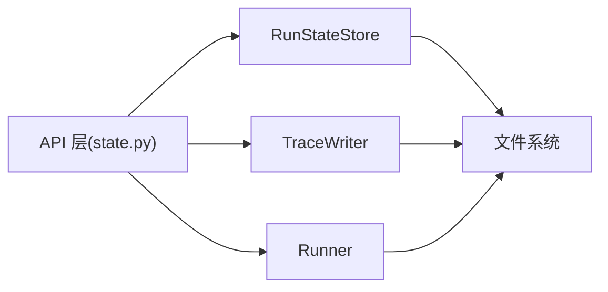

# 状态机与追踪

<cite>
**本文引用的文件**
- [agent/src/core/state.py](file://agent/src/core/state.py)
- [agent/src/api/state.py](file://agent/src/api/state.py)
- [agent/src/agent/trace.py](file://agent/src/agent/trace.py)
- [agent/src/core/runner.py](file://agent/src/core/runner.py)
- [agent/src/api/models.py](file://agent/src/api/models.py)
</cite>

## 目录
1. [简介](#简介)
2. [项目结构](#项目结构)
3. [核心组件](#核心组件)
4. [架构总览](#架构总览)
5. [详细组件分析](#详细组件分析)
6. [依赖关系分析](#依赖关系分析)
7. [性能考虑](#性能考虑)
8. [故障排查指南](#故障排查指南)
9. [结论](#结论)
10. [附录](#附录)

## 简介
本文件围绕“指令执行生命周期”的状态机设计与“可追溯性”的追踪机制，提供从状态定义、转换规则、持久化到查询接口、恢复与一致性保证、监控与调试的完整技术说明。重点覆盖：
- 运行状态机：成功/失败/取消等状态的创建、写入与读取
- 状态持久化：原子写入与 fsync 保障
- 追踪系统：JSONL 日志、大字段旁路存储、崩溃安全
- 执行器：子进程隔离、环境变量白名单、资源限制
- API 模型：统一响应结构与运行元数据
- 恢复与一致性：侧车文件原子替换、目录 fsync、错误降级策略

## 项目结构
与状态机与追踪相关的核心模块分布如下：
- 运行状态存储：RunStateStore（创建运行目录、保存请求、标记成功/失败/取消）
- 追踪写入器：TraceWriter（JSONL 记录、大文本旁路、fsync 保障）
- 执行器：Runner（子进程执行、沙箱 HOME、资源限制、产物收集）
- API 状态服务：懒加载 SessionService/ChannelRuntime（用于会话与通道运行时）
- API 模型：RunResponse/RunInfo 等（统一返回结构）

图表来源
- [agent/src/api/state.py:29-110](file://agent/src/api/state.py#L29-L110)
- [agent/src/core/state.py:13-87](file://agent/src/core/state.py#L13-L87)
- [agent/src/agent/trace.py:64-183](file://agent/src/agent/trace.py#L64-L183)
- [agent/src/core/runner.py:379-627](file://agent/src/core/runner.py#L379-L627)
- [agent/src/api/models.py:42-104](file://agent/src/api/models.py#L42-L104)

章节来源
- [agent/src/core/state.py:13-87](file://agent/src/core/state.py#L13-L87)
- [agent/src/agent/trace.py:64-183](file://agent/src/agent/trace.py#L64-L183)
- [agent/src/core/runner.py:379-627](file://agent/src/core/runner.py#L379-L627)
- [agent/src/api/state.py:29-110](file://agent/src/api/state.py#L29-L110)
- [agent/src/api/models.py:42-104](file://agent/src/api/models.py#L42-L104)

## 核心组件
- RunStateStore：负责运行目录创建、请求保存、状态标记（成功/失败/取消），使用 JSON 文件 + fsync 确保崩溃安全。
- TraceWriter：以 JSONL 形式记录每次事件，支持大字段旁路存储（sidecar），写前 fsync，读时可选择性解析旁路文件。
- Runner：在受限环境中执行生成的回测脚本，收集 stdout/stderr 与产物，设置最小必要的环境变量，必要时进行 UID 降权与地址空间限制。
- API 状态服务：懒初始化会话与通道运行时，便于后续扩展状态查询与通知能力。
- API 模型：统一的运行结果与指标结构，便于前端展示与外部消费。

章节来源
- [agent/src/core/state.py:13-87](file://agent/src/core/state.py#L13-L87)
- [agent/src/agent/trace.py:64-183](file://agent/src/agent/trace.py#L64-L183)
- [agent/src/core/runner.py:379-627](file://agent/src/core/runner.py#L379-L627)
- [agent/src/api/state.py:29-110](file://agent/src/api/state.py#L29-L110)
- [agent/src/api/models.py:42-104](file://agent/src/api/models.py#L42-L104)

## 架构总览
下图展示了“指令执行生命周期”中状态机与追踪的关键交互：
- 入口：API 层通过 state.py 获取 SessionService/ChannelRuntime（按需）
- 运行：Runner 执行脚本，输出日志与产物；TraceWriter 持续写入 trace.jsonl
- 状态：RunStateStore 将运行状态持久化为 state.json
- 查询：API 模型封装运行结果与指标，供上层消费

图表来源
- [agent/src/api/state.py:29-110](file://agent/src/api/state.py#L29-L110)
- [agent/src/core/runner.py:510-627](file://agent/src/core/runner.py#L510-L627)
- [agent/src/agent/trace.py:92-183](file://agent/src/agent/trace.py#L92-L183)
- [agent/src/core/state.py:34-77](file://agent/src/core/state.py#L34-L77)
- [agent/src/api/models.py:42-104](file://agent/src/api/models.py#L42-L104)

## 详细组件分析

### 运行状态机设计
- 状态集合
  - success：运行成功
  - failed：运行失败（含原因）
  - cancelled：用户主动取消（区别于失败，避免报告视图与聊天历史矛盾）
- 状态转换规则
  - 初始：未标记（无 state.json）
  - 成功路径：执行完成且无异常 -> mark_success
  - 失败路径：执行异常或退出码非零 -> mark_failure(reason)
  - 取消路径：用户中断 -> mark_cancelled(reason="cancelled by user")
- 状态持久化
  - 写入 state.json，采用 JSON 序列化 + flush + fsync，确保崩溃不丢失
  - 目录结构：每个运行拥有独立目录，包含 code/logs/artifacts 等子目录

图表来源
- [agent/src/core/state.py:16-77](file://agent/src/core/state.py#L16-L77)

章节来源
- [agent/src/core/state.py:16-77](file://agent/src/core/state.py#L16-L77)

### 追踪机制
- 记录格式
  - JSONL 每行一条记录，自动附加时间戳 ts
  - 工具调用结果：type=tool_result，包含 call_id、tool、status、elapsed_ms、iter、preview
- 大字段旁路存储
  - 超过阈值的文本字段（如 result、content、prompt）写入 sidecar 文件
  - 写入流程：临时文件 -> fsync -> os.replace -> 父目录 fsync，确保原子性与完整性
  - 读取时可选择性解析旁路字段，避免加载不必要的大对象
- 崩溃安全
  - 每条记录 flush+fsync；若 fsync 失败仅警告一次并降级为 flush-only
  - 侧车文件先于引用记录完成持久化，避免记录指向缺失/截断的侧车

图表来源
- [agent/src/agent/trace.py:92-183](file://agent/src/agent/trace.py#L92-L183)
- [agent/src/agent/trace.py:185-267](file://agent/src/agent/trace.py#L185-L267)

章节来源
- [agent/src/agent/trace.py:92-183](file://agent/src/agent/trace.py#L92-L183)
- [agent/src/agent/trace.py:185-267](file://agent/src/agent/trace.py#L185-L267)
- [agent/src/agent/trace.py:302-370](file://agent/src/agent/trace.py#L302-L370)

### 执行器与隔离
- 子进程执行
  - 选择可用 Python 解释器，构建最小环境（白名单环境变量）
  - 捕获 stdout/stderr 至 logs 目录，收集产物（equity/metrics/trades 等）
- 沙箱与资源限制
  - 可选 UID 降权（vibe-sandbox），仅在具备权限时生效
  - 限制虚拟内存上限（RLIMIT_AS）与文件描述符数量（RLIMIT_NOFILE）
  - 临时 HOME 目录，仅暴露必要的缓存/配置路径，降低信息泄露风险
- 超时控制
  - 子进程执行带超时，防止长时间挂起

图表来源
- [agent/src/core/runner.py:438-627](file://agent/src/core/runner.py#L438-L627)

章节来源
- [agent/src/core/runner.py:438-627](file://agent/src/core/runner.py#L438-L627)

### API 状态服务与模型
- 懒初始化
  - 仅在启用会话运行时才创建 SessionService/ChannelRuntime，减少启动开销
  - 通过 host_attr 注入单例，避免重复初始化
- 统一模型
  - RunResponse/RunInfo 等模型标准化返回结构，包含状态、指标、产物、上下文等

章节来源
- [agent/src/api/state.py:29-110](file://agent/src/api/state.py#L29-L110)
- [agent/src/api/models.py:42-104](file://agent/src/api/models.py#L42-L104)

## 依赖关系分析
- 低耦合高内聚
  - RunStateStore 仅关注状态持久化，不感知执行细节
  - TraceWriter 专注追踪写入，对上层透明
  - Runner 负责执行与隔离，产出日志与产物，不直接管理状态
  - API 层组合上述组件，提供统一接口
- 外部依赖
  - 文件系统：JSONL、JSON、sidecar 文件
  - 操作系统：fsync、os.replace、resource/pwd（可选）
  - 事件总线/会话服务（可选，按需启用）

图表来源
- [agent/src/core/state.py:13-87](file://agent/src/core/state.py#L13-L87)
- [agent/src/agent/trace.py:64-183](file://agent/src/agent/trace.py#L64-L183)
- [agent/src/core/runner.py:379-627](file://agent/src/core/runner.py#L379-L627)
- [agent/src/api/state.py:29-110](file://agent/src/api/state.py#L29-L110)

章节来源
- [agent/src/core/state.py:13-87](file://agent/src/core/state.py#L13-L87)
- [agent/src/agent/trace.py:64-183](file://agent/src/agent/trace.py#L64-L183)
- [agent/src/core/runner.py:379-627](file://agent/src/core/runner.py#L379-L627)
- [agent/src/api/state.py:29-110](file://agent/src/api/state.py#L29-L110)

## 性能考虑
- 追踪写入
  - 每条记录 fsync 带来一定 I/O 开销，但可接受（事件频率低）
  - 大字段旁路避免 JSONL 膨胀，提升读写效率
- 执行器
  - 环境变量白名单减少不必要的环境污染
  - 资源限制防止恶意或失控脚本耗尽系统资源
- 状态持久化
  - fsync 确保崩溃安全，适合关键状态（state.json）

[本节为通用指导，无需特定文件来源]

## 故障排查指南
- 追踪文件不可用
  - 检查 trace.jsonl 是否存在；若 fsync 失败会降级为 flush-only，仍可读取但不保证断电后存活
  - 大字段旁路文件需存在且路径安全（防越界），否则读取时会跳过该字段
- 运行状态不一致
  - 确认 state.json 是否被正确写入（成功/失败/取消）
  - 若用户取消，应标记为 cancelled，避免与失败混淆
- 执行失败
  - 查看 runner_stdout.txt/runner_stderr.txt 定位问题
  - 检查子进程超时、环境变量、UID 降权与资源限制是否生效

章节来源
- [agent/src/agent/trace.py:286-300](file://agent/src/agent/trace.py#L286-L300)
- [agent/src/core/state.py:49-77](file://agent/src/core/state.py#L49-L77)
- [agent/src/core/runner.py:682-709](file://agent/src/core/runner.py#L682-L709)

## 结论
本实现通过清晰的状态机（成功/失败/取消）、强一致性的持久化（fsync）、完善的追踪（JSONL + 旁路）以及安全的执行器（沙箱、资源限制），构建了稳健的指令执行生命周期管理能力。配合统一的 API 模型与懒初始化服务，既保证了可靠性，又兼顾了可扩展性与性能。

[本节为总结，无需特定文件来源]

## 附录

### 状态查询接口建议
- 获取运行状态
  - 输入：run_id
  - 输出：{status, reason, created_at, prompt, metrics, artifacts, ...}
  - 参考模型：RunResponse/RunInfo
- 获取追踪记录
  - 输入：run_id（或 session_id）
  - 输出：trace.jsonl 列表，可选择解析旁路字段
  - 参考方法：TraceWriter.read(dir_path, resolve_offloads=True, resolve_fields={...})

章节来源
- [agent/src/api/models.py:42-104](file://agent/src/api/models.py#L42-L104)
- [agent/src/agent/trace.py:302-370](file://agent/src/agent/trace.py#L302-L370)

### 状态恢复与一致性保证
- 原子写入
  - 侧车文件通过临时文件 + os.replace 实现原子替换
  - 目录 fsync 确保新条目可见
- 崩溃恢复
  - 若 state.json 未写入，视为未标记；可通过 trace.jsonl 推断最近事件
  - 若 fsync 失败，降级为 flush-only，仍可读取但不保证断电后存活
- 一致性校验
  - 读取旁路文件时进行路径安全检查，防止越界访问

章节来源
- [agent/src/agent/trace.py:185-267](file://agent/src/agent/trace.py#L185-L267)
- [agent/src/agent/trace.py:361-370](file://agent/src/agent/trace.py#L361-L370)
- [agent/src/core/state.py:79-87](file://agent/src/core/state.py#L79-L87)

### 状态监控示例与调试工具使用方法
- 监控运行状态
  - 定期读取 state.json 判断当前运行状态
  - 结合 trace.jsonl 的事件顺序，还原执行过程
- 调试工具
  - 查看 runner_stdout.txt/runner_stderr.txt 获取执行输出
  - 使用 TraceWriter.read 解析追踪记录，必要时仅解析关键字段以提升性能
  - 检查 sidecar 文件是否存在且可读，确认大字段是否完整

章节来源
- [agent/src/core/runner.py:682-709](file://agent/src/core/runner.py#L682-L709)
- [agent/src/agent/trace.py:302-370](file://agent/src/agent/trace.py#L302-L370)