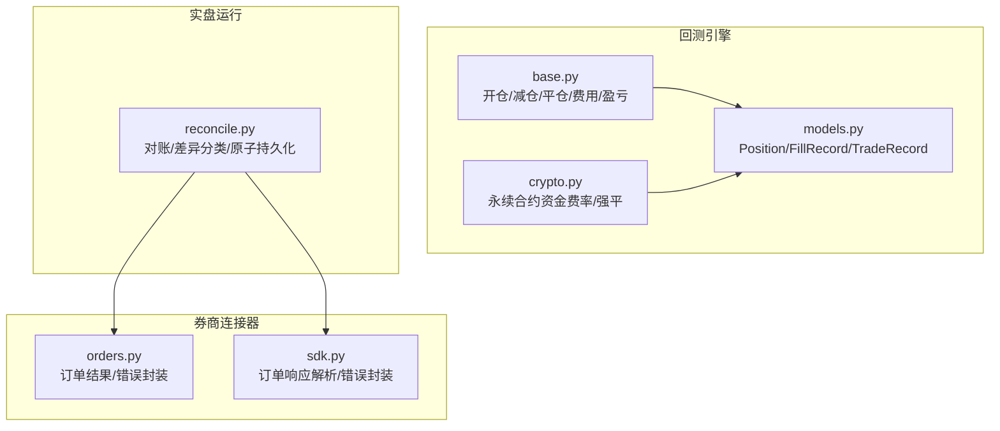
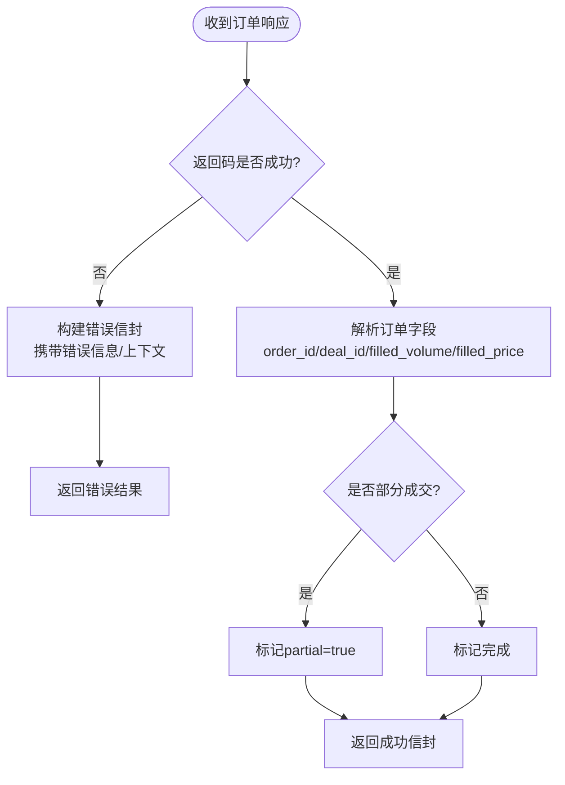
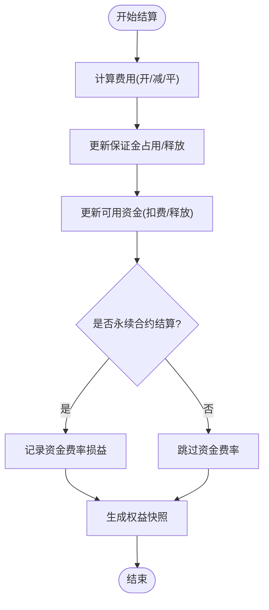
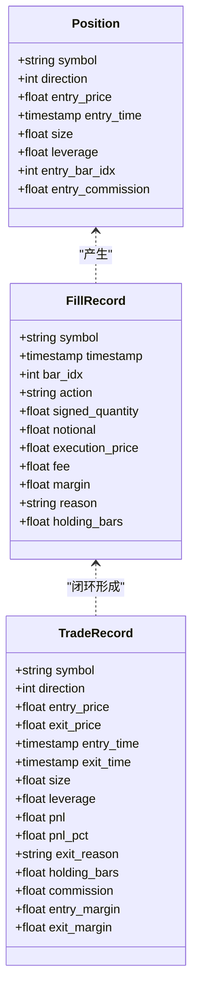
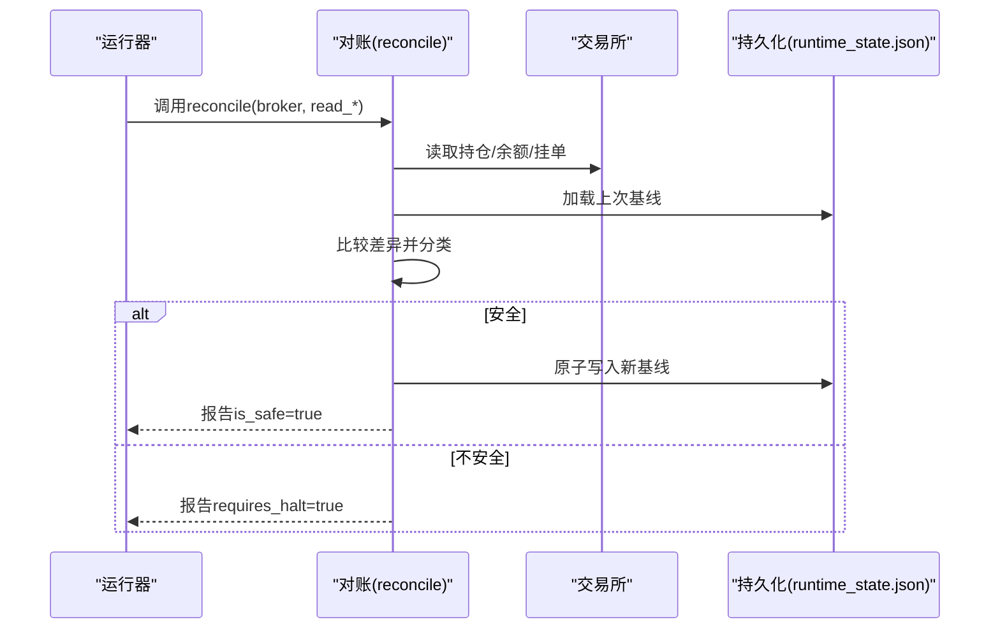
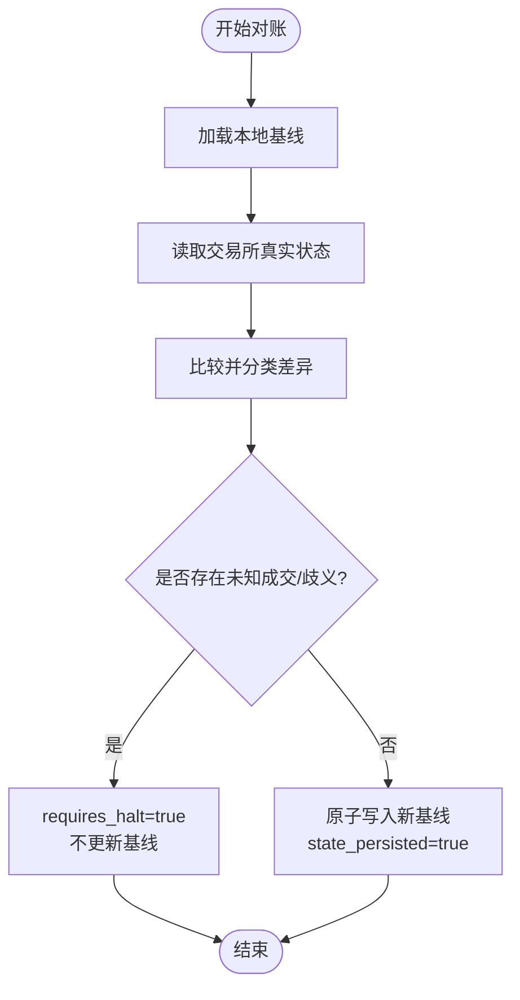
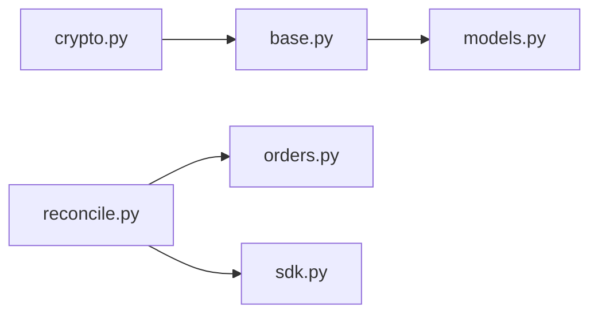

# 确认与结算流程

<cite>
**本文引用的文件**
- [agent/src/live/runtime/reconcile.py](file://agent/src/live/runtime/reconcile.py)
- [agent/backtest/engines/base.py](file://agent/backtest/engines/base.py)
- [agent/backtest/models.py](file://agent/backtest/models.py)
- [agent/backtest/engines/crypto.py](file://agent/backtest/engines/crypto.py)
- [agent/tests/test_crypto_engine.py](file://agent/tests/test_crypto_engine.py)
- [agent/src/trading/connectors/mt5/orders.py](file://agent/src/trading/connectors/mt5/orders.py)
- [agent/src/trading/connectors/okx/sdk.py](file://agent/src/trading/connectors/okx/sdk.py)
</cite>

## 目录
1. [简介](#简介)
2. [项目结构](#项目结构)
3. [核心组件](#核心组件)
4. [架构总览](#架构总览)
5. [详细组件分析](#详细组件分析)
6. [依赖关系分析](#依赖关系分析)
7. [性能考量](#性能考量)
8. [故障排查指南](#故障排查指南)
9. [结论](#结论)
10. [附录](#附录)

## 简介
本技术文档围绕“确认与结算”展开，覆盖以下关键主题：
- 成交回报处理：订单确认接收、成交数据解析、异常成交处理。
- 资金清算机制：资金划转、费用计算、余额更新。
- 持仓更新流程：仓位调整、成本计算、盈亏统计。
- 结算流程图与数据同步机制。
- 对账与差异处理机制。
- 结算配置示例与异常处理最佳实践。

本仓库在回测引擎中实现了完整的成交记录、费用与盈亏核算；在实盘运行时提供崩溃恢复与对账模块，确保“交易所真相”与本地持久化状态一致，避免重复下单或遗漏成交。

## 项目结构
与确认与结算相关的代码主要分布在以下位置：
- 回测执行与结算：backtest 引擎（base/crypto）与模型（models）。
- 实盘对账与恢复：live runtime reconcile。
- 券商连接器：MT5、OKX 等，负责订单结果与错误封装。



**图表来源**
- [agent/backtest/engines/base.py:1325-1420](file://agent/backtest/engines/base.py#L1325-L1420)
- [agent/backtest/engines/crypto.py:266-302](file://agent/backtest/engines/crypto.py#L266-L302)
- [agent/backtest/models.py:13-118](file://agent/backtest/models.py#L13-L118)
- [agent/src/live/runtime/reconcile.py:275-366](file://agent/src/live/runtime/reconcile.py#L275-L366)
- [agent/src/trading/connectors/mt5/orders.py:369-410](file://agent/src/trading/connectors/mt5/orders.py#L369-L410)
- [agent/src/trading/connectors/okx/sdk.py:544-560](file://agent/src/trading/connectors/okx/sdk.py#L544-L560)

**章节来源**
- [agent/backtest/engines/base.py:1325-1420](file://agent/backtest/engines/base.py#L1325-L1420)
- [agent/backtest/engines/crypto.py:266-302](file://agent/backtest/engines/crypto.py#L266-L302)
- [agent/backtest/models.py:13-118](file://agent/backtest/models.py#L13-L118)
- [agent/src/live/runtime/reconcile.py:275-366](file://agent/src/live/runtime/reconcile.py#L275-L366)
- [agent/src/trading/connectors/mt5/orders.py:369-410](file://agent/src/trading/connectors/mt5/orders.py#L369-L410)
- [agent/src/trading/connectors/okx/sdk.py:544-560](file://agent/src/trading/connectors/okx/sdk.py#L544-L560)

## 核心组件
- 回测引擎（base.py）：统一执行循环，完成开仓、加仓、减仓、平仓、费用与盈亏计算，并生成 FillRecord/TradeRecord 证据。
- 永续引擎（crypto.py）：在 base 基础上增加资金费率结算、强平评估与事件记录。
- 数据模型（models.py）：定义 Position、FillRecord、TradeRecord、EquitySnapshot 等不可变数据结构，保证结算可追溯。
- 对账模块（reconcile.py）：读取交易所真实状态，与本地持久化状态对比，分类差异（匹配/未知成交/孤儿订单/中途订单歧义），并在安全时原子更新基线。
- 券商连接器（MT5/OKX）：将底层订单响应标准化为统一的成功/失败信封，便于上层处理与审计。

**章节来源**
- [agent/backtest/engines/base.py:1325-1420](file://agent/backtest/engines/base.py#L1325-L1420)
- [agent/backtest/engines/crypto.py:266-302](file://agent/backtest/engines/crypto.py#L266-L302)
- [agent/backtest/models.py:13-118](file://agent/backtest/models.py#L13-L118)
- [agent/src/live/runtime/reconcile.py:275-366](file://agent/src/live/runtime/reconcile.py#L275-L366)
- [agent/src/trading/connectors/mt5/orders.py:369-410](file://agent/src/trading/connectors/mt5/orders.py#L369-L410)
- [agent/src/trading/connectors/okx/sdk.py:544-560](file://agent/src/trading/connectors/okx/sdk.py#L544-L560)

## 架构总览
下图展示从信号到成交、结算、对账的端到端流程，涵盖回测与实盘的关键路径。

```mermaid
sequenceDiagram
participant S as "策略/信号"
participant E as "回测引擎(base/crypto)"
participant A as "账户/持仓(内存)"
participant L as "对账(reconcile)"
participant B as "交易所(MT5/OKX)"
S->>E : 目标权重/调仓指令
E->>A : 计算保证金/费用/预估资金占用
E->>E : 计划减仓/加仓/开仓
E-->>A : 更新仓位/资金/盈亏(回测)
Note over E,A : 生成 FillRecord/TradeRecord 证据
alt 实盘
E->>B : 下单/撤单
B-->>E : 订单结果(成功/部分成交/拒绝)
E->>L : 触发对账(启动/每tick前)
L->>B : 读取持仓/余额/挂单
L->>L : 比较本地持久化 vs 交易所真相
L-->>E : 报告差异(匹配/未知成交/孤儿订单/歧义)
opt 安全
L->>L : 原子写入新基线(runtime_state.json)
else 不安全
L-->>E : 要求停机/人工介入
end
end
```

**图表来源**
- [agent/backtest/engines/base.py:1325-1420](file://agent/backtest/engines/base.py#L1325-L1420)
- [agent/backtest/engines/crypto.py:266-302](file://agent/backtest/engines/crypto.py#L266-L302)
- [agent/src/live/runtime/reconcile.py:275-366](file://agent/src/live/runtime/reconcile.py#L275-L366)
- [agent/src/trading/connectors/mt5/orders.py:369-410](file://agent/src/trading/connectors/mt5/orders.py#L369-L410)
- [agent/src/trading/connectors/okx/sdk.py:544-560](file://agent/src/trading/connectors/okx/sdk.py#L544-L560)

## 详细组件分析

### 成交回报处理（订单确认、成交解析、异常处理）
- 订单确认与结果封装：
  - MT5：将底层返回码转换为统一信封，区分“完成/部分完成”，并携带订单号、成交价、成交量等字段。
  - OKX：校验外层与内层返回码，非零则构造错误信封，包含错误信息与上下文。
- 异常处理：
  - 任何非成功响应均被包装为错误信封，便于上层统一处理与审计。
  - 连接器不重试写操作，遵循“无重试”原则，避免重复下单。



**图表来源**
- [agent/src/trading/connectors/mt5/orders.py:369-410](file://agent/src/trading/connectors/mt5/orders.py#L369-L410)
- [agent/src/trading/connectors/okx/sdk.py:544-560](file://agent/src/trading/connectors/okx/sdk.py#L544-L560)

**章节来源**
- [agent/src/trading/connectors/mt5/orders.py:369-410](file://agent/src/trading/connectors/mt5/orders.py#L369-L410)
- [agent/src/trading/connectors/okx/sdk.py:544-560](file://agent/src/trading/connectors/okx/sdk.py#L544-L560)

### 资金清算机制（资金划转、费用计算、余额更新）
- 费用计算：
  - 开仓/加仓/减仓/平仓均按规则计算佣金，计入 TradeRecord.commission 与 FillRecord.fee。
  - 永续合约额外记录交易费用与资金费率损益。
- 资金划转与余额更新：
  - 开仓/加仓：扣除保证金与佣金，减少可用资金。
  - 减仓/平仓：释放保证金，加回已实现盈亏与退出佣金后的净额。
  - 永续合约：在每个结算点记录资金费率支付，影响钱包余额与权益。
- 权益快照：
  - 通过 EquitySnapshot 记录某时刻的现金、未实现盈亏与总权益。



**图表来源**
- [agent/backtest/engines/base.py:1325-1420](file://agent/backtest/engines/base.py#L1325-L1420)
- [agent/backtest/engines/crypto.py:266-302](file://agent/backtest/engines/crypto.py#L266-L302)
- [agent/backtest/models.py:101-118](file://agent/backtest/models.py#L101-L118)

**章节来源**
- [agent/backtest/engines/base.py:1325-1420](file://agent/backtest/engines/base.py#L1325-L1420)
- [agent/backtest/engines/crypto.py:266-302](file://agent/backtest/engines/crypto.py#L266-L302)
- [agent/backtest/models.py:101-118](file://agent/backtest/models.py#L101-L118)

### 持仓更新流程（仓位调整、成本计算、盈亏统计）
- 仓位调整：
  - 开仓：创建 Position，记录入场价、方向、规模、杠杆、入场佣金。
  - 加仓：加权平均更新入场价与累计入场佣金。
  - 减仓：按比例分摊入场佣金，释放对应保证金，记录已实现盈亏。
  - 平仓：生成 TradeRecord，汇总入场+出场佣金，记录持有周期与退出原因。
- 成本与盈亏：
  - 使用 _calc_pnl 与 _calc_margin 计算盈亏与保证金。
  - 支持不同杠杆与多标的组合下的权益一致性校验。



**图表来源**
- [agent/backtest/models.py:13-118](file://agent/backtest/models.py#L13-L118)
- [agent/backtest/engines/base.py:1325-1420](file://agent/backtest/engines/base.py#L1325-L1420)

**章节来源**
- [agent/backtest/engines/base.py:1325-1420](file://agent/backtest/engines/base.py#L1325-L1420)
- [agent/backtest/models.py:13-118](file://agent/backtest/models.py#L13-L118)

### 结算流程图与数据同步机制
- 结算流程：
  - 回测：逐根K线执行，计算费用、更新仓位与资金，生成证据。
  - 永续：在每个结算点应用资金费率，记录相关损益。
- 数据同步：
  - 对账模块在启动与每tick前读取交易所真实状态，与本地持久化状态比对。
  - 若完全匹配或仅存在无害差异，则原子写入新的基线；否则要求停机并上报。



**图表来源**
- [agent/src/live/runtime/reconcile.py:275-366](file://agent/src/live/runtime/reconcile.py#L275-L366)
- [agent/src/live/runtime/reconcile.py:570-608](file://agent/src/live/runtime/reconcile.py#L570-L608)

**章节来源**
- [agent/src/live/runtime/reconcile.py:275-366](file://agent/src/live/runtime/reconcile.py#L275-L366)
- [agent/src/live/runtime/reconcile.py:570-608](file://agent/src/live/runtime/reconcile.py#L570-L608)

### 对账与差异处理机制
- 差异分类：
  - matched：本地与交易所一致。
  - unknown_fill：出现未知成交（资金变动但无审计记录），强制停机。
  - orphan_order：本地记录的已确认订单在交易所不存在（可能已取消/拒绝/已结清），不上报重发。
  - mid_order_ambiguous：提交但未确认的订单，无法判断是否已成交，禁止重发，需停机上报。
- 持久化策略：
  - 仅在安全时对账后原子写入新基线，保留原始歧义以便人工处理。



**图表来源**
- [agent/src/live/runtime/reconcile.py:78-107](file://agent/src/live/runtime/reconcile.py#L78-L107)
- [agent/src/live/runtime/reconcile.py:369-442](file://agent/src/live/runtime/reconcile.py#L369-L442)
- [agent/src/live/runtime/reconcile.py:445-529](file://agent/src/live/runtime/reconcile.py#L445-L529)
- [agent/src/live/runtime/reconcile.py:570-608](file://agent/src/live/runtime/reconcile.py#L570-L608)

**章节来源**
- [agent/src/live/runtime/reconcile.py:78-107](file://agent/src/live/runtime/reconcile.py#L78-L107)
- [agent/src/live/runtime/reconcile.py:369-442](file://agent/src/live/runtime/reconcile.py#L369-L442)
- [agent/src/live/runtime/reconcile.py:445-529](file://agent/src/live/runtime/reconcile.py#L445-L529)
- [agent/src/live/runtime/reconcile.py:570-608](file://agent/src/live/runtime/reconcile.py#L570-L608)

### 结算配置示例与异常处理最佳实践
- 配置要点（基于测试断言可见的结算参数）：
  - 手续费率：taker_rate/maker_rate，用于计算交易费用。
  - 强平费用率：liquidation_fee_rate，用于强平场景的费用核算。
  - 资金费率：funding_rate，用于永续合约结算。
  - 保证金模式：isolated/cross，影响风险与强平逻辑。
  - 仓位调整策略：position_adjustment="rebalance"，影响减仓顺序与资金费率前置。
- 异常处理最佳实践：
  - 连接器层面：所有非成功响应统一封装为错误信封，携带上下文，便于审计与定位。
  - 对账层面：遇到未知成交或中途订单歧义，立即要求停机，绝不自动重发或修正。
  - 持久化层面：原子写入新基线，避免中间状态污染；损坏状态直接报错并要求修复。

**章节来源**
- [agent/tests/test_crypto_engine.py:730-759](file://agent/tests/test_crypto_engine.py#L730-L759)
- [agent/tests/test_crypto_engine.py:879-987](file://agent/tests/test_crypto_engine.py#L879-L987)
- [agent/src/trading/connectors/mt5/orders.py:369-410](file://agent/src/trading/connectors/mt5/orders.py#L369-L410)
- [agent/src/trading/connectors/okx/sdk.py:544-560](file://agent/src/trading/connectors/okx/sdk.py#L544-L560)
- [agent/src/live/runtime/reconcile.py:275-366](file://agent/src/live/runtime/reconcile.py#L275-L366)

## 依赖关系分析
- 回测引擎依赖：
  - models.py：提供不可变的数据结构，确保结算证据链完整。
  - crypto.py：在 base.py 上扩展永续合约的资金费率与强平逻辑。
- 对账模块依赖：
  - 读取函数注入：positions/balance/open_orders 作为只读接口，避免写路径。
  - 持久化：runtime_state.json 原子写入，保障崩溃恢复的一致性。
- 连接器依赖：
  - MT5/OKX：将底层协议差异抽象为统一信封，屏蔽细节。



**图表来源**
- [agent/backtest/engines/base.py:1325-1420](file://agent/backtest/engines/base.py#L1325-L1420)
- [agent/backtest/engines/crypto.py:266-302](file://agent/backtest/engines/crypto.py#L266-L302)
- [agent/backtest/models.py:13-118](file://agent/backtest/models.py#L13-L118)
- [agent/src/live/runtime/reconcile.py:275-366](file://agent/src/live/runtime/reconcile.py#L275-L366)
- [agent/src/trading/connectors/mt5/orders.py:369-410](file://agent/src/trading/connectors/mt5/orders.py#L369-L410)
- [agent/src/trading/connectors/okx/sdk.py:544-560](file://agent/src/trading/connectors/okx/sdk.py#L544-L560)

**章节来源**
- [agent/backtest/engines/base.py:1325-1420](file://agent/backtest/engines/base.py#L1325-L1420)
- [agent/backtest/engines/crypto.py:266-302](file://agent/backtest/engines/crypto.py#L266-L302)
- [agent/backtest/models.py:13-118](file://agent/backtest/models.py#L13-L118)
- [agent/src/live/runtime/reconcile.py:275-366](file://agent/src/live/runtime/reconcile.py#L275-L366)
- [agent/src/trading/connectors/mt5/orders.py:369-410](file://agent/src/trading/connectors/mt5/orders.py#L369-L410)
- [agent/src/trading/connectors/okx/sdk.py:544-560](file://agent/src/trading/connectors/okx/sdk.py#L544-L560)

## 性能考量
- 回测性能：
  - 向量化填充与索引映射减少 pandas 开销，提升对齐与价格查找效率。
  - 分批执行减仓/开仓，避免单次过大计算。
- 对账性能：
  - 仅读取必要字段，快速分类差异；原子写入避免锁竞争。
- 连接器性能：
  - 统一错误封装减少分支复杂度，便于缓存与重试策略（写操作禁用重试）。

[本节提供通用指导，无需特定文件引用]

## 故障排查指南
- 常见异常与处理：
  - 未知成交（unknown_fill）：检查历史审计记录与交易所流水，定位缺失环节。
  - 中途订单歧义（mid_order_ambiguous）：核对提交时间戳与审计落盘顺序，必要时人工干预。
  - 连接器错误：查看错误信封中的错误信息与上下文，定位券商侧拒绝原因。
- 建议步骤：
  - 启用更详细的日志与审计输出。
  - 复现最小用例，验证对账与持久化路径。
  - 检查 runtime_state.json 完整性与权限。

**章节来源**
- [agent/src/live/runtime/reconcile.py:78-107](file://agent/src/live/runtime/reconcile.py#L78-L107)
- [agent/src/live/runtime/reconcile.py:369-442](file://agent/src/live/runtime/reconcile.py#L369-L442)
- [agent/src/trading/connectors/mt5/orders.py:369-410](file://agent/src/trading/connectors/mt5/orders.py#L369-L410)
- [agent/src/trading/connectors/okx/sdk.py:544-560](file://agent/src/trading/connectors/okx/sdk.py#L544-L560)

## 结论
本仓库在回测与实盘中构建了稳健的确认与结算体系：
- 回测引擎提供精确的费用、盈亏与证据链。
- 永续合约支持资金费率结算与强平逻辑。
- 对账模块确保交易所真相与本地状态一致，避免重复下单与遗漏成交。
- 连接器统一错误封装，便于审计与排障。
建议在生产环境中严格遵循“无重试写操作”和“对账优先”的原则，确保资金与持仓的安全性与一致性。

[本节总结性内容，无需特定文件引用]

## 附录
- 术语说明：
  - 资金费率：永续合约周期性支付的持有成本/收益。
  - 强平：当保证金不足时，系统强制平仓以控制风险。
  - 对账：比较本地状态与交易所真实状态，识别差异并采取措施。
- 参考路径：
  - 回测执行与结算：base.py、crypto.py、models.py。
  - 对账与恢复：reconcile.py。
  - 连接器：orders.py（MT5）、sdk.py（OKX）。

[本节为补充说明，无需特定文件引用]