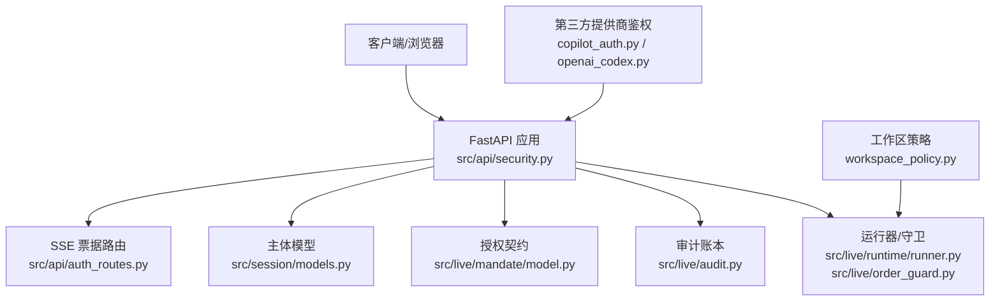
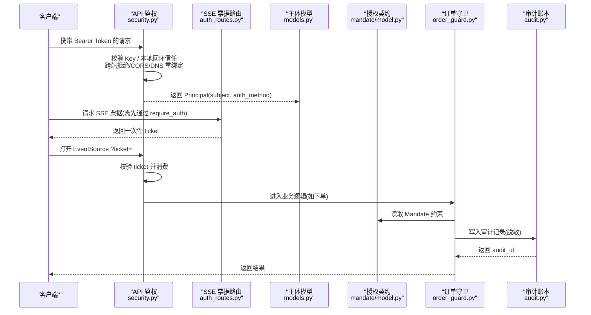
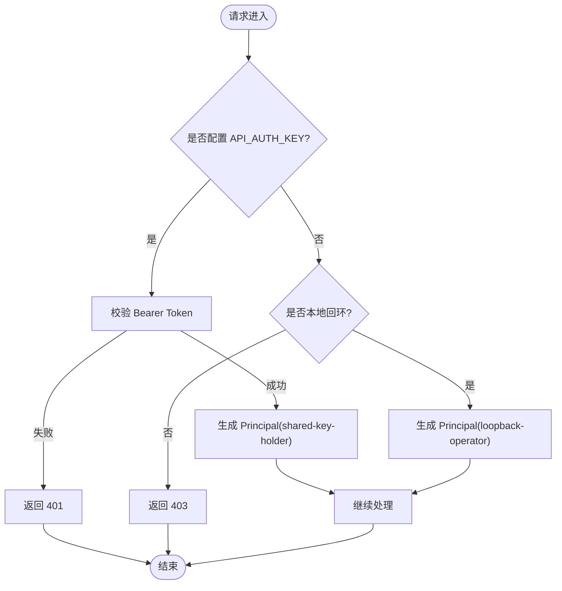
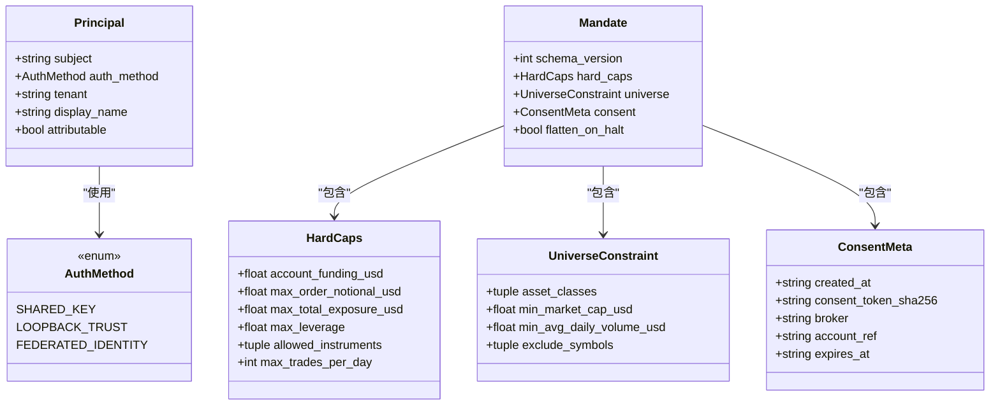
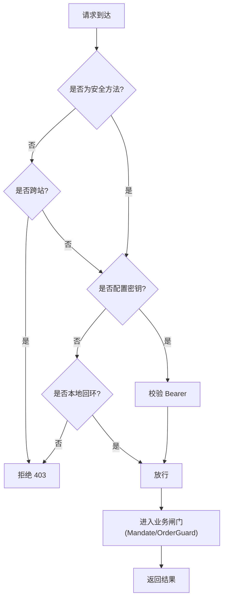
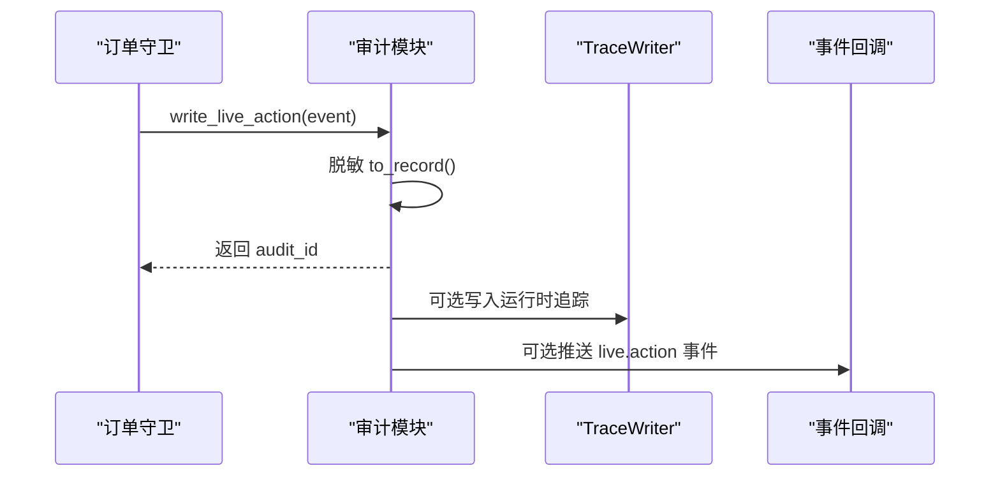
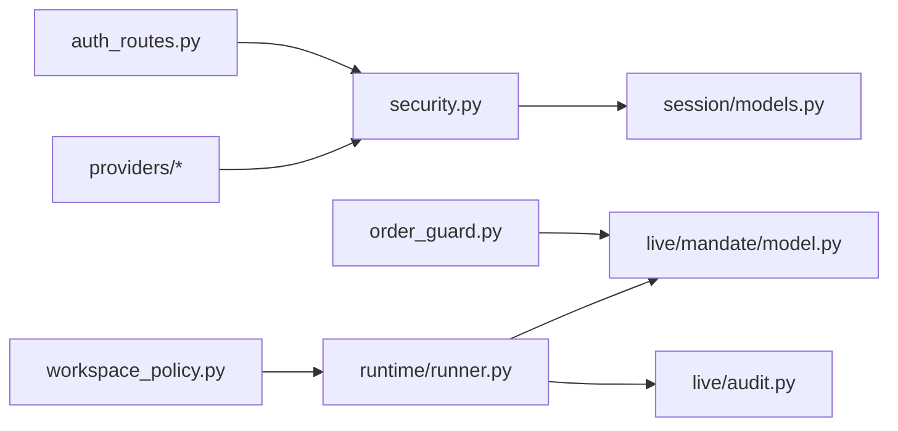

# 授权机制

<cite>
**本文引用的文件**
- [security.py](file://agent/src/api/security.py)
- [auth_routes.py](file://agent/src/api/auth_routes.py)
- [models.py](file://agent/src/session/models.py)
- [model.py](file://agent/src/live/mandate/model.py)
- [audit.py](file://agent/src/live/audit.py)
- [runner.py](file://agent/src/live/runtime/runner.py)
- [order_guard.py](file://agent/src/live/order_guard.py)
- [trading/service.py](file://agent/src/trading/service.py)
- [workspace_policy.py](file://agent/src/security/workspace_policy.py)
- [copilot_auth.py](file://agent/src/providers/copilot_auth.py)
- [openai_codex.py](file://agent/src/providers/openai_codex.py)
- [test_security_auth_api.py](file://agent/tests/test_security_auth_api.py)
- [test_sse_ticket_and_headers.py](file://agent/tests/test_sse_ticket_and_headers.py)
- [test_audit_redact.py](file://agent/tests/test_audit_redact.py)
</cite>

## 目录
1. [简介](#简介)
2. [项目结构](#项目结构)
3. [核心组件](#核心组件)
4. [架构总览](#架构总览)
5. [详细组件分析](#详细组件分析)
6. [依赖关系分析](#依赖关系分析)
7. [性能与安全考量](#性能与安全考量)
8. [故障排查指南](#故障排查指南)
9. [结论](#结论)
10. [附录：配置与最佳实践](#附录：配置与最佳实践)

## 简介
本文件系统化说明 Vibe-Trading 的指令委托系统授权机制，覆盖用户身份验证流程（登录认证、会话管理、令牌刷新）、权限模型设计（角色定义、权限粒度、继承关系）、访问控制策略（资源级、操作级、时间窗口限制）、安全验证机制（输入校验、输出过滤、异常处理），并提供权限配置示例与最佳实践。同时文档化权限审计日志与安全事件监控，展示不同用户角色的权限边界与使用场景。

## 项目结构
授权相关能力主要分布在以下模块：
- API 层鉴权与跨域/安全头：src/api/security.py
- SSE 票据颁发路由：src/api/auth_routes.py
- 主体与会话模型：src/session/models.py
- 交易授权契约（Mandate）：src/live/mandate/model.py
- 实时交易审计账本：src/live/audit.py
- 运行器与订单守卫：src/live/runtime/runner.py、src/live/order_guard.py
- 第三方提供商鉴权适配：src/providers/copilot_auth.py、src/providers/openai_codex.py
- 工作区路径策略：src/security/workspace_policy.py

图表来源
- [security.py:343-659](file://agent/src/api/security.py#L343-L659)
- [auth_routes.py:21-56](file://agent/src/api/auth_routes.py#L21-L56)
- [models.py:16-94](file://agent/src/session/models.py#L16-L94)
- [model.py:46-149](file://agent/src/live/mandate/model.py#L46-L149)
- [audit.py:1-248](file://agent/src/live/audit.py#L1-L248)
- [runner.py:842-870](file://agent/src/live/runtime/runner.py#L842-L870)
- [order_guard.py:742-771](file://agent/src/live/order_guard.py#L742-L771)
- [workspace_policy.py:1-12](file://agent/src/security/workspace_policy.py#L1-L12)

章节来源
- [security.py:343-659](file://agent/src/api/security.py#L343-L659)
- [auth_routes.py:21-56](file://agent/src/api/auth_routes.py#L21-L56)
- [models.py:16-94](file://agent/src/session/models.py#L16-L94)
- [model.py:46-149](file://agent/src/live/mandate/model.py#L46-L149)
- [audit.py:1-248](file://agent/src/live/audit.py#L1-L248)
- [runner.py:842-870](file://agent/src/live/runtime/runner.py#L842-L870)
- [order_guard.py:742-771](file://agent/src/live/order_guard.py#L742-L771)
- [workspace_policy.py:1-12](file://agent/src/security/workspace_policy.py#L1-L12)

## 核心组件
- 统一鉴权中间件与依赖：基于 Bearer Token 或本地回环信任，支持跨站请求拒绝、CORS 白名单、DNS 重绑定防护、安全响应头注入、敏感查询参数脱敏。
- SSE 票据机制：为浏览器 EventSource 提供一次性短效票据，避免在 URL 中暴露长时密钥。
- 主体与会话：Principal 抽象“谁”触发了操作；AuthMethod 区分共享密钥、本地回环信任、未来联邦身份。
- 授权契约（Mandate）：不可变的交易授权约束，包含硬上限、可交易资产范围、同意元数据与过期时间。
- 审计账本：所有关键动作写入追加式审计记录，敏感字段自动脱敏，并支持多路分发（合规账本、运行时追踪、前端事件）。
- 运行期守卫：将 Mandate 约束落地到订单执行前检查（单笔金额、总敞口、杠杆、日下单次数等）。
- 第三方提供商鉴权：GitHub Copilot 与 OpenAI Codex 的令牌获取与刷新流程。

章节来源
- [security.py:343-659](file://agent/src/api/security.py#L343-L659)
- [auth_routes.py:21-56](file://agent/src/api/auth_routes.py#L21-L56)
- [models.py:16-94](file://agent/src/session/models.py#L16-L94)
- [model.py:46-149](file://agent/src/live/mandate/model.py#L46-L149)
- [audit.py:1-248](file://agent/src/live/audit.py#L1-L248)
- [order_guard.py:742-771](file://agent/src/live/order_guard.py#L742-L771)
- [copilot_auth.py:27-74](file://agent/src/providers/copilot_auth.py#L27-L74)
- [openai_codex.py:286-379](file://agent/src/providers/openai_codex.py#L286-L379)

## 架构总览
下图展示了从客户端到后端鉴权、再到交易授权与审计的整体流程。

图表来源
- [security.py:463-622](file://agent/src/api/security.py#L463-L622)
- [auth_routes.py:44-56](file://agent/src/api/auth_routes.py#L44-L56)
- [models.py:16-94](file://agent/src/session/models.py#L16-L94)
- [model.py:46-149](file://agent/src/live/mandate/model.py#L46-L149)
- [order_guard.py:742-771](file://agent/src/live/order_guard.py#L742-L771)
- [audit.py:214-248](file://agent/src/live/audit.py#L214-L248)

## 详细组件分析

### 身份验证与会话管理
- 共享密钥鉴权：当配置了 API_AUTH_KEY 时，所有非本地调用必须携带正确 Bearer Token；否则拒绝。
- 本地回环信任：未配置密钥时，仅允许来自回环地址（含受信任 Docker 网关）的请求，生成 loopback-operator 主体。
- SSE 票据：浏览器无法发送 Authorization 头，因此通过 POST /auth/sse-ticket 换取一次性 ticket，并在后续 EventSource 连接中作为查询参数使用，首次使用后失效。
- 跨站请求拒绝：对非安全方法或 sec-fetch-site=cross-site 的请求直接拒绝；Origin 校验确保同源或可信回环。
- DNS 重绑定防护：本地信任路径会校验 Host 头是否在白名单内。
- 安全响应头：默认注入 CSP、X-Content-Type-Options、X-Frame-Options、Permissions-Policy、Referrer-Policy。
- 日志脱敏：访问日志中对 api_key、ticket 等敏感查询参数值进行脱敏。

图表来源
- [security.py:463-504](file://agent/src/api/security.py#L463-L504)
- [security.py:507-553](file://agent/src/api/security.py#L507-L553)
- [security.py:591-622](file://agent/src/api/security.py#L591-L622)
- [security.py:166-173](file://agent/src/api/security.py#L166-L173)
- [security.py:235-253](file://agent/src/api/security.py#L235-L253)
- [security.py:267-296](file://agent/src/api/security.py#L267-L296)

章节来源
- [security.py:343-659](file://agent/src/api/security.py#L343-L659)
- [auth_routes.py:21-56](file://agent/src/api/auth_routes.py#L21-L56)
- [test_sse_ticket_and_headers.py:1-41](file://agent/tests/test_sse_ticket_and_headers.py#L1-L41)

### 权限模型设计
- 主体（Principal）：承载 subject、auth_method、tenant、display_name，以及派生属性 attributable（是否可归因到具体人类）。
- 认证方法（AuthMethod）：
  - SHARED_KEY：共享密钥，能授权但不可识别具体人员。
  - LOOPBACK_TRUST：本地回环信任，同上。
  - FEDERATED_IDENTITY：预留用于未来联邦身份（可归因）。
- 角色与继承：当前实现以“认证方法”作为粗粒度角色划分；可在此基础上扩展 RBAC/ABAC 策略（例如按 tenant 或 display_name 做细粒度控制）。
- 授权契约（Mandate）：不可变的数据类，定义硬上限（账户资金、单笔名义价值、总敞口、杠杆、允许工具类型、每日下单次数）、宇宙约束（资产类别、市值/流动性下限、排除符号）、同意元数据（创建时间、同意哈希、券商、账户引用、过期时间）及熔断行为。

图表来源
- [models.py:16-94](file://agent/src/session/models.py#L16-L94)
- [model.py:46-149](file://agent/src/live/mandate/model.py#L46-L149)

章节来源
- [models.py:16-94](file://agent/src/session/models.py#L16-L94)
- [model.py:46-149](file://agent/src/live/mandate/model.py#L46-L149)

### 访问控制策略
- 资源级控制：通过 FastAPI 依赖注入 require_auth、require_event_stream_auth、require_local_or_auth、require_settings_write_auth 保护特定路由。
- 操作级控制：对写操作（非安全方法）强制跨站拒绝与密钥校验；设置写入需要显式授权。
- 时间窗口限制：
  - SSE 票据 TTL 约 60 秒，且一次性使用。
  - Mandate 包含 expires_at，过期后闸门关闭，需重新授权。
  - 每日下单次数上限由 Mandate 的 max_trades_per_day 控制，并在运行期计数。
- 域名/主机白名单：本地信任路径校验 Host 头，防止 DNS 重绑定绕过。

图表来源
- [security.py:423-504](file://agent/src/api/security.py#L423-L504)
- [security.py:591-656](file://agent/src/api/security.py#L591-L656)
- [model.py:99-149](file://agent/src/live/mandate/model.py#L99-L149)

章节来源
- [security.py:423-656](file://agent/src/api/security.py#L423-L656)
- [model.py:99-149](file://agent/src/live/mandate/model.py#L99-L149)

### 安全验证机制
- 输入验证：
  - CORS 解析禁止通配符，额外来源需显式配置。
  - Origin/sec-fetch-site 校验，拒绝跨站不安全请求。
  - Host 头规范化与白名单校验，防 DNS 重绑定。
  - 查询参数中的敏感键值在访问日志中脱敏。
- 输出过滤：
  - 审计记录在落盘和广播前进行敏感字段脱敏。
  - 安全响应头强制注入（CSP、X-Frame-Options 等）。
- 异常处理：
  - 鉴权失败返回 401/403。
  - 审计写入失败不阻塞主流程，仅记录异常。
  - 第三方令牌刷新失败分类为永久/临时错误，必要时清理缓存并提示重新登录。

章节来源
- [security.py:69-103](file://agent/src/api/security.py#L69-L103)
- [security.py:166-173](file://agent/src/api/security.py#L166-L173)
- [security.py:235-296](file://agent/src/api/security.py#L235-L296)
- [audit.py:214-248](file://agent/src/live/audit.py#L214-L248)
- [openai_codex.py:286-379](file://agent/src/providers/openai_codex.py#L286-L379)

### 令牌刷新与第三方鉴权
- GitHub Copilot：
  - 支持环境变量与 gh CLI 令牌，自动检测登录状态。
  - 通过官方 SDK 获取认证状态，封装消息与工具调用。
- OpenAI Codex：
  - 本地存储 access/refresh token，带过期时间与刷新边距。
  - 刷新失败区分永久/临时错误，必要时清除缓存并抛出认证错误。
  - 支持强制刷新与并发锁，避免重复旋转。

章节来源
- [copilot_auth.py:27-74](file://agent/src/providers/copilot_auth.py#L27-L74)
- [openai_codex.py:286-379](file://agent/src/providers/openai_codex.py#L286-L379)

### 权限审计日志与安全事件监控
- 审计事件：每个关键动作（下单、撤销、闸门拒绝、熔断触发等）写入追加式审计账本，包含意图、服务端、工具、结果、闸门决策、错误信息。
- 脱敏：broker_request/response 中的敏感字段会被替换为占位符，保证合规。
- 多路分发：除合规账本外，还可写入运行时 TraceWriter 并通过事件回调推送到前端。
- 运行器集成：运行器在 tick 循环中记录审计，失败不阻塞主流程。

图表来源
- [order_guard.py:754-771](file://agent/src/live/order_guard.py#L754-L771)
- [audit.py:214-248](file://agent/src/live/audit.py#L214-L248)
- [runner.py:842-870](file://agent/src/live/runtime/runner.py#L842-L870)

章节来源
- [order_guard.py:754-771](file://agent/src/live/order_guard.py#L754-L771)
- [audit.py:1-248](file://agent/src/live/audit.py#L1-L248)
- [runner.py:842-870](file://agent/src/live/runtime/runner.py#L842-L870)
- [test_audit_redact.py:1-29](file://agent/tests/test_audit_redact.py#L1-L29)

### 不同用户角色的权限边界与使用场景
- 共享密钥持有者（shared-key-holder）：
  - 适用于服务间调用或自动化脚本，具备完整 API 访问能力，但不可归因到具体人员。
  - 适合内部系统集成、批量任务。
- 本地回环操作者（loopback-operator）：
  - 开发模式或未配置密钥时的本地调试，仅限本机或受信任容器网关。
  - 不适合生产环境远程访问。
- 未来联邦身份（federated_identity）：
  - 预留可扩展至可归因的人类用户，便于精细化审计与 UI 显示。
- 交易授权（Mandate）：
  - 任何实际交易必须在 Mandate 约束范围内，包括资产类别、限额、杠杆、每日次数等。
  - 过期后闸门关闭，需重新获得用户同意。

章节来源
- [models.py:16-94](file://agent/src/session/models.py#L16-L94)
- [model.py:46-149](file://agent/src/live/mandate/model.py#L46-L149)

## 依赖关系分析
- security.py 依赖 session.models.Principal/AuthMethod 表达主体与认证方法。
- auth_routes.py 依赖 security 的票据生成与 require_auth 保护。
- order_guard.py 与 runner.py 依赖 mandate/model.py 的约束与审计模块。
- workspace_policy.py 为通道适配器提供路径策略兼容。
- providers 模块独立于 API 鉴权，专注于第三方提供商的令牌管理与刷新。

图表来源
- [security.py:343-659](file://agent/src/api/security.py#L343-L659)
- [auth_routes.py:21-56](file://agent/src/api/auth_routes.py#L21-L56)
- [order_guard.py:742-771](file://agent/src/live/order_guard.py#L742-L771)
- [runner.py:842-870](file://agent/src/live/runtime/runner.py#L842-L870)
- [workspace_policy.py:1-12](file://agent/src/security/workspace_policy.py#L1-L12)

章节来源
- [security.py:343-659](file://agent/src/api/security.py#L343-L659)
- [auth_routes.py:21-56](file://agent/src/api/auth_routes.py#L21-L56)
- [order_guard.py:742-771](file://agent/src/live/order_guard.py#L742-L771)
- [runner.py:842-870](file://agent/src/live/runtime/runner.py#L842-L870)
- [workspace_policy.py:1-12](file://agent/src/security/workspace_policy.py#L1-L12)

## 性能与安全考量
- 性能
  - 票据生成与消费使用内存表与单调时钟，开销极低。
  - 审计写入失败不阻塞主流程，保障高可用。
  - 令牌刷新采用锁与最近一次令牌复用，减少重复刷新。
- 安全
  - 严格跨站与同源校验，禁用危险浏览器特性。
  - 本地信任路径附加 Host 白名单，防 DNS 重绑定。
  - 日志与审计记录全面脱敏，避免泄露敏感信息。
  - Mandate 过期与每日次数限制降低滥用风险。

[本节为通用指导，无需特定文件来源]

## 故障排查指南
- 401 未授权：
  - 检查是否配置 API_AUTH_KEY，并确保请求携带正确的 Bearer Token。
  - 若使用 SSE，确认已通过 /auth/sse-ticket 获取有效票据。
- 403 禁止：
  - 检查 Origin/sec-fetch-site 是否被拒绝。
  - 本地回环模式下，Host 头是否在白名单内。
- SSE 票据无效：
  - 票据已过期或被消费，请重新申请。
- 审计记录缺失：
  - 审计写入失败不会阻断主流程，查看日志定位问题。
- 第三方令牌刷新失败：
  - 根据错误类型判断是否永久失效，必要时清理缓存并重新登录。

章节来源
- [security.py:463-622](file://agent/src/api/security.py#L463-L622)
- [test_security_auth_api.py](file://agent/tests/test_security_auth_api.py)
- [test_sse_ticket_and_headers.py:1-41](file://agent/tests/test_sse_ticket_and_headers.py#L1-L41)
- [audit.py:214-248](file://agent/src/live/audit.py#L214-L248)
- [openai_codex.py:286-379](file://agent/src/providers/openai_codex.py#L286-L379)

## 结论
本授权机制通过统一的鉴权入口、严格的跨站与同源校验、本地回环信任与共享密钥双模式、SSE 票据机制、不可变的授权契约与运行期守卫、以及完备的审计与脱敏，构建了从 API 访问到交易执行的端到端安全闭环。配合第三方提供商的令牌管理与刷新策略，既保证了安全性，又兼顾了可用性。建议在生产环境中始终启用 API_AUTH_KEY，并结合 Mandate 的过期与限额策略，实现最小权限与风险可控。

[本节为总结性内容，无需特定文件来源]

## 附录：配置与最佳实践
- 启用 API 密钥：
  - 配置 API_AUTH_KEY，所有非本地调用必须携带 Bearer Token。
  - 本地调试时可暂时不配置，但生产环境务必开启。
- CORS 与额外来源：
  - 仅允许明确的前端来源，禁止通配符。
  - 如需扩展，使用额外来源变量追加。
- SSE 票据：
  - 前端应先通过 require_auth 保护的接口获取票据，再打开 EventSource。
- Mandate 配置：
  - 设置合理的账户资金、单笔名义价值、总敞口、杠杆与每日下单次数。
  - 明确允许的资产类别与排除符号，设置过期时间。
- 审计与监控：
  - 关注审计账本与运行时追踪，结合事件回调在前端可视化。
  - 定期审查审计记录，发现异常及时收紧权限。

章节来源
- [security.py:343-659](file://agent/src/api/security.py#L343-L659)
- [model.py:46-149](file://agent/src/live/mandate/model.py#L46-L149)
- [audit.py:1-248](file://agent/src/live/audit.py#L1-L248)