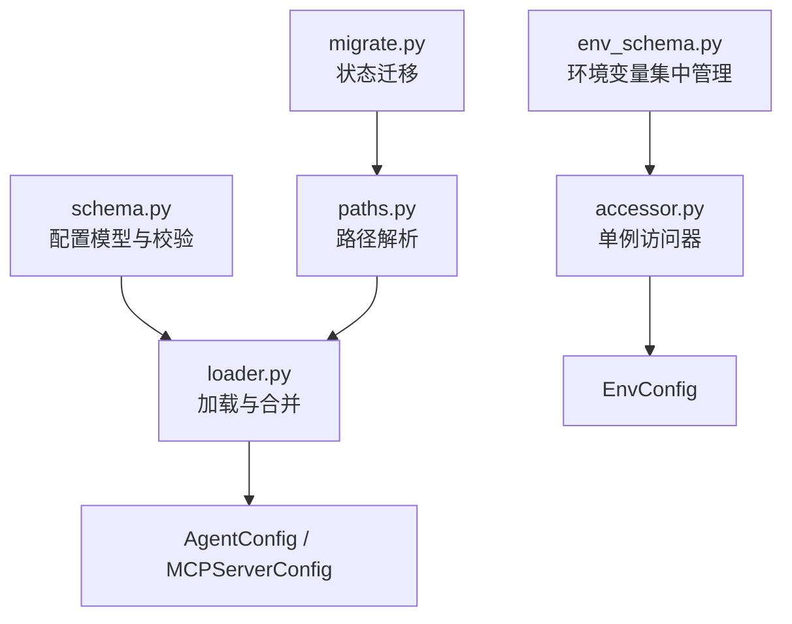
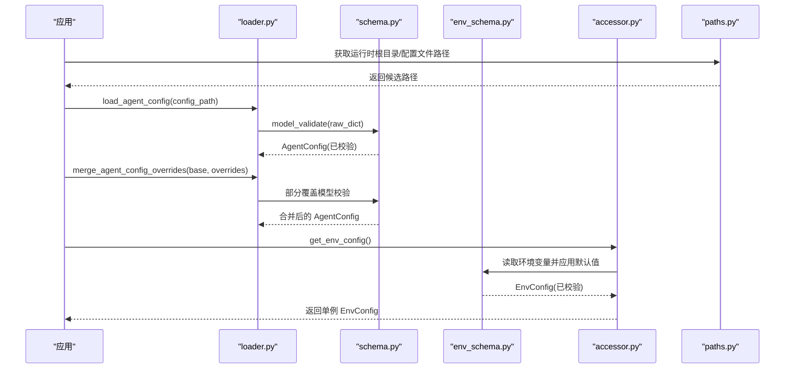
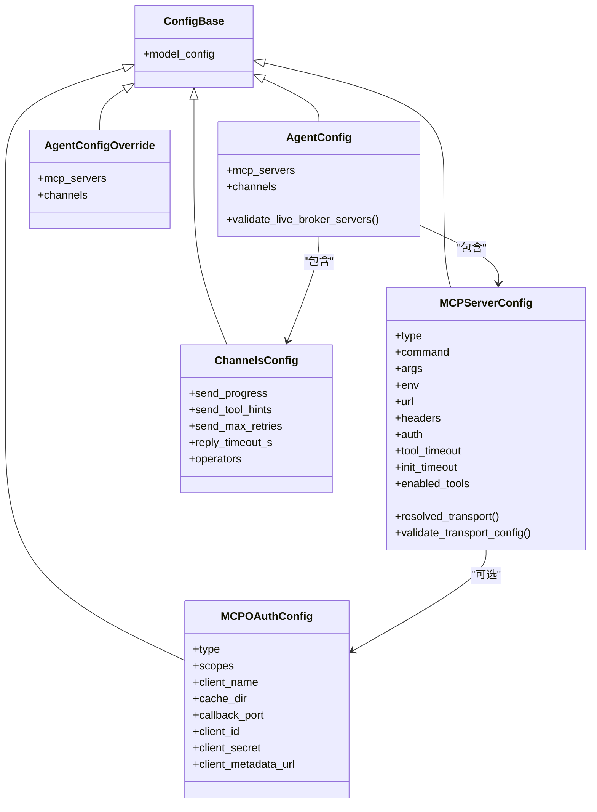
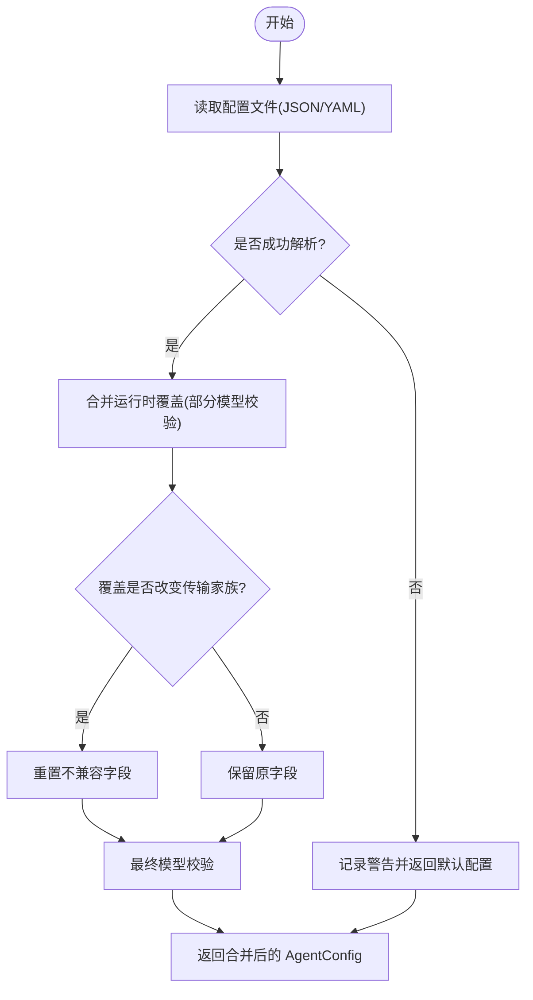
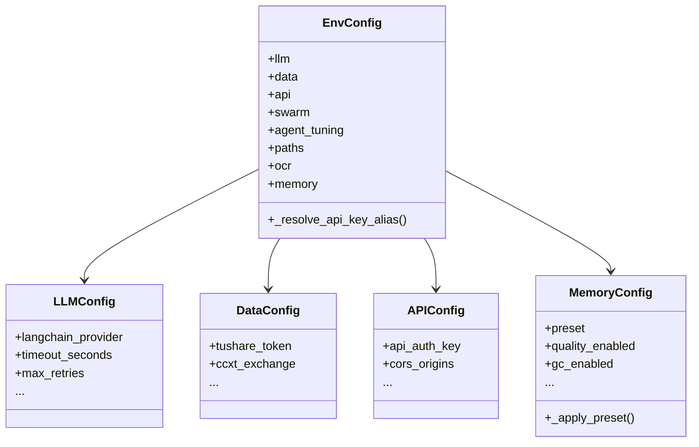
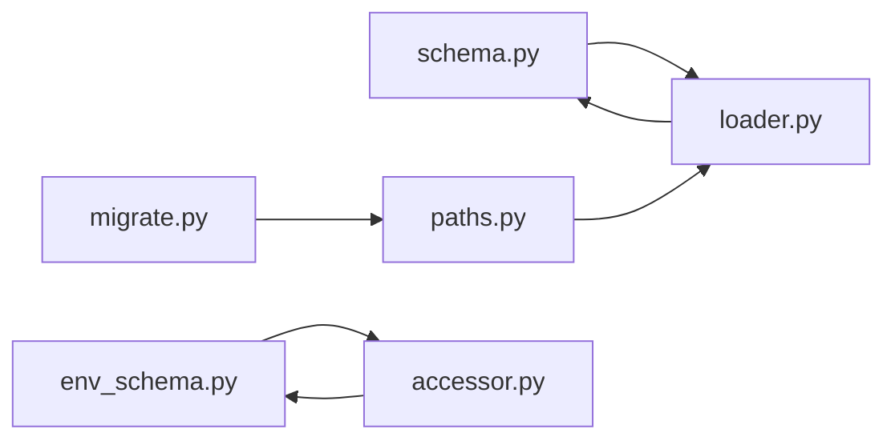

# 参数配置系统

<cite>
**本文引用的文件**
- [agent/src/config/__init__.py](file://agent/src/config/__init__.py)
- [agent/src/config/schema.py](file://agent/src/config/schema.py)
- [agent/src/config/loader.py](file://agent/src/config/loader.py)
- [agent/src/config/env_schema.py](file://agent/src/config/env_schema.py)
- [agent/src/config/paths.py](file://agent/src/config/paths.py)
- [agent/src/config/accessor.py](file://agent/src/config/accessor.py)
- [agent/src/config/migrate.py](file://agent/src/config/migrate.py)
- [agent/tests/test_agent_config.py](file://agent/tests/test_agent_config.py)
- [agent/tests/test_env_schema.py](file://agent/tests/test_env_schema.py)
</cite>

## 目录
1. [简介](#简介)
2. [项目结构](#项目结构)
3. [核心组件](#核心组件)
4. [架构总览](#架构总览)
5. [详细组件分析](#详细组件分析)
6. [依赖关系分析](#依赖关系分析)
7. [性能考虑](#性能考虑)
8. [故障排查指南](#故障排查指南)
9. [结论](#结论)
10. [附录](#附录)

## 简介
本技术文档系统化阐述 Vibe-Trading 的参数配置体系，覆盖以下目标：
- 参数验证机制：类型检查、范围校验、依赖关系校验（如传输方式与字段互斥）。
- 默认值处理：继承规则、条件默认值、环境变量注入。
- 配置层次与优先级：全局配置、策略配置、运行时参数的合并顺序。
- 配置热更新：增量更新、回滚支持、一致性保证。
- 配置模板与示例：可复制的 MCP 服务器种子配置与引导说明。
- 审计与版本控制：迁移工具对历史状态的安全迁移与恢复。
- 复杂配置的组织和维护：MCP 安全门控、通道配置、会话级覆盖与权限隔离。

## 项目结构
配置子系统位于 agent/src/config 下，采用“模式定义 + 加载器 + 路径/访问器 + 迁移”的分层组织：
- schema.py：Pydantic 模型定义，承载所有结构化配置与校验逻辑。
- loader.py：从磁盘加载 JSON/YAML，并合并运行时覆盖；提供会话级安全过滤。
- env_schema.py：集中管理所有环境变量及其默认值、类型转换与别名兼容。
- paths.py：运行时根目录、配置文件候选路径、数据目录等路径解析。
- accessor.py：EnvConfig 的单例访问器，提供线程安全的缓存与重置能力。
- migrate.py：将旧版代码相对路径下的状态迁移到新的运行时根目录，具备原子性与可恢复性。

**图示来源**
- [agent/src/config/schema.py:301-513](file://agent/src/config/schema.py#L301-L513)
- [agent/src/config/loader.py:28-151](file://agent/src/config/loader.py#L28-L151)
- [agent/src/config/env_schema.py:685-716](file://agent/src/config/env_schema.py#L685-L716)
- [agent/src/config/paths.py:13-87](file://agent/src/config/paths.py#L13-L87)
- [agent/src/config/migrate.py:114-153](file://agent/src/config/migrate.py#L114-L153)

**章节来源**
- [agent/src/config/__init__.py:1-25](file://agent/src/config/__init__.py#L1-L25)
- [agent/src/config/schema.py:301-513](file://agent/src/config/schema.py#L301-L513)
- [agent/src/config/loader.py:28-151](file://agent/src/config/loader.py#L28-L151)
- [agent/src/config/env_schema.py:685-716](file://agent/src/config/env_schema.py#L685-L716)
- [agent/src/config/paths.py:13-87](file://agent/src/config/paths.py#L13-L87)
- [agent/src/config/accessor.py:52-93](file://agent/src/config/accessor.py#L52-L93)
- [agent/src/config/migrate.py:114-153](file://agent/src/config/migrate.py#L114-L153)

## 核心组件
- 结构化配置模型（schema）：使用 Pydantic 进行强类型校验、范围约束、自定义验证器（如传输方式与字段的互斥、实时券商白名单限制）。
- 配置加载与合并（loader）：支持 JSON/YAML 读取、运行时覆盖合并、会话级敏感键剥离、MCP 服务器覆盖时的传输切换保护。
- 环境变量配置（env_schema）：集中声明所有环境变量、默认值、类型转换、别名兼容与预设开关（如内存功能预设）。
- 路径解析（paths）：统一解析运行时根目录、配置文件候选、数据目录与工作区路径。
- 访问器（accessor）：EnvConfig 的单例缓存与线程安全重置，便于设置 API 动态更新后生效。
- 迁移（migrate）：将旧版状态目录安全迁移至新运行时根目录，支持中断恢复与原子重命名。

**章节来源**
- [agent/src/config/schema.py:301-513](file://agent/src/config/schema.py#L301-L513)
- [agent/src/config/loader.py:28-151](file://agent/src/config/loader.py#L28-L151)
- [agent/src/config/env_schema.py:81-124](file://agent/src/config/env_schema.py#L81-L124)
- [agent/src/config/paths.py:13-87](file://agent/src/config/paths.py#L13-L87)
- [agent/src/config/accessor.py:52-93](file://agent/src/config/accessor.py#L52-L93)
- [agent/src/config/migrate.py:57-103](file://agent/src/config/migrate.py#L57-L103)

## 架构总览
配置系统由“静态配置 + 环境变量 + 运行时覆盖”三层组成，通过 Pydantic 模型在加载阶段完成类型与业务校验，并在合并阶段确保安全性与一致性。

**图示来源**
- [agent/src/config/loader.py:28-151](file://agent/src/config/loader.py#L28-L151)
- [agent/src/config/schema.py:301-513](file://agent/src/config/schema.py#L301-L513)
- [agent/src/config/env_schema.py:685-716](file://agent/src/config/env_schema.py#L685-L716)
- [agent/src/config/accessor.py:52-93](file://agent/src/config/accessor.py#L52-L93)
- [agent/src/config/paths.py:13-87](file://agent/src/config/paths.py#L13-L87)

## 详细组件分析

### 配置模型与验证（schema）
- 基础模型与别名支持：BaseModel 启用 snake_case 与 camelCase 双写兼容，extra="forbid" 严格拒绝未知字段。
- 传输方式与字段互斥：MCPServerConfig.resolved_transport 根据显式 type 或隐含字段推断传输；validate_transport_config 强制：
  - stdio 必须提供 command，且不允许 url/headers/auth。
  - HTTP 传输必须提供 url，且禁止 command/args/env；若启用 auth，则必须 HTTPS 且禁止静态 headers。
- 实时券商安全门控：AgentConfig.validate_live_broker_servers 检测 live broker（按 key 或 URL host），拒绝 wildcard enabled_tools=["*"]，仅允许特定只读探测场景（如 IBKR 的 mcp.read 范围）。
- 通道配置：ChannelsConfig 提供全局发送选项、重试次数、回复超时与操作者白名单。
- 覆盖模型：AgentConfigOverride/MCPServerConfigOverride 用于运行时层叠，extra="ignore" 避免无关键导致整体覆盖失败。

**图示来源**
- [agent/src/config/schema.py:301-513](file://agent/src/config/schema.py#L301-L513)

**章节来源**
- [agent/src/config/schema.py:301-513](file://agent/src/config/schema.py#L301-L513)

### 配置加载与合并（loader）
- 加载流程：load_agent_config 读取 JSON/YAML，失败时降级为默认空配置；load_runtime_agent_config 在此基础上合并运行时覆盖。
- 覆盖合并：merge_agent_config_overrides 先以部分模型校验覆盖字典，再执行深度合并；对 mcp_servers 做特殊处理，当覆盖改变传输家族时重置不兼容字段。
- 会话级安全：sanitize_session_overrides 移除 mcpServers/mcp_servers 等高风险键，除非显式开启 ALLOW_SESSION_MCP_SERVERS。
- 多格式支持：_read_config_file 支持 .json/.yaml/.yml，YAML 缺失时抛出明确错误。

**图示来源**
- [agent/src/config/loader.py:28-151](file://agent/src/config/loader.py#L28-L151)
- [agent/src/config/loader.py:262-345](file://agent/src/config/loader.py#L262-L345)

**章节来源**
- [agent/src/config/loader.py:28-151](file://agent/src/config/loader.py#L28-L151)
- [agent/src/config/loader.py:262-345](file://agent/src/config/loader.py#L262-L345)

### 环境变量配置（env_schema）
- 集中声明：EnvConfig 组合 LLM/Data/API/Swarm/AgentTuning/Path/Ocr/Memory 子配置，每个子配置通过 Field(alias=...) 绑定环境变量名。
- 类型与默认值：内置 BeforeValidator 实现字符串到布尔/数值的安全转换；无效值静默回退到默认值，避免启动崩溃。
- 预设与覆盖：MemoryConfig 支持 VT_MEMORY=off|on|full 预设，并通过 VT_MEMORY_* 单项覆盖。
- 别名兼容：APIConfig 在 _resolve_api_key_alias 中将 VIBE_TRADING_API_KEY 复制到 api_auth_key，保持 CLI 与服务端一致。

**图示来源**
- [agent/src/config/env_schema.py:685-716](file://agent/src/config/env_schema.py#L685-L716)
- [agent/src/config/env_schema.py:132-214](file://agent/src/config/env_schema.py#L132-L214)
- [agent/src/config/env_schema.py:326-375](file://agent/src/config/env_schema.py#L326-L375)
- [agent/src/config/env_schema.py:601-677](file://agent/src/config/env_schema.py#L601-L677)

**章节来源**
- [agent/src/config/env_schema.py:81-124](file://agent/src/config/env_schema.py#L81-L124)
- [agent/src/config/env_schema.py:685-716](file://agent/src/config/env_schema.py#L685-L716)

### 路径解析（paths）
- 运行时根目录：优先使用显式 config_path 的父目录，其次 VIBE_TRADING_HOME，最后 ~/.vibe-trading。
- 配置文件候选：按 agent.json -> agent.yaml -> agent.yml 顺序查找，不存在时返回推荐默认 JSON 路径。
- 数据目录与工作区：get_data_dir 自动创建；get_workspace_path 返回 channel 状态持久化目录。

**章节来源**
- [agent/src/config/paths.py:13-87](file://agent/src/config/paths.py#L13-L87)
- [agent/src/config/paths.py:90-113](file://agent/src/config/paths.py#L90-L113)

### 访问器（accessor）
- 单例缓存：get_env_config 首次调用创建 EnvConfig 并缓存，后续直接返回；线程安全通过模块级锁实现。
- 动态重置：reset_env_config 清空缓存，使下一次读取反映最新的环境变量变更（适用于 Settings API 写入 .env 后刷新）。
- 辅助函数：_parse_bool、get_env_or、get_env_value 提供统一的布尔解析与别名读取能力。

**章节来源**
- [agent/src/config/accessor.py:52-93](file://agent/src/config/accessor.py#L52-L93)
- [agent/src/config/accessor.py:95-149](file://agent/src/config/accessor.py#L95-L149)

### 迁移（migrate）
- 迁移目标：将 sessions/runs/swarm/runs/uploads 从旧代码相对路径迁移到新的运行时根目录。
- 原子性与恢复：使用 .migrating-* 临时名称 + 原子 rename；中断后可恢复未完成迁移。
- 幂等与安全：跳过 Python 包目录；冲突项记录警告；单个目录失败不影响其他目录。

**章节来源**
- [agent/src/config/migrate.py:114-153](file://agent/src/config/migrate.py#L114-L153)
- [agent/src/config/migrate.py:57-103](file://agent/src/config/migrate.py#L57-L103)

## 依赖关系分析
- schema 依赖 Pydantic BaseModel/Field/model_validator，提供强类型与自定义校验。
- loader 依赖 schema 与 paths，负责读取与合并配置。
- env_schema 被 accessor 消费，提供线程安全的单例访问。
- migrate 依赖 paths 确定新旧路径，确保状态迁移的正确性。

**图示来源**
- [agent/src/config/schema.py:301-513](file://agent/src/config/schema.py#L301-L513)
- [agent/src/config/loader.py:28-151](file://agent/src/config/loader.py#L28-L151)
- [agent/src/config/env_schema.py:685-716](file://agent/src/config/env_schema.py#L685-L716)
- [agent/src/config/paths.py:13-87](file://agent/src/config/paths.py#L13-L87)
- [agent/src/config/migrate.py:114-153](file://agent/src/config/migrate.py#L114-L153)

**章节来源**
- [agent/src/config/schema.py:301-513](file://agent/src/config/schema.py#L301-L513)
- [agent/src/config/loader.py:28-151](file://agent/src/config/loader.py#L28-L151)
- [agent/src/config/env_schema.py:685-716](file://agent/src/config/env_schema.py#L685-L716)
- [agent/src/config/paths.py:13-87](file://agent/src/config/paths.py#L13-L87)
- [agent/src/config/migrate.py:114-153](file://agent/src/config/migrate.py#L114-L153)

## 性能考虑
- 配置加载失败快速降级：IO/解析/校验异常均记录日志并返回默认配置，避免启动阻塞。
- 环境变量读取集中化：减少分散的 os.getenv 调用，降低重复解析开销。
- 单例访问器：EnvConfig 缓存避免重复构建与校验，提升并发访问性能。
- 合并优化：对 mcp_servers 的传输切换进行最小化重置，避免不必要的字段重建。

[本节为通用指导，无需具体文件引用]

## 故障排查指南
- 配置文件无法解析：检查文件格式（JSON/YAML）、对象顶层是否为 dict；查看警告日志中的异常类型与详情。
- 传输配置冲突：HTTP 传输需显式 type 且必须 HTTPS；stdio 传输需提供 command 且不可带 url/headers/auth。
- 实时券商 wildcard 拒绝：live broker 的 enabled_tools 不能为 ["*"]，需显式列出只读工具或使用受支持的只读探测。
- 环境变量未生效：确认 alias 正确；如需动态更新，调用 reset_env_config 刷新单例。
- 迁移中断：检查 .migrating-* 残留，系统会在下次运行自动恢复；如有冲突，手动清理或重命名。

**章节来源**
- [agent/src/config/loader.py:28-151](file://agent/src/config/loader.py#L28-L151)
- [agent/src/config/schema.py:419-457](file://agent/src/config/schema.py#L419-L457)
- [agent/src/config/schema.py:514-548](file://agent/src/config/schema.py#L514-L548)
- [agent/src/config/accessor.py:79-93](file://agent/src/config/accessor.py#L79-L93)
- [agent/src/config/migrate.py:57-103](file://agent/src/config/migrate.py#L57-L103)

## 结论
该参数配置系统通过 Pydantic 强类型模型、集中化的环境变量管理与严格的加载合并流程，实现了高内聚、低耦合的配置治理。其安全门控（实时券商限制、会话级敏感键剥离）、热更新（单例缓存与重置）、迁移（原子性与恢复）共同保障了生产环境的稳定性与可维护性。建议在生产部署中：
- 使用 schema 提供的种子配置与引导信息，避免误配。
- 通过环境变量集中管理密钥与开关，结合 accessor 的动态刷新能力。
- 定期审查 mcp_servers 的 enabled_tools 列表，遵循最小权限原则。
- 利用迁移工具完成历史状态平滑升级，关注日志中的冲突与恢复提示。

[本节为总结性内容，无需具体文件引用]

## 附录

### 配置层次与优先级
- 全局配置：~/.vibe-trading/agent.json 或 YAML，作为基线配置。
- 策略配置：swarm-agent.json（若存在）为集群专用覆盖，可与主配置分离。
- 运行时参数：session-level overrides，经 sanitize_session_overrides 过滤后合并。
- 环境变量：EnvConfig 提供全量环境变量映射，优先级高于默认值，可通过 accessor 动态刷新。

**章节来源**
- [agent/src/config/loader.py:154-229](file://agent/src/config/loader.py#L154-L229)
- [agent/src/config/loader.py:107-134](file://agent/src/config/loader.py#L107-L134)
- [agent/src/config/env_schema.py:685-716](file://agent/src/config/env_schema.py#L685-L716)

### 配置模板与示例
- Robinhood 只读 MCP 种子：提供可复制的 mcpServers 片段，含 OAuth 与只读工具白名单。
- IBKR 只读探测种子：允许在 mcp.read 范围内进行工具发现，需在获得写权限后改为显式白名单。
- 通道配置示例：channels.replyTimeoutS、channels.sendMaxRetries 等字段支持 snake_case 与 camelCase。

**章节来源**
- [agent/src/config/schema.py:189-237](file://agent/src/config/schema.py#L189-L237)
- [agent/tests/test_agent_config.py:72-116](file://agent/tests/test_agent_config.py#L72-L116)

### 配置审计与版本控制
- 迁移审计：migrate_legacy_state 记录迁移结果与警告，支持中断恢复。
- 版本兼容：env_schema 提供别名兼容（如 OCR 模型字段迁移），避免破坏现有部署。
- 测试覆盖：test_env_schema 与 test_agent_config 验证默认值、类型转换、校验错误与行为一致性。

**章节来源**
- [agent/src/config/migrate.py:114-153](file://agent/src/config/migrate.py#L114-L153)
- [agent/src/config/env_schema.py:295-318](file://agent/src/config/env_schema.py#L295-L318)
- [agent/tests/test_env_schema.py:69-178](file://agent/tests/test_env_schema.py#L69-L178)
- [agent/tests/test_agent_config.py:63-147](file://agent/tests/test_agent_config.py#L63-L147)