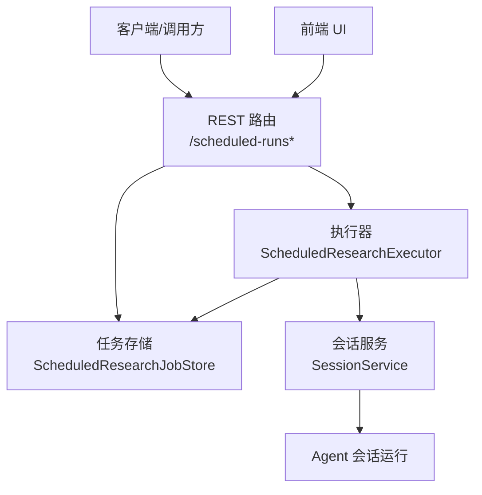
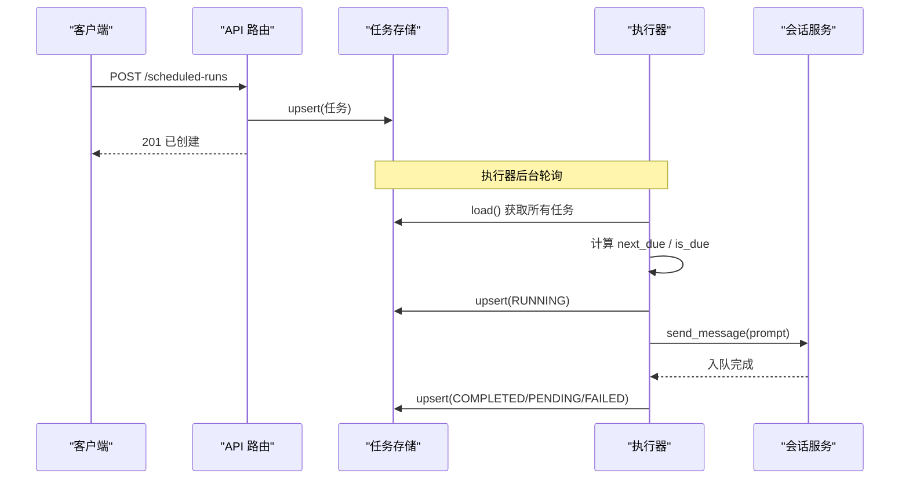
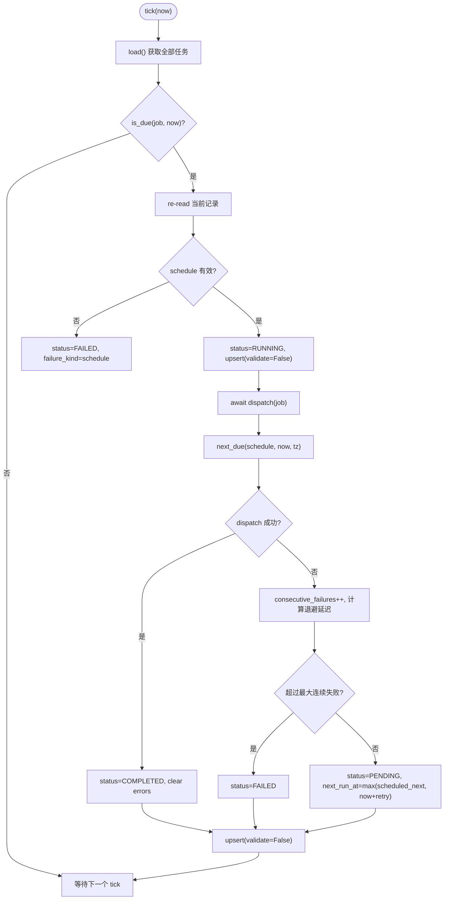
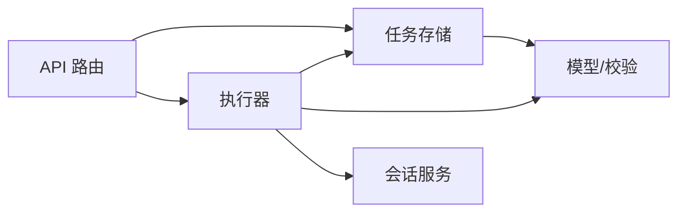
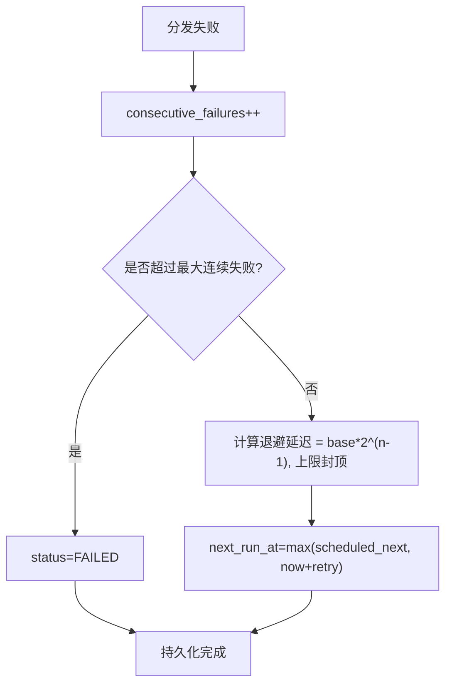

# 执行调度器

<cite>
**本文引用的文件**
- [executor.py](file://agent/src/scheduled_research/executor.py)
- [models.py](file://agent/src/scheduled_research/models.py)
- [store.py](file://agent/src/scheduled_research/store.py)
- [scheduled_routes.py](file://agent/src/api/scheduled_routes.py)
- [jobstore.py](file://agent/src/live/runtime/jobstore.py)
- [alpha_routes.py](file://agent/src/api/alpha_routes.py)
- [service.py](file://agent/src/session/service.py)
- [test_scheduled_research_executor.py](file://agent/tests/test_scheduled_research_executor.py)
- [test_scheduled_research_store.py](file://agent/tests/test_scheduled_research_store.py)
- [test_runtime_jobstore.py](file://agent/tests/test_runtime_jobstore.py)
- [cadence.ts](file://frontend/src/lib/cadence.ts)
- [en.json](file://frontend/src/i18n/locales/en.json)
- [zh-CN.json](file://frontend/src/i18n/locales/zh-CN.json)
</cite>

## 目录
1. [简介](#简介)
2. [项目结构](#项目结构)
3. [核心组件](#核心组件)
4. [架构总览](#架构总览)
5. [详细组件分析](#详细组件分析)
6. [依赖关系分析](#依赖关系分析)
7. [性能与并发控制](#性能与并发控制)
8. [重试、退避与熔断保护](#重试退避与熔断保护)
9. [调度策略与模式](#调度策略与模式)
10. [配置与监控接口](#配置与监控接口)
11. [故障诊断与排错指南](#故障诊断与排错指南)
12. [结论](#结论)

## 简介
本文件面向“执行调度器”的技术文档，围绕任务队列管理（优先级调度、负载均衡、死信/失败处理）、并发控制（线程池、信号量、资源隔离）、重试机制（指数退避、失败统计、熔断保护）、调度策略（定时、事件驱动、依赖调度）以及配置与监控接口进行系统化说明。内容基于仓库中“定时研究任务”的持久化调度实现与相关 API、存储、前端展示等代码进行分析与归纳。

## 项目结构
调度器由“API 路由层 + 执行器 + 模型/校验 + 持久化存储 + 会话派发 + 前端展示”构成：
- API 路由层：提供创建、查询、删除定时任务的 REST 接口，并负责启动/停止后台执行器。
- 执行器：后台轮询任务存储，计算下次触发时间，分发到会话服务执行。
- 模型与校验：定义任务状态、调度表达式语法与时区语义。
- 持久化存储：原子写入、损坏隔离、崩溃恢复。
- 会话派发：将任务作为新的 Agent 会话消息入队。
- 前端：定时任务列表、状态、错误信息、国际化文案与调度描述解析。

**图表来源**
- [scheduled_routes.py:259-335](file://agent/src/api/scheduled_routes.py#L259-L335)
- [executor.py:160-239](file://agent/src/scheduled_research/executor.py#L160-L239)
- [store.py:59-166](file://agent/src/scheduled_research/store.py#L59-L166)
- [scheduled_routes.py:60-82](file://agent/src/api/scheduled_routes.py#L60-L82)

**章节来源**
- [scheduled_routes.py:259-335](file://agent/src/api/scheduled_routes.py#L259-L335)
- [executor.py:160-239](file://agent/src/scheduled_research/executor.py#L160-L239)
- [store.py:59-166](file://agent/src/scheduled_research/store.py#L59-L166)

## 核心组件
- 定时任务模型与调度语法
  - 支持两种调度形式：毫秒间隔或 5 字段 cron；cron 按 IANA 时区的挂钟时间求值，DST 切换遵循“跳过不存在时刻、重复时刻仅首次执行”。
  - 任务状态机：待运行、运行中、已完成、失败、已取消；失败包含连续失败计数、最近错误、失败类型（调度/分发）。
- 执行器
  - 后台循环以固定间隔 tick，筛选到期任务，标记为运行中，调用分发回调，更新下次触发时间与状态。
  - 支持从上次运行的“悬挂运行”状态恢复，避免重启后丢失任务。
- 持久化存储
  - 原子写入（临时文件 + fsync + replace + 父目录 fsync），损坏文件隔离，读取时拒绝空启动。
- API 路由
  - 创建/列出/删除定时任务；从模板创建任务；根据环境变量决定是否启动执行器。
- 会话派发
  - 将任务 prompt 作为新会话消息发送，返回“已入队”即视为成功。

**章节来源**
- [models.py:182-233](file://agent/src/scheduled_research/models.py#L182-L233)
- [executor.py:64-141](file://agent/src/scheduled_research/executor.py#L64-L141)
- [executor.py:266-310](file://agent/src/scheduled_research/executor.py#L266-L310)
- [store.py:85-166](file://agent/src/scheduled_research/store.py#L85-L166)
- [scheduled_routes.py:60-103](file://agent/src/api/scheduled_routes.py#L60-L103)

## 架构总览
下图展示了从 API 创建任务到执行器触发、再到会话派发的完整流程，以及存储的原子性与恢复能力。

**图表来源**
- [scheduled_routes.py:259-335](file://agent/src/api/scheduled_routes.py#L259-L335)
- [executor.py:266-415](file://agent/src/scheduled_research/executor.py#L266-L415)
- [store.py:110-166](file://agent/src/scheduled_research/store.py#L110-L166)
- [scheduled_routes.py:60-82](file://agent/src/api/scheduled_routes.py#L60-L82)

## 详细组件分析

### 执行器 ScheduledResearchExecutor
- 职责
  - 后台循环 tick：加载任务、过滤到期任务、逐个执行分发回调、更新状态与下次触发时间。
  - 恢复悬挂运行：启动时扫描 RUNNING 状态的任务，重置为 PENDING，确保重启后可继续调度。
  - 调度推进：根据 schedule 与 timezone 计算下一次触发时间；区间调度忽略时区，cron 使用挂钟时间。
  - 失败与重试：记录连续失败次数，按指数退避设置下次触发时间；达到阈值则置为 FAILED。
- 关键行为
  - 在分发前重新读取当前记录，防止被用户删除或替换导致误复活。
  - 生命周期写入（RUNNING/COMPLETED/FAILED）绕过强校验，保证已存在记录的写回不阻塞。
  - 错误信息脱敏与长度限制，避免敏感信息与超大错误串落盘。

**图表来源**
- [executor.py:266-415](file://agent/src/scheduled_research/executor.py#L266-L415)

**章节来源**
- [executor.py:160-239](file://agent/src/scheduled_research/executor.py#L160-L239)
- [executor.py:266-415](file://agent/src/scheduled_research/executor.py#L266-L415)
- [executor.py:763-769](file://agent/src/scheduled_research/executor.py#L763-L769)

### 模型与调度语法 models
- 调度表达式
  - 区间：正整数毫秒字符串。
  - Cron：5 字段（分 时 日 月 周），支持 *、*/n、数字、范围与逗号列表。
  - 时区：可选 IANA 键；未指定时按 UTC 语义；cron 在挂钟时间求值，DST 规则明确。
- 状态枚举
  - pending、running、completed、failed、cancelled。
- 数据类
  - 包含 id、prompt、schedule、next_run_at、status、created_at、last_run_at、consecutive_failures、last_error、failure_kind、config、timezone。
  - 序列化/反序列化具备严格类型检查与兼容旧字段策略。

**章节来源**
- [models.py:27-42](file://agent/src/scheduled_research/models.py#L27-L42)
- [models.py:69-139](file://agent/src/scheduled_research/models.py#L69-L139)
- [models.py:142-176](file://agent/src/scheduled_research/models.py#L142-L176)
- [models.py:182-233](file://agent/src/scheduled_research/models.py#L182-L233)
- [models.py:235-328](file://agent/src/scheduled_research/models.py#L235-L328)

### 持久化存储 store
- 原子写入
  - 同目录临时文件 -> fsync -> os.replace -> 父目录 fsync，保证崩溃一致性。
- 损坏隔离
  - 无法解析的文件会被重命名为带时间戳的隔离文件，并抛出专用异常，避免静默空启动。
- 读写接口
  - load/save/upsert/get/list_jobs/delete；upsert 支持跳过校验用于生命周期写回。

**章节来源**
- [store.py:1-10](file://agent/src/scheduled_research/store.py#L1-L10)
- [store.py:59-166](file://agent/src/scheduled_research/store.py#L59-L166)
- [store.py:179-216](file://agent/src/scheduled_research/store.py#L179-L216)
- [store.py:222-255](file://agent/src/scheduled_research/store.py#L222-L255)

### API 路由 scheduled_routes
- 功能
  - POST /scheduled-runs：创建或替换任务，校验 schedule/timezone，计算首次触发时间。
  - GET /scheduled-runs：列出任务，支持按状态过滤与分页限制。
  - DELETE /scheduled-runs/{job_id}：删除任务。
  - 模板相关：/scheduled-runs/playbooks/* 提供模板列表与按模板创建任务。
- 执行器启停
  - 通过环境变量启用后台执行器；模块级单例懒初始化。
- 会话派发
  - 将任务 prompt 发送到会话服务的新会话，返回“已入队”即认为分发成功。

**章节来源**
- [scheduled_routes.py:45-103](file://agent/src/api/scheduled_routes.py#L45-L103)
- [scheduled_routes.py:117-224](file://agent/src/api/scheduled_routes.py#L117-L224)
- [scheduled_routes.py:259-335](file://agent/src/api/scheduled_routes.py#L259-L335)
- [scheduled_routes.py:337-365](file://agent/src/api/scheduled_routes.py#L337-L365)
- [scheduled_routes.py:375-482](file://agent/src/api/scheduled_routes.py#L375-L482)

### 前端展示 cadence 与 i18n
- 调度描述解析
  - 前端对后端存储的 schedule 进行无损解析，保持与后端一致的语义，避免 DST 转换导致的显示偏差。
- 国际化文案
  - 提供定时任务相关的多语言文案，包括状态、提示、操作按钮等。

**章节来源**
- [cadence.ts:1-33](file://frontend/src/lib/cadence.ts#L1-L33)
- [en.json:139-168](file://frontend/src/i18n/locales/en.json#L139-L168)
- [zh-CN.json:139-169](file://frontend/src/i18n/locales/zh-CN.json#L139-L169)

## 依赖关系分析
- 组件耦合
  - API 路由依赖存储与执行器；执行器依赖存储与调度模型；存储依赖路径与模型；会话派发依赖宿主模块暴露的服务。
- 外部依赖
  - 时区库 zoneinfo；FastAPI/Pydantic；异步事件循环；文件系统原子操作。
- 潜在环依赖
  - 通过模块内延迟导入避免 import-time 环依赖（如执行器、存储、会话服务）。

**图表来源**
- [scheduled_routes.py:84-95](file://agent/src/api/scheduled_routes.py#L84-L95)
- [executor.py:160-174](file://agent/src/scheduled_research/executor.py#L160-L174)
- [store.py:59-80](file://agent/src/scheduled_research/store.py#L59-L80)

**章节来源**
- [scheduled_routes.py:84-95](file://agent/src/api/scheduled_routes.py#L84-L95)
- [executor.py:160-174](file://agent/src/scheduled_research/executor.py#L160-L174)
- [store.py:59-80](file://agent/src/scheduled_research/store.py#L59-L80)

## 性能与并发控制
- 后台执行器
  - 单任务串行分发，避免同一 tick 内的竞争；通过 asyncio.Event 实现可中断睡眠，提升关闭响应性。
- 进程级并发上限
  - 其他 API（如基准测试）使用信号量限制并发，防止资源耗尽；该模式可作为调度器扩展参考。
- 线程池
  - 会话服务使用有限线程池执行 Agent 循环，避免默认执行器被耗尽。
- 存储 IO
  - 原子写入与父目录 fsync 降低崩溃风险；读取时若损坏则隔离并报错，避免静默失败。

**章节来源**
- [executor.py:312-339](file://agent/src/scheduled_research/executor.py#L312-L339)
- [alpha_routes.py:61-95](file://agent/src/api/alpha_routes.py#L61-L95)
- [service.py:30-45](file://agent/src/session/service.py#L30-L45)
- [store.py:110-166](file://agent/src/scheduled_research/store.py#L110-L166)

## 重试、退避与熔断保护
- 指数退避
  - 分发失败时，按连续失败次数计算退避延迟，上限受最大延迟限制；成功则重置失败计数。
- 失败统计
  - 记录 consecutive_failures、last_error、failure_kind；错误信息脱敏与长度限制。
- 熔断保护
  - 达到最大连续失败阈值后，任务进入 FAILED 终止态，避免无限重试。
- 测试覆盖
  - 验证瞬态失败后恢复、重复失败进入终止、错误脱敏、过期窗口恢复等行为。

**图表来源**
- [executor.py:371-423](file://agent/src/scheduled_research/executor.py#L371-L423)

**章节来源**
- [executor.py:371-423](file://agent/src/scheduled_research/executor.py#L371-L423)
- [test_scheduled_research_executor.py:162-230](file://agent/tests/test_scheduled_research_executor.py#L162-L230)
- [test_scheduled_research_executor.py:234-263](file://agent/tests/test_scheduled_research_executor.py#L234-L263)

## 调度策略与模式
- 定时调度
  - 支持毫秒间隔与 5 字段 cron；cron 按 IANA 时区挂钟时间求值，DST 安全。
- 事件驱动
  - 通过会话服务将任务作为新会话消息入队，后续由 Agent 工作流驱动执行。
- 依赖调度
  - 通过模板与变量组织复杂工作流；结合上游上下文与工具链编排任务序列。

**章节来源**
- [executor.py:123-177](file://agent/src/scheduled_research/executor.py#L123-L177)
- [scheduled_routes.py:60-82](file://agent/src/api/scheduled_routes.py#L60-L82)
- [en.json:139-168](file://frontend/src/i18n/locales/en.json#L139-L168)

## 配置与监控接口
- 环境变量
  - VIBE_TRADING_ENABLE_SCHEDULER：启用/禁用后台执行器。
  - 其他调优参数（如最大连续失败、退避基线/上限）可从环境配置注入。
- REST 接口
  - POST /scheduled-runs：创建/替换任务。
  - GET /scheduled-runs：列出任务，支持 status 过滤与 limit。
  - DELETE /scheduled-runs/{job_id}：删除任务。
  - /scheduled-runs/playbooks/*：模板列表与按模板创建。
- 前端展示
  - 定时任务列表、状态、错误信息、下次运行时间；国际化文案支持。

**章节来源**
- [scheduled_routes.py:45-103](file://agent/src/api/scheduled_routes.py#L45-L103)
- [scheduled_routes.py:259-365](file://agent/src/api/scheduled_routes.py#L259-L365)
- [scheduled_routes.py:375-482](file://agent/src/api/scheduled_routes.py#L375-L482)
- [en.json:139-168](file://frontend/src/i18n/locales/en.json#L139-L168)
- [zh-CN.json:139-169](file://frontend/src/i18n/locales/zh-CN.json#L139-L169)

## 故障诊断与排错指南
- 常见问题定位
  - 任务未触发：检查 is_due 条件、next_run_at 计算、时区有效性。
  - 任务反复失败：查看 consecutive_failures、last_error、failure_kind；确认是否达到熔断阈值。
  - 存储损坏：load 抛出自定义异常，隔离文件保留以便排查。
- 恢复与自愈
  - 执行器启动时自动恢复悬挂 RUNNING 任务为 PENDING。
  - 错过触发窗口后，按 persisted next_run_at 继续推进。
- 日志与观测
  - 执行器 tick 失败、调度推进失败、分发失败均记录日志；错误信息脱敏与长度限制。
- 相关测试用例
  - 验证瞬态失败重试、重复失败熔断、错误脱敏、悬挂恢复、错过窗口恢复等。

**章节来源**
- [executor.py:367-389](file://agent/src/scheduled_research/executor.py#L367-L389)
- [executor.py:340-415](file://agent/src/scheduled_research/executor.py#L340-L415)
- [store.py:85-109](file://agent/src/scheduled_research/store.py#L85-L109)
- [test_scheduled_research_executor.py:265-396](file://agent/tests/test_scheduled_research_executor.py#L265-L396)
- [test_scheduled_research_store.py:273-302](file://agent/tests/test_scheduled_research_store.py#L273-L302)
- [test_runtime_jobstore.py:50-90](file://agent/tests/test_runtime_jobstore.py#L50-L90)

## 结论
该执行调度器以“持久化 + 原子存储 + 健壮的状态机”为核心，实现了可靠的定时调度与任务生命周期管理。其调度语法与时区语义清晰，重试与熔断机制完善，配合 API 与前端展示形成完整的端到端能力。对于更复杂的并发与资源隔离需求，可借鉴项目中信号量与线程池的使用方式进一步扩展。整体设计兼顾了可靠性、可观测性与易用性，适合在生产环境中稳定运行。