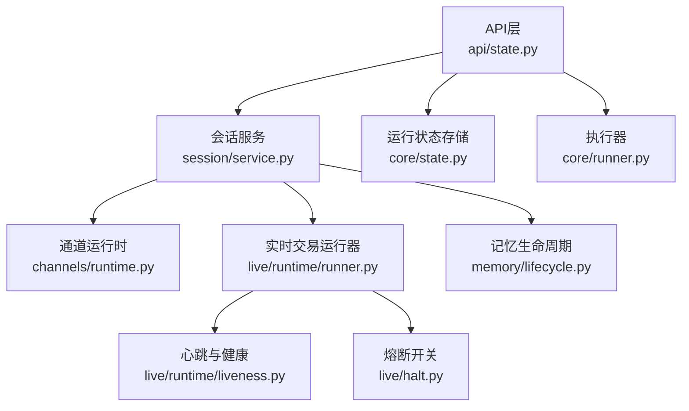
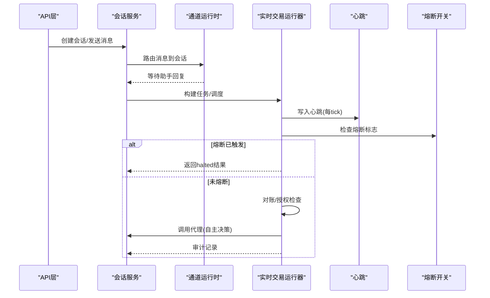
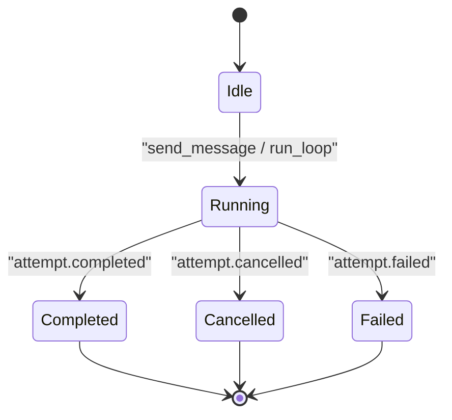
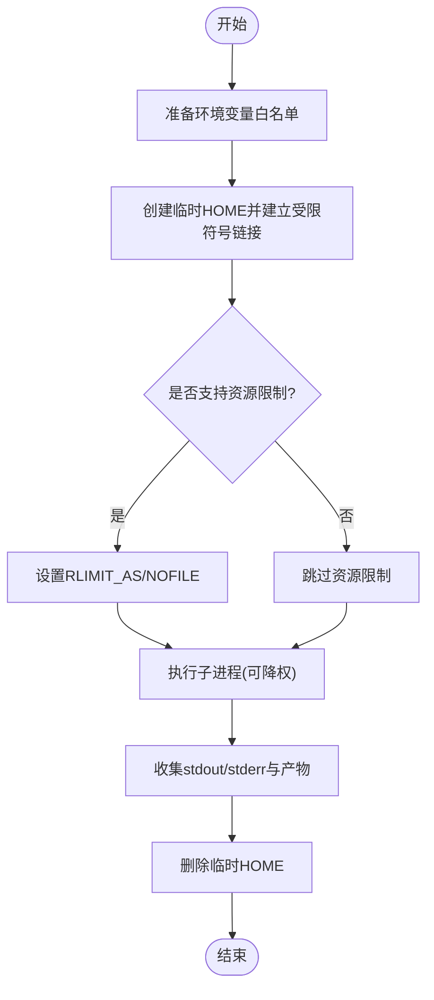
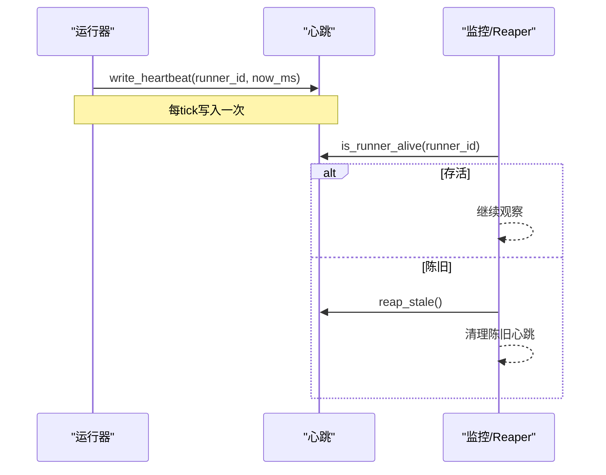
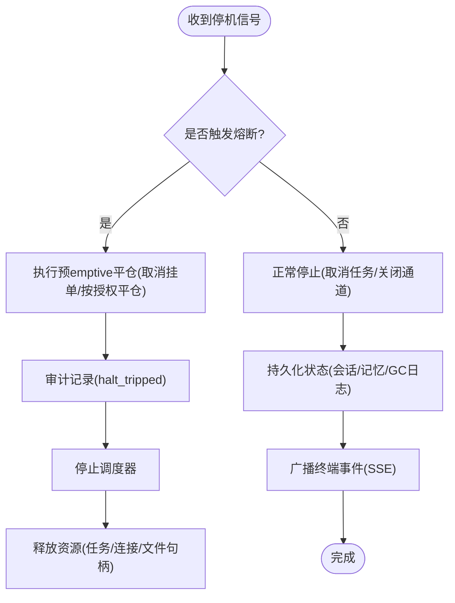
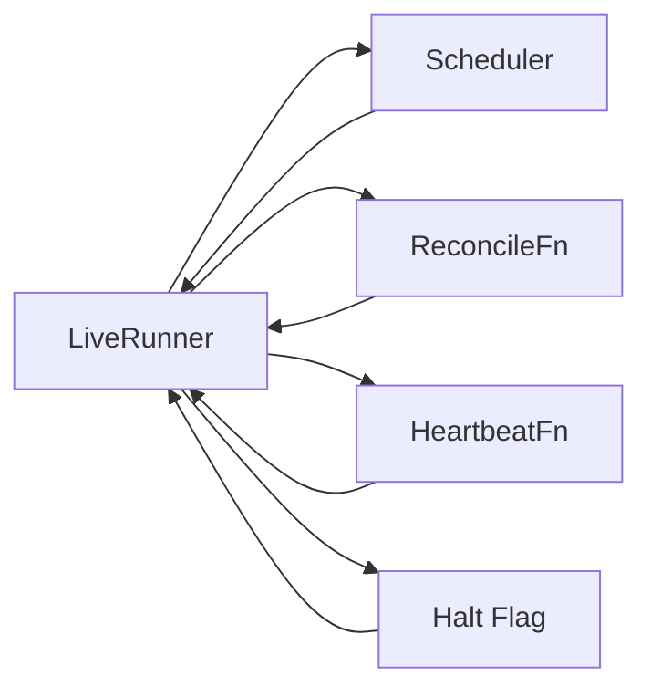

# 生命周期管理

<cite>
**本文引用的文件**
- [agent/src/core/state.py](file://agent/src/core/state.py)
- [agent/src/core/runner.py](file://agent/src/core/runner.py)
- [agent/src/memory/lifecycle.py](file://agent/src/memory/lifecycle.py)
- [agent/src/live/halt.py](file://agent/src/live/halt.py)
- [agent/src/api/state.py](file://agent/src/api/state.py)
- [agent/src/live/runtime/runner.py](file://agent/src/live/runtime/runner.py)
- [agent/src/session/service.py](file://agent/src/session/service.py)
- [agent/src/channels/runtime.py](file://agent/src/channels/runtime.py)
- [agent/src/live/runtime/liveness.py](file://agent/src/live/runtime/liveness.py)
</cite>

## 目录
1. [简介](#简介)
2. [项目结构](#项目结构)
3. [核心组件](#核心组件)
4. [架构总览](#架构总览)
5. [详细组件分析](#详细组件分析)
6. [依赖关系分析](#依赖关系分析)
7. [性能考量](#性能考量)
8. [故障排查指南](#故障排查指南)
9. [结论](#结论)
10. [附录](#附录)

## 简介
本技术文档聚焦于系统的“生命周期管理”，覆盖状态机设计（启动、运行、暂停、停止）、资源管理机制（内存、连接池、文件句柄等）、健康检查机制（心跳检测、依赖服务检查、指标监控）、优雅停机流程（事务回滚、数据持久化、通知发送）、生命周期钩子与扩展点、状态持久化与恢复，以及复杂场景下的管理模式。内容基于代码仓库中的实际实现进行梳理与可视化说明，帮助读者快速理解并安全地扩展系统生命周期行为。

## 项目结构
围绕生命周期管理的核心模块分布在以下路径：
- 会话与服务编排：session/service.py、api/state.py
- 实时交易运行器：live/runtime/runner.py、live/halt.py、live/runtime/liveness.py
- 通道运行时：channels/runtime.py
- 记忆生命周期：memory/lifecycle.py
- 运行状态与执行器：core/state.py、core/runner.py

**图表来源**
- [agent/src/api/state.py:29-111](file://agent/src/api/state.py#L29-L111)
- [agent/src/session/service.py:53-221](file://agent/src/session/service.py#L53-L221)
- [agent/src/channels/runtime.py:34-112](file://agent/src/channels/runtime.py#L34-L112)
- [agent/src/live/runtime/runner.py:288-441](file://agent/src/live/runtime/runner.py#L288-L441)
- [agent/src/live/runtime/liveness.py:79-150](file://agent/src/live/runtime/liveness.py#L79-L150)
- [agent/src/live/halt.py:72-163](file://agent/src/live/halt.py#L72-L163)
- [agent/src/memory/lifecycle.py:71-183](file://agent/src/memory/lifecycle.py#L71-L183)
- [agent/src/core/state.py:13-87](file://agent/src/core/state.py#L13-L87)
- [agent/src/core/runner.py:379-627](file://agent/src/core/runner.py#L379-L627)

**章节来源**
- [agent/src/api/state.py:29-111](file://agent/src/api/state.py#L29-L111)
- [agent/src/session/service.py:53-221](file://agent/src/session/service.py#L53-L221)
- [agent/src/channels/runtime.py:34-112](file://agent/src/channels/runtime.py#L34-L112)
- [agent/src/live/runtime/runner.py:288-441](file://agent/src/live/runtime/runner.py#L288-L441)
- [agent/src/live/runtime/liveness.py:79-150](file://agent/src/live/runtime/liveness.py#L79-L150)
- [agent/src/live/halt.py:72-163](file://agent/src/live/halt.py#L72-L163)
- [agent/src/memory/lifecycle.py:71-183](file://agent/src/memory/lifecycle.py#L71-L183)
- [agent/src/core/state.py:13-87](file://agent/src/core/state.py#L13-L87)
- [agent/src/core/runner.py:379-627](file://agent/src/core/runner.py#L379-L627)

## 核心组件
- 会话服务（SessionService）：负责会话创建、消息收发、尝试（Attempt）生命周期、事件总线广播、并发控制与取消。
- 通道运行时（ChannelRuntime）：将外部IM渠道消息路由到会话服务，维护会话映射、处理配对命令、超时等待回复。
- 实时交易运行器（LiveRunner）：按固定顺序执行每tick的“熔断→授权过期→对账→调用代理→审计”流程；支持调度器、触发器、心跳写入、预emptive平仓。
- 健康检查（Liveness）：原子写心跳文件，提供存活判断与陈旧清理。
- 熔断开关（Halt）：文件系统级全局或按经纪商停摆，支持元数据记录与动作钩子。
- 记忆生命周期（MemoryLifecycle）：质量评分、访问追踪、重要性衰减、垃圾回收与压缩。
- 运行状态（RunStateStore）：为每次运行创建目录、保存请求、标记成功/失败/取消。
- 执行器（Runner）：在沙箱中执行生成的策略脚本，收集日志与产物，限制资源与环境。

**章节来源**
- [agent/src/session/service.py:53-221](file://agent/src/session/service.py#L53-L221)
- [agent/src/channels/runtime.py:34-112](file://agent/src/channels/runtime.py#L34-L112)
- [agent/src/live/runtime/runner.py:288-441](file://agent/src/live/runtime/runner.py#L288-L441)
- [agent/src/live/runtime/liveness.py:79-150](file://agent/src/live/runtime/liveness.py#L79-L150)
- [agent/src/live/halt.py:72-163](file://agent/src/live/halt.py#L72-L163)
- [agent/src/memory/lifecycle.py:71-183](file://agent/src/memory/lifecycle.py#L71-L183)
- [agent/src/core/state.py:13-87](file://agent/src/core/state.py#L13-L87)
- [agent/src/core/runner.py:379-627](file://agent/src/core/runner.py#L379-L627)

## 架构总览
下图展示了从API到会话、通道、实时交易运行器的整体生命周期流，包括心跳、熔断、对账与审计。

**图表来源**
- [agent/src/api/state.py:29-111](file://agent/src/api/state.py#L29-L111)
- [agent/src/session/service.py:244-307](file://agent/src/session/service.py#L244-L307)
- [agent/src/channels/runtime.py:121-245](file://agent/src/channels/runtime.py#L121-L245)
- [agent/src/live/runtime/runner.py:407-441](file://agent/src/live/runtime/runner.py#L407-L441)
- [agent/src/live/runtime/liveness.py:79-150](file://agent/src/live/runtime/liveness.py#L79-L150)
- [agent/src/live/halt.py:135-163](file://agent/src/live/halt.py#L135-L163)

## 详细组件分析

### 状态机设计（启动、运行、暂停、停止）
- 会话服务状态机
  - 创建会话：初始化并持久化，索引搜索，发出“session.created”事件。
  - 发送消息：保留会话并发权，追加消息，创建尝试（Attempt），异步执行尝试。
  - 尝试状态：running → completed/cancelled/failed，最终通过SSE广播终端事件。
  - 取消：优先取消活跃循环，否则取消构建阶段的Task，释放并发锁。
- 通道运行时状态机
  - start：加载会话映射，可选启动平台适配器，启动消费循环。
  - stop：取消消费者与处理器任务，关闭管理器，确保资源释放。
  - 处理入站消息：配对命令、新会话命令、普通消息路由至会话服务，等待回复并回发。
- 实时交易运行器状态机
  - run_once：固定顺序执行“心跳→熔断→授权过期→对账→调用代理→审计”。
  - run_loop：根据调度器与触发器注册任务，重启时“重算而非恢复中间态”。
  - stop_loop：停止调度器（幂等）。

**图表来源**
- [agent/src/session/service.py:204-307](file://agent/src/session/service.py#L204-L307)
- [agent/src/channels/runtime.py:72-112](file://agent/src/channels/runtime.py#L72-L112)
- [agent/src/live/runtime/runner.py:407-441](file://agent/src/live/runtime/runner.py#L407-L441)

**章节来源**
- [agent/src/session/service.py:204-307](file://agent/src/session/service.py#L204-L307)
- [agent/src/channels/runtime.py:72-112](file://agent/src/channels/runtime.py#L72-L112)
- [agent/src/live/runtime/runner.py:407-441](file://agent/src/live/runtime/runner.py#L407-L441)

### 资源管理机制（内存、连接池、文件句柄）
- 沙箱执行环境
  - 环境变量白名单：仅允许必要的环境变量进入子进程，避免泄露敏感配置。
  - HOME隔离：为生成代码提供临时HOME，仅以符号链接暴露必要的缓存/配置目录。
  - 资源限制：POSIX下通过RLIMIT_AS与RLIMIT_NOFILE限制虚拟地址空间与文件描述符数量。
  - 用户降权：在具备能力时以专用用户运行子进程，增强安全性。
- 文件句柄与原子写
  - 心跳文件：原子写（同目录临时文件+os.replace），避免并发读取看到撕裂数据。
  - 运行状态：state.json使用fsync保证崩溃不留下截断状态。
  - 记忆GC：frontmatter字段更新采用原子替换策略，防止损坏。
- 内存与压缩
  - 质量评分与访问计数：受环境开关控制，会话内增量有上限，避免过度波动。
  - 垃圾回收：基于重要性阈值归档或删除，支持压缩管线，减少磁盘占用。

**图表来源**
- [agent/src/core/runner.py:352-361](file://agent/src/core/runner.py#L352-L361)
- [agent/src/core/runner.py:113-172](file://agent/src/core/runner.py#L113-L172)
- [agent/src/core/runner.py:85-110](file://agent/src/core/runner.py#L85-L110)
- [agent/src/core/runner.py:510-627](file://agent/src/core/runner.py#L510-L627)
- [agent/src/live/runtime/liveness.py:79-100](file://agent/src/live/runtime/liveness.py#L79-L100)
- [agent/src/core/state.py:79-87](file://agent/src/core/state.py#L79-L87)
- [agent/src/memory/lifecycle.py:323-421](file://agent/src/memory/lifecycle.py#L323-L421)

**章节来源**
- [agent/src/core/runner.py:352-361](file://agent/src/core/runner.py#L352-L361)
- [agent/src/core/runner.py:113-172](file://agent/src/core/runner.py#L113-L172)
- [agent/src/core/runner.py:85-110](file://agent/src/core/runner.py#L85-L110)
- [agent/src/core/runner.py:510-627](file://agent/src/core/runner.py#L510-L627)
- [agent/src/live/runtime/liveness.py:79-100](file://agent/src/live/runtime/liveness.py#L79-L100)
- [agent/src/core/state.py:79-87](file://agent/src/core/state.py#L79-L87)
- [agent/src/memory/lifecycle.py:323-421](file://agent/src/memory/lifecycle.py#L323-L421)

### 健康检查机制（心跳检测、依赖服务检查、性能指标监控）
- 心跳检测
  - 每tick写入runner_id的心跳文件，包含最近tick时间戳（毫秒）。
  - 提供存活判断与陈旧清理，用于外部监控与reaper。
- 依赖服务检查
  - 会话服务在构造时注入EventBus与SessionStore，通道运行时依赖MessageBus与ChannelManager。
  - 若会话运行时未启用，通道运行时将返回错误，避免空指针。
- 性能指标监控
  - 会话尝试完成后加载metrics.csv，作为响应元数据的一部分。
  - 通道运行时状态包含队列长度、会话数与渠道状态。

**图表来源**
- [agent/src/live/runtime/runner.py:550-564](file://agent/src/live/runtime/runner.py#L550-L564)
- [agent/src/live/runtime/liveness.py:79-150](file://agent/src/live/runtime/liveness.py#L79-L150)
- [agent/src/live/runtime/liveness.py:153-191](file://agent/src/live/runtime/liveness.py#L153-L191)
- [agent/src/session/service.py:567-581](file://agent/src/session/service.py#L567-L581)
- [agent/src/channels/runtime.py:104-112](file://agent/src/channels/runtime.py#L104-L112)

**章节来源**
- [agent/src/live/runtime/runner.py:550-564](file://agent/src/live/runtime/runner.py#L550-L564)
- [agent/src/live/runtime/liveness.py:79-150](file://agent/src/live/runtime/liveness.py#L79-L150)
- [agent/src/live/runtime/liveness.py:153-191](file://agent/src/live/runtime/liveness.py#L153-L191)
- [agent/src/session/service.py:567-581](file://agent/src/session/service.py#L567-L581)
- [agent/src/channels/runtime.py:104-112](file://agent/src/channels/runtime.py#L104-L112)

### 优雅停机流程（事务回滚、数据持久化、通知发送）
- 会话服务
  - 取消当前尝试：优先取消活跃AgentLoop，否则取消构建阶段Task，确保并发锁释放。
  - 终端事件：无论成功、取消或失败，均通过SSE广播对应事件，供前端与下游消费。
- 通道运行时
  - stop：取消消费者与处理器任务，关闭平台适配器，确保所有异步任务完成或忽略取消异常。
- 实时交易运行器
  - 熔断触发：一旦检测到HALT，立即执行一次性预emptive平仓（取消挂单、按授权平仓），并审计。
  - 授权过期：主动触发broker级别熔断，撤销权限，审计记录。
- 记忆生命周期
  - GC：归档或删除低重要性条目，必要时压缩，重建索引。
- 运行状态
  - 标记成功/失败/取消：持久化state.json，确保报告视图与聊天历史一致。

**图表来源**
- [agent/src/session/service.py:227-246](file://agent/src/session/service.py#L227-L246)
- [agent/src/channels/runtime.py:83-102](file://agent/src/channels/runtime.py#L83-L102)
- [agent/src/live/runtime/runner.py:544-595](file://agent/src/live/runtime/runner.py#L544-L595)
- [agent/src/memory/lifecycle.py:183-273](file://agent/src/memory/lifecycle.py#L183-L273)
- [agent/src/core/state.py:49-77](file://agent/src/core/state.py#L49-L77)

**章节来源**
- [agent/src/session/service.py:227-246](file://agent/src/session/service.py#L227-L246)
- [agent/src/channels/runtime.py:83-102](file://agent/src/channels/runtime.py#L83-L102)
- [agent/src/live/runtime/runner.py:544-595](file://agent/src/live/runtime/runner.py#L544-L595)
- [agent/src/memory/lifecycle.py:183-273](file://agent/src/memory/lifecycle.py#L183-L273)
- [agent/src/core/state.py:49-77](file://agent/src/core/state.py#L49-L77)

### 生命周期钩子和扩展点
- 实时交易运行器
  - 注入点：agent_caller、reconcile_fn、read_positions/balance/open_orders、scheduler、clock、load_mandate_fn、write_audit_fn、halt_flag_fn、trip_halt_fn、submit_fn、flatten_fn、heartbeat_fn、job_store、triggers。
  - 扩展方式：通过构造函数注入不同实现，便于测试与定制。
- 通道运行时
  - 操作者权限：全局与渠道级操作者集合，控制配对命令执行。
  - 会话映射：持久化channel:chat_id到session_id的映射，支持重置会话。
- 记忆生命周期
  - 特征开关：VT_MEMORY_QUALITY、VT_MEMORY_GC、VT_MEMORY_DECAY，控制质量评分、GC与衰减。
  - 压缩管线：可插拔压缩策略，按最后访问时间、压缩等级决定是否压缩。

**章节来源**
- [agent/src/live/runtime/runner.py:307-399](file://agent/src/live/runtime/runner.py#L307-L399)
- [agent/src/channels/runtime.py:37-71](file://agent/src/channels/runtime.py#L37-L71)
- [agent/src/memory/lifecycle.py:35-54](file://agent/src/memory/lifecycle.py#L35-L54)
- [agent/src/memory/lifecycle.py:243-273](file://agent/src/memory/lifecycle.py#L243-L273)

### 状态持久化和恢复机制
- 运行状态
  - RunStateStore：为每次运行创建目录，保存请求与状态，使用fsync确保一致性。
- 会话与通道
  - 会话服务：持久化会话、消息、尝试，SSE事件缓冲支持回放。
  - 通道运行时：持久化会话映射，支持重置会话。
- 实时交易
  - 心跳文件：原子写，支持存活判断与陈旧清理。
  - 授权与对账：授权过期主动触发熔断；对账失败或歧义则中止tick，保护交易安全。
- 记忆
  - 质量评分与访问计数持久化到frontmatter，GC日志记录归档/删除决策。

**章节来源**
- [agent/src/core/state.py:13-87](file://agent/src/core/state.py#L13-L87)
- [agent/src/session/service.py:204-307](file://agent/src/session/service.py#L204-L307)
- [agent/src/channels/runtime.py:354-370](file://agent/src/channels/runtime.py#L354-L370)
- [agent/src/live/runtime/liveness.py:79-150](file://agent/src/live/runtime/liveness.py#L79-L150)
- [agent/src/live/runtime/runner.py:465-508](file://agent/src/live/runtime/runner.py#L465-L508)
- [agent/src/memory/lifecycle.py:112-178](file://agent/src/memory/lifecycle.py#L112-L178)

### 复杂场景下的生命周期管理模式
- 多经纪商并行
  - 每个经纪商独立Runner，拥有独立心跳与熔断标志，支持按经纪商粒度停摆。
- 授权过期与主动熔断
  - 每tick检查授权过期，过期即触发broker级别熔断，撤销权限并审计。
- 对账失败与歧义
  - 对账失败或返回不安全状态时，中止tick，不自动重试，避免重复下单。
- 通道繁忙与超时
  - 通道运行时遇到会话忙，返回友好提示；等待回复超时则返回最后助手消息或报错。
- 记忆容量与压缩
  - 当记忆条目过多或重要性过低时，归档或删除，必要时压缩以减少磁盘占用。

**章节来源**
- [agent/src/live/runtime/runner.py:465-508](file://agent/src/live/runtime/runner.py#L465-L508)
- [agent/src/live/runtime/runner.py:804-830](file://agent/src/live/runtime/runner.py#L804-L830)
- [agent/src/channels/runtime.py:237-269](file://agent/src/channels/runtime.py#L237-L269)
- [agent/src/memory/lifecycle.py:183-273](file://agent/src/memory/lifecycle.py#L183-L273)

## 依赖关系分析
- 松耦合与注入
  - LiveRunner通过构造函数注入各类依赖（调度器、对账函数、读写函数、心跳函数等），便于测试与扩展。
- 事件驱动
  - 会话服务通过EventBus广播事件，通道运行时监听并转发，形成松耦合的消息流。
- 文件系统契约
  - 心跳、熔断标志、运行状态等通过文件系统约定，跨进程可见，保证强一致性与可观测性。

**图表来源**
- [agent/src/live/runtime/runner.py:307-399](file://agent/src/live/runtime/runner.py#L307-L399)
- [agent/src/live/runtime/liveness.py:79-150](file://agent/src/live/runtime/liveness.py#L79-L150)
- [agent/src/live/halt.py:135-163](file://agent/src/live/halt.py#L135-L163)

**章节来源**
- [agent/src/live/runtime/runner.py:307-399](file://agent/src/live/runtime/runner.py#L307-L399)
- [agent/src/live/runtime/liveness.py:79-150](file://agent/src/live/runtime/liveness.py#L79-L150)
- [agent/src/live/halt.py:135-163](file://agent/src/live/halt.py#L135-L163)

## 性能考量
- 子进程执行
  - 环境变量白名单减少不必要的环境污染；资源限制防止恶意或失控进程耗尽系统资源。
- 心跳与监控
  - 心跳写入为轻量IO，失败不影响交易主流程；陈旧清理避免误判。
- 记忆GC与压缩
  - 基于重要性阈值与访问时间进行归档/删除/压缩，降低磁盘压力并提升检索效率。
- 通道处理
  - 消费者与处理器任务并发管理，避免阻塞；超时控制保障用户体验。

[本节提供一般性指导，无需特定文件分析]

## 故障排查指南
- 心跳丢失
  - 检查心跳目录是否存在，确认last_tick是否为None或陈旧；必要时执行reap_stale清理。
- 熔断标志
  - 检查全局或按经纪商的HALT文件是否存在；读取元数据了解触发原因；清除后验证恢复。
- 对账失败
  - 查看reconcile异常日志；确认经纪商读接口可用；避免自动重试，先修复状态再恢复。
- 通道超时
  - 检查reply_timeout_s与poll_interval_s；确认会话服务是否正常；查看最后助手消息。
- 记忆GC
  - 查看gc.log确认归档/删除决策；调整阈值或禁用压缩以定位问题。

**章节来源**
- [agent/src/live/runtime/liveness.py:103-150](file://agent/src/live/runtime/liveness.py#L103-L150)
- [agent/src/live/halt.py:166-191](file://agent/src/live/halt.py#L166-L191)
- [agent/src/live/runtime/runner.py:465-508](file://agent/src/live/runtime/runner.py#L465-L508)
- [agent/src/channels/runtime.py:336-352](file://agent/src/channels/runtime.py#L336-L352)
- [agent/src/memory/lifecycle.py:329-346](file://agent/src/memory/lifecycle.py#L329-L346)

## 结论
本系统通过清晰的状态机、严格的资源隔离、健壮的健康检查与熔断机制、完善的持久化与恢复策略，实现了高可靠的生命周期管理。实时交易运行器在每个tick中遵循“fail-closed”原则，确保交易安全；会话与通道运行时提供灵活的事件驱动架构；记忆生命周期支持质量评分与容量管理。通过这些设计与实现，系统能够在复杂场景下稳定运行，并提供良好的可扩展性与可观测性。

[本节总结性内容，无需特定文件分析]

## 附录
- 关键术语
  - 心跳：runner每tick写入的时间戳文件，用于存活检测。
  - 熔断：文件系统级停摆标志，支持全局与按经纪商粒度。
  - 对账：拉取经纪商真实状态，确保安全后再进行交易。
  - 授权过期：检查授权有效期，过期即触发熔断。
  - 记忆GC：基于重要性阈值的归档/删除/压缩。

[本节为概念性说明，无需特定文件分析]