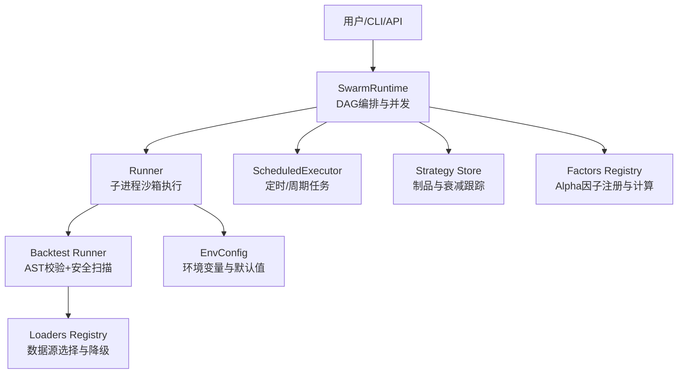
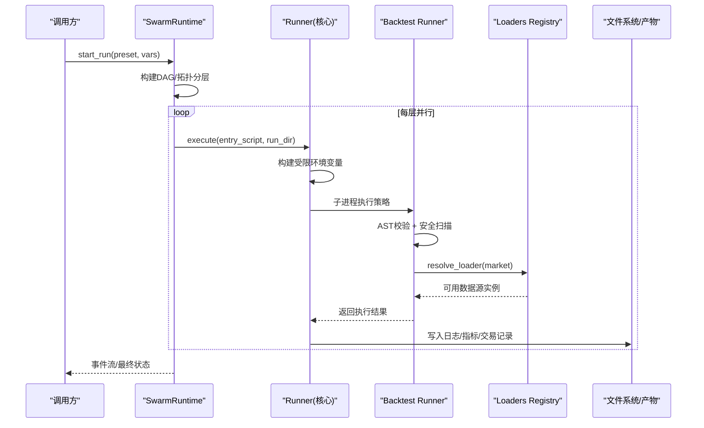
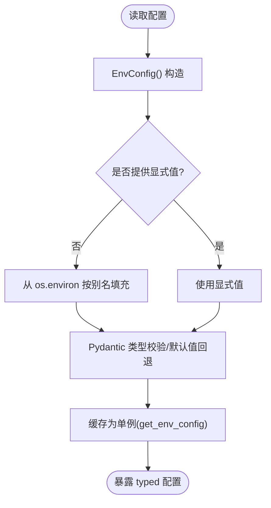
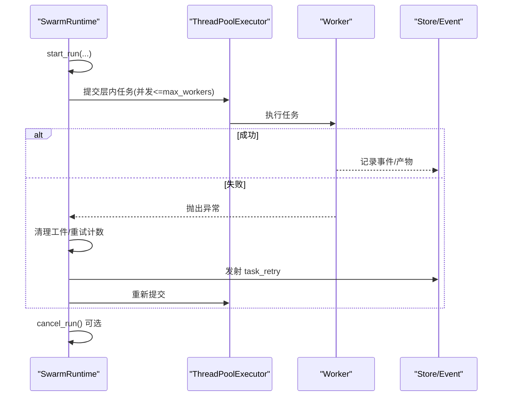
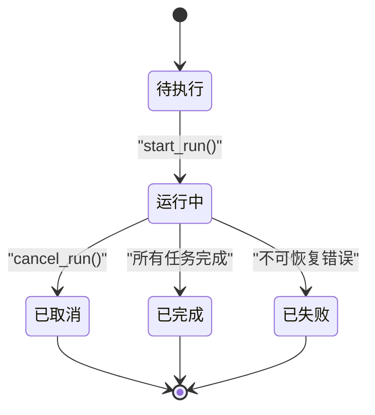
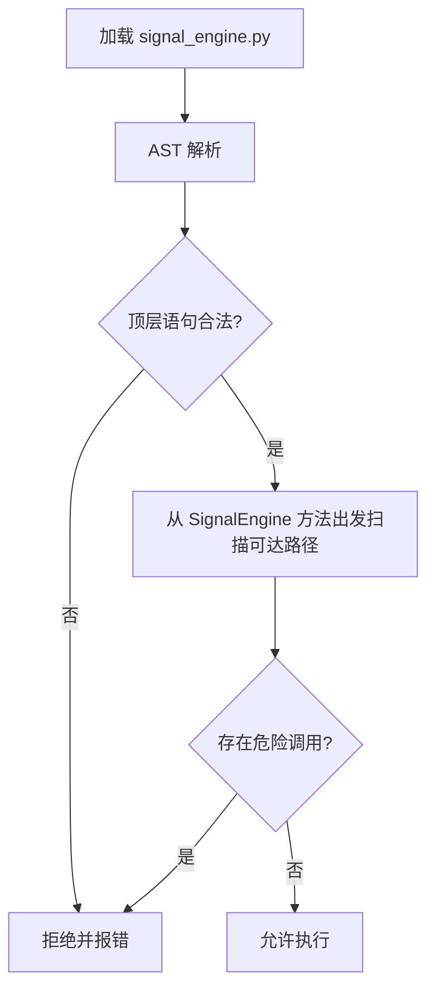
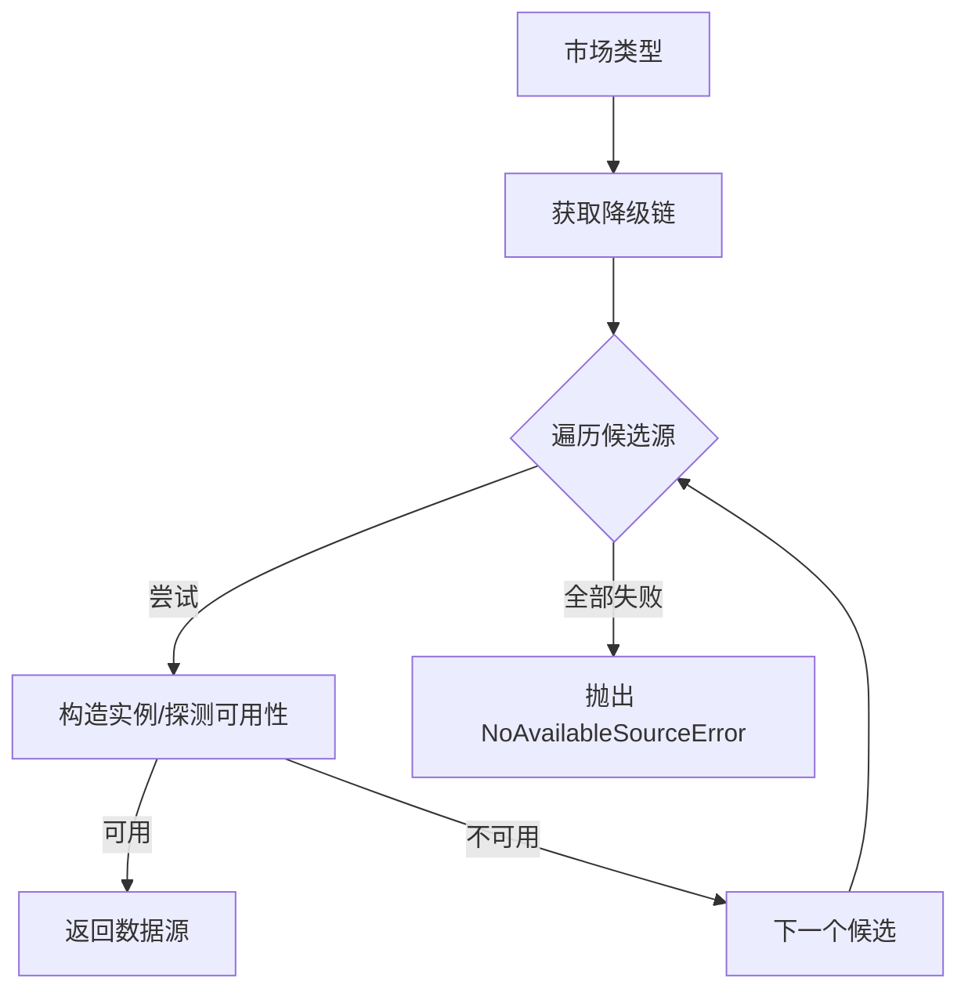
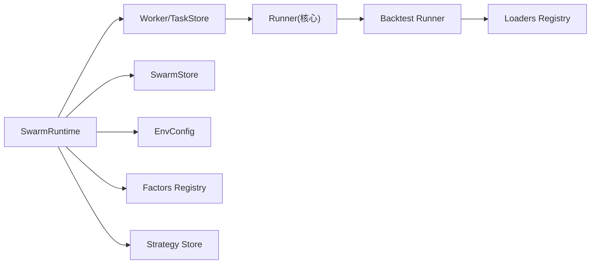

# 策略执行框架

<cite>
**本文引用的文件**
- [backtest/runner.py](file://agent/backtest/runner.py)
- [core/runner.py](file://agent/src/core/runner.py)
- [config/accessor.py](file://agent/src/config/accessor.py)
- [config/env_schema.py](file://agent/src/config/env_schema.py)
- [swarm/runtime.py](file://agent/src/swarm/runtime.py)
- [scheduled_research/executor.py](file://agent/src/scheduled_research/executor.py)
- [strategy_store/__init__.py](file://agent/src/strategy_store/__init__.py)
- [factors/registry.py](file://agent/src/factors/registry.py)
- [backtest/loaders/registry.py](file://agent/backtest/loaders/registry.py)
- [skills/strategy-generate/SKILL.md](file://agent/src/skills/strategy-generate/SKILL.md)
</cite>

## 目录
1. [简介](#简介)
2. [项目结构](#项目结构)
3. [核心组件](#核心组件)
4. [架构总览](#架构总览)
5. [详细组件分析](#详细组件分析)
6. [依赖关系分析](#依赖关系分析)
7. [性能考量](#性能考量)
8. [故障排查指南](#故障排查指南)
9. [结论](#结论)
10. [附录](#附录)

## 简介
本技术文档围绕“策略执行框架”展开，系统性说明以下能力：
- 策略注册机制：策略发现、动态加载、版本与元数据管理。
- 参数配置系统：参数校验、默认值处理、环境变量注入与别名兼容。
- 执行调度器：任务队列、并发控制、重试与取消、生命周期管理（启动/运行/暂停/停止）。
- 策略模板与配置示例：基于技能与回测配置的结构化说明。
- 执行监控与性能分析：指标采集、验证与可视化入口。
- 复杂策略编排与执行模式：DAG 编排、分层并行、失败隔离与恢复。

## 项目结构
该框架由多个子系统协作完成：
- 回测执行层：负责安全地加载并执行用户生成的策略代码，收集产物与日志。
- 配置层：集中化的环境配置读取、类型校验与默认值管理。
- 编排与调度层：基于 DAG 的任务编排、线程池并发、事件驱动与重试。
- 注册中心：因子/数据源/策略等可插拔组件的自动发现与选择。
- 存储与治理：策略制品归档、衰减信号与生命周期追踪。



图表来源
- [swarm/runtime.py:53-159](file://agent/src/swarm/runtime.py#L53-L159)
- [core/runner.py:379-627](file://agent/src/core/runner.py#L379-L627)
- [backtest/runner.py:68-163](file://agent/backtest/runner.py#L68-L163)
- [backtest/loaders/registry.py:23-196](file://agent/backtest/loaders/registry.py#L23-L196)
- [scheduled_research/executor.py:206-274](file://agent/src/scheduled_research/executor.py#L206-L274)
- [strategy_store/__init__.py:1-22](file://agent/src/strategy_store/__init__.py#L1-L22)
- [factors/registry.py:1-200](file://agent/src/factors/registry.py#L1-L200)
- [config/accessor.py:52-93](file://agent/src/config/accessor.py#L52-L93)

章节来源
- [swarm/runtime.py:53-159](file://agent/src/swarm/runtime.py#L53-L159)
- [core/runner.py:379-627](file://agent/src/core/runner.py#L379-L627)
- [backtest/runner.py:68-163](file://agent/backtest/runner.py#L68-L163)
- [backtest/loaders/registry.py:23-196](file://agent/backtest/loaders/registry.py#L23-L196)
- [scheduled_research/executor.py:206-274](file://agent/src/scheduled_research/executor.py#L206-L274)
- [strategy_store/__init__.py:1-22](file://agent/src/strategy_store/__init__.py#L1-L22)
- [factors/registry.py:1-200](file://agent/src/factors/registry.py#L1-L200)
- [config/accessor.py:52-93](file://agent/src/config/accessor.py#L52-L93)

## 核心组件
- SwarmRuntime：DAG 编排、任务分层并行、事件持久化与回调、取消与重试。
- Runner（核心）：子进程沙箱执行、环境变量白名单、资源限制、产物收集。
- Backtest Runner：AST 静态检查、运行时可达路径扫描、安全黑名单、SignalEngine 契约校验。
- Loaders Registry：市场到数据源的映射与降级链、按需懒加载、可用性探测。
- EnvConfig：集中式环境变量模型、类型转换、默认值与别名兼容。
- ScheduledExecutor：后台循环、唤醒/停止、失败恢复与退避重试。
- Factors Registry：Alpha 因子的 AST 元数据提取、严格校验、惰性计算。
- Strategy Store：策略制品归档、状态与衰减信号记录。

章节来源
- [swarm/runtime.py:53-159](file://agent/src/swarm/runtime.py#L53-L159)
- [core/runner.py:379-627](file://agent/src/core/runner.py#L379-L627)
- [backtest/runner.py:68-163](file://agent/backtest/runner.py#L68-L163)
- [backtest/loaders/registry.py:23-196](file://agent/backtest/loaders/registry.py#L23-L196)
- [config/accessor.py:52-93](file://agent/src/config/accessor.py#L52-L93)
- [scheduled_research/executor.py:206-274](file://agent/src/scheduled_research/executor.py#L206-L274)
- [factors/registry.py:1-200](file://agent/src/factors/registry.py#L1-L200)
- [strategy_store/__init__.py:1-22](file://agent/src/strategy_store/__init__.py#L1-L22)

## 架构总览
下图展示从编排到执行的端到端流程，包括安全沙箱、数据源选择与结果收集。



图表来源
- [swarm/runtime.py:90-159](file://agent/src/swarm/runtime.py#L90-L159)
- [core/runner.py:510-627](file://agent/src/core/runner.py#L510-L627)
- [backtest/runner.py:215-230](file://agent/backtest/runner.py#L215-L230)
- [backtest/loaders/registry.py:614-649](file://agent/backtest/loaders/registry.py#L614-L649)

## 详细组件分析

### 策略注册机制（发现、动态加载、版本管理）
- Alpha 因子注册：通过 AST 解析每个 zoo 模块中的元数据字典，进行严格校验后纳入注册表；支持按主题/宇宙/频率筛选与惰性计算。
- 数据源注册：各 loader 模块通过装饰器自注册至全局注册表；首次访问时懒加载所有已知模块，缺失依赖时静默跳过。
- 版本与元数据：AlphaMeta 强制字段约束；策略制品与衰减信号在 Strategy Store 中归档，便于追踪与审计。

```mermaid
classDiagram
class AlphaMeta {
+id
+nickname
+theme
+formula_latex
+columns_required
+extras_required
+requires_sector
+universe
+frequency
+decay_horizon
+min_warmup_bars
+notes
}
class Registry {
+list(zoo, theme, universe) list
+get(alpha_id) Alpha
+compute(alpha_id, panel) DataFrame
+health() dict
+export_manifest() dict
+load_alpha_meta_from_py(path) AlphaMeta
}
class LoaderRegistry {
+LOADER_REGISTRY
+register(cls) Type
+resolve_loader(market) Any
+get_loader_cls_with_fallback(source) Type
}
Registry --> AlphaMeta : "AST 提取/校验"
LoaderRegistry --> "市场->数据源" : "降级链"
```

图表来源
- [factors/registry.py:87-184](file://agent/src/factors/registry.py#L87-L184)
- [backtest/loaders/registry.py:23-196](file://agent/backtest/loaders/registry.py#L23-L196)

章节来源
- [factors/registry.py:1-200](file://agent/src/factors/registry.py#L1-L200)
- [backtest/loaders/registry.py:23-196](file://agent/backtest/loaders/registry.py#L23-L196)
- [strategy_store/__init__.py:1-22](file://agent/src/strategy_store/__init__.py#L1-L22)

### 参数配置系统（验证、默认值、环境变量注入）
- 集中式模型：EnvConfig 及其子模型定义所有环境变量、类型、默认值与别名；构造时自动从 os.environ 填充未显式提供的字段。
- 类型与校验：数值型字段对非法字符串值静默回退到默认；布尔值统一解析；额外字段忽略以避免破坏性变更。
- 访问器与缓存：get_env_config 提供线程安全的单例访问；reset_env_config 支持运行时刷新；_parse_bool 统一布尔解析。
- 安全注入：Runner 仅允许白名单环境变量进入子进程，避免泄露敏感凭据。



图表来源
- [config/env_schema.py:81-124](file://agent/src/config/env_schema.py#L81-L124)
- [config/accessor.py:52-93](file://agent/src/config/accessor.py#L52-L93)
- [core/runner.py:259-361](file://agent/src/core/runner.py#L259-L361)

章节来源
- [config/env_schema.py:1-200](file://agent/src/config/env_schema.py#L1-L200)
- [config/accessor.py:1-149](file://agent/src/config/accessor.py#L1-L149)
- [core/runner.py:259-361](file://agent/src/core/runner.py#L259-L361)

### 执行调度器（任务队列、并发控制、重试机制）
- DAG 编排：SwarmRuntime 根据任务依赖构建拓扑层，层内并行、层间串行；支持取消与事件回调。
- 并发控制：ThreadPoolExecutor 限制最大工作线程数；任务级超时与异常隔离。
- 重试机制：任务失败时清理工件并重试，发射 task_retry 事件；支持指数退避与最大延迟上限。
- 生命周期：start 启动后台循环，stop 安全停止并等待任务结束；tick 触发一次调度。



图表来源
- [swarm/runtime.py:90-159](file://agent/src/swarm/runtime.py#L90-L159)
- [swarm/runtime.py:687-718](file://agent/src/swarm/runtime.py#L687-L718)
- [scheduled_research/executor.py:236-274](file://agent/src/scheduled_research/executor.py#L236-L274)

章节来源
- [swarm/runtime.py:90-159](file://agent/src/swarm/runtime.py#L90-L159)
- [swarm/runtime.py:687-718](file://agent/src/swarm/runtime.py#L687-L718)
- [scheduled_research/executor.py:236-274](file://agent/src/scheduled_research/executor.py#L236-L274)

### 策略生命周期管理（启动、运行、暂停、停止）
- 启动：创建运行对象、持久化、记录提供者/模型/推理强度等上下文。
- 运行：按拓扑层调度任务，层内并发执行；实时事件输出。
- 暂停/取消：通过取消事件中断正在运行的任务。
- 停止：后台循环安全退出，清理资源。



图表来源
- [swarm/runtime.py:90-159](file://agent/src/swarm/runtime.py#L90-L159)
- [swarm/runtime.py:364-378](file://agent/src/swarm/runtime.py#L364-L378)

章节来源
- [swarm/runtime.py:90-175](file://agent/src/swarm/runtime.py#L90-L175)

### 安全执行与沙箱（AST 校验、运行时可达路径扫描）
- 导入期防护：禁止顶层可执行语句、装饰器滥用、不安全基类/关键字；限制函数默认值为字面量。
- 运行时可达路径扫描：从 SignalEngine 方法出发，遍历其调用的模块级函数，拒绝网络/进程/文件写入/动态执行等危险操作。
- 黑名单与别名绕过检测：拦截 getattr/setattr/delattr 间接访问、模块别名绑定、dunder 属性遍历。
- 子进程沙箱：最小化 HOME、UID 降权（容器）、RLIMIT_AS/NOFILE 限制、环境变量白名单。



图表来源
- [backtest/runner.py:215-230](file://agent/backtest/runner.py#L215-L230)
- [backtest/runner.py:282-321](file://agent/backtest/runner.py#L282-L321)
- [backtest/runner.py:324-817](file://agent/backtest/runner.py#L324-L817)
- [core/runner.py:487-608](file://agent/src/core/runner.py#L487-L608)

章节来源
- [backtest/runner.py:215-230](file://agent/backtest/runner.py#L215-L230)
- [backtest/runner.py:282-321](file://agent/backtest/runner.py#L282-L321)
- [backtest/runner.py:324-817](file://agent/backtest/runner.py#L324-L817)
- [core/runner.py:487-608](file://agent/src/core/runner.py#L487-L608)

### 数据源选择与降级（市场→源映射）
- 市场识别：根据代码格式与市场特征推断目标市场。
- 降级链：按 IP 封禁风险与数据质量排序，优先轻量公开源，再回退到密钥 REST 或本地源。
- 可用性探测：构造阶段可能抛错（如缺凭据），视为不可用继续尝试下一候选。



图表来源
- [backtest/loaders/registry.py:139-196](file://agent/backtest/loaders/registry.py#L139-L196)

章节来源
- [backtest/loaders/registry.py:139-196](file://agent/backtest/loaders/registry.py#L139-L196)

### 策略模板与配置示例
- 策略生成技能：提供标准信号引擎合同、回测参数规范、优化器与验证选项。
- 关键参数：source/auto、interval、engine、position_adjustment、initial_cash、commission、validation（蒙特卡洛/Bootstrap/滚动窗口）。
- 建议：分钟级回测需限制数据规模；多资产 auto 路由可混合不同市场。

章节来源
- [skills/strategy-generate/SKILL.md:134-160](file://agent/src/skills/strategy-generate/SKILL.md#L134-L160)

### 执行监控与性能分析
- 指标与产物：equity、metrics、trades、positions、run_card 等结构化产物，供后续分析与可视化。
- 统计验证：支持蒙特卡洛置换检验、Bootstrap 置信区间、滚动窗口一致性检查。
- 事件流：SwarmRuntime 将任务事件持久化并通过回调推送，便于前端/工具消费。

章节来源
- [core/runner.py:383-431](file://agent/src/core/runner.py#L383-L431)
- [backtest/runner.py:348-387](file://agent/backtest/runner.py#L348-L387)
- [swarm/runtime.py:380-397](file://agent/src/swarm/runtime.py#L380-L397)

### 复杂策略编排与执行模式
- DAG 编排：任务间依赖声明，自动拓扑排序与分层并行。
- 失败隔离：单个任务失败不影响同层其他任务；重试前清理工件避免污染。
- 恢复与幂等：后台循环支持恢复残留运行任务；start/stop 幂等。

章节来源
- [swarm/runtime.py:90-159](file://agent/src/swarm/runtime.py#L90-L159)
- [swarm/runtime.py:687-718](file://agent/src/swarm/runtime.py#L687-L718)
- [scheduled_research/executor.py:236-274](file://agent/src/scheduled_research/executor.py#L236-L274)

## 依赖关系分析
- 松耦合：SwarmRuntime 通过接口与 Store/TaskStore/Worker 交互；Runner 与 Backtest Runner 解耦于安全边界。
- 注册中心：Loaders/Factors/Strategy Store 各自维护独立注册表，降低耦合度。
- 外部依赖：数据源、LLM、渠道等通过配置层注入，运行时按需启用。



图表来源
- [swarm/runtime.py:53-159](file://agent/src/swarm/runtime.py#L53-L159)
- [core/runner.py:379-627](file://agent/src/core/runner.py#L379-L627)
- [backtest/loaders/registry.py:23-196](file://agent/backtest/loaders/registry.py#L23-L196)
- [factors/registry.py:1-200](file://agent/src/factors/registry.py#L1-L200)
- [strategy_store/__init__.py:1-22](file://agent/src/strategy_store/__init__.py#L1-L22)

章节来源
- [swarm/runtime.py:53-159](file://agent/src/swarm/runtime.py#L53-L159)
- [core/runner.py:379-627](file://agent/src/core/runner.py#L379-L627)
- [backtest/loaders/registry.py:23-196](file://agent/backtest/loaders/registry.py#L23-L196)
- [factors/registry.py:1-200](file://agent/src/factors/registry.py#L1-L200)
- [strategy_store/__init__.py:1-22](file://agent/src/strategy_store/__init__.py#L1-L22)

## 性能考量
- 并发控制：限制最大工作线程，避免资源耗尽；层内并行提升吞吐。
- 资源限制：子进程虚拟内存与文件描述符上限，防止恶意或失控策略占用过多资源。
- 数据源降级：优先低负载公开源，减少 API 限流与封禁风险。
- 惰性加载：注册表按需导入模块，降低冷启动开销。
- 产物与缓存：沙箱 HOME 下保留必要缓存路径，减少重复下载。

[本节为通用指导，不直接分析具体文件]

## 故障排查指南
- 无可用数据源：检查市场识别与降级链，确认凭据与网络；查看 NoAvailableSourceError 信息。
- 策略执行失败：查看 runner 日志与 stderr；确认 AST 校验与安全扫描未拒绝；核对 SignalEngine 契约。
- 配置异常：检查环境变量名与类型；必要时调用 reset_env_config 刷新缓存。
- 任务重试风暴：检查 max_retries 与退避参数；确认上游依赖稳定。
- 权限问题：容器外 UID 降权不可用时会有警告，AST 防御仍生效。

章节来源
- [backtest/loaders/registry.py:614-649](file://agent/backtest/loaders/registry.py#L614-L649)
- [core/runner.py:487-608](file://agent/src/core/runner.py#L487-L608)
- [config/accessor.py:79-93](file://agent/src/config/accessor.py#L79-L93)
- [swarm/runtime.py:687-718](file://agent/src/swarm/runtime.py#L687-L718)

## 结论
该策略执行框架以“安全沙箱 + 注册中心 + DAG 编排”为核心，实现了：
- 高可靠的安全执行环境，覆盖导入期与运行期双重防护。
- 灵活可扩展的注册机制，支持因子、数据源与策略的动态发现与选择。
- 健壮的调度与生命周期管理，具备并发控制、重试与恢复能力。
- 完善的配置体系，集中化管理环境变量与默认值，保证一致性与可维护性。
- 丰富的监控与验证能力，支撑策略迭代与性能分析。

[本节为总结性内容，不直接分析具体文件]

## 附录
- 回测配置要点：codes、start_date、end_date、source/auto、interval、engine、position_adjustment、initial_cash、commission、validation。
- 推荐实践：分钟级回测控制数据规模；auto 路由用于混合资产；合理设置重试与超时；利用验证套件评估稳健性。

章节来源
- [skills/strategy-generate/SKILL.md:134-160](file://agent/src/skills/strategy-generate/SKILL.md#L134-L160)
- [backtest/runner.py:68-163](file://agent/backtest/runner.py#L68-L163)