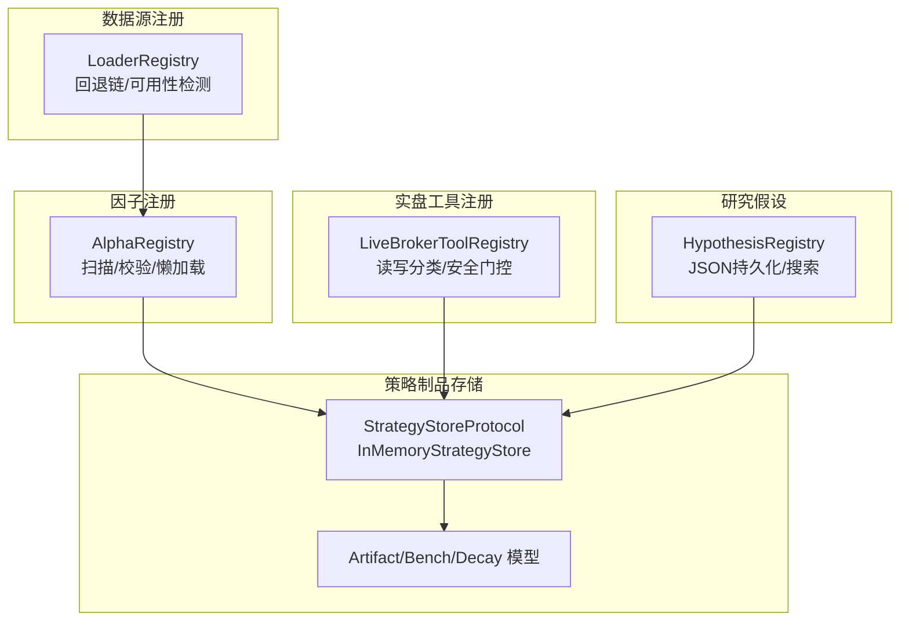
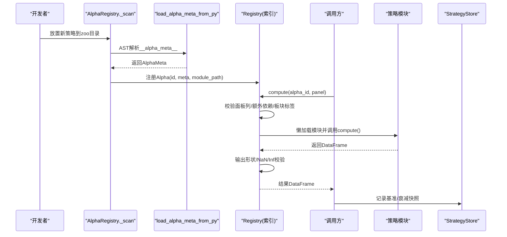
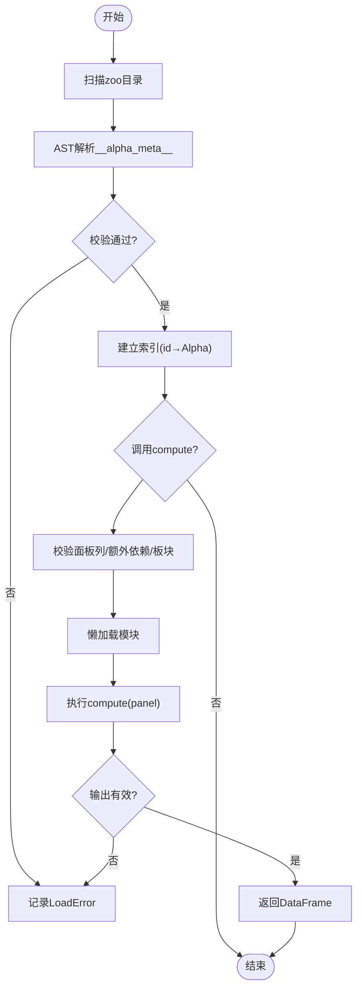
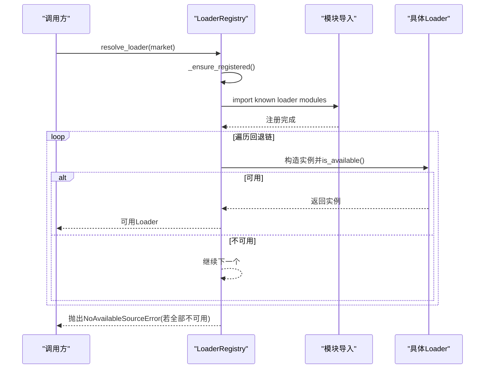
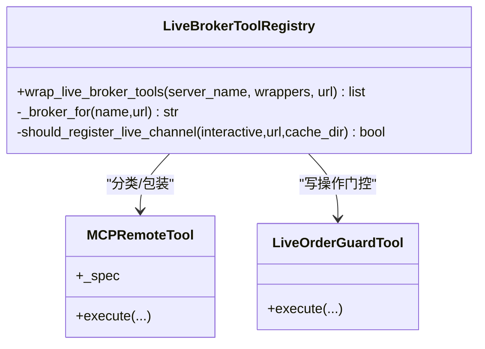
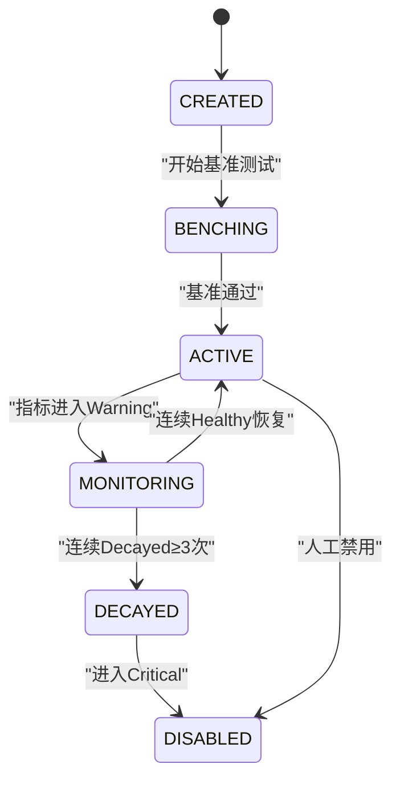
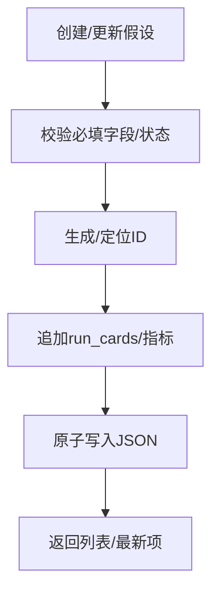
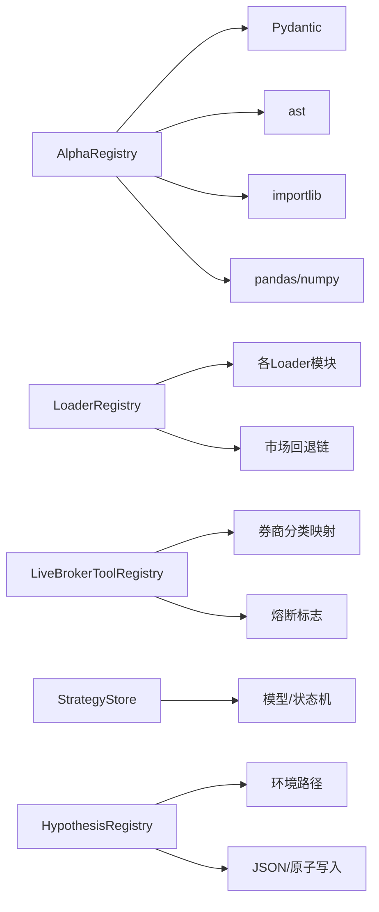

# 策略注册机制

<cite>
**本文引用的文件**
- [agent/src/factors/registry.py](file://agent/src/factors/registry.py)
- [agent/backtest/loaders/registry.py](file://agent/backtest/loaders/registry.py)
- [agent/src/live/registry.py](file://agent/src/live/registry.py)
- [agent/src/strategy_store/models.py](file://agent/src/strategy_store/models.py)
- [agent/src/strategy_store/store.py](file://agent/src/strategy_store/store.py)
- [agent/src/hypotheses/registry.py](file://agent/src/hypotheses/registry.py)
- [agent/src/tools/sdm_decay_scan_tool.py](file://agent/src/tools/sdm_decay_scan_tool.py)
</cite>

## 目录
1. [简介](#简介)
2. [项目结构](#项目结构)
3. [核心组件](#核心组件)
4. [架构总览](#架构总览)
5. [详细组件分析](#详细组件分析)
6. [依赖关系分析](#依赖关系分析)
7. [性能考量](#性能考量)
8. [故障排查指南](#故障排查指南)
9. [结论](#结论)
10. [附录](#附录)

## 简介
本技术文档围绕“策略注册机制”展开，聚焦以下目标：
- 策略发现与动态加载：如何扫描、解析、校验并懒加载策略模块。
- 版本管理与元数据：策略描述、参数规范、兼容性检查与治理字段。
- 注册表实现：索引构建、查找算法、缓存与健康报告。
- 生命周期钩子：初始化、验证、热重载（进程内）与监控衰减。
- 示例与最佳实践：如何编写可注册的策略与配置方法。
- 错误处理与恢复：健壮的错误隔离、降级与回退链。
- 复杂策略模式：多市场回退、组合策略、监管合规与审计。

## 项目结构
本项目在多个子系统实现了“注册表 + 动态加载 + 生命周期管理”的通用模式，主要涉及：
- Alpha因子注册表：基于AST静态扫描zoo目录，严格元数据校验，懒加载compute执行。
- 数据源加载器注册表：按市场维护回退链，按需导入并选择可用实现。
- 实盘工具注册包装：对发现的MCP工具进行读写分类与安全门控。
- 策略/因子制品存储：统一的数据模型、状态机、基准结果与衰减快照。
- 研究假设注册表：本地JSON持久化，支持创建、更新、链接回测产物与搜索。

**图示来源**
- [agent/src/factors/registry.py:201-454](file://agent/src/factors/registry.py#L201-L454)
- [agent/backtest/loaders/registry.py:1-256](file://agent/backtest/loaders/registry.py#L1-L256)
- [agent/src/live/registry.py:1-229](file://agent/src/live/registry.py#L1-L229)
- [agent/src/strategy_store/store.py:1-332](file://agent/src/strategy_store/store.py#L1-L332)
- [agent/src/strategy_store/models.py:1-257](file://agent/src/strategy_store/models.py#L1-L257)
- [agent/src/hypotheses/registry.py:1-387](file://agent/src/hypotheses/registry.py#L1-L387)

**章节来源**
- [agent/src/factors/registry.py:201-454](file://agent/src/factors/registry.py#L201-L454)
- [agent/backtest/loaders/registry.py:1-256](file://agent/backtest/loaders/registry.py#L1-L256)
- [agent/src/live/registry.py:1-229](file://agent/src/live/registry.py#L1-L229)
- [agent/src/strategy_store/store.py:1-332](file://agent/src/strategy_store/store.py#L1-L332)
- [agent/src/strategy_store/models.py:1-257](file://agent/src/strategy_store/models.py#L1-L257)
- [agent/src/hypotheses/registry.py:1-387](file://agent/src/hypotheses/registry.py#L1-L387)

## 核心组件
- AlphaRegistry：负责扫描zoo目录、AST提取__alpha_meta__、严格校验元数据、维护索引、懒加载模块并执行compute，提供健康报告与清单导出。
- LoaderRegistry：维护全局加载器映射与市场级回退链，确保首次调用时完成所有已知加载器的注册，并按可用性选择实现。
- LiveBrokerToolRegistry：将发现的MCP工具按读写分类，对写操作进行强制门控（授权/熔断），并在注册阶段剔除已停用的写工具。
- StrategyStoreProtocol/InMemoryStrategyStore：定义策略/因子制品的CRUD、基准记录、衰减快照接口；内存实现提供线程安全与状态机约束。
- HypothesisRegistry：本地JSON存储的研究假设注册表，支持创建、更新、链接回测产物、全文搜索与状态规范化。

**章节来源**
- [agent/src/factors/registry.py:87-184](file://agent/src/factors/registry.py#L87-L184)
- [agent/backtest/loaders/registry.py:23-117](file://agent/backtest/loaders/registry.py#L23-L117)
- [agent/src/live/registry.py:42-60](file://agent/src/live/registry.py#L42-L60)
- [agent/src/strategy_store/store.py:70-136](file://agent/src/strategy_store/store.py#L70-L136)
- [agent/src/hypotheses/registry.py:145-387](file://agent/src/hypotheses/registry.py#L145-L387)

## 架构总览
下图展示策略从“发现—注册—验证—执行—监控”的全链路：

**图示来源**
- [agent/src/factors/registry.py:219-260](file://agent/src/factors/registry.py#L219-L260)
- [agent/src/factors/registry.py:321-397](file://agent/src/factors/registry.py#L321-L397)
- [agent/src/strategy_store/store.py:160-332](file://agent/src/strategy_store/store.py#L160-L332)

## 详细组件分析

### AlphaRegistry：策略发现、元数据与懒加载
- 动态发现：递归扫描zoo根目录，忽略下划线前缀与缓存目录，仅处理合法标识符的Python文件。
- 元数据定义：通过AST解析每个模块中的__alpha_meta__字典字面量，使用Pydantic模型AlphaMeta进行强校验（主题、所需列、宇宙、频率、衰减窗口等）。
- 索引构建：维护id→Alpha对象映射与id→源码路径映射，去重并记录加载错误。
- 懒加载与执行：仅在compute时导入模块，隔离导入异常；执行compute后对输出做形状、NaN、Inf等一致性校验。
- 健康与清单：health()汇总加载成功/失败数量及错误详情；export_manifest()生成供外部渲染的清单。

**图示来源**
- [agent/src/factors/registry.py:219-260](file://agent/src/factors/registry.py#L219-L260)
- [agent/src/factors/registry.py:321-397](file://agent/src/factors/registry.py#L321-L397)

**章节来源**
- [agent/src/factors/registry.py:87-184](file://agent/src/factors/registry.py#L87-L184)
- [agent/src/factors/registry.py:201-454](file://agent/src/factors/registry.py#L201-L454)

### LoaderRegistry：数据源注册与回退链
- 自动注册：首次访问时遍历_known_加载器模块列表并import，触发各模块内的@register装饰器完成自注册。
- 回退链：为不同市场维护有序候选源（考虑网络限制、鉴权、质量），resolve_loader按is_available()顺序选择首个可用实现。
- 显式源保护：local/qveris/tickerall等显式请求不可静默降级到无关网络源，避免掩盖配置问题。
- 类级别回退：当指定source不可用时，尝试同市场其他source作为回退。

**图示来源**
- [agent/backtest/loaders/registry.py:72-117](file://agent/backtest/loaders/registry.py#L72-L117)
- [agent/backtest/loaders/registry.py:614-649](file://agent/backtest/loaders/registry.py#L614-L649)

**章节来源**
- [agent/backtest/loaders/registry.py:1-256](file://agent/backtest/loaders/registry.py#L1-L256)

### LiveBrokerToolRegistry：实盘工具注册与安全门控
- 工具分类：基于注解、策展映射与默认拒绝规则，将工具分为READ/WRITE/UNKNOWN三类。
- 注册期门控：对WRITE/UNKNOWN工具替换为LiveOrderGuardTool，并在熔断状态下直接剔除写工具，防止暴露。
- OAuth存在性检测：非交互模式下若无缓存令牌则不注册渠道，避免阻塞。

**图示来源**
- [agent/src/live/registry.py:184-238](file://agent/src/live/registry.py#L184-L238)
- [agent/src/live/registry.py:157-181](file://agent/src/live/registry.py#L157-L181)

**章节来源**
- [agent/src/live/registry.py:1-229](file://agent/src/live/registry.py#L1-L229)

### StrategyStore：策略制品存储与生命周期
- 协议抽象：StrategyStoreProtocol定义注册、查询、状态迁移、基准记录与衰减快照接口。
- 内存实现：InMemoryStrategyStore以dict/list存储，线程安全，提供唯一ID生成、时间戳注入、状态机约束。
- 治理字段：Artifact包含开发者、所有者、验证者、批准者、版本、分层、用途与限制等治理字段；提供四眼原则检测与审批状态机校验。

**图示来源**
- [agent/src/strategy_store/models.py:16-24](file://agent/src/strategy_store/models.py#L16-L24)
- [agent/src/strategy_store/store.py:223-258](file://agent/src/strategy_store/store.py#L223-L258)

**章节来源**
- [agent/src/strategy_store/models.py:80-257](file://agent/src/strategy_store/models.py#L80-L257)
- [agent/src/strategy_store/store.py:143-332](file://agent/src/strategy_store/store.py#L143-L332)

### HypothesisRegistry：研究假设注册与链接
- 本地持久化：JSON文件存储，原子写入（先tmp再replace）。
- 创建/更新：标题与论题必填，状态规范化，自动生成稳定ID。
- 链接产物：支持关联run_card或回测目录，附带指标与备注。
- 搜索：全文分词打分，支持状态过滤与分页限制。

**图示来源**
- [agent/src/hypotheses/registry.py:158-212](file://agent/src/hypotheses/registry.py#L158-L212)
- [agent/src/hypotheses/registry.py:282-320](file://agent/src/hypotheses/registry.py#L282-L320)
- [agent/src/hypotheses/registry.py:379-386](file://agent/src/hypotheses/registry.py#L379-L386)

**章节来源**
- [agent/src/hypotheses/registry.py:1-387](file://agent/src/hypotheses/registry.py#L1-L387)

## 依赖关系分析
- AlphaRegistry依赖：
  - Pydantic用于元数据强校验。
  - ast用于无导入静态解析__alpha_meta__。
  - importlib用于懒加载模块。
  - pandas/numpy用于输出校验。
- LoaderRegistry依赖：
  - 各loader模块通过@register自注册。
  - 市场级回退链决定可用性探测顺序。
- LiveBrokerToolRegistry依赖：
  - 各券商分类映射（ROBINHOOD_TOOL_CLASS等）。
  - 熔断标志halt_flag_set。
- StrategyStore依赖：
  - 模型定义（Artifact/Bench/Decay）。
  - 状态机校验函数。
- HypothesisRegistry依赖：
  - 环境变量路径配置。
  - JSON序列化与原子写入。

**图示来源**
- [agent/src/factors/registry.py:24-42](file://agent/src/factors/registry.py#L24-L42)
- [agent/backtest/loaders/registry.py:84-117](file://agent/backtest/loaders/registry.py#L84-L117)
- [agent/src/live/registry.py:42-60](file://agent/src/live/registry.py#L42-L60)
- [agent/src/strategy_store/store.py:24-33](file://agent/src/strategy_store/store.py#L24-L33)
- [agent/src/hypotheses/registry.py:18-47](file://agent/src/hypotheses/registry.py#L18-L47)

**章节来源**
- [agent/src/factors/registry.py:24-42](file://agent/src/factors/registry.py#L24-L42)
- [agent/backtest/loaders/registry.py:84-117](file://agent/backtest/loaders/registry.py#L84-L117)
- [agent/src/live/registry.py:42-60](file://agent/src/live/registry.py#L42-L60)
- [agent/src/strategy_store/store.py:24-33](file://agent/src/strategy_store/store.py#L24-L33)
- [agent/src/hypotheses/registry.py:18-47](file://agent/src/hypotheses/registry.py#L18-L47)

## 性能考量
- AlphaRegistry：
  - 启动扫描使用AST解析，避免导入开销；计算时懒加载模块，减少冷启动成本。
  - 进程级单例缓存Registry实例，避免重复扫描。
  - 输出校验限制NaN比例与无穷值，快速失败。
- LoaderRegistry：
  - 首次调用一次性导入所有已知模块，后续查找O(1)。
  - 回退链按网络风险与质量排序，降低失败重试成本。
- StrategyStore：
  - 内存实现使用RLock保证并发安全；生产建议替换为SQLite/DuckDB后端以提升吞吐与持久化能力。
- HypothesisRegistry：
  - JSON原子写入避免损坏；搜索采用轻量分词与评分，适合中小规模数据。

[本节为通用指导，无需特定文件引用]

## 故障排查指南
- AlphaRegistry常见问题：
  - __alpha_meta__缺失或非法：查看health().errors中对应alpha_id与reason。
  - 面板列缺失：compute抛出SkipAlpha，需补充columns_required/extras_required/sector。
  - 输出异常：compute返回非DataFrame、形状不一致、含inf或>95% NaN将被拒绝。
- LoaderRegistry常见问题：
  - NoAvailableSourceError：检查网络、API密钥与配置；确认目标市场回退链是否覆盖所需源。
  - 显式源不可用：local/qveris/tickerall不会静默降级，需修复配置或凭证。
- LiveBrokerToolRegistry常见问题：
  - 写工具被剔除：检查熔断标志；确认OAuth缓存是否存在（非交互模式）。
  - 未知工具分类：默认UNKNOWN视为写操作，走门控流程。
- StrategyStore常见问题：
  - 状态机违规：禁止从未验证直接批准；禁用时需记录原因与时间。
  - 基准/衰减数据不足：至少需要若干历史基准才能评估衰减信号。
- HypothesisRegistry常见问题：
  - JSON损坏：读取失败会抛出异常，需修复文件格式。
  - 必填字段为空：title/thesis不能为空，状态必须为允许集合之一。

**章节来源**
- [agent/src/factors/registry.py:312-397](file://agent/src/factors/registry.py#L312-L397)
- [agent/backtest/loaders/registry.py:161-256](file://agent/backtest/loaders/registry.py#L161-L256)
- [agent/src/live/registry.py:157-238](file://agent/src/live/registry.py#L157-L238)
- [agent/src/strategy_store/store.py:160-332](file://agent/src/strategy_store/store.py#L160-L332)
- [agent/src/hypotheses/registry.py:367-393](file://agent/src/hypotheses/registry.py#L367-L393)

## 结论
该代码库通过多层次的注册表与生命周期管理，构建了稳健的策略生态：
- AlphaRegistry提供严格的元数据与懒加载执行，保障策略质量与性能。
- LoaderRegistry以回退链提升数据获取的鲁棒性。
- LiveBrokerToolRegistry确保实盘工具的安全可控。
- StrategyStore统一了策略制品的存储、状态机与治理字段。
- HypothesisRegistry支撑研究假设的追踪与产物链接。
结合衰减扫描与阈值策略，可实现从开发到上线再到监控的闭环管理。

[本节为总结性内容，无需特定文件引用]

## 附录

### 策略元数据定义（AlphaMeta关键字段）
- id：唯一标识，遵循命名规范。
- nickname：可选别名。
- theme：主题列表（动量、反转、波动率等）。
- formula_latex：公式表达。
- columns_required：必需的面板列（价格列或fund:前缀基本面列）。
- extras_required：可选扩展依赖。
- requires_sector：是否需要板块标签。
- universe：适用宇宙（美股、A股、加密等）。
- frequency：频率（日频、周频等）。
- decay_horizon：衰减窗口。
- min_warmup_bars：最小预热K线数。
- notes：说明。

**章节来源**
- [agent/src/factors/registry.py:87-125](file://agent/src/factors/registry.py#L87-L125)

### 策略生命周期与状态机
- 状态：created → benching → active → monitoring → decayed → disabled。
- 转换条件：基准通过进入active；指标warning进入monitoring；连续decayed进入disabled；恢复至healthy可回到active。
- 治理：四眼原则检测；审批状态机约束（未验证不可批准）。

**章节来源**
- [agent/src/strategy_store/models.py:16-77](file://agent/src/strategy_store/models.py#L16-L77)
- [agent/src/strategy_store/models.py:191-258](file://agent/src/strategy_store/models.py#L191-L258)
- [agent/src/strategy_store/store.py:223-258](file://agent/src/strategy_store/store.py#L223-L258)

### 复杂策略注册模式与配置方法
- 多市场回退：在backtest loaders中为不同市场配置回退链，优先选择稳定且低风险的源。
- 组合策略：通过多个Alpha组合计算，最终由上层编排器聚合结果。
- 监管合规：在Artifact中填写intended_use与limitations，并通过validate_model_registration强制执行。
- 热重载：进程内可通过reset_default_registry重置AlphaRegistry缓存（仅限测试场景）。

**章节来源**
- [agent/backtest/loaders/registry.py:139-158](file://agent/backtest/loaders/registry.py#L139-L158)
- [agent/src/factors/registry.py:460-478](file://agent/src/factors/registry.py#L460-L478)
- [agent/src/strategy_store/models.py:241-258](file://agent/src/strategy_store/models.py#L241-L258)

### 衰减监控与阈值
- 扫描范围：ACTIVE与MONITORING状态的制品。
- 指标：滚动IC均值、IR、基线IC比值等。
- 信号：healthy/warning/decayed/critical。
- 自动转换：根据连续扫描次数与阈值进行状态迁移。

**章节来源**
- [agent/src/tools/sdm_decay_scan_tool.py:71-112](file://agent/src/tools/sdm_decay_scan_tool.py#L71-L112)