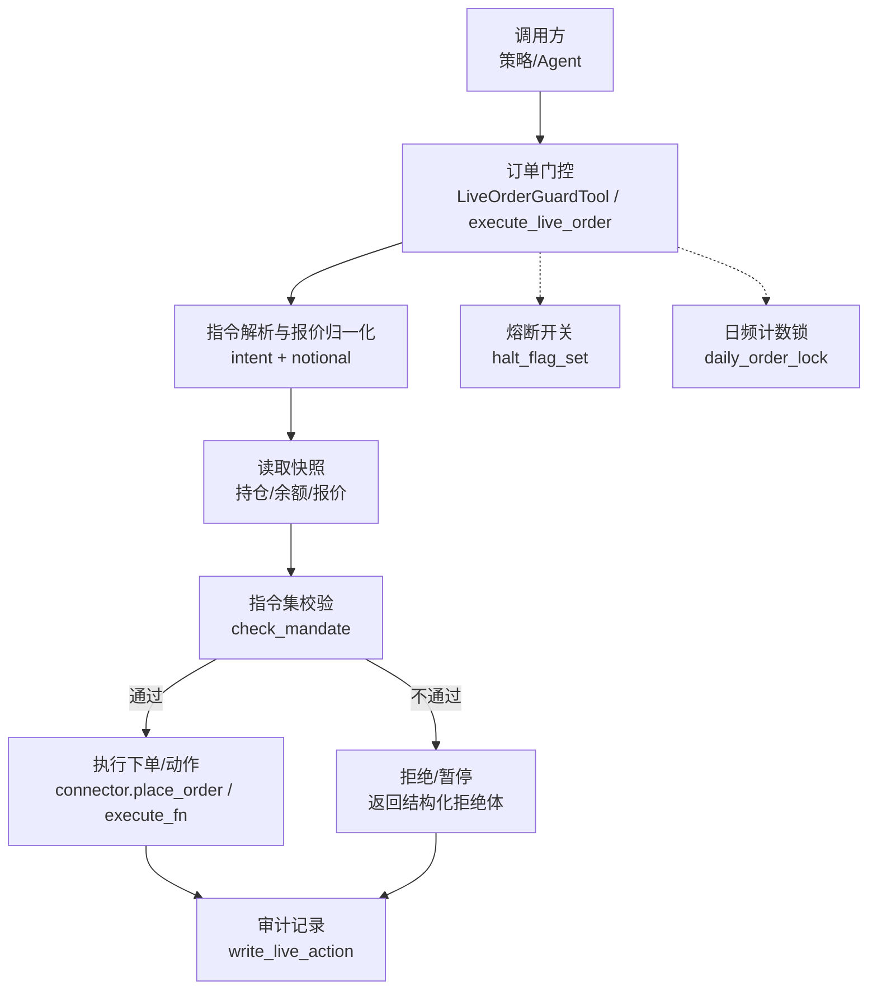
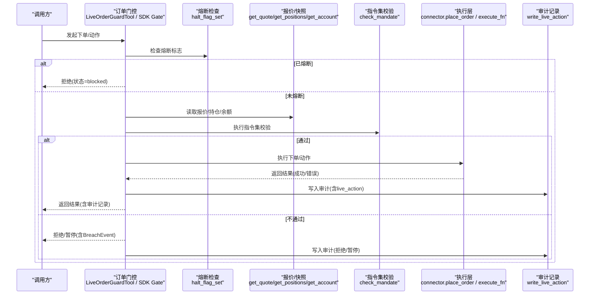
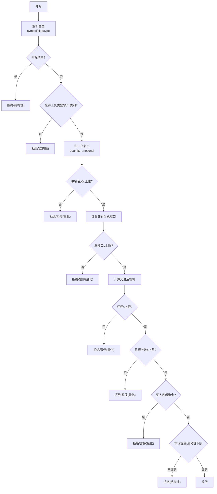
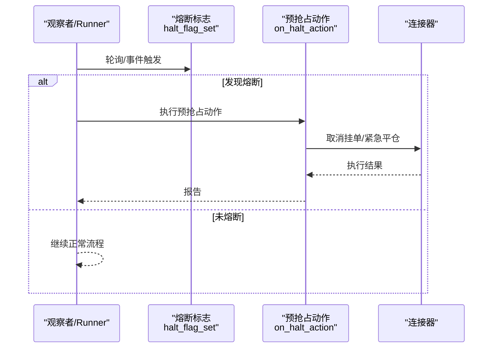
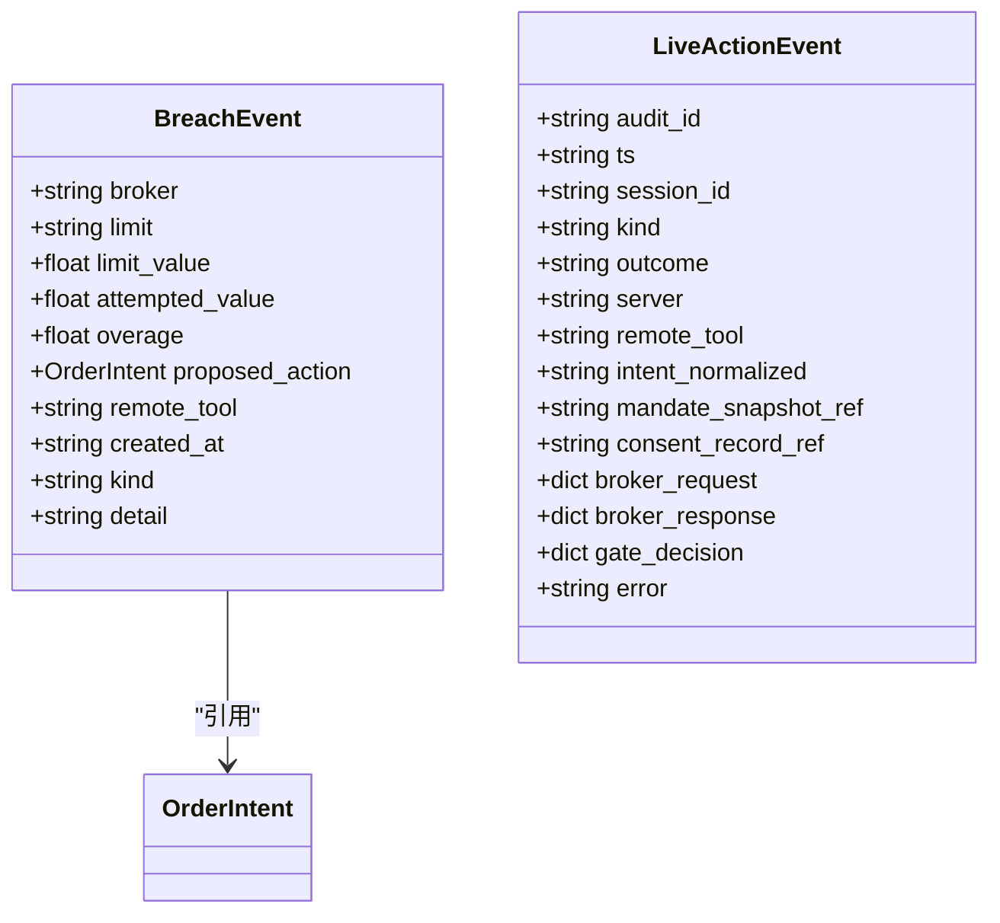
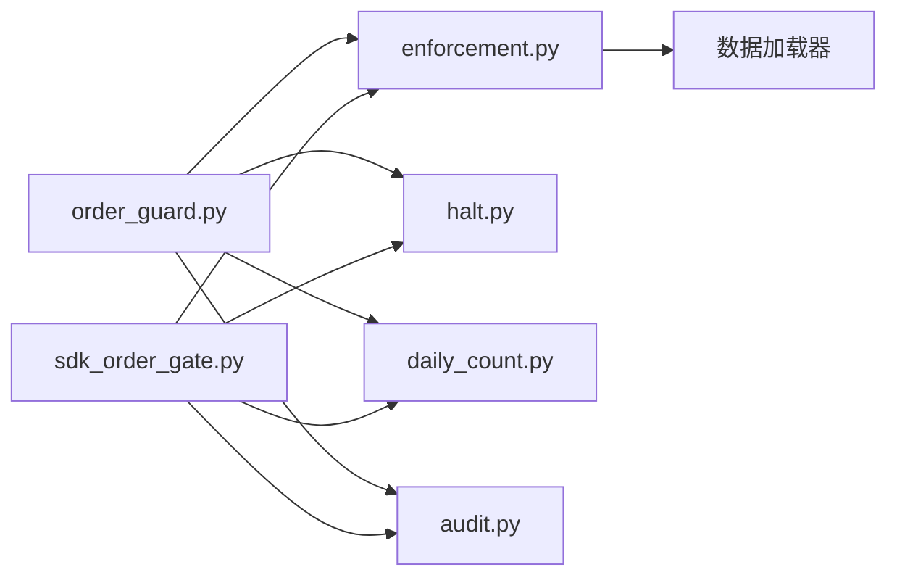

# 事中监控体系

<cite>
**本文引用的文件**
- [order_guard.py](file://agent/src/live/order_guard.py)
- [halt.py](file://agent/src/live/halt.py)
- [enforcement.py](file://agent/src/live/enforcement.py)
- [sdk_order_gate.py](file://agent/src/live/sdk_order_gate.py)
- [daily_count.py](file://agent/src/live/daily_count.py)
- [audit.py](file://agent/src/live/audit.py)
</cite>

## 目录
1. [简介](#简介)
2. [项目结构](#项目结构)
3. [核心组件](#核心组件)
4. [架构总览](#架构总览)
5. [详细组件分析](#详细组件分析)
6. [依赖关系分析](#依赖关系分析)
7. [性能考量](#性能考量)
8. [故障诊断指南](#故障诊断指南)
9. [结论](#结论)
10. [附录](#附录)

## 简介
本文件系统化梳理“事中监控体系”，覆盖订单执行过程中的动态检查、实时风控指标、异常行为检测、自动干预（熔断与紧急平仓）、监控告警与审计记录，以及监控数据的采集与处理流程。文档同时给出监控仪表板配置建议与自定义监控规则开发指引，并总结性能优化与故障诊断方法，帮助读者在真实交易环境中快速定位问题、保障系统稳定运行。

## 项目结构
事中监控体系围绕“事前授权 + 事中拦截 + 事后审计”的三段式安全模型构建：
- 事前授权：加载并校验指令集（Mandate），检查有效期与全局/分券商熔断标志。
- 事中拦截：对每笔订单进行结构化与量化双重校验，必要时暂停并要求重新授权；支持直接SDK路径与MCP远程工具路径。
- 事后审计：所有决策与执行结果写入不可变审计账本，并可选择性推送到运行时追踪与SSE事件总线。

图表来源
- [order_guard.py:130-214](file://agent/src/live/order_guard.py#L130-L214)
- [sdk_order_gate.py:59-157](file://agent/src/live/sdk_order_gate.py#L59-L157)
- [enforcement.py:458-620](file://agent/src/live/enforcement.py#L458-L620)
- [halt.py:135-163](file://agent/src/live/halt.py#L135-L163)
- [daily_count.py:74-105](file://agent/src/live/daily_count.py#L74-L105)
- [audit.py:248-351](file://agent/src/live/audit.py#L248-L351)

章节来源
- [order_guard.py:1-831](file://agent/src/live/order_guard.py#L1-L831)
- [sdk_order_gate.py:1-727](file://agent/src/live/sdk_order_gate.py#L1-L727)
- [enforcement.py:1-798](file://agent/src/live/enforcement.py#L1-L798)
- [halt.py:1-281](file://agent/src/live/halt.py#L1-L281)
- [daily_count.py:1-135](file://agent/src/live/daily_count.py#L1-L135)
- [audit.py:1-352](file://agent/src/live/audit.py#L1-L352)

## 核心组件
- 订单前置门控（MCP路径）：LiveOrderGuardTool，负责加载指令集、检查过期、熔断、意图解析、报价归一化、读取快照、指令集校验、执行转发与审计嵌入。
- 订单前置门控（直接SDK路径）：execute_live_order / execute_live_action，提供与MCP路径一致的“失败即关闭”语义与审计契约。
- 指令集校验器：check_mandate，按固定顺序执行排除列表、允许工具类型、资产类别、单笔名义、总敞口、杠杆、日频次数、资金上限、市场容量/流动性等检查。
- 熔断开关：halt_flag_set 及 trip_halt/clear_halt/on_halt_action，提供全局与分券商级别的即时停止能力，并支持注册预emptive动作（取消挂单/紧急平仓）。
- 日频计数与并发控制：daily_order_lock/read/increment，确保同一券商在同一时刻仅有一个提交窗口，并以UTC日历日为单位计数。
- 审计与告警：write_live_action 将决策与结果写入合规账本，可选写入链式防篡改副本、运行时追踪与SSE事件总线。

章节来源
- [order_guard.py:97-214](file://agent/src/live/order_guard.py#L97-L214)
- [sdk_order_gate.py:59-157](file://agent/src/live/sdk_order_gate.py#L59-L157)
- [enforcement.py:458-620](file://agent/src/live/enforcement.py#L458-L620)
- [halt.py:72-163](file://agent/src/live/halt.py#L72-L163)
- [daily_count.py:72-135](file://agent/src/live/daily_count.py#L72-L135)
- [audit.py:172-351](file://agent/src/live/audit.py#L172-L351)

## 架构总览
下图展示从调用到执行的完整时序，包括熔断、指令集校验、报价归一化、执行与审计。

图表来源
- [order_guard.py:130-214](file://agent/src/live/order_guard.py#L130-L214)
- [sdk_order_gate.py:59-157](file://agent/src/live/sdk_order_gate.py#L59-L157)
- [enforcement.py:458-620](file://agent/src/live/enforcement.py#L458-L620)
- [audit.py:248-351](file://agent/src/live/audit.py#L248-L351)

## 详细组件分析

### 实时风控机制（订单执行中的动态检查）
- 结构化检查（立即拒绝）：
  - 排除符号清单命中
  - 不允许的工具类型或资产类别
  - 无法解析的订单意图
- 量化检查（可能暂停并要求重新授权）：
  - 单笔名义上限
  - 交易后总敞口上限
  - 交易后总杠杆上限
  - 日频交易次数上限
  - 账户资金上限（防御性兜底）
  - 市场容量/流动性下限（如可用）
- 报价归一化：当订单以数量表达时，优先使用连接器报价，其次回退到数据加载器的最近收盘价，取显式名义与数量×价格的较大值作为最终名义，防止绕过限额。

图表来源
- [enforcement.py:458-620](file://agent/src/live/enforcement.py#L458-L620)
- [order_guard.py:218-288](file://agent/src/live/order_guard.py#L218-L288)
- [sdk_order_gate.py:525-590](file://agent/src/live/sdk_order_gate.py#L525-L590)

章节来源
- [enforcement.py:458-620](file://agent/src/live/enforcement.py#L458-L620)
- [order_guard.py:218-288](file://agent/src/live/order_guard.py#L218-L288)
- [sdk_order_gate.py:525-590](file://agent/src/live/sdk_order_gate.py#L525-L590)

### 自动干预系统（熔断、自动暂停、紧急平仓）
- 熔断触发条件：
  - 全局或分券商HALT文件存在即视为熔断（LLM无关，文件系统级强制）。
  - 指令集过期或未生效。
  - 量化超限导致“暂停并要求重新授权”。
- 自动暂停策略：
  - 量化类超限返回“暂停”，携带BreachEvent，提示需要重新授权。
  - 结构性超限直接拒绝。
- 紧急平仓逻辑：
  - 通过on_halt_action注册的回调在检测到熔断时执行取消挂单与（按指令集）紧急平仓。
  - 该钩子与写熔断标志解耦，避免副作用耦合；若未注册则仅阻止后续下单。

图表来源
- [halt.py:135-163](file://agent/src/live/halt.py#L135-L163)
- [halt.py:218-280](file://agent/src/live/halt.py#L218-L280)

章节来源
- [halt.py:72-163](file://agent/src/live/halt.py#L72-L163)
- [halt.py:218-280](file://agent/src/live/halt.py#L218-L280)

### 监控告警系统（阈值突破通知、异常状态报告、风险事件记录）
- 阈值突破通知：
  - 量化超限产生BreachEvent，包含limit、attempted_value、overage、proposed_action等字段，便于前端/CLI渲染提示与重新授权引导。
- 异常状态报告：
  - 审计记录包含gate_decision、broker_request/response（脱敏）、error描述，用于异常回溯。
- 风险事件记录：
  - 所有订单放行/拒绝/暂停均写入审计账本，支持链式防篡改副本与SSE事件推送，供实时监控面板消费。

图表来源
- [enforcement.py:111-177](file://agent/src/live/enforcement.py#L111-L177)
- [audit.py:172-245](file://agent/src/live/audit.py#L172-L245)

章节来源
- [enforcement.py:111-177](file://agent/src/live/enforcement.py#L111-L177)
- [audit.py:172-351](file://agent/src/live/audit.py#L172-L351)

### 监控数据采集与处理流程（实时流、历史对比、趋势预测）
- 实时数据流：
  - 订单门控在每次下单前读取最新报价、持仓与账户快照，用于名义归一化与敞口/杠杆计算。
  - 审计记录通过SSE事件总线实时推送，供前端/CLI即时渲染。
- 历史数据对比：
  - 审计账本持久化于运行时根目录，支持离线回放与对比分析。
  - 日频计数文件按UTC日历日滚动，便于统计当日交易频次与峰值。
- 趋势预测：
  - 可基于审计与行情数据构建滚动窗口指标（如波动率、成交金额、回撤），结合历史分布进行异常检测与预警。

章节来源
- [order_guard.py:184-214](file://agent/src/live/order_guard.py#L184-L214)
- [sdk_order_gate.py:120-157](file://agent/src/live/sdk_order_gate.py#L120-L157)
- [daily_count.py:106-135](file://agent/src/live/daily_count.py#L106-L135)
- [audit.py:248-351](file://agent/src/live/audit.py#L248-L351)

### 监控仪表板配置与自定义监控规则开发指南
- 仪表板配置建议：
  - 订阅SSE事件“live.action”，实时展示订单放行/拒绝/暂停、熔断触发/解除、审计ID与时间戳。
  - 聚合展示：当日交易次数、拒绝原因分布、熔断时长、最大名义/杠杆/敞口。
  - 关键阈值可视化：单笔名义、总敞口、杠杆、日频次数、资金上限。
- 自定义监控规则开发：
  - 扩展点：在指令集校验阶段增加自定义规则（如特定品种/时段限制），或在审计记录中附加自定义标签以便过滤。
  - 告警通道：复用现有event_callback机制，将高风险事件推送到IM/邮件/短信等渠道。
  - 回退策略：任何外部依赖（报价、数据加载器）失败应遵循“失败即关闭”原则，避免误放行。

章节来源
- [audit.py:248-351](file://agent/src/live/audit.py#L248-L351)
- [enforcement.py:458-620](file://agent/src/live/enforcement.py#L458-L620)

## 依赖关系分析
- 模块耦合：
  - order_guard.py 依赖 enforcement.py（校验）、halt.py（熔断）、daily_count.py（计数）、audit.py（审计）。
  - sdk_order_gate.py 同样依赖上述模块，提供函数式入口。
  - enforcement.py 依赖数据加载器获取报价与流动性/市值信息。
- 外部依赖：
  - 数据加载器（yfinance/akshare/okx/ccxt等）用于报价与基础因子。
  - 操作系统文件接口用于熔断标志与计数文件。
- 潜在循环依赖：
  - 当前设计通过分层与延迟导入避免循环依赖（如仅在必要时导入数据加载器）。

图表来源
- [order_guard.py:39-73](file://agent/src/live/order_guard.py#L39-L73)
- [sdk_order_gate.py:24-48](file://agent/src/live/sdk_order_gate.py#L24-L48)
- [enforcement.py:696-712](file://agent/src/live/enforcement.py#L696-L712)

章节来源
- [order_guard.py:39-73](file://agent/src/live/order_guard.py#L39-L73)
- [sdk_order_gate.py:24-48](file://agent/src/live/sdk_order_gate.py#L24-L48)
- [enforcement.py:696-712](file://agent/src/live/enforcement.py#L696-L712)

## 性能考量
- 低开销路径：
  - 熔断检查为纯文件系统存在性判断，极快。
  - 日频计数采用原子替换写入，减少竞争。
- 报价与快照：
  - 优先连接器报价，失败再回退数据加载器；失败即关闭，避免阻塞。
  - 批量读取尽量合并以减少网络往返。
- 审计写入：
  - 审计记录追加写入并fsync，保证持久性；链式副本失败不影响主流程。
- 并发控制：
  - 使用平台级 advisory lock 保护同一券商的提交窗口，避免重复计数与竞态。

[本节提供通用指导，无需具体文件分析]

## 故障诊断指南
- 常见问题定位：
  - 订单被拒绝：查看审计记录中的gate_decision与reason，确认是否命中排除清单、工具类型/资产类别限制、单笔名义/总敞口/杠杆/日频/资金上限。
  - 熔断：检查全局/分券商HALT文件是否存在；如需恢复，清除对应标志文件。
  - 报价缺失：确认连接器quote或数据加载器可用性；失败会触发失败即关闭。
  - 日频计数异常：检查trade_counter.json与.lock文件权限与内容。
- 日志与审计：
  - 审计账本位于运行时根目录，包含脱敏后的请求/响应与决策详情。
  - 链式副本可用于验证账本完整性，检测篡改或缺失。
- 恢复步骤：
  - 修正指令集或参数后重试；必要时重新授权。
  - 若熔断由外部watchdog触发，先排查外部原因再清除标志。

章节来源
- [audit.py:248-351](file://agent/src/live/audit.py#L248-L351)
- [halt.py:111-163](file://agent/src/live/halt.py#L111-L163)
- [daily_count.py:106-135](file://agent/src/live/daily_count.py#L106-L135)

## 结论
本体系中，订单执行前的多层校验与“失败即关闭”原则确保了交易安全；文件系统级熔断与预抢占动作提供了强力的自动干预能力；审计与SSE事件总线实现了可观测性与可追溯性。通过合理的仪表板配置与自定义规则扩展，可在复杂市场环境下实现稳健的事中监控与风险控制。

## 附录
- 术语表：
  - 指令集（Mandate）：用户授权的硬性约束集合，定义允许范围与限额。
  - 名义（Notional）：订单的美元价值，用于限额计算。
  - 敞口（Exposure）：持仓的市场价值总和，衡量整体风险。
  - 杠杆（Leverage）：总敞口与账户资金的比值。
- 最佳实践：
  - 始终启用熔断与审计；定期审查指令集与限额。
  - 对关键外部依赖设置降级与告警；避免单点故障影响交易。
  - 使用SSE事件驱动仪表板，实现秒级可视与告警。

[本节为概念性说明，无需具体文件分析]