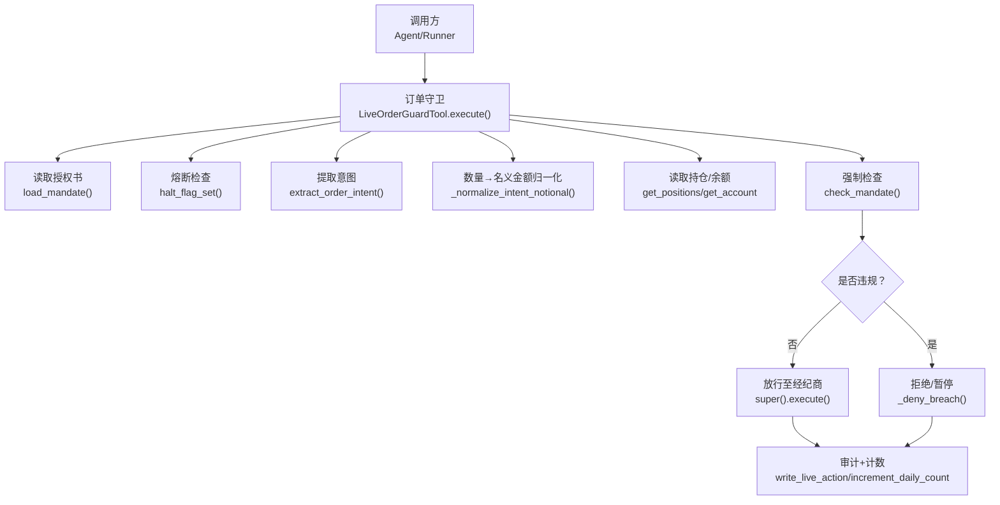
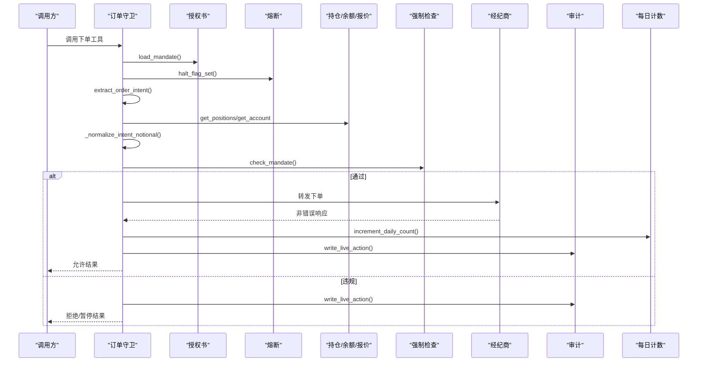
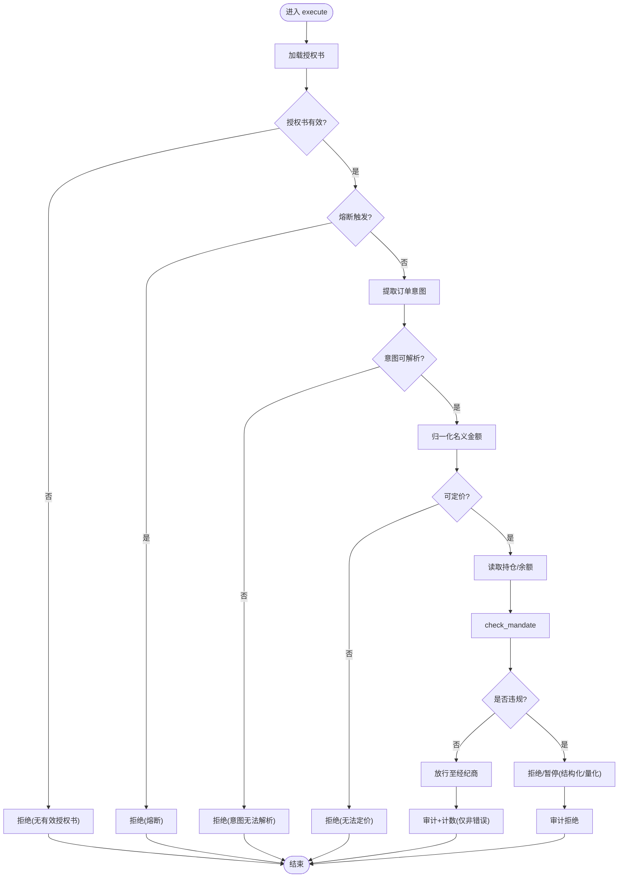
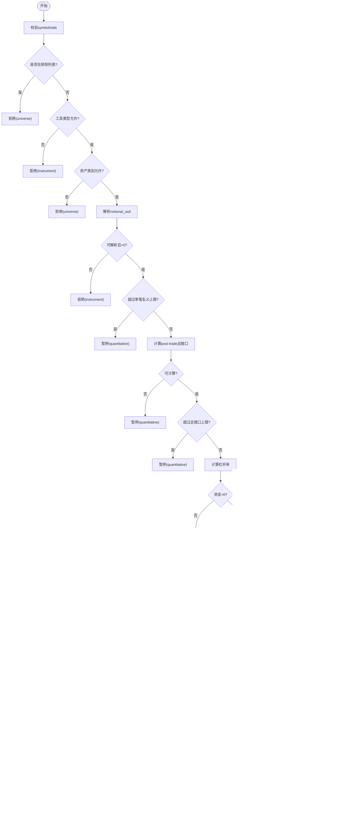
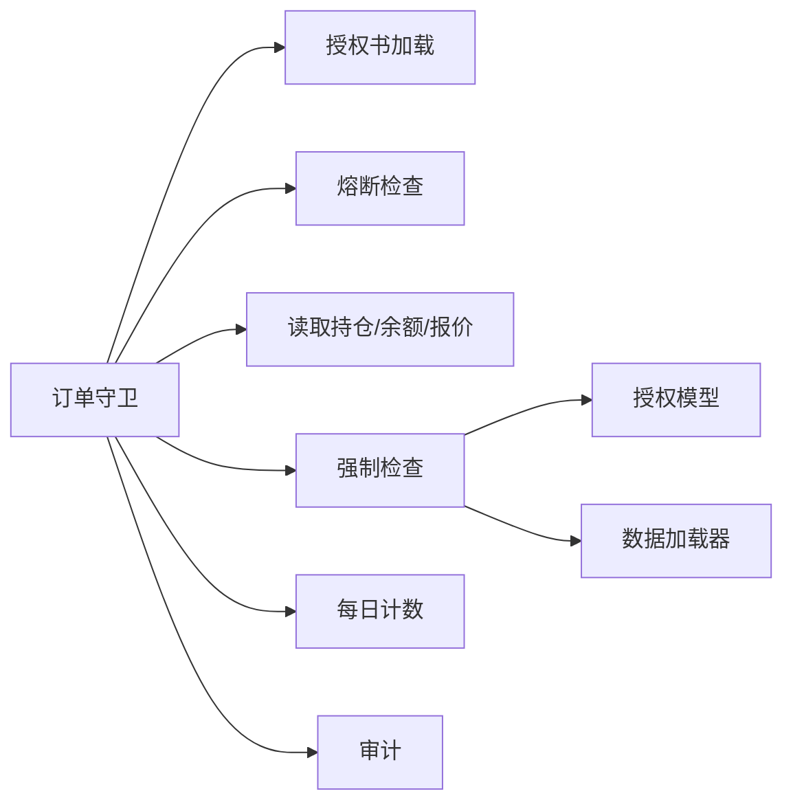

# 事前检查机制

<cite>
**本文引用的文件**
- [order_guard.py](file://agent/src/live/order_guard.py)
- [enforcement.py](file://agent/src/live/enforcement.py)
- [daily_count.py](file://agent/src/live/daily_count.py)
- [halt.py](file://agent/src/live/halt.py)
- [sdk_order_gate.py](file://agent/src/live/sdk_order_gate.py)
- [model.py](file://agent/src/live/mandate/model.py)
- [store.py](file://agent/src/live/mandate/store.py)
- [commit.py](file://agent/src/live/mandate/commit.py)
- [audit.py](file://agent/src/live/audit.py)
- [service.py](file://agent/src/trading/service.py)
</cite>

## 目录
1. [简介](#简介)
2. [项目结构](#项目结构)
3. [核心组件](#核心组件)
4. [架构总览](#架构总览)
5. [详细组件分析](#详细组件分析)
6. [依赖关系分析](#依赖关系分析)
7. [性能考量](#性能考量)
8. [故障排查指南](#故障排查指南)
9. [结论](#结论)
10. [附录](#附录)

## 简介
本技术文档系统化说明“事前检查机制”（Pre-trade Enforcement）的实现与执行流程，覆盖预审批规则、风险评估、合规流动性检查、失败关闭（fail-closed）原则、检查顺序与执行流、异常处理与错误恢复。该机制确保任何无法解析的输入或数据缺失都会拒绝订单而非放行，并通过多层防线保障交易安全。

## 项目结构
事前检查机制由以下关键模块协作完成：
- 订单守卫（LiveOrderGuardTool）：在每次下单前按固定顺序执行校验，拦截并审计所有决策。
- 强制检查（check_mandate）：纯函数式评估订单是否符合授权书（Mandate）约束，返回违规事件或允许通过。
- 每日计数（Daily Order Counter）：以UTC日历日为单位限制下单次数，跨进程并发安全。
- 熔断开关（Halt）：基于文件系统的全局/逐经纪商停止信号，独立于LLM与代理状态。
- SDK网关（SDK Order Gate）：对非place_order的直接SDK写入也施加相同的事前检查。
- 授权模型（Mandate Model/Store/Commit）：定义硬上限、资产类别、市场市值/流动性下限等配置。
- 审计（Audit）：不可变日志记录所有live action，支持脱敏与多路输出。

**图表来源**
- [order_guard.py:130-214](file://agent/src/live/order_guard.py#L130-L214)
- [enforcement.py:458-620](file://agent/src/live/enforcement.py#L458-L620)
- [daily_count.py:106-134](file://agent/src/live/daily_count.py#L106-L134)
- [halt.py:135-163](file://agent/src/live/halt.py#L135-L163)

**章节来源**
- [order_guard.py:1-221](file://agent/src/live/order_guard.py#L1-L221)
- [enforcement.py:1-26](file://agent/src/live/enforcement.py#L1-L26)

## 核心组件
- 订单守卫（LiveOrderGuardTool）
  - 职责：在每次下单前执行一系列fail-closed检查；将数量型订单归一化为单一名义金额；读取持仓/余额；调用check_mandate；根据结果放行或拒绝；仅在成功且经纪商返回非错误时增加当日计数；审计所有决策。
  - 关键点：重复提交=禁止（repeatable=False）；读工具不走守卫；价格获取优先经纪商报价，其次数据加载器；审计失败不阻塞决策。
- 强制检查（check_mandate）
  - 职责：按固定顺序评估授权书约束；返回BreachEvent或None；所有未解析输入或缺失数据均拒绝。
  - 检查顺序：排除列表 → 工具类型允许性 → 资产类别允许性 → 单笔订单名义金额 → 总敞口 → 杠杆率 → 每日交易次数 → 资金上限 → 市场市值/日均成交量下限。
- 每日计数（daily_count）
  - 职责：以UTC日历日为单位维护每经纪商下单计数；提供原子写入与跨进程锁；读取失败视为0（仅计数层面fail-open，但整体仍fail-closed）。
- 熔断开关（halt）
  - 职责：基于文件系统的全局/逐经纪商停止信号；存在即生效；读取失败/无效JSON仍视为已触发（fail-closed）。
- SDK网关（sdk_order_gate）
  - 职责：对直接SDK写入（非place_order）同样执行事前检查；风险降低操作可跳过部分检查但仍审计。
- 授权模型（model/store/commit）
  - 职责：定义硬上限（账户资金、单笔名义金额、总敞口、杠杆、允许工具类型、每日交易次数）、宇宙约束（资产类别、市值下限、日均成交量下限、排除符号）、同意元信息（有效期等）。
- 审计（audit）
  - 职责：不可变日志记录所有live action；脱敏敏感字段；三路输出（合规账本、运行追踪、事件回调）。

**章节来源**
- [order_guard.py:97-214](file://agent/src/live/order_guard.py#L97-L214)
- [enforcement.py:458-620](file://agent/src/live/enforcement.py#L458-L620)
- [daily_count.py:1-135](file://agent/src/live/daily_count.py#L1-L135)
- [halt.py:1-163](file://agent/src/live/halt.py#L1-L163)
- [sdk_order_gate.py:97-178](file://agent/src/live/sdk_order_gate.py#L97-L178)
- [model.py:46-78](file://agent/src/live/mandate/model.py#L46-L78)
- [store.py:88-120](file://agent/src/live/mandate/store.py#L88-L120)
- [commit.py:465-501](file://agent/src/live/mandate/commit.py#L465-L501)
- [audit.py:1-23](file://agent/src/live/audit.py#L1-L23)

## 架构总览
事前检查机制采用“守卫+纯函数检查”的分层架构：
- 入口层：订单守卫负责编排检查流程、读取外部状态、审计与计数。
- 决策层：check_mandate为无副作用的纯函数，依据授权书进行严格判定。
- 支撑层：熔断、计数、数据加载器、审计、授权模型共同提供基础设施。

**图表来源**
- [order_guard.py:130-214](file://agent/src/live/order_guard.py#L130-L214)
- [enforcement.py:458-620](file://agent/src/live/enforcement.py#L458-L620)
- [daily_count.py:106-134](file://agent/src/live/daily_count.py#L106-L134)
- [audit.py:1-23](file://agent/src/live/audit.py#L1-L23)

## 详细组件分析

### 订单守卫（LiveOrderGuardTool）
- 执行顺序（全部fail-closed）：
  1) 加载授权书（无有效授权书/未知版本→拒绝）
  2) 检查授权有效期（过期→拒绝并提示重新授权）
  3) 熔断检查（已触发→拒绝，不调用经纪商）
  4) 提取订单意图（无法解析→拒绝）
  5) 读取持仓与余额（通过READ MCP工具）
  6) 归一化名义金额（quantity→notional，取显式名义与数量×价格的较大值；无法定价→拒绝）
  7) 强制检查（check_mandate）
     - 结构性违规（排除列表/工具类型/资产类别）→直接拒绝
     - 量化违规（单笔名义/总敞口/杠杆/每日次数/资金/流动性）→暂停并要求重新授权
  8) 放行后：仅当经纪商返回非错误时才增加当日计数；审计所有决策。

**图表来源**
- [order_guard.py:130-214](file://agent/src/live/order_guard.py#L130-L214)
- [order_guard.py:218-289](file://agent/src/live/order_guard.py#L218-L289)
- [order_guard.py:364-432](file://agent/src/live/order_guard.py#L364-L432)

**章节来源**
- [order_guard.py:1-221](file://agent/src/live/order_guard.py#L1-L221)
- [order_guard.py:218-389](file://agent/src/live/order_guard.py#L218-L389)

### 强制检查（check_mandate）
- 检查顺序与逻辑：
  1) 排除列表检查：若符号在exclude_symbols中→拒绝（universe）
  2) 工具类型允许性验证：instrument_type不在allowed_instruments→拒绝（instrument）
  3) 资产类别允许性检查：asset_class不在permitted asset_classes→拒绝（universe）
  4) 单笔订单名义金额检查：notional_usd必须可解析且为正；超过max_order_notional_usd→暂停（quantitative）
  5) 总敞口限制：计算post-trade gross exposure；无法读取持仓→拒绝（quantitative）；超过max_total_exposure_usd→暂停
  6) 杠杆率计算：post_leverage = abs(post_exposure)/account_funding_usd；资金非正→拒绝；超过max_leverage→暂停
  7) 每日交易次数限制：attempted_count = daily_count + 1；超过max_trades_per_day→暂停
  8) 资金上限：买入时post_exposure不得超过account_funding_usd→暂停
  9) 流动性要求：min_market_cap_usd与min_avg_daily_volume_usd；数据不可用→拒绝（universe）

**图表来源**
- [enforcement.py:458-620](file://agent/src/live/enforcement.py#L458-L620)
- [enforcement.py:623-679](file://agent/src/live/enforcement.py#L623-L679)

**章节来源**
- [enforcement.py:458-620](file://agent/src/live/enforcement.py#L458-L620)
- [enforcement.py:623-679](file://agent/src/live/enforcement.py#L623-L679)

### 每日交易次数限制（daily_count）
- 实现要点：
  - 使用UTC日历日作为周期；文件路径按经纪商隔离。
  - 跨进程并发安全：通过平台适配的advisory lock（POSIX fcntl或Windows msvcrt）保证同一时刻只有一个提交窗口。
  - 读取失败视为0（仅计数层面fail-open），但整体流程仍fail-closed（其他检查仍可拒绝）。
  - 原子写入：临时文件+replace确保计数一致性。

**章节来源**
- [daily_count.py:1-135](file://agent/src/live/daily_count.py#L1-L135)

### 熔断机制（halt）
- 实现要点：
  - 全局与逐经纪商两个级别；全局优先。
  - 基于文件系统哨兵文件存在性判断；内容可为空或非法JSON仍视为已触发（fail-closed）。
  - 提供trip/clear/read接口；注册可选的“预先动作”（如取消挂单、平仓）以便在观察到熔断时主动降险。

**章节来源**
- [halt.py:1-163](file://agent/src/live/halt.py#L1-L163)
- [halt.py:194-281](file://agent/src/live/halt.py#L194-L281)

### SDK网关（sdk_order_gate）
- 职责：对非place_order的直接SDK写入也执行事前检查；风险降低操作可跳过熔断与授权检查但仍审计；计数与审计保持一致。

**章节来源**
- [sdk_order_gate.py:97-178](file://agent/src/live/sdk_order_gate.py#L97-L178)

### 授权模型（model/store/commit）
- HardCaps：账户资金、单笔名义金额、总敞口、杠杆、允许工具类型、每日交易次数。
- UniverseConstraint：资产类别、市值下限、日均成交量下限、排除符号。
- Store/Commit：从持久化配置加载/转换为用户可见的模型对象；默认值与安全策略（如空允许列表=拒绝所有）。

**章节来源**
- [model.py:46-78](file://agent/src/live/mandate/model.py#L46-L78)
- [store.py:88-120](file://agent/src/live/mandate/store.py#L88-L120)
- [commit.py:465-501](file://agent/src/live/mandate/commit.py#L465-L501)

### 审计（audit）
- 不可变日志：每个live action写入唯一行；脱敏敏感字段；支持多路输出（合规账本、运行追踪、事件回调）。
- 与守卫集成：所有拒绝/放行/违规事件均审计；审计失败不阻塞决策。

**章节来源**
- [audit.py:1-23](file://agent/src/live/audit.py#L1-L23)
- [order_guard.py:754-795](file://agent/src/live/order_guard.py#L754-L795)

## 依赖关系分析
- 订单守卫依赖：
  - 授权书加载（store.load_mandate）
  - 熔断检查（halt.halt_flag_set）
  - 数据读取（broker READ工具：positions/account/quotes）
  - 强制检查（enforcement.check_mandate）
  - 每日计数（daily_count.read/increment）
  - 审计（audit.write_live_action）
- 强制检查依赖：
  - 授权模型（model.HardCaps/UniverseConstraint）
  - 数据加载器（backtest.loaders.*）用于市值/流动性/报价
  - 位置/余额解析辅助函数

**图表来源**
- [order_guard.py:130-214](file://agent/src/live/order_guard.py#L130-L214)
- [enforcement.py:458-620](file://agent/src/live/enforcement.py#L458-L620)
- [daily_count.py:106-134](file://agent/src/live/daily_count.py#L106-L134)
- [halt.py:135-163](file://agent/src/live/halt.py#L135-L163)

**章节来源**
- [order_guard.py:130-214](file://agent/src/live/order_guard.py#L130-L214)
- [enforcement.py:458-620](file://agent/src/live/enforcement.py#L458-L620)

## 性能考量
- 价格获取优先级：优先经纪商报价工具，其次数据加载器；避免不必要的网络请求。
- 数据加载窗口：ADV使用约45天OHLCV计算日均美元成交量；报价回退使用短窗口（~10天）以恢复最近收盘价。
- 并发控制：每日计数使用advisory lock防止竞态；锁不可用时拒绝（fail-closed）。
- 审计开销：审计失败不阻塞决策，避免引入额外延迟。

[本节为通用指导，无需特定文件引用]

## 故障排查指南
- 常见拒绝原因与定位：
  - 授权书问题：无有效授权书或版本不匹配→检查load_mandate返回值与schema_version。
  - 授权过期：expires_at解析失败或已过期→检查consent.expires_at格式与时区。
  - 熔断触发：全局或逐经纪商HALT文件存在→检查runtime根目录下的哨兵文件。
  - 意图无法解析：extract_order_intent返回None→检查工具参数与映射。
  - 无法定价：quantity-only订单无法获取价格→检查经纪商报价工具与数据加载器可用性。
  - 结构性违规：排除列表/工具类型/资产类别不符→检查universe与hard_caps配置。
  - 量化违规：单笔名义/总敞口/杠杆/每日次数/资金/流动性超限→检查对应limit值与实际计算结果。
- 审计与日志：
  - 所有决策均写入审计账本；可通过live.action事件观察；注意敏感字段已脱敏。
- 恢复步骤：
  - 修正授权书配置或重新授权；清除熔断哨兵；修复数据源或网络；调整限额或头寸。

**章节来源**
- [order_guard.py:141-214](file://agent/src/live/order_guard.py#L141-L214)
- [order_guard.py:754-795](file://agent/src/live/order_guard.py#L754-L795)
- [halt.py:135-163](file://agent/src/live/halt.py#L135-L163)
- [audit.py:1-23](file://agent/src/live/audit.py#L1-L23)

## 结论
事前检查机制通过严格的fail-closed原则与分层架构，确保订单在进入经纪商之前经过全面的风险与合规校验。其核心在于：
- 固定顺序的检查流程，优先阻断结构性违规，再评估量化风险。
- 数量型订单统一归一化为名义金额，避免绕过限额。
- 数据缺失或无法解析一律拒绝，杜绝误放行。
- 审计与计数仅在确认成功后消费，保证可追溯性与准确性。
- 熔断与并发控制提供强鲁棒性，保障系统在异常情况下仍能安全降级。

[本节为总结，无需特定文件引用]

## 附录
- 检查顺序速查：
  - 排除列表 → 工具类型允许性 → 资产类别允许性 → 单笔名义金额 → 总敞口 → 杠杆率 → 每日次数 → 资金上限 → 市值/流动性下限
- 失败关闭原则：
  - 任何无法解析的输入、缺失的市场数据、不可用的数据加载器、无效的授权书或熔断信号，均导致拒绝或暂停。
- 示例场景（概念性）：
  - 情景A：quantity-only订单，无法获取价格→拒绝（无法定价）
  - 情景B：买入使post_exposure超过account_funding_usd→暂停（资金上限）
  - 情景C：symbol在exclude_symbols中→拒绝（排除列表）
  - 情景D：avg_daily_dollar_volume低于floor且数据不可用→拒绝（流动性不足）

[本节为概念性内容，无需特定文件引用]