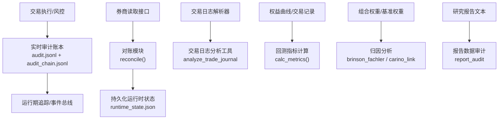
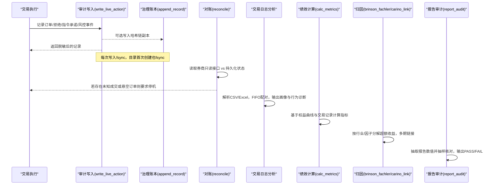
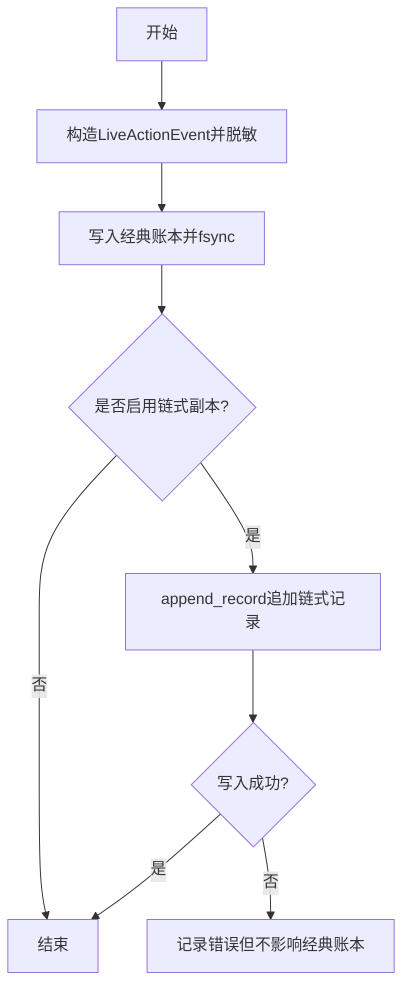
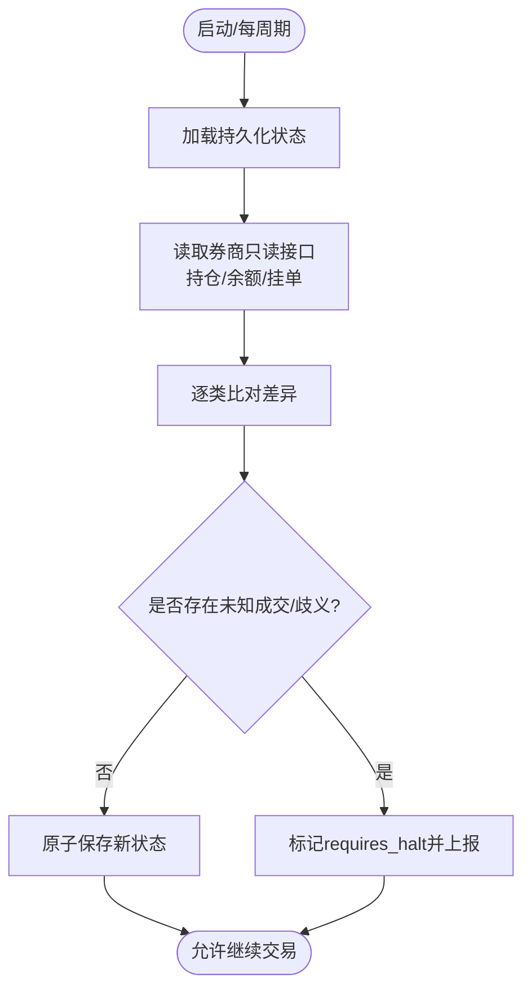
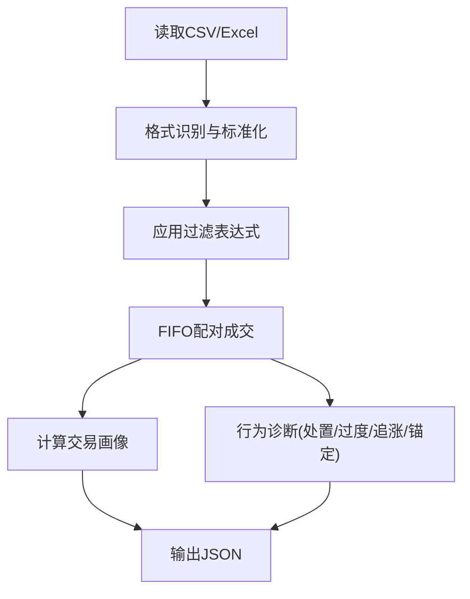
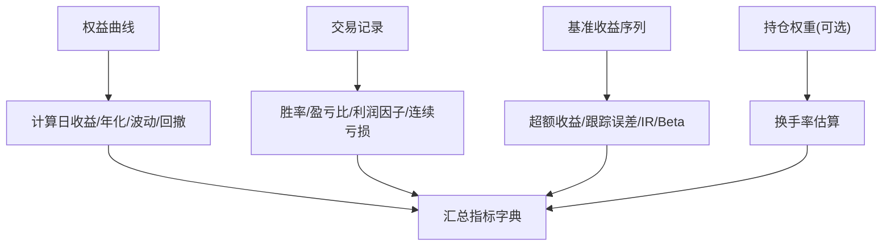
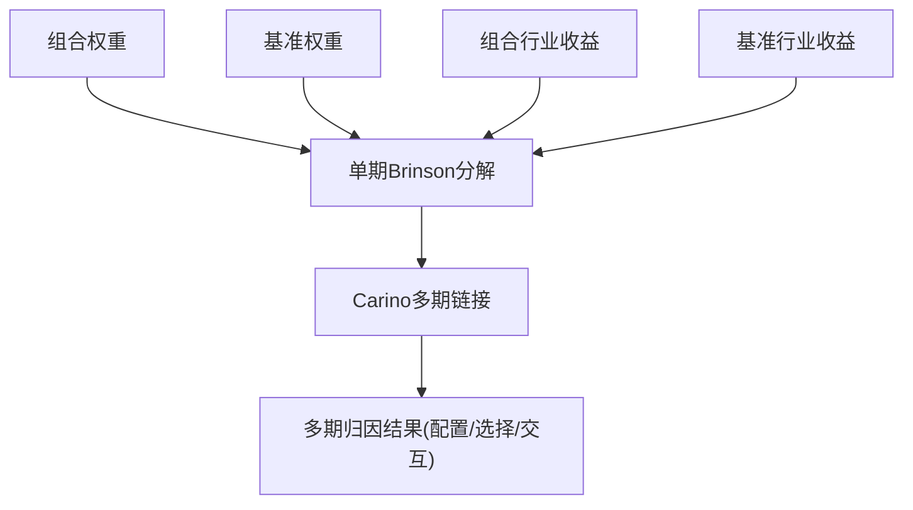
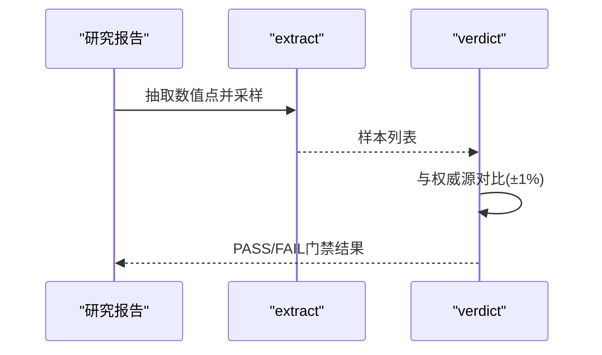
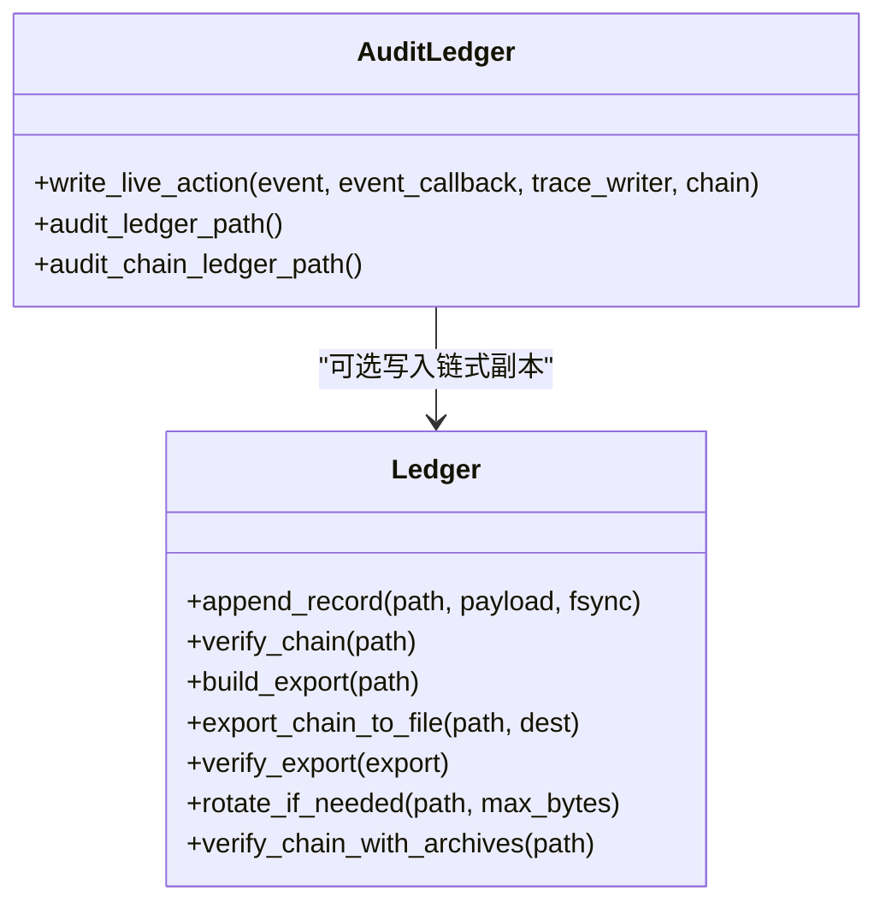
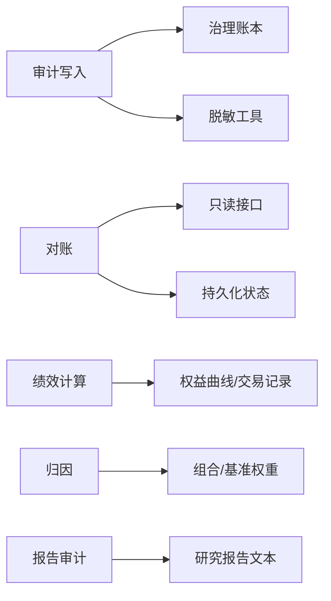

# 事后审计流程

<cite>
**本文引用的文件**
- [agent/src/live/audit.py](file://agent/src/live/audit.py)
- [agent/src/governance/ledger.py](file://agent/src/governance/ledger.py)
- [agent/src/live/runtime/reconcile.py](file://agent/src/live/runtime/reconcile.py)
- [agent/src/tools/trade_journal_tool.py](file://agent/src/tools/trade_journal_tool.py)
- [agent/backtest/metrics.py](file://agent/backtest/metrics.py)
- [agent/src/quantlib/attribution.py](file://agent/src/quantlib/attribution.py)
- [agent/src/swarm/presets/portfolio_review_board.yaml](file://agent/src/swarm/presets/portfolio_review_board.yaml)
- [agent/src/swarm/presets/quant_strategy_desk.yaml](file://agent/src/swarm/presets/quant_strategy_desk.yaml)
- [agent/src/swarm/presets/equity_research_team.yaml](file://agent/src/swarm/presets/equity_research_team.yaml)
- [agent/src/skills/performance-attribution/SKILL.md](file://agent/src/skills/performance-attribution/SKILL.md)
- [agent/src/tools/report_audit_tool.py](file://agent/src/tools/report_audit_tool.py)
</cite>

## 目录
1. [简介](#简介)
2. [项目结构](#项目结构)
3. [核心组件](#核心组件)
4. [架构总览](#架构总览)
5. [详细组件分析](#详细组件分析)
6. [依赖关系分析](#依赖关系分析)
7. [性能与可扩展性](#性能与可扩展性)
8. [故障排查指南](#故障排查指南)
9. [结论](#结论)
10. [附录](#附录)

## 简介
本技术文档面向“事后审计”全链路，覆盖交易记录完整性与准确性保证、交易日志与确认验证、对账机制、绩效分析与归因、合规报告生成、审计数据存储与管理、报表定制与脚本扩展、自动化与异常处理，以及不同类型交易的审计流程与报告示例。文档以代码级事实为依据，结合系统内已实现的模块与工具，给出可操作的流程说明与可视化图示。

## 项目结构
围绕事后审计的关键路径由以下模块构成：
- 实时行动审计账本：记录所有真实资金操作（下单、拒绝、指令承诺、风控触发/解除等），并支持哈希链防篡改与多路输出（合规账本、运行期追踪、事件总线）。
- 对账与恢复：在启动和每个交易周期前，将持久化状态与券商端事实进行比对，分类差异并决定是否允许继续交易。
- 交易日志解析与分析：解析多券商导出格式，计算持仓、胜率、盈亏比、行为偏差等指标。
- 绩效与归因：提供年化收益、波动率、回撤、夏普/索提诺/卡玛等信息比率，以及Brinson行业配置/选择/交互效应分解与Carino多期链接。
- 合规报告与数据审计：抽取报告中的数值点并与权威源对比，形成PASS/FAIL门禁。
- 存储与归档：JSONL追加式账本，带fsync、独占锁、分段归档与跨段校验。

**图表来源**
- [agent/src/live/audit.py:1-352](file://agent/src/live/audit.py#L1-L352)
- [agent/src/live/runtime/reconcile.py:1-609](file://agent/src/live/runtime/reconcile.py#L1-L609)
- [agent/src/tools/trade_journal_tool.py:1-536](file://agent/src/tools/trade_journal_tool.py#L1-L536)
- [agent/backtest/metrics.py:1-641](file://agent/backtest/metrics.py#L1-L641)
- [agent/src/quantlib/attribution.py:1-413](file://agent/src/quantlib/attribution.py#L1-L413)
- [agent/src/tools/report_audit_tool.py:358-418](file://agent/src/tools/report_audit_tool.py#L358-L418)

**章节来源**
- [agent/src/live/audit.py:1-352](file://agent/src/live/audit.py#L1-L352)
- [agent/src/live/runtime/reconcile.py:1-609](file://agent/src/live/runtime/reconcile.py#L1-L609)
- [agent/src/tools/trade_journal_tool.py:1-536](file://agent/src/tools/trade_journal_tool.py#L1-L536)
- [agent/backtest/metrics.py:1-641](file://agent/backtest/metrics.py#L1-L641)
- [agent/src/quantlib/attribution.py:1-413](file://agent/src/quantlib/attribution.py#L1-L413)
- [agent/src/tools/report_audit_tool.py:358-418](file://agent/src/tools/report_audit_tool.py#L358-L418)

## 核心组件
- 实时审计账本与防篡改链：为每笔真实资金动作写入不可变记录，支持可选的哈希链副本，确保可追溯、可验证、可离线核验。
- 对账与恢复：通过只读接口拉取券商事实，与本地持久化状态比对，分类差异并强制在歧义时停机上报。
- 交易日志分析：统一解析多券商导出，FIFO配对成交，输出交易画像与行为诊断。
- 绩效与归因：标准化指标计算与Brinson归因，支持多期链接与基准对比。
- 报告数据审计：抽取报告数值并抽样核对，形成发布门禁。
- 存储与归档：追加式JSONL、fsync、独占锁、分段归档与跨段校验。

**章节来源**
- [agent/src/live/audit.py:1-352](file://agent/src/live/audit.py#L1-L352)
- [agent/src/governance/ledger.py:1-739](file://agent/src/governance/ledger.py#L1-L739)
- [agent/src/live/runtime/reconcile.py:1-609](file://agent/src/live/runtime/reconcile.py#L1-L609)
- [agent/src/tools/trade_journal_tool.py:1-536](file://agent/src/tools/trade_journal_tool.py#L1-L536)
- [agent/backtest/metrics.py:1-641](file://agent/backtest/metrics.py#L1-L641)
- [agent/src/quantlib/attribution.py:1-413](file://agent/src/quantlib/attribution.py#L1-L413)
- [agent/src/tools/report_audit_tool.py:358-418](file://agent/src/tools/report_audit_tool.py#L358-L418)

## 架构总览
下图展示从交易到审计、对账、绩效与报告的端到端数据流与控制流。

**图表来源**
- [agent/src/live/audit.py:248-352](file://agent/src/live/audit.py#L248-L352)
- [agent/src/governance/ledger.py:368-469](file://agent/src/governance/ledger.py#L368-L469)
- [agent/src/live/runtime/reconcile.py:275-366](file://agent/src/live/runtime/reconcile.py#L275-L366)
- [agent/src/tools/trade_journal_tool.py:561-628](file://agent/src/tools/trade_journal_tool.py#L561-L628)
- [agent/backtest/metrics.py:461-626](file://agent/backtest/metrics.py#L461-L626)
- [agent/src/quantlib/attribution.py:209-413](file://agent/src/quantlib/attribution.py#L209-L413)
- [agent/src/tools/report_audit_tool.py:427-460](file://agent/src/tools/report_audit_tool.py#L427-L460)

## 详细组件分析

### 实时审计账本与防篡改链
- 功能要点
  - 每笔真实资金动作写入专用追加式账本，字段包含会话ID、动作类型、结果、券商请求/响应（脱敏）、风控门决策等。
  - 可选写入哈希链副本，每条记录携带序列号与前序记录哈希，支持端到端校验与离线核验。
  - 写入路径：先写经典账本并fsync，再尝试写入链式副本；链写入失败不影响经典账本，但会留下可检测的空缺。
  - 多路输出：合规账本（必选）、运行期追踪（可选）、事件总线（可选）。
- 关键数据结构
  - LiveActionEvent：定义动作类型、结果、时间戳、引用关系、请求/响应、风控决策等。
  - 链式账本：compute_record_hash、verify_chain、build_export、verify_export、rotate_if_needed、verify_chain_with_archives。
- 安全与可靠性
  - fsync保障落盘；首次创建目录也fsync；跨进程独占锁避免并发冲突；拒绝向已损坏的链追加。

**图表来源**
- [agent/src/live/audit.py:248-352](file://agent/src/live/audit.py#L248-L352)
- [agent/src/governance/ledger.py:368-469](file://agent/src/governance/ledger.py#L368-L469)

**章节来源**
- [agent/src/live/audit.py:1-352](file://agent/src/live/audit.py#L1-L352)
- [agent/src/governance/ledger.py:1-739](file://agent/src/governance/ledger.py#L1-L739)

### 对账与恢复（崩溃恢复与头寸一致性）
- 设计契约
  - 仅使用只读回调获取券商事实，绝不持有或调用写接口，杜绝自动重发导致的双击风险。
  - 比较本地持久化状态与券商事实，分类差异为匹配、未知成交、孤儿订单、中途订单歧义。
  - 出现未知成交或中途订单歧义时，报告requires_halt，运行器必须停机上报。
- 流程要点
  - 冷启动无历史状态时，直接以券商事实作为基线。
  - 干净对账后原子更新持久化状态（临时文件+替换）。
  - 未决歧义不覆盖原始记录，便于人工核查。

**图表来源**
- [agent/src/live/runtime/reconcile.py:275-366](file://agent/src/live/runtime/reconcile.py#L275-L366)
- [agent/src/live/runtime/reconcile.py:369-529](file://agent/src/live/runtime/reconcile.py#L369-L529)
- [agent/src/live/runtime/reconcile.py:570-609](file://agent/src/live/runtime/reconcile.py#L570-L609)

**章节来源**
- [agent/src/live/runtime/reconcile.py:1-609](file://agent/src/live/runtime/reconcile.py#L1-L609)

### 交易日志解析与行为诊断
- 能力范围
  - 解析多券商导出（同花顺/东方财富/富途/通用），标准化字段并排序。
  - FIFO配对成交，计算持仓天数、胜率、盈亏比、累计PnL、最大回撤、热门标的、市场/小时分布等。
  - 行为诊断：处置效应、过度交易、追涨、锚定效应，均附带严重度与证据。
- 输入输出
  - 输入：CSV/Excel文件路径、分析类型（完整/画像/行为/策略占位）、过滤表达式（日期区间、标的、市场）。
  - 输出：结构化JSON，含统计、分布、样本成交与行为诊断。

**图表来源**
- [agent/src/tools/trade_journal_tool.py:561-628](file://agent/src/tools/trade_journal_tool.py#L561-L628)
- [agent/src/tools/trade_journal_tool.py:34-89](file://agent/src/tools/trade_journal_tool.py#L34-L89)
- [agent/src/tools/trade_journal_tool.py:96-169](file://agent/src/tools/trade_journal_tool.py#L96-L169)
- [agent/src/tools/trade_journal_tool.py:182-358](file://agent/src/tools/trade_journal_tool.py#L182-L358)

**章节来源**
- [agent/src/tools/trade_journal_tool.py:1-536](file://agent/src/tools/trade_journal_tool.py#L1-L536)

### 绩效分析与基准对比
- 指标体系
  - 年化收益、波动率、最大回撤、夏普、索提诺、卡玛、胜率、盈亏比、利润因子、跟踪误差、信息比率、基准Beta、换手率等。
  - 支持不同数据源的年化处理映射（A股/港股/美股/加密/外汇等）。
- 基准对比
  - 可传入基准收益率序列，计算超额收益、跟踪误差与信息比率。
- 适用场景
  - 回测与实盘均可复用同一指标函数，保证口径一致。

**图表来源**
- [agent/backtest/metrics.py:461-626](file://agent/backtest/metrics.py#L461-L626)
- [agent/backtest/metrics.py:153-170](file://agent/backtest/metrics.py#L153-L170)

**章节来源**
- [agent/backtest/metrics.py:1-641](file://agent/backtest/metrics.py#L1-L641)

### 归因分析（Brinson与多期链接）
- 单期分解
  - 将主动收益分解为配置效应、选择效应与交互效应，三者之和等于主动收益，无残差。
  - 严格校验权重总和一致，否则报错。
- 多期链接
  - 使用Carino对数链接方法，消除算术加总导致的复利偏差，得到无残差的多期归因。
- 实践建议
  - 结合技能文档中的基准选择与风险调整指标框架，形成可审计的归因报告。

**图表来源**
- [agent/src/quantlib/attribution.py:209-413](file://agent/src/quantlib/attribution.py#L209-L413)
- [agent/src/skills/performance-attribution/SKILL.md:1-278](file://agent/src/skills/performance-attribution/SKILL.md#L1-L278)

**章节来源**
- [agent/src/quantlib/attribution.py:1-413](file://agent/src/quantlib/attribution.py#L1-L413)
- [agent/src/skills/performance-attribution/SKILL.md:1-278](file://agent/src/skills/performance-attribution/SKILL.md#L1-L278)

### 合规报告生成与数据审计
- 报告数据审计
  - 抽取Markdown报告中的数值点，随机采样并与权威数据源对比（容差1%），输出PASS/FAIL门禁。
  - 适用于研究/投研/策略报告发布前的质量把关。
- 监管报告与审计输出
  - 可通过治理账本的导出与验证能力，生成自包含的可离线核验导出包，用于审计留痕。

**图表来源**
- [agent/src/tools/report_audit_tool.py:427-460](file://agent/src/tools/report_audit_tool.py#L427-L460)
- [agent/src/governance/ledger.py:496-585](file://agent/src/governance/ledger.py#L496-L585)

**章节来源**
- [agent/src/tools/report_audit_tool.py:358-418](file://agent/src/tools/report_audit_tool.py#L358-L418)
- [agent/src/governance/ledger.py:496-585](file://agent/src/governance/ledger.py#L496-L585)

### 审计数据的存储与管理
- 存储格式
  - JSONL追加式文件，每条记录一行JSON，支持fsync与目录fsync。
  - 可选哈希链副本，具备seq、prev_record_hash、record_hash字段。
- 归档策略
  - 达到阈值后滚动归档为分段文件，保留全部历史，删除任何片段均可被检测到。
  - 支持跨段验证，确保整条历史链完整。
- 查询与核验
  - verify_chain/verify_export提供端到端校验；build_export生成可离线核验的导出包。

**图表来源**
- [agent/src/governance/ledger.py:368-739](file://agent/src/governance/ledger.py#L368-L739)
- [agent/src/live/audit.py:248-352](file://agent/src/live/audit.py#L248-L352)

**章节来源**
- [agent/src/governance/ledger.py:1-739](file://agent/src/governance/ledger.py#L1-L739)
- [agent/src/live/audit.py:1-352](file://agent/src/live/audit.py#L1-L352)

### 审计报表定制与自定义分析脚本
- 定制思路
  - 基于交易日志分析工具的输出，叠加自定义过滤与聚合逻辑，生成机构/个人风格报表。
  - 利用绩效指标与归因结果，构建组合维度的看板与预警。
- 脚本开发
  - 可直接调用metrics与attribution模块，结合trade_journal_tool输出，编写批处理脚本。
  - 使用report_audit对生成的报告进行数值抽检，确保对外发布质量。

**章节来源**
- [agent/src/tools/trade_journal_tool.py:561-628](file://agent/src/tools/trade_journal_tool.py#L561-L628)
- [agent/backtest/metrics.py:461-626](file://agent/backtest/metrics.py#L461-L626)
- [agent/src/quantlib/attribution.py:209-413](file://agent/src/quantlib/attribution.py#L209-L413)
- [agent/src/tools/report_audit_tool.py:427-460](file://agent/src/tools/report_audit_tool.py#L427-L460)

### 自动化与异常处理
- 自动化
  - 对账模块在启动与每周期自动执行，干净对账才推进状态；异常即停机上报。
  - 审计写入默认开启链式副本，失败仅记录错误，不阻断主流程。
- 异常处理
  - 对账遇到未知成交或歧义订单，设置requires_halt，阻止后续交易。
  - 账本fsync失败降级为flush-only并告警；链式追加失败记录错误并保留缺口以便后续发现。

**章节来源**
- [agent/src/live/runtime/reconcile.py:275-366](file://agent/src/live/runtime/reconcile.py#L275-L366)
- [agent/src/live/audit.py:301-340](file://agent/src/live/audit.py#L301-L340)
- [agent/src/governance/ledger.py:434-469](file://agent/src/governance/ledger.py#L434-L469)

### 不同类型交易的审计流程与报告示例
- 股票/ETF
  - 交易日志：解析券商导出，FIFO配对，输出画像与行为诊断。
  - 绩效与归因：计算年化收益、波动、回撤、夏普/索提诺/卡玛；按行业/因子分解超额收益。
  - 合规报告：抽取报告数值并抽样核对，生成PASS/FAIL。
- 期货/期权
  - 对账：关注保证金与持仓变化，确保与券商一致。
  - 绩效：考虑合约换月与展期成本，使用实际成交与权益曲线计算指标。
  - 归因：可按品种/期限结构维度进行配置效应分析。
- 加密资产
  - 日志：支持多交易所导出格式；注意24x7交易与高波动下的异常值处理。
  - 绩效：采用加密源年化处理映射；关注滑点与手续费对净收益的影响。
  - 合规：链上/交易所流水与内部账本交叉核对，必要时引入外部数据源。

[本节为概念性说明，不直接分析具体文件]

## 依赖关系分析
- 组件耦合
  - 审计写入依赖治理账本（可选链式副本）与脱敏工具。
  - 对账模块依赖只读回调与持久化状态，不耦合写路径。
  - 绩效与归因模块相互独立，可分别被报表与看板调用。
- 外部依赖
  - 券商只读接口（MCP/REST）用于对账。
  - 数据源（行情/基本面）用于基准与归因。
- 循环依赖
  - 各模块职责清晰，未见循环导入；审计与对账解耦于交易执行。

**图表来源**
- [agent/src/live/audit.py:248-352](file://agent/src/live/audit.py#L248-L352)
- [agent/src/governance/ledger.py:368-469](file://agent/src/governance/ledger.py#L368-L469)
- [agent/src/live/runtime/reconcile.py:275-366](file://agent/src/live/runtime/reconcile.py#L275-L366)
- [agent/backtest/metrics.py:461-626](file://agent/backtest/metrics.py#L461-L626)
- [agent/src/quantlib/attribution.py:209-413](file://agent/src/quantlib/attribution.py#L209-L413)
- [agent/src/tools/report_audit_tool.py:427-460](file://agent/src/tools/report_audit_tool.py#L427-L460)

**章节来源**
- [agent/src/live/audit.py:1-352](file://agent/src/live/audit.py#L1-L352)
- [agent/src/governance/ledger.py:1-739](file://agent/src/governance/ledger.py#L1-L739)
- [agent/src/live/runtime/reconcile.py:1-609](file://agent/src/live/runtime/reconcile.py#L1-L609)
- [agent/backtest/metrics.py:1-641](file://agent/backtest/metrics.py#L1-L641)
- [agent/src/quantlib/attribution.py:1-413](file://agent/src/quantlib/attribution.py#L1-L413)
- [agent/src/tools/report_audit_tool.py:358-418](file://agent/src/tools/report_audit_tool.py#L358-L418)

## 性能与可扩展性
- 写入性能
  - 审计写入为低频事件（单笔订单/风控事件），fsync开销可接受；链式追加O(n)校验在低吞吐下合理。
- 对账性能
  - 对账仅在启动与每周期执行，复杂度取决于持仓与挂单规模，通常可控。
- 可扩展性
  - 新增券商只需实现只读回调；新增指标/归因维度可复用现有模块。
  - 报表与脚本可通过工具接口快速组装，无需侵入核心流程。

[本节提供一般性指导，不直接分析具体文件]

## 故障排查指南
- 常见异常
  - 对账requires_halt：检查未知成交或歧义订单，定位持久化状态与券商事实差异。
  - 链式账本追加失败：查看错误日志，确认文件系统权限与磁盘空间；经典账本仍有效。
  - 报告审计FAIL：核对抽取的数值点与权威源，修正报告或数据源。
- 定位步骤
  - 使用verify_chain/verify_export核验账本完整性。
  - 使用report_audit的extract与verdict两阶段定位问题。
  - 使用交易日志分析工具复核交易画像与行为诊断。

**章节来源**
- [agent/src/live/runtime/reconcile.py:275-366](file://agent/src/live/runtime/reconcile.py#L275-L366)
- [agent/src/governance/ledger.py:496-585](file://agent/src/governance/ledger.py#L496-L585)
- [agent/src/tools/report_audit_tool.py:427-460](file://agent/src/tools/report_audit_tool.py#L427-L460)

## 结论
本系统提供了完整的事后审计闭环：从真实资金动作的不可变记录、对账与恢复、交易日志解析与行为诊断，到绩效与归因、合规报告数据审计与存储归档。通过严格的fsync、哈希链与只读对账设计，确保审计数据的完整性与准确性；通过模块化指标与归因能力，支撑多维度绩效分析与基准对比；通过报告审计与导出核验，满足合规与审计需求。建议在生产环境中默认启用链式副本与对账停机策略，并结合业务场景定制报表与脚本。

[本节为总结性内容，不直接分析具体文件]

## 附录
- 相关预设与工作流
  - 投资组合评审板：执行质量分析、基准对比、换手健康度、执行改进建议。
  - 量化策略工作台：策略逻辑、回测指标、风险审计、报告聚合。
  - 股票研究团队：整合多维分析，产出专业投资研究报告。
  - 绩效归因技能：基准选择、风险调整指标、滚动分析框架。

**章节来源**
- [agent/src/swarm/presets/portfolio_review_board.yaml:45-210](file://agent/src/swarm/presets/portfolio_review_board.yaml#L45-L210)
- [agent/src/swarm/presets/quant_strategy_desk.yaml:61-148](file://agent/src/swarm/presets/quant_strategy_desk.yaml#L61-L148)
- [agent/src/swarm/presets/equity_research_team.yaml:78-104](file://agent/src/swarm/presets/equity_research_team.yaml#L78-L104)
- [agent/src/skills/performance-attribution/SKILL.md:201-233](file://agent/src/skills/performance-attribution/SKILL.md#L201-L233)