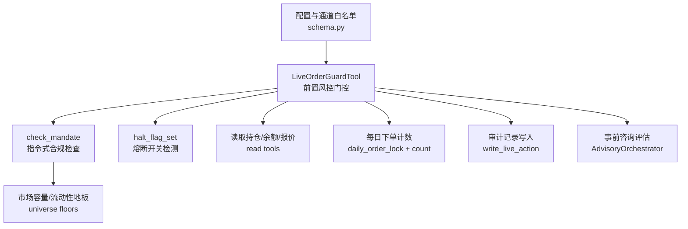
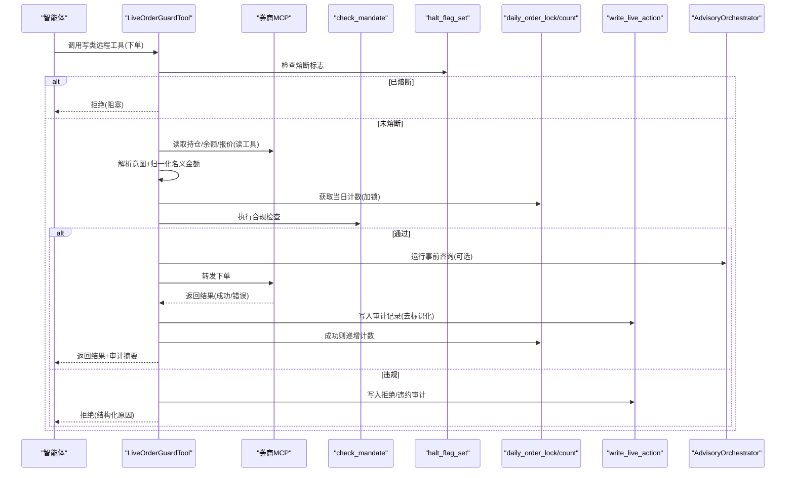
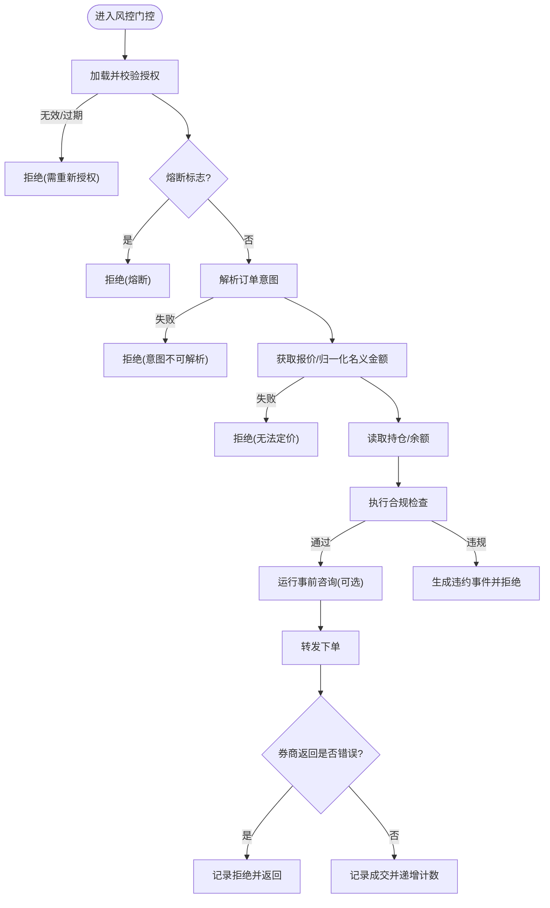
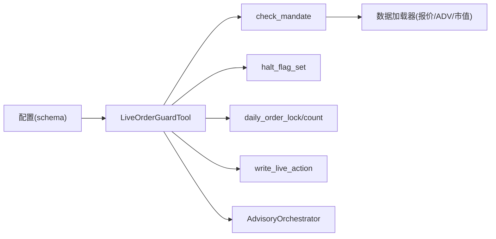

# 风险审查流程

<cite>
**本文引用的文件**
- [order_guard.py](file://agent/src/live/order_guard.py)
- [enforcement.py](file://agent/src/live/enforcement.py)
- [halt.py](file://agent/src/live/halt.py)
- [audit.py](file://agent/src/live/audit.py)
- [daily_count.py](file://agent/src/live/daily_count.py)
- [advisory/__init__.py](file://agent/src/live/advisory/__init__.py)
- [schema.py](file://agent/src/config/schema.py)
</cite>

## 目录
1. [简介](#简介)
2. [项目结构](#项目结构)
3. [核心组件](#核心组件)
4. [架构总览](#架构总览)
5. [详细组件分析](#详细组件分析)
6. [依赖关系分析](#依赖关系分析)
7. [性能考量](#性能考量)
8. [故障排查指南](#故障排查指南)
9. [结论](#结论)
10. [附录](#附录)

## 简介
本技术文档围绕“风险审查流程”展开，覆盖事前检查、事中监控与干预、事后审计三大阶段，并给出阈值管理、规则配置与自定义扩展、事件处理与应急响应的实践说明。系统以“失败即关闭（fail-closed）”为基本原则：任何不可解析、缺失数据或异常均拒绝交易，确保在不确定时优先保护资金安全。

## 项目结构
风险审查相关代码集中在 live 交易运行时模块中，围绕订单前置校验、强制合规、熔断开关、审计账本、日度计数与可插拔的事前咨询评估等能力构建。

图表来源
- [order_guard.py:130-214](file://agent/src/live/order_guard.py#L130-L214)
- [enforcement.py:458-620](file://agent/src/live/enforcement.py#L458-L620)
- [halt.py:135-163](file://agent/src/live/halt.py#L135-L163)
- [daily_count.py:72-135](file://agent/src/live/daily_count.py#L72-L135)
- [audit.py:248-352](file://agent/src/live/audit.py#L248-L352)
- [advisory/__init__.py:175-233](file://agent/src/live/advisory/__init__.py#L175-L233)
- [schema.py:514-548](file://agent/src/config/schema.py#L514-L548)

章节来源
- [order_guard.py:1-89](file://agent/src/live/order_guard.py#L1-L89)
- [enforcement.py:1-26](file://agent/src/live/enforcement.py#L1-L26)
- [halt.py:1-26](file://agent/src/live/halt.py#L1-L26)
- [audit.py:1-59](file://agent/src/live/audit.py#L1-L59)
- [daily_count.py:1-7](file://agent/src/live/daily_count.py#L1-L7)
- [advisory/__init__.py:1-22](file://agent/src/live/advisory/__init__.py#L1-L22)
- [schema.py:11-47](file://agent/src/config/schema.py#L11-L47)

## 核心组件
- 前置风控门控（LiveOrderGuardTool）：在每个写类远程工具调用前执行统一的风控流水线，包含授权有效性、熔断开关、意图解析、报价归一化、持仓/余额快照、合规检查、日度计数与审计记录。
- 强制合规引擎（check_mandate）：按固定顺序执行排除清单、允许工具类型、资产类别、单笔名义金额、总敞口、杠杆、日度下单次数、资金上限与昂贵宇宙规则（市值/流动性地板）。
- 熔断开关（halt）：基于文件系统的全局/分券商即时停机；支持注册“预emptive 动作”以取消挂单与平仓。
- 审计账本（audit）：将每次真实资金操作写入不可变审计日志，支持去标识化、追加持久化与可选的哈希链防篡改副本。
- 日度下单计数（daily_count）：跨进程原子计数与锁，防止并发重复下单导致超限。
- 事前咨询评估（Advisory）：可插拔的外部风险评估服务，仅做观察性建议，不阻断交易。

章节来源
- [order_guard.py:97-214](file://agent/src/live/order_guard.py#L97-L214)
- [enforcement.py:111-177](file://agent/src/live/enforcement.py#L111-L177)
- [halt.py:72-163](file://agent/src/live/halt.py#L72-L163)
- [audit.py:172-352](file://agent/src/live/audit.py#L172-L352)
- [daily_count.py:34-135](file://agent/src/live/daily_count.py#L34-L135)
- [advisory/__init__.py:59-233](file://agent/src/live/advisory/__init__.py#L59-L233)

## 架构总览
下图展示一次真实下单请求从进入风控门控到最终放行或被拒绝的关键路径，以及各阶段的决策点与副作用。

图表来源
- [order_guard.py:130-214](file://agent/src/live/order_guard.py#L130-L214)
- [order_guard.py:364-432](file://agent/src/live/order_guard.py#L364-L432)
- [enforcement.py:458-620](file://agent/src/live/enforcement.py#L458-L620)
- [halt.py:135-163](file://agent/src/live/halt.py#L135-L163)
- [daily_count.py:72-135](file://agent/src/live/daily_count.py#L72-L135)
- [audit.py:248-352](file://agent/src/live/audit.py#L248-L352)
- [advisory/__init__.py:175-233](file://agent/src/live/advisory/__init__.py#L175-L233)

## 详细组件分析

### 事前检查机制（预审批、风险评估、合规检查）
- 预审批规则
  - 授权有效性：加载当前授权指令（mandate），校验版本与过期时间；过期或未找到直接拒绝。
  - 熔断开关：若全局或分券商存在 HALT 文件，立即拒绝所有下单。
  - 意图解析：将原始参数标准化为 OrderIntent；无法解析则拒绝。
  - 名义金额归一化：当存在 quantity 时，优先使用券商报价工具获取价格，否则回退至数据加载器；取显式名义金额与 implied notional 的较大值，避免绕过限额。
- 实时风控与异常检测
  - 读取持仓与账户余额用于后续敞口与杠杆计算。
  - 若报价不可用，quantity 订单直接拒绝（fail-closed）。
- 合规检查（check_mandate）
  - 排除清单 > 允许工具类型 > 资产类别 > 单笔名义金额 > 总敞口 > 杠杆 > 日度下单次数 > 资金上限 > 昂贵宇宙规则（市值/流动性地板）。
  - 任一失败即产生 BreachEvent；结构性违规直接拒绝，数量型违规暂停并要求重新授权。

图表来源
- [order_guard.py:130-214](file://agent/src/live/order_guard.py#L130-L214)
- [order_guard.py:218-288](file://agent/src/live/order_guard.py#L218-L288)
- [enforcement.py:458-620](file://agent/src/live/enforcement.py#L458-L620)

章节来源
- [order_guard.py:130-214](file://agent/src/live/order_guard.py#L130-L214)
- [order_guard.py:218-288](file://agent/src/live/order_guard.py#L218-L288)
- [enforcement.py:458-620](file://agent/src/live/enforcement.py#L458-L620)

### 事中监控体系（实时风控、异常检测、自动干预）
- 实时风控
  - 每个写类远程工具调用都经过 LiveOrderGuardTool 的统一门控，保证在任何外部异常下仍执行风控。
  - 报价获取优先使用券商读工具，失败则回退至数据加载器；任何失败均拒绝。
- 异常检测
  - 券商返回的错误信封会被识别并记录为“订单被拒”，且不消耗日度计数。
  - 审计记录包含完整上下文（请求、响应、门禁决策），便于追踪。
- 自动干预
  - 熔断开关：通过文件系统实现 LLM 无关的即时停机；支持全局与分券商级别。
  - 预emptive 动作：当检测到熔断时，可触发取消挂单与按指令平仓的动作（由 runner 注册并调用）。

章节来源
- [order_guard.py:364-432](file://agent/src/live/order_guard.py#L364-L432)
- [halt.py:72-163](file://agent/src/live/halt.py#L72-L163)
- [halt.py:218-281](file://agent/src/live/halt.py#L218-L281)

### 事后审计流程（交易记录、绩效分析、合规报告）
- 交易记录
  - 所有真实资金操作（下单、拒绝、违约、熔断触发/清除）均写入独立审计账本，采用追加模式与 fsync 持久化。
  - 敏感信息在写入前进行去标识化处理，避免泄露凭证与账号。
- 绩效分析与合规报告
  - 审计记录包含会话ID、授权快照引用、同意记录引用、网关决策、错误信息等，可用于回溯与合规审计。
  - 可选地同时写入哈希链副本，提供防篡改证据。

章节来源
- [audit.py:172-352](file://agent/src/live/audit.py#L172-L352)

### 风险阈值管理（动态调整、分级预警、熔断机制）
- 动态调整
  - 通过授权指令（mandate）中的硬上限字段控制单笔名义金额、总敞口、杠杆、日度下单次数与资金上限；修改后即刻生效于下一次下单。
- 分级预警
  - 结构性违规（排除清单、不允许的工具类型/资产类别）直接拒绝；数量型违规（如超敞口/杠杆）暂停并要求重新授权。
- 熔断机制
  - 全局或分券商级别的 HALT 文件即可停止所有交易；支持读取元数据（触发时间、来源、原因）。

章节来源
- [enforcement.py:458-620](file://agent/src/live/enforcement.py#L458-L620)
- [halt.py:72-163](file://agent/src/live/halt.py#L72-L163)

### 风险规则配置示例与自定义规则开发指南
- 配置要点
  - 对真实券商通道（如 Robinhood、IBKR）禁止使用通配符 enabledTools 白名单，必须显式列出只读工具；写类工具仅在用户手动编辑配置且存在有效授权后才可用。
  - OAuth 仅支持 HTTPS，且静态头与 OAuth 互斥。
- 自定义规则
  - 事前咨询评估接口（PreTradeAdvisoryInterface）允许接入外部风险评估服务；实现 review(context) 返回评估结果，由 Orchestrator 聚合最坏结果。
  - 可通过 register_advisory_provider 注册多个提供商，默认关闭，需环境变量开启。

章节来源
- [schema.py:514-548](file://agent/src/config/schema.py#L514-L548)
- [advisory/__init__.py:121-233](file://agent/src/live/advisory/__init__.py#L121-L233)

### 风险事件处理与应急响应流程
- 事件分类
  - 订单放置、订单拒绝、违约、熔断触发/清除、授权提交等。
- 处理策略
  - 结构性违规：直接拒绝，无需重新授权。
  - 数量型违规：暂停并要求重新授权，附带违约详情与建议行动。
  - 熔断：立即阻止所有新订单；可触发预emptive 动作清理风险头寸。
- 审计与通知
  - 所有事件写入审计账本，并可经 SSE 总线推送前端/CLI 实时渲染。

章节来源
- [order_guard.py:514-616](file://agent/src/live/order_guard.py#L514-L616)
- [audit.py:120-136](file://agent/src/live/audit.py#L120-L136)
- [halt.py:218-281](file://agent/src/live/halt.py#L218-L281)

### 不同类型交易的风险管理策略
- 股票/ETF
  - 适用市值与流动性地板检查；通过数据加载器获取最近收盘价作为报价回退。
- 加密货币
  - 通过对应数据加载器链获取报价；无市值/流动性地板时按策略 fail-closed。
- 外汇
  - 不应用市值/流动性地板；数量定价由连接器自身 sizing hook 负责。
- 期权/CFD
  - 不受资产类别桶约束，仅受允许工具类型限制；按策略 fail-closed。

章节来源
- [enforcement.py:57-91](file://agent/src/live/enforcement.py#L57-L91)
- [enforcement.py:245-288](file://agent/src/live/enforcement.py#L245-L288)
- [enforcement.py:623-679](file://agent/src/live/enforcement.py#L623-L679)

## 依赖关系分析

图表来源
- [order_guard.py:130-214](file://agent/src/live/order_guard.py#L130-L214)
- [enforcement.py:458-620](file://agent/src/live/enforcement.py#L458-L620)
- [daily_count.py:72-135](file://agent/src/live/daily_count.py#L72-L135)
- [audit.py:248-352](file://agent/src/live/audit.py#L248-L352)
- [advisory/__init__.py:175-233](file://agent/src/live/advisory/__init__.py#L175-L233)
- [schema.py:514-548](file://agent/src/config/schema.py#L514-L548)

章节来源
- [order_guard.py:130-214](file://agent/src/live/order_guard.py#L130-L214)
- [enforcement.py:458-620](file://agent/src/live/enforcement.py#L458-L620)
- [daily_count.py:72-135](file://agent/src/live/daily_count.py#L72-L135)
- [audit.py:248-352](file://agent/src/live/audit.py#L248-L352)
- [advisory/__init__.py:175-233](file://agent/src/live/advisory/__init__.py#L175-L233)
- [schema.py:514-548](file://agent/src/config/schema.py#L514-L548)

## 性能考量
- 报价获取优先级：先尝试券商读工具，再回退到数据加载器，减少网络开销并提高准确性。
- 昂贵的宇宙规则（市值/流动性）仅在必要时执行，且对无对应资产类别的交易跳过。
- 日度计数使用文件级非阻塞锁，避免并发竞争导致的重复计数或超限。
- 审计写入采用追加模式与 fsync，确保幂等与持久性；链式副本失败不影响主账本。

[本节为通用指导，不直接分析具体文件]

## 故障排查指南
- 常见拒绝原因
  - 授权无效或过期：检查授权快照与有效期。
  - 熔断触发：确认是否存在全局或分券商 HALT 文件。
  - 意图解析失败：核对下单参数是否符合预期。
  - 报价不可用：检查券商报价工具或数据加载器可用性。
  - 合规违规：查看 BreachEvent 的 limit、attempted_value 与 detail。
- 审计定位
  - 通过审计账本检索对应会话ID与远程工具名，查看 gate_decision 与 broker_response。
- 熔断恢复
  - 删除相应 HALT 文件；如需执行预emptive 动作，确保已注册 halt action。

章节来源
- [order_guard.py:514-616](file://agent/src/live/order_guard.py#L514-L616)
- [audit.py:248-352](file://agent/src/live/audit.py#L248-L352)
- [halt.py:111-163](file://agent/src/live/halt.py#L111-L163)

## 结论
该风险审查流程以“失败即关闭”为核心原则，通过前置门控、强制合规、熔断开关、审计账本与可插拔咨询评估，构建了覆盖事前、事中、事后的全链路风控体系。其设计强调可追溯、可审计与可扩展，既能满足严格合规要求，又能在异常情况下快速止损。

[本节为总结性内容，不直接分析具体文件]

## 附录
- 关键数据结构
  - OrderIntent：标准化订单意图，携带符号、方向、名义金额、数量、工具类型与资产类别。
  - BreachEvent：违约事件，描述触发的限制、限额值、尝试值与超量，并附带建议行动。
  - LiveActionEvent：审计事件，包含种类、会话、结果、服务器、远程工具、意图、授权引用、请求/响应、网关决策与错误。

章节来源
- [enforcement.py:111-177](file://agent/src/live/enforcement.py#L111-L177)
- [audit.py:172-246](file://agent/src/live/audit.py#L172-L246)