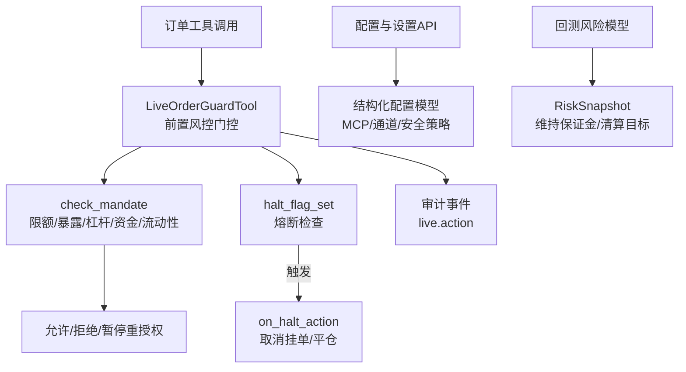
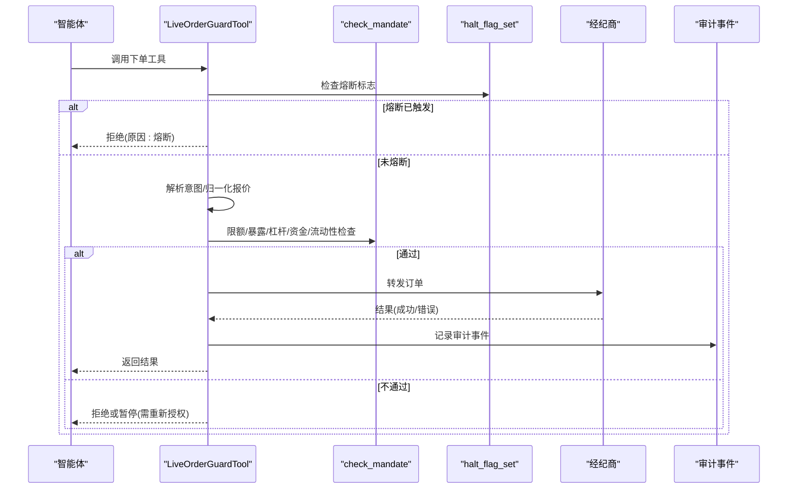
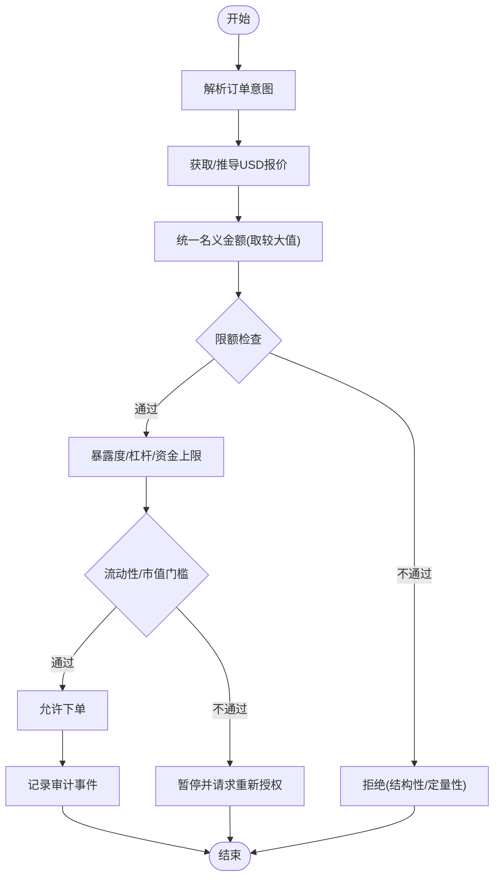
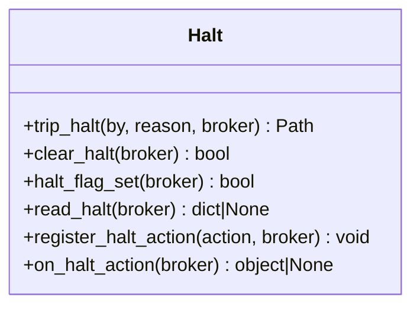
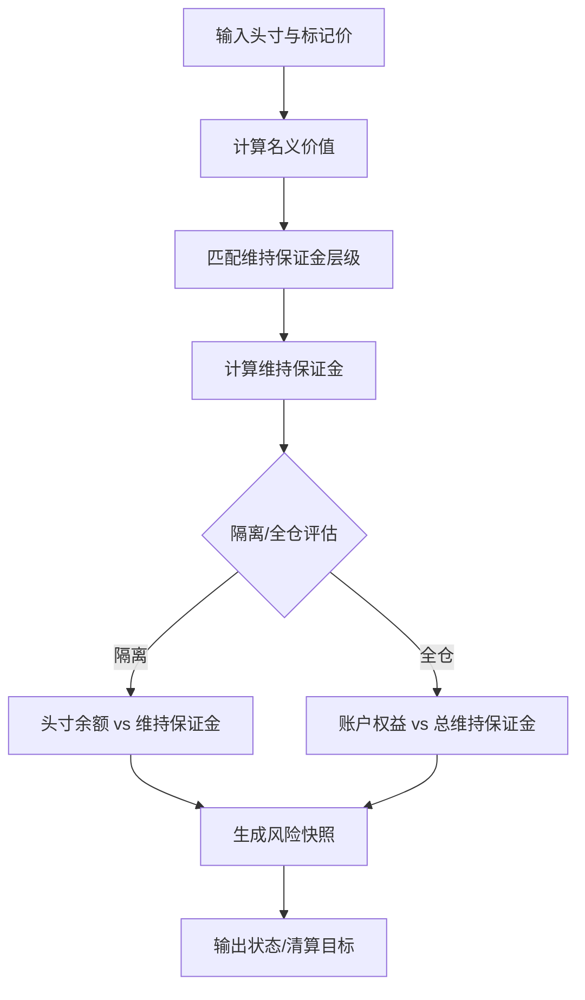
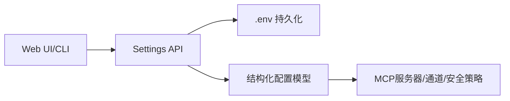
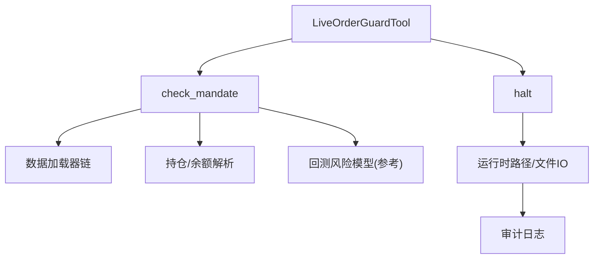

# 风险阈值管理

<cite>
**本文引用的文件**
- [perpetual_risk.py](file://agent/backtest/perpetual_risk.py)
- [halt.py](file://agent/src/live/halt.py)
- [enforcement.py](file://agent/src/live/enforcement.py)
- [order_guard.py](file://agent/src/live/order_guard.py)
- [schema.py](file://agent/src/config/schema.py)
- [settings_routes.py](file://agent/src/api/settings_routes.py)
- [api_server.py](file://agent/api_server.py)
- [models.py](file://agent/src/api/models.py)
- [SKILL.md（市场微观结构）](file://agent/src/skills/market-microstructure/SKILL.md)
- [SKILL.md（相关性制度）](file://agent/src/skills/correlation-regime/SKILL.md)
- [crypto_trading_desk.yaml](file://agent/src/swarm/presets/crypto_trading_desk.yaml)
</cite>

## 目录
1. [简介](#简介)
2. [项目结构](#项目结构)
3. [核心组件](#核心组件)
4. [架构总览](#架构总览)
5. [详细组件分析](#详细组件分析)
6. [依赖关系分析](#依赖关系分析)
7. [性能与稳定性考量](#性能与稳定性考量)
8. [故障排查指南](#故障排查指南)
9. [结论](#结论)
10. [附录：配置、API与回测优化](#附录配置api与回测优化)

## 简介
本技术文档围绕“风险阈值管理”展开，聚焦于交易系统中的动态阈值调整、分级预警、熔断机制、阈值配置与管理、以及回测与监控调优实践。系统通过“事前授权+实时校验+熔断保护”的三层防线，确保在复杂市场条件下仍能稳健运行。

- 动态阈值：基于账户状态与市场条件进行参数化约束；支持按资产类别、头寸规模与波动率等因子进行差异化控制。
- 分级预警：将违规分为结构性（直接拒绝）与定量性（暂停并请求重新授权），形成多级响应。
- 熔断机制：基于文件系统的全局/分经纪商熔断开关，独立于智能体循环，具备原子写入与审计溯源能力。
- 配置与管理：结构化配置模型、设置API、环境变量与版本化策略，保证可追溯与可回滚。
- 回测与优化：提供永续合约保证金与清算快照、历史波动与尾部估计、回撤与集中度度量，支撑阈值校准与验证。

## 项目结构
与风险阈值相关的代码主要分布在以下模块：
- 回测风险模型：永续合约保证金、维持保证金、清算判定与风险快照。
- 实盘前置风控：订单意图解析、限额检查、暴露度与杠杆约束、资金上限与流动性门槛。
- 熔断与执行门控：全局/分经纪商熔断标志、下单前拦截、审计事件与SSE广播。
- 配置与API：MCP服务器配置、设置读写接口、运行时环境读取与持久化。

**图示来源**
- [order_guard.py:130-214](file://agent/src/live/order_guard.py#L130-L214)
- [halt.py:135-163](file://agent/src/live/halt.py#L135-L163)
- [enforcement.py:458-620](file://agent/src/live/enforcement.py#L458-L620)
- [perpetual_risk.py:169-178](file://agent/backtest/perpetual_risk.py#L169-L178)

**章节来源**
- [order_guard.py:130-214](file://agent/src/live/order_guard.py#L130-L214)
- [halt.py:135-163](file://agent/src/live/halt.py#L135-L163)
- [enforcement.py:458-620](file://agent/src/live/enforcement.py#L458-L620)
- [perpetual_risk.py:169-178](file://agent/backtest/perpetual_risk.py#L169-L178)

## 核心组件
- 前置风控门控（LiveOrderGuardTool）：在每次下单前执行强制检查，包括授权有效性、过期、熔断、意图解析、报价归一化、限额与暴露度、杠杆与资金上限、日交易次数与流动性门槛。
- 指令合规检查（check_mandate）：以固定顺序执行多层限制，任何不可解析或缺失数据均“失败关闭”拒绝。
- 熔断系统（halt）：基于文件系统的原子写入与存在性判断，支持全局与分经纪商级别，附带审计元数据。
- 回测风险模型（perpetual_risk）：计算维持保证金、账户/头寸级清算判定、风险快照与保真标记。
- 配置与设置API：结构化模型保障配置安全，设置API负责读取与持久化敏感信息。

**章节来源**
- [order_guard.py:130-214](file://agent/src/live/order_guard.py#L130-L214)
- [enforcement.py:458-620](file://agent/src/live/enforcement.py#L458-L620)
- [halt.py:72-108](file://agent/src/live/halt.py#L72-L108)
- [perpetual_risk.py:181-191](file://agent/backtest/perpetual_risk.py#L181-L191)
- [schema.py:508-548](file://agent/src/config/schema.py#L508-L548)
- [settings_routes.py:364-389](file://agent/src/api/settings_routes.py#L364-L389)

## 架构总览
下图展示从订单到风控、熔断与审计的端到端流程，以及与回测风险模型的关联。

**图示来源**
- [order_guard.py:130-214](file://agent/src/live/order_guard.py#L130-L214)
- [enforcement.py:458-620](file://agent/src/live/enforcement.py#L458-L620)
- [halt.py:135-163](file://agent/src/live/halt.py#L135-L163)

## 详细组件分析

### 动态阈值与分级预警
- 动态阈值来源：
  - 账户状态：账户资金、持仓市值、杠杆、可用余额。
  - 市场条件：最后成交价、平均日成交额、市值门槛、波动率与相关性（用于预警）。
  - 策略指标：滚动窗口夏普、最大回撤、集中度等（用于策略健康度评估）。
- 分级预警：
  - 结构性违规（universe/instrument）：直接拒绝，无法通过放宽授权放行。
  - 定量性违规（quantitative）：暂停并请求重新授权，提示超限项与幅度。
- 阈值设定原则：
  - 基于观测分布与历史事件校准，避免拍脑袋数值。
  - 使用保守假设（如盘中不利价格）与保真标记增强鲁棒性。

**图示来源**
- [order_guard.py:218-288](file://agent/src/live/order_guard.py#L218-L288)
- [enforcement.py:458-620](file://agent/src/live/enforcement.py#L458-L620)

**章节来源**
- [order_guard.py:218-288](file://agent/src/live/order_guard.py#L218-L288)
- [enforcement.py:458-620](file://agent/src/live/enforcement.py#L458-L620)

### 熔断机制实现
- 触发条件：
  - 全局熔断：运行时根目录下存在HALT文件即生效。
  - 分经纪商熔断：对应经纪商目录下存在HALT文件。
- 行为特性：
  - 原子写入：临时文件+替换，避免部分写入导致误判。
  - 审计溯源：记录触发时间、来源与原因。
  - 预占动作：注册回调可在检测到熔断时取消挂单与按授权要求平仓。
- 恢复策略：
  - 删除对应HALT文件即可解除熔断；全局与分经纪商互不影响。

**图示来源**
- [halt.py:72-108](file://agent/src/live/halt.py#L72-L108)
- [halt.py:111-163](file://agent/src/live/halt.py#L111-L163)
- [halt.py:218-280](file://agent/src/live/halt.py#L218-L280)

**章节来源**
- [halt.py:72-108](file://agent/src/live/halt.py#L72-L108)
- [halt.py:111-163](file://agent/src/live/halt.py#L111-L163)
- [halt.py:218-280](file://agent/src/live/halt.py#L218-L280)

### 回测风险模型与阈值校准
- 维持保证金：根据名义价值与层级表计算，支持不同符号的维护费率与累计金额。
- 清算判定：
  - 隔离保证金：当某头寸保证金余额低于维持保证金时，标记该头寸为清算目标。
  - 全仓模式：账户总权益低于总维持保证金时，标记全部头寸为清算目标；空账户负余额视为破产。
- 风险快照：包含账户/头寸级别的权益、维持保证金、可用余额、状态与保真标记。
- 阈值校准建议：
  - 使用历史波动与尾部估计（如GPD）确定损失门限。
  - 结合相关性制度识别慢速崩溃与相关性重构。
  - 对闪崩场景采用VPIN、价差与流动性阈值作为预警。

**图示来源**
- [perpetual_risk.py:181-191](file://agent/backtest/perpetual_risk.py#L181-L191)
- [perpetual_risk.py:357-418](file://agent/backtest/perpetual_risk.py#L357-L418)

**章节来源**
- [perpetual_risk.py:181-191](file://agent/backtest/perpetual_risk.py#L181-L191)
- [perpetual_risk.py:357-418](file://agent/backtest/perpetual_risk.py#L357-L418)

### 阈值配置与管理
- 结构化配置：
  - MCP服务器配置与安全策略（禁止通配符白名单、仅读探测例外）。
  - 通道配置与操作者白名单。
- 设置API：
  - 读取/更新LLM与数据源设置，持久化至.env，权限控制与原子写入。
  - 公开接口返回配置状态与环境变量路径。
- 版本控制：
  - 授权版本与策略版本在加载时校验，防止不兼容配置进入生产。

**图示来源**
- [schema.py:508-548](file://agent/src/config/schema.py#L508-L548)
- [settings_routes.py:364-389](file://agent/src/api/settings_routes.py#L364-L389)
- [api_server.py:34-87](file://agent/api_server.py#L34-L87)

**章节来源**
- [schema.py:508-548](file://agent/src/config/schema.py#L508-L548)
- [settings_routes.py:364-389](file://agent/src/api/settings_routes.py#L364-L389)
- [api_server.py:34-87](file://agent/api_server.py#L34-L87)

### 不同类型资产的风险阈值示例
- 加密货币（永续合约）：
  - 基于维持保证金层级与资金上限，结合资金费率与清算风险。
  - 使用相关性门限与波动率门限进行预警；关注融资、清算簇与稳定币流向。
- 美股/ETF：
  - 市值与日均成交门槛过滤低流动性标的；暴露度与杠杆严格受限。
- 外汇：
  - 不适用市值/流动性门槛；数量定价由连接器自身大小钩子决定；资金上限与杠杆仍适用。
- 期权组合：
  - 无统一市值桶，受限于允许的工具与头寸维度；需额外考虑希腊字母与到期风险。

**章节来源**
- [crypto_trading_desk.yaml:162-186](file://agent/src/swarm/presets/crypto_trading_desk.yaml#L162-L186)
- [enforcement.py:57-91](file://agent/src/live/enforcement.py#L57-L91)
- [enforcement.py:623-679](file://agent/src/live/enforcement.py#L623-L679)

## 依赖关系分析
- LiveOrderGuardTool依赖：
  - 授权加载、熔断检查、意图提取、报价获取、限额检查、审计与日计数。
- check_mandate依赖：
  - 资产类别映射、数据加载器链、市值与流动性计算、账户与持仓解析。
- halt依赖：
  - 运行时路径、文件原子写入、审计日志、预占动作注册。
- 回测风险模型依赖：
  - 维持保证金层级、头寸与账户状态、标记价与资金费率。

**图示来源**
- [order_guard.py:130-214](file://agent/src/live/order_guard.py#L130-L214)
- [enforcement.py:458-620](file://agent/src/live/enforcement.py#L458-L620)
- [halt.py:135-163](file://agent/src/live/halt.py#L135-L163)
- [perpetual_risk.py:181-191](file://agent/backtest/perpetual_risk.py#L181-L191)

**章节来源**
- [order_guard.py:130-214](file://agent/src/live/order_guard.py#L130-L214)
- [enforcement.py:458-620](file://agent/src/live/enforcement.py#L458-L620)
- [halt.py:135-163](file://agent/src/live/halt.py#L135-L163)
- [perpetual_risk.py:181-191](file://agent/backtest/perpetual_risk.py#L181-L191)

## 性能与稳定性考量
- 失败关闭设计：所有不可解析或缺失数据的场景均拒绝，避免误放行。
- 原子性与幂等：熔断文件写入原子化，重复触发覆盖最新元数据。
- 报价归一化：同时存在显式名义金额与数量时，取较大值以避免绕过限额。
- 审计与可观测：每笔决策写入审计事件，SSE广播便于实时监控。
- 资源占用：数据加载器链自动降级，网络异常时快速失败，减少阻塞。

[本节为通用指导，无需特定文件引用]

## 故障排查指南
- 下单被拒绝：
  - 检查是否命中结构性违规（排除列表、不允许的工具/资产类）。
  - 检查定量性违规（名义金额、暴露度、杠杆、资金上限、日交易次数）。
  - 查看审计事件中的“checked_limits”与“breach”字段定位具体限制。
- 熔断触发：
  - 确认是否存在全局或分经纪商HALT文件；读取元数据了解触发时间与原因。
  - 如需恢复，删除对应HALT文件；必要时检查预占动作是否执行成功。
- 报价缺失：
  - 经纪商报价工具失败时回退到数据加载器链；若仍失败则拒绝。
  - 检查资产类别映射与加载器可用性。

**章节来源**
- [order_guard.py:364-432](file://agent/src/live/order_guard.py#L364-L432)
- [halt.py:166-191](file://agent/src/live/halt.py#L166-L191)
- [enforcement.py:245-288](file://agent/src/live/enforcement.py#L245-L288)

## 结论
本系统通过“事前授权+实时校验+熔断保护”的多层机制，实现了稳健的风险阈值管理。动态阈值基于账户与市场条件，分级预警区分结构性与定量性违规，熔断机制提供独立且可审计的全局/分经纪商保护。配合结构化配置与设置API，系统在灵活性与安全性之间取得平衡。回测风险模型为阈值校准与验证提供了坚实基础。

[本节为总结性内容，无需特定文件引用]

## 附录：配置、API与回测优化

### 配置文件结构与版本控制
- 结构化配置模型：
  - MCP服务器配置、通道配置、安全策略（禁止通配符白名单）。
- 版本控制：
  - 授权版本在加载时校验，防止不兼容配置进入生产。

**章节来源**
- [schema.py:508-548](file://agent/src/config/schema.py#L508-L548)

### API接口与权限
- 设置API：
  - 读取/更新LLM与数据源设置，持久化至.env，需要认证。
  - 公开接口返回配置状态与环境变量路径。
- 运行信息：
  - 运行卡片包含风险X光与再平衡备注，便于可视化分析。

**章节来源**
- [settings_routes.py:364-389](file://agent/src/api/settings_routes.py#L364-L389)
- [models.py:88-104](file://agent/src/api/models.py#L88-L104)
- [api_server.py:34-87](file://agent/api_server.py#L34-L87)

### 阈值优化算法与回测验证方法
- 波动率与相关性：
  - 使用滚动窗口计算 realized vol 与相关性门限，避免跨制度漂移。
- 损失门限：
  - 使用历史VaR/CVaR与GPD尾部估计确定损失门限。
- 回撤与集中度：
  - 最大回撤分析与HHI/有效N集中度指标，辅助阈值校准。
- 闪崩预防：
  - VPIN、价差与流动性阈值，避免在流动性枯竭时交易。

**章节来源**
- [crypto_trading_desk.yaml:162-186](file://agent/src/swarm/presets/crypto_trading_desk.yaml#L162-L186)
- [SKILL.md（相关性制度）:339-363](file://agent/src/skills/correlation-regime/SKILL.md#L339-L363)
- [SKILL.md（市场微观结构）:206-232](file://agent/src/skills/market-microstructure/SKILL.md#L206-L232)

### 监控与调优最佳实践
- 实时监控：
  - 通过SSE订阅live.action事件，观察订单决策与熔断状态。
- 阈值调优：
  - 基于回测结果与历史事件校准阈值，保持高阈值以减少误报。
- 审计与回溯：
  - 利用审计事件与风险快照进行事后复盘，持续改进阈值策略。

[本节为通用指导，无需特定文件引用]